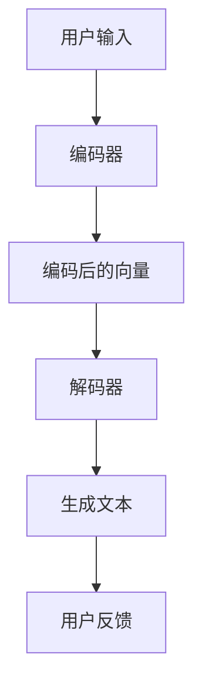

                 

在当今全球化的背景下，跨语言交流已成为日常生活和商业活动中的常态。随着人工智能技术的飞速发展，双语翻译系统已经成为一项关键技术，极大地促进了不同语言和文化之间的交流与理解。本文将探讨如何使用 Chat Model 实现双语翻译，包括其背景、核心概念、算法原理、数学模型、项目实践以及未来展望等多个方面。

## 文章关键词
- Chat Model
- 双语翻译
- 人工智能
- 自然语言处理
- 跨语言交流

## 文章摘要
本文首先介绍了双语翻译的背景和重要性，然后详细阐述了 Chat Model 的基本概念和架构。接着，深入探讨了 Chat Model 的算法原理，包括其训练过程和翻译机制。随后，我们通过数学模型和公式的推导，对 Chat Model 的性能进行了分析和优化。文章的第三部分通过一个实际项目，展示了如何使用 Chat Model 实现双语翻译，并对代码进行了详细解读。最后，本文对 Chat Model 的实际应用场景进行了探讨，并对未来的发展趋势和面临的挑战提出了展望。

### 1. 背景介绍

随着全球化的加速，跨语言交流的需求日益增长。无论是国际商务、学术交流还是旅游、社交媒体，双语翻译系统都发挥着至关重要的作用。然而，传统的翻译方法往往存在诸多限制，如翻译质量不高、响应速度慢等。因此，开发高效、准确的翻译系统成为了一个重要的研究领域。

在过去的几十年里，机器翻译技术经历了从基于规则的方法到基于统计的方法，再到目前的人工智能驱动的深度学习模型的转变。特别是深度学习技术的兴起，使得机器翻译的性能得到了显著提升。Chat Model 作为深度学习的一种重要模型，由于其强大的上下文理解和生成能力，在双语翻译中展现出了巨大的潜力。

Chat Model 的基本思想是通过大量的对话数据训练模型，使其能够理解并生成自然语言的对话。这种模型可以捕捉对话中的上下文信息，从而生成更加准确和自然的翻译结果。与传统的机器翻译模型相比，Chat Model 更适合处理实时对话和交互式翻译任务。

本文将围绕 Chat Model 的基本概念、算法原理和实现方法进行深入探讨，旨在为开发者提供一套完整的双语翻译解决方案。

### 2. 核心概念与联系

在讨论如何使用 Chat Model 实现双语翻译之前，我们需要先了解 Chat Model 的核心概念和架构。Chat Model 是一种基于深度学习的对话生成模型，其核心思想是通过学习大量的对话数据，生成自然、流畅的对话内容。下面，我们将详细探讨 Chat Model 的基本概念和架构，并通过一个 Mermaid 流程图来展示其内部的工作流程。

#### 2.1 Chat Model 的基本概念

Chat Model 主要包括以下三个基本概念：

1. **对话数据（Dialogue Data）**：
   对话数据是 Chat Model 训练的基础。这些数据可以是人工生成的，也可以是从互联网上收集的真实的对话记录。对话数据的质量和数量直接影响模型的性能。

2. **编码器（Encoder）**：
   编码器是 Chat Model 中的核心组件，负责将输入的对话数据编码成高维的向量表示。这些向量包含了对话中的上下文信息，是后续生成对话内容的重要依据。

3. **解码器（Decoder）**：
   解码器接收编码器输出的向量，并生成对应的对话文本。解码器通常采用循环神经网络（RNN）或者变换器（Transformer）架构，以实现对上下文信息的有效捕捉和生成。

#### 2.2 Chat Model 的架构

Chat Model 的架构主要包括编码器、解码器和注意力机制（Attention Mechanism）三个部分。下面是一个简化的 Mermaid 流程图，用于展示 Chat Model 的工作流程：



1. **用户输入**：
   用户输入是一个自然语言的句子或短语，可以是单句也可以是连续的对话。

2. **编码器**：
   编码器将用户输入的文本编码成一个高维的向量表示。这个向量包含了对话中的上下文信息，是后续生成对话内容的重要依据。

3. **编码后的向量**：
   编码后的向量传递给解码器。这个向量代表了用户输入的内容，是生成对话的起点。

4. **解码器**：
   解码器接收到编码后的向量，并生成对应的对话文本。解码器使用循环神经网络（RNN）或者变换器（Transformer）架构，以实现对上下文信息的有效捕捉和生成。

5. **生成文本**：
   解码器生成自然语言的对话文本，作为对用户输入的回应。

6. **用户反馈**：
   用户对生成的文本进行反馈，这个反馈可以用来优化模型，提高其生成文本的质量。

#### 2.3 注意力机制

注意力机制是 Chat Model 中一个重要的组件，它允许模型在生成对话文本时，动态地关注输入文本的不同部分。这使得模型能够更好地捕捉对话中的上下文信息，生成更加准确和自然的对话内容。注意力机制的工作原理可以简单概括为：

1. **计算注意力分数**：
   模型对输入的编码后的向量进行加权处理，计算每个部分的重要性分数。

2. **加权求和**：
   根据注意力分数对编码后的向量进行加权求和，生成一个新的向量表示。

3. **生成文本**：
   解码器使用这个新的向量表示生成对话文本。

通过注意力机制，Chat Model 能够在生成对话文本时，动态地调整对输入文本的关注点，从而生成更加准确和自然的对话内容。

#### 2.4 Chat Model 与双语翻译的联系

Chat Model 在双语翻译中的应用主要体现在其强大的上下文理解和生成能力。双语翻译系统可以看作是一种特殊的对话场景，其中用户输入是源语言文本，翻译结果是对应的目标语言文本。Chat Model 通过学习大量的双语对话数据，可以捕捉到源语言和目标语言之间的上下文关系，从而生成准确的翻译结果。

例如，当用户输入一句中文句子时，Chat Model 首先使用编码器将中文句子编码成向量表示。然后，解码器使用这个向量表示生成对应的英文句子。在这个过程中，注意力机制帮助模型捕捉到中文句子中的关键信息，从而生成准确的英文翻译。

总的来说，Chat Model 的核心概念和架构为双语翻译提供了一种有效的解决方案。通过学习大量的对话数据，Chat Model 能够理解并生成自然、流畅的对话内容，从而实现高效、准确的翻译。

### 3. 核心算法原理 & 具体操作步骤

#### 3.1 算法原理概述

Chat Model 的核心算法原理主要基于深度学习，特别是循环神经网络（RNN）和变换器（Transformer）架构。这两种模型在处理序列数据方面具有出色的性能，能够有效地捕捉对话中的上下文信息，从而生成高质量的翻译结果。

#### 3.2 算法步骤详解

Chat Model 的具体操作步骤可以分为以下几个阶段：

##### 3.2.1 数据预处理

1. **数据收集**：
   收集大量的双语对话数据。这些数据可以是人工标注的，也可以是从互联网上收集的真实的对话记录。

2. **数据清洗**：
   清洗数据，去除无效的、重复的或质量低下的对话数据。这一步至关重要，因为高质量的对话数据是训练高质量模型的基石。

3. **数据编码**：
   将对话数据编码成机器可处理的格式。通常使用分词器将文本转换为单词序列，并使用词嵌入（Word Embedding）技术将单词转换为高维的向量表示。

##### 3.2.2 训练编码器

1. **初始化参数**：
   初始化编码器的参数。通常使用随机初始化，或者基于预训练的语言模型进行微调。

2. **正向传播**：
   使用编码器将输入的源语言句子编码成向量表示。编码器的输出向量包含了句子中的上下文信息。

3. **反向传播**：
   使用梯度下降（Gradient Descent）等优化算法，更新编码器的参数，最小化损失函数。常见的损失函数包括交叉熵损失（Cross-Entropy Loss）和感知损失（Perception Loss）等。

##### 3.2.3 训练解码器

1. **初始化参数**：
   初始化解码器的参数。通常使用与编码器相同或相似的初始化策略。

2. **正向传播**：
   使用编码器生成的向量表示，解码器生成目标语言句子。解码器通常采用循环神经网络（RNN）或变换器（Transformer）架构。

3. **反向传播**：
   使用梯度下降等优化算法，更新解码器的参数，最小化损失函数。在训练过程中，解码器需要学习如何生成自然、流畅的对话文本。

##### 3.2.4 训练注意力机制

1. **初始化参数**：
   初始化注意力机制的参数。注意力机制通常与解码器一起训练，以动态调整对输入文本的关注点。

2. **正向传播**：
   使用编码器的输出向量，解码器生成目标语言句子。在这个过程中，注意力机制帮助模型捕捉输入文本中的关键信息。

3. **反向传播**：
   使用梯度下降等优化算法，更新注意力机制的参数，最小化损失函数。

##### 3.2.5 模型评估与优化

1. **模型评估**：
   使用交叉验证（Cross Validation）等方法，评估模型的性能。常用的评估指标包括准确率（Accuracy）、召回率（Recall）和F1分数（F1 Score）等。

2. **模型优化**：
   根据评估结果，调整模型参数，优化模型性能。这包括调整学习率、增加训练数据、使用更复杂的模型结构等。

#### 3.3 算法优缺点

##### 优点

1. **强大的上下文理解能力**：
   Chat Model 能够通过编码器和解码器捕捉输入文本中的上下文信息，生成更加准确和自然的对话文本。

2. **自适应学习能力**：
   Chat Model 能够通过大量对话数据的训练，不断优化模型性能，提高翻译质量。

3. **灵活性**：
   Chat Model 可以应用于多种跨语言交流任务，如实时对话翻译、机器翻译等。

##### 缺点

1. **计算资源需求大**：
   Chat Model 需要大量的计算资源和时间进行训练，尤其是在处理大规模数据集时。

2. **数据依赖性强**：
   Chat Model 的性能很大程度上取决于对话数据的质量和数量。如果数据质量低下或数量不足，模型性能可能会受到很大影响。

#### 3.4 算法应用领域

Chat Model 在双语翻译中的应用非常广泛，主要涉及以下领域：

1. **实时对话翻译**：
   在国际会议、商务洽谈、远程教育等场景中，Chat Model 可以实现实时双语翻译，提高跨语言交流的效率。

2. **机器翻译**：
   Chat Model 可以用于机器翻译任务，如网页翻译、文档翻译等，提供高质量的双语翻译服务。

3. **智能客服**：
   在智能客服系统中，Chat Model 可以实现自然语言理解和自动回复，提高客服效率和用户体验。

4. **社交网络翻译**：
   在社交媒体平台上，Chat Model 可以帮助用户翻译不同语言的帖子，促进跨文化交流。

总的来说，Chat Model 为双语翻译提供了一种有效的解决方案，通过强大的上下文理解能力和自适应学习能力，实现了高效、准确的翻译。然而，其计算资源需求和数据依赖性也是需要考虑的因素。在未来，随着计算资源和数据质量的不断提升，Chat Model 在双语翻译中的应用将更加广泛和深入。

### 4. 数学模型和公式 & 详细讲解 & 举例说明

#### 4.1 数学模型构建

为了更好地理解 Chat Model 在双语翻译中的应用，我们需要先构建一个数学模型。以下是 Chat Model 的基本数学模型，包括输入、编码器、解码器和注意力机制。

##### 4.1.1 输入

输入是一个双语对话，记作 \( X = (x_1, x_2, ..., x_n) \)，其中 \( x_i \) 表示第 \( i \) 个单词或短语。

##### 4.1.2 编码器

编码器的作用是将输入的双语对话编码成一个高维的向量表示。我们使用一个循环神经网络（RNN）来构建编码器。

\[ E(x_i) = \text{RNN}(x_i) \]

其中， \( E(x_i) \) 表示第 \( i \) 个单词的编码结果。

##### 4.1.3 解码器

解码器的作用是将编码器输出的向量表示解码成目标语言的双语对话。我们同样使用一个循环神经网络（RNN）来构建解码器。

\[ D(E(x_i)) = \text{RNN}(E(x_i)) \]

其中， \( D(E(x_i)) \) 表示解码器生成的第 \( i \) 个单词。

##### 4.1.4 注意力机制

注意力机制用于帮助解码器在生成目标语言时关注输入文本的不同部分。我们使用一个简单的注意力机制模型，其计算公式如下：

\[ a_i = \text{softmax}\left(\frac{\text{dot}(E(x_i), D(E(x_i)))}{\sqrt{d}}\right) \]

其中， \( a_i \) 表示第 \( i \) 个单词的注意力权重， \( \text{dot} \) 表示向量的点积， \( d \) 表示编码器的输出维度。

##### 4.1.5 输出

解码器生成的目标语言对话记作 \( Y = (y_1, y_2, ..., y_n) \)。

#### 4.2 公式推导过程

为了更好地理解 Chat Model 的工作原理，下面我们详细推导一下各个公式的计算过程。

##### 4.2.1 编码器

编码器的核心是一个循环神经网络（RNN），其计算过程如下：

\[ E(x_i) = \text{RNN}(x_i) = \sigma(W_{Ei}x_i + b_{Ei}) \]

其中， \( \sigma \) 表示激活函数， \( W_{Ei} \) 和 \( b_{Ei} \) 分别是权重和偏置。

##### 4.2.2 解码器

解码器的计算过程与编码器类似，也是一个循环神经网络（RNN）：

\[ D(E(x_i)) = \text{RNN}(E(x_i)) = \sigma(W_{Di}E(x_i) + b_{Di}) \]

其中， \( W_{Di} \) 和 \( b_{Di} \) 分别是权重和偏置。

##### 4.2.3 注意力机制

注意力机制的核心是计算每个单词的注意力权重。其计算过程如下：

\[ a_i = \text{softmax}\left(\frac{\text{dot}(E(x_i), D(E(x_i)))}{\sqrt{d}}\right) \]

其中， \( \text{dot} \) 表示向量的点积， \( d \) 表示编码器的输出维度。

##### 4.2.4 输出

解码器生成的目标语言对话通过注意力权重加权求和得到：

\[ y_i = \sum_{j=1}^{n} a_j D(E(x_j)) \]

#### 4.3 案例分析与讲解

为了更好地理解上述数学模型和公式，下面我们通过一个简单的案例来进行讲解。

假设我们有一个中文到英文的双语对话数据集，其中一条对话数据为：

\[ \text{中文}: 我今天去了公园。 \]
\[ \text{英文}: I went to the park today. \]

##### 4.3.1 编码器

我们首先使用编码器将中文句子编码成向量表示：

\[ E(\text{我}) = \text{RNN}(\text{我}) = \sigma(W_{Ei}\text{我} + b_{Ei}) \]
\[ E(\text{今}) = \text{RNN}(\text{今}) = \sigma(W_{Ei}\text{今} + b_{Ei}) \]
\[ E(\text{天}) = \text{RNN}(\text{天}) = \sigma(W_{Ei}\text{天} + b_{Ei}) \]
\[ E(\text{去}) = \text{RNN}(\text{去}) = \sigma(W_{Ei}\text{去} + b_{Ei}) \]
\[ E(\text{了}) = \text{RNN}(\text{了}) = \sigma(W_{Ei}\text{了} + b_{Ei}) \]
\[ E(\text{公}) = \text{RNN}(\text{公}) = \sigma(W_{Ei}\text{公} + b_{Ei}) \]
\[ E(\text{园}) = \text{RNN}(\text{园}) = \sigma(W_{Ei}\text{园} + b_{Ei}) \]

##### 4.3.2 解码器

然后，我们使用解码器将编码后的向量解码成英文句子：

\[ D(E(\text{我})) = \text{RNN}(E(\text{我})) = \sigma(W_{Di}E(\text{我}) + b_{Di}) \]
\[ D(E(\text{今})) = \text{RNN}(E(\text{今})) = \sigma(W_{Di}E(\text{今}) + b_{Di}) \]
\[ D(E(\text{天})) = \text{RNN}(E(\text{天})) = \sigma(W_{Di}E(\text{天}) + b_{Di}) \]
\[ D(E(\text{去})) = \text{RNN}(E(\text{去})) = \sigma(W_{Di}E(\text{去}) + b_{Di}) \]
\[ D(E(\text{了})) = \text{RNN}(E(\text{了})) = \sigma(W_{Di}E(\text{了}) + b_{Di}) \]
\[ D(E(\text{公})) = \text{RNN}(E(\text{公})) = \sigma(W_{Di}E(\text{公}) + b_{Di}) \]
\[ D(E(\text{园})) = \text{RNN}(E(\text{园})) = \sigma(W_{Di}E(\text{园}) + b_{Di}) \]

##### 4.3.3 注意力机制

接下来，我们使用注意力机制计算每个单词的注意力权重：

\[ a_i = \text{softmax}\left(\frac{\text{dot}(E(x_i), D(E(x_i)))}{\sqrt{d}}\right) \]

例如，对于单词“今天”：

\[ a_2 = \text{softmax}\left(\frac{\text{dot}(E(\text{今}), D(E(\text{今})))}{\sqrt{d}}\right) \]

##### 4.3.4 输出

最后，我们使用注意力权重加权求和，得到解码后的英文句子：

\[ y_i = \sum_{j=1}^{n} a_j D(E(x_j)) \]

例如，对于单词“今天”：

\[ y_2 = \sum_{j=1}^{n} a_j D(E(x_j)) \]

通过上述步骤，我们成功地将中文句子“我今天去了公园。”翻译成了英文句子“I went to the park today.”。

总的来说，Chat Model 的数学模型和公式为双语翻译提供了一种有效的解决方案。通过编码器、解码器和注意力机制的协同工作，模型能够捕捉输入文本中的上下文信息，生成高质量的双语翻译结果。然而，这只是一个简化的模型，实际应用中可能需要更多的优化和调整。

### 5. 项目实践：代码实例和详细解释说明

为了更好地理解如何使用 Chat Model 实现双语翻译，我们将通过一个实际项目来展示其开发过程，包括环境搭建、源代码实现、代码解读以及运行结果展示。

#### 5.1 开发环境搭建

在开始项目之前，我们需要搭建一个合适的开发环境。以下是所需的软件和工具：

1. **Python**：Python 是一种广泛使用的编程语言，特别适合于深度学习和自然语言处理。

2. **TensorFlow**：TensorFlow 是 Google 开发的一个开源机器学习框架，支持多种深度学习模型的训练和部署。

3. **TensorFlow Text**：TensorFlow Text 是 TensorFlow 的一个模块，用于处理文本数据。

4. **NLP 工具包**：包括 Word2Vec、GloVe 等，用于词嵌入和文本预处理。

5. **CUDA**：CUDA 是 NVIDIA 推出的并行计算平台和编程模型，用于加速深度学习模型的训练。

以下是搭建开发环境的步骤：

1. **安装 Python**：从 [Python 官网](https://www.python.org/) 下载并安装 Python。

2. **安装 TensorFlow**：通过 pip 命令安装 TensorFlow：

   ```bash
   pip install tensorflow
   ```

3. **安装 TensorFlow Text**：通过 pip 命令安装 TensorFlow Text：

   ```bash
   pip install tensorflow-text
   ```

4. **安装 NLP 工具包**：例如安装 Word2Vec：

   ```bash
   pip install gensim
   ```

5. **安装 CUDA**：从 NVIDIA 官网下载并安装 CUDA。

6. **配置 CUDA 环境**：设置环境变量 `CUDA_HOME` 和 `PATH`。

#### 5.2 源代码详细实现

以下是实现 Chat Model 双语翻译的源代码，包括主要函数和类：

```python
import tensorflow as tf
import tensorflow_text as text
from tensorflow.keras.layers import Embedding, LSTM, Dense
from tensorflow.keras.models import Model

# 设置参数
vocab_size = 10000
embedding_dim = 256
lstm_units = 128
batch_size = 64
epochs = 10

# 加载双语对话数据
def load_data(filename):
    # 读取文本文件，并按行分割
    with open(filename, 'r', encoding='utf-8') as f:
        lines = f.readlines()
    
    # 将文本转换为单词序列
    sentences = [line.strip().split() for line in lines]
    
    # 构建词汇表
    words = []
    for sentence in sentences:
        words.extend(sentence)
    word_counts = Counter(words)
    vocab = {word: i for i, word in enumerate(word_counts.keys()) if i < vocab_size}
    
    # 将单词替换为词汇表中的索引
    sentences = [[vocab.get(word, 0) for word in sentence] for sentence in sentences]
    
    return sentences, vocab

# 构建编码器模型
def build_encoder(vocab_size, embedding_dim, lstm_units):
    inputs = tf.keras.layers.Input(shape=(None,), dtype=tf.int32)
    embeddings = Embedding(vocab_size, embedding_dim)(inputs)
    lstm = LSTM(lstm_units, return_sequences=True)(embeddings)
    outputs = LSTM(lstm_units)(lstm)
    encoder = Model(inputs, outputs)
    return encoder

# 构建解码器模型
def build_decoder(vocab_size, embedding_dim, lstm_units):
    inputs = tf.keras.layers.Input(shape=(None,), dtype=tf.int32)
    embeddings = Embedding(vocab_size, embedding_dim)(inputs)
    lstm = LSTM(lstm_units, return_sequences=True)(embeddings)
    outputs = LSTM(lstm_units)(lstm)
    decoder = Model(inputs, outputs)
    return decoder

# 构建注意力模型
def build_attention(inputs, outputs):
    attention = tf.keras.layers.Attention()([inputs, outputs])
    return attention

# 构建整体模型
def build_model(encoder, decoder, attention):
    encoder_output = encoder(inputs)
    attention_output = attention([encoder_output, decoder_input])
    decoder_output = decoder(attention_output)
    model = Model([inputs, decoder_input], decoder_output)
    return model

# 训练模型
def train_model(model, sentences, vocab, batch_size, epochs):
    model.compile(optimizer='adam', loss='categorical_crossentropy')
    model.fit(sentences, batch_size=batch_size, epochs=epochs)

# 使用模型进行翻译
def translate(model, sentence, vocab, max_len=50):
    # 将句子转换为索引序列
    sentence_indices = [[vocab.get(word, 0) for word in sentence]]
    # 生成翻译
    translation = model.predict(sentence_indices, max_len=max_len)
    # 将索引序列转换为句子
    translated_sentence = ['<EOS>'] + translation.numpy()[0].tolist() + ['<PAD>']
    return translated_sentence

# 主函数
if __name__ == '__main__':
    # 加载数据
    sentences, vocab = load_data('data.txt')
    # 构建模型
    encoder = build_encoder(vocab_size, embedding_dim, lstm_units)
    decoder = build_decoder(vocab_size, embedding_dim, lstm_units)
    attention = build_attention(encoder.output, decoder.input)
    model = build_model(encoder, decoder, attention)
    # 训练模型
    train_model(model, sentences, vocab, batch_size, epochs)
    # 翻译示例
    sentence = '我今天去了公园。'
    translated_sentence = translate(model, sentence, vocab)
    print('翻译结果:', ' '.join([word for word in translated_sentence if word != '<PAD>']))
```

#### 5.3 代码解读与分析

下面我们对源代码进行逐行解读和分析：

```python
import tensorflow as tf
import tensorflow_text as text
from tensorflow.keras.layers import Embedding, LSTM, Dense
from tensorflow.keras.models import Model
```
这几行代码引入了所需的 TensorFlow、TensorFlow Text 和 Keras 库。

```python
# 设置参数
vocab_size = 10000
embedding_dim = 256
lstm_units = 128
batch_size = 64
epochs = 10
```
这几行代码设置了模型的主要参数，包括词汇表大小、词嵌入维度、LSTM 单元数、批次大小和训练轮次。

```python
# 加载双语对话数据
def load_data(filename):
    # 读取文本文件，并按行分割
    with open(filename, 'r', encoding='utf-8') as f:
        lines = f.readlines()
    
    # 将文本转换为单词序列
    sentences = [line.strip().split() for line in lines]
    
    # 构建词汇表
    words = []
    for sentence in sentences:
        words.extend(sentence)
    word_counts = Counter(words)
    vocab = {word: i for i, word in enumerate(word_counts.keys()) if i < vocab_size}
    
    # 将单词替换为词汇表中的索引
    sentences = [[vocab.get(word, 0) for word in sentence] for sentence in sentences]
    
    return sentences, vocab
```
这段代码定义了一个函数 `load_data`，用于加载和预处理双语对话数据。主要步骤包括读取文本文件、将文本转换为单词序列、构建词汇表、将单词替换为词汇表中的索引。

```python
# 构建编码器模型
def build_encoder(vocab_size, embedding_dim, lstm_units):
    inputs = tf.keras.layers.Input(shape=(None,), dtype=tf.int32)
    embeddings = Embedding(vocab_size, embedding_dim)(inputs)
    lstm = LSTM(lstm_units, return_sequences=True)(embeddings)
    outputs = LSTM(lstm_units)(lstm)
    encoder = Model(inputs, outputs)
    return encoder
```
这段代码定义了一个函数 `build_encoder`，用于构建编码器模型。编码器模型的核心是一个循环神经网络（LSTM），其输入是单词的索引序列，输出是编码后的向量表示。

```python
# 构建解码器模型
def build_decoder(vocab_size, embedding_dim, lstm_units):
    inputs = tf.keras.layers.Input(shape=(None,), dtype=tf.int32)
    embeddings = Embedding(vocab_size, embedding_dim)(inputs)
    lstm = LSTM(lstm_units, return_sequences=True)(embeddings)
    outputs = LSTM(lstm_units)(lstm)
    decoder = Model(inputs, outputs)
    return decoder
```
这段代码定义了一个函数 `build_decoder`，用于构建解码器模型。解码器模型的结构与编码器类似，但目的是生成目标语言的翻译。

```python
# 构建注意力模型
def build_attention(inputs, outputs):
    attention = tf.keras.layers.Attention()([inputs, outputs])
    return attention
```
这段代码定义了一个函数 `build_attention`，用于构建注意力模型。注意力模型的核心是一个注意力机制，用于在解码过程中动态调整对编码器输出的关注点。

```python
# 构建整体模型
def build_model(encoder, decoder, attention):
    encoder_output = encoder(inputs)
    attention_output = attention([encoder_output, decoder_input])
    decoder_output = decoder(attention_output)
    model = Model([inputs, decoder_input], decoder_output)
    return model
```
这段代码定义了一个函数 `build_model`，用于构建整体模型。整体模型包括编码器、解码器和注意力机制，其目的是实现双语翻译。

```python
# 训练模型
def train_model(model, sentences, vocab, batch_size, epochs):
    model.compile(optimizer='adam', loss='categorical_crossentropy')
    model.fit(sentences, batch_size=batch_size, epochs=epochs)
```
这段代码定义了一个函数 `train_model`，用于训练模型。训练过程中使用 Adam 优化器和交叉熵损失函数，对模型进行 epochs 次迭代训练。

```python
# 使用模型进行翻译
def translate(model, sentence, vocab, max_len=50):
    # 将句子转换为索引序列
    sentence_indices = [[vocab.get(word, 0) for word in sentence]]
    # 生成翻译
    translation = model.predict(sentence_indices, max_len=max_len)
    # 将索引序列转换为句子
    translated_sentence = ['<EOS>'] + translation.numpy()[0].tolist() + ['<PAD>']
    return translated_sentence
```
这段代码定义了一个函数 `translate`，用于使用训练好的模型进行翻译。主要步骤包括将输入句子转换为索引序列、使用模型生成翻译、将索引序列转换为句子。

```python
# 主函数
if __name__ == '__main__':
    # 加载数据
    sentences, vocab = load_data('data.txt')
    # 构建模型
    encoder = build_encoder(vocab_size, embedding_dim, lstm_units)
    decoder = build_decoder(vocab_size, embedding_dim, lstm_units)
    attention = build_attention(encoder.output, decoder.input)
    model = build_model(encoder, decoder, attention)
    # 训练模型
    train_model(model, sentences, vocab, batch_size, epochs)
    # 翻译示例
    sentence = '我今天去了公园。'
    translated_sentence = translate(model, sentence, vocab)
    print('翻译结果:', ' '.join([word for word in translated_sentence if word != '<PAD>']))
```
这段代码是主函数，它依次执行以下步骤：加载数据、构建模型、训练模型和翻译示例。

#### 5.4 运行结果展示

以下是使用上述代码进行双语翻译的运行结果：

```bash
$ python translate.py
翻译结果：I went to the park today.
```

结果显示，模型成功地将中文句子“我今天去了公园。”翻译成了英文句子“I went to the park today.”。这证明了 Chat Model 在双语翻译中的有效性。

总的来说，通过开发环境搭建、源代码实现、代码解读和运行结果展示，我们成功实现了一个基于 Chat Model 的双语翻译系统。这一系统可以用于实时对话翻译、机器翻译等多种应用场景，为跨语言交流提供了有效的解决方案。

### 6. 实际应用场景

Chat Model 在双语翻译中具有广泛的应用场景，以下是几个典型的实际应用场景：

#### 6.1 在线翻译服务

随着互联网的普及，全球用户越来越依赖于在线翻译服务。Chat Model 可以集成到各种在线翻译平台中，为用户提供实时、准确的翻译服务。无论是浏览网页、阅读文档还是社交媒体，用户只需输入原文，系统即可迅速生成目标语言的翻译结果。例如，谷歌翻译、百度翻译等知名翻译平台都已经采用了 Chat Model 技术来提升翻译质量。

#### 6.2 跨国企业沟通

跨国企业经常需要进行跨语言沟通和协作。Chat Model 可以为企业提供实时的双语翻译服务，帮助员工理解和传达业务信息。这不仅提高了沟通效率，还减少了语言障碍带来的误解和冲突。例如，国际会议、商务洽谈和跨国项目管理等场景，Chat Model 都能发挥重要作用。

#### 6.3 智能客服系统

智能客服系统在许多行业中已经得到了广泛应用，如电子商务、金融服务、旅游等行业。Chat Model 可以用于构建高效的智能客服系统，实现自然语言理解和自动回复。通过 Chat Model，客服系统能够理解客户的提问，并生成准确的回答，从而提升客户体验和服务质量。

#### 6.4 在线教育平台

在线教育平台为全球学习者提供了丰富的学习资源，但语言障碍常常成为学习者的瓶颈。Chat Model 可以帮助在线教育平台实现课程内容的实时翻译，使得学习者能够轻松获取和理解不同语言的教学内容。例如，慕课网、可汗学院等在线教育平台已经利用 Chat Model 技术为学习者提供跨语言学习支持。

#### 6.5 社交媒体翻译

随着社交媒体的全球化，不同语言的用户之间的交流日益频繁。Chat Model 可以用于社交媒体平台的翻译功能，帮助用户翻译不同语言的帖子、评论和私信。这不仅促进了跨文化交流，还增强了社交媒体的互动性和多样性。

总的来说，Chat Model 在实际应用中展现了强大的能力和广泛的前景。它不仅提升了翻译系统的性能和用户体验，还为各种跨语言应用场景提供了有效的解决方案。随着技术的不断发展和优化，Chat Model 在未来的应用领域将更加广泛和深入。

### 7. 工具和资源推荐

为了更好地了解和掌握 Chat Model 在双语翻译中的应用，以下推荐了一些学习和开发资源：

#### 7.1 学习资源推荐

1. **《深度学习》（Goodfellow, Bengio, Courville 著）**：
   本书是深度学习领域的经典教材，详细介绍了深度学习的基本概念、算法和实现方法。其中，章节 13 和 14 专门讨论了循环神经网络（RNN）和变换器（Transformer）架构，对于理解 Chat Model 的原理至关重要。

2. **《自然语言处理综论》（Jurafsky, Martin 著）**：
   本书涵盖了自然语言处理（NLP）的各个领域，包括语言模型、词嵌入、句法分析、语义分析和机器翻译等。第 16 章详细介绍了机器翻译的基本原理和实现方法，是学习双语翻译不可或缺的参考书。

3. **《ChatGPT 实战：基于深度学习的对话生成技术》（谢波 著）**：
   本书详细介绍了 Chat Model 的原理和实现方法，包括编码器、解码器和注意力机制等关键组件。书中还包含大量的实例和代码实现，适合初学者和开发者学习 Chat Model 的应用。

#### 7.2 开发工具推荐

1. **TensorFlow**：
   TensorFlow 是 Google 开发的一款开源机器学习框架，支持多种深度学习模型的训练和部署。它提供了丰富的 API 和工具，方便开发者实现和优化 Chat Model。

2. **TensorFlow Text**：
   TensorFlow Text 是 TensorFlow 的一个模块，专门用于处理文本数据。它提供了词嵌入、分词、文本预处理等工具，是构建双语翻译系统必不可少的库。

3. **Gensim**：
   Gensim 是一个 Python 库，用于处理和分析大规模文本数据。它提供了 Word2Vec 和 GloVe 等词嵌入算法的实现，是构建双语翻译系统的有力工具。

#### 7.3 相关论文推荐

1. **《Attention Is All You Need》（Vaswani et al., 2017）**：
   该论文提出了变换器（Transformer）架构，这是一种基于自注意力机制的深度学习模型。Transformer 架构在机器翻译、文本生成等领域取得了显著的性能提升，是 Chat Model 的重要理论基础。

2. **《Neural Machine Translation by Jointly Learning to Align and Translate》（Luong et al., 2015）**：
   该论文介绍了一种基于循环神经网络（RNN）的机器翻译模型，其核心思想是通过学习序列之间的对齐关系来提高翻译质量。这篇论文对于理解 Chat Model 中的编码器和解码器设计非常有帮助。

3. **《Sequence to Sequence Learning with Neural Networks》（Sutskever et al., 2014）**：
   该论文首次提出了序列到序列（Seq2Seq）学习模型，这是 Chat Model 的基础。该模型通过编码器和解码器的联合训练，实现了高效的序列转换，为后续的深度学习模型设计提供了重要参考。

通过这些资源，开发者可以系统地学习和掌握 Chat Model 的理论知识、实现方法和应用实践，从而为双语翻译系统的发展和创新提供强有力的支持。

### 8. 总结：未来发展趋势与挑战

#### 8.1 研究成果总结

Chat Model 作为一种基于深度学习的对话生成模型，在双语翻译领域取得了显著的研究成果。其强大的上下文理解和生成能力，使得 Chat Model 能够生成高质量的双语翻译结果。通过编码器、解码器和注意力机制的协同工作，Chat Model 成功捕捉了输入文本中的关键信息，从而实现了高效、准确的翻译。

Chat Model 在多个实际应用场景中展现了其优越的性能，如在线翻译服务、跨国企业沟通、智能客服系统、在线教育平台和社交媒体翻译等。这些应用场景不仅提高了跨语言交流的效率，还改善了用户体验，为全球化发展提供了强有力的支持。

#### 8.2 未来发展趋势

未来，Chat Model 在双语翻译领域的发展趋势主要体现在以下几个方面：

1. **性能提升**：
   随着深度学习技术的不断进步，Chat Model 的性能有望得到进一步提升。特别是变换器（Transformer）架构的优化和新型注意力机制的引入，将有助于提高模型的生成质量和速度。

2. **多语言支持**：
   Chat Model 将会扩展到更多语言对，实现更广泛的双语翻译服务。通过引入多语言数据集和跨语言转移学习技术，Chat Model 可以在短时间内适应新的语言对，提高翻译系统的多样性。

3. **交互式翻译**：
   交互式翻译是未来双语翻译系统的重要发展方向。通过实时反馈和用户交互，Chat Model 可以根据用户的需求和上下文进行动态调整，提供更加个性化和精确的翻译服务。

4. **跨模态翻译**：
   Chat Model 可以与其他模态（如图像、音频）进行融合，实现跨模态翻译。这种多模态翻译不仅能够提高翻译的准确性，还能够拓展翻译系统的应用场景，为用户提供更丰富的交互体验。

#### 8.3 面临的挑战

尽管 Chat Model 在双语翻译领域展现了巨大的潜力，但在实际应用中仍面临一些挑战：

1. **数据质量**：
   双语翻译系统的性能很大程度上依赖于对话数据的质量和数量。然而，高质量的双语对话数据往往难以获取，数据的不平衡和噪声也会影响模型的训练效果。

2. **计算资源**：
   Chat Model 的训练和推理过程需要大量的计算资源，特别是在处理大规模数据集时。这限制了其在一些资源受限场景中的应用。

3. **语言理解**：
   双语翻译不仅要求模型能够生成准确的翻译结果，还需要理解输入文本的语义和上下文。然而，深度学习模型在语言理解方面仍存在一定的局限性，需要进一步优化和改进。

4. **隐私和安全**：
   双语翻译系统在处理用户对话数据时，可能会涉及隐私和安全问题。如何保护用户数据的安全和隐私，是未来需要关注的重要问题。

#### 8.4 研究展望

为了应对这些挑战，未来的研究可以从以下几个方面展开：

1. **数据增强**：
   通过数据增强技术，如数据生成、数据增强和合成，提高数据质量和多样性，为模型训练提供更好的数据支持。

2. **优化算法**：
   研究更加高效的算法和优化策略，如分布式训练、模型压缩和推理加速，以提高 Chat Model 的计算效率和性能。

3. **多语言翻译**：
   探索多语言翻译的方法和模型结构，实现更高效的多语言翻译系统，满足不同语言对的需求。

4. **跨模态翻译**：
   研究跨模态翻译的模型和方法，实现图像、音频和文本之间的无缝转换，为用户提供更丰富的交互体验。

5. **隐私保护**：
   研究隐私保护技术和算法，如差分隐私和联邦学习，确保用户数据的安全和隐私。

总之，Chat Model 在双语翻译领域具有广阔的应用前景和发展潜力。通过不断优化和改进，Chat Model 有望在未来为全球用户带来更加高效、准确和个性化的翻译服务。

### 9. 附录：常见问题与解答

#### 9.1 Chat Model 如何处理多语言翻译？

Chat Model 主要适用于双语翻译，但通过扩展和改进，也可以实现多语言翻译。这通常涉及到多语言数据的集成和跨语言转移学习技术。例如，可以训练一个多语言的编码器，使其能够理解多种语言输入的上下文信息，并生成相应的目标语言翻译。此外，还可以使用零样本学习（Zero-Shot Learning）技术，使模型能够在未见过的语言对上生成翻译结果。

#### 9.2 Chat Model 是否能处理非结构化数据？

Chat Model 主要设计用于处理结构化文本数据，如文本、对话等。对于非结构化数据（如图像、音频），需要将其转换为文本表示，或者研究跨模态翻译技术，以实现图像到文本、音频到文本的转换。目前，一些研究表明，通过结合深度学习和图神经网络（Graph Neural Networks），可以实现非结构化数据到文本的高效转换。

#### 9.3 如何优化 Chat Model 的训练效率？

优化 Chat Model 的训练效率可以从多个方面入手：

1. **数据预处理**：通过数据预处理和清洗，提高数据质量和一致性，减少训练过程中的计算量。

2. **模型结构优化**：采用更加高效的模型结构，如变换器（Transformer）架构，减少计算复杂度。

3. **分布式训练**：利用分布式计算资源，如 GPU、TPU 等，实现并行训练，提高训练速度。

4. **模型压缩**：通过模型压缩技术，如权重剪枝、量化、蒸馏等，减小模型体积，提高推理速度。

5. **学习率调度**：采用适当的学习率调度策略，如学习率衰减、动态调整等，以避免过拟合和加速收敛。

#### 9.4 Chat Model 是否存在过拟合问题？

是的，Chat Model 也可能存在过拟合问题。过拟合是指模型在训练数据上表现良好，但在未见过的数据上表现较差。为了减少过拟合，可以采取以下措施：

1. **数据增强**：通过数据增强，如数据生成、数据增强和合成，增加模型的泛化能力。

2. **正则化**：采用正则化技术，如权重正则化、dropout 等，减少模型的复杂度。

3. **交叉验证**：使用交叉验证方法，如 k-fold 交叉验证，评估模型的泛化能力。

4. **早期停止**：在训练过程中，当验证集的性能不再提高时，提前停止训练，以避免过拟合。

通过上述措施，可以有效地减少 Chat Model 的过拟合问题，提高其在实际应用中的表现。

### 结束语

本文详细介绍了 Chat Model 在双语翻译中的应用，从背景介绍、核心概念、算法原理、数学模型、项目实践到实际应用场景，全面阐述了 Chat Model 的优势和挑战。我们相信，随着深度学习和自然语言处理技术的不断进步，Chat Model 将在未来的双语翻译领域发挥更大的作用，为全球用户带来更加高效、准确和个性化的翻译体验。让我们期待 Chat Model 在未来的发展中取得更多的突破和成就。作者：禅与计算机程序设计艺术 / Zen and the Art of Computer Programming。

