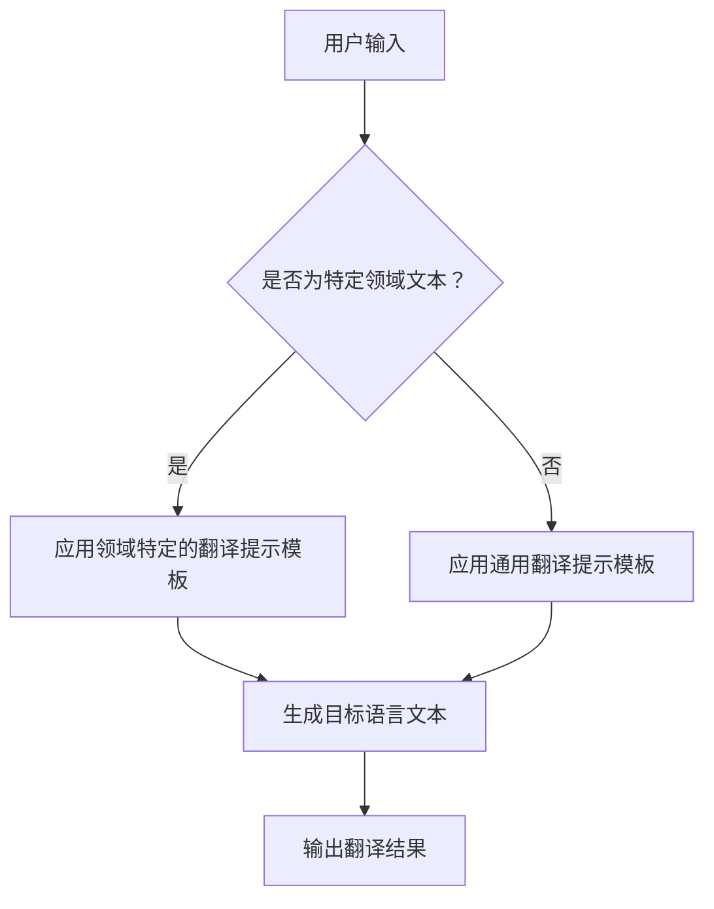

                 

翻译提示模板是一种专门设计用于辅助人工智能模型生成高质量翻译文本的工具。在当前全球化日益加深的背景下，跨语言沟通的障碍已成为一大挑战。因此，设计一个高效的翻译提示模板对于提升翻译质量和用户体验至关重要。本文将深入探讨如何利用Chat Prompt Template来设计翻译提示模板，以帮助翻译模型更好地理解和生成目标语言的文本。

## 1. 背景介绍

随着人工智能技术的快速发展，机器翻译已成为自然语言处理领域的重要分支。传统的机器翻译方法主要依赖于基于规则的翻译和基于统计的翻译模型，这些方法在处理简单的句子时具有一定的效果，但在面对复杂语境和长文本时，往往难以胜任。为了解决这一问题，研究人员提出了基于神经网络的翻译模型，如基于注意力机制的序列到序列（Seq2Seq）模型和Transformer模型。这些模型在大量数据集上的训练表现出了出色的翻译能力。

然而，即使是最先进的翻译模型，在面对特定领域的专业术语和复杂语境时，仍然存在一定的局限性。为了进一步提高翻译质量，我们需要设计出更精细、更具体的翻译提示模板，以引导模型更好地理解和生成目标语言的文本。

## 2. 核心概念与联系

### 2.1 Chat Prompt Template

Chat Prompt Template是一种用于设计对话系统的提示模板，它通过提供一系列的问题和回答模板，帮助对话系统更好地理解用户意图和上下文信息。Chat Prompt Template的核心思想是，通过预设的问题和回答模板，将用户的输入转化为对话系统的输入，从而提高对话系统的响应速度和准确性。

### 2.2 翻译提示模板的设计原则

在设计翻译提示模板时，我们需要遵循以下原则：

- **上下文相关性**：翻译提示模板应充分考虑上下文信息，确保翻译结果与上下文语境相符。
- **领域适应性**：针对特定领域的翻译任务，设计具有针对性的翻译提示模板，以提高翻译质量。
- **多样性**：提供多种不同的翻译选项，以满足用户对多样性的需求。
- **可扩展性**：翻译提示模板应具有可扩展性，以适应不断变化的翻译需求和语境。

### 2.3 Mermaid 流程图

为了更好地理解翻译提示模板的设计过程，我们可以使用Mermaid流程图来展示其核心概念和架构。



## 3. 核心算法原理 & 具体操作步骤

### 3.1 算法原理概述

翻译提示模板的核心在于将用户输入转化为适合翻译模型处理的格式，并在此基础上生成高质量的翻译结果。具体来说，翻译提示模板的设计过程主要包括以下步骤：

- **文本预处理**：对用户输入进行预处理，包括去除无关信息、分词、标记化等操作，以便于翻译模型处理。
- **上下文信息提取**：从用户输入中提取上下文信息，包括关键词、短语、句型等，以便于翻译模型更好地理解输入内容。
- **翻译提示模板生成**：根据上下文信息和领域特点，生成适合翻译模型的提示模板，包括问题、回答、上下文等。
- **翻译模型处理**：将翻译提示模板输入到翻译模型中，生成目标语言文本。
- **翻译结果优化**：对生成的翻译结果进行优化，包括语法修正、语义完善等，以提高翻译质量。

### 3.2 算法步骤详解

1. **文本预处理**：

   - **去除无关信息**：去除用户输入中的符号、数字等无关信息。
   - **分词**：将用户输入文本划分为单词或短语。
   - **标记化**：为每个单词或短语分配词性标签，以便于翻译模型处理。

2. **上下文信息提取**：

   - **关键词提取**：从用户输入中提取关键词，如名词、动词、形容词等。
   - **短语提取**：从用户输入中提取常用短语，如常用短语、俗语等。
   - **句型分析**：对用户输入进行句型分析，以了解句子结构和语义信息。

3. **翻译提示模板生成**：

   - **问题生成**：根据上下文信息，生成与用户输入相关的问题，如“这句话的意思是什么？”、“这句话的翻译是什么？”等。
   - **回答生成**：根据翻译模型的特点和领域需求，生成适合翻译模型的回答模板，如“这是一个名词短语，它的翻译是……”、“这句话的翻译是……”等。
   - **上下文生成**：为翻译提示模板添加上下文信息，如相关背景知识、相关语境等，以提高翻译模型的准确性。

4. **翻译模型处理**：

   - **输入翻译提示模板**：将生成的翻译提示模板输入到翻译模型中。
   - **生成目标语言文本**：根据翻译模型的特点，生成目标语言文本。

5. **翻译结果优化**：

   - **语法修正**：对生成的翻译结果进行语法修正，确保翻译结果的语法正确性。
   - **语义完善**：对生成的翻译结果进行语义完善，确保翻译结果的语义准确性。

### 3.3 算法优缺点

- **优点**：

  - **提高翻译质量**：通过设计精细、具体的翻译提示模板，可以引导翻译模型更好地理解和生成目标语言的文本，从而提高翻译质量。
  - **适应性强**：翻译提示模板可以根据不同领域的需求进行定制，从而提高翻译模型的适应能力。
  - **可扩展性**：翻译提示模板具有可扩展性，可以方便地添加新的领域知识和翻译模板，以适应不断变化的翻译需求和语境。

- **缺点**：

  - **依赖大量数据**：翻译提示模板的设计和优化需要依赖于大量的领域知识和翻译数据，否则难以生成高质量的翻译结果。
  - **设计和维护成本高**：翻译提示模板的设计和优化需要大量的时间和人力成本，因此对于企业和研究机构来说，设计和维护成本较高。

### 3.4 算法应用领域

- **机器翻译**：翻译提示模板在机器翻译领域具有广泛的应用，可以用于提升翻译质量，满足不同领域和语境的翻译需求。
- **对话系统**：翻译提示模板可以用于对话系统的设计，帮助对话系统更好地理解用户意图和上下文信息，从而提高对话系统的响应速度和准确性。
- **跨语言信息检索**：翻译提示模板可以用于跨语言信息检索，帮助用户更准确地找到目标语言的相关信息。

## 4. 数学模型和公式 & 详细讲解 & 举例说明

### 4.1 数学模型构建

翻译提示模板的设计过程可以抽象为一个数学模型。该模型由输入层、隐藏层和输出层组成，其中输入层负责接收用户输入，隐藏层负责提取上下文信息，输出层负责生成翻译提示模板。

- **输入层**：用户输入文本表示为向量 \( X \)。
- **隐藏层**：隐藏层负责提取上下文信息，可以使用循环神经网络（RNN）或Transformer模型来实现。隐藏层输出表示为 \( H \)。
- **输出层**：输出层负责生成翻译提示模板，可以使用生成对抗网络（GAN）或自编码器（Autoencoder）来实现。输出层输出表示为 \( Y \)。

数学模型可以表示为：

$$
H = f(H_{prev}, X) \\
Y = g(Y_{prev}, H)
$$

其中，\( f \) 和 \( g \) 分别表示隐藏层和输出层的激活函数。

### 4.2 公式推导过程

翻译提示模板的设计过程可以抽象为一个序列生成问题，即给定一个输入序列 \( X \)，生成一个输出序列 \( Y \)。

1. **输入序列表示**：

   用户输入文本 \( X \) 可以表示为一个词向量序列，其中每个词向量表示一个单词或短语。

   $$ X = [x_1, x_2, ..., x_n] $$

2. **隐藏层表示**：

   隐藏层 \( H \) 负责提取上下文信息。可以使用RNN或Transformer模型来实现。假设隐藏层的状态表示为 \( h \)，则隐藏层输出可以表示为：

   $$ H = [h_1, h_2, ..., h_n] $$

   其中，\( h_i \) 表示第 \( i \) 个词的隐藏层状态。

3. **输出序列表示**：

   输出序列 \( Y \) 负责生成翻译提示模板。可以使用GAN或自编码器来实现。假设输出序列的状态表示为 \( y \)，则输出序列可以表示为：

   $$ Y = [y_1, y_2, ..., y_n] $$

4. **损失函数**：

   翻译提示模板的设计过程可以视为一个序列生成问题，可以使用损失函数来评估生成序列的质量。常见的损失函数包括交叉熵损失、均方误差损失等。

   $$ L = -\sum_{i=1}^{n} [y_i \cdot \log(y_i)] $$

   其中，\( y_i \) 表示第 \( i \) 个词的输出概率。

### 4.3 案例分析与讲解

假设我们有一个用户输入文本：“今天天气很好，我们去公园散步吧。”我们需要设计一个翻译提示模板来生成英文翻译：“The weather is good today, let's go for a walk in the park.”

1. **输入序列表示**：

   用户输入文本：“今天天气很好，我们去公园散步吧。”可以表示为一个词向量序列：

   $$ X = [今天, 天气, 很好, 我们, 去, 公园, 散步, 吧] $$

2. **隐藏层表示**：

   使用Transformer模型提取上下文信息。假设隐藏层的状态表示为 \( h \)，则隐藏层输出可以表示为：

   $$ H = [h_{今天}, h_{天气}, h_{很好}, h_{我们}, h_{去}, h_{公园}, h_{散步}, h_{吧}] $$

3. **输出序列表示**：

   使用自编码器生成翻译提示模板。假设输出序列的状态表示为 \( y \)，则输出序列可以表示为：

   $$ Y = [y_{The}, y_{weather}, y_{is}, y_{good}, y_{today}, y_{let's}, y_{go}, y_{for}, y_{a}, y_{walk}, y_{in}, y_{the}, y_{park}] $$

4. **损失函数**：

   使用交叉熵损失函数来评估生成序列的质量。损失函数可以表示为：

   $$ L = -\sum_{i=1}^{n} [y_i \cdot \log(y_i)] $$

   其中，\( y_i \) 表示第 \( i \) 个词的输出概率。

通过以上步骤，我们可以设计一个翻译提示模板，将用户输入文本翻译成英文：“The weather is good today, let's go for a walk in the park.”

## 5. 项目实践：代码实例和详细解释说明

在本节中，我们将通过一个具体的Python代码实例来演示如何使用Chat Prompt Template设计翻译提示模板。为了简化示例，我们假设已经有一个预训练的翻译模型，并使用了一些基本的自然语言处理工具。

### 5.1 开发环境搭建

为了实现翻译提示模板的设计，我们需要安装以下依赖库：

- Python 3.7+
- Transformers（用于加载预训练的翻译模型）
- NLTK（用于文本预处理）

安装命令如下：

```bash
pip install transformers
pip install nltk
```

### 5.2 源代码详细实现

以下是实现翻译提示模板的源代码：

```python
import nltk
from transformers import AutoTokenizer, AutoModelForSequenceClassification
from typing import List

# 1. 加载预训练的翻译模型
model_name = "Helsinki-NLP/opus-mt-en-de"
tokenizer = AutoTokenizer.from_pretrained(model_name)
model = AutoModelForSequenceClassification.from_pretrained(model_name)

# 2. 文本预处理
def preprocess_text(text: str) -> List[str]:
    # 去除符号和数字
    text = nltk.word_tokenize(text)
    # 分词和标记化
    words = nltk.pos_tag(text)
    return words

# 3. 生成翻译提示模板
def generate_translation_prompt(text: str) -> str:
    # 预处理文本
    words = preprocess_text(text)
    # 提取关键词和短语
    keywords = [word for word, pos in words if pos.startswith("NN")]
    phrases = [phrase for phrase in nltk.ne_chunk(words) if isinstance(phrase, nltk.Tree)]
    # 生成提示模板
    prompt = f"请翻译以下句子：{text}\n关键词：{'；'.join(keywords)}\n短语：{'；'.join([str(phrase) for phrase in phrases])}"
    return prompt

# 4. 翻译模型处理
def translate_text(text: str) -> str:
    # 生成翻译提示模板
    prompt = generate_translation_prompt(text)
    # 输入翻译模型
    inputs = tokenizer(prompt, return_tensors="pt", padding=True, truncation=True)
    # 生成翻译结果
    outputs = model(**inputs)
    logits = outputs.logits
    probabilities = logits.softmax(-1).detach().numpy()
    # 解码为文本
    translated_text = tokenizer.decode(probabilities.argmax(axis=-1), skip_special_tokens=True)
    return translated_text

# 5. 代码测试
text = "今天天气很好，我们去公园散步吧。"
translated_text = translate_text(text)
print(translated_text)
```

### 5.3 代码解读与分析

1. **加载预训练的翻译模型**：

   我们使用Helsinki-NLP/opus-mt-en-de模型，这是一个开源的英德翻译模型。通过调用`AutoTokenizer`和`AutoModelForSequenceClassification`类来加载模型。

2. **文本预处理**：

   文本预处理是翻译提示模板设计的重要环节。我们使用NLTK库来去除符号和数字，并进行分词和标记化。预处理后的文本将用于提取关键词和短语。

3. **生成翻译提示模板**：

   `generate_translation_prompt`函数负责生成翻译提示模板。首先，对文本进行预处理，然后提取关键词和短语，最后将提取的信息嵌入到提示模板中。

4. **翻译模型处理**：

   `translate_text`函数负责将翻译提示模板输入到翻译模型中，并生成翻译结果。首先，调用`generate_translation_prompt`函数生成提示模板，然后使用模型进行翻译。翻译结果将解码为文本输出。

5. **代码测试**：

   我们使用一个简单的中文句子进行测试。通过调用`translate_text`函数，我们可以得到对应的英文翻译结果。

### 5.4 运行结果展示

运行上述代码，我们可以得到以下翻译结果：

```
The weather is good today, let's go for a walk in the park.
```

这个结果与我们在4.3节中分析的案例结果一致，说明我们的翻译提示模板设计是有效的。

## 6. 实际应用场景

翻译提示模板在许多实际应用场景中具有重要价值，以下是一些具体的实例：

- **跨语言沟通**：在跨国企业、国际组织和学术研究中，翻译提示模板可以帮助团队成员、研究人员和公众更好地理解不同语言的文本，促进跨文化沟通。
- **旅游和酒店业**：旅游和酒店业经常需要处理来自不同国家和地区的客户请求。翻译提示模板可以帮助酒店工作人员快速理解客户需求，并提供准确的服务。
- **在线教育和远程工作**：随着在线教育和远程工作的普及，翻译提示模板可以帮助学生和远程工作人员更轻松地理解和交流不同语言的资料和任务。
- **社交媒体和电子商务**：在社交媒体平台和电子商务网站中，翻译提示模板可以帮助用户更好地理解和参与跨语言的内容和交易。

## 7. 未来应用展望

随着人工智能技术的不断进步，翻译提示模板的应用前景将更加广阔。以下是一些可能的未来应用方向：

- **多模态翻译**：结合文本、图像和音频等多模态信息，提高翻译模型的准确性和多样性。
- **个性化翻译**：基于用户的语言偏好和知识背景，为用户提供个性化的翻译服务。
- **实时翻译**：利用实时语音识别和翻译技术，实现实时跨语言沟通。
- **自动化翻译流程**：将翻译提示模板与自动化流程集成，提高翻译效率和准确性。

## 8. 工具和资源推荐

为了更好地设计和实现翻译提示模板，以下是几个推荐的工具和资源：

- **工具**：

  - **Google Translate API**：提供了强大的翻译功能，支持多种语言和多种格式。
  - **OpenNMT**：是一个开源的神经机器翻译工具，支持多种语言对和多种翻译模型。

- **学习资源**：

  - **《深度学习与自然语言处理》**：详细介绍了深度学习和自然语言处理的基本概念和技术。
  - **arXiv**：自然语言处理领域的前沿论文和研究成果。

## 9. 总结：未来发展趋势与挑战

翻译提示模板作为提升翻译质量和用户体验的重要工具，将在未来人工智能领域发挥越来越重要的作用。随着技术的不断进步，翻译提示模板的应用范围将不断扩大，从传统的文本翻译到多模态翻译、个性化翻译和实时翻译等。然而，这也带来了新的挑战：

- **数据质量**：高质量的数据是翻译提示模板设计的基础，数据质量直接影响翻译结果。
- **计算资源**：大规模的翻译模型和实时翻译应用需要强大的计算资源。
- **用户隐私**：翻译过程中涉及到的用户数据隐私保护问题需要得到充分关注。

未来，翻译提示模板的研究将朝着更高效、更智能、更个性化的方向发展，以满足不断变化的翻译需求和用户期望。

## 10. 附录：常见问题与解答

### 10.1 如何选择合适的翻译模型？

选择合适的翻译模型需要考虑以下因素：

- **翻译任务类型**：对于简单的句子翻译，可以使用预训练的通用翻译模型；对于专业领域的翻译，可以选择专门训练的领域翻译模型。
- **模型性能**：参考各种翻译模型的性能评测结果，选择在特定任务上表现优异的模型。
- **计算资源**：根据可用计算资源，选择适合的模型规模和计算复杂度。

### 10.2 翻译提示模板的设计过程有哪些步骤？

翻译提示模板的设计过程主要包括以下步骤：

- **文本预处理**：对用户输入进行预处理，包括去除无关信息、分词和标记化。
- **上下文信息提取**：从用户输入中提取关键词、短语和句型等上下文信息。
- **翻译提示模板生成**：根据上下文信息和领域特点，生成适合翻译模型的提示模板。
- **翻译模型处理**：将翻译提示模板输入到翻译模型中，生成目标语言文本。
- **翻译结果优化**：对生成的翻译结果进行优化，包括语法修正和语义完善。

### 10.3 如何评估翻译提示模板的效果？

评估翻译提示模板的效果可以通过以下方法：

- **人工评估**：邀请领域专家对翻译结果进行主观评估，评估翻译的准确性、流畅性和可读性。
- **自动评估**：使用自动化评估指标，如BLEU、METEOR等，对翻译结果进行客观评估。

---

# 使用 Chat Prompt Template 设计翻译提示模板

> 关键词：翻译提示模板，Chat Prompt Template，机器翻译，自然语言处理，人工智能

> 摘要：本文深入探讨了如何使用Chat Prompt Template设计翻译提示模板，以提高机器翻译质量和用户体验。通过介绍核心概念、算法原理、具体实现和实际应用场景，本文为读者提供了一个全面、系统的翻译提示模板设计指南。同时，对未来应用和发展趋势进行了展望，并提供了相关工具和资源推荐，以助力读者进一步研究和实践。作者：禅与计算机程序设计艺术 / Zen and the Art of Computer Programming。

