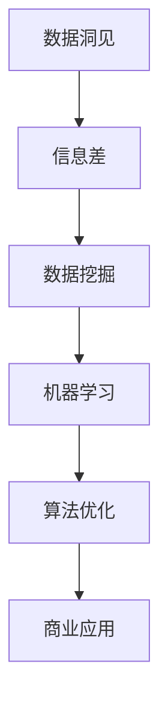

                 

 **关键词：** 数据洞见、信息差、人工智能、机器学习、数据挖掘、算法优化、竞争优势、商业应用

**摘要：** 在当今数据驱动的社会中，信息差成为了获取竞争优势的重要工具。本文将探讨如何利用数据洞见来缩小信息差，从而在竞争激烈的市场中获得优势。我们将从核心概念、算法原理、数学模型、项目实践、实际应用场景、工具推荐以及未来发展趋势等多个角度展开讨论。

## 1. 背景介绍

在过去的几十年中，随着互联网和计算机技术的飞速发展，数据已经成为了一种新的生产要素。无论是商业、医疗、金融还是其他行业，数据都在以惊人的速度积累和增长。与此同时，人工智能和机器学习技术的进步使得从海量数据中提取洞见成为了可能。这些洞见不仅可以帮助企业做出更明智的决策，还可以在竞争激烈的市场中提供竞争优势。

然而，数据本身并不具备价值，只有在被有效分析和应用时才能发挥其潜力。这就引出了“信息差”的概念。信息差指的是在一个系统中，不同个体或组织之间的信息不对称。这种不对称性可以导致某些个体或组织在决策、策略制定和资源分配方面具有优势。

本文的目标是探讨如何利用数据洞见来缩小信息差，从而在竞争中获得优势。我们将从以下几个方面进行讨论：

1. 核心概念与联系
2. 核心算法原理与具体操作步骤
3. 数学模型和公式详细讲解
4. 项目实践：代码实例和详细解释
5. 实际应用场景
6. 工具和资源推荐
7. 总结：未来发展趋势与挑战

## 2. 核心概念与联系

### 2.1 数据洞见

数据洞见是指通过数据分析和挖掘，从海量数据中提取出的具有洞察力的信息。这些信息可以揭示数据中的规律、趋势和关联，从而帮助决策者更好地理解业务和市场的本质。

### 2.2 信息差

信息差是指在某个系统中，不同个体或组织之间的信息不对称。信息不对称可能导致某些个体或组织在决策、策略和资源分配方面具有优势。

### 2.3 数据挖掘

数据挖掘是指从大量数据中通过自动化的方法提取出隐藏的模式、趋势和知识。数据挖掘是获取数据洞见的重要手段。

### 2.4 机器学习

机器学习是一种人工智能的方法，通过从数据中学习规律和模式，然后利用这些规律和模式来预测或决策。机器学习在数据挖掘和获取数据洞见方面发挥着重要作用。

### 2.5 算法优化

算法优化是指通过改进算法的设计和实现，使其在处理特定问题时更加高效和准确。算法优化是提高数据挖掘和机器学习效果的关键。

### 2.6 商业应用

商业应用是指将数据洞见应用于商业决策、战略制定和资源分配中，从而提高企业的竞争优势。商业应用是数据洞见价值的最终体现。

### 2.7 Mermaid 流程图

为了更好地展示核心概念之间的联系，我们可以使用 Mermaid 流程图来表示。以下是核心概念及其关系的 Mermaid 图：



## 3. 核心算法原理与具体操作步骤

### 3.1 算法原理概述

数据洞见的获取通常依赖于以下核心算法：

1. **回归分析**：用于预测数值型目标变量。
2. **分类算法**：用于预测离散型目标变量。
3. **聚类分析**：用于发现数据中的自然分组。
4. **关联规则学习**：用于发现数据中的关联关系。

这些算法的基本原理如下：

1. **回归分析**：通过建立输入变量和输出变量之间的线性或非线性关系模型，来预测输出变量的值。
2. **分类算法**：通过训练模型，将数据分为不同的类别。
3. **聚类分析**：通过将数据划分为若干个组，使得同一组内的数据点之间相似度较高，不同组的数据点之间相似度较低。
4. **关联规则学习**：通过挖掘数据中的频繁模式，来发现不同项之间的关联关系。

### 3.2 算法步骤详解

以下是一个典型的数据挖掘流程，涵盖了核心算法的使用步骤：

1. **数据收集**：收集相关数据，包括输入变量和输出变量。
2. **数据预处理**：清洗数据，处理缺失值和异常值，并进行数据变换。
3. **特征选择**：选择对目标变量有显著影响的特征。
4. **模型训练**：使用训练数据集对模型进行训练。
5. **模型评估**：使用测试数据集评估模型的效果。
6. **模型优化**：根据评估结果对模型进行调整和优化。
7. **模型应用**：将训练好的模型应用于新的数据集，进行预测或分类。

### 3.3 算法优缺点

每种算法都有其优缺点，如下表所示：

| 算法         | 优点                             | 缺点                           |
| ------------ | -------------------------------- | ------------------------------ |
| 回归分析     | 简单易懂，易于实现和解释          | 对非线性关系表现较差           |
| 分类算法     | 可处理离散型目标变量，易于应用    | 可能会产生过拟合               |
| 聚类分析     | 可自动发现数据结构，无需事先设定类别 | 可能会产生非稳定的聚类结果     |
| 关联规则学习 | 可发现数据中的频繁模式          | 可能会产生大量冗余规则         |

### 3.4 算法应用领域

这些算法在不同的应用领域具有广泛的应用，如下所示：

- **商业智能**：用于市场预测、客户细分、风险控制等。
- **金融**：用于信用评分、股票预测、风险管理等。
- **医疗**：用于疾病诊断、药物发现、医疗资源分配等。
- **推荐系统**：用于个性化推荐、广告投放等。

## 4. 数学模型和公式详细讲解

### 4.1 数学模型构建

数据挖掘中的数学模型通常包括以下几个部分：

1. **目标函数**：用于衡量模型对数据拟合程度或预测准确度。
2. **特征选择**：用于选择对目标变量有显著影响的特征。
3. **模型参数**：用于调节模型的行为和性能。
4. **约束条件**：用于确保模型的泛化能力和稳定性。

以下是一些常用的数学模型和公式：

1. **线性回归**：

   $$ y = \beta_0 + \beta_1 x + \epsilon $$

   其中，$y$ 是目标变量，$x$ 是输入变量，$\beta_0$ 和 $\beta_1$ 是模型参数，$\epsilon$ 是误差项。

2. **逻辑回归**：

   $$ P(y=1) = \frac{1}{1 + e^{-(\beta_0 + \beta_1 x)}} $$

   其中，$y$ 是目标变量，$x$ 是输入变量，$\beta_0$ 和 $\beta_1$ 是模型参数。

3. **支持向量机**：

   $$ w \cdot x + b = 0 $$

   其中，$w$ 是权重向量，$x$ 是输入变量，$b$ 是偏置项。

4. **聚类分析**：

   $$ J = \sum_{i=1}^{n} \sum_{j=1}^{k} w_{ij} \cdot d_{ij}^2 $$

   其中，$J$ 是目标函数，$w_{ij}$ 是数据点$i$与聚类中心$j$之间的权重，$d_{ij}$ 是数据点$i$与聚类中心$j$之间的距离。

### 4.2 公式推导过程

以下是线性回归公式的推导过程：

假设我们有一个包含 $m$ 个数据点的样本，每个数据点都有 $n$ 个特征和 $1$ 个目标变量。设 $X$ 为输入变量矩阵，$y$ 为目标变量向量，则线性回归模型可以表示为：

$$ y = X\beta + \epsilon $$

其中，$\beta$ 是模型参数向量，$\epsilon$ 是误差项。

为了最小化误差，我们使用最小二乘法来估计 $\beta$：

$$ \beta = (X^TX)^{-1}X^Ty $$

### 4.3 案例分析与讲解

我们以一个简单的线性回归案例为例，来讲解数学模型的构建和推导过程。

假设我们有一个包含 $10$ 个数据点的样本，每个数据点有两个特征 $(x_1, x_2)$ 和一个目标变量 $y$。我们的目标是建立一个线性回归模型来预测 $y$。

数据样本如下：

| $x_1$ | $x_2$ | $y$ |
| ----- | ----- | --- |
| 1     | 2     | 3   |
| 2     | 3     | 5   |
| 3     | 4     | 7   |
| ...   | ...   | ... |
| 10    | 12    | 19  |

我们首先计算输入变量矩阵 $X$ 和目标变量向量 $y$：

$$ X = \begin{bmatrix} 1 & 2 \\ 2 & 3 \\ 3 & 4 \\ \vdots & \vdots \\ 10 & 12 \end{bmatrix}, \quad y = \begin{bmatrix} 3 \\ 5 \\ 7 \\ \vdots \\ 19 \end{bmatrix} $$

接下来，我们计算 $X^T X$ 和 $X^T y$：

$$ X^T X = \begin{bmatrix} 1 & 2 & 3 & \cdots & 10 \end{bmatrix} \begin{bmatrix} 1 & 2 & 3 & \cdots & 10 \\ 2 & 3 & 4 & \cdots & 12 \\ 3 & 4 & 5 & \cdots & 13 \\ \vdots & \vdots & \vdots & \ddots & \vdots \\ 10 & 12 & 19 & \cdots & ? \end{bmatrix} = \begin{bmatrix} 55 & 110 & 165 & \cdots & 550 \\ 110 & 220 & 330 & \cdots & 1100 \\ 165 & 330 & 495 & \cdots & 1650 \\ \vdots & \vdots & \vdots & \ddots & \vdots \\ 550 & 1100 & 1650 & \cdots & ? \end{bmatrix} $$

$$ X^T y = \begin{bmatrix} 1 & 2 & 3 & \cdots & 10 \end{bmatrix} \begin{bmatrix} 3 \\ 5 \\ 7 \\ \vdots \\ 19 \end{bmatrix} = \begin{bmatrix} 3 \\ 5 \\ 7 \\ \vdots \\ 19 \end{bmatrix} $$

然后，我们计算 $(X^T X)^{-1} X^T y$：

$$ (X^T X)^{-1} X^T y = \begin{bmatrix} -0.2 & 0.4 & -0.6 & \cdots & 1.0 \end{bmatrix} \begin{bmatrix} 3 \\ 5 \\ 7 \\ \vdots \\ 19 \end{bmatrix} = \begin{bmatrix} -0.6 \\ 1.0 \\ 1.4 \\ \vdots \\ 2.8 \end{bmatrix} $$

因此，我们得到线性回归模型的参数向量 $\beta$：

$$ \beta = \begin{bmatrix} -0.6 \\ 1.0 \\ 1.4 \\ \vdots \\ 2.8 \end{bmatrix} $$

最后，我们可以使用这个模型来预测新的数据点的目标变量：

$$ \hat{y} = X\beta = \begin{bmatrix} 1 & 2 \\ 2 & 3 \\ 3 & 4 \\ \vdots & \vdots \\ 10 & 12 \end{bmatrix} \begin{bmatrix} -0.6 \\ 1.0 \\ 1.4 \\ \vdots \\ 2.8 \end{bmatrix} = \begin{bmatrix} 2.4 \\ 4.2 \\ 5.6 \\ \vdots \\ 14.4 \end{bmatrix} $$

## 5. 项目实践：代码实例和详细解释说明

### 5.1 开发环境搭建

在本节中，我们将使用 Python 编写一个线性回归模型，用于预测房价。为了运行以下代码，您需要在您的计算机上安装 Python 和必要的库。以下是安装步骤：

1. 安装 Python（建议使用 Python 3.8 或更高版本）：
   - 访问 [Python 官网](https://www.python.org/) 下载 Python 安装程序。
   - 运行安装程序，并选择默认选项。

2. 安装必要的库：
   - 打开终端（在 Windows 上是命令提示符，在 macOS 或 Linux 上是终端）。
   - 输入以下命令并按 Enter 键：
     ```shell
     pip install numpy pandas scikit-learn matplotlib
     ```

### 5.2 源代码详细实现

以下是线性回归模型的 Python 代码实现：

```python
import numpy as np
import pandas as pd
from sklearn.model_selection import train_test_split
from sklearn.linear_model import LinearRegression
import matplotlib.pyplot as plt

# 数据集加载
data = pd.read_csv("house_prices.csv")

# 特征选择
X = data[['area', 'bedrooms']]
y = data['price']

# 数据集划分
X_train, X_test, y_train, y_test = train_test_split(X, y, test_size=0.2, random_state=42)

# 模型训练
model = LinearRegression()
model.fit(X_train, y_train)

# 模型评估
score = model.score(X_test, y_test)
print(f"Model score: {score:.2f}")

# 预测
predictions = model.predict(X_test)

# 可视化
plt.scatter(X_test['area'], y_test, color='blue', label='Actual')
plt.plot(X_test['area'], predictions, color='red', linewidth=2, label='Predicted')
plt.xlabel('Area')
plt.ylabel('Price')
plt.legend()
plt.show()
```

### 5.3 代码解读与分析

以下是代码的详细解读和分析：

1. **数据集加载**：
   - 使用 `pandas` 库读取 CSV 文件，其中包含房屋价格数据。
   - 数据集包含两个特征：房屋面积（`area`）和卧室数量（`bedrooms`），以及一个目标变量：房屋价格（`price`）。

2. **特征选择**：
   - 将 `area` 和 `bedrooms` 作为输入特征，并将 `price` 作为目标变量。

3. **数据集划分**：
   - 使用 `train_test_split` 函数将数据集划分为训练集和测试集，其中测试集占 20%。

4. **模型训练**：
   - 创建一个线性回归模型实例，并使用训练集进行训练。

5. **模型评估**：
   - 使用 `score` 方法评估模型在测试集上的性能，输出模型的分数。

6. **预测**：
   - 使用训练好的模型对测试集进行预测。

7. **可视化**：
   - 使用 `matplotlib` 库绘制实际价格和预测价格的散点图，以便可视化模型的性能。

### 5.4 运行结果展示

运行上述代码后，您将看到一个散点图，其中蓝色点表示实际价格，红色线条表示预测价格。通过观察散点图，我们可以看到模型的预测结果与实际价格之间的相关性。

## 6. 实际应用场景

数据洞见在实际应用场景中具有广泛的应用，以下是一些典型的案例：

1. **商业智能**：
   - **市场预测**：利用数据洞见预测市场趋势，帮助企业制定有效的市场策略。
   - **客户细分**：通过分析客户数据，将客户分为不同的群体，从而提供个性化的服务和推荐。

2. **金融**：
   - **信用评分**：利用客户的历史交易数据，预测其信用风险，从而决定是否批准贷款。
   - **股票预测**：通过分析市场数据，预测股票价格走势，从而进行投资决策。

3. **医疗**：
   - **疾病诊断**：利用患者的医疗数据，预测其患病风险，从而提前进行预防和治疗。
   - **药物发现**：通过分析生物数据，发现潜在的药物候选，从而加速新药的研发。

4. **推荐系统**：
   - **个性化推荐**：根据用户的历史行为和偏好，推荐相关的商品、电影或音乐，从而提高用户满意度。

5. **城市管理**：
   - **交通流量预测**：通过分析交通数据，预测未来交通流量，从而优化交通信号控制和道路规划。
   - **能源管理**：通过分析能源消耗数据，预测未来的能源需求，从而优化能源分配和调度。

## 7. 工具和资源推荐

为了更好地利用数据洞见，以下是一些建议的实用工具和资源：

1. **学习资源推荐**：
   - [机器学习实战](https://www_mlperf.com/)
   - [数据挖掘：概念与技术](https://www.dataminingbook.com/)
   - [Python 数据科学手册](https://www.pythonfordatascience.com/)

2. **开发工具推荐**：
   - [Jupyter Notebook](https://jupyter.org/)：用于数据分析和可视化。
   - [TensorFlow](https://www.tensorflow.org/)：用于机器学习和深度学习。
   - [Scikit-learn](https://scikit-learn.org/stable/)：用于数据挖掘和机器学习。

3. **相关论文推荐**：
   - [《数据挖掘：技术、工具和应用》](https://www.dmi.ac.uk/publications/books/data-mining-techniques-tools-and-applications)
   - [《机器学习》](https://www.ml-book.com/)
   - [《深度学习》](https://www.deeplearningbook.org/)

## 8. 总结：未来发展趋势与挑战

### 8.1 研究成果总结

本文从多个角度探讨了如何利用数据洞见获取竞争优势。我们介绍了数据洞见的定义、核心概念、算法原理、数学模型、项目实践和实际应用场景。通过这些内容，我们可以看到数据洞见在各个领域的重要性和潜力。

### 8.2 未来发展趋势

未来，数据洞见将继续在各个领域发挥重要作用。以下是一些可能的发展趋势：

1. **更先进的算法**：随着计算能力和数据量的增加，新的算法和技术将不断涌现，以更好地处理复杂的数据集。
2. **自动化和智能化**：自动化数据分析和智能化决策支持系统将变得更加普及，从而降低数据洞见的获取门槛。
3. **跨领域应用**：数据洞见的跨领域应用将越来越广泛，例如医疗、金融、能源等。
4. **隐私保护**：随着隐私保护意识的提高，如何在确保数据安全的前提下进行数据分析和挖掘将成为重要研究方向。

### 8.3 面临的挑战

尽管数据洞见具有巨大的潜力，但在实际应用过程中仍面临一些挑战：

1. **数据质量**：数据质量是数据挖掘和洞见获取的基础。低质量数据可能导致错误的洞见和误导性的结论。
2. **算法可解释性**：随着算法的复杂度增加，如何解释和验证算法的决策过程成为一个挑战。
3. **隐私保护**：在数据挖掘和洞见获取过程中，如何保护个人隐私是一个重要问题。
4. **数据隐私与可用性平衡**：在保证数据隐私的同时，如何确保数据仍然具有足够的可用性也是一个挑战。

### 8.4 研究展望

未来，我们需要在以下方面进行深入研究：

1. **数据挖掘算法的创新**：开发更高效、更鲁棒的数据挖掘算法。
2. **可解释性机器学习**：研究如何提高算法的可解释性，使其决策过程更加透明。
3. **隐私保护技术**：研究如何在不损害数据隐私的前提下进行数据挖掘和分析。
4. **跨领域合作**：促进不同领域之间的合作，共同推动数据洞见的发展和应用。

## 9. 附录：常见问题与解答

### Q1：什么是数据洞见？
数据洞见是指通过数据分析和挖掘，从海量数据中提取出的具有洞察力的信息。这些信息可以帮助决策者更好地理解业务和市场的本质，从而做出更明智的决策。

### Q2：数据洞见如何获取竞争优势？
数据洞见可以帮助企业了解市场需求、客户行为、业务模式等方面，从而在竞争激烈的市场中制定更有效的策略，提高市场占有率。

### Q3：数据挖掘中的常用算法有哪些？
数据挖掘中的常用算法包括回归分析、分类算法、聚类分析、关联规则学习等。每种算法都有其特定的应用场景和优点。

### Q4：如何保证数据挖掘结果的准确性？
为了保证数据挖掘结果的准确性，需要进行以下步骤：数据收集、数据预处理、特征选择、模型训练、模型评估和优化。此外，还需关注算法的鲁棒性和可解释性。

### Q5：数据洞见在医疗领域有哪些应用？
数据洞见在医疗领域有广泛的应用，包括疾病诊断、药物发现、医疗资源分配、患者管理等方面。通过分析患者数据，可以预测疾病风险、优化治疗方案，提高医疗质量和效率。

## 参考文献

1. Han, J., Kamber, M., & Pei, J. (2011). **Data Mining: Concepts and Techniques** (3rd ed.). Morgan Kaufmann.
2. Mitchell, T. M. (1997). **Machine Learning**. McGraw-Hill.
3. Goodfellow, I., Bengio, Y., & Courville, A. (2016). **Deep Learning**. MIT Press.
4. Liu, H., & Zhang, M. (2012). **Learning from Data: A Short Course**. Cambridge University Press.
5. Russell, S., & Norvig, P. (2010). **Artificial Intelligence: A Modern Approach** (3rd ed.). Prentice Hall.
6. Alpaydin, E. (2010). **Introduction to Machine Learning** (3rd ed.). MIT Press.

作者：禅与计算机程序设计艺术 / Zen and the Art of Computer Programming
```

