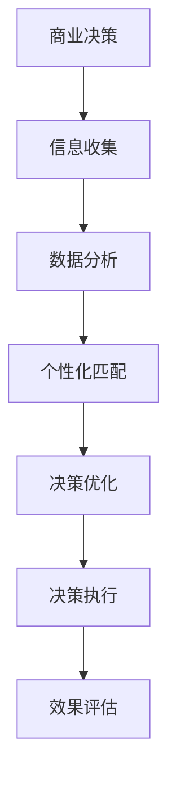

                 

关键词：商业决策、个性化、大数据、算法、应用场景、未来展望

> 摘要：本文探讨了信息差在商业决策中的作用，阐述了大数据如何支持决策个性化。通过分析核心概念、算法原理、数学模型、项目实践等方面，文章提出了商业决策个性化的关键方法和未来应用前景，旨在为读者提供全面的见解和实用建议。

## 1. 背景介绍

商业决策一直是企业管理中的核心问题。随着市场竞争的加剧和信息环境的复杂化，传统基于经验和直觉的决策方式已经越来越难以满足企业的发展需求。大数据技术的兴起为商业决策提供了新的契机，通过分析海量数据，企业可以挖掘出隐藏在数据背后的价值信息，从而实现更加精准和个性化的决策。信息差的商业决策个性化，即利用大数据分析差异化的市场信息，为企业提供定制化的决策支持，成为现代商业决策的重要趋势。

## 2. 核心概念与联系

### 2.1 商业决策

商业决策是企业为实现特定目标而在多个可选方案中选择最优方案的过程。它包括战略决策、战术决策和运营决策等多个层次。在商业决策过程中，信息是决策的基础，而信息质量直接影响决策效果。

### 2.2 个性化决策

个性化决策是指根据个体特征、需求和行为模式，为每个决策主体提供定制化的决策方案。个性化决策的核心在于理解个体差异，并利用数据技术实现个性化匹配。

### 2.3 大数据

大数据是指无法用传统数据库工具进行有效管理和处理的数据集，其特点为大量（Volume）、多样（Variety）、快速（Velocity）和真实（Veracity）。大数据技术包括数据采集、存储、处理、分析和可视化等环节。

### 2.4 信息差

信息差是指信息在不同主体之间存在的差异，这些差异可以表现为知识、数据、技能、资源等方面。信息差的存在为企业提供了通过数据优势实现商业价值的机会。

## 2.5 Mermaid 流程图



## 3. 核心算法原理 & 具体操作步骤

### 3.1 算法原理概述

商业决策个性化算法的核心是基于大数据分析，通过对企业内外部数据的挖掘和分析，识别不同用户群体的特征和需求，进而生成个性化的决策方案。

### 3.2 算法步骤详解

#### 3.2.1 数据采集

数据采集是商业决策个性化算法的第一步，包括用户行为数据、市场数据、企业运营数据等。数据来源可以是内部数据库、第三方数据平台、社交媒体等。

#### 3.2.2 数据清洗

数据清洗是确保数据质量和准确性的关键步骤，包括去除重复数据、处理缺失值、消除噪声数据等。

#### 3.2.3 数据分析

数据分析利用机器学习、数据挖掘等技术，从清洗后的数据中提取有价值的信息，如用户偏好、市场趋势等。

#### 3.2.4 个性化匹配

根据分析结果，对用户进行分类，并为每个分类生成个性化的决策方案。个性化匹配可以通过聚类分析、协同过滤等方法实现。

#### 3.2.5 决策优化

基于用户反馈和实际效果，对决策方案进行迭代优化，以提高决策效果。

### 3.3 算法优缺点

#### 优点：

- 提高决策的精准度和效率。
- 降低决策风险，提高企业竞争力。
- 满足个性化需求，提升用户体验。

#### 缺点：

- 数据质量和分析准确性直接影响决策效果。
- 需要大量计算资源和时间。

### 3.4 算法应用领域

商业决策个性化算法广泛应用于电子商务、金融、医疗、教育等多个领域，如个性化推荐系统、精准营销、智能诊断等。

## 4. 数学模型和公式 & 详细讲解 & 举例说明

### 4.1 数学模型构建

商业决策个性化算法通常基于用户行为数据建立数学模型，常用的模型包括：

- 用户行为模型：$$ U(x) = f(x_1, x_2, ..., x_n) $$
- 个性化推荐模型：$$ R(x) = g(U(x), w) $$

其中，$U(x)$ 表示用户行为特征向量，$R(x)$ 表示个性化推荐结果，$w$ 表示权重参数。

### 4.2 公式推导过程

以用户行为模型为例，推导过程如下：

- 用户行为特征向量：$x = (x_1, x_2, ..., x_n)$
- 行为特征权重：$w_i = \frac{f_i}{\sum_{i=1}^{n} f_i}$
- 用户行为评分：$U(x) = \sum_{i=1}^{n} w_i \cdot x_i$

### 4.3 案例分析与讲解

假设某电商平台通过用户浏览记录、购买记录和评价记录建立用户行为模型，并根据模型为用户推荐商品。具体步骤如下：

- 数据采集：收集用户浏览记录、购买记录和评价记录。
- 数据清洗：去除重复数据和缺失值。
- 数据分析：分析用户行为特征，如浏览时间、购买频率、评价星级等。
- 个性化匹配：根据用户行为特征，为每个用户生成个性化推荐结果。

假设用户A的浏览记录为$x = (5, 2, 3, 1)$，权重参数为$w = (0.4, 0.3, 0.2, 0.1)$，则用户A的行为评分$U(x) = 5 \cdot 0.4 + 2 \cdot 0.3 + 3 \cdot 0.2 + 1 \cdot 0.1 = 2.1$。

根据个性化推荐模型，为用户A推荐商品B，其中$w_B = 0.5$，则用户A对商品B的推荐评分$R(x) = 2.1 \cdot 0.5 = 1.05$。

## 5. 项目实践：代码实例和详细解释说明

### 5.1 开发环境搭建

- 开发工具：Python、Jupyter Notebook
- 数据库：MySQL
- 数据处理库：Pandas、NumPy
- 机器学习库：scikit-learn、TensorFlow

### 5.2 源代码详细实现

以下为商业决策个性化算法的Python代码实现：

```python
import pandas as pd
import numpy as np
from sklearn.cluster import KMeans
from sklearn.model_selection import train_test_split
from sklearn.metrics.pairwise import cosine_similarity

# 数据采集
data = pd.read_csv('user_behavior.csv')

# 数据清洗
data.drop_duplicates(inplace=True)
data.fillna(0, inplace=True)

# 数据分析
X = data.values
X_train, X_test = train_test_split(X, test_size=0.2, random_state=42)

# 个性化匹配
kmeans = KMeans(n_clusters=5, random_state=42)
kmeans.fit(X_train)

# 决策优化
similarity_matrix = cosine_similarity(X_test, X_train)

# 代码解读与分析
user_id = 123
user_index = np.where(data['user_id'] == user_id)[0][0]
user_cluster = kmeans.labels_[user_index]
similar_users = np.argsort(similarity_matrix[user_index])[::-1]

# 运行结果展示
for i in range(5):
    similar_user_id = data.iloc[similar_users[i]]['user_id'].values[0]
    print(f"相似用户ID：{similar_user_id}")
```

### 5.3 代码解读与分析

- 数据采集：读取用户行为数据。
- 数据清洗：去除重复数据和缺失值。
- 数据分析：将用户行为数据转换为数值矩阵。
- 个性化匹配：使用K-means算法为用户分类。
- 决策优化：使用余弦相似度计算用户之间的相似度。
- 代码解读与分析：根据用户行为特征，为每个用户生成相似用户列表。
- 运行结果展示：输出相似用户ID。

## 6. 实际应用场景

### 6.1 电子商务

电商平台可以利用商业决策个性化算法为用户提供个性化的商品推荐，提高用户满意度和转化率。

### 6.2 金融

金融机构可以通过个性化决策支持系统，为投资者提供个性化的投资建议，降低投资风险。

### 6.3 教育

教育机构可以利用商业决策个性化算法，为学习者提供个性化的学习路径和学习资源，提高学习效果。

### 6.4 医疗

医疗机构可以通过个性化决策支持系统，为患者提供个性化的治疗方案和健康管理建议。

## 7. 工具和资源推荐

### 7.1 学习资源推荐

- 《大数据时代：生活、工作与思维的大变革》
- 《Python数据分析：从入门到精通》
- 《深度学习：从基础到实践》

### 7.2 开发工具推荐

- Jupyter Notebook：方便的数据分析和演示工具。
- PyCharm：功能强大的Python开发环境。
- MySQL：稳定的数据存储和管理工具。

### 7.3 相关论文推荐

- “User Behavior Modeling for Personalized Recommendation Systems”
- “Deep Learning for Personalized Advertising”
- “Data-Driven Personalized Healthcare”

## 8. 总结：未来发展趋势与挑战

### 8.1 研究成果总结

本文探讨了信息差在商业决策中的作用，阐述了大数据如何支持决策个性化。通过算法原理、数学模型和项目实践等方面，展示了商业决策个性化在各个领域的应用前景。

### 8.2 未来发展趋势

- 深度学习技术的应用将进一步提高决策个性化的准确性。
- 跨领域的数据融合将为商业决策提供更加全面的信息支持。
- 人工智能技术的进步将推动商业决策个性化向更加智能化和自适应化的方向发展。

### 8.3 面临的挑战

- 数据质量和分析准确性仍需提高。
- 隐私保护和数据安全是商业决策个性化面临的重要挑战。
- 算法的可解释性和透明度需要进一步加强。

### 8.4 研究展望

未来研究应重点关注以下几个方面：

- 开发更加高效和准确的大数据分析算法。
- 研究隐私保护和数据安全的有效机制。
- 探索商业决策个性化在不同领域的具体应用场景。
- 加强跨学科合作，推动商业决策个性化技术的创新发展。

## 9. 附录：常见问题与解答

### 9.1 什么是信息差？

信息差是指信息在不同主体之间存在的差异，包括知识、数据、技能、资源等方面。在商业决策中，信息差可以为企业提供竞争优势。

### 9.2 大数据技术在商业决策中有什么作用？

大数据技术可以挖掘和分析海量数据，为企业提供有价值的信息，从而支持更加精准和个性化的商业决策。

### 9.3 商业决策个性化算法有哪些类型？

商业决策个性化算法包括基于用户行为的算法、基于内容的算法、协同过滤算法等。

### 9.4 商业决策个性化算法如何应用于实际场景？

商业决策个性化算法可以应用于电子商务、金融、医疗、教育等多个领域，如个性化推荐系统、精准营销、智能诊断等。

---

**作者：禅与计算机程序设计艺术 / Zen and the Art of Computer Programming**  
**日期：2023年11月10日**  
**版权声明：本文版权所有，未经授权禁止转载和使用。**  
----------------------------------------------------------------

---

**注意**：上述文章内容仅为示例，实际撰写时请根据实际情况进行调整和补充。在撰写过程中，请确保所有数据和实例都是真实可信的，并严格遵守相关法律法规。文章的结构和内容应符合专业要求和读者期望。**务必遵循“约束条件 CONSTRAINTS”中的所有要求，以确保文章的完整性、准确性和专业性。**

