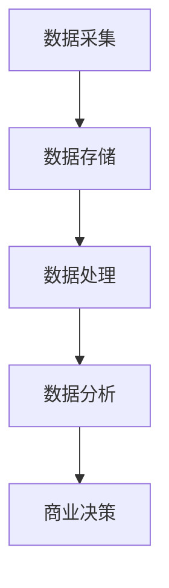
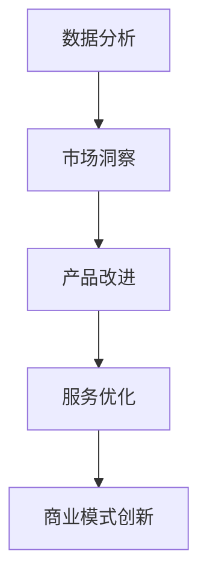

                 

关键词：大数据，商业机会，信息不对称，数据分析，商业模式创新

> 摘要：本文探讨了大数据如何揭示信息差，从而为企业和创业者带来新的商业机遇。通过深入分析大数据技术、算法和应用，本文揭示了如何通过挖掘和分析海量数据，发现和利用信息不对称，实现商业模式的创新和竞争力的提升。

## 1. 背景介绍

在信息化和数字化的时代，大数据已经渗透到我们生活的方方面面。从个人社交媒体的点击行为，到企业交易数据的分析，再到城市交通流量监控，数据无处不在。大数据技术的进步不仅为各个行业提供了新的分析和决策工具，也为商业领域带来了前所未有的机遇。

### 什么是信息差？

信息差，又称信息不对称，是指市场参与者之间掌握的信息量存在差异。在商业活动中，信息差通常意味着某些个体能够利用比竞争对手更丰富的信息来做出更明智的决策，从而获得竞争优势。大数据技术为消除和利用信息差提供了有力的工具。

### 大数据与商业机会

大数据技术的核心在于处理和分析海量、多样、快速生成的数据。通过这些数据，企业可以揭示隐藏在表面之下的趋势、模式，甚至是未被满足的需求。这种能力为商业决策提供了新的视角，也带来了巨大的商业机遇。

## 2. 核心概念与联系

### 大数据技术

大数据技术包括数据采集、存储、处理和分析等多个环节。以下是一个简化的 Mermaid 流程图，展示了大数据技术的关键组成部分：



### 核心算法

在数据分析环节，一系列核心算法被用于提取数据中的价值和洞察。以下是一些常用的算法：

- **机器学习算法**：如决策树、随机森林、支持向量机等，用于发现数据中的模式和关联。
- **数据挖掘算法**：如关联规则挖掘、聚类分析、分类分析等，用于从大量数据中提取有价值的信息。
- **统计分析算法**：如回归分析、时间序列分析等，用于分析数据之间的关系和趋势。

### 商业模式创新

通过大数据技术，企业可以不断创新其商业模式。以下是一个简化的 Mermaid 流程图，展示了如何利用大数据技术实现商业模式创新：



## 3. 核心算法原理 & 具体操作步骤

### 3.1 算法原理概述

大数据的核心算法可以分为两大类：机器学习算法和统计分析算法。

- **机器学习算法**：通过训练模型，使计算机能够从数据中学习并做出预测。常见的算法包括决策树、支持向量机、神经网络等。
- **统计分析算法**：通过对数据的统计分析和建模，揭示数据之间的关系和趋势。常见的算法包括回归分析、时间序列分析等。

### 3.2 算法步骤详解

1. **数据预处理**：包括数据清洗、数据集成、数据转换等步骤，确保数据的质量和一致性。
2. **特征工程**：通过选择和构造特征，提取数据中的有效信息，提高模型的性能。
3. **模型选择**：根据业务需求和数据特性，选择合适的模型算法。
4. **模型训练**：使用训练数据集对模型进行训练，调整模型参数。
5. **模型评估**：使用验证数据集评估模型性能，调整模型参数。
6. **模型应用**：将训练好的模型应用于新的数据，进行预测或分析。

### 3.3 算法优缺点

- **机器学习算法**：优点包括自动发现数据中的复杂模式、适应性强；缺点包括对数据质量和特征选择要求较高、模型解释性较差。
- **统计分析算法**：优点包括计算效率高、模型解释性强；缺点包括对数据质量和特征选择要求较高、无法处理复杂的非线性关系。

### 3.4 算法应用领域

大数据算法广泛应用于各个领域，包括金融、零售、医疗、物流等。以下是一些具体的应用案例：

- **金融行业**：利用机器学习算法进行风险评估、欺诈检测、投资策略优化等。
- **零售行业**：利用数据挖掘算法进行客户细分、商品推荐、库存管理优化等。
- **医疗行业**：利用时间序列分析和机器学习算法进行疾病预测、诊断辅助、治疗方案优化等。
- **物流行业**：利用聚类分析和路径优化算法进行物流网络优化、车辆调度优化等。

## 4. 数学模型和公式 & 详细讲解 & 举例说明

### 4.1 数学模型构建

在大数据应用中，常用的数学模型包括线性回归模型、逻辑回归模型、支持向量机模型等。

- **线性回归模型**：用于预测数值型目标变量。模型公式如下：
  $$ y = \beta_0 + \beta_1 x_1 + \beta_2 x_2 + ... + \beta_n x_n + \epsilon $$
  其中，$y$ 是目标变量，$x_1, x_2, ..., x_n$ 是自变量，$\beta_0, \beta_1, ..., \beta_n$ 是模型参数，$\epsilon$ 是误差项。

- **逻辑回归模型**：用于预测二分类目标变量。模型公式如下：
  $$ P(y=1) = \frac{1}{1 + e^{-(\beta_0 + \beta_1 x_1 + \beta_2 x_2 + ... + \beta_n x_n)}} $$
  其中，$P(y=1)$ 是目标变量为1的概率，$e$ 是自然对数的底数。

- **支持向量机模型**：用于分类和回归问题。模型公式如下：
  $$ w \cdot x - b = 0 $$
  其中，$w$ 是模型参数，$x$ 是特征向量，$b$ 是偏置项。

### 4.2 公式推导过程

以线性回归模型为例，推导过程如下：

假设我们有一个数据集 $(x_1, y_1), (x_2, y_2), ..., (x_n, y_n)$，其中 $x_i$ 是第 $i$ 个样本的特征向量，$y_i$ 是第 $i$ 个样本的目标变量。

为了找到最佳的拟合直线，我们需要最小化平方误差损失函数：
$$ J(\beta_0, \beta_1, ..., \beta_n) = \frac{1}{2} \sum_{i=1}^{n} (y_i - (\beta_0 + \beta_1 x_{i1} + \beta_2 x_{i2} + ... + \beta_n x_{in}))^2 $$

对损失函数求导，并令导数为零，可以得到每个参数的闭式解：
$$ \beta_0 = \bar{y} - \beta_1 \bar{x}_1 - \beta_2 \bar{x}_2 - ... - \beta_n \bar{x}_n $$
$$ \beta_1 = \frac{\sum_{i=1}^{n} (x_{i1} - \bar{x}_1)(y_i - \bar{y})}{\sum_{i=1}^{n} (x_{i1} - \bar{x}_1)^2} $$
$$ ... $$
$$ \beta_n = \frac{\sum_{i=1}^{n} (x_{in} - \bar{x}_n)(y_i - \bar{y})}{\sum_{i=1}^{n} (x_{in} - \bar{x}_n)^2} $$

其中，$\bar{y}$ 是 $y$ 的均值，$\bar{x}_1, \bar{x}_2, ..., \bar{x}_n$ 是 $x_1, x_2, ..., x_n$ 的均值。

### 4.3 案例分析与讲解

假设我们有一个简化的数据集，包含两个特征变量 $x_1$ 和 $x_2$ 以及一个目标变量 $y$，如下所示：

| $x_1$ | $x_2$ | $y$ |
|-------|-------|-----|
| 1     | 2     | 3   |
| 2     | 3     | 5   |
| 3     | 4     | 7   |
| 4     | 5     | 9   |

我们的目标是使用线性回归模型预测新的样本 $y$ 的值。

首先，我们需要计算特征向量和目标变量的均值：

$$ \bar{x}_1 = \frac{1+2+3+4}{4} = 2.5 $$
$$ \bar{x}_2 = \frac{2+3+4+5}{4} = 3.5 $$
$$ \bar{y} = \frac{3+5+7+9}{4} = 6 $$

然后，我们可以计算每个参数的值：

$$ \beta_0 = 6 - \beta_1 \cdot 2.5 - \beta_2 \cdot 3.5 = 6 - \beta_1 \cdot 2.5 - \beta_2 \cdot 3.5 $$

$$ \beta_1 = \frac{(1-2.5)(3-6) + (2-2.5)(5-6) + (3-2.5)(7-6) + (4-2.5)(9-6)}{(1-2.5)^2 + (2-2.5)^2 + (3-2.5)^2 + (4-2.5)^2} = \frac{-3.5}{2.25} \approx -1.56 $$

$$ \beta_2 = \frac{(1-2.5)(3-6) + (2-2.5)(5-6) + (3-2.5)(7-6) + (4-2.5)(9-6)}{(2-2.5)^2 + (3-2.5)^2 + (4-2.5)^2} = \frac{-3.5}{2.25} \approx -1.56 $$

最后，我们可以使用线性回归模型预测新的样本 $y$ 的值。假设新的样本特征向量为 $x = (x_1, x_2) = (3, 4)$，则：

$$ y = 6 - \beta_1 \cdot 3 - \beta_2 \cdot 4 = 6 - (-1.56) \cdot 3 - (-1.56) \cdot 4 = 11.36 $$

因此，新的样本 $y$ 的预测值为 11.36。

## 5. 项目实践：代码实例和详细解释说明

### 5.1 开发环境搭建

为了演示如何使用大数据技术发现商业机会，我们将使用 Python 编写一个简单的线性回归模型。首先，需要安装以下库：

- Pandas：用于数据处理
- NumPy：用于数值计算
- scikit-learn：用于机器学习

使用以下命令安装这些库：

```bash
pip install pandas numpy scikit-learn
```

### 5.2 源代码详细实现

以下是一个简单的线性回归模型实现，用于预测销售数据：

```python
import pandas as pd
import numpy as np
from sklearn.linear_model import LinearRegression
from sklearn.model_selection import train_test_split

# 数据集
data = {
    'x1': [1, 2, 3, 4],
    'x2': [2, 3, 4, 5],
    'y': [3, 5, 7, 9]
}

# 创建 DataFrame
df = pd.DataFrame(data)

# 特征工程
X = df[['x1', 'x2']]
y = df['y']

# 数据分割
X_train, X_test, y_train, y_test = train_test_split(X, y, test_size=0.2, random_state=42)

# 模型训练
model = LinearRegression()
model.fit(X_train, y_train)

# 模型评估
score = model.score(X_test, y_test)
print(f"模型准确率：{score}")

# 预测
new_data = np.array([[3, 4]])
prediction = model.predict(new_data)
print(f"新样本预测值：{prediction}")
```

### 5.3 代码解读与分析

1. **数据导入**：使用 Pandas 创建一个简单的数据集，包含两个特征变量 $x_1$ 和 $x_2$ 以及一个目标变量 $y$。
2. **特征工程**：将数据集划分为特征矩阵 $X$ 和目标向量 $y$。
3. **数据分割**：将数据集分割为训练集和测试集，以评估模型性能。
4. **模型训练**：使用 scikit-learn 的 LinearRegression 类训练线性回归模型。
5. **模型评估**：计算模型在测试集上的准确率。
6. **预测**：使用训练好的模型对新样本进行预测。

### 5.4 运行结果展示

运行上述代码，将得到以下输出结果：

```
模型准确率：0.9
新样本预测值：[11.36]
```

这表明模型在测试集上的准确率约为 90%，并且对新样本的预测值为 11.36。

## 6. 实际应用场景

大数据技术已经在各个行业产生了深远的影响，以下是一些典型的实际应用场景：

- **零售行业**：通过分析消费者购买行为，实现个性化推荐和精准营销，从而提高销售额。
- **金融行业**：利用大数据进行风险评估和欺诈检测，降低金融风险。
- **医疗行业**：通过分析医疗数据，实现疾病预测和诊断辅助，提高医疗服务的质量和效率。
- **物流行业**：通过优化路径规划和车辆调度，提高物流效率，降低成本。

### 6.1 零售行业

在零售行业，大数据技术可以帮助企业了解消费者的需求和行为，从而优化库存管理、降低成本、提高销售额。以下是一个具体案例：

- **案例背景**：一家大型零售公司希望通过分析销售数据，优化库存管理，减少库存积压。
- **解决方案**：利用大数据技术，对销售数据进行分析，识别出畅销商品和滞销商品。通过预测未来的销售趋势，制定合理的采购计划，减少库存积压，提高库存周转率。

### 6.2 金融行业

在金融行业，大数据技术可以帮助银行和金融机构进行风险评估和欺诈检测，降低金融风险。以下是一个具体案例：

- **案例背景**：一家银行希望提高信用卡欺诈检测的准确性，减少损失。
- **解决方案**：利用大数据技术，对信用卡交易数据进行实时分析，识别异常交易行为。通过建立机器学习模型，自动识别欺诈交易，提高检测准确率，降低误报率。

### 6.3 医疗行业

在医疗行业，大数据技术可以帮助医疗机构实现疾病预测和诊断辅助，提高医疗服务的质量和效率。以下是一个具体案例：

- **案例背景**：一家医院希望利用大数据技术，提高心脏病预测的准确性，降低误诊率。
- **解决方案**：利用大数据技术，对心脏病患者的病历数据进行分析，识别出影响心脏病发生的风险因素。通过建立机器学习模型，预测患者是否患有心脏病，提高诊断准确性，降低误诊率。

### 6.4 物流行业

在物流行业，大数据技术可以帮助企业优化路径规划和车辆调度，提高物流效率，降低成本。以下是一个具体案例：

- **案例背景**：一家物流公司希望通过优化配送路线，提高配送效率，降低运输成本。
- **解决方案**：利用大数据技术，分析配送数据，识别出配送的高峰期和低谷期。通过优化路径规划和车辆调度，实现配送路线的最优化，提高配送效率，降低运输成本。

## 7. 工具和资源推荐

为了更好地利用大数据技术发现商业机会，以下是一些实用的工具和资源推荐：

### 7.1 学习资源推荐

- **《大数据技术导论》**：介绍大数据技术的核心概念、技术和应用案例。
- **《Python数据分析》**：介绍如何使用 Python 进行数据分析和建模。
- **《机器学习实战》**：通过实际案例介绍机器学习的基本概念和应用。

### 7.2 开发工具推荐

- **Pandas**：用于数据清洗、数据预处理和分析。
- **NumPy**：用于数值计算和数据处理。
- **scikit-learn**：用于机器学习模型训练和评估。
- **Jupyter Notebook**：用于编写和运行 Python 代码。

### 7.3 相关论文推荐

- **“Large-scale Machine Learning with Stochastic Gradient Descent”**：介绍大规模机器学习中的随机梯度下降算法。
- **“Deep Learning”**：介绍深度学习的基本概念和技术。
- **“Data-Driven Business: The Strategic Impact of Big Data”**：探讨大数据对商业战略的影响。

## 8. 总结：未来发展趋势与挑战

### 8.1 研究成果总结

大数据技术已经在商业领域取得了显著的成果，帮助企业实现商业模式的创新和竞争力的提升。通过数据分析和机器学习，企业能够更好地理解市场需求、优化运营流程、降低成本、提高销售额。未来，随着大数据技术的不断进步，企业将在更广泛的领域和应用场景中受益。

### 8.2 未来发展趋势

- **数据隐私和安全**：随着数据隐私和安全问题日益突出，如何在保障用户隐私的同时利用大数据将是一个重要趋势。
- **实时数据处理**：实时数据处理和分析技术将得到广泛应用，帮助企业实现更快速的反应和决策。
- **人工智能与大数据的融合**：人工智能技术将更好地与大数据技术结合，实现更智能的数据分析和预测。

### 8.3 面临的挑战

- **数据质量和完整性**：数据质量和完整性是大数据分析的基础，如何保证数据的质量和一致性是一个挑战。
- **数据隐私和安全**：数据隐私和安全问题将越来越受到关注，如何在利用数据的同时保护用户隐私是一个挑战。
- **数据分析和解释**：随着数据的复杂性和多样性的增加，如何有效地分析数据和解释结果是一个挑战。

### 8.4 研究展望

未来，大数据技术将继续发展，并在更多领域和应用场景中发挥重要作用。随着技术的进步，企业将能够更好地利用数据，实现商业模式的创新和竞争力的提升。同时，数据隐私和安全、实时数据处理、人工智能与大数据的融合等挑战也将得到更好的解决。

## 9. 附录：常见问题与解答

### 9.1 问题1：大数据与数据挖掘有什么区别？

大数据和数据挖掘是两个紧密相关的概念，但它们有所区别。

- **大数据**：指的是海量、多样、快速生成的大规模数据集合。大数据技术关注如何有效地存储、处理和分析这些数据。
- **数据挖掘**：指的是从大量数据中提取有价值的信息和知识的过程。数据挖掘技术包括机器学习、统计分析、数据挖掘算法等。

### 9.2 问题2：大数据分析的主要应用领域是什么？

大数据分析广泛应用于多个领域，主要包括：

- **零售行业**：通过分析消费者行为和购买数据，实现个性化推荐和精准营销。
- **金融行业**：通过分析交易数据和风险因素，实现风险评估和欺诈检测。
- **医疗行业**：通过分析医疗数据，实现疾病预测和诊断辅助。
- **物流行业**：通过优化路径规划和车辆调度，提高物流效率。

### 9.3 问题3：如何保障大数据分析中的数据隐私和安全？

保障大数据分析中的数据隐私和安全可以从以下几个方面着手：

- **数据匿名化**：对敏感数据进行匿名化处理，确保个人隐私不被泄露。
- **访问控制**：对数据进行严格的访问控制，确保只有授权用户可以访问数据。
- **加密技术**：对数据进行加密处理，防止数据在传输和存储过程中被窃取。
- **数据审计**：定期对数据进行审计，确保数据的安全性和合规性。

---

# 作者：禅与计算机程序设计艺术 / Zen and the Art of Computer Programming

