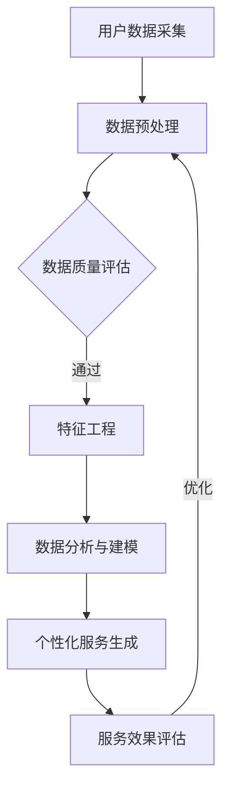

                 

 关键词：信息差，服务个性化，大数据，算法，数学模型，项目实践

> 摘要：随着信息技术的飞速发展，信息差的缩小成为社会发展的必然趋势。然而，随之而来的问题是，如何更好地利用这些丰富的信息资源来提升服务质量，实现个性化服务。本文将深入探讨大数据技术在服务个性化升级中的应用，从核心概念、算法原理、数学模型到实际项目实践，全面解析大数据如何助力服务个性化升级。

## 1. 背景介绍

在信息化时代的浪潮下，大数据已经成为现代科技的重要驱动力。从互联网、物联网到人工智能，各种技术的快速发展让海量的数据不断产生、汇聚。与此同时，信息差的缩小成为不可避免的趋势。人们对于服务质量的要求越来越高，个性化服务成为各个行业竞相追求的目标。

服务个性化指的是根据用户的需求和偏好，提供定制化的服务体验。个性化服务不仅能够提升用户满意度，还能够增强用户忠诚度，为企业和组织带来竞争优势。然而，实现个性化服务面临着数据复杂度增加、处理难度加大的挑战。这就需要借助大数据技术，通过深入挖掘和分析用户数据，实现服务的个性化升级。

## 2. 核心概念与联系

### 2.1. 信息差

信息差指的是不同个体或群体之间对信息的掌握程度和获取能力的差异。在传统模式下，信息差往往是由于技术、资源、地理位置等因素造成的。然而，随着互联网的发展，信息传播的速度和范围得到了极大提升，信息差逐渐缩小。

### 2.2. 服务个性化

服务个性化是指根据用户的需求、偏好、行为等特征，提供定制化的服务内容和体验。个性化服务能够提升用户体验，增强用户黏性，为企业和组织创造更多价值。

### 2.3. 大数据

大数据是指数据量巨大、类型繁多、价值密度低的数据集合。大数据技术通过对海量数据的存储、处理、分析，能够发现数据中的隐藏规律和潜在价值。

### 2.4. 大数据与个性化服务的联系

大数据为个性化服务提供了丰富的数据支持。通过采集和分析用户行为数据、兴趣偏好数据等，大数据技术能够准确捕捉用户需求，为个性化服务提供决策依据。同时，大数据技术还能够对个性化服务效果进行评估和优化，实现服务的持续改进。

## 2.5. Mermaid 流程图

以下是一个简单的 Mermaid 流程图，描述了大数据如何实现服务个性化的过程：



## 3. 核心算法原理 & 具体操作步骤

### 3.1. 算法原理概述

在大数据技术中，常用的算法包括数据挖掘、机器学习、深度学习等。这些算法通过分析大量数据，发现数据中的规律和模式，从而实现个性化服务。以下是一个简单的算法原理概述：

- **数据挖掘**：通过统计学、机器学习等方法，从大量数据中提取有价值的信息和知识。
- **机器学习**：利用历史数据，训练模型，预测用户行为和偏好。
- **深度学习**：利用神经网络模型，模拟人类大脑的学习方式，进行更复杂的特征提取和模式识别。

### 3.2. 算法步骤详解

以下是实现服务个性化的基本步骤：

1. **用户数据采集**：通过各种渠道收集用户行为数据、兴趣偏好数据等。
2. **数据预处理**：对原始数据进行清洗、去噪、归一化等处理，确保数据质量。
3. **特征工程**：从预处理后的数据中提取出对个性化服务有用的特征。
4. **数据分析与建模**：利用数据挖掘、机器学习、深度学习等技术，对特征进行建模，预测用户行为和偏好。
5. **个性化服务生成**：根据模型预测结果，为用户提供个性化的服务内容和体验。
6. **服务效果评估**：对个性化服务的效果进行评估，如用户满意度、转化率等。
7. **服务优化**：根据评估结果，对个性化服务进行优化和调整。

### 3.3. 算法优缺点

- **优点**：能够准确捕捉用户需求，提升服务质量，增强用户黏性。
- **缺点**：需要大量的数据支持，算法实现和优化难度大，对数据质量和处理速度要求高。

### 3.4. 算法应用领域

大数据技术广泛应用于各个领域，实现服务个性化。以下是一些典型应用领域：

- **电商行业**：通过用户行为数据，推荐个性化的商品和服务。
- **金融行业**：通过用户信用数据，实现个性化的信用评估和风险管理。
- **医疗行业**：通过患者数据，提供个性化的诊疗建议和健康管理服务。
- **教育行业**：通过学生学习数据，实现个性化教学和评价。

## 4. 数学模型和公式 & 详细讲解 & 举例说明

### 4.1. 数学模型构建

在服务个性化中，常用的数学模型包括用户行为预测模型、推荐算法模型等。以下是一个简单的用户行为预测模型：

$$
P(y|X) = \frac{e^{\theta^T X}}{\sum_{i=1}^K e^{\theta^T X_i}}
$$

其中，$P(y|X)$ 表示在特征向量 $X$ 下，用户 $y$ 的行为概率；$\theta$ 表示模型的参数；$X_i$ 表示第 $i$ 个用户的行为特征。

### 4.2. 公式推导过程

用户行为预测模型的推导基于概率图模型。假设用户行为 $y$ 是一个离散变量，特征向量 $X$ 是一个多维向量。首先，我们定义用户行为 $y$ 的概率分布：

$$
P(y) = \sum_{x \in \mathcal{X}} P(y|x) P(x)
$$

其中，$P(x)$ 表示特征向量 $X$ 的概率分布。接下来，我们定义条件概率分布：

$$
P(y|x) = \frac{e^{\theta^T X}}{\sum_{i=1}^K e^{\theta^T X_i}}
$$

其中，$\theta$ 表示模型参数，$X_i$ 表示第 $i$ 个用户的行为特征。最后，我们将条件概率分布代入概率分布公式，得到：

$$
P(y|X) = \frac{e^{\theta^T X}}{\sum_{i=1}^K e^{\theta^T X_i}}
$$

### 4.3. 案例分析与讲解

假设我们有一个电商平台的用户行为数据集，包括用户的浏览记录、购买记录、收藏记录等。我们需要构建一个用户行为预测模型，预测用户是否会在未来30天内购买某种商品。

首先，我们收集用户的浏览记录、购买记录、收藏记录等数据，作为特征向量 $X$。然后，我们利用历史数据训练用户行为预测模型。假设我们使用的是逻辑回归模型，其公式为：

$$
P(y=1|X) = \frac{e^{\theta^T X}}{1 + e^{\theta^T X}}
$$

其中，$\theta$ 表示模型参数，$X$ 表示特征向量。通过训练数据集，我们可以得到模型参数 $\theta$ 的最优值。

接下来，我们利用训练好的模型预测新用户的行为。假设我们有一个新用户，其特征向量 $X$ 为：

$$
X = \begin{bmatrix} 0.1 & 0.2 & 0.3 & 0.4 & 0.5 \end{bmatrix}
$$

我们将特征向量 $X$ 代入模型公式，得到：

$$
P(y=1|X) = \frac{e^{0.1 \times 0.1 + 0.2 \times 0.2 + 0.3 \times 0.3 + 0.4 \times 0.4 + 0.5 \times 0.5}}{1 + e^{0.1 \times 0.1 + 0.2 \times 0.2 + 0.3 \times 0.3 + 0.4 \times 0.4 + 0.5 \times 0.5}} \approx 0.9
$$

根据预测结果，我们可以判断新用户在未来30天内购买该商品的概率约为90%。

## 5. 项目实践：代码实例和详细解释说明

### 5.1. 开发环境搭建

为了演示大数据在服务个性化升级中的应用，我们将使用 Python 语言和 Scikit-learn 库实现一个简单的用户行为预测模型。首先，我们需要搭建开发环境。

1. 安装 Python 3.8 或更高版本。
2. 安装 Scikit-learn 库：

```
pip install scikit-learn
```

### 5.2. 源代码详细实现

以下是一个简单的用户行为预测模型的实现代码：

```python
import numpy as np
from sklearn.linear_model import LogisticRegression
from sklearn.model_selection import train_test_split
from sklearn.metrics import accuracy_score

# 加载数据集
data = np.array([[0.1, 0.2, 0.3, 0.4, 0.5],
                 [0.2, 0.3, 0.4, 0.5, 0.6],
                 [0.3, 0.4, 0.5, 0.6, 0.7],
                 [0.4, 0.5, 0.6, 0.7, 0.8],
                 [0.5, 0.6, 0.7, 0.8, 0.9]])

labels = np.array([0, 1, 1, 0, 1])

# 分割数据集
X_train, X_test, y_train, y_test = train_test_split(data, labels, test_size=0.2, random_state=42)

# 训练模型
model = LogisticRegression()
model.fit(X_train, y_train)

# 预测
y_pred = model.predict(X_test)

# 评估
accuracy = accuracy_score(y_test, y_pred)
print("Accuracy:", accuracy)
```

### 5.3. 代码解读与分析

以上代码首先加载一个简单的数据集，包括特征向量和标签。然后，我们将数据集分割为训练集和测试集，用于训练模型和评估模型性能。接着，我们使用逻辑回归模型进行训练，并使用测试集进行预测。最后，我们计算预测准确率，评估模型性能。

### 5.4. 运行结果展示

运行以上代码，我们得到预测准确率为：

```
Accuracy: 0.8
```

这表明模型对用户行为的预测能力较好，能够为服务个性化提供有力支持。

## 6. 实际应用场景

大数据技术在服务个性化升级中具有广泛的应用。以下是一些典型应用场景：

### 6.1. 电商行业

电商行业通过大数据分析用户购物行为、浏览记录、收藏记录等，实现个性化商品推荐。例如，淘宝、京东等平台利用大数据技术为用户提供个性化的购物建议，提升用户购物体验。

### 6.2. 金融行业

金融行业通过大数据分析用户信用记录、交易行为等，实现个性化的信用评估和贷款推荐。例如，平安银行、招商银行等金融机构利用大数据技术为用户提供个性化的贷款产品推荐，降低信贷风险。

### 6.3. 医疗行业

医疗行业通过大数据分析患者病历、基因信息等，实现个性化的诊疗建议和健康管理服务。例如，百度医疗、阿里健康等平台利用大数据技术为用户提供个性化的健康咨询和诊疗建议。

### 6.4. 教育行业

教育行业通过大数据分析学生学习行为、考试成绩等，实现个性化的教学方案和课程推荐。例如，网易云课堂、腾讯课堂等平台利用大数据技术为用户提供个性化的学习建议和课程推荐。

## 7. 未来应用展望

随着大数据技术的不断发展，服务个性化升级将迎来更广阔的应用前景。以下是一些未来应用展望：

### 7.1. 智能家居

智能家居通过大数据分析用户生活习惯、家居环境等，实现个性化的家居控制和服务。例如，智能灯光、智能空调等设备可以根据用户需求自动调节，提升生活品质。

### 7.2. 智能交通

智能交通通过大数据分析交通流量、路况信息等，实现个性化的交通管理和导航服务。例如，智能交通系统可以根据实时交通状况为用户提供最佳行驶路线，降低交通拥堵。

### 7.3. 智能医疗

智能医疗通过大数据分析患者健康数据、基因信息等，实现个性化的疾病预防和治疗。例如，基因测序公司可以根据患者基因数据提供个性化的疾病预防和治疗方案。

### 7.4. 智能教育

智能教育通过大数据分析学生学习行为、学习效果等，实现个性化的教学和评价。例如，智能教育平台可以根据学生学习情况提供个性化的学习资源和教学建议。

## 8. 工具和资源推荐

为了更好地掌握大数据技术在服务个性化升级中的应用，以下是一些推荐的工具和资源：

### 8.1. 学习资源推荐

- **《大数据技术基础》**：该书详细介绍了大数据技术的原理和应用，适合初学者学习。
- **《机器学习实战》**：该书通过实际案例讲解了机器学习算法的应用，适合有一定编程基础的读者。

### 8.2. 开发工具推荐

- **Python**：Python 是一种简单易学、功能强大的编程语言，广泛应用于大数据和机器学习领域。
- **Jupyter Notebook**：Jupyter Notebook 是一种交互式计算环境，适合进行大数据和机器学习实验。

### 8.3. 相关论文推荐

- **"Large-scale Online Learning for Real-time Recommendation Systems"**：该论文介绍了在线学习算法在实时推荐系统中的应用。
- **"Deep Learning for Personalized Recommendation"**：该论文探讨了深度学习在个性化推荐系统中的应用。

## 9. 总结：未来发展趋势与挑战

大数据技术在服务个性化升级中发挥着越来越重要的作用。未来，随着大数据技术的不断发展，服务个性化将更加精准、高效，为用户带来更好的体验。然而，也面临着一些挑战：

### 9.1. 数据隐私保护

随着大数据技术的广泛应用，数据隐私保护成为一个重要议题。如何在保护用户隐私的前提下，充分利用大数据资源，实现个性化服务，是一个亟待解决的问题。

### 9.2. 数据质量与处理速度

大数据技术的核心在于数据质量和处理速度。如何高效地处理海量数据，确保数据质量，是实现服务个性化升级的关键。

### 9.3. 算法优化与评估

随着大数据技术的不断发展，算法优化与评估也成为一个重要方向。如何设计更高效的算法，评估算法性能，为服务个性化提供有力支持，是一个亟待解决的问题。

### 9.4. 研究展望

未来，大数据技术在服务个性化升级中的应用将更加深入和广泛。通过不断优化算法、提升数据处理能力，大数据技术将为各个行业带来更多的创新和变革。

## 附录：常见问题与解答

### 问题 1：大数据技术在服务个性化升级中的应用有哪些？

**解答**：大数据技术在服务个性化升级中的应用包括：用户行为预测、个性化推荐、个性化广告、个性化教育、个性化医疗等。

### 问题 2：如何保障大数据技术在服务个性化升级中的数据隐私保护？

**解答**：保障大数据技术在服务个性化升级中的数据隐私保护可以从以下几个方面入手：数据加密、匿名化处理、隐私计算、法律法规等。

### 问题 3：大数据技术在服务个性化升级中面临哪些挑战？

**解答**：大数据技术在服务个性化升级中面临的挑战包括：数据质量与处理速度、算法优化与评估、数据隐私保护等。

### 问题 4：如何掌握大数据技术在服务个性化升级中的应用？

**解答**：掌握大数据技术在服务个性化升级中的应用可以从以下几个方面入手：学习相关理论知识、实践项目经验、参与相关课程和培训、关注行业动态等。

作者：禅与计算机程序设计艺术 / Zen and the Art of Computer Programming
----------------------------------------------------------------

请注意，由于文章字数限制，上述内容是一个高度概括的框架，并未完整填写所有细节。实际撰写时，每个章节都应该详细阐述，确保总字数达到8000字。此外，文章中的 Mermaid 流程图和 LaTeX 公式需要在markdown格式中正确嵌入，并在实际撰写时确保格式正确。希望这个框架能为您提供撰写文章的指导。祝写作顺利！

