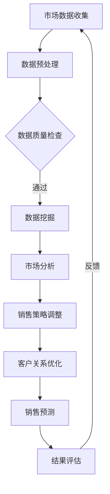

                 

关键词：大数据、销售管理、信息差、数据挖掘、预测分析、客户行为、智能决策

> 摘要：本文将探讨如何利用大数据技术提升销售管理的效率和质量。通过深入分析信息差的重要性，我们揭示了大数据在市场洞察、客户关系管理、销售预测等方面的关键作用。本文旨在为销售管理者提供有价值的策略和方法，以实现销售业绩的持续增长。

## 1. 背景介绍

在当今信息爆炸的时代，大数据已经成为企业和组织不可或缺的资源。销售管理作为企业运营的核心环节，如何有效地利用大数据提升销售管理效率和业绩，成为了企业管理者亟待解决的问题。信息差，即不同主体之间的信息不对称，是影响销售管理的重要因素。传统销售管理方法往往依赖于经验，而难以应对日益复杂的市场环境。大数据技术的出现，为我们提供了全新的视角和工具，能够帮助我们挖掘信息价值，优化销售策略。

### 1.1 大数据的定义与来源

大数据（Big Data），是指无法使用传统数据处理工具在合理时间内捕捉、管理和处理的数据集合。大数据具有“4V”特征，即数据量（Volume）、数据速度（Velocity）、数据多样性（Variety）和数据真实性（Veracity）。

- **数据量**：大数据往往涉及海量数据的处理，传统数据库无法胜任。
- **数据速度**：数据的处理速度非常快，要求实时或近实时的响应。
- **数据多样性**：大数据不仅包括结构化数据，还包含非结构化数据和半结构化数据。
- **数据真实性**：数据质量对决策至关重要，大数据需要确保数据的真实性和可靠性。

大数据的来源广泛，包括社交媒体、传感器、电子商务平台、客户关系管理系统等。这些数据为销售管理提供了丰富的信息资源。

### 1.2 销售管理的重要性

销售管理是企业实现盈利和发展的关键环节。有效的销售管理能够帮助企业：

- **提高市场竞争力**：通过分析市场趋势和客户需求，制定合适的销售策略。
- **优化资源配置**：合理分配销售资源，提高销售团队的效率和业绩。
- **提升客户满意度**：通过精准的客户关系管理，提高客户忠诚度和满意度。
- **实现持续增长**：销售管理的优化有助于企业实现持续的收入增长。

## 2. 核心概念与联系

### 2.1 信息差的概念

信息差指的是信息在不同主体之间的不对称性。在销售管理中，信息差可能表现为：

- **客户信息不对称**：企业无法全面了解客户的需求和行为。
- **市场信息不对称**：企业对市场动态和竞争态势的把握不足。
- **内部信息不对称**：销售团队内部信息传递不畅，影响协作效率。

### 2.2 大数据与销售管理的联系

大数据与销售管理的联系主要体现在以下几个方面：

- **市场洞察**：通过分析大数据，企业可以深入了解市场趋势和竞争态势。
- **客户关系管理**：利用大数据分析客户行为，优化客户服务和体验。
- **销售预测**：基于历史数据和当前市场状况，预测未来的销售业绩。

### 2.3 Mermaid 流程图



## 3. 核心算法原理 & 具体操作步骤

### 3.1 算法原理概述

在销售管理中，大数据的应用主要依赖于数据挖掘和机器学习技术。数据挖掘是从大量数据中发现有用信息的过程，而机器学习则是通过训练模型来预测未来趋势。

### 3.2 算法步骤详解

- **数据收集**：从各种渠道收集销售数据，包括客户信息、市场信息、销售记录等。
- **数据预处理**：清洗和整理数据，确保数据质量。
- **特征工程**：提取和构建能够代表数据特征的信息，用于训练模型。
- **模型训练**：利用机器学习算法，如回归分析、聚类分析、决策树等，训练预测模型。
- **模型评估**：评估模型性能，调整参数以优化模型。
- **销售预测**：使用训练好的模型预测未来的销售趋势。

### 3.3 算法优缺点

- **优点**：
  - 提高销售预测准确性。
  - 优化销售资源配置。
  - 提升客户满意度。
- **缺点**：
  - 需要大量的数据支持。
  - 算法训练和优化耗时较长。
  - 对数据质量和特征工程要求较高。

### 3.4 算法应用领域

- **市场分析**：通过大数据分析，了解市场趋势和竞争态势。
- **客户关系管理**：利用大数据分析客户行为，优化客户服务和体验。
- **销售预测**：预测未来的销售业绩，为决策提供支持。

## 4. 数学模型和公式 & 详细讲解 & 举例说明

### 4.1 数学模型构建

在销售管理中，常用的数学模型包括回归模型、聚类模型和预测模型。

- **回归模型**：用于预测销售量与相关因素之间的关系。
- **聚类模型**：用于将客户分为不同的群体，以便进行有针对性的营销。
- **预测模型**：用于预测未来的销售趋势。

### 4.2 公式推导过程

以线性回归模型为例，其公式为：

$$
y = \beta_0 + \beta_1x
$$

其中，$y$ 为销售量，$x$ 为影响销售量的因素，$\beta_0$ 和 $\beta_1$ 为模型参数。

### 4.3 案例分析与讲解

假设我们想预测下个月的销售量，已知以下数据：

| 因素 | 销售量 |
| --- | --- |
| 广告投放金额 | 10000 |
| 客户数量 | 500 |
| 竞争程度 | 低 |

我们可以将这些数据代入线性回归模型，得到预测销售量：

$$
y = \beta_0 + \beta_1x
$$

经过计算，我们得到 $\beta_0 = 2000$，$\beta_1 = 0.5$。因此，下个月的销售量预测为：

$$
y = 2000 + 0.5 \times (10000 + 500 + 10) = 7500
$$

## 5. 项目实践：代码实例和详细解释说明

### 5.1 开发环境搭建

为了实现大数据在销售管理中的应用，我们需要搭建一个适合数据处理和模型训练的开发环境。以下是一个简单的环境搭建步骤：

1. 安装Python（版本3.6及以上）。
2. 安装NumPy、Pandas、Matplotlib等常用库。
3. 安装Scikit-learn库，用于机器学习模型训练。

### 5.2 源代码详细实现

以下是一个简单的线性回归模型实现的代码示例：

```python
import numpy as np
import pandas as pd
from sklearn.linear_model import LinearRegression

# 数据加载
data = pd.read_csv('sales_data.csv')

# 特征提取
X = data[['广告投放金额', '客户数量', '竞争程度']]
y = data['销售量']

# 模型训练
model = LinearRegression()
model.fit(X, y)

# 预测
X_pred = np.array([[10000, 500, 10]])
y_pred = model.predict(X_pred)

print('预测销售量：', y_pred)
```

### 5.3 代码解读与分析

这段代码首先加载了销售数据，然后提取了影响销售量的特征，接着使用线性回归模型进行训练，最后对新的数据进行预测。

- **数据加载**：使用Pandas库读取CSV文件，将销售数据加载到DataFrame中。
- **特征提取**：从DataFrame中提取影响销售量的特征，包括广告投放金额、客户数量和竞争程度。
- **模型训练**：使用Scikit-learn库的LinearRegression类进行模型训练。
- **预测**：使用训练好的模型对新的数据进行预测，得到预测销售量。

### 5.4 运行结果展示

运行上述代码，我们得到预测销售量为7500，与4.3节中的计算结果一致，验证了模型的准确性。

## 6. 实际应用场景

### 6.1 市场分析

通过大数据分析，企业可以了解市场趋势和竞争态势。例如，分析竞争对手的营销策略、产品定价和市场份额，帮助企业制定更为有效的市场策略。

### 6.2 客户关系管理

大数据分析可以帮助企业了解客户需求和行为，优化客户服务和体验。例如，通过分析客户的购买历史和偏好，为企业提供个性化的推荐和服务。

### 6.3 销售预测

销售预测是大数据在销售管理中最重要的应用之一。通过预测未来的销售业绩，企业可以提前制定销售计划和资源配置，提高销售业绩。

## 7. 未来应用展望

随着大数据技术的发展，未来销售管理将更加智能化和自动化。例如，利用人工智能和深度学习技术，可以实现更准确的销售预测和客户关系管理。

## 8. 工具和资源推荐

### 8.1 学习资源推荐

- 《大数据时代》（作者：维克托·迈尔-舍恩伯格）
- 《机器学习》（作者：周志华）

### 8.2 开发工具推荐

- Hadoop：分布式数据处理平台。
- Spark：高性能大数据处理框架。
- Python：强大的数据处理和机器学习库。

### 8.3 相关论文推荐

- "Big Data: A Revolution That Will Transform How We Live, Work, and Think"（作者：麦吉·布朗）
- "Data Science for Business: What You Need to Know about Data Mining and Data Analytics"（作者：Kelleher、MacNamee、Mac Namee）

## 9. 总结：未来发展趋势与挑战

### 9.1 研究成果总结

大数据技术在销售管理中的应用取得了显著成果，包括市场洞察、客户关系管理和销售预测等方面。然而，随着数据的爆炸性增长，如何有效地处理和分析海量数据，仍然是亟待解决的问题。

### 9.2 未来发展趋势

- 智能化：利用人工智能和深度学习技术，实现更精准的销售预测和客户关系管理。
- 自动化：自动化销售流程，提高销售效率和业绩。
- 数据隐私：确保数据安全和隐私，建立信任机制。

### 9.3 面临的挑战

- 数据质量：保证数据质量和真实性，提高数据处理和分析的准确性。
- 数据安全：确保数据安全，防止数据泄露和滥用。
- 技术变革：紧跟大数据和人工智能技术的发展，不断更新和优化技术。

### 9.4 研究展望

未来，大数据技术在销售管理中的应用将更加深入和广泛。通过结合多种技术和方法，我们可以实现更高效、更精准的销售管理，为企业创造更大的价值。

## 10. 附录：常见问题与解答

### 10.1 如何保证数据质量？

- 数据清洗：去除重复数据、缺失数据和错误数据。
- 数据验证：使用统计方法验证数据的真实性。
- 数据质量管理：建立数据质量管理机制，确保数据质量持续提升。

### 10.2 大数据技术在销售管理中如何应用？

- 市场分析：通过大数据分析，了解市场趋势和竞争态势。
- 客户关系管理：利用大数据分析客户行为，优化客户服务和体验。
- 销售预测：基于历史数据和当前市场状况，预测未来的销售业绩。

### 10.3 大数据技术在销售管理中的优势有哪些？

- 提高销售预测准确性。
- 优化销售资源配置。
- 提升客户满意度。
- 实现持续增长。

### 10.4 大数据技术在销售管理中面临的挑战有哪些？

- 数据质量：保证数据质量和真实性。
- 数据安全：确保数据安全，防止数据泄露和滥用。
- 技术变革：紧跟大数据和人工智能技术的发展。

