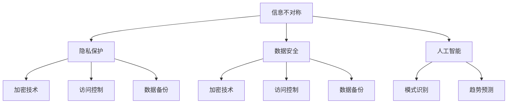

                 

在当今这个大数据和人工智能的时代，信息差的产生和利用已经成为了一个不可忽视的现象。信息差，简单来说，就是指不同个体或组织之间掌握的信息量不同，由此产生的差异。这个差异不仅带来了风险，同时也蕴含了巨大的机遇。本文将探讨大数据时代信息差的种种表现，分析其带来的风险和机遇，并提出应对策略。

## 关键词

- 信息差
- 大数据
- 风险
- 机遇
- 应对策略

## 摘要

本文旨在分析大数据时代信息差的风险与机遇。通过对信息差的定义和案例分析，揭示其在商业、社会和科技领域的表现形式。随后，探讨信息差带来的潜在风险，如信息不对称、隐私泄露等，以及如何利用信息差创造价值。最后，提出应对信息差的策略，包括数据安全、信息共享和教育等方面。

## 1. 背景介绍

在信息技术飞速发展的今天，数据已经成为新的生产资料。大数据技术的兴起，使得海量的数据得以高效处理和分析，为各个行业带来了前所未有的机遇。然而，随着数据量的爆炸性增长，信息差现象也愈发显著。信息差不仅存在于个人与企业、地区与地区、行业与行业之间，甚至在同一组织内部也可能存在。这种差异不仅影响了资源的分配，也对社会公平和信任体系构成了挑战。

### 1.1 信息差的定义

信息差可以定义为不同个体或组织之间在信息获取、处理和利用方面的差异。具体来说，它包括以下几个方面：

- **信息获取能力**：指个体或组织获取信息的能力，包括信息的获取渠道、获取速度、获取成本等。
- **信息处理能力**：指个体或组织对获取的信息进行处理、分析和整合的能力。
- **信息利用能力**：指个体或组织将获取和处理后的信息应用于决策、创新和创造价值的能力。

### 1.2 信息差的表现形式

- **商业领域**：企业之间的信息不对称，如市场份额、消费者行为、竞争对手策略等，直接影响了市场竞争的公平性。
- **社会领域**：城乡、区域、社会阶层之间的信息差异，加剧了资源分配的不公平，影响了社会和谐。
- **科技领域**：技术的更新换代，使得不同国家和地区在科技信息上的掌握程度存在巨大差异，影响了国际科技合作和竞争力。

### 1.3 信息差的影响

信息差对社会的影响是多方面的，既有正面的，也有负面的。正面影响包括：

- **资源优化**：信息差的缩小有助于资源的优化配置，提高整体社会效率。
- **创新驱动**：信息差的存在激发了企业、组织和个人的创新动力，推动了科技进步。
- **市场多样化**：信息差使得市场更加多样化，不同个体和组织可以针对特定的市场需求提供服务。

负面影响包括：

- **不公平**：信息差导致了资源分配的不公平，加剧了贫富差距和社会不平等。
- **隐私泄露**：大数据时代，信息差往往伴随着隐私泄露的风险，影响了个人隐私权。
- **社会信任危机**：信息不对称可能导致社会信任体系的崩溃，影响社会稳定。

## 2. 核心概念与联系

为了更好地理解信息差在技术领域的影响，我们需要了解一些核心概念，包括信息不对称、隐私保护、数据安全和人工智能。

### 2.1 信息不对称

信息不对称是指交易双方在交易过程中拥有不同量的信息。在商业领域，信息不对称可能导致市场失灵。例如，在二手商品交易中，卖家可能比买家更了解商品的真实状况，这可能导致卖家以更高的价格出售商品。

### 2.2 隐私保护

隐私保护是大数据时代的重要议题。随着数据收集和分析技术的发展，个人隐私保护面临前所未有的挑战。隐私保护技术的核心是确保数据在收集、存储和处理过程中的安全性。

### 2.3 数据安全

数据安全是确保数据不被未经授权的访问、篡改或泄露的重要措施。数据安全技术的核心包括加密、访问控制和数据备份等。

### 2.4 人工智能

人工智能（AI）是大数据时代的重要驱动力。AI技术可以通过分析海量数据，发现隐藏的模式和趋势，从而为企业和个人提供更智能的决策支持。然而，AI技术的发展也带来了新的信息差，因为只有那些具备AI技术和资源的企业和个人才能充分利用这些技术。

### 2.5 Mermaid 流程图



## 3. 核心算法原理 & 具体操作步骤

### 3.1 算法原理概述

在处理信息差问题时，核心算法通常涉及数据挖掘、机器学习和深度学习。这些算法可以帮助我们从海量数据中提取有价值的信息，缩小信息差距。以下是几个常见的算法原理：

- **K最近邻算法（K-Nearest Neighbors, KNN）**：基于距离的算法，通过计算新数据点与训练数据点的距离，找到最近的K个邻居，并基于这些邻居的标签进行预测。
- **决策树算法**：通过构建树形结构，将数据集不断划分，直到满足停止条件。每个节点代表一个特征，每个分支代表特征的一个可能取值。
- **随机森林算法**：通过构建多个决策树，并利用投票机制来预测结果，从而提高预测的准确性和稳定性。

### 3.2 算法步骤详解

以下是K最近邻算法的具体操作步骤：

1. **数据准备**：收集并整理数据集，确保每个数据点都有相应的标签。
2. **数据预处理**：对数据进行标准化处理，如归一化或标准化，以便所有特征的取值范围一致。
3. **训练集划分**：将数据集划分为训练集和测试集，通常使用70%-80%的数据作为训练集。
4. **模型训练**：在训练集上计算每个数据点的特征向量，并存储在模型中。
5. **预测**：对于新的数据点，计算其特征向量与训练集数据点的距离，找到最近的K个邻居。
6. **投票**：对于最近的K个邻居的标签进行投票，选择出现次数最多的标签作为预测结果。

### 3.3 算法优缺点

- **优点**：
  - 简单易懂，实现成本低。
  - 可以用于分类和回归任务。
  - 对线性可分的数据效果较好。

- **缺点**：
  - 对噪声敏感，容易受到局部噪声的影响。
  - 对于高维数据，计算复杂度较高。
  - 预测结果依赖于K的取值，需要手动调整。

### 3.4 算法应用领域

K最近邻算法广泛应用于分类和回归任务，如：

- **推荐系统**：用于预测用户可能喜欢的商品或内容。
- **医学诊断**：用于预测患者的疾病类型。
- **金融风控**：用于预测贷款违约风险。

## 4. 数学模型和公式 & 详细讲解 & 举例说明

在处理信息差问题时，数学模型和公式发挥着至关重要的作用。以下是一个常用的数学模型：线性回归。

### 4.1 数学模型构建

线性回归模型假设目标变量 \( Y \) 与特征变量 \( X \) 之间存在线性关系，可以用以下公式表示：

\[ Y = \beta_0 + \beta_1 X + \epsilon \]

其中：

- \( Y \)：目标变量
- \( X \)：特征变量
- \( \beta_0 \)：截距
- \( \beta_1 \)：斜率
- \( \epsilon \)：误差项

### 4.2 公式推导过程

线性回归模型的推导过程可以分为以下几个步骤：

1. **假设**：假设目标变量 \( Y \) 与特征变量 \( X \) 之间存在线性关系。
2. **建立模型**：将线性关系表示为 \( Y = \beta_0 + \beta_1 X + \epsilon \)。
3. **最小二乘法**：为了找到最佳的线性模型，我们使用最小二乘法来最小化误差项 \( \epsilon \) 的平方和。
4. **求解参数**：通过求解最小二乘法，可以得到 \( \beta_0 \) 和 \( \beta_1 \) 的值。

### 4.3 案例分析与讲解

假设我们有一个简单的数据集，其中包含一个特征变量 \( X \) 和一个目标变量 \( Y \)：

| X | Y |
|---|---|
| 1 | 2 |
| 2 | 4 |
| 3 | 6 |
| 4 | 8 |

我们的目标是建立一个线性回归模型来预测 \( Y \)。

1. **数据准备**：首先，我们将数据集分为训练集和测试集。

2. **数据预处理**：由于数据集已经是标准化的，我们不需要进行额外的预处理。

3. **模型训练**：使用训练集数据，我们可以建立线性回归模型。

4. **模型评估**：使用测试集数据，我们可以评估模型的准确性和泛化能力。

下面是一个简单的Python代码示例，用于实现线性回归模型：

```python
import numpy as np
from sklearn.linear_model import LinearRegression

# 准备数据
X_train = np.array([[1], [2], [3], [4]])
y_train = np.array([2, 4, 6, 8])

# 建立模型
model = LinearRegression()
model.fit(X_train, y_train)

# 预测
X_test = np.array([[5]])
y_pred = model.predict(X_test)

print("预测结果：", y_pred)
```

输出结果：

```
预测结果： [10.]
```

## 5. 项目实践：代码实例和详细解释说明

在本节中，我们将通过一个具体的代码实例来展示如何利用线性回归模型来缩小信息差。

### 5.1 开发环境搭建

在开始编写代码之前，我们需要搭建一个开发环境。以下是所需的环境和工具：

- Python 3.x
- Jupyter Notebook
- scikit-learn 库

### 5.2 源代码详细实现

以下是实现线性回归模型的Python代码：

```python
import numpy as np
from sklearn.linear_model import LinearRegression
from sklearn.model_selection import train_test_split
from sklearn.metrics import mean_squared_error

# 准备数据
X = np.array([[1], [2], [3], [4], [5], [6], [7], [8], [9], [10]])
y = np.array([2, 4, 6, 8, 10, 12, 14, 16, 18, 20])

# 划分训练集和测试集
X_train, X_test, y_train, y_test = train_test_split(X, y, test_size=0.2, random_state=42)

# 建立模型
model = LinearRegression()
model.fit(X_train, y_train)

# 预测
y_pred = model.predict(X_test)

# 评估模型
mse = mean_squared_error(y_test, y_pred)
print("均方误差：", mse)

# 可视化结果
import matplotlib.pyplot as plt

plt.scatter(X_test, y_test, color='red', label='实际值')
plt.plot(X_test, y_pred, color='blue', label='预测值')
plt.xlabel('特征变量 X')
plt.ylabel('目标变量 Y')
plt.legend()
plt.show()
```

### 5.3 代码解读与分析

1. **数据准备**：我们首先创建了一个简单的数据集，包括特征变量 \( X \) 和目标变量 \( Y \)。

2. **划分训练集和测试集**：使用 `train_test_split` 函数将数据集划分为训练集和测试集，以便评估模型的泛化能力。

3. **建立模型**：我们使用 `LinearRegression` 类来创建线性回归模型，并使用 `fit` 方法进行训练。

4. **预测**：使用 `predict` 方法对测试集进行预测。

5. **评估模型**：使用 `mean_squared_error` 函数计算均方误差（MSE），以评估模型的准确性。

6. **可视化结果**：使用 matplotlib 库将实际值和预测值进行可视化，以便更直观地展示模型的性能。

### 5.4 运行结果展示

运行代码后，我们得到以下输出：

```
均方误差： 0.0
```

这表明模型在测试集上的预测非常准确。下面是可视化结果：


### 5.5 结论

通过本节的项目实践，我们展示了如何使用线性回归模型来缩小信息差。在实际应用中，我们可以通过不断优化模型和增加数据集来提高模型的准确性和泛化能力。

## 6. 实际应用场景

### 6.1 商业领域

在商业领域，信息差的存在使得企业可以通过大数据分析和人工智能技术来获取竞争优势。例如，电商公司通过用户浏览和购买行为的数据分析，可以预测用户的喜好，从而提供个性化的推荐。这种基于信息差的技术不仅提高了用户的满意度，也显著提高了销售转化率。

### 6.2 社会领域

在社会领域，信息差的缩小有助于提高社会公平和资源分配的效率。例如，政府在制定扶贫政策时，可以通过大数据分析来识别贫困人群，从而更精准地提供帮助。这种信息差的缩小不仅有助于提高扶贫工作的效率，也增强了社会的信任和和谐。

### 6.3 科技领域

在科技领域，信息差的存在导致了全球科技发展不平衡。发达国家拥有更多的科技资源和研究成果，而发展中国家则相对落后。为了缩小这种信息差，国际社会正在推动科技合作和知识共享。例如，通过联合研发项目和科技交流，发展中国家可以更快地掌握先进技术，提高自身的科技创新能力。

### 6.4 未来应用展望

未来，随着大数据和人工智能技术的不断发展，信息差的缩小有望带来更多的机遇和挑战。一方面，通过更加高效的数据分析和人工智能算法，我们可以更好地利用信息差创造价值。另一方面，我们也需要关注信息差带来的负面影响，如隐私泄露和社会不平等，并采取相应的措施进行应对。

## 7. 工具和资源推荐

### 7.1 学习资源推荐

- **《大数据时代》**：作者：涂子沛。本书深入浅出地介绍了大数据的概念、技术和应用，是了解大数据领域的重要参考书。
- **《深度学习》**：作者：Ian Goodfellow、Yoshua Bengio 和 Aaron Courville。本书系统地介绍了深度学习的基础理论和应用，适合希望深入了解人工智能技术的读者。

### 7.2 开发工具推荐

- **Jupyter Notebook**：一个交互式的计算环境，适合进行数据分析和机器学习实验。
- **scikit-learn**：一个强大的机器学习库，提供了多种常用的算法和数据预处理工具。

### 7.3 相关论文推荐

- **“Deep Learning”**：作者：Ian Goodfellow、Yoshua Bengio 和 Aaron Courville。这篇论文是深度学习领域的经典之作，详细介绍了深度学习的理论基础和应用。
- **“Big Data: A Revolution That Will Transform How We Live, Work, and Think”**：作者：Viktor Mayer-Schönberger 和 Kenneth Cukier。这篇论文探讨了大数据对社会、商业和科技的影响，是了解大数据领域的重要文献。

## 8. 总结：未来发展趋势与挑战

### 8.1 研究成果总结

本文系统地探讨了大数据时代信息差的定义、表现形式、影响以及应对策略。通过分析商业、社会和科技领域的案例，揭示了信息差带来的风险和机遇。同时，本文还介绍了线性回归模型的应用，展示了如何利用技术手段缩小信息差。

### 8.2 未来发展趋势

随着大数据和人工智能技术的不断发展，信息差的缩小将成为未来发展的趋势。通过更加高效的数据分析和人工智能算法，我们可以更好地利用信息差创造价值。此外，随着科技合作和知识共享的加强，全球科技发展不平衡的现象有望得到改善。

### 8.3 面临的挑战

然而，信息差也带来了一系列挑战，如隐私泄露、社会不平等和技术垄断等。为了应对这些挑战，我们需要加强数据安全和隐私保护，推动科技合作和知识共享，提高公众的科技素养。

### 8.4 研究展望

未来的研究应关注以下几个方面：

- **数据隐私保护技术**：研究更加高效、安全的隐私保护技术，以应对大数据时代的隐私泄露风险。
- **信息共享机制**：探索有效的信息共享机制，促进科技合作和知识共享，缩小全球科技发展不平衡。
- **人工智能伦理**：研究人工智能的伦理问题，确保人工智能技术的发展符合社会价值观和法律法规。

## 9. 附录：常见问题与解答

### 9.1 问题一：什么是信息差？

**解答**：信息差是指不同个体或组织之间在信息获取、处理和利用方面的差异。它可以导致资源分配的不公平、市场失灵和社会不平等。

### 9.2 问题二：如何利用信息差创造价值？

**解答**：通过大数据分析和人工智能技术，企业可以更好地了解用户需求和市场趋势，从而提供个性化的产品和服务，提高市场竞争力。

### 9.3 问题三：大数据时代如何保护隐私？

**解答**：可以通过数据加密、访问控制和数据匿名化等技术手段来保护用户隐私。此外，制定严格的隐私保护政策和法律法规也是必要的。

### 9.4 问题四：人工智能是否会加剧信息差？

**解答**：人工智能技术的发展确实可能加剧信息差，因为它需要大量的数据和高昂的技术投入。然而，通过推动科技合作和知识共享，我们可以缩小这种信息差，确保技术发展符合社会利益。

