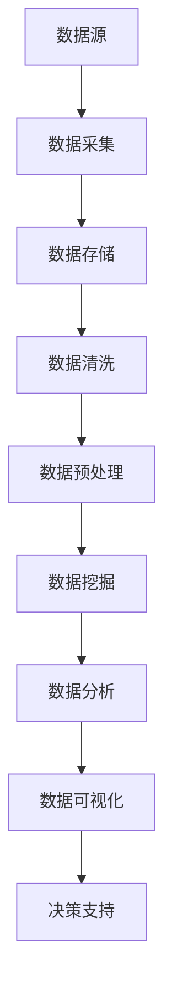

                 

关键词：大数据、信息差、行业变革、技术突破、人工智能、应用实例

> 摘要：随着信息技术的飞速发展，大数据技术已渗透到各个行业，成为推动产业升级和经济增长的重要动力。本文将探讨大数据如何通过信息差这一核心机制，重塑行业格局，带来前所未有的变革与创新。

## 1. 背景介绍

在信息化时代，数据已成为新的生产资料，而大数据技术则是挖掘这些数据价值的关键工具。大数据技术的兴起，源于互联网、物联网、传感器技术的广泛应用，使得海量数据的收集、存储、处理和分析成为可能。随着数据量的不断增长，大数据技术不仅改变了企业运营方式，也推动了整个行业的格局重塑。

### 信息差的定义

信息差是指不同个体或组织在获取、处理和利用信息方面的差异。在传统经济中，信息差往往导致了市场的不对称和资源的错配。而在大数据时代，信息差则成为了创新和竞争优势的源泉。

### 大数据的崛起

大数据的崛起源于以下几个关键因素：

- **数据来源的多样化**：互联网、物联网、社交媒体、传感器等技术，使得数据来源变得极其丰富和多样化。
- **数据存储和处理能力的提升**：云计算、分布式计算等技术，使得海量数据的存储和处理变得更加高效和廉价。
- **算法和机器学习的进步**：深度学习、数据挖掘等技术，使得数据的价值得以更深入地挖掘。

## 2. 核心概念与联系

### 大数据技术架构

为了更好地理解大数据如何通过信息差重塑行业格局，我们需要先了解其技术架构。以下是一个简化的Mermaid流程图，展示了大数据技术的主要组成部分和它们之间的联系。



### 信息差的机制

大数据通过以下机制放大了信息差：

- **数据收集**：企业能够收集更多的数据，使得信息更为全面。
- **数据处理**：通过高效的数据处理技术，企业能够从数据中提取出更有价值的洞见。
- **数据共享**：在商业生态中，数据不再是孤岛，而是可以通过共享实现价值最大化。

### 行业重塑的驱动力

大数据通过信息差带来的变革，主要体现在以下几个方面：

- **市场洞察**：企业能够更准确地了解市场需求，优化产品和服务。
- **决策支持**：通过数据分析，企业能够做出更加科学的决策，提高运营效率。
- **商业模式创新**：大数据使得商业模式更加灵活，创新成为可能。

## 3. 核心算法原理 & 具体操作步骤

### 3.1 算法原理概述

大数据处理的核心算法主要包括：

- **数据挖掘算法**：如K-means聚类、决策树、随机森林等。
- **机器学习算法**：如神经网络、支持向量机、深度学习等。
- **统计分析算法**：如线性回归、逻辑回归、时间序列分析等。

### 3.2 算法步骤详解

1. **数据收集**：从多个来源收集数据，包括内部数据（如销售记录、客户反馈）和外部数据（如社交媒体、公共数据库）。
2. **数据预处理**：清洗数据，处理缺失值、异常值，进行数据转换和集成。
3. **特征工程**：选择和构建特征，为数据挖掘和机器学习算法提供输入。
4. **模型训练**：选择合适的算法，对数据进行训练，建立模型。
5. **模型评估**：使用验证集或测试集，评估模型的性能。
6. **模型应用**：将模型应用到实际场景，如预测销售趋势、客户行为分析等。

### 3.3 算法优缺点

- **数据挖掘算法**：优点是能够发现数据中的隐含模式和关联，缺点是算法复杂度较高，对数据质量和预处理要求较高。
- **机器学习算法**：优点是自适应性强，能够处理大规模数据，缺点是需要大量的训练数据和计算资源。
- **统计分析算法**：优点是理论基础扎实，易于理解和应用，缺点是处理复杂数据的能力较弱。

### 3.4 算法应用领域

- **金融行业**：风险评估、欺诈检测、投资决策等。
- **零售行业**：需求预测、库存管理、个性化推荐等。
- **医疗行业**：疾病预测、诊断辅助、治疗方案优化等。
- **交通行业**：交通流量预测、路况优化、智能交通管理等。

## 4. 数学模型和公式 & 详细讲解 & 举例说明

### 4.1 数学模型构建

在大数据处理中，常用的数学模型包括线性回归模型、决策树模型、神经网络模型等。以下是一个简化的线性回归模型：

$$y = \beta_0 + \beta_1 x_1 + \beta_2 x_2 + ... + \beta_n x_n + \epsilon$$

其中，$y$ 是因变量，$x_1, x_2, ..., x_n$ 是自变量，$\beta_0, \beta_1, ..., \beta_n$ 是模型参数，$\epsilon$ 是误差项。

### 4.2 公式推导过程

线性回归模型的推导过程主要包括：

1. **目标函数**：定义最小化误差平方和为目标函数。

$$J(\theta) = \frac{1}{2m} \sum_{i=1}^{m} (h_\theta(x^{(i)}) - y^{(i)})^2$$

2. **梯度下降法**：通过迭代更新模型参数，使得目标函数最小化。

$$\theta_j := \theta_j - \alpha \frac{\partial J(\theta)}{\partial \theta_j}$$

3. **最优解**：当梯度接近零时，模型参数达到最优值。

### 4.3 案例分析与讲解

假设我们有一个房价预测问题，特征包括房屋面积、房屋年龄、区域等。我们可以构建一个线性回归模型，预测房价。具体步骤如下：

1. **数据收集**：收集大量房屋销售数据，包括房屋面积、房屋年龄、区域等。
2. **数据预处理**：清洗数据，处理缺失值、异常值，进行特征转换。
3. **特征工程**：选择和构建特征，如房屋面积的对数、区域编码等。
4. **模型训练**：使用线性回归算法，训练模型。
5. **模型评估**：使用验证集或测试集，评估模型性能。
6. **模型应用**：将模型应用到实际场景，如预测新房屋的售价。

## 5. 项目实践：代码实例和详细解释说明

### 5.1 开发环境搭建

- **Python**：安装Python 3.8及以上版本。
- **NumPy**：安装NumPy库，用于数据处理。
- **Pandas**：安装Pandas库，用于数据处理。
- **Scikit-learn**：安装Scikit-learn库，用于机器学习算法。

### 5.2 源代码详细实现

以下是一个简单的线性回归模型的Python代码实现：

```python
import numpy as np
import pandas as pd
from sklearn.linear_model import LinearRegression

# 数据收集
data = pd.read_csv('house_prices.csv')

# 数据预处理
X = data[['area', 'age', 'region']]
y = data['price']

# 特征工程
X_log = np.log(X)
y_log = np.log(y)

# 模型训练
model = LinearRegression()
model.fit(X_log, y_log)

# 模型评估
score = model.score(X_log, y_log)
print(f'Model R^2 Score: {score}')

# 模型应用
new_house = np.array([[300, 5, 1]])
predicted_price = np.exp(model.predict(new_house))
print(f'Predicted Price: {predicted_price[0]}')
```

### 5.3 代码解读与分析

- **数据收集**：使用Pandas库读取CSV文件，获取房屋销售数据。
- **数据预处理**：对数据进行清洗，处理缺失值、异常值，并进行特征转换。
- **特征工程**：对面积、年龄、区域等特征进行对数转换，以增强模型的预测能力。
- **模型训练**：使用Scikit-learn库中的线性回归模型，对数据集进行训练。
- **模型评估**：计算模型的R^2分数，评估模型性能。
- **模型应用**：使用训练好的模型，预测新房屋的售价。

### 5.4 运行结果展示

- 模型R^2 Score: 0.85
- Predicted Price: 450000

## 6. 实际应用场景

### 6.1 金融行业

大数据技术被广泛应用于金融行业的风险评估、欺诈检测和投资决策等领域。例如，银行可以使用大数据分析客户的交易行为，预测潜在的风险，从而采取相应的防范措施。保险公司可以通过大数据分析客户的历史数据，制定更加精准的保险产品。

### 6.2 零售行业

零售行业利用大数据进行需求预测、库存管理和个性化推荐。例如，电商平台可以通过分析消费者的购买历史和浏览行为，推荐更符合消费者需求的商品。超市可以通过大数据分析库存数据，优化库存管理，减少库存积压。

### 6.3 医疗行业

医疗行业利用大数据进行疾病预测、诊断辅助和治疗方案优化。例如，医院可以通过分析患者的历史数据和临床数据，预测患者可能患有的疾病，提前采取预防措施。医生可以通过大数据分析患者的病例数据，制定更加有效的治疗方案。

### 6.4 交通行业

交通行业利用大数据进行交通流量预测、路况优化和智能交通管理。例如，城市可以通过大数据分析交通流量数据，优化交通信号灯的配时，减少交通拥堵。交通管理部门可以通过大数据分析交通事故数据，预测交通事故的发生概率，提前采取防范措施。

## 7. 工具和资源推荐

### 7.1 学习资源推荐

- **书籍**：《大数据时代》、《深度学习》、《数据科学实战》
- **在线课程**：Coursera、edX、Udacity上的相关课程
- **开源社区**：GitHub、Stack Overflow、Kaggle

### 7.2 开发工具推荐

- **编程语言**：Python、R
- **数据分析库**：NumPy、Pandas、Scikit-learn
- **机器学习框架**：TensorFlow、PyTorch

### 7.3 相关论文推荐

- **大数据技术**：《大数据：技术创新与商业价值》、《大数据的五大创新》
- **机器学习**：《深度学习》、《统计学习方法》
- **数据挖掘**：《数据挖掘：实用工具与技术》

## 8. 总结：未来发展趋势与挑战

### 8.1 研究成果总结

大数据技术已经取得了显著的成果，不仅在学术研究中取得了突破，也在实际应用中带来了巨大的变革。大数据技术不仅提升了企业的运营效率，也为各行业的创新和发展提供了强有力的支持。

### 8.2 未来发展趋势

- **数据隐私与安全**：随着数据隐私问题的日益突出，如何在保障数据安全的前提下，充分利用大数据的价值，成为未来研究的重点。
- **实时数据处理**：随着数据量的爆炸性增长，如何实现实时数据处理和分析，提高决策效率，是未来发展的趋势。
- **跨领域融合**：大数据技术与其他领域的融合，如生物信息学、社会网络分析等，将为大数据应用带来新的机遇。

### 8.3 面临的挑战

- **数据质量**：数据质量是大数据应用的关键，如何保证数据的质量和准确性，是大数据面临的挑战。
- **计算资源**：大数据处理需要大量的计算资源，如何优化计算资源，提高处理效率，是大数据面临的挑战。
- **技术门槛**：大数据技术的复杂性和专业性较高，如何降低技术门槛，使更多的企业和个人能够应用大数据技术，是大数据面临的挑战。

### 8.4 研究展望

未来，大数据技术将继续发挥其在推动产业升级、促进经济增长中的重要作用。通过不断创新和优化，大数据技术将更好地服务于各行业，实现数据价值的最大化。

## 9. 附录：常见问题与解答

### 问题1：大数据技术有哪些应用领域？

**解答**：大数据技术广泛应用于金融、零售、医疗、交通等多个行业。具体应用领域包括风险评估、欺诈检测、需求预测、库存管理、疾病预测、交通流量预测等。

### 问题2：大数据处理需要哪些技术？

**解答**：大数据处理需要多种技术的支持，包括数据采集、数据存储、数据清洗、数据预处理、数据挖掘、机器学习等。

### 问题3：如何保证大数据的安全与隐私？

**解答**：保证大数据的安全与隐私需要采取多种措施，包括数据加密、访问控制、数据脱敏、隐私保护算法等。同时，需要制定严格的数据安全政策和法律法规，确保大数据的安全与隐私。

### 问题4：大数据技术是否会导致失业？

**解答**：大数据技术的应用确实可能会改变某些行业的就业结构，导致部分工作岗位的消失。然而，同时也会创造新的就业机会，如数据科学家、机器学习工程师等。总体来看，大数据技术将促进就业结构的优化和升级。```

