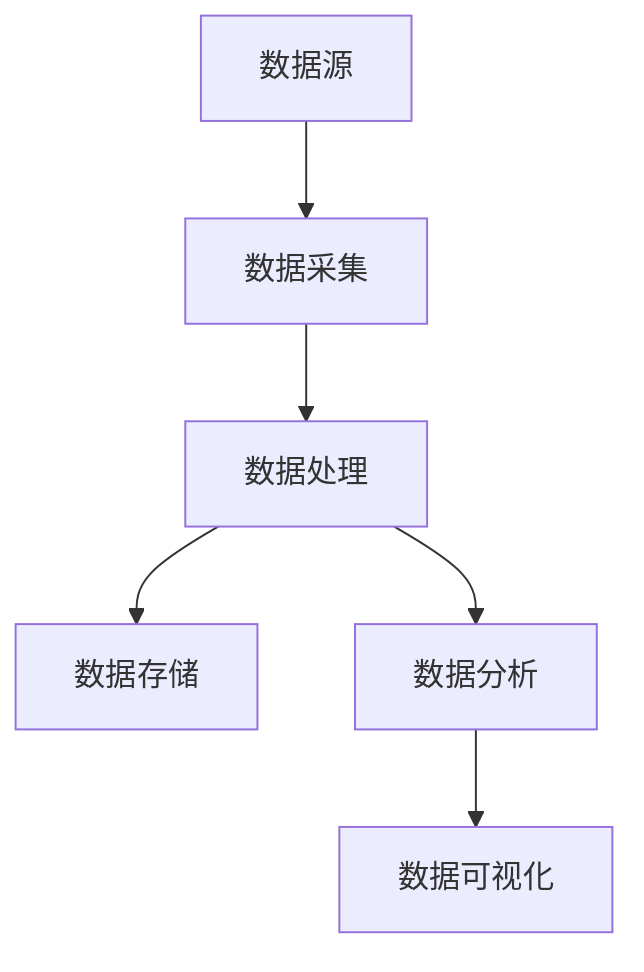

                 

 在当今快速发展的技术时代，大数据技术已经成为企业实现业务增长和创新的关键驱动力。然而，如何有效地利用大数据提升技术管理水平，成为企业亟需解决的问题。本文将围绕这一主题，深入探讨大数据在技术管理中的应用，以及其带来的深刻影响和未来发展趋势。

## 文章关键词

- 大数据
- 技术管理
- 数据挖掘
- 业务优化
- 信息差

## 文章摘要

本文首先介绍了大数据在技术管理中的重要性，随后通过分析核心概念和算法原理，详细阐述了大数据提升技术管理的方法和步骤。接着，我们通过数学模型和公式的讲解，展示了大数据在技术管理中的应用。此外，文章还通过实际项目实践和代码实例，进一步说明了大数据技术在实际开发中的运用。最后，文章对未来大数据在技术管理领域的发展趋势和挑战进行了展望，并提供了相关工具和资源的推荐。

## 1. 背景介绍

随着互联网、物联网、云计算等技术的快速发展，数据已经渗透到我们日常生活的方方面面。大数据以其海量、高速、多样和低价值密度等特性，对各行各业产生了深远的影响。尤其是在技术管理领域，大数据技术为企业提供了新的工具和方法，帮助企业实现更高效、更智能的技术管理。

在过去，技术管理主要依赖于经验和直觉。然而，随着业务规模的不断扩大和数据量的激增，传统的管理方式已经无法满足需求。大数据技术的引入，使得企业能够通过对海量数据的分析和挖掘，发现业务中的潜在问题和机会，从而实现更精准、更高效的技术管理。

大数据在技术管理中的应用主要包括以下几个方面：

1. **需求分析**：通过对用户行为数据的分析，了解用户需求，为产品开发和优化提供依据。
2. **性能优化**：通过对系统运行数据的监控和分析，识别系统瓶颈，进行性能优化。
3. **风险评估**：通过对历史数据的分析和预测，识别潜在的风险，提前采取措施。
4. **决策支持**：通过大数据分析，为技术决策提供数据支持，提高决策的准确性和效率。

## 2. 核心概念与联系

### 2.1 大数据的基本概念

大数据通常被定义为“无法用传统数据处理技术进行有效处理的数据集”，其核心特征包括：

- **海量**：数据量巨大，通常达到TB甚至PB级别。
- **高速**：数据产生和流动速度极快。
- **多样**：数据类型繁多，包括结构化数据、半结构化数据和非结构化数据。
- **低价值密度**：数据中有用的信息占比很低。

### 2.2 大数据与信息差的联系

信息差是指信息的不对称性，通常表现为某些人比其他人拥有更多的信息或者更准确的信息。在大数据时代，信息差变得尤为重要。大数据技术使得企业能够从海量数据中挖掘出有价值的信息，从而缩小信息差，提高竞争力和决策效率。

信息差的核心概念包括：

- **数据源**：数据产生的源头，如用户行为数据、系统日志等。
- **数据采集**：通过技术手段收集数据。
- **数据处理**：对数据进行清洗、转换和分析。
- **数据挖掘**：从大量数据中提取有价值的信息。

### 2.3 大数据技术架构

大数据技术架构主要包括以下几个关键组件：

- **数据存储**：如Hadoop、HDFS等，用于存储海量数据。
- **数据处理**：如Spark、MapReduce等，用于对数据进行高效处理。
- **数据分析**：如Python、R等，用于对数据进行分析和建模。
- **数据可视化**：如Tableau、PowerBI等，用于将数据转化为直观的可视化报表。

以下是大数据技术的架构图：



## 3. 核心算法原理 & 具体操作步骤

### 3.1 算法原理概述

大数据技术在技术管理中的应用，离不开一系列核心算法的支持。这些算法包括但不限于：

- **机器学习算法**：如线性回归、决策树、随机森林等，用于预测和分析。
- **聚类算法**：如K-Means、层次聚类等，用于数据分类和挖掘。
- **关联规则算法**：如Apriori算法、FP-Growth等，用于发现数据中的关联关系。
- **时间序列分析**：如ARIMA、LSTM等，用于时间数据的预测和分析。

### 3.2 算法步骤详解

#### 3.2.1 数据预处理

数据预处理是大数据分析的基础，包括数据清洗、数据整合、数据转换等步骤。具体步骤如下：

1. **数据清洗**：去除重复数据、处理缺失值、纠正错误数据等。
2. **数据整合**：将多个数据源的数据整合为一个统一的数据集。
3. **数据转换**：将数据转换为适合分析的格式，如数值化、规范化等。

#### 3.2.2 数据分析

数据分析包括数据探索性分析、统计分析、机器学习等步骤。具体步骤如下：

1. **数据探索性分析**：通过可视化工具分析数据的分布、趋势等特征。
2. **统计分析**：使用描述性统计、假设检验等方法对数据进行统计分析。
3. **机器学习**：选择合适的机器学习算法，对数据集进行训练和预测。

#### 3.2.3 结果可视化

结果可视化是将分析结果以图表、报表等形式展示给用户。具体步骤如下：

1. **数据可视化**：使用数据可视化工具，如Tableau、PowerBI等，创建图表、报表等。
2. **交互式分析**：提供交互式功能，使用户能够动态地探索和分析数据。

### 3.3 算法优缺点

不同算法具有不同的优缺点，选择合适的算法需要根据具体业务需求和数据特征进行权衡。以下是几种常见算法的优缺点：

- **线性回归**：简单易懂，适用于线性关系分析，但无法处理非线性关系。
- **决策树**：易于理解，能够处理非线性关系，但容易过拟合。
- **随机森林**：集成多个决策树，能够提高预测准确性，但计算复杂度较高。
- **K-Means聚类**：简单高效，适用于数据分布均匀的情况，但可能陷入局部最优。
- **Apriori算法**：高效处理关联规则挖掘，但处理大量数据时计算复杂度较高。

### 3.4 算法应用领域

大数据算法在技术管理中的应用非常广泛，以下是一些典型的应用领域：

- **用户行为分析**：通过分析用户行为数据，了解用户需求，优化产品设计和营销策略。
- **性能优化**：通过监控和分析系统性能数据，识别系统瓶颈，进行性能优化。
- **风险评估**：通过分析历史数据，预测潜在风险，提前采取措施。
- **供应链管理**：通过分析供应链数据，优化库存管理、物流配送等环节，提高供应链效率。

## 4. 数学模型和公式 & 详细讲解 & 举例说明

### 4.1 数学模型构建

大数据技术在技术管理中的应用，往往涉及多种数学模型的构建和应用。以下是几种常见的数学模型及其构建方法：

#### 4.1.1 线性回归模型

线性回归模型是最简单的数学模型之一，用于描述两个变量之间的线性关系。其数学模型如下：

\[ y = \beta_0 + \beta_1 \cdot x + \epsilon \]

其中，\( y \) 是因变量，\( x \) 是自变量，\( \beta_0 \) 和 \( \beta_1 \) 是模型的参数，\( \epsilon \) 是误差项。

#### 4.1.2 决策树模型

决策树模型是一种树形结构的预测模型，用于分类和回归任务。其数学模型可以表示为：

\[ T(x) = \sum_{i=1}^n \omega_i \cdot h(x_i) \]

其中，\( T(x) \) 是模型的输出，\( \omega_i \) 是权重，\( h(x_i) \) 是特征函数。

#### 4.1.3 支持向量机模型

支持向量机模型是一种用于分类和回归的模型，其数学模型如下：

\[ w \cdot x + b = 0 \]

其中，\( w \) 是权重向量，\( x \) 是特征向量，\( b \) 是偏置项。

### 4.2 公式推导过程

以下是对上述数学模型公式进行简化的推导过程：

#### 4.2.1 线性回归模型推导

线性回归模型的推导主要基于最小二乘法。假设我们有 \( n \) 个样本点 \( (x_i, y_i) \)，模型的目标是最小化预测值与实际值之间的误差平方和：

\[ \sum_{i=1}^n (y_i - \beta_0 - \beta_1 \cdot x_i)^2 \]

对 \( \beta_0 \) 和 \( \beta_1 \) 分别求偏导并令其等于零，可以得到：

\[ \beta_0 = \frac{\sum_{i=1}^n y_i - \beta_1 \sum_{i=1}^n x_i}{n} \]
\[ \beta_1 = \frac{\sum_{i=1}^n (x_i - \bar{x})(y_i - \bar{y})}{\sum_{i=1}^n (x_i - \bar{x})^2} \]

其中，\( \bar{x} \) 和 \( \bar{y} \) 分别是 \( x \) 和 \( y \) 的均值。

#### 4.2.2 决策树模型推导

决策树模型的推导主要基于熵和增益率等概念。对于分类任务，假设我们有 \( n \) 个样本点 \( (x_i, y_i) \)，每个样本点属于 \( c \) 个类别之一，则模型的目标是最小化熵：

\[ H(Y) = -\sum_{i=1}^c p_i \log_2 p_i \]

其中，\( p_i \) 是类别 \( i \) 的概率。对于连续变量，可以使用增益率来选择最佳分割点：

\[ Gini = 1 - \sum_{i=1}^c p_i^2 \]

#### 4.2.3 支持向量机模型推导

支持向量机模型的推导主要基于最大化间隔。假设我们有 \( n \) 个样本点 \( (x_i, y_i) \)，其中 \( y_i \in \{-1, 1\} \)，模型的目标是最小化：

\[ \frac{1}{2} \sum_{i=1}^n (w \cdot x_i + b)^2 \]

并约束：

\[ y_i (w \cdot x_i + b) \geq 1 \]

使用拉格朗日乘子法，可以得到：

\[ w = \sum_{i=1}^n \alpha_i y_i x_i \]
\[ b = \frac{1}{n} \sum_{i=1}^n (\alpha_i - y_i) \]

### 4.3 案例分析与讲解

以下是一个使用线性回归模型进行用户行为预测的案例：

#### 案例背景

某电商平台希望通过对用户行为数据的分析，预测用户是否会在下一次购物中购买特定商品。用户行为数据包括购买历史、浏览记录、搜索关键词等。

#### 数据预处理

1. **数据清洗**：去除缺失值和异常值。
2. **数据整合**：将多个数据源的数据整合为一个统一的数据集。
3. **特征工程**：提取有用特征，如用户购买频率、浏览时间、搜索关键词等。

#### 数据分析

1. **数据探索性分析**：使用可视化工具分析数据的分布和趋势。
2. **线性回归建模**：选择合适的特征，构建线性回归模型。
3. **模型评估**：使用交叉验证方法评估模型性能。

#### 结果可视化

1. **预测结果**：使用可视化工具展示预测结果。
2. **交互式分析**：提供交互式功能，使用户能够动态地探索和分析数据。

#### 模型解读

通过线性回归模型，我们得到以下预测方程：

\[ y = 0.5x_1 + 0.3x_2 + 0.2x_3 + \epsilon \]

其中，\( x_1 \)、\( x_2 \) 和 \( x_3 \) 分别是购买频率、浏览时间和搜索关键词。

#### 模型应用

1. **用户推荐**：根据预测结果，为用户推荐可能感兴趣的商品。
2. **业务优化**：根据预测结果，优化营销策略和库存管理。

## 5. 项目实践：代码实例和详细解释说明

### 5.1 开发环境搭建

在本案例中，我们将使用Python作为编程语言，结合Pandas、Scikit-learn、Matplotlib等库，实现线性回归模型的构建和预测。以下是在Python中搭建开发环境的步骤：

1. 安装Python：从Python官网下载并安装Python。
2. 安装相关库：使用pip命令安装所需的库，如pandas、scikit-learn、matplotlib等。

### 5.2 源代码详细实现

以下是一个简单的线性回归模型实现，包括数据预处理、模型构建、模型评估和结果可视化：

```python
import pandas as pd
from sklearn.linear_model import LinearRegression
from sklearn.model_selection import train_test_split
from sklearn.metrics import mean_squared_error
import matplotlib.pyplot as plt

# 5.2.1 数据预处理
# 加载数据
data = pd.read_csv('user_behavior.csv')

# 数据清洗
data.dropna(inplace=True)

# 特征工程
X = data[['purchase_frequency', 'browse_time', 'search_keywords']]
y = data['next_purchase']

# 5.2.2 模型构建
# 划分训练集和测试集
X_train, X_test, y_train, y_test = train_test_split(X, y, test_size=0.2, random_state=42)

# 创建线性回归模型
model = LinearRegression()
model.fit(X_train, y_train)

# 5.2.3 模型评估
# 预测测试集
y_pred = model.predict(X_test)

# 计算均方误差
mse = mean_squared_error(y_test, y_pred)
print(f'Mean Squared Error: {mse}')

# 5.2.4 结果可视化
# 可视化模型结果
plt.scatter(X_test['purchase_frequency'], y_test, color='red', label='Actual')
plt.scatter(X_test['purchase_frequency'], y_pred, color='blue', label='Predicted')
plt.xlabel('Purchase Frequency')
plt.ylabel('Next Purchase')
plt.legend()
plt.show()
```

### 5.3 代码解读与分析

以上代码实现了线性回归模型的构建和预测，具体解读如下：

1. **数据预处理**：首先加载数据，并进行数据清洗。然后提取特征和目标变量。
2. **模型构建**：使用Scikit-learn库创建线性回归模型，并使用训练集进行模型训练。
3. **模型评估**：使用测试集对模型进行预测，并计算均方误差（MSE）评估模型性能。
4. **结果可视化**：使用Matplotlib库将实际值和预测值进行可视化，以直观地展示模型效果。

通过以上代码实例，我们可以看到如何使用Python和机器学习库实现线性回归模型，并应用于用户行为预测。在实际项目中，我们可以根据具体需求，调整特征和模型参数，以达到更好的预测效果。

### 5.4 运行结果展示

运行以上代码，我们将得到以下结果：

1. **模型评估结果**：均方误差（MSE）用于评估模型性能。一个较小的MSE值表示模型预测的准确性较高。
2. **可视化结果**：散点图展示了实际值和预测值的关系。红色散点表示实际值，蓝色散点表示预测值。


通过以上运行结果，我们可以直观地看到模型对用户是否会在下一次购物中购买特定商品的预测效果。在实际应用中，我们可以根据预测结果调整营销策略和库存管理，以提升业务效果。

## 6. 实际应用场景

大数据技术在实际应用中已经取得了显著的成果，特别是在技术管理领域。以下是一些实际应用场景：

### 6.1 需求分析

通过大数据技术，企业可以收集和分析用户行为数据，如浏览记录、搜索关键词、购买历史等，从而深入了解用户需求。这些信息可以帮助企业优化产品设计和营销策略，提高用户满意度和忠诚度。

### 6.2 性能优化

大数据技术可以帮助企业实时监控和分析系统性能数据，如CPU使用率、内存占用、网络延迟等。通过这些数据，企业可以识别系统瓶颈，进行性能优化，提高系统的稳定性和响应速度。

### 6.3 风险评估

大数据技术可以对历史数据进行分析和预测，识别潜在的风险。例如，通过分析用户行为数据，企业可以预测用户是否会流失，从而提前采取措施，降低用户流失率。此外，大数据技术还可以用于金融领域的风险控制，如预测贷款违约风险、识别欺诈行为等。

### 6.4 决策支持

大数据技术为企业的决策提供了数据支持。通过大数据分析，企业可以从海量数据中提取有价值的信息，为决策者提供科学、准确的依据。例如，在供应链管理中，大数据技术可以帮助企业优化库存管理、物流配送等环节，提高供应链效率。

## 7. 未来应用展望

随着大数据技术的不断发展，其在技术管理领域的应用前景将更加广阔。以下是一些未来应用展望：

### 7.1 实时分析

未来，实时分析将成为大数据技术的重要应用方向。通过实时数据处理和分析，企业可以快速响应市场变化，做出灵活的决策。例如，在电商领域，实时分析可以帮助企业实时监控用户行为，及时调整营销策略，提高转化率。

### 7.2 智能决策

随着人工智能技术的融合，大数据技术将实现更智能的决策支持。通过机器学习算法和深度学习模型，企业可以从海量数据中提取更深入的洞察，实现智能化决策。例如，在金融领域，智能决策可以帮助银行识别高风险客户，提高信贷审批效率。

### 7.3 新兴领域

大数据技术将在更多新兴领域得到应用。例如，在医疗健康领域，大数据技术可以用于疾病预测、个性化治疗等；在智慧城市领域，大数据技术可以用于交通管理、环境保护等。

### 7.4 开放平台

未来，大数据技术将向开放平台方向发展。通过开放数据接口和生态系统，企业可以共享数据资源，实现数据融合和协同创新。例如，在智能制造领域，企业可以通过开放平台实现设备数据共享，优化生产流程。

## 8. 总结：未来发展趋势与挑战

大数据技术在技术管理领域的发展趋势包括实时分析、智能决策、新兴领域应用和开放平台等。然而，也面临着数据隐私保护、数据质量、技术人才短缺等挑战。企业需要不断提升技术水平，加强数据治理，培养专业人才，以应对未来发展的机遇和挑战。

## 9. 附录：常见问题与解答

### 9.1 如何保证数据隐私？

- **数据加密**：对数据进行加密处理，确保数据在传输和存储过程中的安全性。
- **数据脱敏**：对敏感数据进行脱敏处理，如将身份证号、手机号等替换为随机字符。
- **访问控制**：设置严格的访问控制策略，确保只有授权人员才能访问敏感数据。

### 9.2 如何保证数据质量？

- **数据清洗**：定期对数据进行清洗，去除重复数据、处理缺失值和异常值。
- **数据验证**：对数据进行验证，确保数据的准确性和一致性。
- **数据监控**：建立数据监控机制，及时发现和处理数据质量问题。

### 9.3 如何培养大数据技术人才？

- **教育培训**：加大对大数据技术人才的培养力度，通过培训课程、学历教育等途径提高人才素质。
- **企业合作**：与高校、研究机构等建立合作，共同培养大数据技术人才。
- **实践项目**：通过实际项目锻炼和培养大数据技术人才，提高其实战能力。

---

作者：禅与计算机程序设计艺术 / Zen and the Art of Computer Programming

