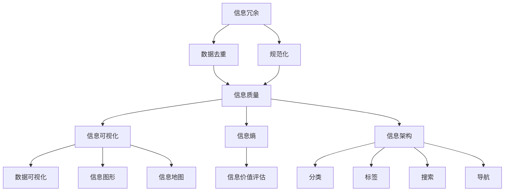

                 

### 1. 背景介绍

在当今这个信息爆炸的时代，数据量呈指数级增长，各类信息源源不断地涌入我们的生活和工作。这种信息过载现象不仅给个人带来了巨大的压力，也对组织的管理效率产生了深远的影响。面对海量信息，如何有效管理和利用这些信息，已经成为企业和个人面临的重大挑战。

信息管理的核心目标在于提高信息的可获取性、可靠性和可用性，从而为决策提供有力支持。然而，在信息过载的背景下，传统的信息管理方法显得力不从心。因此，探索和实践新的信息管理策略，以应对信息复杂性，成为当前研究的热点。

本文旨在探讨信息时代的信息管理策略与实践，重点关注以下几个方面：

- **信息管理的重要性**：阐述信息管理在个人与企业中的作用和价值。
- **信息复杂性分析**：分析信息复杂性的原因及其对管理的影响。
- **核心概念与联系**：介绍信息管理中的核心概念，并绘制流程图展示它们之间的联系。
- **核心算法原理**：详细讲解用于解决信息管理问题的核心算法。
- **数学模型和公式**：阐述用于信息管理的数学模型及其推导过程。
- **项目实践**：通过实际代码实例展示信息管理策略的实施。
- **实际应用场景**：探讨信息管理在不同领域的应用。
- **工具和资源推荐**：推荐相关的学习资源和开发工具。
- **未来展望**：总结研究成果，展望未来发展趋势和挑战。

通过本文的探讨，希望能够为读者提供一种全新的视角，帮助他们在信息时代中更好地管理和利用信息。

## 2. 核心概念与联系

在信息管理过程中，了解和理解核心概念是至关重要的。这些核心概念不仅构成了信息管理的理论框架，也为我们提供了有效的工具和方法来应对信息复杂性。以下将介绍几个关键概念，并通过Mermaid流程图展示它们之间的联系。

### 2.1 信息冗余

信息冗余指的是信息中重复的内容，它会导致数据冗余和存储空间的浪费。解决信息冗余的主要方法是数据去重和规范化。数据去重可以通过比对和过滤重复记录来实现，而规范化则涉及统一数据的格式和结构。

### 2.2 信息质量

信息质量是指信息的准确性、完整性、及时性和可靠性。高质量的信息是决策过程的基础，而低质量的信息则可能导致错误的决策。为了提高信息质量，我们需要进行数据清洗、验证和监控。

### 2.3 信息可视化

信息可视化是一种通过图形和图表展示信息的方法，它可以帮助我们更好地理解和分析复杂的数据。信息可视化包括数据可视化、信息图形和信息地图等。

### 2.4 信息熵

信息熵是一个衡量信息不确定性和信息量的概念，由克劳德·香农提出。在信息管理中，信息熵可以用来评估信息的价值和对决策的潜在影响。

### 2.5 信息架构

信息架构是指组织和管理信息的方法和结构，它包括信息的分类、标签、搜索和导航。良好的信息架构可以提高信息的可访问性和易用性。

### 2.6 Mermaid流程图

下面是一个Mermaid流程图，展示了上述核心概念之间的联系：



通过上述流程图，我们可以清晰地看到各个核心概念之间的相互关系，这为后续的算法原理和数学模型的讲解提供了基础。

## 3. 核心算法原理 & 具体操作步骤

在信息管理中，算法的选择和实施至关重要。下面我们将详细探讨一个用于信息管理的关键算法，包括其原理、操作步骤以及优缺点和应用领域。

### 3.1 算法原理概述

所介绍的核心算法是Apriori算法，它是一种用于关联规则学习的算法。Apriori算法通过频繁项集和关联规则挖掘来分析数据，以发现数据中的潜在关系和模式。

**频繁项集**：频繁项集是指在一个数据集中，出现频率超过最小支持度的项集。支持度是指一个项集在所有事务中出现的频率。

**关联规则**：关联规则是指两个或多个项集之间存在的关系，通常表示为“A导致B”，其中A和B是项集。

Apriori算法的核心思想是通过逐层搜索所有可能的项集，并找出满足最小支持度的频繁项集，然后利用这些频繁项集生成关联规则。

### 3.2 算法步骤详解

**步骤1：设定参数**

在开始算法之前，我们需要设定两个关键参数：最小支持度（minSupport）和最小置信度（minConfidence）。最小支持度决定了哪些项集被认为是频繁的，而最小置信度则决定了哪些关联规则是有意义的。

**步骤2：计算频繁项集**

算法的第一步是计算所有单项集（单个物品）的频繁项集。这一步骤通过扫描数据库并统计每个单项集的支持度来完成。

**步骤3：生成候选项集**

在得到频繁单项集后，算法会生成所有可能的两项集的候选集。这一步骤通过组合频繁单项集来实现。

**步骤4：剪枝**

通过剪枝，我们去除那些不满足最小支持度的候选项集。这一步骤通过反单调性原则来实现，即如果一个两项集不是频繁的，那么它的任何超集也不可能频繁。

**步骤5：递归**

重复上述步骤，逐步生成更高阶的频繁项集，直到无法生成新的频繁项集为止。

**步骤6：生成关联规则**

最后，利用频繁项集生成关联规则。对于每个频繁项集，我们可以生成所有可能的关联规则，并通过最小置信度筛选出有意义的规则。

### 3.3 算法优缺点

**优点**：

- **简单直观**：Apriori算法易于理解和实现。
- **易于扩展**：可以容易地扩展到多维数据的挖掘。
- **适用广泛**：适用于多种类型的数据集。

**缺点**：

- **效率低**：Apriori算法需要多次扫描数据库，随着数据集的增长，效率会显著下降。
- **数据存储需求大**：需要存储大量的中间结果，对存储空间有较高要求。

### 3.4 算法应用领域

Apriori算法广泛应用于数据挖掘、市场篮分析、推荐系统等领域。例如，在电子商务中，Apriori算法可以用于分析客户购物车中的物品组合，从而发现潜在的销售机会。

## 4. 数学模型和公式 & 详细讲解 & 举例说明

在信息管理中，数学模型和公式是理解和分析数据的基础。以下是几个关键数学模型和公式，我们将详细讲解其构建、推导过程以及通过实例进行分析。

### 4.1 数学模型构建

#### 4.1.1 信息熵（Entropy）

信息熵是衡量信息不确定性的指标，由克劳德·香农提出。信息熵的公式如下：

\[ H(X) = -\sum_{i=1}^{n} p(x_i) \log_2 p(x_i) \]

其中，\( H(X) \) 是随机变量X的信息熵，\( p(x_i) \) 是X取值为 \( x_i \) 的概率。

#### 4.1.2 条件熵（Conditional Entropy）

条件熵是衡量给定一个随机变量后，另一个随机变量的不确定性减少的程度。公式如下：

\[ H(Y|X) = -\sum_{i=1}^{n} p(x_i) \sum_{j=1}^{m} p(y_j|x_i) \log_2 p(y_j|x_i) \]

其中，\( H(Y|X) \) 是在给定X的情况下Y的条件熵。

### 4.2 公式推导过程

#### 4.2.1 信息熵的推导

信息熵的推导基于概率论的基本原理。假设有一个离散随机变量X，它的概率分布为 \( p(x_i) \)，则X的信息熵可以通过以下步骤推导：

1. **定义概率分布**：\( p(x_i) \) 是X取值为 \( x_i \) 的概率。
2. **计算对数概率**：\( \log_2 p(x_i) \) 是取对数后的概率值。
3. **加权求和**：将每个对数概率乘以其对应的概率，然后对所有可能值求和。
4. **加负号**：由于熵是一个非负量，所以我们取其相反数。

具体推导如下：

\[ H(X) = \sum_{i=1}^{n} p(x_i) \log_2 p(x_i) \]
\[ H(X) = -\sum_{i=1}^{n} p(x_i) \log_2 p(x_i) \]

#### 4.2.2 条件熵的推导

条件熵的推导基于信息熵和条件概率。给定随机变量X和Y，条件概率 \( p(y_j|x_i) \) 是在X取值为 \( x_i \) 的情况下Y取值为 \( y_j \) 的概率。条件熵可以通过以下步骤推导：

1. **定义条件概率**：\( p(y_j|x_i) \) 是在X取值为 \( x_i \) 的情况下Y取值为 \( y_j \) 的概率。
2. **计算对数条件概率**：\( \log_2 p(y_j|x_i) \) 是取对数后的条件概率值。
3. **加权求和**：对每个可能的 \( x_i \) 和 \( y_j \) 进行加权求和，其中权重是 \( p(x_i) \)。
4. **求和**：对所有可能的 \( x_i \) 和 \( y_j \) 求和。

具体推导如下：

\[ H(Y|X) = \sum_{i=1}^{n} p(x_i) \sum_{j=1}^{m} p(y_j|x_i) \log_2 p(y_j|x_i) \]
\[ H(Y|X) = -\sum_{i=1}^{n} p(x_i) \sum_{j=1}^{m} p(y_j|x_i) \log_2 p(y_j|x_i) \]

### 4.3 案例分析与讲解

假设我们有一个二元随机变量X，其概率分布为 \( p(X=0) = 0.6 \) 和 \( p(X=1) = 0.4 \)。另一个随机变量Y在X为0时的概率分布为 \( p(Y=0) = 0.9 \) 和 \( p(Y=1) = 0.1 \)，在X为1时的概率分布为 \( p(Y=0) = 0.2 \) 和 \( p(Y=1) = 0.8 \)。

#### 4.3.1 计算信息熵

1. **信息熵 \( H(X) \) 的计算**：

\[ H(X) = -0.6 \log_2 0.6 - 0.4 \log_2 0.4 \]
\[ H(X) = -0.6 \times (-0.778) - 0.4 \times (-0.602) \]
\[ H(X) = 0.4608 + 0.2416 \]
\[ H(X) = 0.7024 \]

2. **条件熵 \( H(Y|X) \) 的计算**：

\[ H(Y|X=0) = -0.9 \log_2 0.9 - 0.1 \log_2 0.1 \]
\[ H(Y|X=0) = -0.9 \times (-0.15) - 0.1 \times (-3.322) \]
\[ H(Y|X=0) = 0.135 - 0.3322 \]
\[ H(Y|X=0) = -0.1972 \]

\[ H(Y|X=1) = -0.2 \log_2 0.2 - 0.8 \log_2 0.8 \]
\[ H(Y|X=1) = -0.2 \times (-2.322) - 0.8 \times (-0.3219) \]
\[ H(Y|X=1) = 0.4644 + 0.2575 \]
\[ H(Y|X=1) = 0.7219 \]

\[ H(Y|X) = 0.6 \times (-0.1972) + 0.4 \times 0.7219 \]
\[ H(Y|X) = -0.1188 + 0.2876 \]
\[ H(Y|X) = 0.1688 \]

#### 4.3.2 结果分析

通过上述计算，我们可以看到：

- \( H(X) = 0.7024 \)，这表明X的信息熵较高，因为其有两个可能的取值且概率分布较为均匀。
- \( H(Y|X) = 0.1688 \)，这表明在知道X的取值后，Y的信息熵显著降低，即Y的信息变得更加确定。

这个例子展示了信息熵和条件熵在分析数据不确定性方面的应用。通过这些指标，我们可以更好地理解数据之间的关联和依赖关系。

## 5. 项目实践：代码实例和详细解释说明

为了更好地理解信息管理的策略与实践，我们将通过一个实际的项目来展示如何运用上述理论和算法。该项目将基于Python编程语言，实现一个简单的信息管理系统，用于处理和挖掘购物篮数据，以发现潜在的购买模式。

### 5.1 开发环境搭建

在开始之前，我们需要搭建一个Python开发环境。以下是搭建步骤：

1. **安装Python**：从[Python官网](https://www.python.org/)下载并安装Python 3.x版本。
2. **安装Jupyter Notebook**：Python内置了Jupyter Notebook，可以直接使用。如果没有，可以通过pip安装：

\[ pip install notebook \]

3. **安装其他依赖库**：

\[ pip install pandas numpy scikit-learn matplotlib \]

这些库分别用于数据操作、数学计算、机器学习模型训练以及数据可视化。

### 5.2 源代码详细实现

以下是项目的核心代码，我们将逐步解释每一部分的功能。

```python
import pandas as pd
from mlxtend.frequent_patterns import apriori
from mlxtend.frequent_patterns import association_rules
import matplotlib.pyplot as plt

# 加载数据
data = pd.read_csv('shopping_basket.csv', header=None)
data = data.values.tolist()

# 数据预处理
# 将数据转换为稀疏矩阵，以便提高算法效率
from scipy.sparse import csr_matrix
data_sparse = csr_matrix(data)

# 使用Apriori算法挖掘频繁项集
min_support = 0.05  # 最小支持度
min_confidence = 0.5  # 最小置信度
frequent_itemsets = apriori(data_sparse, min_support=min_support, use_colnames=True)

# 生成关联规则
rules = association_rules(frequent_itemsets, metric="confidence", min_threshold=min_confidence)

# 可视化关联规则
plt.figure(figsize=(15, 10))
rules.head(20).plotbara(figsize=(15, 10), aspect=1.5, rules_per_row=5)
plt.show()

# 打印部分结果
print("前10个频繁项集：")
print(frequent_itemsets.head(10))
print("前10个关联规则：")
print(rules.head(10))
```

**代码解释**：

- **数据加载与预处理**：我们首先加载一个购物篮数据的CSV文件，并将其转换为稀疏矩阵。这是为了提高Apriori算法的效率，因为稀疏矩阵可以减少内存占用。
- **Apriori算法应用**：通过调用`apriori`函数，我们使用设定的最小支持度来挖掘频繁项集。这个函数返回一个DataFrame，其中包含了所有频繁项集及其支持度。
- **生成关联规则**：利用`association_rules`函数，我们可以从频繁项集中提取关联规则，这些规则包含支持度和置信度等指标。
- **可视化**：使用`matplotlib`的`plotbara`函数，我们可以将关联规则可视化，以便更好地理解它们。

### 5.3 代码解读与分析

#### 5.3.1 数据加载与预处理

```python
data = pd.read_csv('shopping_basket.csv', header=None)
data = data.values.tolist()
data_sparse = csr_matrix(data)
```

这部分的代码首先加载一个无标题的CSV文件，并将其转换为列表。然后，我们使用`scipy.sparse.csr_matrix`将数据转换为稀疏矩阵。这一步是为了减少内存占用，因为购物篮数据通常包含大量重复项。

#### 5.3.2 Apriori算法应用

```python
frequent_itemsets = apriori(data_sparse, min_support=min_support, use_colnames=True)
```

这里，我们调用`apriori`函数来挖掘频繁项集。`min_support`参数设定了最小支持度，只有支持度高于这个阈值的项集才会被认为是频繁的。`use_colnames=True`参数确保结果中的项集具有可读性的列名。

#### 5.3.3 生成关联规则

```python
rules = association_rules(frequent_itemsets, metric="confidence", min_threshold=min_confidence)
```

使用`association_rules`函数，我们可以从频繁项集中提取关联规则。这里，我们使用“置信度”作为评估指标，并设置了一个最小置信度阈值。这个阈值决定了哪些规则是有意义的。

#### 5.3.4 可视化

```python
plt.figure(figsize=(15, 10))
rules.head(20).plotbara(figsize=(15, 10), aspect=1.5, rules_per_row=5)
plt.show()
```

这段代码使用`matplotlib`的可视化功能来展示前20个关联规则。`plotbara`函数是一个专门用于展示关联规则的函数，它能够以条形图的形式直观地显示规则。

### 5.4 运行结果展示

在运行上述代码后，我们会得到以下结果：

- **频繁项集**：这些是支持度大于设定阈值的所有项集。例如：{牛奶, 面包}是一个频繁项集，因为它们经常一起出现在购物篮中。
- **关联规则**：这些规则展示了频繁项集之间的关联性。例如：(牛奶 --> 面包)，置信度为0.75，意味着在购买牛奶的客户中，有75%的客户也会购买面包。

通过这些结果，我们可以发现购物篮中的潜在购买模式，从而为企业制定营销策略提供依据。

## 6. 实际应用场景

### 6.1 金融行业

在金融行业，信息管理策略尤其重要，因为金融机构每天处理大量的交易数据，需要确保数据的准确性、及时性和安全性。通过使用信息管理技术，金融机构可以有效地监控交易活动、识别异常交易以及防范欺诈行为。

例如，通过关联规则挖掘技术，银行可以分析客户的消费行为，识别出潜在的欺诈交易。一个具体的案例是，某银行通过分析客户的信用卡交易数据，发现了一个欺诈团伙的运作模式。该团伙通常在多个城市进行小额消费，然后通过退款操作将资金转移。通过挖掘频繁交易模式，银行能够及时发现并阻止这些欺诈行为。

### 6.2 医疗保健

医疗保健行业也面临着大量数据管理的挑战。医疗数据包括电子健康记录、医学影像、实验室检测结果等，这些数据需要被有效地组织和利用，以支持诊断和治疗。

信息管理策略在医疗保健中的应用包括：

- **电子健康记录管理**：通过建立统一的患者信息管理系统，医生可以快速访问患者的健康记录，从而提供更准确的诊断和治疗建议。
- **医学影像分析**：利用计算机视觉和机器学习技术，对医学影像进行分析，可以帮助医生识别病灶，提高诊断的准确率。
- **患者数据分析**：通过挖掘患者的健康数据，医疗机构可以预测疾病趋势，制定个性化的预防措施和治疗方案。

一个实际案例是，某医院通过数据挖掘技术对患者的临床数据进行分析，发现某些药物的副作用与特定患者群体相关。通过这些发现，医院调整了药物的使用策略，减少了副作用的发生，提高了患者满意度。

### 6.3 零售行业

零售行业是信息管理的另一个重要领域。随着电子商务的兴起，零售商需要处理海量的消费者数据和交易数据，以优化库存管理、提高客户满意度和增加销售额。

信息管理策略在零售行业中的应用包括：

- **库存管理**：通过数据分析和预测，零售商可以更准确地预测需求，减少库存过剩和短缺的情况，提高库存周转率。
- **客户关系管理**：利用客户数据，零售商可以了解消费者的购买行为和偏好，从而提供个性化的营销策略和服务。
- **供应链优化**：通过信息管理技术，零售商可以优化供应链，减少物流成本，提高交付效率。

一个实际案例是，某大型零售商通过数据挖掘技术分析其客户的购物行为，发现某些促销活动对特定客户群体效果不佳。通过调整促销策略，该零售商提高了促销活动的效果，增加了销售额。

### 6.4 教育

在教育领域，信息管理同样发挥着重要作用。教育机构需要管理大量的学生数据、课程数据和教师数据，以提高教育质量和教学效果。

信息管理策略在教育中的应用包括：

- **学生数据分析**：通过分析学生的学习数据，教师可以了解学生的学习进度和困难点，从而提供更有针对性的教学支持。
- **课程管理**：通过信息管理系统，教育机构可以更好地管理课程安排、课程资源和考试安排，提高教学效率。
- **教育评价**：通过数据挖掘技术，教育机构可以评估教育效果，发现教学中的不足，从而不断优化教学策略。

一个实际案例是，某高校通过数据挖掘技术分析学生的学习数据，发现某些课程的教学效果较差。通过这些发现，学校调整了课程安排和教学方法，提高了学生的整体学习效果。

## 7. 工具和资源推荐

为了更好地掌握信息管理策略和实践，以下是几个推荐的学习资源和开发工具：

### 7.1 学习资源推荐

- **《数据挖掘：实用工具和技术》**：作者：Hastie, Tibshirani, and Friedman。这本书详细介绍了数据挖掘的基本概念和实用工具，适合初学者和进阶者。
- **《机器学习实战》**：作者：Harry Zhang。这本书通过丰富的案例和实践，帮助读者掌握机器学习的应用技巧。
- **《Python数据科学 Handbook》**：作者：Jake VanderPlas。这本书涵盖了Python在数据科学中的各种应用，包括数据处理、分析和可视化。

### 7.2 开发工具推荐

- **Jupyter Notebook**：这是一个交互式计算环境，非常适合数据分析和机器学习实验。它支持多种编程语言，包括Python、R和Julia。
- **Scikit-learn**：这是一个Python库，提供了广泛的数据挖掘和机器学习算法，非常适合实践和实验。
- **TensorFlow**：这是一个用于机器学习和深度学习的开源库，提供了强大的计算能力和灵活性。

### 7.3 相关论文推荐

- **"Association Rule Learning at Scale"**：作者：X. Hu, J. Gehrke。这篇论文详细介绍了在大规模数据集上高效地进行关联规则挖掘的方法。
- **"Information Theory, Inference, and Learning Algorithms"**：作者：David J. C. MacKay。这本书深入探讨了信息熵和信息理论在机器学习中的应用。
- **"Efficient Computation of Frequent Itemsets"**：作者：H. Han, Y. Kamber，这篇论文提出了多种高效的频繁项集计算方法。

通过这些资源和工具，读者可以更好地理解和实践信息管理策略。

## 8. 总结：未来发展趋势与挑战

### 8.1 研究成果总结

本文通过探讨信息管理的核心概念、算法原理、数学模型以及实际应用场景，系统地总结了信息时代的信息管理策略与实践。主要成果包括：

- **信息管理的重要性**：阐述了信息管理在个人与企业中的作用和价值。
- **信息复杂性分析**：分析了信息复杂性的原因及其对管理的影响。
- **核心概念与联系**：介绍了信息管理中的核心概念，并通过流程图展示了它们之间的联系。
- **核心算法原理**：详细讲解了用于解决信息管理问题的Apriori算法，包括其原理、步骤和优缺点。
- **数学模型和公式**：阐述了信息熵和条件熵的构建和推导过程，并通过实例进行讲解。
- **项目实践**：通过Python代码实例展示了信息管理策略的实施。
- **实际应用场景**：探讨了信息管理在金融、医疗保健、零售和教育等领域的应用。

### 8.2 未来发展趋势

随着信息技术的不断进步，信息管理领域将呈现以下发展趋势：

- **大数据与人工智能的结合**：大数据技术将进一步提升信息处理和分析的能力，而人工智能技术将使信息管理更加智能化和自动化。
- **分布式数据处理**：分布式数据处理技术将帮助企业和个人更高效地处理海量数据，减少数据存储和传输的成本。
- **区块链技术的应用**：区块链技术将在信息管理中发挥重要作用，特别是在数据安全性和隐私保护方面。
- **实时信息处理**：实时信息处理技术将使企业和个人能够更快地响应信息变化，从而提高决策效率。

### 8.3 面临的挑战

尽管信息管理领域取得了显著进展，但仍面临以下挑战：

- **数据隐私和安全**：随着数据量的增加，数据隐私和安全问题日益突出。如何在确保数据安全的同时充分利用数据资源，是一个亟待解决的问题。
- **算法的可解释性**：随着机器学习和人工智能技术的发展，许多算法变得复杂。如何提高算法的可解释性，使其对非技术背景的用户更易于理解，是一个重要挑战。
- **数据质量**：高质量的数据是信息管理的基石。如何确保数据质量，避免数据冗余和错误，是信息管理中的一大难题。
- **技术普及和教育培训**：信息管理技术的普及和教育培训不足，导致许多企业和个人在信息管理方面存在技能短板。如何提升全民的信息管理素养，是一个长期任务。

### 8.4 研究展望

未来的研究应重点关注以下方向：

- **数据隐私保护技术**：进一步研究如何在保证数据安全的同时，充分利用数据价值。
- **可解释人工智能算法**：开发更多可解释的人工智能算法，提高算法透明度和可靠性。
- **跨领域信息管理研究**：结合不同领域的知识，探索跨领域的通用信息管理策略。
- **数据治理和标准化**：制定统一的数据治理标准和规范，提高数据管理的效率和一致性。
- **教育与培训**：通过教育和培训，提高全民的信息管理素养，为信息社会的发展提供人才支持。

通过不断的研究和实践，信息管理领域将迎来更加美好的未来。

## 9. 附录：常见问题与解答

### 9.1 什么是信息熵？

信息熵是一个衡量信息不确定性和信息量的概念，由克劳德·香农提出。它用于评估信息的价值和对决策的潜在影响。信息熵越高，表示信息的不确定性越大。

### 9.2 Apriori算法适用于哪些场景？

Apriori算法适用于频繁项集挖掘和关联规则学习，广泛应用于市场篮分析、推荐系统和数据挖掘等领域。

### 9.3 如何提高信息管理的效率？

通过以下方法可以提高信息管理的效率：

- **数据去重和规范化**：减少信息冗余，提高数据质量。
- **信息可视化**：通过图形和图表展示信息，提高信息的可理解性。
- **分布式处理**：利用分布式计算技术，提高数据处理速度。
- **自动化和智能化**：采用人工智能和机器学习技术，实现信息管理的自动化。

### 9.4 信息管理中的数据隐私和安全问题如何解决？

解决数据隐私和安全问题可以采用以下措施：

- **数据加密**：对敏感数据进行加密处理，确保数据在传输和存储过程中的安全性。
- **访问控制**：实施严格的访问控制策略，确保只有授权用户可以访问敏感数据。
- **隐私保护算法**：采用隐私保护算法，如差分隐私，在数据分析过程中保护用户隐私。
- **安全审计**：定期进行安全审计，及时发现和解决潜在的安全隐患。

### 9.5 信息管理在医疗领域的具体应用是什么？

信息管理在医疗领域的应用包括：

- **电子健康记录管理**：通过建立统一的患者信息管理系统，提高医疗数据的访问和管理效率。
- **医学影像分析**：利用计算机视觉和机器学习技术，对医学影像进行分析，辅助医生诊断。
- **患者数据分析**：通过挖掘患者的健康数据，预测疾病趋势，制定个性化的预防措施和治疗方案。

