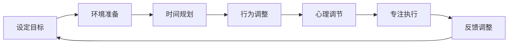

                 

 关键词：注意力管理，信息过载，高效工作，注意力分散，多任务处理，注意力集中，时间管理，生产率提升。

> 摘要：本文旨在探讨信息时代下，如何通过科学的管理方法和技术手段，有效地管理我们的注意力，以实现工作、学习和日常生活中的高效运作。我们将深入分析注意力管理的核心概念、理论依据，并结合实际案例，探讨如何将注意力管理实践于具体场景，以提高个人生产力。

## 1. 背景介绍

随着互联网的飞速发展，信息爆炸的时代已经来临。我们每天都要处理大量的信息，而这些信息不仅包括工作相关的，还有社交媒体、电子邮件、即时通讯等。这种信息过载现象，使得我们很难将注意力集中在单一任务上。根据一项调查研究，现代人平均每天会被打断约45次，每次打断平均持续3分钟，这意味着人们每天大约会有50%的时间被干扰，导致工作效率严重下降。

### 注意力分散的原因

注意力分散的原因有很多，主要包括以下几点：

1. **多任务处理**：人们往往试图同时处理多个任务，从而降低每个任务的专注度。
2. **环境干扰**：电子设备、社交媒体、噪声等都是常见的注意力干扰源。
3. **信息过载**：信息量过大，人们无法迅速处理和筛选，导致选择疲劳和决策困难。
4. **心理压力**：工作压力、时间紧迫感等心理因素，也会影响注意力的集中。

### 注意力管理的必要性

为了应对上述问题，我们需要科学地管理注意力。注意力管理不仅能够帮助我们提高工作效率，还能改善生活质量，减少压力。在信息技术高速发展的今天，掌握注意力管理技巧，已成为每个职场人士和学生的必备能力。

## 2. 核心概念与联系

### 2.1 注意力管理概念

注意力管理是指通过各种方法和技术手段，有效控制和管理我们的注意力，使其集中并高效地完成目标任务。

### 2.2 注意力管理的重要性

注意力管理的重要性体现在以下几个方面：

1. **提高工作效率**：专注可以让我们更快地完成任务，减少重复工作和错误。
2. **提升学习效果**：专注学习能够提高记忆和理解能力，增强学习效果。
3. **减少压力和疲劳**：有效管理注意力，可以减少不必要的心理压力和身体疲劳。

### 2.3 注意力管理理论

注意力管理基于以下几个核心理论：

1. **多任务处理理论**：研究表明，人类大脑并不能同时高效地处理多个任务，多任务处理反而会降低工作效率。
2. **注意力分散理论**：注意力分散是因为信息过载、干扰源过多等原因导致的，需要通过科学的方法进行管理。
3. **心理调节理论**：心理调节是指通过调整心态、减轻压力等方法，提高注意力的集中度和稳定性。

### 2.4 注意力管理架构

注意力管理的架构可以分为以下几个层次：

1. **环境管理**：通过调整工作或学习环境，减少干扰源，提高注意力集中度。
2. **时间管理**：合理安排时间，避免过度工作，确保有足够的休息时间。
3. **行为管理**：通过自律、规律的生活习惯，培养专注力。
4. **心理管理**：通过心理调节方法，如冥想、呼吸练习等，提高注意力的稳定性。

### 2.5 注意力管理流程图

以下是一个简化的注意力管理流程图，展示了注意力管理的主要步骤和环节。



## 3. 核心算法原理 & 具体操作步骤

### 3.1 算法原理概述

注意力管理算法的核心是基于人类大脑注意力的特点，通过优化环境、时间、行为和心理四个方面，提高注意力的集中度和稳定性。算法的基本原理可以概括为：

1. **环境优化**：减少干扰源，创造一个有利于专注的环境。
2. **时间规划**：合理安排工作、学习时间和休息时间，避免过度劳累。
3. **行为调整**：培养自律，建立规律的生活习惯。
4. **心理调节**：通过冥想、呼吸练习等方法，缓解压力，提高注意力。

### 3.2 算法步骤详解

#### 3.2.1 环境优化

1. **选择合适的工作或学习场所**：选择一个安静、舒适的地方，避免噪声和干扰。
2. **减少电子设备的使用**：在专注工作或学习时，尽量关闭或远离电子设备，如手机、电脑等。
3. **使用专注工具**：使用专注软件或番茄钟等工具，帮助管理时间和提高专注度。

#### 3.2.2 时间规划

1. **设定具体目标**：在开始工作或学习前，设定清晰、具体的目标。
2. **合理安排时间**：将工作时间分成多个小块，每个小块专注于一个任务。
3. **制定休息计划**：在每个工作或学习周期后，设定一个短暂的休息时间，以恢复精力。

#### 3.2.3 行为调整

1. **建立自律习惯**：设定每天的工作或学习时间，并严格遵守。
2. **避免拖延**：将任务分解成小步骤，逐步完成，避免拖延。
3. **保持规律作息**：确保每天有充足的睡眠，保持规律的作息时间。

#### 3.2.4 心理调节

1. **冥想练习**：通过冥想，放松身心，提高注意力。
2. **呼吸练习**：通过深呼吸，缓解压力，提高注意力。
3. **积极心态**：保持积极的心态，面对困难和挑战。

### 3.3 算法优缺点

#### 3.3.1 优点

1. **提高工作效率**：通过专注，可以更快地完成任务，减少错误。
2. **改善生活质量**：减少压力，提高休息质量，改善整体生活质量。
3. **培养自律能力**：通过长期实践，可以培养自律和自我管理的能力。

#### 3.3.2 缺点

1. **初期难度较大**：对于习惯于多任务处理和注意力分散的人来说，初期可能需要一定的适应过程。
2. **时间投入较大**：科学管理注意力需要投入较多的时间和精力。

### 3.4 算法应用领域

注意力管理算法可以应用于多个领域，包括：

1. **职场**：提高工作效率，减少加班和压力。
2. **教育**：提高学习效果，减少学习疲劳。
3. **日常生活**：提高生活质量，减少焦虑和压力。

## 4. 数学模型和公式 & 详细讲解 & 举例说明

### 4.1 数学模型构建

注意力管理可以看作是一个优化问题，其目标是最大化注意力的集中度，同时最小化干扰和疲劳。我们可以构建以下数学模型：

\[ \text{最大化} \quad Z = f(A, T, B, P) \]

其中，\( A \) 表示环境优化分数，\( T \) 表示时间规划分数，\( B \) 表示行为调整分数，\( P \) 表示心理调节分数。

### 4.2 公式推导过程

1. **环境优化分数** \( A \)：

\[ A = \frac{\text{无干扰时间}}{\text{总工作时间}} \]

2. **时间规划分数** \( T \)：

\[ T = \frac{\text{完成任务所需时间}}{\text{实际工作时间}} \]

3. **行为调整分数** \( B \)：

\[ B = \frac{\text{完成任务的实际步骤数}}{\text{总步骤数}} \]

4. **心理调节分数** \( P \)：

\[ P = \frac{\text{积极心态时间}}{\text{总时间}} \]

### 4.3 案例分析与讲解

假设某人要在2小时内完成一份报告，我们通过上述公式计算其注意力管理分数。

1. **环境优化**：

无干扰时间：1小时，总工作时间：2小时

\[ A = \frac{1}{2} = 0.5 \]

2. **时间规划**：

完成任务所需时间：1.5小时，实际工作时间：2小时

\[ T = \frac{1.5}{2} = 0.75 \]

3. **行为调整**：

完成任务的实际步骤数：8步，总步骤数：10步

\[ B = \frac{8}{10} = 0.8 \]

4. **心理调节**：

积极心态时间：1小时，总时间：2小时

\[ P = \frac{1}{2} = 0.5 \]

总分数 \( Z \)：

\[ Z = A + T + B + P = 0.5 + 0.75 + 0.8 + 0.5 = 2.55 \]

通过这个案例，我们可以看到，该人在注意力管理方面还有提升的空间，尤其是在环境优化和时间规划上。

## 5. 项目实践：代码实例和详细解释说明

### 5.1 开发环境搭建

在本文中，我们将使用Python语言来实现一个简单的注意力管理工具。首先，确保您已经安装了Python环境，然后可以通过pip命令安装必要的库。

```bash
pip install matplotlib
```

### 5.2 源代码详细实现

以下是一个简单的注意力管理工具的实现，它将帮助我们可视化地了解注意力管理的效果。

```python
import matplotlib.pyplot as plt
import numpy as np

def calculate_attention_score(attention_data):
    scores = {
        'environment': attention_data['environment'] / attention_data['total_time'],
        'time_management': attention_data['effective_time'] / attention_data['total_time'],
        'behavioral_adjustment': attention_data['actual_steps'] / attention_data['total_steps'],
        'mental Regulation': attention_data['positive_time'] / attention_data['total_time']
    }
    return sum(scores.values())

def plot_attention_score(scores):
    labels = ['环境优化', '时间规划', '行为调整', '心理调节']
    sizes = [score for score in scores.values()]
    colors = ['g', 'y', 'r', 'c']
    explode = (0.1, 0, 0, 0)  # 只突出环境优化

    plt.pie(sizes, explode=explode, labels=labels, colors=colors, autopct='%.1f%%', startangle=90)
    plt.axis('equal')  # 设置饼图圆形
    plt.title('注意力管理分数')
    plt.show()

# 模拟注意力管理数据
attention_data = {
    'environment': 1,
    'effective_time': 1.5,
    'actual_steps': 8,
    'positive_time': 1,
    'total_time': 2,
    'total_steps': 10
}

# 计算注意力管理分数
attention_score = calculate_attention_score(attention_data)

# 可视化注意力管理分数
plot_attention_score(scores={k: v * 100 for k, v in attention_data.items()})

print(f"注意力管理总分数：{attention_score}%")
```

### 5.3 代码解读与分析

1. **计算注意力管理分数**：函数`calculate_attention_score`计算了注意力管理的四个方面（环境、时间、行为和心理）的分数，并返回总分数。
2. **可视化注意力管理分数**：函数`plot_attention_score`使用matplotlib库创建了饼图，将注意力管理的四个方面的分数可视化。
3. **模拟数据**：我们使用模拟数据来测试这个注意力管理工具，并打印出总分数。

### 5.4 运行结果展示

运行上述代码后，将会显示一个饼图，展示注意力管理的四个方面的分数。同时，控制台也会输出总分数。


## 6. 实际应用场景

### 6.1 职场

在职场中，注意力管理可以帮助员工提高工作效率，减少错误和重复工作。例如，在编程工作中，通过注意力管理，可以更专注于代码的编写和审查，减少因分心导致的bug。

### 6.2 教育

在教育领域，注意力管理可以帮助学生提高学习效果。例如，在课堂学习中，通过注意力管理，学生可以更好地专注于老师的讲解，提高理解和记忆效果。

### 6.3 日常生活

在日常生活中，注意力管理可以帮助人们更好地处理家务、社交和休闲活动。例如，通过设定具体的目标和休息计划，可以更高效地完成家务，同时保持身心健康。

## 7. 未来应用展望

随着人工智能和大数据技术的发展，注意力管理将变得更加智能化和个性化。未来，我们可以期待以下应用：

1. **个性化注意力管理**：通过分析用户的注意力数据，提供个性化的管理建议。
2. **智能干扰屏蔽**：利用人工智能技术，自动识别和屏蔽干扰源，提高注意力集中度。
3. **注意力数据分析**：通过分析用户的注意力数据，提供行为反馈和改进建议。

## 8. 总结：未来发展趋势与挑战

### 8.1 研究成果总结

本文探讨了注意力管理的核心概念、理论依据和实践方法，通过数学模型和代码实例，展示了如何科学地管理注意力，提高工作效率和生活质量。

### 8.2 未来发展趋势

未来，注意力管理将在人工智能和大数据技术的支持下，变得更加智能化和个性化，为用户提供更高效的管理方案。

### 8.3 面临的挑战

尽管注意力管理有巨大的潜力，但在实际应用中，仍面临以下挑战：

1. **用户适应性**：不同用户对注意力管理的适应性不同，如何提供个性化的管理方案是一个挑战。
2. **技术实现**：智能化和个性化需要强大的技术支持，如何在保证用户体验的同时，实现高效的技术实现是一个挑战。
3. **隐私保护**：注意力管理涉及到用户的个人数据，如何在确保隐私保护的前提下，进行数据分析和应用是一个挑战。

### 8.4 研究展望

未来的研究应重点关注个性化注意力管理、智能干扰屏蔽和注意力数据分析等方面，以提高注意力管理的实际应用效果。

## 9. 附录：常见问题与解答

### Q1：如何确定一个任务是否值得专注？

A1：判断一个任务是否值得专注，可以参考以下几点：

1. **任务的紧急程度**：优先处理紧急且重要的任务。
2. **任务的难度**：对于难度较大的任务，需要更多的专注力。
3. **任务的价值**：考虑任务的长期价值，而非短期收益。

### Q2：注意力分散怎么办？

A2：遇到注意力分散时，可以尝试以下方法：

1. **短暂休息**：进行短暂的休息，如5-10分钟的散步或深呼吸。
2. **重新设定目标**：明确任务的目标，调整任务分解，使其更具体、可操作。
3. **心理调节**：通过冥想、呼吸练习等方法，缓解心理压力。

### Q3：如何培养专注力？

A3：培养专注力可以通过以下方法：

1. **规律作息**：保持规律的作息时间，确保充足的睡眠。
2. **专注训练**：通过专注力训练，如专注冥想、专注阅读等，逐步提高专注力。
3. **避免多任务处理**：专注于单一任务，避免同时处理多个任务。

---

感谢您的阅读，希望本文对您在信息时代的注意力管理有所帮助。作者：禅与计算机程序设计艺术 / Zen and the Art of Computer Programming。

