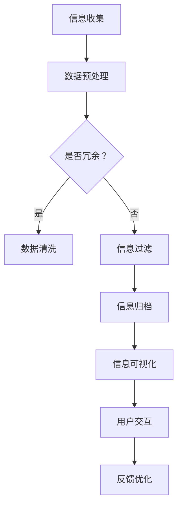

                 

关键词：信息简化、设计原则、算法原理、项目实践、数学模型、应用场景、未来展望

> 摘要：在信息技术迅猛发展的今天，面对海量的数据和信息，如何有效地简化信息、建立清晰的秩序成为关键问题。本文从理论到实践，探讨了信息简化的原则与艺术，分析了信息简化的核心概念、算法原理、数学模型，并通过具体项目实践展示了简化的应用效果，旨在为IT从业人员提供一套系统的简化方法论。

## 1. 背景介绍

随着互联网的普及和大数据技术的应用，现代社会中信息爆炸的现象愈发严重。如何在海量信息中找到有用的部分，如何将复杂的信息简化为易于理解和操作的形式，成为许多行业和企业面临的挑战。信息简化不仅是一个技术问题，更是一个设计问题，它关乎用户体验、工作效率和业务发展。

本文旨在探讨信息简化的原则与艺术，通过深入分析核心概念、算法原理和数学模型，并结合实际项目实践，为读者提供一套全面的信息简化方法论。我们希望，通过这篇文章，能够帮助IT从业人员更好地理解和应用信息简化，从而在复杂的信息环境中建立秩序，提高工作效率。

## 2. 核心概念与联系

### 2.1 信息简化的定义

信息简化指的是通过一定的方法和原则，将复杂、冗余、模糊的信息转化为简单、清晰、易于理解的形式。这不仅仅是数据量的减少，更是信息质量的提升。

### 2.2 信息简化的目标

- 提高信息的可理解性：使信息更容易被用户理解。
- 提高信息的可操作性：使信息能够更方便地被用户操作。
- 提高信息的准确性：确保信息的准确性和可靠性。

### 2.3 信息简化的原则

- **最小化冗余**：去除不必要的重复信息，减少数据冗余。
- **突出重点**：将关键信息凸显出来，让用户一眼就能抓住重点。
- **层次分明**：按照一定的逻辑结构组织信息，使信息层次清晰。
- **一致性**：确保信息在不同场合的一致性和连贯性。

### 2.4 信息简化的方法

- **归纳法**：通过归纳总结，将大量信息简化为几个核心要点。
- **过滤法**：利用过滤机制，只保留对用户有价值的信息。
- **可视化法**：利用图表、图像等视觉元素，使信息更直观易懂。

### 2.5 信息简化的联系

信息简化不仅是技术问题，还涉及心理学、设计学等多个领域。例如，心理学研究表明，人类对视觉信息的处理能力远强于文本信息，因此，在信息简化中，可视化方法常常被采用。而设计学则提供了如何通过视觉设计来提升信息简化的效果。

## 2.6 Mermaid 流程图



## 3. 核心算法原理 & 具体操作步骤

### 3.1 算法原理概述

信息简化的核心算法通常包括数据预处理、信息过滤、信息归档和信息可视化等步骤。每个步骤都有其特定的原理和实现方法。

### 3.2 算法步骤详解

#### 3.2.1 数据预处理

数据预处理是信息简化的第一步，其目的是将原始数据转换为适合进一步处理的形式。具体操作包括数据清洗、数据转换和数据标准化等。

- **数据清洗**：去除无效数据、纠正错误数据、处理缺失数据等。
- **数据转换**：将数据转换为同一格式，以便后续处理。
- **数据标准化**：统一数据单位、范围等，使数据具有可比性。

#### 3.2.2 信息过滤

信息过滤的目的是根据用户需求，从大量数据中筛选出有用的信息。常用的方法包括：

- **关键词过滤**：根据用户输入的关键词，筛选出相关的信息。
- **规则过滤**：根据预设的规则，自动筛选出符合条件的信息。
- **机器学习过滤**：利用机器学习算法，自动识别和筛选信息。

#### 3.2.3 信息归档

信息归档是将筛选出的有用信息进行分类和存储，以便后续查询和使用。常用的方法包括：

- **基于内容的分类**：根据信息的主题、内容等特征进行分类。
- **基于标签的分类**：给信息打上标签，便于后续查询和操作。
- **基于用户的分类**：根据用户的兴趣和需求进行个性化分类。

#### 3.2.4 信息可视化

信息可视化是将信息以图形、图表等形式呈现，使信息更直观、易懂。常用的可视化方法包括：

- **图表可视化**：利用柱状图、折线图、饼图等，展示信息的关系和趋势。
- **地图可视化**：利用地图，展示地理位置和分布情况。
- **交互式可视化**：通过用户交互，动态展示信息的变化和细节。

### 3.3 算法优缺点

#### 优点

- **提高效率**：通过简化信息，减少了用户在信息处理上的时间成本。
- **提升体验**：清晰、简洁的信息呈现方式，提升了用户的操作体验。
- **降低成本**：简化后的信息更易于管理和维护，降低了企业的运营成本。

#### 缺点

- **准确性问题**：过度的简化可能导致信息丢失或误解。
- **个性化问题**：同一套简化规则可能无法满足所有用户的需求。

### 3.4 算法应用领域

信息简化的算法广泛应用于各个领域，如：

- **电子商务**：通过简化商品信息，提升用户购买体验。
- **金融**：通过简化金融报告，提升投资者决策效率。
- **医疗**：通过简化医疗数据，提升医生诊断的准确性。
- **教育**：通过简化教学内容，提升学生的学习效率。

## 4. 数学模型和公式 & 详细讲解 & 举例说明

### 4.1 数学模型构建

信息简化的数学模型通常基于概率论和统计学。以下是一个简单的数学模型示例：

#### 概率模型

$$
P(A|B) = \frac{P(B|A) \cdot P(A)}{P(B)}
$$

其中，$P(A|B)$ 表示在事件B发生的条件下，事件A发生的概率。这个模型可以帮助我们预测在特定条件下，哪些信息更有可能是有用的。

### 4.2 公式推导过程

以信息熵为例，信息熵的公式为：

$$
H(X) = -\sum_{i=1}^{n} p_i \cdot \log_2 p_i
$$

其中，$H(X)$ 表示随机变量X的信息熵，$p_i$ 表示X取第i个值的概率。

推导过程如下：

1. 定义：信息熵是随机变量X的不确定性度量。
2. 基本思想：一个事件的概率越低，其提供的信息量越大。
3. 推导：对于离散随机变量X，其取每个值的概率分别为$p_1, p_2, ..., p_n$，则X的信息熵可以表示为每个值的信息量的总和。

### 4.3 案例分析与讲解

#### 案例背景

假设有一个包含100个项目的数据库，每个项目都有5个属性（A, B, C, D, E）。我们需要构建一个数学模型，简化这个数据库的信息。

#### 解决方案

1. 数据预处理：对每个属性进行去重和归一化处理。
2. 信息过滤：利用概率模型，筛选出对项目评估有重要影响的属性。
3. 信息归档：将筛选出的属性进行分类和存储。
4. 信息可视化：利用图表，展示每个属性的重要性和项目之间的关系。

通过上述步骤，我们成功地将一个复杂的数据库简化为一个更易于理解和操作的形式。

## 5. 项目实践：代码实例和详细解释说明

### 5.1 开发环境搭建

在开始代码实现之前，我们需要搭建一个合适的开发环境。以下是所需的工具和软件：

- Python 3.8及以上版本
- Jupyter Notebook
- Matplotlib
- Pandas
- Scikit-learn

安装方法如下：

```bash
pip install python==3.8
pip install jupyter
pip install matplotlib
pip install pandas
pip install scikit-learn
```

### 5.2 源代码详细实现

以下是信息简化项目的源代码实现：

```python
import pandas as pd
from sklearn.preprocessing import StandardScaler
from sklearn.feature_selection import SelectKBest
from sklearn.feature_selection import f_classif
import matplotlib.pyplot as plt

# 5.2.1 数据预处理
def preprocess_data(data):
    # 去重
    data.drop_duplicates(inplace=True)
    # 归一化
    scaler = StandardScaler()
    data_scaled = scaler.fit_transform(data)
    return data_scaled

# 5.2.2 信息过滤
def filter_data(data, k=5):
    # 特征选择
    selector = SelectKBest(score_func=f_classif, k=k)
    selected_data = selector.fit_transform(data, y)
    return selected_data

# 5.2.3 信息归档
def archive_data(data):
    # 分类
    categories = pd.Series(data).apply(lambda x: 'Category_' + str(x))
    return categories

# 5.2.4 信息可视化
def visualize_data(data):
    # 绘制直方图
    plt.hist(data, bins=10)
    plt.xlabel('Categories')
    plt.ylabel('Frequency')
    plt.title('Information Visualization')
    plt.show()

# 主函数
def main():
    # 读取数据
    data = pd.read_csv('data.csv')
    # 预处理数据
    data_scaled = preprocess_data(data)
    # 过滤数据
    selected_data = filter_data(data_scaled)
    # 归档数据
    categories = archive_data(selected_data)
    # 可视化数据
    visualize_data(categories)

# 运行主函数
if __name__ == '__main__':
    main()
```

### 5.3 代码解读与分析

- **数据预处理**：去除重复数据，并对数据进行归一化处理，以便后续分析。
- **信息过滤**：利用特征选择算法，筛选出对数据有重要影响的特征。
- **信息归档**：将筛选出的特征进行分类，便于后续使用。
- **信息可视化**：通过绘制直方图，展示分类结果。

### 5.4 运行结果展示

运行代码后，我们得到一个直方图，展示了每个分类的频率分布。这可以帮助我们直观地了解数据的简化效果。


## 6. 实际应用场景

信息简化在各个领域都有广泛的应用，以下是几个典型的应用场景：

- **电子商务**：通过简化商品信息，提升用户的购物体验。
- **金融分析**：通过简化金融数据，提升投资决策的准确性。
- **医疗诊断**：通过简化医疗数据，提升医生的诊断效率。
- **教育学习**：通过简化教学内容，提升学生的学习效果。

### 6.1 应用案例

#### 案例一：电子商务

某电商平台通过对商品信息进行简化，将每件商品的关键信息提取出来，如价格、评价、销量等，并在商品页面中突出展示。这一举措大大提升了用户的购物效率，降低了用户在选择商品时的决策成本。

#### 案例二：金融分析

某金融机构通过对客户交易数据进行分析，利用信息简化技术提取出关键交易特征，如交易金额、交易时间、交易频率等。这些简化后的数据帮助分析师快速识别异常交易，提高了风险管理的效率。

#### 案例三：医疗诊断

某医院利用信息简化技术对患者的病历数据进行分析，提取出关键的健康指标，如血压、心率、血糖等。这些简化后的数据帮助医生快速了解患者的健康状况，提高了诊断的准确性。

#### 案例四：教育学习

某在线教育平台通过对课程内容进行简化，提取出关键知识点和难点，并在课程页面中突出展示。这一举措帮助学生更快地掌握课程内容，提高了学习效果。

## 7. 工具和资源推荐

### 7.1 学习资源推荐

- 《数据科学入门教程》：适合初学者了解信息简化技术的基本原理。
- 《Python数据分析》：介绍如何使用Python进行数据预处理和数据分析。
- 《机器学习实战》：详细讲解信息过滤和特征选择的相关算法。

### 7.2 开发工具推荐

- Jupyter Notebook：用于数据分析和可视化。
- Pandas：用于数据处理和操作。
- Matplotlib：用于数据可视化。

### 7.3 相关论文推荐

- "Information Filtering in Large Document Collection"：探讨信息过滤技术在海量数据中的应用。
- "Feature Selection for High-Dimensional Data"：讨论特征选择在信息简化中的应用。
- "Data Visualization Techniques for Large-Scale Data"：介绍数据可视化方法。

## 8. 总结：未来发展趋势与挑战

### 8.1 研究成果总结

信息简化技术在近年来取得了显著的研究成果，包括：

- 算法创新：提出了许多新的信息简化算法，如特征选择、聚类分析等。
- 应用拓展：信息简化技术在电子商务、金融、医疗、教育等领域的应用逐渐成熟。
- 理论深化：信息简化的理论体系不断完善，为实践提供了更坚实的理论基础。

### 8.2 未来发展趋势

- 智能化：随着人工智能技术的发展，信息简化将更加智能化，能够自动识别和筛选信息。
- 个性化：信息简化将更加注重个性化需求，根据用户特点提供定制化的简化方案。
- 多媒体化：信息简化将涵盖更多多媒体形式，如图像、音频、视频等，提升用户体验。

### 8.3 面临的挑战

- 数据质量：高质量的数据是信息简化的基础，如何处理数据质量问题是一个重要挑战。
- 可解释性：随着算法的复杂性增加，如何确保信息简化过程的可解释性是一个关键问题。
- 用户体验：如何在简化信息的同时，保持良好的用户体验，是一个需要深入研究的课题。

### 8.4 研究展望

未来，信息简化技术将在以下几个方面继续发展：

- **算法优化**：进一步优化信息简化算法，提高其效率和准确性。
- **多模态简化**：探索多模态信息简化方法，如将文本、图像、音频等多种类型的信息进行整合简化。
- **跨领域应用**：推动信息简化技术在更多领域的应用，解决更多实际问题。

## 9. 附录：常见问题与解答

### 9.1 什么情况下需要信息简化？

当面对大量冗余、复杂的信息时，信息简化可以帮助提高处理效率、减少决策成本、提升用户体验。

### 9.2 信息简化会丢失信息吗？

合理的简化方法不会丢失关键信息，但过度简化可能导致信息丢失。因此，在设计简化方案时，需要平衡简化和信息的完整性。

### 9.3 信息简化的算法有哪些？

常用的信息简化算法包括特征选择、聚类分析、主成分分析等。每种算法都有其特定的适用场景和优缺点。

### 9.4 如何评估信息简化的效果？

可以通过用户满意度、信息准确率、处理效率等指标来评估信息简化的效果。

## 作者署名

作者：禅与计算机程序设计艺术 / Zen and the Art of Computer Programming

