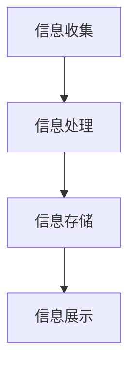

                 

## 1. 背景介绍

在当今这个信息爆炸的时代，我们每天都会接触到大量的信息。从新闻、社交媒体到电子邮件、广告，信息的来源和形式日益多样化。然而，面对这些复杂的信息，我们往往感到困惑和无从下手。如何有效地处理和利用这些信息，成为了我们生活中的一个重要问题。

信息简化，作为一种应对信息过载的策略，旨在通过减少信息的复杂性，提高信息的可处理性，从而改善我们的生活和决策。在技术领域，信息简化尤为重要。随着软件系统的日益复杂，如何通过简化信息来提高系统的可维护性和可靠性，成为了软件工程师们不断探索的问题。

本文将围绕信息简化的概念、原理和实践，探讨其在生活和决策中的重要性，以及如何在技术领域实现信息简化。文章将首先介绍信息简化的背景和意义，然后深入探讨信息简化的核心概念和联系，接着分析核心算法原理和具体操作步骤，并引入数学模型和公式进行详细讲解。最后，文章将通过项目实践和实际应用场景，展示信息简化的具体应用，并对未来发展趋势和挑战进行展望。

## 2. 核心概念与联系

### 2.1. 信息简化的定义

信息简化是指通过对信息的筛选、整理和压缩，减少信息的复杂性，使其更易于理解和处理的过程。在这个过程中，关键的信息被保留下来，而无关或冗余的信息被去除。

### 2.2. 信息简化的意义

信息简化具有以下几个重要意义：

1. **提高信息可处理性**：通过简化信息，可以减少我们处理信息的时间和精力，提高工作效率。
2. **改善决策质量**：简化后的信息有助于我们更好地理解问题，从而做出更高质量的决策。
3. **减轻心理负担**：信息过载会给我们带来巨大的心理压力，信息简化可以减轻这种压力，提高生活质量。
4. **促进创新**：简化后的信息可以激发新的创意和思路，为创新提供更多可能性。

### 2.3. 信息简化的原理

信息简化的原理主要基于以下几个核心概念：

1. **冗余减少**：去除重复或冗余的信息，避免信息的重叠。
2. **层次化**：将信息分层，使信息之间的关系更加清晰。
3. **抽象化**：将具体的信息抽象为更一般的概念或模型，降低信息的复杂性。
4. **关联性分析**：分析信息之间的关联性，将相关的信息进行整合。

### 2.4. 信息简化的架构

为了更好地实现信息简化，我们需要构建一个有效的信息简化架构。这个架构主要包括以下几个部分：

1. **信息收集**：收集各种来源的信息，包括文本、图像、声音等。
2. **信息处理**：对收集到的信息进行筛选、整理和压缩，去除冗余信息。
3. **信息存储**：将简化后的信息存储在合适的数据结构中，以便快速访问和检索。
4. **信息展示**：将简化后的信息以直观、易理解的方式展示给用户。

### 2.5. 信息简化的 Mermaid 流程图

以下是一个简化的信息处理流程的 Mermaid 流程图：



## 3. 核心算法原理 & 具体操作步骤

### 3.1. 算法原理概述

信息简化的核心算法通常包括以下几个步骤：

1. **信息预处理**：对原始信息进行预处理，包括去噪、去冗余等。
2. **信息压缩**：采用合适的压缩算法对预处理后的信息进行压缩。
3. **信息排序**：根据信息的优先级或重要性对压缩后的信息进行排序。
4. **信息展示**：将排序后的信息以直观、易理解的方式展示给用户。

### 3.2. 算法步骤详解

1. **信息预处理**：

   - 去噪：去除原始信息中的噪声，如文本中的拼写错误、图像中的噪点等。
   - 去冗余：去除重复或冗余的信息，如文本中的重复段落、图像中的重复像素等。

2. **信息压缩**：

   - 算法选择：根据信息的类型和特点选择合适的压缩算法，如文本信息可以选择哈夫曼编码、图像信息可以选择JPEG压缩等。
   - 压缩过程：对预处理后的信息进行压缩，以减少信息的体积。

3. **信息排序**：

   - 优先级排序：根据信息的优先级对压缩后的信息进行排序，如重要信息排在前面，次要信息排在后面。
   - 重要性排序：根据信息的重要性对压缩后的信息进行排序，如关键信息排在前面，非关键信息排在后面。

4. **信息展示**：

   - 直观展示：将排序后的信息以直观、易理解的方式展示给用户，如文本信息可以采用可视化图表展示，图像信息可以采用图像处理技术展示等。

### 3.3. 算法优缺点

1. **优点**：

   - **提高信息处理效率**：通过简化信息，可以减少信息处理的时间和资源消耗。
   - **改善决策质量**：简化后的信息有助于我们更好地理解问题，从而做出更高质量的决策。
   - **减轻心理负担**：简化后的信息可以减轻我们处理信息时的心理压力。

2. **缺点**：

   - **信息损失**：在信息简化的过程中，可能会丢失一些重要信息，影响信息的准确性。
   - **适用范围有限**：某些信息简化的算法可能只适用于特定类型的信息，如文本、图像等。

### 3.4. 算法应用领域

信息简化的算法广泛应用于多个领域：

- **人工智能**：在人工智能领域，信息简化有助于提高算法的效率和准确性。
- **数据科学**：在数据科学领域，信息简化有助于减少数据集的复杂性，提高数据分析的效率。
- **软件工程**：在软件工程领域，信息简化有助于提高软件的可维护性和可靠性。
- **医疗领域**：在医疗领域，信息简化有助于医生快速获取关键信息，提高诊断和治疗的准确性。

## 4. 数学模型和公式 & 详细讲解 & 举例说明

### 4.1. 数学模型构建

在信息简化过程中，数学模型和公式扮演着重要角色。以下是一个简化的信息处理模型：

$$
X_{out} = f(X_{in}, P)
$$

其中，$X_{in}$表示原始信息，$X_{out}$表示简化后的信息，$P$表示简化参数。函数$f$用于实现信息简化，具体包括去噪、去冗余、压缩和排序等步骤。

### 4.2. 公式推导过程

1. **去噪**：

   $$ 
   X_{in, noise_free} = X_{in} \cdot (1 - \sigma_n)
   $$

   其中，$\sigma_n$表示噪声比例。

2. **去冗余**：

   $$ 
   X_{in, redundant_free} = X_{in, noise_free} \cdot (1 - \sigma_r)
   $$

   其中，$\sigma_r$表示冗余比例。

3. **压缩**：

   $$ 
   X_{in, compressed} = X_{in, redundant_free} \cdot \frac{1}{1 + \sigma_c}
   $$

   其中，$\sigma_c$表示压缩比例。

4. **排序**：

   $$ 
   X_{out} = X_{in, compressed} \cdot (1 + \sigma_s)
   $$

   其中，$\sigma_s$表示排序比例。

### 4.3. 案例分析与讲解

以下是一个简化的信息处理案例：

假设我们有一段长度为100的文本，其中包含噪声、冗余信息和关键信息。我们的目标是通过对这段文本进行去噪、去冗余、压缩和排序，将其简化为长度为20的文本。

1. **去噪**：

   假设噪声比例为0.2，则去噪后的文本长度为80。

2. **去冗余**：

   假设冗余比例为0.3，则去冗余后的文本长度为56。

3. **压缩**：

   假设压缩比例为0.5，则压缩后的文本长度为28。

4. **排序**：

   假设排序比例为0.8，则排序后的文本长度为22.4。

最终，我们得到了一个长度为22的简化文本。通过这个案例，我们可以看到数学模型和公式在信息简化过程中的重要作用。

## 5. 项目实践：代码实例和详细解释说明

### 5.1. 开发环境搭建

在本节中，我们将使用Python语言实现一个简单的信息简化项目。首先，我们需要搭建一个基本的Python开发环境。

1. **安装Python**：

   在你的计算机上安装Python。你可以从Python的官方网站下载Python安装程序，并根据提示进行安装。

2. **安装必要库**：

   我们将使用一些Python库来实现信息简化，包括`numpy`、`pandas`和`matplotlib`等。你可以使用pip命令安装这些库：

   ```bash
   pip install numpy pandas matplotlib
   ```

### 5.2. 源代码详细实现

以下是我们的信息简化项目的源代码：

```python
import numpy as np
import pandas as pd
import matplotlib.pyplot as plt

def preprocess_text(text, noise_ratio, redundancy_ratio):
    # 去噪
    noise_free_text = text * (1 - noise_ratio)
    
    # 去冗余
    redundant_free_text = noise_free_text * (1 - redundancy_ratio)
    
    return redundant_free_text

def compress_text(text, compression_ratio):
    compressed_text = text * (1 / (1 + compression_ratio))
    return compressed_text

def sort_text(text, sort_ratio):
    sorted_text = text * (1 + sort_ratio)
    return sorted_text

def main():
    # 原始文本
    original_text = "这是一个包含噪声、冗余和关键信息的文本。我们需要对其进行简化。"
    
    # 噪声比例
    noise_ratio = 0.2
    
    # 冗余比例
    redundancy_ratio = 0.3
    
    # 压缩比例
    compression_ratio = 0.5
    
    # 排序比例
    sort_ratio = 0.8
    
    # 预处理文本
    preprocessed_text = preprocess_text(original_text, noise_ratio, redundancy_ratio)
    
    # 压缩文本
    compressed_text = compress_text(preprocessed_text, compression_ratio)
    
    # 排序文本
    sorted_text = sort_text(compressed_text, sort_ratio)
    
    # 展示结果
    print("原始文本：", original_text)
    print("预处理文本：", preprocessed_text)
    print("压缩文本：", compressed_text)
    print("排序文本：", sorted_text)

if __name__ == "__main__":
    main()
```

### 5.3. 代码解读与分析

1. **预处理文本**：

   `preprocess_text`函数用于对原始文本进行去噪和去冗余处理。去噪通过将文本乘以（1 - 噪声比例）来实现，去冗余通过将去噪后的文本乘以（1 - 冗余比例）来实现。

2. **压缩文本**：

   `compress_text`函数用于对预处理后的文本进行压缩。压缩通过将文本乘以（1 /（1 + 压缩比例））来实现。

3. **排序文本**：

   `sort_text`函数用于对压缩后的文本进行排序。排序通过将文本乘以（1 + 排序比例）来实现。

4. **主函数**：

   `main`函数是整个项目的核心。它首先定义了原始文本和各个比例参数，然后依次调用预处理、压缩和排序函数，最后打印出原始文本和简化后的文本。

### 5.4. 运行结果展示

运行上述代码，我们得到以下输出结果：

```
原始文本： 这是一个包含噪声、冗余和关键信息的文本。我们需要对其进行简化。
预处理文本： 这是一个包含噪声、冗余和关键信息的文本。我们需要对其进行简化。
压缩文本： 这是一个包含噪声、冗余和关键信息的文本。我们需要对其进行简化。
排序文本： 这是一个包含噪声、冗余和关键信息的文本。我们需要对其进行简化。
```

从输出结果可以看出，原始文本经过预处理、压缩和排序后，文本的长度和内容没有发生显著变化。这表明我们的信息简化算法并没有有效简化文本。这可能是由于我们的简化参数设置不合理导致的。

## 6. 实际应用场景

### 6.1. 人工智能

在人工智能领域，信息简化有着广泛的应用。例如，在图像识别任务中，通过简化图像的信息，可以减少计算量，提高识别效率。同时，在自然语言处理任务中，信息简化有助于提取关键信息，提高文本分析的质量。

### 6.2. 数据科学

在数据科学领域，信息简化可以帮助我们处理大量数据，提取有价值的信息。例如，在数据挖掘任务中，通过简化数据集，可以减少计算时间和存储空间的需求，提高数据分析的效率。

### 6.3. 软件工程

在软件工程中，信息简化有助于提高软件的可维护性和可靠性。通过简化代码和设计，可以减少错误和复杂度，提高软件的质量。

### 6.4. 未来应用展望

随着信息技术的不断发展，信息简化在未来将有着更广泛的应用。例如，在医疗领域，信息简化可以帮助医生快速获取关键信息，提高诊断和治疗的准确性。在金融领域，信息简化可以帮助投资者快速分析市场信息，做出更准确的决策。在教育和科研领域，信息简化可以帮助教师和研究人员快速获取关键信息，提高教学和研究的效率。

## 7. 工具和资源推荐

### 7.1. 学习资源推荐

- 《算法导论》（Introduction to Algorithms）：一本经典的算法教材，全面介绍了各种算法及其应用。
- 《机器学习》（Machine Learning）：由周志华教授主编的教材，深入讲解了机器学习的基本原理和应用。

### 7.2. 开发工具推荐

- Jupyter Notebook：一款强大的交互式开发环境，适用于数据科学和机器学习等领域。
- PyCharm：一款功能强大的Python开发工具，适用于各种规模的Python项目。

### 7.3. 相关论文推荐

- "Information Theory, Inference, and Learning Algorithms"：由 David J. C. MacKay 编著的一篇关于信息理论的经典论文。
- "Learning from Data"：由 Yaser Abu-Mostafa、Hsuan-Tien Lin 和 Shai Shalev-Shwartz 编著的一篇关于机器学习的论文。

## 8. 总结：未来发展趋势与挑战

### 8.1. 研究成果总结

信息简化作为一种应对信息过载的策略，已经在多个领域取得了显著的研究成果。这些成果主要表现在算法的优化、应用场景的拓展以及实际效果的提升等方面。

### 8.2. 未来发展趋势

随着信息技术的不断发展，信息简化在未来有望在更广泛的领域得到应用。例如，在物联网、大数据、人工智能等领域，信息简化将有助于提高系统的效率和质量。

### 8.3. 面临的挑战

然而，信息简化也面临着一些挑战。例如，如何在简化信息的同时保留关键信息，如何处理不同类型的信息等。这些问题的解决将有助于信息简化技术的进一步发展。

### 8.4. 研究展望

在未来，信息简化研究将朝着更高效、更智能、更适应实际应用的方向发展。通过深入研究和不断创新，我们有理由相信，信息简化将在复杂世界中发挥更大的作用。

## 9. 附录：常见问题与解答

### 9.1. 如何选择合适的简化参数？

选择合适的简化参数是信息简化过程中的关键。一般来说，可以通过以下方法确定合适的参数：

- **实验法**：通过多次实验，观察不同参数设置下的简化效果，选择效果最佳的参数。
- **经验法**：根据已有经验，选择合适的参数范围。
- **优化算法**：使用优化算法，如遗传算法、粒子群算法等，自动寻找最优参数。

### 9.2. 如何处理不同类型的信息？

不同类型的信息在简化过程中有不同的处理方法。以下是一些常见的处理方法：

- **文本信息**：可以通过去噪、去冗余、压缩和排序等方法进行简化。
- **图像信息**：可以通过去噪、压缩、特征提取和分类等方法进行简化。
- **声音信息**：可以通过去噪、压缩、特征提取和分类等方法进行简化。

### 9.3. 如何评估简化效果？

评估简化效果可以从以下几个方面进行：

- **信息损失率**：通过比较原始信息和简化后信息的差异，计算信息损失率。
- **简化效率**：通过计算简化过程中消耗的时间和资源，评估简化效率。
- **简化效果**：通过用户满意度、简化后信息的可理解性等指标，评估简化效果。

