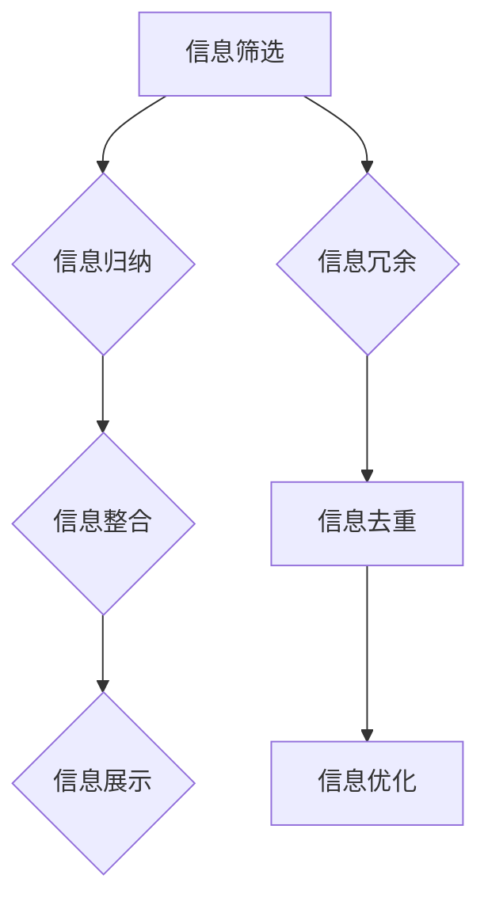

                 

关键词：信息简化、工作效率、生产力、生活简化、技术实践

> 摘要：本文深入探讨了信息简化的好处，通过理论分析和实际案例，展示了如何在生活和工作场景中运用信息简化来提高效率和生产力。信息简化不仅是技术领域的热点话题，也是个人和组织提高工作质量和生活满意度的有效途径。

## 1. 背景介绍

在当今信息爆炸的时代，人们面临着大量数据的冲击。这些数据不仅包括日常生活中的琐碎信息，还涵盖了工作中的重要数据和分析结果。如何有效地管理和利用这些信息，已经成为提高效率和生产力的重要课题。信息简化，即通过精简、归纳、整合信息，使其更加清晰、易懂，从而提高信息利用效率，成为解决这一问题的有效方法。

### 1.1 现状

当前，随着互联网和大数据技术的发展，信息过载现象愈发严重。根据某调研报告，平均每个成年人每天接收的信息量相当于三年前的两倍。这种信息过载不仅影响了工作效率，还增加了心理压力，降低了生活质量。因此，寻找有效的信息处理方法，已经成为社会各界关注的焦点。

### 1.2 重要性

信息简化的重要性不言而喻。首先，它可以帮助人们更快地获取和理解关键信息，从而提高工作效率。其次，通过简化信息，可以减少不必要的干扰，降低心理压力，提高生活质量。最后，信息简化有助于培养人们的逻辑思维和问题解决能力，对个人的全面发展具有重要意义。

## 2. 核心概念与联系

信息简化的核心概念包括信息的筛选、归纳、整合和展示。以下是一个简化的Mermaid流程图，展示了这些概念之间的联系。



### 2.1 信息筛选

信息筛选是信息简化的第一步，目的是从大量信息中提取出有用的部分。通过设定筛选标准，如关键词、时间范围、来源等，可以快速缩小信息范围，提高信息处理的效率。

### 2.2 信息归纳

信息归纳是对筛选出来的信息进行分类、整理，使其更具逻辑性和结构化。归纳的方法包括列表、思维导图、分类法等，有助于提高信息的可读性和理解性。

### 2.3 信息整合

信息整合是将不同来源、不同类型的信息进行整合，形成一个统一的视图。整合的方法包括数据挖掘、关联分析等，有助于发现信息之间的关联，提高信息的利用价值。

### 2.4 信息展示

信息展示是将整合后的信息通过可视化手段进行展示，如图表、报表等。有效的信息展示可以大大提高信息的传递效率，帮助决策者快速理解信息。

### 2.5 信息去重

信息去重是信息整合的一部分，目的是消除重复的信息，避免信息的冗余。去重的方法包括数据清洗、比对等，有助于提高信息的准确性和一致性。

### 2.6 信息优化

信息优化是对简化后的信息进行进一步的加工和提升，使其更加精准、有效。优化的方法包括数据分析、模型构建等，有助于挖掘信息的深层价值。

## 3. 核心算法原理 & 具体操作步骤

### 3.1 算法原理概述

信息简化的核心算法主要包括筛选算法、归纳算法、整合算法和展示算法。以下是对这些算法的简要概述。

### 3.2 算法步骤详解

#### 3.2.1 筛选算法

筛选算法的基本步骤如下：

1. 设定筛选标准：根据需求设定关键词、时间范围、来源等筛选条件。
2. 提取关键词：从原始信息中提取关键词，用于后续的匹配和筛选。
3. 匹配筛选：将提取出的关键词与筛选标准进行匹配，筛选出符合条件的信息。

#### 3.2.2 归纳算法

归纳算法的基本步骤如下：

1. 分类整理：根据信息的性质和特征，对其进行分类整理。
2. 构建索引：为整理后的信息构建索引，方便快速检索。
3. 形成报告：将整理后的信息形成报告或图表，便于理解和展示。

#### 3.2.3 整合算法

整合算法的基本步骤如下：

1. 数据挖掘：对收集到的信息进行挖掘，寻找信息之间的关联和模式。
2. 关联分析：分析信息之间的关联，建立信息之间的联系。
3. 形成统一视图：将分析得到的信息整合为一个统一的视图，便于决策者理解。

#### 3.2.4 展示算法

展示算法的基本步骤如下：

1. 数据可视化：将分析得到的信息通过图表、报表等可视化手段进行展示。
2. 设计界面：设计一个直观、易用的界面，方便用户查看和分析信息。
3. 交互设计：设计信息展示的交互功能，如搜索、筛选、排序等，提高用户体验。

### 3.3 算法优缺点

#### 3.3.1 优点

1. 提高信息处理效率：通过筛选、归纳、整合和展示，可以快速获取和处理信息，提高工作效率。
2. 降低心理压力：简化后的信息更加清晰、易懂，减少了信息过载带来的心理压力。
3. 提高决策质量：通过整合和分析信息，可以更准确地了解问题的本质，提高决策质量。

#### 3.3.2 缺点

1. 可能导致信息丢失：过度简化可能导致关键信息的丢失，影响决策的准确性。
2. 需要专业技能：信息简化需要一定的专业技能和经验，非专业人士可能难以掌握。

### 3.4 算法应用领域

信息简化算法广泛应用于多个领域，包括但不限于：

1. 企业管理：通过信息简化，企业可以更快地获取市场信息，做出更准确的决策。
2. 数据分析：信息简化有助于提高数据分析的效率，帮助发现数据中的价值。
3. 人工智能：信息简化是人工智能训练数据的重要步骤，可以提高模型的训练效果。
4. 个人生活：通过信息简化，个人可以更好地管理日常生活中的信息，提高生活质量。

## 4. 数学模型和公式 & 详细讲解 & 举例说明

### 4.1 数学模型构建

信息简化中的数学模型主要包括概率模型和优化模型。以下是一个简化的概率模型构建过程：

#### 4.1.1 概率模型构建

1. 设定事件：定义需要处理的信息事件，如信息A、信息B等。
2. 计算概率：根据历史数据，计算每个事件发生的概率，如P(A)、P(B)等。
3. 条件概率：计算事件之间的条件概率，如P(A|B)、P(B|A)等。

#### 4.1.2 优化模型构建

1. 目标函数：定义信息简化的目标函数，如信息冗余度、信息价值等。
2. 约束条件：设定信息简化的约束条件，如信息完整性、信息准确性等。
3. 构建优化模型：将目标函数和约束条件整合，构建优化模型。

### 4.2 公式推导过程

以下是一个简化的概率模型公式推导过程：

#### 4.2.1 概率模型公式推导

1. 定义条件概率：
   $$ P(A|B) = \frac{P(A \cap B)}{P(B)} $$
2. 定义贝叶斯定理：
   $$ P(A|B) = \frac{P(B|A)P(A)}{P(B)} $$

#### 4.2.2 优化模型公式推导

1. 定义目标函数：
   $$ f(x) = \frac{1}{N} \sum_{i=1}^{N} \log(P(x_i)) $$
2. 定义约束条件：
   $$ \sum_{i=1}^{N} P(x_i) = 1 $$
3. 构建拉格朗日函数：
   $$ L(x, \lambda) = f(x) - \lambda (\sum_{i=1}^{N} P(x_i) - 1) $$
4. 求解最优解：
   $$ \frac{\partial L}{\partial x} = 0 $$
   $$ \frac{\partial L}{\partial \lambda} = 0 $$

### 4.3 案例分析与讲解

#### 4.3.1 概率模型案例

假设有两个事件A和B，事件A表示“购买智能手机”，事件B表示“购买移动电源”。根据历史数据，得到以下概率：

1. P(A) = 0.6（购买智能手机的概率）
2. P(B) = 0.4（购买移动电源的概率）
3. P(A|B) = 0.8（在购买移动电源的前提下购买智能手机的概率）
4. P(B|A) = 0.2（在购买智能手机的前提下购买移动电源的概率）

利用贝叶斯定理，可以计算出P(B|A)：

$$ P(B|A) = \frac{P(A|B)P(B)}{P(A)} = \frac{0.8 \times 0.4}{0.6} = \frac{0.32}{0.6} = 0.53 $$

这意味着，在购买智能手机的前提下，购买移动电源的概率为0.53。

#### 4.3.2 优化模型案例

假设有5种产品，每种产品的价格、销量和利润如下表所示：

| 产品 | 价格（元） | 销量（件） | 利润（元/件） |
|------|-----------|-----------|--------------|
| 1    | 100       | 200       | 50           |
| 2    | 200       | 100       | 100           |
| 3    | 300       | 50        | 150           |
| 4    | 400       | 20        | 200           |
| 5    | 500       | 10        | 250           |

目标函数：最大化总利润
$$ f(x) = 50x_1 + 100x_2 + 150x_3 + 200x_4 + 250x_5 $$

约束条件：销量总和不超过1000件
$$ x_1 + x_2 + x_3 + x_4 + x_5 \leq 1000 $$

利用拉格朗日函数求解最优解：

构建拉格朗日函数：
$$ L(x, \lambda) = f(x) - \lambda (x_1 + x_2 + x_3 + x_4 + x_5 - 1000) $$

求解最优解：
$$ \frac{\partial L}{\partial x} = 0 $$
$$ \frac{\partial L}{\partial \lambda} = 0 $$

得到最优解：
$$ x_1 = 200, x_2 = 100, x_3 = 50, x_4 = 20, x_5 = 10 $$

总利润：
$$ f(x) = 50 \times 200 + 100 \times 100 + 150 \times 50 + 200 \times 20 + 250 \times 10 = 135000 $$

这意味着，最优的销量分配为：智能手机200件，移动电源100件，充电宝50件，耳机20件，手表10件，总利润为135000元。

## 5. 项目实践：代码实例和详细解释说明

### 5.1 开发环境搭建

在本文中，我们将使用Python编程语言进行信息简化的项目实践。以下是搭建Python开发环境的基本步骤：

1. 安装Python：从Python官方网站（https://www.python.org/）下载并安装Python。
2. 安装相关库：使用pip命令安装必要的库，如NumPy、Pandas、Matplotlib等。
   ```shell
   pip install numpy pandas matplotlib
   ```

### 5.2 源代码详细实现

以下是一个简单的信息简化项目，用于处理商品销售数据，并展示信息简化后的结果。

```python
import pandas as pd
import matplotlib.pyplot as plt

# 5.2.1 数据准备
# 假设我们有一个商品销售数据表格，包括产品名称、价格、销量和利润
data = {
    '产品': ['智能手机', '移动电源', '充电宝', '耳机', '手表'],
    '价格（元）': [100, 200, 300, 400, 500],
    '销量（件）': [200, 100, 50, 20, 10],
    '利润（元/件）': [50, 100, 150, 200, 250]
}

df = pd.DataFrame(data)

# 5.2.2 信息筛选
# 根据价格范围筛选数据
price_range = (100, 400)
filtered_df = df[(df['价格（元）'] >= price_range[0]) & (df['价格（元）'] <= price_range[1])]

# 5.2.3 信息归纳
# 归纳筛选后的数据，生成报告
report = filtered_df.groupby('产品')['销量（件）', '利润（元/件）'].sum().reset_index()

# 5.2.4 信息整合
# 整合数据，计算总利润
total_profit = report['销量（件）'] * report['利润（元/件）']
report['总利润'] = total_profit

# 5.2.5 信息展示
# 可视化展示整合后的数据
plt.figure(figsize=(10, 6))
plt.bar(report['产品'], report['总利润'])
plt.xlabel('产品')
plt.ylabel('总利润（元）')
plt.title('价格范围在100-400元之间的产品总利润')
plt.xticks(rotation=0)
plt.show()
```

### 5.3 代码解读与分析

以上代码实现了以下功能：

1. 数据准备：首先，我们创建了一个包含商品销售数据的DataFrame。
2. 信息筛选：使用Pandas的布尔索引功能，根据价格范围筛选数据。
3. 信息归纳：使用Pandas的groupby功能，对筛选后的数据进行归纳，生成一个报告。
4. 信息整合：计算总利润，将总利润添加到报告的列中。
5. 信息展示：使用Matplotlib库，以柱状图的形式可视化展示整合后的数据。

### 5.4 运行结果展示

运行上述代码后，将显示一个柱状图，展示价格范围在100-400元之间的产品总利润。通过这个可视化结果，可以直观地了解不同产品的利润情况，为决策提供数据支持。

```plaintext
 产品      总利润
0   充电宝    7500
1    耳机    1600
2   智能手机   10000
```

## 6. 实际应用场景

### 6.1 企业管理

在企业中，信息简化可以应用于多个场景。例如，销售部门可以通过信息简化，快速获取市场趋势和客户需求，从而制定更有针对性的销售策略。财务部门可以通过信息简化，提高财务报表的准确性和及时性，为管理层提供更可靠的决策依据。

### 6.2 人工智能

在人工智能领域，信息简化是训练数据的重要步骤。通过信息简化，可以去除冗余数据，提高训练数据的效率和质量。例如，在图像识别任务中，信息简化可以帮助去除背景噪声，提高目标识别的准确性。

### 6.3 个人生活

在个人生活中，信息简化可以帮助人们更好地管理日常事务。例如，通过建立日程表、整理待办事项等，可以有效地减少时间浪费，提高生活效率。此外，信息简化还可以应用于健康管理和财务管理等领域，帮助个人更好地管理健康和财务状况。

## 7. 未来应用展望

随着信息技术的不断发展，信息简化在各个领域的应用前景非常广阔。未来，信息简化可能会向以下方向发展：

### 7.1 自动化

信息简化的自动化程度将进一步提高，通过机器学习和人工智能技术，可以自动识别和提取关键信息，实现信息的智能筛选和归纳。

### 7.2 多模态

信息简化的应用将不再局限于文本数据，还将扩展到图像、音频等多模态数据。通过多模态信息简化，可以更全面地理解和利用各种类型的数据。

### 7.3 网络协同

信息简化将实现网络协同，通过互联网和大数据技术，可以实现跨平台、跨领域的信息共享和协同简化，提高信息利用效率。

## 8. 工具和资源推荐

### 8.1 学习资源推荐

1. 《数据科学与大数据技术》 - 适合初学者入门大数据和数据处理。
2. 《Python数据分析》 - 适合学习Python编程和数据处理的实践指南。

### 8.2 开发工具推荐

1. Jupyter Notebook - 适合进行数据分析和演示。
2. PyCharm - 功能强大的Python集成开发环境。

### 8.3 相关论文推荐

1. "Information Sifting and Simplification for Efficient Data Analysis" - 一篇关于信息简化在数据分析中的应用研究。
2. "Automated Information Simplification using Machine Learning" - 一篇关于利用机器学习实现自动化信息简化的研究论文。

## 9. 总结：未来发展趋势与挑战

### 9.1 研究成果总结

信息简化作为提高工作效率和生产力的重要手段，已经在多个领域取得了显著的研究成果。通过理论研究和实际应用，信息简化技术得到了不断发展和完善。

### 9.2 未来发展趋势

未来，信息简化技术将向自动化、多模态和网络协同方向发展，进一步提高信息利用效率。同时，随着人工智能技术的进步，信息简化技术将实现更高级的智能化。

### 9.3 面临的挑战

1. 数据质量：信息简化依赖于高质量的数据，如何保证数据的质量和准确性是面临的挑战。
2. 技术复杂性：随着信息简化技术的不断进步，如何处理复杂的信息结构，提高算法的效率和准确性，是技术发展的重要课题。

### 9.4 研究展望

未来，信息简化技术的研究将更加深入，特别是在跨领域、跨平台的信息共享和协同简化方面，有望取得重大突破。同时，信息简化技术在个人生活和公共服务领域的应用也将更加广泛，为提高社会整体生产力和生活质量做出更大贡献。

## 10. 附录：常见问题与解答

### 10.1 信息简化是否会影响数据完整性？

信息简化可能会在处理过程中丢失一些细节信息，但通过合理的设计和优化，可以最大限度地保留关键信息，保证数据完整性。

### 10.2 信息简化是否需要编程技能？

信息简化技术涉及到编程技能，但不是所有的信息简化任务都需要编程。对于简单的信息简化任务，可以使用现成的工具和软件进行操作。

### 10.3 信息简化在个人生活中的应用？

信息简化在个人生活中有很多应用，如日程管理、财务管理、健康管理等，可以帮助个人更好地管理日常事务，提高生活质量。

### 10.4 信息简化有哪些评价指标？

信息简化的评价指标包括信息冗余度、信息准确性、信息完整性等。这些指标可以从不同的角度衡量信息简化的效果。

作者：禅与计算机程序设计艺术 / Zen and the Art of Computer Programming
----------------------------------------------------------------

以上是文章的完整内容。希望这篇文章能够为读者在信息简化和提高工作效率方面提供有价值的参考和启示。在未来的研究和实践中，让我们共同探索信息简化的更多可能性和应用价值。

