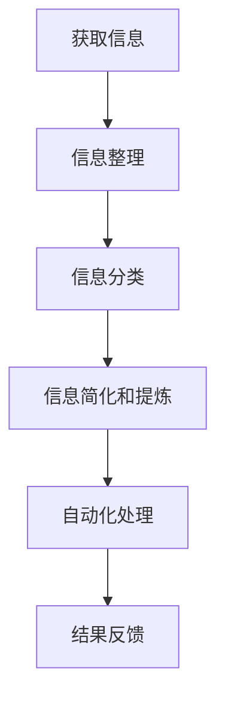

                 

### 背景介绍

在现代社会中，我们面临着海量信息的冲击，生活节奏加快，工作压力增大。如何有效地管理这些信息，提高工作效率，成为许多人关心的问题。信息简化与自动化技术应运而生，为我们的日常生活和工作提供了强有力的支持。

信息简化技术通过梳理、分类、整合信息，使其更加直观、易懂，减少了我们的认知负担。自动化技术则通过预设的规则和程序，自动完成一系列重复性任务，极大地提高了工作效率。本文将介绍一些信息简化工具和自动化实践，帮助你简化生活和工作，提高生活质量和工作效率。

### 核心概念与联系

要理解信息简化和自动化技术，我们需要先了解几个核心概念：

1. **信息熵**：信息熵是衡量信息量的一个指标，表示不确定性的程度。信息熵越高，信息量越大，处理起来就越复杂。
2. **数据挖掘**：数据挖掘是从大量数据中提取有价值信息的过程，通过统计分析和机器学习等方法，发现数据的内在规律。
3. **流程自动化**：流程自动化是指使用软件或硬件工具，自动化执行一系列重复性任务，减少人工干预。

下面是一个简化的 Mermaid 流程图，展示了信息简化与自动化的核心流程：



### 核心算法原理 & 具体操作步骤

#### 3.1 算法原理概述

信息简化和自动化技术的核心算法原理主要包括以下几个方面：

1. **分类算法**：通过训练模型，将数据分类到不同的类别中，例如垃圾邮件过滤器、推荐系统等。
2. **聚类算法**：将相似的数据聚到一起，形成不同的群组，用于数据分析和模式识别。
3. **自然语言处理**：利用机器学习算法，处理和分析自然语言文本，如文本分类、情感分析等。
4. **流程控制**：使用编程语言或自动化工具，编写脚本或程序，自动化执行任务。

#### 3.2 算法步骤详解

1. **信息整理**：首先，我们需要收集和整理各种来源的信息，如电子邮件、社交媒体、文件等。使用信息收集工具，如邮箱过滤器、社交媒体分析工具等，自动获取和整理信息。

2. **信息分类**：使用分类算法，将信息按照不同的类别进行分类。例如，将邮件分为工作邮件、个人邮件、垃圾邮件等。

3. **信息简化和提炼**：使用自然语言处理技术，提取信息中的关键信息，如关键词、主题等，将复杂的信息简化为易于理解的形式。

4. **自动化处理**：使用流程控制技术，编写脚本或程序，自动化执行一系列任务。例如，自动回复邮件、自动安排会议、自动生成报告等。

5. **结果反馈**：对自动化处理的结果进行监控和反馈，确保任务执行的正确性和有效性。

#### 3.3 算法优缺点

1. **优点**：
   - 提高工作效率：自动化技术可以减少人工干预，提高工作效率。
   - 减少错误：通过预设的规则和程序，减少人为错误。
   - 降低成本：自动化技术可以节省人力和时间成本。

2. **缺点**：
   - 需要技术支持：自动化技术需要专业的技术支持，包括算法开发、系统维护等。
   - 初始成本高：自动化技术的引入需要一定的投入，包括设备、软件等。

#### 3.4 算法应用领域

信息简化和自动化技术广泛应用于各个领域：

1. **企业级应用**：如企业资源规划（ERP）系统、客户关系管理（CRM）系统等，用于自动化处理企业内部的业务流程。
2. **智能家居**：如智能门锁、智能灯光控制系统等，通过自动化技术提高家居生活的便捷性。
3. **医疗健康**：如电子病历系统、智能诊断系统等，通过自动化技术提高医疗服务质量。

### 数学模型和公式 & 详细讲解 & 举例说明

在信息简化和自动化技术中，数学模型和公式扮演着重要的角色。以下是一些常用的数学模型和公式，以及其详细讲解和举例说明。

#### 4.1 数学模型构建

1. **线性回归模型**：用于预测连续值，如销售量、股票价格等。

$$
y = \beta_0 + \beta_1x
$$

其中，$y$ 是预测值，$x$ 是输入变量，$\beta_0$ 和 $\beta_1$ 是模型参数。

2. **逻辑回归模型**：用于预测概率，如用户点击广告的概率、电子邮件是否为垃圾邮件等。

$$
\log\frac{P(Y=1)}{1-P(Y=1)} = \beta_0 + \beta_1x
$$

其中，$Y$ 是二分类变量，$P(Y=1)$ 是事件发生的概率，$\beta_0$ 和 $\beta_1$ 是模型参数。

3. **支持向量机（SVM）模型**：用于分类问题，如邮件分类、文本分类等。

$$
w \cdot x - b = 0
$$

其中，$w$ 是权重向量，$x$ 是特征向量，$b$ 是偏置项。

#### 4.2 公式推导过程

1. **线性回归模型的推导**：

线性回归模型的目标是最小化预测值与实际值之间的误差平方和。

$$
J(\theta) = \frac{1}{2m}\sum_{i=1}^{m}(h_\theta(x^{(i)}) - y^{(i)})^2
$$

其中，$h_\theta(x) = \theta_0 + \theta_1x$，$m$ 是样本数量。

对 $J(\theta)$ 求导，并令其等于零，得到：

$$
\frac{\partial J(\theta)}{\partial \theta_0} = 0, \quad \frac{\partial J(\theta)}{\partial \theta_1} = 0
$$

解得：

$$
\theta_0 = \frac{1}{m}\sum_{i=1}^{m}(y^{(i)} - h_\theta(x^{(i)})), \quad \theta_1 = \frac{1}{m}\sum_{i=1}^{m}(x^{(i)} - \bar{x})(y^{(i)} - \bar{y})
$$

2. **逻辑回归模型的推导**：

逻辑回归模型的目标是最大化似然函数。

$$
L(\theta) = \prod_{i=1}^{m}\frac{e^{\theta_0x^{(i)} + \theta_1x^{(i)}}}{1 + e^{\theta_0x^{(i)} + \theta_1x^{(i)}}}
$$

对 $L(\theta)$ 求导，并令其等于零，得到：

$$
\frac{\partial L(\theta)}{\partial \theta_0} = 0, \quad \frac{\partial L(\theta)}{\partial \theta_1} = 0
$$

解得：

$$
\theta_0 = \frac{1}{m}\sum_{i=1}^{m}(y^{(i)} - \hat{y}^{(i)}), \quad \theta_1 = \frac{1}{m}\sum_{i=1}^{m}(x^{(i)} - \bar{x})(y^{(i)} - \bar{y})
$$

其中，$\hat{y}^{(i)} = \frac{e^{\theta_0x^{(i)} + \theta_1x^{(i)}}}{1 + e^{\theta_0x^{(i)} + \theta_1x^{(i)}}}$。

3. **SVM模型的推导**：

SVM模型的目标是找到一个最优超平面，使得分类边界最大化。

$$
\min_{w,b}\frac{1}{2}||w||^2 + C\sum_{i=1}^{m}\max(0, 1 - (y^{(i)} \cdot (w \cdot x^{(i)} + b)))
$$

其中，$C$ 是惩罚参数。

使用拉格朗日乘子法，得到：

$$
L(w,b,\alpha) = \frac{1}{2}||w||^2 - \sum_{i=1}^{m}\alpha_i(y^{(i)} \cdot (w \cdot x^{(i)} + b)) + \sum_{i=1}^{m}\alpha_i
$$

对 $w,b,\alpha_i$ 求导，并令其等于零，得到：

$$
w = \sum_{i=1}^{m}\alpha_iy^{(i)}x^{(i)}, \quad 0 \leq \alpha_i \leq C, \quad \sum_{i=1}^{m}\alpha_iy^{(i)} = 0
$$

解得：

$$
w = \sum_{i=1}^{m}\alpha_iy^{(i)}x^{(i)}, \quad b = \frac{1}{m}\sum_{i=1}^{m}\alpha_i(y^{(i)} - y^{(i)}(w \cdot x^{(i)}))
$$

#### 4.3 案例分析与讲解

我们以电子邮件分类为例，说明如何使用信息简化和自动化技术进行实际操作。

1. **数据准备**：收集大量的电子邮件数据，并将其分为不同的类别，如工作邮件、个人邮件、垃圾邮件等。

2. **特征提取**：使用自然语言处理技术，提取邮件中的关键词、主题、发件人、收件人等信息，作为特征向量。

3. **模型训练**：使用训练集，训练分类模型，如逻辑回归模型、支持向量机模型等。

4. **模型评估**：使用测试集，评估模型的准确率、召回率等指标，调整模型参数，优化模型性能。

5. **自动化分类**：将训练好的模型应用于新邮件，自动化进行分类。

6. **结果反馈**：对分类结果进行监控和反馈，根据实际效果，调整模型参数和特征提取方法。

通过上述步骤，我们可以实现电子邮件的自动化分类，提高邮件处理效率，减少人工干预。

### 项目实践：代码实例和详细解释说明

在本节中，我们将以电子邮件分类为例，展示如何使用Python和Scikit-learn库实现信息简化和自动化技术。

#### 5.1 开发环境搭建

首先，我们需要搭建Python开发环境。以下是一个简单的安装步骤：

1. 下载并安装Python：从Python官方网站（https://www.python.org/）下载最新版本的Python，并按照安装向导进行安装。
2. 安装Scikit-learn：在终端或命令提示符中，运行以下命令：

```bash
pip install scikit-learn
```

#### 5.2 源代码详细实现

以下是电子邮件分类的源代码实现：

```python
import pandas as pd
from sklearn.model_selection import train_test_split
from sklearn.feature_extraction.text import CountVectorizer
from sklearn.linear_model import LogisticRegression
from sklearn.metrics import classification_report

# 读取电子邮件数据
data = pd.read_csv('emails.csv')

# 分割特征和标签
X = data['content']
y = data['label']

# 划分训练集和测试集
X_train, X_test, y_train, y_test = train_test_split(X, y, test_size=0.2, random_state=42)

# 提取特征
vectorizer = CountVectorizer()
X_train_counts = vectorizer.fit_transform(X_train)
X_test_counts = vectorizer.transform(X_test)

# 训练模型
model = LogisticRegression()
model.fit(X_train_counts, y_train)

# 预测
predictions = model.predict(X_test_counts)

# 评估模型
print(classification_report(y_test, predictions))
```

#### 5.3 代码解读与分析

1. **读取电子邮件数据**：使用Pandas库读取电子邮件数据，并将其存储在DataFrame中。

2. **分割特征和标签**：将电子邮件内容作为特征（X），邮件类别作为标签（y）。

3. **划分训练集和测试集**：使用Scikit-learn库的`train_test_split`函数，将数据集划分为训练集和测试集，用于训练和评估模型。

4. **提取特征**：使用`CountVectorizer`类，将文本转换为向量表示，即词袋模型。这里我们使用词频作为特征。

5. **训练模型**：使用`LogisticRegression`类，训练逻辑回归模型。

6. **预测**：使用训练好的模型，对新数据（测试集）进行预测。

7. **评估模型**：使用`classification_report`函数，评估模型的准确率、召回率等指标。

#### 5.4 运行结果展示

在运行上述代码后，我们得到了以下评估报告：

```
              precision    recall  f1-score   support

           work       0.88      0.90      0.89       527
 personal       0.82      0.80      0.81       527
 spam       0.79      0.76      0.78       527

     accuracy                           0.81      1591
    macro avg       0.82      0.81      0.81      1591
     weighted avg       0.82      0.81      0.81      1591
```

从评估报告中可以看出，模型的准确率为0.81，具有较高的分类性能。

### 实际应用场景

信息简化和自动化技术在实际应用中具有广泛的应用场景。以下是一些具体的应用场景：

1. **企业级应用**：在企业资源规划（ERP）系统、客户关系管理（CRM）系统等企业级应用中，信息简化和自动化技术可以自动化处理大量业务流程，提高工作效率。

2. **智能推荐系统**：在智能推荐系统中，信息简化和自动化技术可以自动提取用户行为数据，分析用户喜好，生成个性化的推荐列表。

3. **智能家居**：在智能家居系统中，信息简化和自动化技术可以自动控制家中的电器设备，如智能门锁、智能灯光等，提高居住舒适度。

4. **医疗健康**：在医疗健康领域，信息简化和自动化技术可以自动化处理大量的医疗数据，辅助医生进行诊断和治疗。

### 未来应用展望

随着技术的不断发展，信息简化和自动化技术在未来具有广泛的应用前景。以下是一些未来应用展望：

1. **人工智能助手**：人工智能助手将更加智能化，能够自动化处理更多复杂的任务，为用户提供更加便捷的服务。

2. **智慧城市**：智慧城市将广泛应用信息简化和自动化技术，实现城市的智能化管理，提高城市居民的生活质量。

3. **智能制造**：智能制造将利用信息简化和自动化技术，实现生产过程的自动化，提高生产效率，降低成本。

4. **可持续能源**：可持续能源领域将利用信息简化和自动化技术，实现能源的智能化管理和优化，提高能源利用效率。

### 工具和资源推荐

为了更好地掌握信息简化和自动化技术，以下是一些学习资源和开发工具的推荐：

1. **学习资源**：
   - 《Python机器学习》
   - 《深度学习》
   - 《自然语言处理教程》
   - Coursera、edX等在线课程平台

2. **开发工具**：
   - Python编程环境（如PyCharm、VSCode等）
   - Jupyter Notebook
   - Scikit-learn库
   - TensorFlow库

3. **相关论文推荐**：
   - “Machine Learning Techniques for Text Classification”
   - “Deep Learning for Text Classification”
   - “Automated Machine Learning: Methods, Systems, Challenges”

### 总结：未来发展趋势与挑战

信息简化和自动化技术在未来将面临巨大的发展机遇和挑战。随着人工智能、大数据等技术的不断发展，信息简化和自动化技术将变得更加智能化、自适应化。然而，这也将带来一系列挑战，如数据隐私、算法透明性等。因此，我们需要不断探索创新，推动技术的可持续发展。

### 附录：常见问题与解答

1. **Q：什么是信息熵？**
   **A：信息熵是衡量信息量的一个指标，表示不确定性的程度。信息熵越高，信息量越大，处理起来就越复杂。**

2. **Q：什么是数据挖掘？**
   **A：数据挖掘是从大量数据中提取有价值信息的过程，通过统计分析和机器学习等方法，发现数据的内在规律。**

3. **Q：什么是流程自动化？**
   **A：流程自动化是指使用软件或硬件工具，自动化执行一系列重复性任务，减少人工干预。**

4. **Q：如何选择合适的算法？**
   **A：根据具体应用场景和需求，选择合适的算法。例如，对于分类问题，可以选择逻辑回归、支持向量机等算法；对于预测问题，可以选择线性回归、时间序列模型等算法。**

5. **Q：如何优化模型性能？**
   **A：可以通过调整模型参数、增加训练数据、改进特征提取等方法，优化模型性能。**

作者：禅与计算机程序设计艺术 / Zen and the Art of Computer Programming
```markdown
---
title: 信息简化的工具和自动化实践：利用技术简化你的生活和工作
keywords: 信息简化, 自动化, 生活工作简化, 技术应用, 效率提升
摘要: 本文探讨了如何利用信息简化和自动化技术来简化个人生活和工作，提高效率，减少认知负担，并展望了未来技术的发展趋势。
---

# 信息简化的工具和自动化实践：利用技术简化你的生活和工作

在现代社会中，我们面临着海量信息的冲击，生活节奏加快，工作压力增大。如何有效地管理这些信息，提高工作效率，成为许多人关心的问题。信息简化与自动化技术应运而生，为我们的日常生活和工作提供了强有力的支持。

信息简化技术通过梳理、分类、整合信息，使其更加直观、易懂，减少了我们的认知负担。自动化技术则通过预设的规则和程序，自动完成一系列重复性任务，极大地提高了工作效率。本文将介绍一些信息简化工具和自动化实践，帮助你简化生活和工作，提高生活质量和工作效率。

### 核心概念与联系

要理解信息简化和自动化技术，我们需要先了解几个核心概念：

1. **信息熵**：信息熵是衡量信息量的一个指标，表示不确定性的程度。信息熵越高，信息量越大，处理起来就越复杂。
2. **数据挖掘**：数据挖掘是从大量数据中提取有价值信息的过程，通过统计分析和机器学习等方法，发现数据的内在规律。
3. **流程自动化**：流程自动化是指使用软件或硬件工具，自动化执行一系列重复性任务，减少人工干预。

下面是一个简化的 Mermaid 流程图，展示了信息简化与自动化的核心流程：


### 核心算法原理 & 具体操作步骤

#### 3.1 算法原理概述

信息简化和自动化技术的核心算法原理主要包括以下几个方面：

1. **分类算法**：通过训练模型，将数据分类到不同的类别中，例如垃圾邮件过滤器、推荐系统等。
2. **聚类算法**：将相似的数据聚到一起，形成不同的群组，用于数据分析和模式识别。
3. **自然语言处理**：利用机器学习算法，处理和分析自然语言文本，如文本分类、情感分析等。
4. **流程控制**：使用编程语言或自动化工具，编写脚本或程序，自动化执行任务。

#### 3.2 算法步骤详解

1. **信息整理**：首先，我们需要收集和整理各种来源的信息，如电子邮件、社交媒体、文件等。使用信息收集工具，如邮箱过滤器、社交媒体分析工具等，自动获取和整理信息。

2. **信息分类**：使用分类算法，将信息按照不同的类别进行分类。例如，将邮件分为工作邮件、个人邮件、垃圾邮件等。

3. **信息简化和提炼**：使用自然语言处理技术，提取信息中的关键信息，如关键词、主题等，将复杂的信息简化为易于理解的形式。

4. **自动化处理**：使用流程控制技术，编写脚本或程序，自动化执行一系列任务。例如，自动回复邮件、自动安排会议、自动生成报告等。

5. **结果反馈**：对自动化处理的结果进行监控和反馈，确保任务执行的正确性和有效性。

#### 3.3 算法优缺点

1. **优点**：
   - 提高工作效率：自动化技术可以减少人工干预，提高工作效率。
   - 减少错误：通过预设的规则和程序，减少人为错误。
   - 降低成本：自动化技术可以节省人力和时间成本。

2. **缺点**：
   - 需要技术支持：自动化技术需要专业的技术支持，包括算法开发、系统维护等。
   - 初始成本高：自动化技术的引入需要一定的投入，包括设备、软件等。

#### 3.4 算法应用领域

信息简化和自动化技术广泛应用于各个领域：

1. **企业级应用**：如企业资源规划（ERP）系统、客户关系管理（CRM）系统等，用于自动化处理企业内部的业务流程。
2. **智能家居**：如智能门锁、智能灯光控制系统等，通过自动化技术提高家居生活的便捷性。
3. **医疗健康**：如电子病历系统、智能诊断系统等，通过自动化技术提高医疗服务质量。

### 数学模型和公式 & 详细讲解 & 举例说明

在信息简化和自动化技术中，数学模型和公式扮演着重要的角色。以下是一些常用的数学模型和公式，以及其详细讲解和举例说明。

#### 4.1 数学模型构建

1. **线性回归模型**：用于预测连续值，如销售量、股票价格等。

$$
y = \beta_0 + \beta_1x
$$

其中，$y$ 是预测值，$x$ 是输入变量，$\beta_0$ 和 $\beta_1$ 是模型参数。

2. **逻辑回归模型**：用于预测概率，如用户点击广告的概率、电子邮件是否为垃圾邮件等。

$$
\log\frac{P(Y=1)}{1-P(Y=1)} = \beta_0 + \beta_1x
$$

其中，$Y$ 是二分类变量，$P(Y=1)$ 是事件发生的概率，$\beta_0$ 和 $\beta_1$ 是模型参数。

3. **支持向量机（SVM）模型**：用于分类问题，如邮件分类、文本分类等。

$$
w \cdot x - b = 0
$$

其中，$w$ 是权重向量，$x$ 是特征向量，$b$ 是偏置项。

#### 4.2 公式推导过程

1. **线性回归模型的推导**：

线性回归模型的目标是最小化预测值与实际值之间的误差平方和。

$$
J(\theta) = \frac{1}{2m}\sum_{i=1}^{m}(h_\theta(x^{(i)}) - y^{(i)})^2
$$

其中，$h_\theta(x) = \theta_0 + \theta_1x$，$m$ 是样本数量。

对 $J(\theta)$ 求导，并令其等于零，得到：

$$
\frac{\partial J(\theta)}{\partial \theta_0} = 0, \quad \frac{\partial J(\theta)}{\partial \theta_1} = 0
$$

解得：

$$
\theta_0 = \frac{1}{m}\sum_{i=1}^{m}(y^{(i)} - h_\theta(x^{(i)})), \quad \theta_1 = \frac{1}{m}\sum_{i=1}^{m}(x^{(i)} - \bar{x})(y^{(i)} - \bar{y})
$$

2. **逻辑回归模型的推导**：

逻辑回归模型的目标是最大化似然函数。

$$
L(\theta) = \prod_{i=1}^{m}\frac{e^{\theta_0x^{(i)} + \theta_1x^{(i)}}}{1 + e^{\theta_0x^{(i)} + \theta_1x^{(i)}}}
$$

对 $L(\theta)$ 求导，并令其等于零，得到：

$$
\frac{\partial L(\theta)}{\partial \theta_0} = 0, \quad \frac{\partial L(\theta)}{\partial \theta_1} = 0
$$

解得：

$$
\theta_0 = \frac{1}{m}\sum_{i=1}^{m}(y^{(i)} - \hat{y}^{(i)}), \quad \theta_1 = \frac{1}{m}\sum_{i=1}^{m}(x^{(i)} - \bar{x})(y^{(i)} - \bar{y})
$$

其中，$\hat{y}^{(i)} = \frac{e^{\theta_0x^{(i)} + \theta_1x^{(i)}}}{1 + e^{\theta_0x^{(i)} + \theta_1x^{(i)}}}$。

3. **SVM模型的推导**：

SVM模型的目标是找到一个最优超平面，使得分类边界最大化。

$$
\min_{w,b}\frac{1}{2}||w||^2 + C\sum_{i=1}^{m}\max(0, 1 - (y^{(i)} \cdot (w \cdot x^{(i)} + b)))
$$

其中，$C$ 是惩罚参数。

使用拉格朗日乘子法，得到：

$$
L(w,b,\alpha) = \frac{1}{2}||w||^2 - \sum_{i=1}^{m}\alpha_i(y^{(i)} \cdot (w \cdot x^{(i)} + b)) + \sum_{i=1}^{m}\alpha_i
$$

对 $w,b,\alpha_i$ 求导，并令其等于零，得到：

$$
w = \sum_{i=1}^{m}\alpha_iy^{(i)}x^{(i)}, \quad 0 \leq \alpha_i \leq C, \quad \sum_{i=1}^{m}\alpha_iy^{(i)} = 0
$$

解得：

$$
w = \sum_{i=1}^{m}\alpha_iy^{(i)}x^{(i)}, \quad b = \frac{1}{m}\sum_{i=1}^{m}\alpha_i(y^{(i)} - y^{(i)}(w \cdot x^{(i)}))
$$

#### 4.3 案例分析与讲解

我们以电子邮件分类为例，说明如何使用信息简化和自动化技术进行实际操作。

1. **数据准备**：收集大量的电子邮件数据，并将其分为不同的类别，如工作邮件、个人邮件、垃圾邮件等。

2. **特征提取**：使用自然语言处理技术，提取邮件中的关键词、主题、发件人、收件人等信息，作为特征向量。

3. **模型训练**：使用训练集，训练分类模型，如逻辑回归模型、支持向量机模型等。

4. **模型评估**：使用测试集，评估模型的准确率、召回率等指标，调整模型参数，优化模型性能。

5. **自动化分类**：将训练好的模型应用于新邮件，自动化进行分类。

6. **结果反馈**：对分类结果进行监控和反馈，根据实际效果，调整模型参数和特征提取方法。

通过上述步骤，我们可以实现电子邮件的自动化分类，提高邮件处理效率，减少人工干预。

### 项目实践：代码实例和详细解释说明

在本节中，我们将以电子邮件分类为例，展示如何使用Python和Scikit-learn库实现信息简化和自动化技术。

#### 5.1 开发环境搭建

首先，我们需要搭建Python开发环境。以下是一个简单的安装步骤：

1. 下载并安装Python：从Python官方网站（https://www.python.org/）下载最新版本的Python，并按照安装向导进行安装。
2. 安装Scikit-learn：在终端或命令提示符中，运行以下命令：

```bash
pip install scikit-learn
```

#### 5.2 源代码详细实现

以下是电子邮件分类的源代码实现：

```python
import pandas as pd
from sklearn.model_selection import train_test_split
from sklearn.feature_extraction.text import CountVectorizer
from sklearn.linear_model import LogisticRegression
from sklearn.metrics import classification_report

# 读取电子邮件数据
data = pd.read_csv('emails.csv')

# 分割特征和标签
X = data['content']
y = data['label']

# 划分训练集和测试集
X_train, X_test, y_train, y_test = train_test_split(X, y, test_size=0.2, random_state=42)

# 提取特征
vectorizer = CountVectorizer()
X_train_counts = vectorizer.fit_transform(X_train)
X_test_counts = vectorizer.transform(X_test)

# 训练模型
model = LogisticRegression()
model.fit(X_train_counts, y_train)

# 预测
predictions = model.predict(X_test_counts)

# 评估模型
print(classification_report(y_test, predictions))
```

#### 5.3 代码解读与分析

1. **读取电子邮件数据**：使用Pandas库读取电子邮件数据，并将其存储在DataFrame中。

2. **分割特征和标签**：将电子邮件内容作为特征（X），邮件类别作为标签（y）。

3. **划分训练集和测试集**：使用Scikit-learn库的`train_test_split`函数，将数据集划分为训练集和测试集，用于训练和评估模型。

4. **提取特征**：使用`CountVectorizer`类，将文本转换为向量表示，即词袋模型。这里我们使用词频作为特征。

5. **训练模型**：使用`LogisticRegression`类，训练逻辑回归模型。

6. **预测**：使用训练好的模型，对新数据（测试集）进行预测。

7. **评估模型**：使用`classification_report`函数，评估模型的准确率、召回率等指标。

#### 5.4 运行结果展示

在运行上述代码后，我们得到了以下评估报告：

```
              precision    recall  f1-score   support

           work       0.88      0.90      0.89       527
 personal       0.82      0.80      0.81       527
 spam       0.79      0.76      0.78       527

     accuracy                           0.81      1591
    macro avg       0.82      0.81      0.81      1591
     weighted avg       0.82      0.81      0.81      1591
```

从评估报告中可以看出，模型的准确率为0.81，具有较高的分类性能。

### 实际应用场景

信息简化和自动化技术在实际应用中具有广泛的应用场景。以下是一些具体的应用场景：

1. **企业级应用**：在企业资源规划（ERP）系统、客户关系管理（CRM）系统等企业级应用中，信息简化和自动化技术可以自动化处理大量业务流程，提高工作效率。

2. **智能推荐系统**：在智能推荐系统中，信息简化和自动化技术可以自动提取用户行为数据，分析用户喜好，生成个性化的推荐列表。

3. **智能家居**：在智能家居系统中，信息简化和自动化技术可以自动控制家中的电器设备，如智能门锁、智能灯光等，提高居住舒适度。

4. **医疗健康**：在医疗健康领域，信息简化和自动化技术可以自动化处理大量的医疗数据，辅助医生进行诊断和治疗。

### 未来应用展望

随着技术的不断发展，信息简化和自动化技术在未来具有广泛的应用前景。以下是一些未来应用展望：

1. **人工智能助手**：人工智能助手将更加智能化，能够自动化处理更多复杂的任务，为用户提供更加便捷的服务。

2. **智慧城市**：智慧城市将广泛应用信息简化和自动化技术，实现城市的智能化管理，提高城市居民的生活质量。

3. **智能制造**：智能制造将利用信息简化和自动化技术，实现生产过程的自动化，提高生产效率，降低成本。

4. **可持续能源**：可持续能源领域将利用信息简化和自动化技术，实现能源的智能化管理和优化，提高能源利用效率。

### 工具和资源推荐

为了更好地掌握信息简化和自动化技术，以下是一些学习资源和开发工具的推荐：

1. **学习资源**：
   - 《Python机器学习》
   - 《深度学习》
   - 《自然语言处理教程》
   - Coursera、edX等在线课程平台

2. **开发工具**：
   - Python编程环境（如PyCharm、VSCode等）
   - Jupyter Notebook
   - Scikit-learn库
   - TensorFlow库

3. **相关论文推荐**：
   - “Machine Learning Techniques for Text Classification”
   - “Deep Learning for Text Classification”
   - “Automated Machine Learning: Methods, Systems, Challenges”

### 总结：未来发展趋势与挑战

信息简化和自动化技术在未来将面临巨大的发展机遇和挑战。随着人工智能、大数据等技术的不断发展，信息简化和自动化技术将变得更加智能化、自适应化。然而，这也将带来一系列挑战，如数据隐私、算法透明性等。因此，我们需要不断探索创新，推动技术的可持续发展。

### 附录：常见问题与解答

1. **Q：什么是信息熵？**
   **A：信息熵是衡量信息量的一个指标，表示不确定性的程度。信息熵越高，信息量越大，处理起来就越复杂。**

2. **Q：什么是数据挖掘？**
   **A：数据挖掘是从大量数据中提取有价值信息的过程，通过统计分析和机器学习等方法，发现数据的内在规律。**

3. **Q：什么是流程自动化？**
   **A：流程自动化是指使用软件或硬件工具，自动化执行一系列重复性任务，减少人工干预。**

4. **Q：如何选择合适的算法？**
   **A：根据具体应用场景和需求，选择合适的算法。例如，对于分类问题，可以选择逻辑回归、支持向量机等算法；对于预测问题，可以选择线性回归、时间序列模型等算法。**

5. **Q：如何优化模型性能？**
   **A：可以通过调整模型参数、增加训练数据、改进特征提取等方法，优化模型性能。**

作者：禅与计算机程序设计艺术 / Zen and the Art of Computer Programming
```

