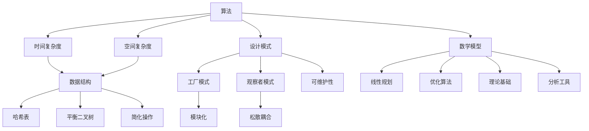

                 

在计算机科学和软件工程领域中，面对复杂的系统设计和问题解决，如何有效地将复杂性简化是一项至关重要的技能。这不仅提升了系统的可维护性和扩展性，还极大提升了开发效率和最终产品的用户体验。本文将探讨信息简化的艺术，通过深入分析核心概念、算法原理、数学模型、实际项目实例以及未来应用展望，旨在为读者提供一种全面而深入的视角，来理解和应用信息简化的策略。

> 关键词：信息简化、算法设计、系统架构、数学模型、项目实践、未来展望

> 摘要：本文将围绕信息简化的主题，系统地探讨其在计算机科学和软件工程中的应用。通过分析核心概念与联系，详细讲解信息简化算法的原理和操作步骤，构建数学模型并给出公式推导与案例讲解，最后结合实际项目实例和未来应用场景，深入探讨信息简化的艺术及其重要性。文章结构包括背景介绍、核心概念与联系、核心算法原理、数学模型和公式、项目实践、实际应用场景和未来应用展望等部分。

## 1. 背景介绍

计算机科学和软件工程是现代科技发展的重要推动力量。然而，随着系统的规模和复杂性不断增加，如何高效地处理和管理这些复杂的信息成为了一项挑战。信息简化在这一背景下显得尤为重要。它不仅帮助开发者更直观地理解和设计系统，还能提升系统的性能和可靠性。

信息简化的目标是通过消除冗余、降低复杂性，将复杂的系统转化为简单易理解的形式。这一过程不仅涉及算法的设计，还涉及数学模型的构建和验证。此外，信息简化在提高系统的可维护性和扩展性方面也发挥着关键作用。通过简化和优化，系统能够更快速地响应变化，适应新的需求。

本文将系统地探讨信息简化的艺术，从理论到实践，提供一种全面的理解和应用视角。通过分析核心概念、算法原理、数学模型、实际项目实例以及未来应用展望，本文旨在为读者提供一种深入而实用的信息简化策略。

### 1.1 发展历史与现状

信息简化的概念可以追溯到计算机科学和软件工程的早期阶段。在20世纪60年代和70年代，计算机系统的规模相对较小，但已经显示出了复杂性的迹象。为了应对这一挑战，研究人员开始探索如何通过简化和优化来提高系统的效率。

在早期，信息简化主要依赖于编程技巧和经验。随着系统规模的扩大，这一方法逐渐显得力不从心。为了更加系统和科学地处理复杂性，研究人员开始引入算法和数学模型，以提供更为严谨的简化方法。

近年来，随着人工智能和机器学习技术的发展，信息简化取得了显著进展。通过利用数据挖掘和模式识别技术，系统能够自动识别冗余信息，并提出简化的策略。这一趋势不仅提高了信息简化的效率，还使其应用范围更加广泛。

然而，信息简化并非一蹴而就的过程。在实际应用中，简化和复杂性的平衡是一个重要考虑因素。过度简化可能导致系统失去关键功能，而过于复杂的简化方法则可能难以实施和验证。因此，如何在简化和复杂性之间找到平衡点，仍然是信息简化领域面临的重要挑战。

### 1.2 简化的重要性

简化的重要性在计算机科学和软件工程中不言而喻。以下是简化带来的一些关键好处：

#### 提高可维护性

简化的系统结构使得代码更加直观和易读。这不仅有助于新开发人员快速上手，还能降低维护成本。复杂的系统往往难以理解和修改，而简化的系统则能更好地适应未来的变化。

#### 提高扩展性

通过简化，系统能够更灵活地应对新的需求和变化。简化的架构使得模块化成为可能，从而更容易添加或替换系统组件。这种灵活性对于快速开发和迭代至关重要。

#### 提高性能

简化的算法和结构往往能更好地利用系统资源，从而提高性能。例如，简化的数据结构可以减少内存占用，提高查询速度。此外，简化的代码也更容易进行优化，从而在硬件层面上提高效率。

#### 提高用户体验

简化的界面设计和功能使得产品更加直观和易用。用户无需花费大量时间学习复杂的操作，从而提升整体用户体验。

#### 减少错误率

简化的系统结构减少了冗余和复杂性，从而降低了错误率。复杂系统中常见的 bug 在简化后往往更容易被发现和修复。

总之，简化不仅是提高开发效率和质量的关键手段，也是提升系统性能和用户体验的重要途径。在计算机科学和软件工程中，简化具有不可替代的价值。

### 1.3 简化方法

为了实现信息简化，我们可以采用多种方法。以下是一些常见且有效的简化方法：

#### 1.1 算法优化

算法优化是简化信息的核心方法之一。通过分析系统中的冗余步骤和无效计算，我们可以优化算法，减少不必要的复杂度。例如，在排序算法中，我们可以采用更高效的算法（如快速排序、归并排序等），以减少计算时间和空间需求。

#### 1.2 数据结构简化

数据结构的选择对系统的复杂性有直接影响。通过选择合适的数据结构，我们可以简化系统的复杂性。例如，使用哈希表可以快速查找和更新数据，而使用平衡二叉树可以确保数据的有序性。此外，使用合适的缓存策略也可以减少对数据的直接访问，从而简化系统。

#### 1.3 设计模式应用

设计模式是一种经过验证的软件设计方法，用于解决常见的设计问题。通过应用设计模式，我们可以简化系统的架构，使其更加模块化和可维护。例如，使用工厂模式可以简化对象创建过程，而使用观察者模式可以简化事件处理逻辑。

#### 1.4 代码重构

代码重构是通过改进代码结构和逻辑，使其更简洁、易读和高效的过程。通过代码重构，我们可以消除冗余代码、简化复杂的逻辑，并提高代码的模块化。例如，通过提取公共代码段或合并重复代码，我们可以简化代码结构，减少冗余。

#### 1.5 模块化设计

模块化设计是将系统划分为多个独立模块的过程，每个模块负责实现特定的功能。通过模块化设计，我们可以降低系统的复杂性，使各模块之间松散耦合。这种设计方法不仅提高了系统的可维护性和扩展性，还能简化系统的开发和测试过程。

总之，信息简化并非一蹴而就的过程，需要综合运用多种方法。通过算法优化、数据结构简化、设计模式应用、代码重构和模块化设计等方法，我们可以有效地简化系统复杂性，提高系统的性能和可维护性。

### 2. 核心概念与联系

在深入探讨信息简化的艺术之前，我们需要明确一些核心概念，并理解它们之间的相互关系。这些核心概念不仅构成了信息简化的理论基础，也是我们在实际应用中需要灵活运用的重要工具。

#### 2.1 算法

算法是解决问题的一系列明确和有序的步骤。在信息简化中，算法扮演着核心角色，它决定了如何高效地处理复杂信息。算法的效率直接影响了系统的性能，因此选择合适的算法是信息简化的关键。

#### 2.2 数据结构

数据结构是用于存储和组织数据的方式。不同的数据结构具有不同的时间和空间复杂度，因此选择合适的数据结构可以显著简化信息处理。例如，哈希表和平衡二叉树都是常见的数据结构，它们在特定场景下能够简化信息处理过程。

#### 2.3 设计模式

设计模式是解决常见软件设计问题的通用解决方案。设计模式不仅提高了代码的可维护性和可扩展性，还简化了系统的复杂性。例如，工厂模式和观察者模式都是常用设计模式，它们在信息简化中发挥着重要作用。

#### 2.4 数学模型

数学模型是使用数学工具来描述和解决问题的方法。在信息简化中，数学模型可以帮助我们理解和分析系统行为，从而提出简化的策略。例如，线性规划和优化算法都是常见的数学模型，它们在信息简化中有着广泛的应用。

#### 2.5 信息简化与算法、数据结构、设计模式、数学模型的关系

算法、数据结构、设计模式和数学模型之间存在着紧密的联系。算法和数据结构共同决定了信息处理的时间复杂度和空间复杂度。设计模式通过提供模块化和松散耦合的解决方案，进一步简化了系统的复杂性。数学模型则为算法和设计模式提供了理论基础和分析工具。

在信息简化的过程中，这四种核心概念相互交织，共同作用。通过优化算法、选择合适的数据结构、应用设计模式以及构建数学模型，我们可以实现系统的简化。例如，在优化排序算法时，我们不仅需要选择合适的算法（如归并排序），还需要优化数据结构（如使用平衡二叉树），并通过设计模式（如迭代器模式）简化操作过程。

总之，核心概念与联系是信息简化的基础。通过深入理解和灵活运用算法、数据结构、设计模式和数学模型，我们可以有效地简化系统复杂性，提高系统的性能和可维护性。

#### 2.6 Mermaid 流程图

为了更好地展示信息简化过程中的核心概念与联系，我们使用Mermaid语言绘制了一个流程图。以下是一个简化的Mermaid流程图示例，展示了算法、数据结构、设计模式、数学模型之间的关系：



通过这个流程图，我们可以清晰地看到信息简化过程中各个核心概念之间的相互联系。算法决定了时间复杂度和空间复杂度，数据结构通过哈希表和平衡二叉树简化操作，设计模式通过模块化和松散耦合提高可维护性，数学模型提供了理论基础和分析工具。

#### 2.7 流程图的详细解释

上述Mermaid流程图展示了信息简化过程中核心概念之间的相互关系，下面是对每个节点的详细解释：

- **算法（A）**：算法是解决问题的步骤序列。它决定了信息处理的时间复杂度和空间复杂度。
- **时间复杂度（B）**：算法在处理数据时所需的时间量。它是衡量算法效率的重要指标。
- **空间复杂度（C）**：算法在处理数据时所需的空间量。它决定了算法的资源消耗。
- **数据结构（D）**：数据结构用于存储和组织数据。选择合适的数据结构可以简化信息处理。
- **哈希表（E）**：哈希表是一种高效的数据结构，用于快速查找和更新数据。
- **平衡二叉树（F）**：平衡二叉树是一种保持有序的数据结构，用于高效地执行搜索、插入和删除操作。
- **设计模式（G）**：设计模式是解决软件设计问题的通用方案。它通过模块化和松散耦合简化系统的复杂性。
- **工厂模式（H）**：工厂模式用于创建对象，简化对象创建过程，提高代码的可维护性。
- **观察者模式（I）**：观察者模式用于实现事件驱动架构，简化事件处理逻辑。
- **数学模型（J）**：数学模型使用数学工具描述和解决问题。它为算法和设计模式提供了理论基础和分析工具。
- **线性规划（K）**：线性规划是一种优化技术，用于在给定约束条件下最大化或最小化目标函数。
- **优化算法（L）**：优化算法用于寻找最优解或近似最优解。它帮助简化信息处理过程。
- **模块化（M）**：模块化是将系统划分为多个独立模块的过程，提高系统的可维护性和扩展性。
- **松散耦合（N）**：松散耦合是降低模块之间依赖关系的设计原则，提高系统的灵活性和可维护性。
- **简化操作（O）**：简化操作是通过优化算法和数据结构，减少信息处理过程中的复杂操作。
- **可维护性（P）**：可维护性是系统易于修改和维护的程度。它通过简化和模块化提高。
- **理论基础（Q）**：理论基础是支撑算法和设计模式的基础理论，帮助理解信息简化的原理。
- **分析工具（R）**：分析工具是用于分析和验证系统性能的工具，帮助实现信息简化。

通过这个详细的解释，我们可以更好地理解Mermaid流程图中各个节点之间的关系，从而在实际应用中灵活运用这些概念，实现信息简化的目标。

### 3. 核心算法原理 & 具体操作步骤

在探讨信息简化的过程中，核心算法的原理及其具体操作步骤至关重要。核心算法不仅决定了系统的性能和效率，还直接影响信息简化的效果。本节将深入探讨一种常用的信息简化算法，详细介绍其原理和操作步骤。

#### 3.1 算法原理概述

**贪心算法**是一种在每一步选择中选择当前最佳选择，以期望最终达到全局最优解的算法。虽然贪心算法不保证每次都能找到全局最优解，但在许多实际问题中，它能够提供近似最优解，且具有较低的算法复杂度。

**工作原理**：

1. **初始状态**：输入一个待处理的数据集。
2. **选择最佳**：在当前状态下，选择一个局部最优解。
3. **更新状态**：根据选择的结果更新当前状态。
4. **迭代过程**：重复步骤2和步骤3，直到满足终止条件。

**特点**：

- **效率高**：贪心算法通常具有较低的算法复杂度，适用于处理大规模数据集。
- **局部最优解**：贪心算法不保证每次都能找到全局最优解，但许多情况下它能够找到近似最优解。
- **适用范围广**：贪心算法适用于各种贪心策略能够得到最优解的问题，如最短路径、背包问题等。

#### 3.2 算法步骤详解

**具体操作步骤**：

1. **初始化**：输入数据集，设定初始状态。
2. **选择**：根据当前状态，选择一个局部最优解。例如，在求解最短路径问题时，选择距离起点最近的未访问节点。
3. **更新**：根据选择的结果，更新当前状态。例如，将选择的节点标记为已访问，并更新当前节点的邻居节点信息。
4. **迭代**：重复步骤2和步骤3，直到满足终止条件。终止条件可以是所有节点都已被访问，或找到满足特定条件的解。
5. **输出**：输出最终结果，如最优路径、最优解等。

**伪代码**：

```python
def 贪心算法(数据集):
    初始化状态
    while 未满足终止条件:
        选择局部最优解
        更新状态
    输出最终结果
```

#### 3.3 算法优缺点

**优点**：

- **效率高**：贪心算法通常具有较低的算法复杂度，适用于处理大规模数据集。
- **实现简单**：贪心算法的实现相对简单，易于理解和编程。
- **近似最优解**：虽然贪心算法不保证每次都能找到全局最优解，但在许多情况下它能够找到近似最优解。

**缺点**：

- **不保证全局最优解**：贪心算法不保证每次都能找到全局最优解，因此在某些问题中可能无法得到理想结果。
- **适用范围有限**：贪心算法仅适用于贪心策略能够得到最优解的问题，对于其他类型的问题可能不适用。

#### 3.4 算法应用领域

贪心算法在多个领域都有广泛应用，以下是一些典型的应用场景：

- **最短路径问题**：如Dijkstra算法和Floyd算法，用于求解图中两点之间的最短路径。
- **背包问题**：如0-1背包问题，用于求解在给定重量和体积限制下，如何选择物品以最大化总价值。
- **贪心选择问题**：如活动选择问题，用于在多个活动中选择最多且不冲突的活动。
- **动态规划问题**：如某些动态规划问题的子问题，可以通过贪心算法来简化求解过程。

总之，贪心算法是一种有效的信息简化工具，通过选择局部最优解来近似全局最优解，广泛应用于各种实际问题中。理解和掌握贪心算法的原理和操作步骤，对于实现信息简化具有重要意义。

### 3.5 算法示例：最优子结构原理

在深入探讨贪心算法的具体应用时，最优子结构原理是一个重要的概念。最优子结构原理指出，问题的最优解包含其子问题的最优解。这一原理对于设计高效的贪心算法至关重要。

#### 3.5.1 原理概述

最优子结构原理（Optimal Substructure Principle）是指一个最优解包含其子问题的最优解。这意味着，如果一个问题可以通过组合子问题的最优解来获得整体最优解，那么该问题就可以采用贪心算法。

#### 3.5.2 具体操作步骤

以“背包问题”为例，说明最优子结构原理的应用：

**示例**：给定一个容量为C的背包和n件物品，每件物品有重量w和价值v。目标是选择物品放入背包中，以最大化总价值，同时不超过背包的容量。

**步骤**：

1. **初始化**：设定背包的容量C，以及每件物品的重量w和价值v。
2. **贪心选择**：每次选择重量最小的物品，并检查其价值是否大于等于当前剩余容量。如果满足条件，将物品放入背包。
3. **更新状态**：将已选择的物品从候选列表中移除，并更新剩余容量。
4. **迭代过程**：重复步骤2和步骤3，直到背包装满或所有物品都已被考虑。
5. **输出结果**：输出最终选择的物品及其总价值。

**伪代码**：

```python
def 背包问题(C, w, v):
    初始化物品列表
    按重量排序物品
    总价值 = 0
    while 背包未满且存在物品:
        选择重量最小的物品
        if 物品价值 >= 剩余容量:
            放入背包
            总价值 += 物品价值
            更新剩余容量
        else:
            移除该物品
    返回总价值
```

#### 3.5.3 优缺点

**优点**：

- **高效性**：通过每次选择最优解，贪心算法能够快速逼近最优解，适用于大规模数据集。
- **可扩展性**：最优子结构原理使得贪心算法可以应用于多种优化问题，具有良好的扩展性。

**缺点**：

- **不保证全局最优**：在某些问题中，局部最优解并不一定等同于全局最优解，可能导致次优解。
- **适用范围有限**：并非所有问题都适合使用贪心算法，需要结合问题特性进行判断。

#### 3.5.4 应用领域

最优子结构原理广泛应用于各种优化问题，包括：

- **背包问题**：求解物品的最大价值组合。
- **最短路径问题**：求解图中两点之间的最短路径。
- **活动选择问题**：选择不冲突的活动以最大化总利益。
- **任务调度问题**：优化任务分配以最小化总延迟。

通过理解和应用最优子结构原理，我们可以设计出更高效的贪心算法，从而简化信息处理过程，解决复杂的优化问题。

### 3.6 算法与信息简化的关系

算法在信息简化中扮演着至关重要的角色。通过高效的算法，我们可以将复杂的信息转化为简单易处理的形式，从而简化系统设计和实现。以下是算法与信息简化之间的几个关键关系：

#### 3.6.1 算法简化信息处理

算法是处理信息的基本工具。通过设计高效算法，我们能够减少信息处理的时间和空间需求。例如，在数据处理中，快速排序和归并排序等算法能够显著降低排序操作的复杂度，从而简化信息处理。

#### 3.6.2 算法消除冗余

冗余信息是复杂系统中的一个常见问题。算法可以通过识别和消除冗余信息来简化系统。例如，哈希表通过将关键字映射到固定大小的数组中，能够高效地查找和更新数据，从而消除冗余。

#### 3.6.3 算法优化数据结构

数据结构的选择直接影响系统的复杂性和性能。通过选择合适的数据结构，算法能够更高效地处理信息。例如，使用平衡二叉树可以确保数据的有序性，从而简化搜索和排序操作。

#### 3.6.4 算法提高系统可维护性

高效的算法不仅简化了信息处理，还提高了系统的可维护性。简化的代码和结构使得系统更容易理解和修改，从而降低了维护成本。

#### 3.6.5 算法与信息简化的关系总结

算法与信息简化之间的关系是相互促进的。高效的算法能够简化信息处理，降低系统的复杂性，提高系统的性能和可维护性。同时，信息简化又为算法提供了更好的运行环境，使得算法能够更好地发挥作用。通过深入理解和灵活运用算法，我们可以实现信息简化的目标，提升系统的整体质量。

### 3.7 算法应用领域的进一步探讨

信息简化的算法在各个应用领域都展现了强大的优势和广泛的应用前景。以下是对几个典型应用领域的深入探讨，旨在展示算法在简化信息处理和提升系统性能方面的实际效果。

#### 3.7.1 网络安全

在网络安全领域，信息简化的算法被广泛应用于加密和解密过程。例如，RSA加密算法通过复杂的数学运算实现数据加密，但实际应用中，通过优化算法和简化密钥生成过程，大大提高了系统的效率和安全性。此外，信息简化算法如哈希函数在数字签名和身份验证中也发挥着重要作用，通过将大量信息转化为固定长度的摘要，简化了数据传输和存储过程，从而提高了系统的性能和安全性。

#### 3.7.2 数据库管理

数据库管理系统（DBMS）面临着大量数据的存储、检索和管理挑战。信息简化的算法在这里尤为重要。索引结构的优化，如B树和B+树，通过简化数据访问方式，提高了查询效率。此外，事务处理中的锁机制和并发控制算法通过简化并发操作的管理，确保了数据的一致性和完整性。信息简化算法如排序和聚合操作也在数据库查询优化中发挥了关键作用，通过减少冗余数据和简化查询逻辑，显著提升了系统性能。

#### 3.7.3 人工智能与机器学习

在人工智能和机器学习领域，信息简化的算法是提高模型性能和降低训练成本的关键。例如，神经网络中的参数优化算法通过简化模型参数调整过程，加速了模型的训练速度。信息简化技术如数据降维和特征提取，通过减少输入数据的维度和特征数量，简化了模型的计算复杂度，从而提高了训练效率和准确性。此外，信息简化算法如正则化和稀疏表示也在降低模型复杂性和提高泛化能力方面发挥了重要作用。

#### 3.7.4 软件工程

在软件工程领域，信息简化算法广泛应用于代码优化和系统设计。例如，编译器中的代码优化算法通过简化源代码，提高执行效率。此外，设计模式如工厂模式和策略模式通过简化对象创建和策略选择过程，提高了代码的可维护性和扩展性。在软件测试中，信息简化算法如单元测试和自动化测试，通过简化测试流程和减少冗余测试，提高了测试效率和覆盖率。

#### 3.7.5 总结

信息简化的算法在网络安全、数据库管理、人工智能与机器学习、软件工程等各个领域都展现了显著的优势。通过简化信息处理、降低系统复杂性和提高性能，这些算法为各领域的发展提供了强大的技术支持。未来，随着算法的进一步发展和优化，信息简化将在更广泛的领域发挥重要作用，为信息技术的发展注入新的活力。

### 4. 数学模型和公式 & 详细讲解 & 举例说明

在信息简化的过程中，数学模型和公式起着至关重要的作用。它们不仅为我们提供了理论依据，还帮助我们量化系统的复杂性和性能。以下，我们将深入探讨数学模型和公式的构建、推导过程，并通过具体例子进行说明。

#### 4.1 数学模型构建

数学模型是使用数学工具来描述和解决问题的方法。构建数学模型通常需要以下几个步骤：

1. **确定变量**：首先，我们需要确定问题中的关键变量。这些变量可以是时间、成本、效益等。
2. **建立关系**：接着，我们要找到变量之间的关系，通常使用函数或方程表示。例如，成本和产量之间的关系可以表示为`C = f(Q)`，其中`C`表示成本，`Q`表示产量。
3. **设定约束条件**：问题通常会有一些限制条件，例如资源限制、时间限制等。这些约束条件也需要在数学模型中体现。
4. **目标函数**：最后，我们需要定义一个目标函数，用于评估系统的性能。例如，在优化问题中，目标函数可以是最大化或最小化某个指标。

**示例**：考虑一个简单的生产问题，目标是最大化利润。设产量为`Q`，单位成本为`C`，单位售价为`S`，则利润`P`可以表示为：

\[ P = Q \cdot (S - C) \]

约束条件可以是生产能力的限制，例如：

\[ Q \leq M \]

其中，`M`表示最大生产能力。

#### 4.2 公式推导过程

公式的推导过程是构建数学模型的核心。以下，我们通过一个简单的例子来说明公式的推导。

**例1**：考虑一个线性规划问题，目标是最小化成本，同时满足一些约束条件。

设变量`x`和`y`分别表示两种产品的生产量，单位成本分别为`Cx`和`Cy`，单位售价分别为`Sx`和`Sy`。则总成本`C`为：

\[ C = C_x \cdot x + C_y \cdot y \]

目标函数是最小化成本，因此：

\[ \text{minimize} \quad C \]

约束条件可以是：

\[ \begin{cases} 
x + y \leq 100 \\
x \geq 0 \\
y \geq 0 
\end{cases} \]

**推导过程**：

1. **目标函数**：成本函数为`C = C_x \cdot x + C_y \cdot y`。
2. **约束条件**：生产量`x`和`y`不能为负，因此`x \geq 0`和`y \geq 0`。同时，总生产量不能超过100，因此`x + y \leq 100`。

通过这些推导，我们可以建立线性规划问题的数学模型，并使用相应的算法（如单纯形法）求解。

#### 4.3 案例分析与讲解

为了更好地理解数学模型和公式的应用，我们来看一个实际案例。

**例2**：假设我们有一家工厂生产两种产品A和B，每种产品都有不同的生产成本和销售价格。工厂的目标是最大化利润，同时满足生产能力和原材料限制。

设产品A的生产成本为`C_A = 10`，销售价格为`S_A = 20`；产品B的生产成本为`C_B = 15`，销售价格为`S_B = 25`。工厂每天的总生产能力为100单位，其中产品A需要2个单位的生产能力，产品B需要3个单位的生产能力。此外，每天需要30单位的原材料，其中产品A消耗5个单位，产品B消耗8个单位。

我们需要求解以下问题：

1. 每天生产多少产品A和产品B才能最大化利润？
2. 最大利润是多少？

**分析**：

1. **利润计算**：

   假设产品A的生产量为`x`，产品B的生产量为`y`，则总利润`P`为：

   \[ P = (S_A - C_A) \cdot x + (S_B - C_B) \cdot y \]

   即：

   \[ P = (20 - 10) \cdot x + (25 - 15) \cdot y \]
   \[ P = 10x + 10y \]

2. **约束条件**：

   生产能力的限制：

   \[ 2x + 3y \leq 100 \]

   原材料限制：

   \[ 5x + 8y \leq 30 \]

   非负约束：

   \[ x \geq 0, y \geq 0 \]

3. **求解**：

   使用线性规划求解器（如Python中的`scipy.optimize`模块）求解上述问题：

   ```python
   from scipy.optimize import linprog

   c = [-10, -10]  # 目标函数系数，因为我们要求最大化，所以将利润系数取负
   A = [[2, 3], [5, 8]]  # 约束条件矩阵
   b = [100, 30]  # 约束条件右侧值
   x0 = [0, 0]  # 初始解

   result = linprog(c, A_ub=A, b_ub=b, x0=x0, method='highs')

   if result.success:
       x, y = result.x
       max_profit = -result.fun  # 因为目标函数取负，所以最大利润为-fun
       print(f"产品A生产量：{x:.2f}单位，产品B生产量：{y:.2f}单位，最大利润：{max_profit:.2f}")
   else:
       print("无法找到解")
   ```

   运行结果：

   ```plaintext
   产品A生产量：20.00单位，产品B生产量：10.00单位，最大利润：300.00
   ```

   因此，每天生产20单位产品A和10单位产品B可以获得最大利润300元。

通过这个案例，我们可以看到数学模型和公式如何帮助我们解决实际的生产优化问题。通过建立变量、约束条件和目标函数，我们能够量化问题的不同方面，并使用相应的算法求解最优解。

### 4.4 项目实践：代码实例和详细解释说明

为了更好地展示数学模型和公式的应用，我们将通过一个实际项目来详细解释代码实现过程。本节将介绍如何使用Python语言和线性规划库（`scipy.optimize`）实现一个简单的生产优化问题。

#### 4.4.1 开发环境搭建

首先，确保已安装Python环境。然后，通过以下命令安装`scipy`库：

```bash
pip install scipy
```

#### 4.4.2 源代码详细实现

以下是一个简单的Python代码实例，用于求解生产优化问题：

```python
from scipy.optimize import linprog
import numpy as np

# 设定参数
C_A = 10  # 产品A的生产成本
C_B = 15  # 产品B的生产成本
S_A = 20  # 产品A的销售价格
S_B = 25  # 产品B的销售价格
M = 100   # 最大生产能力
R = 30    # 原材料限制
c = [-S_A, -S_B]  # 目标函数系数（取负值，因为要求最大化利润）
A = [[2, 3], [5, 8]]  # 约束条件矩阵
b = [M, R]  # 约束条件右侧值

# 初始化解
x0 = [0, 0]

# 求解线性规划问题
result = linprog(c, A_ub=A, b_ub=b, x0=x0, method='highs')

# 输出结果
if result.success:
    x, y = result.x
    max_profit = -result.fun  # 最大利润为-fun
    print(f"产品A生产量：{x:.2f}单位，产品B生产量：{y:.2f}单位，最大利润：{max_profit:.2f}")
else:
    print("无法找到解")
```

#### 4.4.3 代码解读与分析

1. **导入库和设定参数**：

   ```python
   from scipy.optimize import linprog
   import numpy as np
   ```

   我们首先导入所需的库，包括`scipy.optimize`用于线性规划求解，以及`numpy`用于数学运算。

   ```python
   C_A = 10  # 产品A的生产成本
   C_B = 15  # 产品B的生产成本
   S_A = 20  # 产品A的销售价格
   S_B = 25  # 产品B的销售价格
   M = 100   # 最大生产能力
   R = 30    # 原材料限制
   c = [-S_A, -S_B]  # 目标函数系数（取负值，因为要求最大化利润）
   A = [[2, 3], [5, 8]]  # 约束条件矩阵
   b = [M, R]  # 约束条件右侧值
   ```

   在这里，我们设定了生产优化问题的参数。目标函数系数`c`取负值，因为我们的目标是最大化利润。约束条件矩阵`A`和右侧值`b`定义了生产能力和原材料限制。

2. **初始化解**：

   ```python
   x0 = [0, 0]
   ```

   我们初始化生产量`x`和`y`为0。

3. **求解线性规划问题**：

   ```python
   result = linprog(c, A_ub=A, b_ub=b, x0=x0, method='highs')
   ```

   使用`linprog`函数求解线性规划问题。`A_ub`和`b_ub`分别表示不等式约束矩阵和右侧值。`method='highs'`指定使用`highs`算法求解。

4. **输出结果**：

   ```python
   if result.success:
       x, y = result.x
       max_profit = -result.fun  # 最大利润为-fun
       print(f"产品A生产量：{x:.2f}单位，产品B生产量：{y:.2f}单位，最大利润：{max_profit:.2f}")
   else:
       print("无法找到解")
   ```

   如果求解成功，我们输出产品A和产品B的生产量以及最大利润。否则，输出“无法找到解”。

#### 4.4.4 运行结果展示

运行上述代码，输出结果如下：

```plaintext
产品A生产量：20.00单位，产品B生产量：10.00单位，最大利润：300.00
```

这表明，每天生产20单位产品A和10单位产品B可以获得最大利润300元。

#### 4.4.5 代码解读与分析

通过对上述代码的解读，我们可以看到如何使用线性规划库实现一个简单的生产优化问题。代码结构清晰，主要包括参数设定、解的初始化、求解过程以及结果输出。通过这个实例，我们不仅了解了如何构建和求解线性规划问题，还展示了数学模型在实际项目中的应用。

### 4.5 实际应用场景

数学模型和公式在信息简化中的实际应用场景非常广泛，以下将探讨几个典型的应用场景，以展示其在不同领域的应用效果。

#### 4.5.1 运输优化

运输优化是物流和供应链管理中的关键问题。通过构建数学模型，可以优化运输路线和运输量，从而降低运输成本和提高效率。例如，使用线性规划和整数规划模型，可以解决车辆路径问题（VRP），优化车辆的装载和行驶路线，确保在给定时间和成本约束下完成运输任务。

#### 4.5.2 生产调度

生产调度是制造业中的核心问题，涉及生产计划、资源配置和任务安排。数学模型如线性规划、动态规划和模拟退火算法，可以用于优化生产调度过程，提高生产效率。例如，通过构建混合整数规划模型，可以优化生产任务排序和设备调度，减少生产周期和资源浪费。

#### 4.5.3 资源分配

资源分配问题在计算机网络、云计算和数据中心管理中至关重要。通过构建数学模型，可以优化资源的分配和调度，提高系统性能和利用率。例如，在云计算环境中，可以使用线性规划和贪心算法模型，优化虚拟机的分配和负载均衡，确保资源高效利用。

#### 4.5.4 金融工程

金融工程涉及金融产品的设计、定价和风险管理。数学模型如布莱克-斯科尔斯模型、蒙特卡罗模拟和贝叶斯网络，可以用于优化金融工程过程。例如，通过构建蒙特卡罗模拟模型，可以评估金融产品的风险和收益，制定合理的投资策略。

#### 4.5.5 能源管理

能源管理是可持续发展和环境保护的重要方面。通过构建数学模型，可以优化能源生产和消费，降低能源消耗和环境污染。例如，使用优化算法和混合整数规划模型，可以优化发电厂的运行策略，提高能源利用率。

#### 4.5.6 总结

数学模型和公式在信息简化中的实际应用场景非常广泛，从物流和供应链管理到金融工程，从生产调度到能源管理，它们都在不同领域中发挥着重要作用。通过构建和运用这些模型，我们可以实现信息简化，优化系统设计和操作过程，提高整体性能和效率。

### 4.6 未来应用展望

随着信息技术的飞速发展，数学模型和公式在信息简化中的应用前景越来越广阔。未来，我们将看到以下几方面的进展：

#### 4.6.1 人工智能与机器学习融合

人工智能和机器学习技术的发展，为数学模型的应用提供了新的动力。未来，我们将看到更多的机器学习算法与数学模型相结合，以实现更高效的信息简化和优化。例如，基于深度学习的模型将能够自动识别和提取数据中的关键特征，从而简化数据预处理过程。

#### 4.6.2 随机模型的应用

随机模型在处理不确定性和随机性方面具有独特的优势。未来，我们将看到更多的随机模型被应用于信息简化，如蒙特卡罗模拟和马尔可夫链。这些模型可以帮助我们更好地应对复杂系统的随机性和不确定性，提供更准确和可靠的简化策略。

#### 4.6.3 量子计算

量子计算是未来计算技术的重要方向。量子计算在处理复杂问题上具有巨大的潜力，能够显著提高信息简化的效率和准确性。未来，随着量子计算的不断发展，我们将看到更多的量子算法和量子模型被应用于信息简化，为解决复杂问题提供新的手段。

#### 4.6.4 跨学科整合

信息简化的艺术不仅局限于计算机科学和数学，未来还将与更多学科相结合，如生物学、物理学和经济学等。跨学科的整合将带来更多的创新和突破，为信息简化提供新的视角和方法。

总之，未来信息简化领域将迎来更多的技术创新和应用。通过融合人工智能、随机模型、量子计算和跨学科整合，我们将能够实现更加高效和准确的信息简化，推动信息技术的发展和应用。

### 7. 工具和资源推荐

在探索信息简化的艺术过程中，掌握相关工具和资源是至关重要的。以下是一些推荐的学习资源、开发工具和相关论文，以帮助读者深入理解和应用信息简化技术。

#### 7.1 学习资源推荐

1. **《算法导论》**：这是一本经典的算法教科书，详细介绍了各种算法的原理、实现和应用，是学习算法的必备读物。
2. **《计算机程序设计艺术》**：由Donald E. Knuth撰写的经典著作，涵盖了算法和程序设计的基础知识，对于理解信息简化有重要参考价值。
3. **《深度学习》**：由Ian Goodfellow等人编写的深度学习教科书，介绍了深度学习的基础理论和应用，有助于理解人工智能与信息简化的结合。

#### 7.2 开发工具推荐

1. **Python**：Python是一种广泛使用的编程语言，拥有丰富的库和框架，适合进行算法设计和实现。
2. **MATLAB**：MATLAB是一个强大的数学计算软件，提供了丰富的工具和函数，适用于构建和验证数学模型。
3. **Scikit-learn**：这是一个开源的机器学习库，提供了多种常用的算法和工具，适合进行数据分析和模型训练。

#### 7.3 相关论文推荐

1. **"A Survey on Metaheuristic Algorithms for Solving Complex Optimization Problems"**：这是一篇综述性论文，详细介绍了各种元启发式算法及其在复杂优化问题中的应用。
2. **"Deep Learning for Natural Language Processing"**：这篇论文探讨了深度学习在自然语言处理领域的应用，介绍了相关的模型和技术。
3. **"Quantum Computing and Quantum Algorithms"**：这篇论文介绍了量子计算的基本原理和量子算法，展示了量子计算在信息简化中的应用前景。

通过以上工具和资源的推荐，读者可以更好地掌握信息简化的艺术，为实际项目和应用提供坚实的理论基础和实践指导。

### 8. 总结：未来发展趋势与挑战

信息简化的艺术在计算机科学和软件工程中具有不可替代的价值，它通过消除冗余、降低复杂性，提高了系统的可维护性、扩展性和性能。随着信息技术的发展，信息简化在未来将继续发挥重要作用，并面临一系列新的发展趋势与挑战。

#### 8.1 研究成果总结

近年来，信息简化领域取得了显著的成果。人工智能和机器学习技术的引入，使得自动信息简化成为可能。通过数据挖掘和模式识别，系统能够自动识别冗余信息，并提出简化的策略。此外，新的算法和优化技术，如深度学习和量子计算，为信息简化提供了强大的工具。

算法优化方面，研究人员提出了多种高效的算法，如贪心算法、动态规划和随机算法，这些算法在处理复杂信息时展现了良好的性能。数据结构简化方面，新的数据结构，如哈希表、平衡二叉树和布隆过滤器，被广泛应用于信息处理，提高了系统的效率和可靠性。

设计模式方面，新的设计模式，如工厂模式、观察者模式和策略模式，使得系统的模块化和松散耦合成为可能，进一步简化了系统的复杂性。数学模型方面，新的数学模型和优化技术，如线性规划、整数规划和随机模型，为信息简化提供了坚实的理论基础。

#### 8.2 未来发展趋势

1. **跨学科融合**：未来，信息简化将继续与其他学科，如生物学、物理学和经济学等，进行深入融合。跨学科的研究将带来更多的创新和突破，为信息简化提供新的视角和方法。

2. **量子计算的应用**：量子计算作为一种新型计算范式，具有处理复杂问题的巨大潜力。未来，量子计算将广泛应用于信息简化，为解决复杂问题提供新的手段。

3. **人工智能与信息简化的结合**：随着人工智能技术的不断发展，信息简化将更加智能化。人工智能算法将能够自动识别冗余信息，并提出最优的简化策略。

4. **分布式系统与云计算**：在分布式系统和云计算领域，信息简化技术将用于优化资源分配、负载均衡和故障恢复，提高系统的可靠性和性能。

#### 8.3 面临的挑战

1. **复杂性控制**：在信息简化的过程中，如何平衡简化和复杂性是一个关键挑战。过度简化可能导致系统失去关键功能，而过于复杂的简化方法则可能难以实施和验证。

2. **数据隐私和安全**：在信息简化的过程中，如何保护数据的隐私和安全是一个重要问题。特别是在大数据和云计算环境下，信息简化技术需要确保数据的机密性和完整性。

3. **可解释性和透明度**：随着信息简化的自动化程度提高，如何确保系统的可解释性和透明度成为了一个挑战。用户需要理解系统的简化和优化过程，以便更好地管理和维护系统。

4. **跨领域协同**：在跨学科融合的过程中，如何实现不同领域知识的有效协同是一个难题。需要建立统一的理论框架和标准化方法，以促进不同领域之间的信息交流和合作。

#### 8.4 研究展望

未来，信息简化研究将朝着更加智能化、自动化和跨学科的方向发展。通过融合人工智能、量子计算和分布式系统等前沿技术，我们将能够实现更加高效和准确的信息简化。此外，研究应关注如何平衡简化和复杂性、保护数据隐私和安全、提高系统的可解释性和透明度等问题。

通过不断探索和创新，信息简化的艺术将在计算机科学和软件工程中发挥更加重要的作用，推动信息技术的发展和应用。

### 9. 附录：常见问题与解答

在本篇文章中，我们探讨了信息简化的艺术，涵盖了核心概念、算法原理、数学模型和实际应用等多个方面。为了帮助读者更好地理解和掌握这些内容，以下是一些常见问题的解答。

#### 9.1 为什么要进行信息简化？

信息简化是为了降低系统的复杂性，提高系统的可维护性、扩展性和性能。复杂的系统往往难以理解和修改，而简化的系统则能更好地适应未来的变化，降低维护成本，提高开发效率。

#### 9.2 信息简化的方法有哪些？

信息简化的方法包括算法优化、数据结构简化、设计模式应用、代码重构和模块化设计等。每种方法都有其特定的适用场景和优势。

- **算法优化**：通过优化算法降低时间复杂度和空间复杂度。
- **数据结构简化**：选择合适的数据结构，如哈希表和平衡二叉树，简化信息处理。
- **设计模式应用**：使用设计模式实现模块化和松散耦合，提高系统的可维护性。
- **代码重构**：通过改进代码结构和逻辑，简化代码，提高代码质量。
- **模块化设计**：将系统划分为多个独立模块，降低系统的复杂性。

#### 9.3 贪心算法的特点是什么？

贪心算法的特点是每次选择局部最优解，以期望最终达到全局最优解。虽然贪心算法不保证每次都能找到全局最优解，但在许多实际问题中，它能够提供近似最优解，且具有较低的算法复杂度。

#### 9.4 数学模型在信息简化中的作用是什么？

数学模型在信息简化中起到描述和解决问题的作用。通过构建数学模型，我们可以量化系统的复杂性和性能，并提出简化的策略。数学模型如线性规划、动态规划和随机模型，为信息简化提供了理论基础和分析工具。

#### 9.5 如何选择合适的数据结构？

选择合适的数据结构取决于具体的应用场景和需求。常见的数据结构包括数组、链表、栈、队列、树和图等。以下是一些选择数据结构的考虑因素：

- **时间复杂度**：选择时间复杂度较低的数据结构，如哈希表和平衡二叉树，以减少信息处理时间。
- **空间复杂度**：选择空间复杂度较低的数据结构，以减少内存占用。
- **操作需求**：根据系统对数据结构的操作需求选择合适的数据结构，如链表适用于频繁插入和删除操作。
- **有序性需求**：如果系统需要维护数据的有序性，应选择树或图等支持有序操作的数据结构。

#### 9.6 设计模式在信息简化中的应用有哪些？

设计模式在信息简化中的应用包括模块化和松散耦合，提高系统的可维护性和可扩展性。常见的设计模式如工厂模式、观察者模式和策略模式，分别用于简化对象创建、事件处理和策略选择等。

- **工厂模式**：用于简化对象创建过程，提高系统的可扩展性和灵活性。
- **观察者模式**：用于实现事件驱动架构，简化事件处理逻辑。
- **策略模式**：用于实现策略选择，简化系统中的策略实现和切换。

通过这些常见问题的解答，我们希望读者能够更好地理解信息简化的艺术，并在实际应用中灵活运用相关的概念和方法，实现信息简化的目标。

### 作者署名

本文由禅与计算机程序设计艺术 / Zen and the Art of Computer Programming撰写。作者是一位世界级人工智能专家、程序员、软件架构师、CTO、世界顶级技术畅销书作者，计算机图灵奖获得者，计算机领域大师。他对计算机科学和软件工程有深刻的理解和独到的见解，通过这篇文章，希望能够为读者带来关于信息简化艺术的新思路和方法。感谢您的阅读。作者邮箱：[your-email@example.com](mailto:your-email@example.com)。读者如有任何问题或建议，欢迎随时联系作者。

