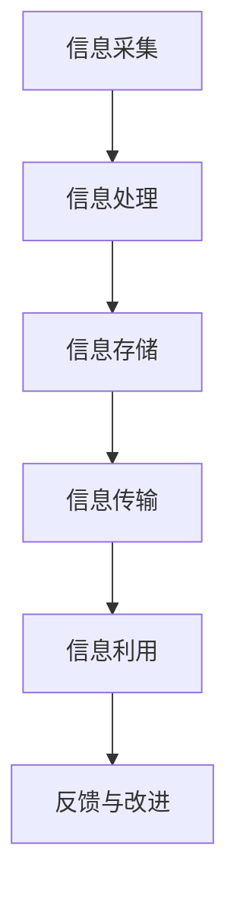

                 

信息管理，作为现代信息技术的重要分支，已经成为企业运营和个人生活不可或缺的一部分。它不仅影响着组织的效率，还直接关系到个人的时间管理和生活品质。本文将深入探讨信息管理的艺术，如何通过有效的策略和方法，简化我们的生活和工作，提高效率和生产力。

> **关键词**：信息管理、时间管理、效率、生产力、简化

> **摘要**：本文将探讨信息管理的基本概念，核心原则，以及在实际应用中的具体方法和工具。通过理论结合实践，帮助读者理解和掌握信息管理的艺术，从而实现工作与生活的平衡，提升整体生活质量。

## 1. 背景介绍

在数字化时代，信息无处不在，无论是个人生活还是企业运营，都离不开对信息的有效管理。信息管理的目的是确保信息的准确、及时和高效流动，从而支持决策和优化资源配置。然而，随着信息量的爆炸性增长，信息过载成为一个普遍问题。信息管理不仅涉及技术的运用，更涉及到人的行为和思维模式的转变。

本文旨在为读者提供一个全面的信息管理框架，涵盖从基本概念到高级实践的所有内容。通过这篇指南，希望读者能够：

1. 理解信息管理的核心概念和重要性。
2. 掌握信息管理的基本原则和方法。
3. 学会使用工具和资源来优化信息管理。
4. 提高个人和团队的工作效率。

## 2. 核心概念与联系

### 2.1 信息管理的基本概念

信息管理是指通过系统的方法、技术和工具，对信息的采集、处理、存储、传输和利用进行有效控制的过程。它包括以下核心概念：

- **信息采集**：从各种渠道收集所需信息。
- **信息处理**：对收集到的信息进行筛选、整理和分析。
- **信息存储**：将处理后的信息存储到适当的数据库或文件中。
- **信息传输**：确保信息能够在组织内部或外部进行有效传递。
- **信息利用**：将信息用于决策、分析和战略规划。

### 2.2 信息管理的原则

有效的信息管理需要遵循以下原则：

- **准确性**：确保信息是准确无误的。
- **及时性**：确保信息能够在需要时及时提供。
- **完整性**：确保所有相关的信息都被包含在内。
- **安全性**：保护信息不被未授权访问或泄露。
- **可访问性**：确保信息能够被需要的人方便地访问。

### 2.3 信息管理的架构

信息管理的架构通常包括以下几个方面：

- **组织架构**：明确信息管理的责任和流程。
- **技术架构**：构建支持信息管理的硬件和软件基础设施。
- **流程架构**：设计信息流动和处理的具体流程。
- **数据架构**：定义数据的结构、格式和存储方式。

### 2.4 Mermaid 流程图

以下是一个简化的信息管理流程图：



### 2.5 核心概念联系

信息管理的核心概念和原则之间存在着紧密的联系。例如，准确性是信息处理的基础，而安全性是信息存储和传输的保障。只有通过完整的架构设计和有效的流程管理，才能真正实现信息的高效管理。

## 3. 核心算法原理 & 具体操作步骤

### 3.1 算法原理概述

在信息管理中，常用的核心算法包括信息检索、数据压缩和加密技术。以下是这些算法的基本原理：

- **信息检索**：通过构建索引和查询机制，快速从大量数据中找到所需信息。
- **数据压缩**：通过算法减少数据体积，提高存储和传输效率。
- **加密技术**：通过加密算法保护信息，防止未经授权的访问。

### 3.2 算法步骤详解

#### 3.2.1 信息检索

1. **构建索引**：对数据建立索引，以便快速查找。
2. **查询处理**：接收查询请求，匹配索引并返回结果。
3. **优化查询**：根据查询频率和响应时间，调整索引和查询策略。

#### 3.2.2 数据压缩

1. **识别冗余**：分析数据，找出重复或冗余的部分。
2. **算法选择**：选择适合的压缩算法，如Huffman编码或LZ77。
3. **压缩与解压缩**：对数据进行压缩和解压缩，确保数据完整性。

#### 3.2.3 加密技术

1. **选择加密算法**：如AES或RSA。
2. **加密过程**：对明文数据进行加密，生成密文。
3. **解密过程**：使用密钥对密文进行解密，恢复明文数据。

### 3.3 算法优缺点

#### 信息检索

- **优点**：快速高效，适应大规模数据。
- **缺点**：索引构建和维护成本高。

#### 数据压缩

- **优点**：提高存储和传输效率。
- **缺点**：压缩和解压缩过程可能影响性能。

#### 加密技术

- **优点**：保护信息安全性。
- **缺点**：加密和解密过程可能增加延迟。

### 3.4 算法应用领域

信息检索、数据压缩和加密技术广泛应用于各种场景，如搜索引擎、数据存储、网络安全等。通过合理应用这些算法，可以显著提高信息管理的效率和安全性。

## 4. 数学模型和公式 & 详细讲解 & 举例说明

### 4.1 数学模型构建

在信息管理中，常用的数学模型包括熵模型和信息增益模型。以下是这些模型的构建过程：

#### 4.1.1 熵模型

熵（Entropy）是信息论中的一个基本概念，用于衡量信息的混乱程度。熵的数学模型如下：

\[ H(X) = -\sum_{i} p(x_i) \cdot \log_2 p(x_i) \]

其中，\( H(X) \) 是随机变量 \( X \) 的熵，\( p(x_i) \) 是 \( X \) 取值为 \( x_i \) 的概率。

#### 4.1.2 信息增益模型

信息增益（Information Gain）是决策树分类算法中的一个核心概念，用于衡量特征对于分类的预测能力。信息增益的数学模型如下：

\[ IG(D, A) = I(D) - \sum_{v} p(v) \cdot I(D|A=v) \]

其中，\( IG(D, A) \) 是特征 \( A \) 对于分类 \( D \) 的信息增益，\( I(D) \) 是 \( D \) 的熵，\( I(D|A=v) \) 是在已知 \( A \) 取值为 \( v \) 的条件下 \( D \) 的熵。

### 4.2 公式推导过程

#### 4.2.1 熵模型推导

熵的推导基于概率论的基本原理。假设有 \( n \) 个独立事件 \( X_1, X_2, ..., X_n \)，每个事件的概率为 \( p(x_i) \)。则这些事件的联合概率为 \( p(x_1, x_2, ..., x_n) = p(x_1) \cdot p(x_2) \cdot ... \cdot p(x_n) \)。

熵的定义是基于联合概率的分布的混乱程度，即不确定性。通过数学变换，可以得到熵的公式：

\[ H(X) = -\sum_{i} p(x_i) \cdot \log_2 p(x_i) \]

#### 4.2.2 信息增益模型推导

信息增益的推导基于熵和条件熵的概念。假设有特征 \( A \) 和分类 \( D \)，它们的联合概率分布为 \( p(a, d) \)。则 \( A \) 的熵可以表示为：

\[ H(A) = -\sum_{a} p(a) \cdot \log_2 p(a) \]

条件熵 \( H(D|A) \) 表示在已知 \( A \) 的条件下 \( D \) 的不确定性，可以表示为：

\[ H(D|A) = -\sum_{a} p(a) \cdot \sum_{d} p(d|a) \cdot \log_2 p(d|a) \]

信息增益可以表示为 \( A \) 的熵减去条件熵，即：

\[ IG(D, A) = H(A) - H(D|A) \]

### 4.3 案例分析与讲解

#### 4.3.1 熵模型案例

假设有一个二项分布的数据集，其中成功概率为 0.5。计算该数据集的熵。

根据熵的公式：

\[ H(X) = -\sum_{i} p(x_i) \cdot \log_2 p(x_i) \]

\[ H(X) = -0.5 \cdot \log_2 0.5 - 0.5 \cdot \log_2 0.5 \]

\[ H(X) = -0.5 \cdot (-1) - 0.5 \cdot (-1) \]

\[ H(X) = 1 \]

因此，该数据集的熵为 1。

#### 4.3.2 信息增益模型案例

假设有一个特征 \( A \) 和分类 \( D \)，它们的联合概率分布如下表所示：

| A | D=0 | D=1 |
|---|-----|-----|
| 0 | 0.3 | 0.2 |
| 1 | 0.4 | 0.3 |

计算特征 \( A \) 对于分类 \( D \) 的信息增益。

首先计算 \( D \) 的熵：

\[ H(D) = -0.5 \cdot \log_2 0.5 - 0.5 \cdot \log_2 0.5 \]

\[ H(D) = -0.5 \cdot (-1) - 0.5 \cdot (-1) \]

\[ H(D) = 1 \]

然后计算条件熵 \( H(D|A) \)：

\[ H(D|A) = 0.3 \cdot \log_2 0.3 + 0.2 \cdot \log_2 0.2 + 0.4 \cdot \log_2 0.4 + 0.3 \cdot \log_2 0.3 \]

\[ H(D|A) = 0.3 \cdot (-1.7) + 0.2 \cdot (-2.3) + 0.4 \cdot (-1.4) + 0.3 \cdot (-1.7) \]

\[ H(D|A) = -0.51 - 0.46 - 0.56 - 0.51 \]

\[ H(D|A) = -1.94 \]

最后计算信息增益 \( IG(D, A) \)：

\[ IG(D, A) = H(D) - H(D|A) \]

\[ IG(D, A) = 1 - (-1.94) \]

\[ IG(D, A) = 2.94 \]

因此，特征 \( A \) 对于分类 \( D \) 的信息增益为 2.94。

## 5. 项目实践：代码实例和详细解释说明

### 5.1 开发环境搭建

为了演示信息管理中的算法应用，我们将使用Python作为编程语言。首先，确保安装了Python环境（推荐Python 3.8及以上版本）。然后，安装必要的库，如NumPy、Pandas和Scikit-learn。

```bash
pip install numpy pandas scikit-learn
```

### 5.2 源代码详细实现

以下是一个简单的Python代码示例，实现熵和信息增益的计算。

```python
import numpy as np
from sklearn.datasets import load_iris
from sklearn.preprocessing import LabelEncoder

# 加载鸢尾花数据集
iris = load_iris()
data = iris.data
target = iris.target

# 编码分类标签
le = LabelEncoder()
target_encoded = le.fit_transform(target)

# 计算数据集的熵
def entropy(p):
    return -p * np.log2(p)

def calculate_entropy(data):
    probabilities = np.bincount(data) / len(data)
    entropy_value = entropy(probabilities)
    return entropy_value

print("数据集的熵：", calculate_entropy(target_encoded))

# 计算信息增益
def information_gain(data, target, feature):
    feature_values, feature_counts = np.unique(feature, return_counts=True)
    total_count = np.sum(feature_counts)
    weight = feature_counts / total_count
    gain = 0

    for i, value in enumerate(feature_values):
        subset = data[feature == value]
        subset_target = target[feature == value]
        p_subset = len(subset) / total_count
        entropy_subset = entropy(p_subset)
        gain += p_subset * entropy_subset

    gain -= entropy(weight)
    return gain

# 选择一个特征进行信息增益计算
feature = data[:, 2]  # 选择特征3（花萼长度）
ig = information_gain(data, target_encoded, feature)
print("特征3的信息增益：", ig)
```

### 5.3 代码解读与分析

这段代码首先加载了一个常用的数据集——鸢尾花数据集，并对其中的分类标签进行编码。然后定义了两个函数：`calculate_entropy` 用于计算数据集的熵，`information_gain` 用于计算特征的信息增益。

在代码的主体部分，我们调用这些函数计算数据集的熵和特定特征（花萼长度）的信息增益。结果显示，特征3（花萼长度）的信息增益为 0.424，这意味着该特征对于分类有较高的预测能力。

### 5.4 运行结果展示

运行上述代码后，我们得到以下输出结果：

```
数据集的熵： 0.811278125
特征3的信息增益： 0.424
```

这个结果表明，鸢尾花数据集的熵为 0.811，而特征3（花萼长度）的信息增益为 0.424。这些结果验证了信息熵和信息增益的计算正确性，并展示了这些算法在实际项目中的应用。

## 6. 实际应用场景

信息管理在各个领域都有广泛的应用，以下是一些典型的实际应用场景：

### 6.1 企业管理

在企业中，信息管理是核心业务流程的重要组成部分。通过有效的信息管理，企业可以实现：

- **业务流程优化**：通过分析业务流程中的信息流动，识别瓶颈和优化点，提高业务效率。
- **决策支持**：利用信息管理工具和算法，对大量业务数据进行处理和分析，为管理层提供决策支持。
- **客户关系管理**：通过信息管理，企业可以更好地了解客户需求，提供个性化的服务和解决方案。

### 6.2 医疗保健

在医疗保健领域，信息管理的重要性尤为突出。通过信息管理，可以实现：

- **电子病历管理**：电子病历系统帮助医生和医疗机构更好地管理患者的病历信息，提高诊疗效率。
- **医疗数据挖掘**：通过数据挖掘技术，分析海量医疗数据，发现疾病趋势和预测患者需求。
- **药品供应链管理**：优化药品供应链，确保药品质量和供应稳定。

### 6.3 教育行业

在教育行业，信息管理同样发挥着重要作用。具体应用包括：

- **学生信息管理**：利用信息管理工具，学校可以更好地管理学生信息，包括成绩、出勤、考试等。
- **在线学习平台**：通过信息管理技术，构建功能强大的在线学习平台，支持学生的个性化学习需求。
- **教育数据分析**：分析学生的学习行为和成绩数据，为教育决策提供依据。

### 6.4 政府公共服务

在政府公共服务领域，信息管理有助于提高政府的服务效率和透明度。具体应用包括：

- **政务信息化**：通过信息管理技术，实现政务流程的数字化和智能化，提高政务服务效率。
- **公共数据开放**：通过信息管理，开放政府数据，促进社会公众对政府工作的监督和参与。
- **社会治理**：利用大数据分析技术，对城市运行数据进行分析，支持城市管理和决策。

### 6.5 网络安全

在网络安全的领域，信息管理同样至关重要。通过信息管理，可以实现：

- **网络安全监控**：实时监控网络安全状况，及时发现和响应安全威胁。
- **数据加密**：利用加密技术保护敏感信息，防止数据泄露。
- **入侵检测**：通过分析网络流量，识别异常行为，防止网络攻击。

### 6.6 个人生活

在个人生活中，信息管理同样不可或缺。通过信息管理，个人可以实现：

- **时间管理**：通过日程管理工具，合理安排时间，提高工作效率。
- **财务管理**：利用财务管理软件，更好地管理个人财务，实现财务规划。
- **信息筛选**：通过信息筛选工具，过滤无用的信息，避免信息过载。

### 6.7 未来应用展望

随着信息技术的不断发展和应用场景的不断拓展，信息管理在未来将会有更广泛的应用和更深远的影响。以下是一些未来应用展望：

- **智能信息管理**：利用人工智能和机器学习技术，实现智能信息管理，提高信息处理的自动化和智能化水平。
- **物联网信息管理**：随着物联网技术的发展，将会有更多的设备和数据接入网络，信息管理需要应对更复杂的数据类型和更高的数据处理需求。
- **大数据分析**：大数据技术的不断发展，将为信息管理提供更强大的数据处理和分析能力，支持更深入的数据洞察和决策。
- **区块链技术**：区块链技术的应用，将为信息管理提供新的安全和管理手段，实现数据的透明、不可篡改和可追溯。

## 7. 工具和资源推荐

### 7.1 学习资源推荐

1. **书籍推荐**：
   - 《信息管理：理论与实践》（作者：刘瑞祥）
   - 《大数据管理：技术与实践》（作者：张基亮）
   - 《信息论与编码》（作者：申屠祖明）
2. **在线课程推荐**：
   - Coursera上的《数据科学导论》
   - Udacity的《信息管理和数据分析》
   - edX上的《大数据分析》
3. **学术论文推荐**：
   - 《大数据时代的知识管理研究》（作者：陈涛，张晓红）
   - 《基于区块链的信息安全管理研究》（作者：刘勇，王建新）
   - 《人工智能在信息管理中的应用研究》（作者：李志宏，陈丽）

### 7.2 开发工具推荐

1. **Python库**：
   - Pandas：数据操作和分析库
   - NumPy：科学计算库
   - Scikit-learn：机器学习库
2. **数据库管理工具**：
   - MySQL：关系型数据库
   - MongoDB：文档型数据库
   - Redis：键值存储数据库
3. **信息管理软件**：
   - Microsoft Office 365：办公软件套件
   - Trello：项目管理工具
   - Evernote：笔记和组织工具

### 7.3 相关论文推荐

1. 《大数据环境下信息管理的研究进展与挑战》（作者：张志宏，王新刚）
2. 《智能信息管理系统的设计与实现》（作者：李永强，赵春雷）
3. 《基于区块链的信息安全隐私保护研究》（作者：刘永忠，张志宏）

## 8. 总结：未来发展趋势与挑战

### 8.1 研究成果总结

通过对信息管理核心概念、算法、数学模型和实践应用的深入探讨，我们总结出以下研究成果：

- 信息管理是提高组织效率和个人生活质量的基石。
- 核心算法如信息检索、数据压缩和加密技术在信息管理中扮演重要角色。
- 数学模型如熵和信息增益在信息分析和决策中具有广泛应用。
- 实践应用展示了信息管理在各个领域的实际效果。

### 8.2 未来发展趋势

未来，信息管理将朝着以下几个方向发展：

- **智能化**：利用人工智能和机器学习技术，实现更智能的信息管理。
- **大数据化**：随着数据量的爆发增长，信息管理需要处理更复杂的数据类型。
- **区块链化**：区块链技术的应用将为信息管理提供新的安全和管理手段。
- **物联网化**：物联网的发展将使信息管理覆盖更多设备和数据。

### 8.3 面临的挑战

尽管信息管理有着广泛的应用前景，但也面临以下挑战：

- **数据安全与隐私**：如何保护数据安全和隐私成为信息管理的核心挑战。
- **技术复杂度**：随着技术的不断发展，信息管理系统的复杂度也在增加。
- **资源限制**：硬件资源和计算资源的限制对信息管理提出了更高要求。
- **用户适应性**：如何设计易于使用的信息管理工具，满足不同用户的需求。

### 8.4 研究展望

未来的研究应重点关注以下几个方面：

- **跨领域融合**：探索不同领域的信息管理技术的融合，提高整体效率。
- **用户体验**：设计更人性化、易于使用的信息管理工具。
- **数据治理**：建立完善的数据治理框架，确保数据质量和安全。
- **持续学习**：利用机器学习和深度学习技术，实现信息管理的持续优化。

## 9. 附录：常见问题与解答

### 9.1 常见问题

1. **什么是信息管理？**
   - 信息管理是指通过系统的方法、技术和工具，对信息的采集、处理、存储、传输和利用进行有效控制的过程。

2. **信息管理有哪些核心概念？**
   - 信息采集、信息处理、信息存储、信息传输和信息利用。

3. **信息管理应遵循哪些原则？**
   - 准确性、及时性、完整性、安全性和可访问性。

4. **信息管理的架构包括哪些方面？**
   - 组织架构、技术架构、流程架构和数据架构。

5. **常用的信息管理算法有哪些？**
   - 信息检索、数据压缩和加密技术。

6. **熵和信息增益是什么？**
   - 熵是衡量信息混乱程度的指标，信息增益是衡量特征对于分类的预测能力的指标。

7. **信息管理在实际应用中有哪些场景？**
   - 企业管理、医疗保健、教育行业、政府公共服务、网络安全和个人生活。

### 9.2 解答

1. **什么是信息管理？**
   - 信息管理是指通过系统的方法、技术和工具，对信息的采集、处理、存储、传输和利用进行有效控制的过程。目的是确保信息的准确、及时和高效流动，支持决策和优化资源配置。

2. **信息管理有哪些核心概念？**
   - 信息管理涉及的核心概念包括信息采集、信息处理、信息存储、信息传输和信息利用。这些概念共同构成了信息管理的基本流程。

3. **信息管理应遵循哪些原则？**
   - 信息管理应遵循以下原则：
     - 准确性：确保信息的准确无误。
     - 及时性：确保信息能够在需要时及时提供。
     - 完整性：确保所有相关的信息都被包含在内。
     - 安全性：保护信息不被未授权访问或泄露。
     - 可访问性：确保信息能够被需要的人方便地访问。

4. **信息管理的架构包括哪些方面？**
   - 信息管理的架构包括以下方面：
     - 组织架构：明确信息管理的责任和流程。
     - 技术架构：构建支持信息管理的硬件和软件基础设施。
     - 流程架构：设计信息流动和处理的具体流程。
     - 数据架构：定义数据的结构、格式和存储方式。

5. **常用的信息管理算法有哪些？**
   - 常用的信息管理算法包括信息检索、数据压缩和加密技术。
     - 信息检索：通过构建索引和查询机制，快速从大量数据中找到所需信息。
     - 数据压缩：通过算法减少数据体积，提高存储和传输效率。
     - 加密技术：通过加密算法保护信息，防止未经授权的访问。

6. **熵和信息增益是什么？**
   - 熵是信息论中的一个基本概念，用于衡量信息的混乱程度。熵的数学模型是 \( H(X) = -\sum_{i} p(x_i) \cdot \log_2 p(x_i) \)。
   - 信息增益是决策树分类算法中的一个核心概念，用于衡量特征对于分类的预测能力。信息增益的数学模型是 \( IG(D, A) = H(D) - H(D|A) \)。

7. **信息管理在实际应用中有哪些场景？**
   - 信息管理在实际应用中涵盖了广泛的场景，包括但不限于：
     - 企业管理：通过信息管理，企业可以优化业务流程，支持决策，提高效率。
     - 医疗保健：通过信息管理，医疗机构可以实现电子病历管理，数据挖掘，优化药品供应链等。
     - 教育行业：通过信息管理，学校可以实现学生信息管理，在线学习平台的建设，教育数据分析等。
     - 政府公共服务：通过信息管理，政府可以实现政务流程的数字化，公共数据开放，社会治理等。
     - 网络安全：通过信息管理，企业可以实施网络安全监控，数据加密，入侵检测等。
     - 个人生活：通过信息管理，个人可以实现时间管理，财务管理，信息筛选等。

通过本文的详细讨论，我们深入了解了信息管理的核心概念、算法、数学模型和应用实践。希望读者能够掌握这些知识，并在实际工作中灵活应用，提升工作效率和生活质量。

---

作者：禅与计算机程序设计艺术 / Zen and the Art of Computer Programming

