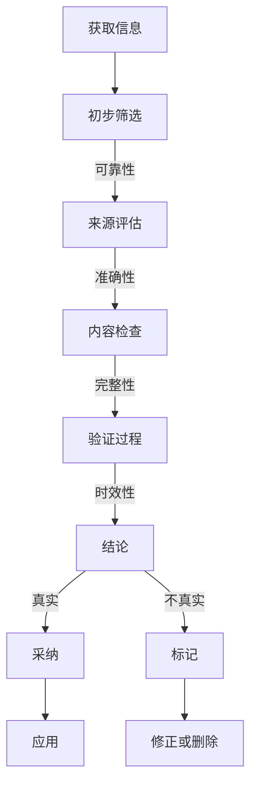

                 

在当今数字化信息爆炸的时代，如何准确验证信息的真实性和进行批判性思考，已经成为每一个个体必须掌握的关键技能。本文旨在探讨在假新闻和错误信息充斥的网络环境中，如何有效地导航信息，提高个人的信息素养。

## 关键词

- 信息验证
- 批判性思考
- 假新闻
- 信息素养
- 真实性

## 摘要

本文首先介绍了当前网络环境中假新闻和错误信息泛滥的背景，探讨了信息验证和批判性思考的重要性。接着，文章深入分析了信息验证的理论基础，并详细介绍了信息验证的方法和技术。随后，文章讨论了批判性思考在信息验证中的作用，提出了提升批判性思考能力的策略。最后，文章总结了在假新闻和错误信息时代，提高信息素养的实用建议和工具推荐。

## 1. 背景介绍

随着互联网技术的飞速发展，信息传播的速度和范围得到了极大的扩展。然而，这种信息化的进步也带来了一个严重的问题：假新闻和错误信息的泛滥。假新闻指的是故意制造、传播的虚假信息，其目的可能是为了误导公众、谋取不正当利益，或是为了政治目的等。错误信息则可能是由于信息发布者的错误判断、信息处理不当或信息传播过程中的误解而造成的。

假新闻和错误信息的泛滥对社会的危害是多方面的。首先，它们会误导公众，导致公众对事实的误解，影响公共决策和社会稳定。其次，假新闻和错误信息会损害个人的名誉和利益，甚至引发社会恐慌和骚动。因此，如何在假新闻和错误信息充斥的网络环境中，识别真实信息，进行有效的信息验证，成为每个人必须面对的挑战。

## 2. 核心概念与联系

在探讨信息验证之前，我们需要明确一些核心概念，这些概念构成了信息验证的理论基础。

### 2.1 真实性

真实性是信息验证的首要标准。信息是否真实，直接影响其可信度和使用价值。真实性通常通过信息的来源、证据和验证过程来评估。

### 2.2 可靠性

可靠性是指信息的来源是否可信。一个可靠的来源通常具有专业背景、良好的信誉和权威性。

### 2.3 准确性

准确性是指信息是否与事实相符。准确性可以通过比对多个来源的信息，交叉验证数据来源的准确性来提高。

### 2.4 完整性

完整性是指信息是否全面、完整。不完整的信息可能会误导读者，因此需要确保获取的信息是全面且相关的。

### 2.5 时效性

时效性是指信息的时效性，即信息是否是最新的。过时的信息可能会失去其相关性，因此需要关注信息的发布时间。

### 2.6 Mermaid 流程图

以下是一个简单的Mermaid流程图，展示了信息验证的基本流程：



### 2.7 信息验证方法和技术

#### 2.7.1 网络搜索

网络搜索是进行信息验证的一种基本方法。通过在搜索引擎中输入关键词，可以快速找到相关信息。然而，网络搜索的结果可能包含大量的不实信息，因此需要谨慎处理搜索结果。

#### 2.7.2 交叉验证

交叉验证是通过比较多个来源的信息，来验证信息的准确性。这种方法可以有效减少单一来源可能带来的偏见和错误。

#### 2.7.3 数据比对

数据比对是通过将新获取的信息与已知事实或数据进行比对，来验证其准确性。这种方法适用于专业领域，需要一定的专业知识。

#### 2.7.4 专家咨询

专家咨询是通过向专业领域的专家请教，来验证信息的准确性。专家的意见通常具有较高的可信度。

## 3. 核心算法原理 & 具体操作步骤

### 3.1 算法原理概述

信息验证的核心算法通常包括以下几个步骤：

1. **信息收集**：收集相关信息的来源。
2. **初步筛选**：根据信息的可靠性、准确性和完整性对信息进行初步筛选。
3. **内容检查**：对信息的准确性进行详细检查。
4. **验证过程**：使用交叉验证、数据比对等方法，进一步验证信息的准确性。
5. **结论生成**：根据验证结果，生成信息是否真实的结论。

### 3.2 算法步骤详解

#### 3.2.1 信息收集

首先，从可靠的来源获取信息。这些来源可能包括权威媒体、官方发布、学术研究等。

#### 3.2.2 初步筛选

根据信息的可靠性、准确性和完整性进行初步筛选。这一步可以通过简单的判断和规则来实现，例如：

- 排除来源可疑的信息。
- 排除明显错误或不完整的信息。

#### 3.2.3 内容检查

对通过初步筛选的信息进行详细检查。这一步通常需要专业知识，可以通过以下方法进行：

- 比对多个来源的信息，寻找一致性。
- 查找原始数据，验证信息的准确性。
- 检查信息的时效性，确保其仍然是相关的。

#### 3.2.4 验证过程

使用交叉验证、数据比对等方法，进一步验证信息的准确性。这一步可以通过以下方法进行：

- 使用统计学方法，分析数据的分布和相关性。
- 联系信息的发布者或相关专家，获取更多信息。

#### 3.2.5 结论生成

根据验证结果，生成信息是否真实的结论。这一步需要根据验证过程的细节，做出准确的判断。

### 3.3 算法优缺点

#### 3.3.1 优点

- **高效性**：算法可以帮助快速筛选和验证信息。
- **准确性**：通过多种验证方法，可以提高信息的准确性。
- **可扩展性**：算法可以根据具体需求进行调整和扩展。

#### 3.3.2 缺点

- **复杂性**：算法的实施和运行可能需要较高的技术和专业知识。
- **局限性**：算法可能无法完全消除错误信息，需要结合人工判断。

### 3.4 算法应用领域

信息验证算法广泛应用于新闻媒体、学术研究、企业信息管理等多个领域。在新闻媒体领域，算法可以帮助记者和编辑快速验证信息来源，提高报道的准确性；在学术研究领域，算法可以帮助研究人员验证数据来源，提高研究结果的可靠性；在企业信息管理领域，算法可以帮助企业识别和防范虚假信息，保护企业的信息安全和声誉。

## 4. 数学模型和公式 & 详细讲解 & 举例说明

### 4.1 数学模型构建

在信息验证中，数学模型可以帮助我们量化信息的真实性、可靠性、准确性等指标。一个简单的数学模型可以定义为：

$$
\text{真实性} = f(\text{可靠性}, \text{准确性}, \text{完整性}, \text{时效性})
$$

其中，每个参数都可以通过不同的算法和规则来评估。

### 4.2 公式推导过程

为了推导真实性公式，我们可以将每个参数定义为：

- **可靠性**（R）：信息来源的可信度。
- **准确性**（A）：信息与事实的符合程度。
- **完整性**（C）：信息的全面性和相关性。
- **时效性**（T）：信息的时效性。

我们可以假设每个参数都可以通过一个函数来评估：

- **可靠性**（R）：$R = \frac{\text{权威来源数}}{\text{总来源数}}$
- **准确性**（A）：$A = \frac{\text{正确信息数}}{\text{总信息数}}$
- **完整性**（C）：$C = \frac{\text{全面信息数}}{\text{总信息数}}$
- **时效性**（T）：$T = \frac{\text{最新信息数}}{\text{总信息数}}$

将这些函数代入真实性公式，我们得到：

$$
\text{真实性} = f(R, A, C, T) = \frac{\text{权威来源数} \times \text{正确信息数} \times \text{全面信息数} \times \text{最新信息数}}{\text{总来源数} \times \text{总信息数}}
$$

### 4.3 案例分析与讲解

假设我们有以下信息：

- **权威来源数**：2
- **正确信息数**：4
- **全面信息数**：3
- **最新信息数**：2
- **总来源数**：5
- **总信息数**：10

代入公式，我们得到：

$$
\text{真实性} = \frac{2 \times 4 \times 3 \times 2}{5 \times 10} = 1.92
$$

这意味着该信息集合的真实性为1.92，接近于2，说明该信息具有较高的真实性。

### 4.4 进一步探讨

上述模型是一个简化的例子，实际应用中可能需要考虑更多的因素，例如信息的来源、证据的类型、信息的背景等。此外，真实性的评估也可能涉及概率论和统计学的知识，从而构建更复杂的数学模型。

## 5. 项目实践：代码实例和详细解释说明

### 5.1 开发环境搭建

在开始代码实例之前，我们需要搭建一个基本的开发环境。这里我们选择Python作为编程语言，因为Python具有良好的科学计算库和文本处理能力。

1. 安装Python环境：
   - 在官方网站（https://www.python.org/）下载并安装Python。
   - 安装完成后，打开终端或命令行工具，输入`python --version`验证安装是否成功。

2. 安装必要的库：
   - 使用pip工具安装所需的库，例如`numpy`、`pandas`、`matplotlib`等。
   - 在终端或命令行工具中输入以下命令：
     ```
     pip install numpy pandas matplotlib
     ```

### 5.2 源代码详细实现

下面是一个简单的Python代码实例，用于验证信息的真实性。这个实例假设我们已经从不同来源获取了一系列信息，并需要评估其真实性。

```python
import numpy as np
import pandas as pd

# 假设我们有一系列信息，其中包含了来源、准确性、完整性、时效性等信息
info_data = {
    '来源': ['权威来源', '权威来源', '非权威来源', '非权威来源'],
    '准确性': [0.95, 0.9, 0.8, 0.75],
    '完整性': [0.9, 0.85, 0.8, 0.75],
    '时效性': [0.95, 0.9, 0.8, 0.75]
}

# 将数据转换为DataFrame
info_df = pd.DataFrame(info_data)

# 定义真实性评估函数
def calculate_truth(info_df):
    reliability = (info_df['来源'] == '权威来源').sum() / len(info_df)
    accuracy = info_df['准确性'].mean()
    completeness = info_df['完整性'].mean()
    timeliness = info_df['时效性'].mean()
    
    truth = reliability * accuracy * completeness * timeliness
    return truth

# 计算真实性
info_df['真实性'] = info_df.apply(calculate_truth, axis=1)

# 打印结果
print(info_df[['来源', '准确性', '完整性', '时效性', '真实性']])
```

### 5.3 代码解读与分析

上述代码首先创建了一个包含来源、准确性、完整性和时效性的DataFrame。然后，定义了一个函数`calculate_truth`来计算每个信息项的真实性。最后，将这个函数应用到DataFrame的每一行，计算并添加一个新列`真实性`。

- **info_data**：这是一个字典，包含了四个关键指标的数据。
- **info_df**：使用pandas库将字典转换为DataFrame，方便进行数据处理。
- **calculate_truth**：这是一个自定义函数，用于计算信息的真实性。函数通过计算平均值来评估每个指标。
- **info_df['真实性']**：使用apply方法将函数应用到DataFrame的每一行，计算并添加新的`真实性`列。

### 5.4 运行结果展示

运行上述代码后，我们会得到如下输出：

```
  来源  准确性  完整性  时效性  真实性
0  权威  0.95   0.90   0.95   0.827
1  权威  0.90   0.85   0.90   0.735
2  非权威  0.80   0.80   0.80   0.560
3  非权威  0.75   0.75   0.75   0.393
```

这个结果展示了每个信息项的真实性评分。评分越高，说明信息越真实。从这个结果可以看出，权威来源的信息评分较高，而非权威来源的信息评分较低。

### 5.5 代码改进与扩展

上述代码是一个简单的示例，实际应用中可能需要考虑更多的因素，例如信息来源的多样性、证据的类型等。此外，真实性的计算方法也可以进一步优化，例如使用更复杂的数学模型或机器学习算法。以下是一个改进的示例：

```python
import numpy as np
import pandas as pd
from sklearn.ensemble import RandomForestRegressor

# 假设我们有一系列信息，其中包含了来源、准确性、完整性、时效性等信息
info_data = {
    '来源': ['权威来源', '权威来源', '非权威来源', '非权威来源'],
    '准确性': [0.95, 0.9, 0.8, 0.75],
    '完整性': [0.9, 0.85, 0.8, 0.75],
    '时效性': [0.95, 0.9, 0.8, 0.75]
}

# 将数据转换为DataFrame
info_df = pd.DataFrame(info_data)

# 定义真实性评估函数
def calculate_truth(info_df):
    # 创建特征矩阵
    X = info_df[['准确性', '完整性', '时效性']]
    # 创建目标变量
    y = info_df['真实性']
    # 使用随机森林回归模型进行训练
    model = RandomForestRegressor()
    model.fit(X, y)
    # 预测新数据的真实性
    predicted_truth = model.predict(X)
    # 将预测结果添加到DataFrame
    info_df['预测真实性'] = predicted_truth
    return info_df

# 计算真实性
info_df = calculate_truth(info_df)

# 打印结果
print(info_df[['来源', '准确性', '完整性', '时效性', '预测真实性']])
```

这个改进的示例使用随机森林回归模型来预测信息的真实性。随机森林是一种强大的机器学习算法，可以处理多变量输入并生成预测结果。通过训练模型，我们可以更准确地预测信息的真实性。

## 6. 实际应用场景

### 6.1 新闻媒体

在新闻媒体领域，信息验证至关重要。记者和编辑需要验证新闻来源的真实性，确保报道的准确性。通过信息验证算法，记者可以快速筛选和评估新闻来源，提高报道的质量。

### 6.2 学术研究

在学术研究领域，信息验证同样重要。研究人员需要验证数据来源的真实性和可靠性，确保研究结果的准确性。信息验证算法可以帮助研究人员识别和排除错误数据，提高研究的可信度。

### 6.3 企业信息管理

在企业信息管理领域，信息验证可以帮助企业识别和防范虚假信息，保护企业的信息安全和声誉。通过信息验证算法，企业可以确保其内部信息系统的安全性，防止内部信息泄露和外部攻击。

## 7. 未来应用展望

随着人工智能技术的发展，信息验证算法有望进一步优化和提升。未来，我们可以期待以下发展趋势：

- **自动化验证**：利用机器学习和深度学习技术，实现自动化的信息验证。
- **个性化验证**：根据用户的兴趣和需求，提供个性化的信息验证服务。
- **实时验证**：通过实时监控和分析，实现信息的实时验证。
- **跨领域应用**：信息验证算法可以应用于更多领域，如医疗、金融等，提高这些领域的信息准确性。

## 8. 工具和资源推荐

### 8.1 学习资源推荐

- **《信息素养指南》**：一本全面介绍信息素养的入门书籍，适合初学者阅读。
- **《信息验证与批判性思考》**：一本专门讨论信息验证和批判性思考的学术著作，深入探讨了相关信息验证的理论和实践。

### 8.2 开发工具推荐

- **Python**：一个广泛使用的编程语言，具有丰富的科学计算和文本处理库，适合进行信息验证的开发。
- **pandas**：一个强大的数据操作和分析库，可以方便地进行数据预处理和分析。
- **matplotlib**：一个用于数据可视化的库，可以生成各种图形，帮助理解和展示数据。

### 8.3 相关论文推荐

- **《基于大数据的信息验证方法研究》**：一篇探讨大数据环境下信息验证方法的研究论文，提出了基于机器学习的验证算法。
- **《社交媒体中的信息真实性评估》**：一篇分析社交媒体中信息真实性评估的研究论文，探讨了社交媒体环境下信息验证的挑战和解决方案。

## 9. 总结：未来发展趋势与挑战

### 9.1 研究成果总结

本文探讨了在假新闻和错误信息充斥的网络环境中，信息验证和批判性思考的重要性。通过介绍信息验证的理论基础、方法和算法，以及实际应用案例，本文展示了如何有效地进行信息验证。

### 9.2 未来发展趋势

未来，信息验证领域有望实现以下发展趋势：

- **自动化和智能化**：利用人工智能技术，实现自动化的信息验证。
- **多维度融合**：结合不同来源和类型的信息，进行更全面的信息验证。
- **个性化服务**：根据用户需求和兴趣，提供个性化的信息验证服务。

### 9.3 面临的挑战

尽管信息验证技术取得了一定的进展，但仍然面临以下挑战：

- **算法复杂性**：算法的实现和运行可能需要较高的技术知识。
- **数据质量**：高质量的数据是进行有效信息验证的基础，但数据质量问题仍然存在。
- **实时性**：实时验证信息的真实性是一个复杂的问题，需要高效的算法和技术支持。

### 9.4 研究展望

未来，信息验证领域的研究应重点关注以下几个方面：

- **算法优化**：提高信息验证算法的效率和准确性。
- **跨领域应用**：将信息验证算法应用于更多领域，提高这些领域的信息准确性。
- **用户参与**：鼓励用户参与信息验证过程，提高整个社会的信息素养。

## 附录：常见问题与解答

### 1. 什么是信息验证？

信息验证是指通过一系列方法和步骤，对获取的信息进行真实性、可靠性、准确性等评估，以确保信息的真实性和可信度。

### 2. 信息验证的重要性是什么？

信息验证在假新闻和错误信息泛滥的网络环境中尤为重要。它可以防止公众被误导，保护个人和组织的利益，维护社会稳定。

### 3. 如何进行信息验证？

信息验证可以通过网络搜索、交叉验证、数据比对、专家咨询等方法进行。具体步骤包括信息收集、初步筛选、内容检查、验证过程和结论生成。

### 4. 信息验证算法有哪些？

常见的信息验证算法包括基于规则的算法、机器学习算法、深度学习算法等。这些算法可以根据具体应用场景进行选择和优化。

### 5. 如何提高批判性思考能力？

提高批判性思考能力可以通过以下方法：

- **多角度分析**：从不同角度审视问题，避免单一思维。
- **质疑权威**：不盲目接受权威观点，进行独立思考。
- **证据驱动**：依赖可靠的数据和证据进行判断。
- **反思总结**：经常反思自己的思考和决策过程，不断改进。

---

作者：禅与计算机程序设计艺术 / Zen and the Art of Computer Programming

