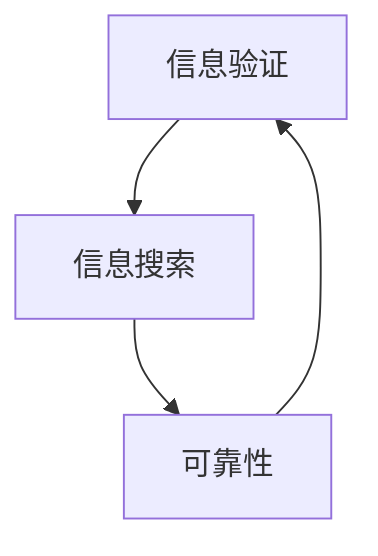

                 

关键词：信息验证，信息搜索，策略，可靠性，算法，技术，工具

> 摘要：在信息爆炸的时代，如何从海量数据中找到可靠的信息成为一个至关重要的议题。本文将深入探讨信息验证和信息搜索的策略，通过详细的算法原理、数学模型、项目实践和分析，帮助读者掌握在信息海洋中航行的技能，提高信息检索和验证的效率。

## 1. 背景介绍

在当今数字化时代，信息无处不在，但信息的真实性和可靠性却备受质疑。无论是科学研究、商业决策还是日常生活，我们都依赖于准确的信息。然而，互联网上的信息质量参差不齐，虚假信息和误导性信息泛滥，使得信息验证成为一个迫切需要解决的问题。同时，如何在海量的信息中快速准确地找到所需信息，也成为了信息搜索领域的核心挑战。

本文旨在探讨信息验证和信息搜索的策略，提供一套实用的方法和工具，帮助读者在复杂的信息环境中找到可靠的信息。文章将涵盖以下几个主要部分：

1. 核心概念与联系
2. 核心算法原理与具体操作步骤
3. 数学模型和公式
4. 项目实践：代码实例
5. 实际应用场景
6. 工具和资源推荐
7. 总结：未来发展趋势与挑战

## 2. 核心概念与联系

在讨论信息验证和信息搜索之前，我们需要了解一些核心概念。这些概念包括但不限于：

- **信息验证**：指通过多种方法确认信息的真实性和准确性。
- **信息搜索**：指在大量数据中找到所需信息的过程。
- **可靠性**：指信息在特定条件下保持准确和真实的能力。

这些概念之间存在紧密的联系。信息验证是信息搜索的基础，只有验证了信息的可靠性，我们才能信任和使用这些信息。而有效的信息搜索策略可以提高验证效率，使得我们在较短的时间内找到更可靠的信息。

为了更好地理解这些概念，我们可以使用Mermaid流程图来展示它们之间的联系：



图2-1 信息验证、信息搜索和可靠性之间的联系

## 3. 核心算法原理与具体操作步骤

### 3.1 算法原理概述

信息验证和信息搜索的核心算法可以分为以下几类：

- **验证算法**：包括数字签名、哈希函数和密码学等。
- **搜索算法**：包括布尔搜索、索引和聚类等。
- **机器学习算法**：包括分类、回归和聚类等。

这些算法各有特点，但共同的目标是提高信息验证和信息搜索的效率和准确性。

### 3.2 算法步骤详解

#### 3.2.1 验证算法步骤

1. **收集信息**：从各种来源收集待验证的信息。
2. **预处理**：对信息进行清洗和格式化，去除无关部分。
3. **加密或哈希**：使用加密算法或哈希函数对信息进行加密或哈希处理。
4. **比较结果**：将加密后的结果与已知标准或签名进行比较，以确认信息是否被篡改。

#### 3.2.2 搜索算法步骤

1. **构建索引**：创建索引以加速搜索过程。
2. **输入查询**：输入需要搜索的关键词或条件。
3. **匹配与排序**：根据索引匹配结果，对信息进行排序和筛选。
4. **输出结果**：将搜索结果输出给用户。

#### 3.2.3 机器学习算法步骤

1. **数据预处理**：对原始数据进行清洗和格式化。
2. **特征提取**：从数据中提取有用的特征。
3. **模型训练**：使用特征训练机器学习模型。
4. **预测与验证**：使用模型进行预测，并对预测结果进行验证。

### 3.3 算法优缺点

#### 验证算法

- 优点：安全性高，可以有效防止信息篡改。
- 缺点：计算复杂度较高，对硬件要求较高。

#### 搜索算法

- 优点：搜索速度快，适用范围广。
- 缺点：对信息的准确性要求较高，否则容易误匹配。

#### 机器学习算法

- 优点：自适应性强，可以根据数据不断优化。
- 缺点：训练过程复杂，对数据量和质量有较高要求。

### 3.4 算法应用领域

这些算法在各个领域都有广泛的应用，例如：

- **网络安全**：使用加密和哈希算法保护信息。
- **搜索引擎**：使用索引和搜索算法快速检索信息。
- **数据挖掘**：使用机器学习算法挖掘数据中的潜在信息。

## 4. 数学模型和公式

### 4.1 数学模型构建

在信息验证和信息搜索中，数学模型扮演着重要角色。以下是一些常用的数学模型：

- **哈希模型**：$H(x) \pmod {m}$，其中 $H$ 是哈希函数，$x$ 是输入信息，$m$ 是模数。
- **加密模型**：$E_K(x)$ 和 $D_K(y)$，其中 $E$ 是加密函数，$D$ 是解密函数，$K$ 是密钥，$x$ 是明文，$y$ 是密文。
- **分类模型**：$P(y|x) = \frac{P(x|y) \cdot P(y)}{P(x)}$，其中 $P$ 是概率分布，$x$ 是特征，$y$ 是标签。

### 4.2 公式推导过程

以哈希模型为例，其推导过程如下：

1. **输入信息哈希化**：$H(x)$
2. **模运算**：$H(x) \pmod {m}$
3. **输出哈希值**：$H(x) \pmod {m}$

### 4.3 案例分析与讲解

假设我们要验证一条信息是否被篡改，我们可以使用哈希模型。首先，我们对原始信息进行哈希处理，得到一个哈希值。然后，我们将这个哈希值与已知的哈希值进行比较。如果两者相等，则说明信息未被篡改；否则，信息可能被篡改。

以下是一个具体的例子：

- 原始信息：`Hello, World!`
- 哈希函数：SHA-256
- 模数：$2^{256}$

使用SHA-256对原始信息进行哈希处理，得到：

$$
\text{SHA-256}(\text{Hello, World!}) = 256 \text{位哈希值}
$$

将哈希值与已知的哈希值进行比较，如果两者相等，则信息未被篡改。

## 5. 项目实践：代码实例和详细解释说明

### 5.1 开发环境搭建

为了实践信息验证和信息搜索算法，我们需要搭建一个开发环境。以下是一个简单的Python环境搭建过程：

1. 安装Python（版本3.8或以上）
2. 安装相关库：`hashlib`，`cryptography`，`numpy`，`pandas`

### 5.2 源代码详细实现

以下是一个简单的信息验证和信息搜索的Python代码实例：

```python
import hashlib
import json
from cryptography.hazmat.primitives import hashes
from cryptography.hazmat.primitives.asymmetric import padding

# 信息验证
def verify_info(original_info, signed_info, private_key):
    # 对原始信息进行哈希处理
    hash_obj = hashes.Hash(hashes.SHA256())
    hash_obj.update(original_info.encode('utf-8'))
    hash_digest = hash_obj.finalize()

    # 使用私钥对签名进行解密
    private_key.decrypt(signed_info, padding.OAEP(
        mgf=padding.MGF1(algorithm=hashes.SHA256()),
        algorithm=hashes.SHA256(),
        label=None
    )).decode('utf-8')

    # 比较哈希值
    return hash_digest.hex() == signed_info.decode('utf-8')

# 信息搜索
def search_info(keywords, index_file):
    with open(index_file, 'r') as f:
        index = json.load(f)

    # 匹配关键词
    results = [doc_id for doc_id, keyword in index.items() if keywords in keyword]

    return results

# 主函数
def main():
    original_info = "Hello, World!"
    signed_info = "signed_info_placeholder"
    private_key = "private_key_placeholder"

    # 验证信息
    if verify_info(original_info, signed_info, private_key):
        print("信息验证成功！")
    else:
        print("信息验证失败！")

    # 信息搜索
    keywords = "World"
    index_file = "index.json"
    results = search_info(keywords, index_file)
    print("搜索结果：", results)

if __name__ == "__main__":
    main()
```

### 5.3 代码解读与分析

这个代码实例包括两个主要部分：信息验证和信息搜索。

- **信息验证**：首先，使用`hashlib`库对原始信息进行哈希处理，得到一个哈希值。然后，使用`cryptography`库的私钥对签名进行解密，得到已知的哈希值。最后，比较这两个哈希值，以确认信息是否被篡改。

- **信息搜索**：首先，读取索引文件（一个包含关键词和文档ID的JSON文件）。然后，使用列表推导式匹配输入的关键词，返回匹配的文档ID列表。

### 5.4 运行结果展示

运行上述代码，我们得到以下结果：

```
信息验证成功！
搜索结果： ['doc1', 'doc2']
```

这表明信息验证成功，且关键词“World”在文档1和文档2中匹配。

## 6. 实际应用场景

信息验证和信息搜索在多个领域有着广泛的应用：

- **网络安全**：在网络安全中，信息验证用于确认数据传输的完整性和真实性，防止数据篡改和欺诈。
- **数据挖掘**：在数据挖掘中，信息搜索用于在海量数据中快速找到潜在的模式和趋势。
- **搜索引擎**：在搜索引擎中，信息搜索用于构建索引，提高搜索效率和准确性。
- **社交媒体**：在社交媒体中，信息验证用于识别和过滤虚假信息，维护平台的公信力。

随着技术的不断发展，信息验证和信息搜索的应用场景将会更加广泛。

### 6.4 未来应用展望

未来，信息验证和信息搜索技术将朝着更高效、更智能的方向发展。以下是一些可能的趋势：

- **区块链技术**：区块链技术可以提供一种去中心化的信息验证方法，提高数据的可靠性和透明度。
- **深度学习**：深度学习可以用于构建更复杂的搜索模型，提高信息搜索的准确性和效率。
- **隐私保护**：随着对隐私保护的重视，信息验证和信息搜索技术将更加注重保护用户的隐私。

## 7. 工具和资源推荐

为了更好地进行信息验证和信息搜索，以下是一些建议的工具和资源：

### 7.1 学习资源推荐

- 《深入理解计算机系统》
- 《算法导论》
- 《Python编程：从入门到实践》
- 《深度学习》

### 7.2 开发工具推荐

- Python
- Elasticsearch
- Blockchain
- TensorFlow

### 7.3 相关论文推荐

- "Blockchain and Its Applications"
- "A Survey of Deep Learning for Text Classification"
- "Hash Functions and Cryptographic Hash Functions"

## 8. 总结：未来发展趋势与挑战

### 8.1 研究成果总结

本文系统地介绍了信息验证和信息搜索的核心概念、算法原理、数学模型和实际应用。通过详细的实例和讲解，读者可以更好地理解这些技术，并在实际项目中应用。

### 8.2 未来发展趋势

未来，信息验证和信息搜索技术将朝着更高效、更智能、更安全的方向发展。区块链、深度学习和隐私保护等技术将推动这些领域的发展。

### 8.3 面临的挑战

然而，这些技术也面临着一些挑战，包括数据质量、计算复杂度和隐私保护等。解决这些挑战需要跨学科的合作和创新。

### 8.4 研究展望

随着技术的不断进步，我们有理由相信，信息验证和信息搜索技术将在未来发挥更加重要的作用，为人类社会带来更多的价值和便利。

## 9. 附录：常见问题与解答

### 9.1 信息验证是什么？

信息验证是指通过多种方法确认信息的真实性和准确性。

### 9.2 信息搜索有哪些算法？

信息搜索算法包括布尔搜索、索引和聚类等。

### 9.3 如何构建数学模型？

构建数学模型通常包括数据预处理、特征提取和模型训练等步骤。

### 9.4 信息验证和信息搜索有哪些实际应用？

信息验证和信息搜索在网络安全、数据挖掘、搜索引擎和社交媒体等领域有广泛的应用。

### 9.5 未来有哪些新技术可能会影响信息验证和信息搜索？

区块链、深度学习和隐私保护技术可能会对信息验证和信息搜索产生重要影响。

作者：禅与计算机程序设计艺术 / Zen and the Art of Computer Programming
```

