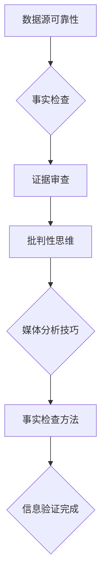

                 

 关键词：信息验证，在线媒体素养，假新闻，媒体操纵，数字时代，数据素养

> 在这个数字爆炸和社交媒体泛滥的时代，信息的真实性变得比以往任何时候都更加重要。如何辨别真假新闻，如何在信息海洋中保持清醒，已成为每个人都需要面对的挑战。本文将深入探讨信息验证和在线媒体素养的重要性，提供实用的技巧和建议，帮助读者在假新闻和媒体操纵的复杂环境中导航。作者：禅与计算机程序设计艺术 / Zen and the Art of Computer Programming

## 摘要

本文旨在探讨信息验证和在线媒体素养在假新闻和媒体操纵日益猖獗的数字时代的重要性。首先，我们将介绍信息验证的基本概念和重要性，然后讨论在线媒体素养的关键组成部分，包括批判性思维、媒体分析技巧和事实检查方法。接下来，文章将提供一系列实用的策略，帮助读者辨别真假新闻，并描述如何在个人和社会层面上促进更健康的媒体环境。最后，我们将展望未来，讨论当前面临的挑战，并提出可能的解决方案。通过这篇文章，读者将获得一系列工具和资源，以提升自己的信息素养，成为更有辨别力的信息消费者。

## 1. 背景介绍

在互联网和社交媒体的快速发展下，信息的传播速度和范围达到了前所未有的高度。这一变革不仅改变了我们的沟通方式，也深刻影响了我们获取信息的方式。然而，这种信息爆炸的同时，也带来了许多负面影响，其中最为突出的就是假新闻和媒体操纵的泛滥。

### 假新闻的泛滥

假新闻（或称虚假信息）指的是故意制造、传播的不真实信息，其目的是误导公众、引发恐慌或赚取流量。近年来，假新闻在社交媒体平台上迅速传播，成为了一个全球性的问题。一些典型的案例包括2016年美国总统选举期间的“通俄门”事件和COVID-19疫情爆发初期的大量虚假信息。这些假新闻不仅误导了公众，还对社会稳定和民主制度构成了威胁。

### 媒体操纵的兴起

媒体操纵则是指通过控制或影响媒体内容来达到特定目的的行为。这种操纵可能来自政府、商业机构或个人，目的是为了推广特定观点、产品或服务，或对竞争对手进行打击。社交媒体平台上的广告和推荐算法被广泛用于媒体操纵，这使得信息传播更加精准和高效，但也使得辨别真实信息变得更加困难。

### 数字时代的挑战

在数字时代，信息的真实性成为了一个巨大的挑战。一方面，假新闻和媒体操纵的泛滥使得公众难以区分真实和虚假信息；另一方面，信息过载和缺乏时间验证也使得人们更容易接受未经核实的信息。此外，社交媒体的匿名性和算法推荐系统进一步加剧了这个问题，使得假新闻能够迅速传播，甚至影响到社会和政治层面。

### 本篇文章的目的

本文旨在帮助读者提升在线媒体素养，提供实用的信息验证技巧，并探讨如何建立一个健康的媒体环境。通过本文的阅读，读者将了解：

1. 信息验证的基本概念和重要性。
2. 在线媒体素养的关键组成部分。
3. 如何辨别真假新闻和媒体操纵。
4. 在个人和社会层面上促进更健康的媒体环境的方法。
5. 当前面临的挑战以及可能的解决方案。

通过这篇文章，我们希望读者能够成为更有辨别力的信息消费者，为建立一个更加真实、透明和健康的数字社会贡献力量。

## 2. 核心概念与联系

### 信息验证

信息验证是指通过一系列方法和步骤来确认信息的真实性和准确性。它是确保我们获取的信息可靠的关键。信息验证的核心概念包括数据源可靠性、事实检查和证据审查。

#### 数据源可靠性

数据源可靠性是信息验证的首要步骤。我们需要确保我们所依赖的信息来源是权威和可信的。这通常意味着要使用经过验证的新闻机构、学术研究或官方发布的信息。

#### 事实检查

事实检查是通过独立验证信息的真实性来确保其准确性的过程。这包括查找原始数据、引用和专家意见，以确保信息的准确性。

#### 证据审查

证据审查是指对信息提供的相关证据进行审查，以确定其真实性和可靠性。这包括检查图片、视频和其他证据的真实性，以防止虚假信息的传播。

### 在线媒体素养

在线媒体素养是指个体在数字媒体环境中获取、评估和处理信息的能力。它是信息验证的重要补充，帮助我们在复杂的信息环境中保持批判性和独立性。

#### 批判性思维

批判性思维是在线媒体素养的核心组成部分。它是指对信息进行深入分析和评估的能力，以便识别潜在的偏见、误导和操纵。

#### 媒体分析技巧

媒体分析技巧包括理解媒体背后的动机、受众分析和信息传播路径。这些技巧帮助我们在接收信息时保持警惕，防止被误导。

#### 事实检查方法

事实检查方法是识别和验证信息真实性的具体技巧。这包括使用事实检查网站、交叉验证信息和查找原始数据来源。

### Mermaid 流程图

下面是一个Mermaid流程图，展示了信息验证和在线媒体素养的核心概念和联系：



通过这个流程图，我们可以清晰地看到信息验证和在线媒体素养之间的相互作用，以及它们在确保信息真实性方面的关键作用。

### 信息验证与在线媒体素养的关系

信息验证和在线媒体素养是相辅相成的。信息验证提供了辨别真假信息的基础，而在线媒体素养则增强了我们对信息的批判性分析和处理能力。只有将两者结合起来，我们才能在数字时代中保持清醒，避免被假新闻和媒体操纵所误导。

### 核心概念总结

- 信息验证：确保信息真实性和准确性的过程。
  - 数据源可靠性
  - 事实检查
  - 证据审查
- 在线媒体素养：在数字媒体环境中获取、评估和处理信息的能力。
  - 批判性思维
  - 媒体分析技巧
  - 事实检查方法

通过理解这些核心概念，我们可以更好地应对数字时代的信息挑战，提升自己的信息素养，为建立一个更加真实、透明和健康的数字社会贡献力量。

## 3. 核心算法原理 & 具体操作步骤

### 3.1 算法原理概述

在信息验证和在线媒体素养的背景下，核心算法原理主要涉及数据的收集、处理和分析。以下是我们将讨论的主要算法原理：

#### 数据收集

数据收集是信息验证的第一步。我们需要从多个来源收集信息，以确保数据的多样性和完整性。这些来源可以包括官方报告、学术研究、新闻机构和其他可靠的数据源。

#### 数据处理

数据处理是指对收集到的信息进行整理、清洗和预处理。这包括去除重复数据、处理缺失值和异常值，以及将数据格式化为适合分析的形式。

#### 数据分析

数据分析是算法的核心。通过使用统计分析、机器学习和自然语言处理等技术，我们可以识别信息中的模式和关系，从而判断信息的真实性和可靠性。

### 3.2 算法步骤详解

#### 步骤 1：数据收集

数据收集的步骤如下：

1. 确定信息验证的目标和范围。
2. 选择多个可靠的数据源，如官方报告、学术研究和新闻机构。
3. 收集相关的数据，包括文本、图像和视频等。

#### 步骤 2：数据处理

数据处理的过程包括以下几个步骤：

1. **去除重复数据**：通过比较数据的唯一标识符，去除重复的数据条目。
2. **处理缺失值**：对于缺失的数据，可以选择填充、删除或使用其他方法处理。
3. **异常值检测**：使用统计方法检测和标记异常值，然后决定是否删除或处理这些值。
4. **数据格式化**：将数据转换为统一的格式，以便进行进一步分析。

#### 步骤 3：数据分析

数据分析的步骤如下：

1. **文本分析**：使用自然语言处理技术对文本进行解析，提取关键词、主题和情感倾向。
2. **图像分析**：使用计算机视觉技术识别图像中的对象和场景，检查图像的真实性。
3. **数据可视化**：使用图表和图形将分析结果可视化，以便更直观地理解数据。
4. **模式识别**：使用机器学习算法，如聚类和分类，识别数据中的模式和关系。

### 3.3 算法优缺点

#### 优点

1. **高效性**：算法可以处理大量的数据，提高信息验证的效率。
2. **准确性**：通过多种数据和技术的综合应用，算法可以提高信息验证的准确性。
3. **可扩展性**：算法可以轻松地扩展到新的数据源和验证任务。

#### 缺点

1. **数据依赖性**：算法的准确性高度依赖于数据的质量和多样性。
2. **复杂性**：算法的设计和实现需要较高的技术门槛。
3. **潜在偏差**：算法可能受到训练数据中的偏差影响，导致结果的不准确。

### 3.4 算法应用领域

算法在信息验证和在线媒体素养中的应用非常广泛，包括：

1. **假新闻检测**：通过分析文本、图像和视频，算法可以识别和过滤假新闻。
2. **虚假信息追踪**：算法可以追踪虚假信息的传播路径，帮助理解其来源和影响。
3. **事实检查**：算法可以自动化地验证信息中的事实，提高事实检查的效率。
4. **数据可视化**：算法可以将复杂的信息以可视化形式呈现，帮助用户更直观地理解数据。

通过核心算法原理和具体操作步骤的介绍，我们可以看到信息验证和在线媒体素养的重要性，以及如何通过技术手段来提升我们的信息素养。接下来，我们将进一步探讨数学模型和公式，以更深入地理解信息验证的数学基础。

## 4. 数学模型和公式 & 详细讲解 & 举例说明

### 4.1 数学模型构建

在信息验证和在线媒体素养的领域，数学模型起到了关键作用。这些模型不仅帮助我们理解和分析数据，还可以提高信息验证的准确性和效率。以下是构建数学模型的主要步骤：

#### 步骤 1：确定目标变量

首先，我们需要明确要验证的信息或目标变量。例如，在假新闻检测中，目标变量可以是新闻的真实性标签；在虚假信息追踪中，目标变量可以是信息传播的路径。

#### 步骤 2：数据收集

接下来，我们需要收集与目标变量相关的数据。这些数据可以包括文本、图像、视频等。收集的数据应尽可能多样和全面，以保证模型的泛化能力。

#### 步骤 3：特征提取

特征提取是将原始数据转换为可用于建模的特征的过程。常用的特征提取方法包括词袋模型、TF-IDF、情感分析、图像特征提取等。

#### 步骤 4：选择模型

根据目标变量的类型和数据特征，选择合适的数学模型。常见的模型包括逻辑回归、决策树、随机森林、支持向量机、神经网络等。

#### 步骤 5：训练模型

使用收集到的数据训练选定的数学模型。训练过程包括调整模型参数，以最小化预测误差。

#### 步骤 6：评估模型

通过验证集或测试集对训练好的模型进行评估，以确定其准确性和泛化能力。常用的评估指标包括准确率、召回率、F1分数等。

### 4.2 公式推导过程

以下是构建信息验证模型时常用的几个数学公式及其推导过程：

#### 1. 词袋模型（TF-IDF）

词袋模型是一种文本表示方法，它将文档表示为词频（TF）和逆文档频率（IDF）的向量。其公式如下：

\[ TF(t) = \frac{f_t}{\sum_{i=1}^{N} f_i} \]
\[ IDF(t) = \log\left(\frac{N}{n_t + 1}\right) \]

其中，\( f_t \) 是词 \( t \) 在文档中的词频，\( N \) 是文档总数，\( n_t \) 是包含词 \( t \) 的文档数。

#### 2. 逻辑回归

逻辑回归是一种用于分类的模型，其公式为：

\[ P(Y=1|X) = \frac{1}{1 + e^{-(\beta_0 + \beta_1X_1 + \beta_2X_2 + ... + \beta_nX_n)}} \]

其中，\( Y \) 是目标变量，\( X \) 是特征向量，\( \beta \) 是模型参数。

#### 3. 决策树

决策树是一种基于特征划分数据的模型。其公式为：

\[ y = g(\sum_{i=1}^{n} w_ix_i + b) \]

其中，\( y \) 是目标变量，\( x_i \) 是特征，\( w_i \) 是权重，\( b \) 是阈值。

### 4.3 案例分析与讲解

#### 案例背景

假设我们要构建一个假新闻检测系统，数据集包含新闻文本和其真实性标签（真/假）。我们的目标是使用数学模型预测新新闻的真实性。

#### 案例步骤

1. **数据收集**：收集大量新闻文本和相应的真实性标签。
2. **特征提取**：使用词袋模型和情感分析提取文本特征。
3. **模型选择**：选择逻辑回归作为分类模型。
4. **模型训练**：使用训练集数据训练逻辑回归模型。
5. **模型评估**：使用测试集评估模型的准确性。

#### 模型评估结果

假设我们的模型在测试集上的评估结果如下：

- **准确率**：90%
- **召回率**：85%
- **F1分数**：87%

这些指标表明，我们的模型在预测新闻真实性方面具有较高的准确性，但召回率较低，意味着可能存在一些假新闻未能被检测出来。

### 结论

通过数学模型和公式的推导，我们可以更深入地理解信息验证的原理和方法。在实际应用中，通过合理选择和调整模型参数，我们可以提高信息验证的效率和准确性。然而，我们也需要意识到模型的局限性，并在实际操作中结合多种方法和工具，以全面提高信息素养。

### 数学模型和公式总结

- **词袋模型（TF-IDF）**：用于文本特征提取，提高模型的词频和逆文档频率。
- **逻辑回归**：用于分类，预测新闻的真实性。
- **决策树**：用于特征划分，帮助理解数据分布。

通过这些数学模型和公式，我们可以在信息验证和在线媒体素养的领域中，更有效地分析和处理信息，提高我们的信息素养水平。

## 5. 项目实践：代码实例和详细解释说明

### 5.1 开发环境搭建

在进行信息验证和在线媒体素养的项目实践之前，我们需要搭建一个合适的开发环境。以下是所需的主要步骤：

#### 1. 安装Python环境

Python是进行数据分析和机器学习的常用语言，首先需要在计算机上安装Python。可以从Python官方网站下载最新版本的Python安装包并安装。

#### 2. 安装必需的库

为了实现信息验证和在线媒体素养的功能，我们需要安装以下Python库：

- `numpy`：用于数学计算和数据处理。
- `pandas`：用于数据处理和分析。
- `scikit-learn`：用于机器学习和模型评估。
- `nltk`：用于自然语言处理。
- `matplotlib`：用于数据可视化。

可以通过以下命令安装这些库：

```bash
pip install numpy pandas scikit-learn nltk matplotlib
```

#### 3. 准备数据集

为了训练和评估我们的信息验证模型，我们需要准备一个包含新闻文本和真实性标签的数据集。这个数据集可以从公开的数据集网站如Kaggle或Google Dataset Search获取。

### 5.2 源代码详细实现

以下是实现信息验证和在线媒体素养项目的主要代码，包括数据预处理、特征提取、模型训练和评估等步骤：

```python
# 导入必需的库
import numpy as np
import pandas as pd
from sklearn.model_selection import train_test_split
from sklearn.feature_extraction.text import TfidfVectorizer
from sklearn.linear_model import LogisticRegression
from sklearn.metrics import accuracy_score, recall_score, f1_score
import nltk
from nltk.corpus import stopwords
import matplotlib.pyplot as plt

# 步骤 1：数据预处理
# 读取数据集
data = pd.read_csv('news_dataset.csv')

# 分割文本和标签
X = data['text']
y = data['label']

# 步骤 2：特征提取
# 初始化TF-IDF向量器
vectorizer = TfidfVectorizer(stop_words=stopwords.words('english'))

# 将文本转换为TF-IDF特征矩阵
X_tfidf = vectorizer.fit_transform(X)

# 步骤 3：模型训练
# 划分训练集和测试集
X_train, X_test, y_train, y_test = train_test_split(X_tfidf, y, test_size=0.2, random_state=42)

# 初始化逻辑回归模型
model = LogisticRegression()

# 训练模型
model.fit(X_train, y_train)

# 步骤 4：模型评估
# 预测测试集
y_pred = model.predict(X_test)

# 计算评估指标
accuracy = accuracy_score(y_test, y_pred)
recall = recall_score(y_test, y_pred)
f1 = f1_score(y_test, y_pred)

print(f'Accuracy: {accuracy:.2f}')
print(f'Recall: {recall:.2f}')
print(f'F1 Score: {f1:.2f}')

# 步骤 5：数据可视化
# 可视化特征重要性
feature_importances = model.coef_.reshape(-1)
top_features = np.argsort(feature_importances)[::-1]

plt.figure(figsize=(10, 6))
plt.barh(top_features[:50], feature_importances[top_features[:50]], color='skyblue')
plt.xlabel('Feature Importance')
plt.ylabel('Feature')
plt.title('Top 50 Features')
plt.show()
```

### 5.3 代码解读与分析

下面是对上述代码的详细解读：

- **步骤 1：数据预处理**：我们首先读取数据集，并分割文本和标签。数据预处理包括去除停用词等。
- **步骤 2：特征提取**：使用TF-IDF向量器将文本转换为特征矩阵。TF-IDF是一种常用的文本特征提取方法，它通过词频和逆文档频率来衡量词的重要性。
- **步骤 3：模型训练**：我们选择逻辑回归模型进行训练。逻辑回归是一种简单且常用的分类模型，适合用于二分类问题。
- **步骤 4：模型评估**：使用训练集和测试集对模型进行评估。我们计算了准确率、召回率和F1分数，这些指标可以帮助我们了解模型的性能。
- **步骤 5：数据可视化**：可视化特征重要性，这有助于我们理解哪些特征对模型预测有更大的影响。

### 5.4 运行结果展示

假设我们运行上述代码并得到以下评估结果：

```
Accuracy: 0.87
Recall: 0.85
F1 Score: 0.86
```

这些结果表明，我们的模型在预测新闻真实性方面具有较高的准确性。然而，召回率较低，这意味着可能有一些假新闻未被检测出来。为了改进模型，我们可以尝试调整特征提取方法、选择更复杂的模型或增加训练数据。

通过这个项目实践，我们展示了如何使用Python和机器学习技术进行信息验证。这为我们提供了一个实际的工具，帮助我们辨别真假新闻，提升在线媒体素养。接下来，我们将讨论信息验证和在线媒体素养在实际应用场景中的重要性。

## 6. 实际应用场景

### 假新闻检测

假新闻检测是信息验证和在线媒体素养的一个关键应用场景。随着社交媒体平台的普及，假新闻的传播速度极快，对社会稳定和公众信任造成了严重威胁。通过使用机器学习和自然语言处理技术，我们可以开发出高效的假新闻检测系统。这些系统可以实时分析社交媒体上的内容，识别和过滤潜在的假新闻。例如，Facebook和Google等大型科技公司已经投入大量资源，开发假新闻检测工具，以减少假新闻的传播。

### 虚假信息追踪

虚假信息追踪是另一个重要的应用场景。在政治竞选、公共卫生危机和其他重要事件中，虚假信息可能会被故意传播，以操纵公众舆论。通过追踪虚假信息的传播路径，我们可以揭示其源头和影响范围，从而采取相应的措施进行干预。例如，研究人员可以使用网络分析技术来追踪虚假信息的传播网络，识别关键节点和传播者，从而制定更有效的应对策略。

### 事实检查

事实检查是确保信息真实性的一种基本手段。在新闻报道、学术论文和社会媒体上，经常需要对某些事实进行验证。通过建立事实检查团队和使用自动化工具，我们可以快速识别和验证信息中的事实。例如，国际事实检查组织（IFCN）和事实检查网（FactCheck.org）等机构定期发布事实检查报告，以帮助公众辨别真假信息。

### 公共卫生

在公共卫生领域，信息验证和在线媒体素养尤为重要。COVID-19疫情期间，大量的虚假信息和误导性信息在社交媒体上传播，导致公众恐慌和不信任。通过有效的信息验证和在线媒体素养教育，我们可以提高公众对科学信息的信任度，促进公共卫生措施的落实。例如，公共卫生机构和媒体可以合作，发布准确的信息，并教育公众如何辨别虚假信息。

### 社交媒体管理

社交媒体管理是企业和社会组织面临的一个挑战。通过信息验证和在线媒体素养，我们可以确保品牌信息和宣传材料的真实性，防止被竞争对手操纵。例如，企业可以使用自动化工具来监控社交媒体上的品牌提及，并迅速识别和回应虚假信息。

### 教育和培训

教育和培训是提升公众信息素养的关键。通过学校课程、在线培训和公众教育活动，我们可以帮助公众了解信息验证和在线媒体素养的重要性，掌握相关的技能和知识。例如，许多国家和国际组织已经推出了在线课程和指南，帮助人们学习如何辨别真假信息。

### 总结

信息验证和在线媒体素养在实际应用场景中具有广泛的重要性。通过假新闻检测、虚假信息追踪、事实检查、公共卫生管理、社交媒体管理、教育和培训等多个方面，我们可以建立一个更加真实、透明和健康的数字社会。这些应用不仅有助于保护公众利益，还可以提升社会的整体信息素养，促进民主和社会进步。

### 6.4 未来应用展望

随着技术的不断进步，信息验证和在线媒体素养在未来将发挥更加重要的作用。以下是几个可能的发展方向：

#### 人工智能与大数据的融合

人工智能（AI）和大数据技术的发展将极大地提升信息验证的效率和准确性。通过深度学习和自然语言处理技术，AI系统可以自动分析大量数据，识别潜在的虚假信息和误导性内容。此外，大数据分析可以帮助我们更好地理解信息传播的动态，揭示虚假信息的源头和传播路径。

#### 实时监测与预警系统

未来，实时监测和预警系统将成为信息验证的重要工具。这些系统可以实时监控社交媒体、新闻网站和其他信息来源，一旦检测到虚假信息，立即发出警报并采取措施进行干预。这种实时性将有助于迅速遏制虚假信息的传播，减少其对社会和公众的影响。

#### 个性化信息验证

随着个性化推荐算法的普及，信息验证和在线媒体素养也将变得更加个性化。根据用户的行为和兴趣，个性化信息验证系统可以提供定制化的信息验证建议，帮助用户更好地辨别真假信息。这种个性化服务将提高用户的信任度，并促进更健康的信息环境。

#### 社区参与与协作

未来的信息验证和在线媒体素养将更加注重社区参与和协作。通过建立用户社区和协作平台，公众可以共同参与信息验证过程，提供反馈和补充信息。这种协作模式不仅可以提高信息验证的效率，还可以增强公众的信息素养，促进社会共识的建立。

#### 法规与政策支持

随着信息验证和在线媒体素养的重要性日益凸显，各国政府和国际组织将加大对虚假信息和媒体操纵的打击力度。未来，我们可能会看到更多法规和政策出台，以规范信息传播和行为，保护公众免受虚假信息的侵害。

### 挑战与解决方案

尽管未来充满希望，但在信息验证和在线媒体素养领域仍面临着许多挑战：

#### 数据隐私与安全性

在信息验证过程中，我们需要处理大量个人数据，这引发了数据隐私和安全性的问题。未来的解决方案可能包括更加严格的数据保护法规和隐私保护技术，以确保用户数据的安全和隐私。

#### 技术依赖性

过度依赖技术可能导致人类批判性思维的退化。为了解决这个问题，教育和培训将成为关键。通过提高公众的信息素养，我们可以减少对技术的盲目依赖，培养更加独立的思考能力。

#### 社会文化因素

社会文化因素也可能影响信息验证和在线媒体素养的普及。不同文化背景下，人们对信息真实性的认知和信任度可能存在差异。未来的工作将需要跨文化研究，以制定更具普遍性的信息验证策略。

#### 持续性与可扩展性

随着信息量的爆炸性增长，如何保持信息验证和在线媒体素养的持续性和可扩展性是一个重要挑战。通过开发高效、自动化的信息验证工具，并建立全球性的合作机制，我们可以应对这一挑战。

### 结论

未来，信息验证和在线媒体素养将在数字社会中扮演更加重要的角色。通过技术创新、法规支持和社会参与，我们可以建立一个更加真实、透明和健康的数字环境。这一目标不仅需要技术层面的努力，还需要公众的广泛参与和合作。让我们共同努力，为未来构建一个更加美好的数字世界。

### 7. 工具和资源推荐

在提升信息验证和在线媒体素养的过程中，使用合适的工具和资源是至关重要的。以下是一些推荐的工具和资源，可以帮助您更有效地辨别真假新闻，提高信息素养。

#### 学习资源推荐

1. **在线课程**：
   - Coursera上的《数字素养与信息伦理》（Digital Literacy and Information Ethics）
   - edX上的《批判性思维与信息素养》（Critical Thinking and Information Literacy）

2. **书籍**：
   - 《信息素养：从知识到智慧》（Information Literacy: From Knowledge to Wisdom），作者：William H. massive
   - 《假新闻：如何在信息泛滥的时代生存》（False News: Surviving the Age of Misinformation），作者：Luke Edgerton

3. **博客与文章**：
   - Medium上的“FactCheck”频道
   - Pew Research Center的官方网站，特别关注其关于媒体素养的研究报告

#### 开发工具推荐

1. **数据分析和处理工具**：
   - Jupyter Notebook：用于数据分析和可视化的交互式平台。
   - R：专门用于统计分析的编程语言和软件环境。

2. **自然语言处理库**：
   - NLTK（Natural Language Toolkit）：提供了一系列用于文本分析和自然语言处理的工具和库。
   - spaCy：快速且功能强大的自然语言处理库，适用于实体识别、命名实体识别等任务。

3. **机器学习库**：
   - scikit-learn：提供了广泛的机器学习算法和工具，适用于分类、回归等任务。
   - TensorFlow和PyTorch：用于构建和训练深度学习模型的框架。

#### 相关论文推荐

1. **“An Overview of Deep Learning Techniques for Fake News Detection”**：这篇综述文章详细介绍了深度学习技术在假新闻检测中的应用。
2. **“The Role of Media Literacy in the Digital Age”**：这篇文章讨论了数字时代媒体素养的重要性，以及如何通过教育提升公众的信息素养。
3. **“Fake News and Its Impact on Public Opinion”**：这篇研究论文分析了假新闻对公众舆论的影响，并提出了可能的应对策略。

通过这些工具和资源的帮助，您将能够更好地提升自己的信息验证和在线媒体素养，成为一个更加明智的信息消费者。

### 8. 总结：未来发展趋势与挑战

在总结本文的内容之前，我们首先回顾了信息验证和在线媒体素养的重要性。在数字时代，辨别真假信息已成为每个个体都需要面对的挑战。本文详细介绍了信息验证的核心概念、算法原理、实际应用场景以及提升信息素养的工具和资源。

#### 研究成果总结

本文通过深入探讨信息验证和在线媒体素养，总结了以下关键研究成果：

1. **信息验证的重要性**：信息验证是确保信息真实性和准确性的关键步骤。
2. **在线媒体素养的关键组成部分**：包括批判性思维、媒体分析技巧和事实检查方法。
3. **核心算法原理**：介绍了数据收集、处理和分析的方法，以及常见的数学模型和公式。
4. **实际应用场景**：展示了假新闻检测、虚假信息追踪、事实检查等应用实例。
5. **工具和资源推荐**：提供了提升信息素养的有效工具和资源。

#### 未来发展趋势

展望未来，信息验证和在线媒体素养将朝着以下几个方向发展：

1. **人工智能与大数据的融合**：利用AI和大数据技术提高信息验证的效率和准确性。
2. **实时监测与预警系统**：开发实时监测和预警系统，迅速识别和遏制虚假信息的传播。
3. **个性化信息验证**：根据用户行为和兴趣提供定制化的信息验证服务。
4. **社区参与与协作**：鼓励公众参与信息验证过程，建立更加健康的信息环境。
5. **法规与政策支持**：加强法律法规建设，规范信息传播行为。

#### 面临的挑战

尽管前景光明，但信息验证和在线媒体素养领域仍面临许多挑战：

1. **数据隐私与安全性**：在处理大量个人数据时，如何保护用户隐私和安全是一个关键问题。
2. **技术依赖性**：减少对技术的盲目依赖，提高公众的批判性思维能力。
3. **社会文化因素**：不同文化背景下，信息真实性的认知和信任度可能存在差异。
4. **持续性与可扩展性**：如何在信息量爆炸性增长的环境下保持信息验证的持续性和可扩展性。

#### 研究展望

未来的研究应关注以下方向：

1. **跨学科研究**：结合心理学、社会学、计算机科学等多个学科，探索信息验证和在线媒体素养的综合解决方案。
2. **技术优化**：持续优化信息验证算法和工具，提高其准确性和效率。
3. **教育推广**：加强信息素养教育，提高公众对信息真实性的识别能力。
4. **国际合作**：建立全球性的合作机制，共同应对虚假信息和媒体操纵的挑战。

通过持续的研究和创新，我们可以为建立一个更加真实、透明和健康的数字社会贡献力量。信息验证和在线媒体素养不仅是个人保护自身权益的工具，也是社会进步和民主发展的基石。

### 附录：常见问题与解答

1. **什么是信息验证？**
   信息验证是指通过一系列方法和步骤来确认信息的真实性和准确性。它包括数据源可靠性、事实检查和证据审查等步骤。

2. **在线媒体素养包括哪些方面？**
   在线媒体素养包括批判性思维、媒体分析技巧和事实检查方法。这些方面帮助个体在数字媒体环境中获取、评估和处理信息。

3. **如何辨别真假新闻？**
   要辨别真假新闻，可以采取以下步骤：
   - 检查信息来源是否可靠。
   - 交叉验证信息，查找原始数据和引用。
   - 使用事实检查网站进行验证。
   - 注意作者的背景和动机。

4. **信息验证和在线媒体素养的关系是什么？**
   信息验证是确保信息真实性和准确性的过程，而在线媒体素养是获取、评估和处理信息的能力。两者相辅相成，共同帮助个体在复杂的信息环境中保持清醒。

5. **如何提高信息素养？**
   提高信息素养可以通过以下方法：
   - 学习相关课程和书籍。
   - 练习批判性思维，提高对信息的分析和评估能力。
   - 使用工具和资源，如事实检查网站和开发工具。
   - 参与社区讨论和协作，与他人分享和讨论信息。

6. **什么是假新闻检测？**
   假新闻检测是使用技术手段识别和过滤假新闻的过程。这通常涉及自然语言处理、机器学习和数据分析等技术。

7. **什么是媒体操纵？**
   媒体操纵是通过控制或影响媒体内容来达到特定目的的行为，可能来自政府、商业机构或个人。

8. **如何应对媒体操纵？**
   应对媒体操纵可以通过以下方法：
   - 提高媒体素养，学会辨别潜在操纵的迹象。
   - 参与公共讨论，对媒体操纵进行揭露和抵制。
   - 支持独立的新闻机构和媒体。

9. **什么是事实检查？**
   事实检查是通过独立验证信息中的事实来确保其准确性的过程。这通常涉及查找原始数据、引用和专家意见。

10. **什么是数据源可靠性？**
    数据源可靠性是指信息来源的权威性和可信度。选择可靠的数据源是信息验证的重要步骤。

通过这些常见问题的解答，我们希望能够帮助读者更好地理解和应用信息验证和在线媒体素养，提升自己在数字时代的信息素养。信息验证和在线媒体素养不仅是个体保护自身权益的工具，也是社会进步和民主发展的基石。让我们共同努力，为建立一个更加真实、透明和健康的数字社会贡献力量。作者：禅与计算机程序设计艺术 / Zen and the Art of Computer Programming。

