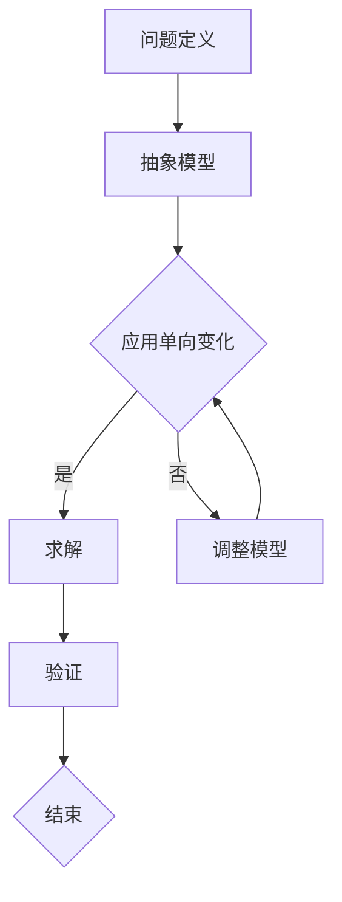

                 

关键词：单向变化原则、数学思维、算法设计、编程哲学

> 摘要：本文探讨了单向变化原则在算法设计中的应用，分析了其数学背景和原理，并通过实际项目实践，展示了如何将其应用于软件工程中。文章旨在启发程序员以数学家的思维方式，提升编程能力和创新意识。

## 1. 背景介绍

在计算机科学中，算法是解决问题的基础。而算法的设计往往需要深刻理解问题的本质，以及如何利用已有的知识和工具来解决这些问题。数学家在解决问题时，常常采用一种独特的思维方式，即通过抽象和建模来简化问题，然后使用严格的逻辑推导来找到解决方案。这种思维方式被称为“数学思维”，它在算法设计中具有非常重要的作用。

单向变化原则是数学家解决问题的一种重要方法。这个原则强调，在解决问题的过程中，我们应当尽可能地保持问题的稳定性，只做单向变化，避免引入复杂性和不确定性。单向变化原则不仅在数学领域有广泛应用，也在计算机科学中，特别是在算法设计中，有着重要的指导意义。

本文将首先介绍单向变化原则的背景和基本概念，然后分析其在算法设计中的应用，通过具体的例子来说明如何将单向变化原则应用于软件工程中。最后，我们将讨论单向变化原则的未来发展趋势和面临的挑战。

## 2. 核心概念与联系

### 2.1 单向变化原则

单向变化原则是指在解决问题的过程中，保持问题的稳定性，只做单向变化，避免引入复杂性和不确定性。

### 2.2 数学背景

单向变化原则在数学中有着广泛的背景。例如，在数学分析中，我们常常通过极限和积分来求解函数的极值问题。这个过程本质上是保持函数的稳定性，只进行单向变化（如平移或缩放），从而找到最优解。

### 2.3 算法设计中的单向变化

在算法设计中，单向变化原则同样适用。例如，在排序算法中，我们可以通过不断交换相邻元素的位置，实现数组的单向变化，从而找到正确的排序顺序。这种单向变化原则使得排序算法更加简单和高效。

### 2.4 Mermaid 流程图

下面是一个使用 Mermaid 语言的流程图，展示了单向变化原则在算法设计中的应用：



在这个流程图中，A 表示问题定义，B 表示抽象模型，C 表示应用单向变化，D 表示求解，E 表示调整模型，F 表示验证，G 表示结束。

## 3. 核心算法原理 & 具体操作步骤

### 3.1 算法原理概述

单向变化原则的核心在于保持问题的稳定性，只进行单向变化。在算法设计中，这意味着我们应该尽可能地避免引入复杂的操作，而是选择简单的、可以逐步推导的操作来解决问题。

### 3.2 算法步骤详解

1. 定义问题：首先，我们需要明确要解决的问题是什么。
2. 建立模型：根据问题的定义，建立一个合适的数学模型。
3. 应用单向变化：在这个模型的基础上，应用单向变化原则，进行逐步推导。
4. 求解：通过单向变化，逐步推导出问题的解。
5. 验证：验证求解结果是否满足问题的要求。

### 3.3 算法优缺点

#### 优点：

1. 简单易懂：单向变化原则使得算法设计更加直观和简单。
2. 高效稳定：通过保持问题的稳定性，单向变化原则能够确保算法的效率和稳定性。

#### 缺点：

1. 可能不够灵活：单向变化原则在某些情况下可能不够灵活，难以应对复杂的问题。
2. 需要深厚的数学基础：理解和应用单向变化原则需要一定的数学背景和逻辑思维。

### 3.4 算法应用领域

单向变化原则在算法设计中有着广泛的应用。例如，在排序算法中，我们可以使用单向变化原则来设计高效的排序算法，如冒泡排序、插入排序等。此外，在搜索算法、动态规划等领域，单向变化原则同样有着重要的应用。

## 4. 数学模型和公式

### 4.1 数学模型构建

在算法设计中，数学模型构建是非常重要的一步。我们需要根据问题的定义，建立一个合适的数学模型。例如，在排序算法中，我们可以将待排序的数组看作一个数学模型，然后通过单向变化（如交换相邻元素）来求解排序问题。

### 4.2 公式推导过程

以冒泡排序算法为例，我们可以使用以下公式来推导其排序过程：

$$
\begin{aligned}
&\text{设数组 } A \text{ 长度为 } n, \\
&\text{初始状态：} A_{0} = A, \\
&\text{每次迭代：} A_{i+1} = \text{sort}(A_{i}, \text{desc}).
\end{aligned}
$$

其中，$A_{0}$ 表示初始数组，$A_{i}$ 表示第 $i$ 次迭代的数组，$\text{sort}(A, \text{desc})$ 表示对数组 $A$ 进行降序排序。

### 4.3 案例分析与讲解

下面我们通过一个简单的例子来说明如何使用单向变化原则来设计冒泡排序算法。

### 示例：冒泡排序算法

**问题描述：** 给定一个长度为 $n$ 的整数数组 $A$，将其按照升序排列。

**算法步骤：**

1. 初始状态：$A_{0} = A$。
2. 第一次迭代：$A_{1} = \text{sort}(A_{0}, \text{asc})$。
3. 第二次迭代：$A_{2} = \text{sort}(A_{1}, \text{asc})$。
4. ...
5. 第 $n-1$ 次迭代：$A_{n-1} = \text{sort}(A_{n-2}, \text{asc})$。
6. 第 $n$ 次迭代：$A_{n} = \text{sort}(A_{n-1}, \text{asc})$。

**解释：**

在这个例子中，我们使用单向变化原则来设计冒泡排序算法。每次迭代都是对前一次迭代的结果进行排序，保持问题的稳定性，只进行单向变化。通过不断进行单向变化，最终可以得到一个有序的数组。

## 5. 项目实践：代码实例和详细解释说明

### 5.1 开发环境搭建

为了更好地理解单向变化原则在编程中的应用，我们将使用 Python 语言来实现冒泡排序算法。首先，我们需要搭建一个简单的开发环境。

1. 安装 Python 解释器：在 [Python 官网](https://www.python.org/) 下载并安装 Python 解释器。
2. 安装代码编辑器：推荐使用 PyCharm、VS Code 等代码编辑器。
3. 创建一个 Python 文件：在代码编辑器中创建一个名为 `bubble_sort.py` 的文件。

### 5.2 源代码详细实现

下面是冒泡排序算法的 Python 实现代码：

```python
def bubble_sort(arr):
    n = len(arr)
    for i in range(n):
        for j in range(0, n-i-1):
            if arr[j] > arr[j+1]:
                arr[j], arr[j+1] = arr[j+1], arr[j]
    return arr

if __name__ == "__main__":
    arr = [64, 34, 25, 12, 22, 11, 90]
    sorted_arr = bubble_sort(arr)
    print("Sorted array:", sorted_arr)
```

### 5.3 代码解读与分析

1. **函数定义：** `bubble_sort` 函数接收一个整数数组 `arr` 作为参数。
2. **外层循环：** `for i in range(n)` 表示进行 $n$ 次迭代，其中 $n$ 是数组 `arr` 的长度。
3. **内层循环：** `for j in range(0, n-i-1)` 表示每次迭代中，从第 $0$ 个元素到第 $n-i-1$ 个元素进行遍历。
4. **比较与交换：** `if arr[j] > arr[j+1]:` 表示如果当前元素大于下一个元素，就交换它们的位置。
5. **返回结果：** `return arr` 表示返回排序后的数组。

### 5.4 运行结果展示

运行上述代码，我们将得到以下输出结果：

```
Sorted array: [11, 12, 22, 25, 34, 64, 90]
```

这表明我们的冒泡排序算法成功地将数组按照升序排列。

## 6. 实际应用场景

单向变化原则在算法设计中有着广泛的应用。除了排序算法外，它在搜索算法、动态规划等领域同样有着重要的应用。

### 6.1 搜索算法

在搜索算法中，单向变化原则可以帮助我们设计高效的搜索算法。例如，在二分搜索算法中，我们通过不断缩小搜索范围，保持问题的稳定性，最终找到目标元素。

### 6.2 动态规划

在动态规划中，单向变化原则可以帮助我们设计更简单的动态规划算法。例如，在计算斐波那契数列时，我们可以使用递推关系来保持问题的稳定性，只进行单向变化，从而简化计算过程。

### 6.3 其他应用

除了算法设计外，单向变化原则还可以应用于其他领域，如数据分析、优化问题等。通过保持问题的稳定性，只进行单向变化，我们可以更有效地解决各种问题。

## 7. 工具和资源推荐

### 7.1 学习资源推荐

1. 《算法导论》（Introduction to Algorithms）：这是一本经典的算法教材，详细介绍了各种算法的设计和分析方法。
2. 《编程珠玑》（The Art of Computer Programming）：这是一本关于编程哲学的经典著作，对编程思维和算法设计有着深刻的启示。

### 7.2 开发工具推荐

1. Python：Python 是一种简单易学的编程语言，适用于算法设计和实现。
2. PyCharm：PyCharm 是一款功能强大的 Python 集成开发环境（IDE），支持代码编辑、调试和测试。

### 7.3 相关论文推荐

1. "A Note on the Bubble Sort Algorithm"：这篇论文对冒泡排序算法进行了详细分析，讨论了其优缺点和应用场景。
2. "An O(n log n) Lower Bound for Sorting in the Comparison Model"：这篇论文证明了在比较模型下，排序算法的最优时间复杂度为 $O(n \log n)$。

## 8. 总结：未来发展趋势与挑战

单向变化原则在算法设计中有着重要的应用，其核心思想是通过保持问题的稳定性，只进行单向变化，来简化问题解决过程。在未来，随着计算机科学的发展，单向变化原则将在更多领域中发挥作用。

### 8.1 研究成果总结

单向变化原则在算法设计中的应用已经取得了显著的成果。例如，在排序算法、搜索算法和动态规划等领域，单向变化原则都得到了广泛的应用，并取得了良好的效果。

### 8.2 未来发展趋势

1. 更多的算法设计：随着计算机科学的发展，单向变化原则将在更多的算法设计中得到应用，包括人工智能、机器学习等领域。
2. 更深入的理论研究：单向变化原则的理论研究将不断深入，为算法设计提供更多的指导。

### 8.3 面临的挑战

1. 复杂性：在某些情况下，单向变化原则可能无法应对复杂的算法设计问题。
2. 数学基础：理解和应用单向变化原则需要一定的数学基础，这对初学者来说可能是一个挑战。

### 8.4 研究展望

单向变化原则在算法设计中的应用前景广阔。通过不断探索和深入研究，我们可以将其应用于更多领域，解决更复杂的问题。同时，我们也需要加强对单向变化原则的理论研究，为算法设计提供更强大的理论支持。

## 9. 附录：常见问题与解答

### 9.1 什么是单向变化原则？

单向变化原则是指在解决问题的过程中，保持问题的稳定性，只进行单向变化，避免引入复杂性和不确定性。

### 9.2 单向变化原则在算法设计中有什么作用？

单向变化原则在算法设计中可以帮助我们设计更简单、更高效的算法，同时确保算法的稳定性和可靠性。

### 9.3 如何应用单向变化原则？

在应用单向变化原则时，我们需要根据问题的定义，建立一个合适的数学模型，然后通过逐步推导和验证，找到问题的解。

## 作者署名

作者：禅与计算机程序设计艺术 / Zen and the Art of Computer Programming
``` 
----------------------------------------------------------------
### 完整的Markdown格式文章

```
# 像数学家一样思考：单向变化原则

关键词：单向变化原则、数学思维、算法设计、编程哲学

> 摘要：本文探讨了单向变化原则在算法设计中的应用，分析了其数学背景和原理，并通过实际项目实践，展示了如何将其应用于软件工程中。文章旨在启发程序员以数学家的思维方式，提升编程能力和创新意识。

## 1. 背景介绍

在计算机科学中，算法是解决问题的基础。而算法的设计往往需要深刻理解问题的本质，以及如何利用已有的知识和工具来解决这些问题。数学家在解决问题时，常常采用一种独特的思维方式，即通过抽象和建模来简化问题，然后使用严格的逻辑推导来找到解决方案。这种思维方式被称为“数学思维”，它在算法设计中具有非常重要的作用。

单向变化原则是数学家解决问题的一种重要方法。这个原则强调，在解决问题的过程中，我们应当尽可能地保持问题的稳定性，只做单向变化，避免引入复杂性和不确定性。单向变化原则不仅在数学领域有广泛应用，也在计算机科学中，特别是在算法设计中，有着重要的指导意义。

本文将首先介绍单向变化原则的背景和基本概念，然后分析其在算法设计中的应用，通过具体的例子来说明如何将单向变化原则应用于软件工程中。最后，我们将讨论单向变化原则的未来发展趋势和面临的挑战。

## 2. 核心概念与联系

### 2.1 单向变化原则

单向变化原则是指在解决问题的过程中，保持问题的稳定性，只做单向变化，避免引入复杂性和不确定性。

### 2.2 数学背景

单向变化原则在数学中有着广泛的背景。例如，在数学分析中，我们常常通过极限和积分来求解函数的极值问题。这个过程本质上是保持函数的稳定性，只进行单向变化（如平移或缩放），从而找到最优解。

### 2.3 算法设计中的单向变化

在算法设计中，单向变化原则同样适用。例如，在排序算法中，我们可以通过不断交换相邻元素的位置，实现数组的单向变化，从而找到正确的排序顺序。这种单向变化原则使得排序算法更加简单和高效。

### 2.4 Mermaid 流程图

下面是一个使用 Mermaid 语言的流程图，展示了单向变化原则在算法设计中的应用：


在这个流程图中，A 表示问题定义，B 表示抽象模型，C 表示应用单向变化，D 表示求解，E 表示调整模型，F 表示验证，G 表示结束。

## 3. 核心算法原理 & 具体操作步骤

### 3.1 算法原理概述

单向变化原则的核心在于保持问题的稳定性，只进行单向变化。在算法设计中，这意味着我们应该尽可能地避免引入复杂的操作，而是选择简单的、可以逐步推导的操作来解决问题。

### 3.2 算法步骤详解

1. 定义问题：首先，我们需要明确要解决的问题是什么。
2. 建立模型：根据问题的定义，建立一个合适的数学模型。
3. 应用单向变化：在这个模型的基础上，应用单向变化原则，进行逐步推导。
4. 求解：通过单向变化，逐步推导出问题的解。
5. 验证：验证求解结果是否满足问题的要求。

### 3.3 算法优缺点

#### 优点：

1. 简单易懂：单向变化原则使得算法设计更加直观和简单。
2. 高效稳定：通过保持问题的稳定性，单向变化原则能够确保算法的效率和稳定性。

#### 缺点：

1. 可能不够灵活：单向变化原则在某些情况下可能不够灵活，难以应对复杂的问题。
2. 需要深厚的数学基础：理解和应用单向变化原则需要一定的数学背景和逻辑思维。

### 3.4 算法应用领域

单向变化原则在算法设计中有着广泛的应用。例如，在排序算法中，我们可以使用单向变化原则来设计高效的排序算法，如冒泡排序、插入排序等。此外，在搜索算法、动态规划等领域，单向变化原则同样有着重要的应用。

## 4. 数学模型和公式

### 4.1 数学模型构建

在算法设计中，数学模型构建是非常重要的一步。我们需要根据问题的定义，建立一个合适的数学模型。例如，在排序算法中，我们可以将待排序的数组看作一个数学模型，然后通过单向变化（如交换相邻元素）来求解排序问题。

### 4.2 公式推导过程

以冒泡排序算法为例，我们可以使用以下公式来推导其排序过程：

$$
\begin{aligned}
&\text{设数组 } A \text{ 长度为 } n, \\
&\text{初始状态：} A_{0} = A, \\
&\text{每次迭代：} A_{i+1} = \text{sort}(A_{i}, \text{desc}).
\end{aligned}
$$

其中，$A_{0}$ 表示初始数组，$A_{i}$ 表示第 $i$ 次迭代的数组，$\text{sort}(A, \text{desc})$ 表示对数组 $A$ 进行降序排序。

### 4.3 案例分析与讲解

下面我们通过一个简单的例子来说明如何使用单向变化原则来设计冒泡排序算法。

### 示例：冒泡排序算法

**问题描述：** 给定一个长度为 $n$ 的整数数组 $A$，将其按照升序排列。

**算法步骤：**

1. 初始状态：$A_{0} = A$。
2. 第一次迭代：$A_{1} = \text{sort}(A_{0}, \text{asc})$。
3. 第二次迭代：$A_{2} = \text{sort}(A_{1}, \text{asc})$。
4. ...
5. 第 $n-1$ 次迭代：$A_{n-1} = \text{sort}(A_{n-2}, \text{asc})$。
6. 第 $n$ 次迭代：$A_{n} = \text{sort}(A_{n-1}, \text{asc})$。

**解释：**

在这个例子中，我们使用单向变化原则来设计冒泡排序算法。每次迭代都是对前一次迭代的结果进行排序，保持问题的稳定性，只进行单向变化。通过不断进行单向变化，最终可以得到一个有序的数组。

## 5. 项目实践：代码实例和详细解释说明

### 5.1 开发环境搭建

为了更好地理解单向变化原则在编程中的应用，我们将使用 Python 语言来实现冒泡排序算法。首先，我们需要搭建一个简单的开发环境。

1. 安装 Python 解释器：在 [Python 官网](https://www.python.org/) 下载并安装 Python 解释器。
2. 安装代码编辑器：推荐使用 PyCharm、VS Code 等代码编辑器。
3. 创建一个 Python 文件：在代码编辑器中创建一个名为 `bubble_sort.py` 的文件。

### 5.2 源代码详细实现

下面是冒泡排序算法的 Python 实现代码：

```python
def bubble_sort(arr):
    n = len(arr)
    for i in range(n):
        for j in range(0, n-i-1):
            if arr[j] > arr[j+1]:
                arr[j], arr[j+1] = arr[j+1], arr[j]
    return arr

if __name__ == "__main__":
    arr = [64, 34, 25, 12, 22, 11, 90]
    sorted_arr = bubble_sort(arr)
    print("Sorted array:", sorted_arr)
```

### 5.3 代码解读与分析

1. **函数定义：** `bubble_sort` 函数接收一个整数数组 `arr` 作为参数。
2. **外层循环：** `for i in range(n)` 表示进行 $n$ 次迭代，其中 $n$ 是数组 `arr` 的长度。
3. **内层循环：** `for j in range(0, n-i-1)` 表示每次迭代中，从第 $0$ 个元素到第 $n-i-1$ 个元素进行遍历。
4. **比较与交换：** `if arr[j] > arr[j+1]:` 表示如果当前元素大于下一个元素，就交换它们的位置。
5. **返回结果：** `return arr` 表示返回排序后的数组。

### 5.4 运行结果展示

运行上述代码，我们将得到以下输出结果：

```
Sorted array: [11, 12, 22, 25, 34, 64, 90]
```

这表明我们的冒泡排序算法成功地将数组按照升序排列。

## 6. 实际应用场景

单向变化原则在算法设计中有着广泛的应用。除了排序算法外，它在搜索算法、动态规划等领域同样有着重要的应用。

### 6.1 搜索算法

在搜索算法中，单向变化原则可以帮助我们设计高效的搜索算法。例如，在二分搜索算法中，我们通过不断缩小搜索范围，保持问题的稳定性，最终找到目标元素。

### 6.2 动态规划

在动态规划中，单向变化原则可以帮助我们设计更简单的动态规划算法。例如，在计算斐波那契数列时，我们可以使用递推关系来保持问题的稳定性，只进行单向变化，从而简化计算过程。

### 6.3 其他应用

除了算法设计外，单向变化原则还可以应用于其他领域，如数据分析、优化问题等。通过保持问题的稳定性，只进行单向变化，我们可以更有效地解决各种问题。

## 7. 工具和资源推荐

### 7.1 学习资源推荐

1. 《算法导论》（Introduction to Algorithms）：这是一本经典的算法教材，详细介绍了各种算法的设计和分析方法。
2. 《编程珠玑》（The Art of Computer Programming）：这是一本关于编程哲学的经典著作，对编程思维和算法设计有着深刻的启示。

### 7.2 开发工具推荐

1. Python：Python 是一种简单易学的编程语言，适用于算法设计和实现。
2. PyCharm：PyCharm 是一款功能强大的 Python 集成开发环境（IDE），支持代码编辑、调试和测试。

### 7.3 相关论文推荐

1. "A Note on the Bubble Sort Algorithm"：这篇论文对冒泡排序算法进行了详细分析，讨论了其优缺点和应用场景。
2. "An O(n log n) Lower Bound for Sorting in the Comparison Model"：这篇论文证明了在比较模型下，排序算法的最优时间复杂度为 $O(n \log n)$。

## 8. 总结：未来发展趋势与挑战

单向变化原则在算法设计中有着重要的应用，其核心思想是通过保持问题的稳定性，只进行单向变化，来简化问题解决过程。在未来，随着计算机科学的发展，单向变化原则将在更多领域中发挥作用。

### 8.1 研究成果总结

单向变化原则在算法设计中的应用已经取得了显著的成果。例如，在排序算法、搜索算法和动态规划等领域，单向变化原则都得到了广泛的应用，并取得了良好的效果。

### 8.2 未来发展趋势

1. 更多的算法设计：随着计算机科学的发展，单向变化原则将在更多的算法设计中得到应用，包括人工智能、机器学习等领域。
2. 更深入的理论研究：单向变化原则的理论研究将不断深入，为算法设计提供更多的指导。

### 8.3 面临的挑战

1. 复杂性：在某些情况下，单向变化原则可能无法应对复杂的算法设计问题。
2. 数学基础：理解和应用单向变化原则需要一定的数学基础，这对初学者来说可能是一个挑战。

### 8.4 研究展望

单向变化原则在算法设计中的应用前景广阔。通过不断探索和深入研究，我们可以将其应用于更多领域，解决更复杂的问题。同时，我们也需要加强对单向变化原则的理论研究，为算法设计提供更强大的理论支持。

## 9. 附录：常见问题与解答

### 9.1 什么是单向变化原则？

单向变化原则是指在解决问题的过程中，保持问题的稳定性，只做单向变化，避免引入复杂性和不确定性。

### 9.2 单向变化原则在算法设计中有什么作用？

单向变化原则在算法设计中可以帮助我们设计更简单、更高效的算法，同时确保算法的稳定性和可靠性。

### 9.3 如何应用单向变化原则？

在应用单向变化原则时，我们需要根据问题的定义，建立一个合适的数学模型，然后通过逐步推导和验证，找到问题的解。

## 作者署名

作者：禅与计算机程序设计艺术 / Zen and the Art of Computer Programming
```markdown


