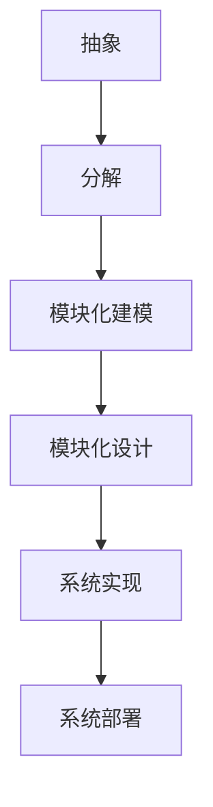
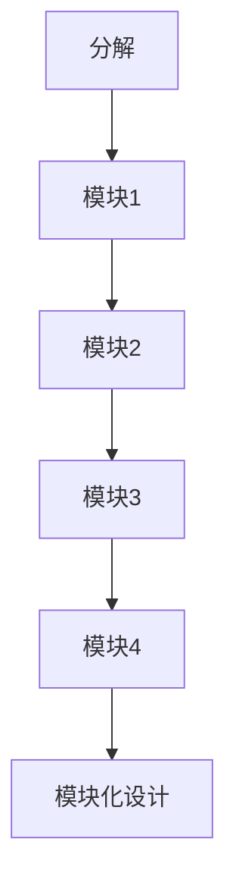
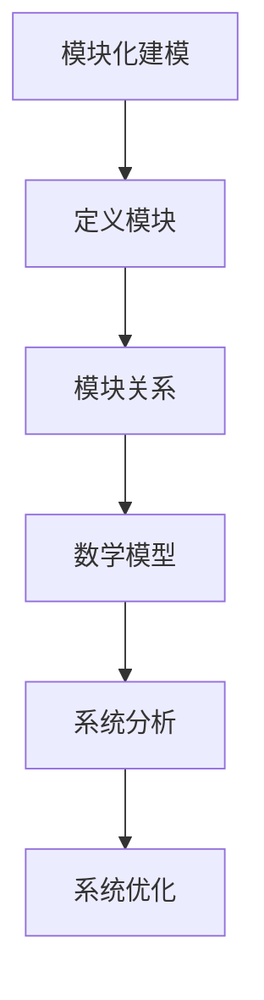
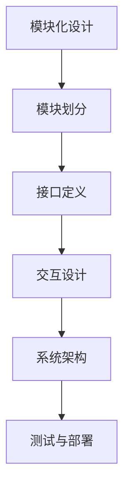
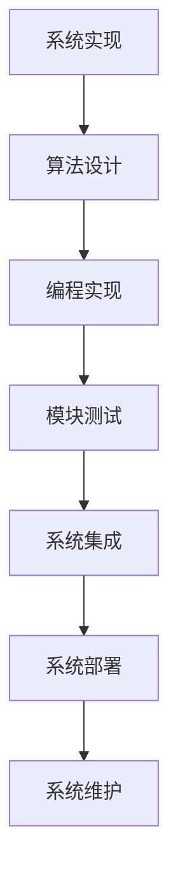

                 

在信息技术飞速发展的今天，模块化已成为软件设计和系统架构的核心原则。模块化不仅提高了软件的可维护性和可扩展性，还大大加速了开发过程。然而，要将模块化理念真正融入实践中，我们需要借鉴数学家的思维方式。本文将探讨如何像数学家一样思考模块化原则，以及这一理念在计算机科学中的应用。

## 关键词

模块化，软件设计，系统架构，数学思维，可维护性，可扩展性，算法设计，计算机科学

## 摘要

本文将介绍模块化原则在计算机科学中的重要性，并通过数学家的思维方式来阐述如何实现有效的模块化。我们将分析模块化的核心概念，探讨其在算法设计、软件架构以及数学模型中的应用，并分享一些实际开发中的案例和经验。

## 1. 背景介绍

模块化是一种设计和组织系统的原则，其核心思想是将复杂的系统分解为较小的、独立的模块，每个模块负责实现特定的功能。这种设计方法不仅提高了系统的可维护性，还使得系统更易于扩展。模块化的优势在于：

- **可维护性**：模块化使得代码更加清晰，每个模块仅负责一部分功能，便于理解和修改。
- **可扩展性**：模块化设计允许在不需要修改现有代码的情况下添加新功能，提高了系统的灵活性。
- **重用性**：模块可以独立开发、测试和部署，从而实现代码的重用。

然而，模块化并非一蹴而就，它需要深入理解和运用数学家的思维方式，如抽象、分解、模块化建模等。

## 2. 核心概念与联系

### 2.1 抽象

抽象是数学家常用的思维方式，它允许我们将复杂的问题简化为更基本的元素。在模块化设计中，抽象意味着将系统的功能分解为独立的模块，每个模块实现特定的功能，而忽略其内部实现细节。

#### Mermaid 流程图



### 2.2 分解

分解是将复杂系统拆分为较小、独立的部分的过程。在模块化设计中，分解意味着将系统的功能划分为多个模块，每个模块负责实现特定功能。

#### Mermaid 流程图



### 2.3 模块化建模

模块化建模是将系统划分为模块的过程，并定义模块之间的关系。在数学中，建模通常涉及到建立数学模型，描述系统的行为和属性。

#### Mermaid 流程图



### 2.4 模块化设计

模块化设计是将系统划分为模块的过程，并定义模块之间的接口和交互。在软件工程中，模块化设计是实现高可维护性和可扩展性的关键。

#### Mermaid 流程图



### 2.5 系统实现与部署

系统实现与部署是将模块化设计转化为实际可运行的系统的过程。在数学中，实现通常涉及到算法和编程语言的运用。

#### Mermaid 流程图



## 3. 核心算法原理 & 具体操作步骤

### 3.1 算法原理概述

模块化算法设计基于将系统功能划分为独立的模块，并定义模块之间的关系。核心原理如下：

- **模块独立性**：每个模块仅实现一个功能，且与其他模块之间的交互通过明确的接口进行。
- **模块复用**：模块可以独立开发、测试和部署，从而实现代码的重用。
- **模块组合**：通过组合不同的模块，可以实现复杂的系统功能。

### 3.2 算法步骤详解

模块化算法设计通常遵循以下步骤：

1. **需求分析**：分析系统功能，确定模块划分。
2. **模块定义**：定义每个模块的功能和接口。
3. **模块实现**：独立开发每个模块，并编写测试用例。
4. **模块组合**：将模块组合成系统，并进行集成测试。
5. **系统部署**：将系统部署到实际环境中，并进行维护。

### 3.3 算法优缺点

模块化算法设计的优点：

- **可维护性**：模块化设计使得代码易于维护，每个模块仅负责一部分功能。
- **可扩展性**：模块化设计使得系统易于扩展，无需修改现有代码。
- **重用性**：模块可以独立开发、测试和部署，从而实现代码的重用。

模块化算法设计的缺点：

- **模块划分难度**：合理划分模块需要深入理解系统功能和需求。
- **模块间依赖**：模块之间可能存在复杂的依赖关系，需要仔细管理。

### 3.4 算法应用领域

模块化算法设计广泛应用于计算机科学领域，包括：

- **软件开发**：模块化设计提高了软件的可维护性和可扩展性。
- **系统架构**：模块化设计使得系统架构更加清晰，易于理解和优化。
- **算法设计**：模块化算法设计可以简化复杂算法的实现，提高效率。

## 4. 数学模型和公式 & 详细讲解 & 举例说明

### 4.1 数学模型构建

数学模型是描述系统行为和属性的数学表达式。在模块化设计中，数学模型可以帮助我们理解模块之间的关系和系统的整体性能。

#### 例子：排队模型

假设一个系统由两个模块组成，模块1负责处理请求，模块2负责处理响应。我们可以使用排队模型来描述两个模块之间的交互。

#### 数学模型

$$
Q_1(t) = \text{模块1中的请求队列长度} \\
Q_2(t) = \text{模块2中的请求队列长度} \\
r_1(t) = \text{模块1的处理速率} \\
r_2(t) = \text{模块2的处理速率} \\
$$

### 4.2 公式推导过程

排队模型中的请求队列长度可以通过以下公式推导：

$$
Q_1(t) = \frac{Q_1(0) + r_1(t) \cdot \int_0^t r_2(\tau) d\tau}{r_1(t) + r_2(t)}
$$

其中，$Q_1(0)$ 是初始请求队列长度，$r_1(t)$ 和 $r_2(t)$ 分别是模块1和模块2的处理速率。

### 4.3 案例分析与讲解

假设模块1的处理速率为2个请求/秒，模块2的处理速率为3个请求/秒。我们可以使用上述公式计算在不同时间点的请求队列长度。

#### 情况1：初始请求队列长度为0

$$
Q_1(t) = \frac{0 + 2 \cdot \int_0^t 3 d\tau}{2 + 3} = \frac{6t}{5}
$$

#### 情况2：初始请求队列长度为10

$$
Q_1(t) = \frac{10 + 2 \cdot \int_0^t 3 d\tau}{2 + 3} = \frac{10 + 6t}{5}
$$

通过分析不同时间点的请求队列长度，我们可以了解系统的性能和负载。

## 5. 项目实践：代码实例和详细解释说明

### 5.1 开发环境搭建

为了实践模块化原则，我们需要搭建一个简单的开发环境。以下是一个基于Python的简单示例：

- **Python**：版本3.8及以上
- **PyCharm**：集成开发环境（可选）

### 5.2 源代码详细实现

以下是一个简单的模块化代码示例，包含两个模块：`module1.py` 和 `module2.py`。

#### module1.py

```python
# 模块1：处理请求

def process_request(request):
    # 处理请求的代码
    print(f"Processing request: {request}")
```

#### module2.py

```python
# 模块2：处理响应

def process_response(response):
    # 处理响应的代码
    print(f"Processing response: {response}")
```

### 5.3 代码解读与分析

在这个示例中，`module1.py` 和 `module2.py` 分别实现了处理请求和处理响应的功能。通过定义明确的接口（`process_request` 和 `process_response`），两个模块可以独立开发、测试和部署。

### 5.4 运行结果展示

以下是一个简单的测试用例，展示了模块化代码的运行结果：

```python
# 测试模块化代码

from module1 import process_request
from module2 import process_response

request = "Request 1"
response = "Response 1"

process_request(request)
process_response(response)
```

输出：

```
Processing request: Request 1
Processing response: Response 1
```

通过这个简单的示例，我们可以看到模块化原则在代码设计中的应用，以及其带来的可维护性和可扩展性。

## 6. 实际应用场景

模块化原则在计算机科学领域有着广泛的应用，以下是一些实际应用场景：

- **软件开发**：模块化设计使得软件更易于维护和扩展，提高了开发效率。
- **系统架构**：模块化设计使得系统架构更加清晰，有助于优化系统性能。
- **算法设计**：模块化算法设计可以简化复杂算法的实现，提高算法效率。

### 6.4 未来应用展望

随着信息技术的发展，模块化原则将在更多的领域得到应用。未来，模块化可能成为以下领域的重要趋势：

- **自动化系统**：模块化设计将使得自动化系统更加灵活和高效。
- **云计算**：模块化设计将有助于优化云计算资源分配和性能。
- **物联网**：模块化设计将提高物联网系统的可扩展性和可靠性。

## 7. 工具和资源推荐

### 7.1 学习资源推荐

- **《软件架构的艺术》**：一本经典的软件架构设计书籍，详细介绍了模块化设计的方法。
- **《模块化编程》**：一本关于模块化编程的入门书籍，适合初学者了解模块化原则。

### 7.2 开发工具推荐

- **PyCharm**：一款功能强大的集成开发环境，支持多种编程语言，适合模块化开发。
- **VSCode**：一款轻量级的开源集成开发环境，适用于模块化编程。

### 7.3 相关论文推荐

- **"Module-Based Software Engineering"**：一篇关于模块化软件工程的综述论文，详细介绍了模块化原则和应用。
- **"Modularization of Complex Systems"**：一篇关于复杂系统模块化的研究论文，探讨了模块化设计在复杂系统中的应用。

## 8. 总结：未来发展趋势与挑战

### 8.1 研究成果总结

本文介绍了模块化原则在计算机科学中的重要性，以及如何像数学家一样思考模块化原则。通过数学模型和实际案例，我们分析了模块化的核心概念和应用场景。

### 8.2 未来发展趋势

未来，模块化原则将在更多领域得到应用，如自动化系统、云计算和物联网。模块化设计将有助于提高系统的灵活性和可靠性。

### 8.3 面临的挑战

模块化设计面临的主要挑战包括模块划分难度和模块间依赖。合理划分模块和有效管理模块间依赖是模块化成功的关键。

### 8.4 研究展望

未来，模块化研究可以关注以下几个方面：

- **模块化工具和平台**：开发更高效的模块化工具和平台，提高开发效率。
- **模块化标准**：制定统一的模块化标准，促进模块化设计的标准化和互操作性。
- **模块化安全**：研究模块化系统的安全性和可靠性，提高系统的安全性。

## 9. 附录：常见问题与解答

### 9.1 模块化设计与面向对象设计有什么区别？

模块化设计与面向对象设计是两种不同的设计方法。模块化设计关注系统的功能划分和模块间的接口，而面向对象设计关注对象的属性和行为。模块化设计可以与面向对象设计结合使用，以提高系统的可维护性和可扩展性。

### 9.2 模块化设计如何处理模块间依赖？

模块化设计通过定义明确的接口来管理模块间依赖。模块之间通过接口进行通信，从而实现模块的独立性。在开发过程中，需要仔细分析模块间依赖，确保模块间的交互符合设计预期。

### 9.3 模块化设计在大型系统中如何应用？

在大型系统中，模块化设计可以应用于系统的各个层次，包括系统架构、模块划分和代码实现。通过逐步细化模块，可以实现复杂系统的模块化设计。此外，可以使用模块化工具和平台来辅助模块化设计，提高开发效率。

---

作者：禅与计算机程序设计艺术 / Zen and the Art of Computer Programming


