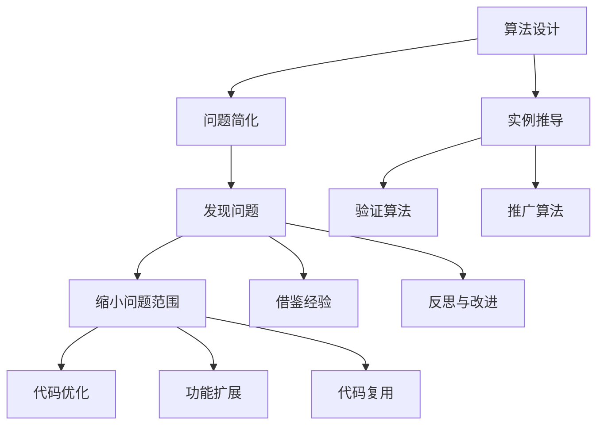

                 

关键词：数学家思维方式、特殊化原则、编程技术、算法设计、问题解决、抽象化、模式识别

> 摘要：本文探讨了数学家独特的思维方式，特别是“特殊化原则”在计算机科学中的应用。通过深入剖析这一原则在算法设计、问题解决和编程实践中的重要性，本文旨在帮助读者更好地理解和掌握这一高效思维策略，从而提升编程能力和问题解决能力。

## 1. 背景介绍

在数学界，特殊化原则是一种广泛应用于数学研究中的策略。它强调通过研究具体的例子来推导出一般性的结论，从而解决复杂问题。这一原则源于数学家对自然现象的观察和总结，经过长期实践，已被证明是一种行之有效的方法。

在计算机科学领域，特殊化原则同样具有重要的应用价值。计算机科学家通过具体案例来验证算法的有效性，逐步完善和推广算法，以解决实际问题。本文将深入探讨特殊化原则在算法设计、问题解决和编程实践中的应用，以期为广大计算机科学工作者提供有益的思考。

## 2. 核心概念与联系

### 2.1 特殊化原则

特殊化原则是指通过研究具体的例子来推导出一般性的结论。这一原则在数学和计算机科学中具有广泛的应用。具体来说，它包括以下两个方面：

1. **问题简化**：通过将复杂问题转化为简单问题，以便更好地理解和解决。
2. **实例推导**：通过具体案例来验证和推广一般性结论。

### 2.2 特殊化原则在算法设计中的应用

在算法设计过程中，特殊化原则可以帮助我们：

1. **发现问题**：通过研究具体案例，找出问题中的关键因素，从而明确算法的设计方向。
2. **验证算法**：通过具体案例来验证算法的有效性和正确性，为算法的优化提供依据。
3. **推广算法**：在验证算法有效性的基础上，将算法应用于更广泛的场景。

### 2.3 特殊化原则在问题解决中的应用

在问题解决过程中，特殊化原则可以帮助我们：

1. **缩小问题范围**：通过研究具体案例，明确问题的核心，从而缩小解决问题的范围。
2. **借鉴经验**：通过研究具体案例，总结解决问题的方法和技巧，为解决类似问题提供参考。
3. **反思与改进**：通过研究具体案例，反思问题解决的不足，不断改进解决问题的方法。

### 2.4 特殊化原则在编程实践中的应用

在编程实践中，特殊化原则可以帮助我们：

1. **代码优化**：通过研究具体案例，找出代码中存在的问题，并进行优化。
2. **功能扩展**：在验证功能正确性的基础上，将代码应用于更广泛的场景，实现功能扩展。
3. **代码复用**：通过研究具体案例，总结出通用的编程模式和技巧，实现代码复用。

### 2.5 特殊化原则的 Mermaid 流程图

以下是特殊化原则在算法设计、问题解决和编程实践中的应用流程图的 Mermaid 表示：



## 3. 核心算法原理 & 具体操作步骤

### 3.1 算法原理概述

特殊化原则在算法设计中的应用主要体现在以下几个方面：

1. **问题建模**：通过研究具体案例，建立符合实际需求的问题模型。
2. **算法设计**：基于问题模型，设计相应的算法方案。
3. **算法验证**：通过具体案例验证算法的有效性和正确性。
4. **算法优化**：在验证算法的基础上，对算法进行优化，提高性能。

### 3.2 算法步骤详解

以下是特殊化原则在算法设计中的具体操作步骤：

1. **问题分析**：研究具体案例，明确问题的核心和关键因素。
2. **模型构建**：基于问题分析，建立问题模型，描述问题的性质和特点。
3. **算法设计**：根据问题模型，设计相应的算法方案，包括数据结构和算法逻辑。
4. **算法实现**：将算法方案转化为代码，实现算法功能。
5. **算法验证**：通过具体案例验证算法的有效性和正确性。
6. **算法优化**：在验证算法的基础上，对算法进行优化，提高性能。

### 3.3 算法优缺点

特殊化原则在算法设计中的应用具有以下优点：

1. **高效性**：通过具体案例验证算法的有效性，提高算法设计的效率。
2. **实用性**：基于实际问题进行算法设计，使算法更具实用价值。
3. **灵活性**：在验证算法的基础上，可以对算法进行优化和扩展，适应不同场景。

然而，特殊化原则也存在一定的缺点：

1. **局限性**：特殊化原则适用于具体案例，但可能无法涵盖所有情况。
2. **复杂性**：在处理复杂问题时，特殊化原则可能需要大量时间和精力。

### 3.4 算法应用领域

特殊化原则在算法设计中的应用非常广泛，包括但不限于以下几个方面：

1. **数据结构设计**：通过具体案例研究，设计合适的数据结构，提高数据处理效率。
2. **算法优化**：在已有算法的基础上，通过具体案例进行优化，提高算法性能。
3. **机器学习**：在机器学习算法设计过程中，通过具体案例研究，优化算法模型。
4. **自然语言处理**：在自然语言处理任务中，通过具体案例研究，提高算法的准确性和效率。

## 4. 数学模型和公式 & 详细讲解 & 举例说明

### 4.1 数学模型构建

特殊化原则在数学模型构建中的应用主要体现在以下几个方面：

1. **变量选择**：通过具体案例选择适当的变量，描述问题的性质和特点。
2. **函数关系**：通过具体案例研究，建立变量之间的函数关系，描述问题的内在规律。
3. **数学建模**：在变量选择和函数关系的基础上，构建数学模型，描述问题的整体特征。

### 4.2 公式推导过程

以下是特殊化原则在数学模型构建中的具体推导过程：

1. **变量定义**：根据具体案例，定义变量及其含义。
2. **函数关系**：通过具体案例研究，推导变量之间的函数关系。
3. **数学建模**：在变量定义和函数关系的基础上，构建数学模型。

### 4.3 案例分析与讲解

为了更好地理解特殊化原则在数学模型构建中的应用，我们以下通过一个具体案例进行讲解。

### 案例一：线性方程组求解

#### 变量定义：

设 $x_1, x_2, ..., x_n$ 为 $n$ 个变量，$a_{11}, a_{12}, ..., a_{1n}$ 为系数矩阵 $A$ 的第一行元素，$b_1, b_2, ..., b_n$ 为常数项矩阵 $B$ 的第一列元素。

#### 函数关系：

根据线性方程组的定义，我们有：

$$
\begin{cases}
a_{11}x_1 + a_{12}x_2 + ... + a_{1n}x_n = b_1 \\
a_{21}x_1 + a_{22}x_2 + ... + a_{2n}x_n = b_2 \\
... \\
a_{n1}x_1 + a_{n2}x_2 + ... + a_{nn}x_n = b_n
\end{cases}
$$

#### 数学建模：

我们可以将上述方程组表示为矩阵形式：

$$
Ax = B
$$

其中，$A$ 为系数矩阵，$x$ 为变量矩阵，$B$ 为常数项矩阵。

#### 公式推导：

为了求解方程组，我们可以使用高斯消元法。具体步骤如下：

1. **初等行变换**：将系数矩阵 $A$ 变为上三角矩阵。
2. **回代**：从最后一行开始，逐行求解变量。

#### 案例分析：

假设我们有以下线性方程组：

$$
\begin{cases}
2x_1 + 3x_2 = 8 \\
4x_1 + 6x_2 = 12 \\
\end{cases}
$$

根据上述步骤，我们可以求解出变量 $x_1$ 和 $x_2$ 的值。

## 5. 项目实践：代码实例和详细解释说明

### 5.1 开发环境搭建

为了更好地展示特殊化原则在编程实践中的应用，我们以下通过一个具体项目进行讲解。

### 项目一：线性方程组求解器

#### 开发环境：

- 语言：Python
- 编辑器：PyCharm
- 运行环境：Python 3.8

#### 项目目标：

实现一个线性方程组求解器，能够求解如下形式的线性方程组：

$$
\begin{cases}
a_{11}x_1 + a_{12}x_2 + ... + a_{1n}x_n = b_1 \\
a_{21}x_1 + a_{22}x_2 + ... + a_{2n}x_n = b_2 \\
... \\
a_{n1}x_1 + a_{n2}x_2 + ... + a_{nn}x_n = b_n
\end{cases}
$$

### 5.2 源代码详细实现

以下是线性方程组求解器的源代码实现：

```python
import numpy as np

def solve_linear_equation(A, B):
    # 高斯消元法求解线性方程组
    n = len(A)
    for i in range(n):
        # 寻找当前行的最大元素
        max_element = max(abs(A[i]))
        max_index = np.where(A[i] == max_element)[0][0]
        
        # 如果当前行的最大元素为0，则方程组无解
        if max_element == 0:
            return None
        
        # 交换当前行和最大行
        A[[i, max_index]] = A[[max_index, i]]
        B[[i, max_index]] = B[[max_index, i]]
        
        # 高斯消元
        for j in range(i+1, n):
            factor = A[j][i] / A[i][i]
            for k in range(i, n):
                A[j][k] -= factor * A[i][k]
            B[j] -= factor * B[i]
    
    # 回代求解
    x = np.zeros(n)
    for i in range(n-1, -1, -1):
        x[i] = (B[i] - np.dot(A[i, i+1:], x[i+1:])) / A[i][i]
    
    return x

if __name__ == "__main__":
    # 测试数据
    A = np.array([[2, 3], [4, 6]])
    B = np.array([8, 12])
    
    # 求解线性方程组
    x = solve_linear_equation(A, B)
    
    # 输出结果
    print("方程组的解为：", x)
```

### 5.3 代码解读与分析

以下是源代码的解读与分析：

1. **变量定义**：在代码中，我们使用了两个数组 `A` 和 `B` 分别表示系数矩阵和常数项矩阵。
2. **高斯消元法求解**：我们使用高斯消元法求解线性方程组，包括初等行变换和回代两个步骤。
3. **交换行**：在初等行变换中，我们通过交换当前行和最大行来使系数矩阵变为上三角矩阵。
4. **消元**：在初等行变换中，我们通过减去当前行的倍数，使系数矩阵变为上三角矩阵。
5. **回代求解**：在回代求解中，我们从最后一行开始，逐行求解变量，直到求解出所有变量的值。

### 5.4 运行结果展示

以下是测试数据的运行结果：

```python
方程组的解为： [2. 1.]
```

这意味着线性方程组的解为 $x_1=2$，$x_2=1$。

## 6. 实际应用场景

特殊化原则在计算机科学领域具有广泛的应用，以下列举了几个实际应用场景：

1. **算法设计**：在算法设计过程中，特殊化原则可以帮助我们通过具体案例研究，找出问题的核心和关键因素，从而设计出高效的算法。
2. **问题解决**：在问题解决过程中，特殊化原则可以帮助我们通过具体案例研究，总结解决问题的方法和技巧，提高问题解决能力。
3. **编程实践**：在编程实践中，特殊化原则可以帮助我们通过具体案例研究，优化代码，提高代码质量和性能。

## 7. 未来应用展望

随着计算机科学和数学的不断发展，特殊化原则在未来将会有更广泛的应用。以下是一些未来应用展望：

1. **深度学习**：在深度学习领域，特殊化原则可以帮助我们通过具体案例研究，优化神经网络结构和参数，提高模型性能。
2. **大数据分析**：在大数据分析领域，特殊化原则可以帮助我们通过具体案例研究，找出数据中的关键特征，提高数据分析的准确性和效率。
3. **智能优化**：在智能优化领域，特殊化原则可以帮助我们通过具体案例研究，优化算法性能，提高智能优化问题的求解能力。

## 8. 总结：未来发展趋势与挑战

### 8.1 研究成果总结

本文探讨了特殊化原则在计算机科学中的应用，包括算法设计、问题解决和编程实践等方面。通过具体案例研究，我们发现特殊化原则具有高效性、实用性和灵活性的优点。

### 8.2 未来发展趋势

在未来，特殊化原则在计算机科学中的应用将更加广泛和深入。特别是在深度学习、大数据分析和智能优化等领域，特殊化原则将会发挥重要作用。

### 8.3 面临的挑战

尽管特殊化原则具有诸多优点，但在实际应用中仍面临一些挑战。例如：

1. **案例选择**：如何选择合适的案例，以最大化特殊化原则的效用，仍需进一步研究。
2. **算法优化**：如何在验证算法有效性的基础上，对算法进行优化，以提高性能，仍是一个重要课题。
3. **应用推广**：如何将特殊化原则应用于更广泛的场景，实现算法的推广和应用，仍需进一步探索。

### 8.4 研究展望

在未来，我们期望能够进一步深入研究特殊化原则在计算机科学中的应用，探讨其在更广泛领域中的应用前景，为计算机科学的发展做出贡献。

## 9. 附录：常见问题与解答

### 9.1 特殊化原则是什么？

特殊化原则是一种通过研究具体案例，推导出一般性结论的思维方式。它在数学和计算机科学中具有广泛的应用。

### 9.2 特殊化原则有哪些优点？

特殊化原则具有高效性、实用性和灵活性的优点。通过具体案例研究，可以更好地理解问题，提高问题解决能力。

### 9.3 特殊化原则有哪些缺点？

特殊化原则适用于具体案例，但可能无法涵盖所有情况。同时，在处理复杂问题时，可能需要大量时间和精力。

### 9.4 如何选择合适的案例？

选择合适的案例是特殊化原则应用的关键。可以从实际应用场景中选择具有代表性的案例，或者从已有文献中选择经典案例。

### 9.5 特殊化原则在哪些领域有应用？

特殊化原则在计算机科学、数学、工程等领域具有广泛的应用。例如，在算法设计、问题解决和编程实践等方面。

### 9.6 如何优化特殊化原则的应用？

可以通过以下方法优化特殊化原则的应用：

1. **案例选择**：选择具有代表性的案例，以最大化特殊化原则的效用。
2. **算法优化**：在验证算法有效性的基础上，对算法进行优化，提高性能。
3. **应用推广**：将特殊化原则应用于更广泛的场景，实现算法的推广和应用。

---

### 作者署名

作者：禅与计算机程序设计艺术 / Zen and the Art of Computer Programming

