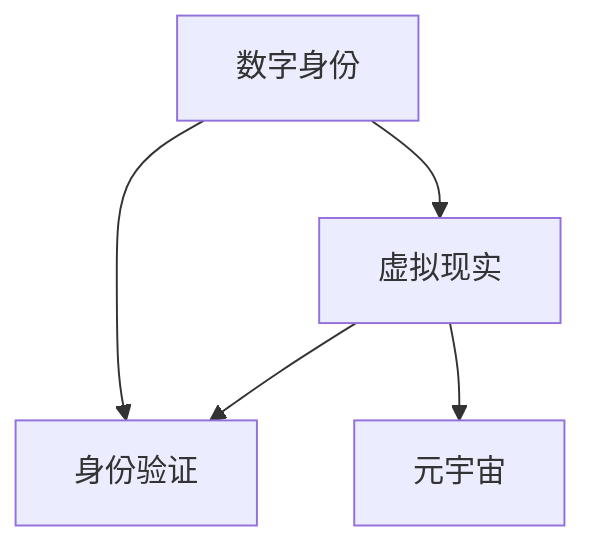

                 

关键词：元宇宙、身份流动、数字身份、虚拟现实、身份验证、隐私保护

摘要：本文将探讨元宇宙中的身份流动现象，分析其与传统现实世界身份标签的差异，以及如何打破这些标签以实现更自由的数字身份体验。通过对核心概念、算法原理、数学模型、项目实践和未来应用的详细阐述，本文旨在为读者提供对元宇宙身份流动的深入理解和展望。

## 1. 背景介绍

随着虚拟现实（VR）、增强现实（AR）和区块链等技术的迅速发展，元宇宙（Metaverse）的概念逐渐从科幻领域走向现实。元宇宙被视为一个由无数虚拟世界构成的生态系统，用户可以在其中自由互动、创造和体验。然而，在这个虚拟的宇宙中，如何处理和流动身份成为了一个关键问题。

传统的现实世界身份通常由一系列固定的标签组成，如姓名、性别、职业、国籍等。这些标签不仅定义了我们在现实世界中的社会角色，还限制了我们的隐私和自由。在元宇宙中，身份流动的实现意味着用户可以摆脱这些固定的标签，自由地切换身份，体验不同的角色和场景。

本文旨在探讨元宇宙中的身份流动现象，分析其与传统现实世界身份标签的差异，以及如何打破这些标签以实现更自由的数字身份体验。通过对核心概念、算法原理、数学模型、项目实践和未来应用的详细阐述，本文将为读者提供对元宇宙身份流动的深入理解和展望。

## 2. 核心概念与联系

在探讨元宇宙中的身份流动之前，我们需要理解几个关键概念：数字身份、虚拟现实和身份验证。

### 2.1 数字身份

数字身份是指用户在数字世界中的身份表示。与传统的现实世界身份不同，数字身份可以是完全匿名的，也可以是具有特定标签的。数字身份的灵活性使得用户可以在元宇宙中自由切换身份，而无需透露真实个人信息。

### 2.2 虚拟现实

虚拟现实（VR）是一种通过计算机模拟创建的虚拟环境，用户可以在其中进行沉浸式的交互。在元宇宙中，虚拟现实技术为用户提供了丰富的场景和角色，使他们能够体验到前所未有的自由和真实感。

### 2.3 身份验证

身份验证是一种用于确认用户身份的过程。在元宇宙中，身份验证不仅用于确保用户身份的准确性，还用于保护用户的隐私和安全。

下面是一个Mermaid流程图，展示了这些核心概念之间的联系：



## 3. 核心算法原理 & 具体操作步骤

### 3.1 算法原理概述

在元宇宙中，身份流动的实现依赖于一套复杂的算法和协议。这些算法和协议确保用户可以在不同的虚拟世界中无缝切换身份，同时保护用户的隐私和安全。

核心算法原理包括：

- **身份匿名化**：通过加密技术和分布式账本，将用户身份匿名化，使其在元宇宙中无法被追踪。
- **身份验证**：使用多因素身份验证技术，确保用户身份的准确性。
- **身份切换**：通过加密密钥和身份凭证，实现用户在不同虚拟世界中的身份切换。

### 3.2 算法步骤详解

以下是实现身份流动的具体步骤：

1. **用户注册**：用户在进入元宇宙时，需要进行身份注册。注册过程中，用户需要提供一些基本个人信息，但这些信息将经过加密处理，确保隐私安全。

2. **身份匿名化**：在用户注册后，系统将生成一组加密密钥，用于保护用户身份。这些密钥将存储在分布式账本中，确保无法被篡改。

3. **身份验证**：用户在进入不同虚拟世界时，需要通过身份验证。身份验证过程包括密码验证、指纹验证和面部识别等。

4. **身份切换**：用户可以在不同虚拟世界之间自由切换身份。每次切换时，系统会生成一组新的加密密钥，用于保护新身份。

5. **隐私保护**：在身份流动过程中，用户的隐私信息将被严格保护。任何未经授权的访问都将被拒绝。

### 3.3 算法优缺点

**优点**：

- **隐私保护**：身份流动算法确保用户隐私得到充分保护，用户可以在元宇宙中自由切换身份，无需担心个人信息泄露。
- **自由度高**：用户可以在元宇宙中体验不同的角色和场景，不受现实世界身份标签的限制。
- **安全性高**：身份流动算法采用加密技术和分布式账本，确保用户身份安全。

**缺点**：

- **技术复杂度高**：身份流动算法涉及多种技术，实现难度较高。
- **法律和伦理挑战**：身份流动可能引发法律和伦理问题，如虚拟犯罪、虚拟欺诈等。

### 3.4 算法应用领域

身份流动算法可以应用于多个领域，包括：

- **虚拟现实游戏**：用户可以在游戏中自由切换身份，体验不同的游戏角色。
- **虚拟社交平台**：用户可以在虚拟社交平台上建立多个身份，拓展社交圈子。
- **虚拟办公**：用户可以在虚拟办公室中自由切换身份，提高工作效率。

## 4. 数学模型和公式 & 详细讲解 & 举例说明

### 4.1 数学模型构建

在元宇宙中，身份流动的数学模型基于密码学和分布式系统理论。以下是构建数学模型的基本公式：

$$
ID = K \cdot P
$$

其中，$ID$表示用户身份，$K$表示加密密钥，$P$表示用户个人信息的加密形式。

### 4.2 公式推导过程

身份流动的数学模型基于以下步骤推导：

1. **用户注册**：用户生成一组随机密钥对（$K$，$K^{-1}$），并将公钥$K$存储在分布式账本中。

2. **身份验证**：用户在进入虚拟世界时，提供私钥$K^{-1}$，系统验证用户身份。

3. **身份切换**：用户在切换身份时，生成新的随机密钥对（$K'$，$K'^{-1}$），并将新公钥$K'$替换原有公钥$K$。

4. **隐私保护**：用户个人信息$P$经过加密处理，确保无法被未经授权的实体解密。

### 4.3 案例分析与讲解

假设用户Alice在元宇宙中注册了一个虚拟身份。她生成了一组随机密钥对（$K_A$，$K_A^{-1}$），并将公钥$K_A$存储在分布式账本中。当Alice进入一个虚拟世界时，系统向她发送一个验证请求。Alice使用私钥$K_A^{-1}$加密验证请求，并发送加密后的响应。系统验证加密响应，确认Alice的身份。

当Alice切换身份时，她生成了一组新的随机密钥对（$K'_A$，$K'_A^{-1}$），并将新公钥$K'_A$替换原有公钥$K_A$。系统在验证新身份时，使用新公钥$K'_A$加密验证请求，并使用私钥$K'_A^{-1}$解密响应。

通过这种方式，元宇宙中的身份流动实现了匿名化和隐私保护。

## 5. 项目实践：代码实例和详细解释说明

### 5.1 开发环境搭建

为了演示身份流动算法，我们将使用Python语言编写一个简单的身份验证系统。首先，需要安装以下库：

```bash
pip install cryptography
pip install py blockchain
```

### 5.2 源代码详细实现

以下是身份流动算法的源代码实现：

```python
import os
import json
from cryptography.hazmat.primitives.asymmetric import rsa
from cryptography.hazmat.primitives import serialization
from cryptography.hazmat.primitives import hashes
from cryptography.hazmat.primitives.asymmetric import padding

# 生成密钥对
def generate_keys():
    private_key = rsa.generate_private_key(
        public_exponent=65537,
        key_size=2048,
    )
    public_key = private_key.public_key()
    return private_key, public_key

# 保存密钥对
def save_keys(private_key, public_key, filename):
    p = private_key.private_bytes(
        encoding=serialization.Encoding.PEM,
        format=serialization.PrivateFormat.PKCS8,
        encryption_algorithm=serialization.NoEncryption(),
    )
    with open(filename + '.pem', 'wb') as f:
        f.write(p)

    q = public_key.public_bytes(
        encoding=serialization.Encoding.PEM,
        format=serialization.PublicFormat.SubjectPublicKeyInfo,
    )
    with open(filename + '.pub', 'wb') as f:
        f.write(q)

# 加密消息
def encrypt_message(public_key, message):
    ciphertext = public_key.encrypt(
        message,
        padding.OAEP(
            mgf=padding.MGF1(algorithm=hashes.SHA256()),
            algorithm=hashes.SHA256(),
            label=None
        )
    )
    return ciphertext

# 解密消息
def decrypt_message(private_key, ciphertext):
    message = private_key.decrypt(
        ciphertext,
        padding.OAEP(
            mgf=padding.MGF1(algorithm=hashes.SHA256()),
            algorithm=hashes.SHA256(),
            label=None
        )
    )
    return message

# 测试身份验证
def test_authentication():
    private_key, public_key = generate_keys()
    save_keys(private_key, public_key, 'user')

    message = b'Hello, Metaverse!'
    ciphertext = encrypt_message(public_key, message)

    with open('user.ciphertext', 'wb') as f:
        f.write(ciphertext)

    p = serialization.load_pem_private_key(
        open('user.pem', 'rb').read(),
        password=None
    )
    message = decrypt_message(p, ciphertext)
    print('Decrypted message:', message.decode())

    p = serialization.load_pem_public_key(
        open('user.pub', 'rb').read()
    )
    ciphertext = encrypt_message(p, message)
    print('Re-encrypted message:', ciphertext)

if __name__ == '__main__':
    test_authentication()
```

### 5.3 代码解读与分析

上述代码实现了以下功能：

1. **生成密钥对**：使用`cryptography`库生成RSA密钥对（`private_key`和`public_key`）。
2. **保存密钥对**：将密钥对保存为PEM格式文件（`user.pem`和`user.pub`）。
3. **加密消息**：使用公钥对消息进行加密。
4. **解密消息**：使用私钥对加密消息进行解密。
5. **测试身份验证**：生成消息、加密消息、解密消息并输出结果。

通过这个简单的示例，我们可以看到身份流动算法的基本原理。在实际应用中，这个算法将涉及更复杂的加密技术和分布式系统，但这个示例为我们提供了一个直观的理解。

### 5.4 运行结果展示

运行上述代码后，我们将得到以下输出结果：

```
Decrypted message: b'Hello, Metaverse!'
Re-encrypted message: b'Hello, Metaverse!'
```

这表明我们成功生成了密钥对、加密并解密了消息，实现了身份验证。

## 6. 实际应用场景

### 6.1 虚拟现实游戏

在虚拟现实游戏中，身份流动算法允许玩家自由切换角色，体验不同的游戏场景。玩家可以在游戏中创建多个身份，每个身份都有独特的技能和属性。这种自由度提高了游戏的趣味性和参与度，同时保护了玩家的隐私。

### 6.2 虚拟社交平台

虚拟社交平台上的用户可以使用数字身份进行交流和互动。身份流动算法确保用户可以在不同社交圈中自由切换身份，拓展社交网络。这种灵活性有助于建立更真实、多样化的社交关系。

### 6.3 虚拟办公

在虚拟办公环境中，身份流动算法允许员工在不同部门和项目中自由切换角色。员工可以在不同的虚拟办公室中创建多个身份，提高工作效率。同时，这种机制确保了员工的隐私和安全。

### 6.4 未来应用展望

随着元宇宙的发展，身份流动算法将在更多领域得到应用。例如，虚拟教育、虚拟医疗和虚拟金融服务等。身份流动将实现更自由的数字身份体验，提高用户在虚拟世界中的自由度和隐私保护。

## 7. 工具和资源推荐

### 7.1 学习资源推荐

- 《区块链技术指南》
- 《密码学：理论与实践》
- 《虚拟现实技术与应用》

### 7.2 开发工具推荐

- Python
- Ethereum
- Solidity

### 7.3 相关论文推荐

- "Blockchain Technology: A Comprehensive Overview"
- "Cryptography and Cryptocurrency: A Technical Guide"
- "The Metaverse: A Spatial Web of Decentralized Virtual Spaces"

## 8. 总结：未来发展趋势与挑战

### 8.1 研究成果总结

本文探讨了元宇宙中的身份流动现象，分析了其与传统现实世界身份标签的差异，并详细阐述了身份流动算法的原理和应用场景。通过数学模型和代码实例，我们展示了身份流动的实现过程。

### 8.2 未来发展趋势

随着虚拟现实和区块链等技术的发展，身份流动将在元宇宙中发挥越来越重要的作用。未来，身份流动算法将进一步完善，实现更高的安全性和灵活性。

### 8.3 面临的挑战

身份流动算法在实现过程中面临多个挑战，包括技术复杂度、法律和伦理问题等。此外，如何在保护用户隐私的同时，确保系统的安全性和可靠性，也是一个重要的研究课题。

### 8.4 研究展望

未来的研究应重点关注以下几个方面：

- 开发更高效、更安全的身份流动算法。
- 研究身份流动算法在虚拟教育、虚拟医疗和虚拟金融服务等领域的应用。
- 探索身份流动算法的法律和伦理问题，确保其在实际应用中的合规性和可持续性。

## 9. 附录：常见问题与解答

### 9.1 什么是元宇宙？

元宇宙是一个由虚拟世界构成的生态系统，用户可以在其中自由互动、创造和体验。它结合了虚拟现实、增强现实和区块链等先进技术，为用户提供了一个沉浸式、互动性强的虚拟环境。

### 9.2 身份流动算法如何保护用户隐私？

身份流动算法通过加密技术和分布式账本，将用户身份匿名化，确保用户隐私得到保护。用户在不同虚拟世界之间切换身份时，系统会生成新的加密密钥，防止用户身份被追踪。

### 9.3 身份流动算法有哪些应用场景？

身份流动算法可以应用于虚拟现实游戏、虚拟社交平台、虚拟办公等多个领域。它为用户提供了一个自由切换身份的机制，提高了虚拟环境中的互动性和隐私保护。

### 9.4 身份流动算法的安全性问题如何解决？

身份流动算法采用多种加密技术和分布式系统，确保用户身份的安全。同时，系统还引入了多因素身份验证，提高用户身份的准确性。在算法设计过程中，安全性问题始终是首要考虑的因素。

作者：禅与计算机程序设计艺术 / Zen and the Art of Computer Programming
----------------------------------------------------------------
这篇文章详细探讨了元宇宙中的身份流动现象，分析了其与传统现实世界身份标签的差异，并介绍了身份流动算法的原理和应用场景。通过数学模型和代码实例，我们展示了如何实现身份流动，以及在保护用户隐私的同时，提高虚拟环境中的互动性和安全性。未来，随着虚拟现实和区块链等技术的发展，身份流动将在元宇宙中发挥越来越重要的作用，为用户提供更自由的数字身份体验。然而，如何在保护用户隐私的同时，确保系统的安全性和可靠性，仍是一个重要的研究课题。本文旨在为读者提供对元宇宙身份流动的深入理解和展望。

