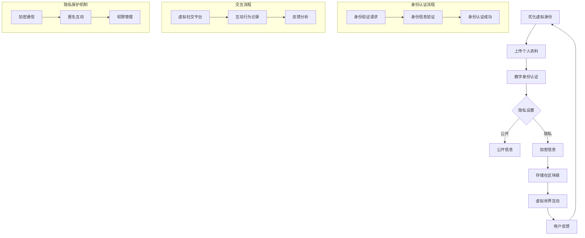
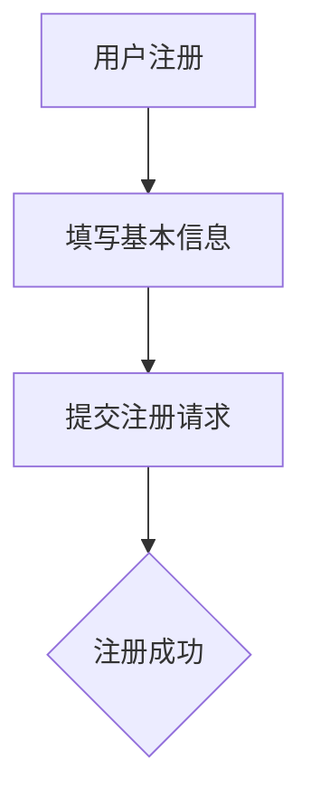
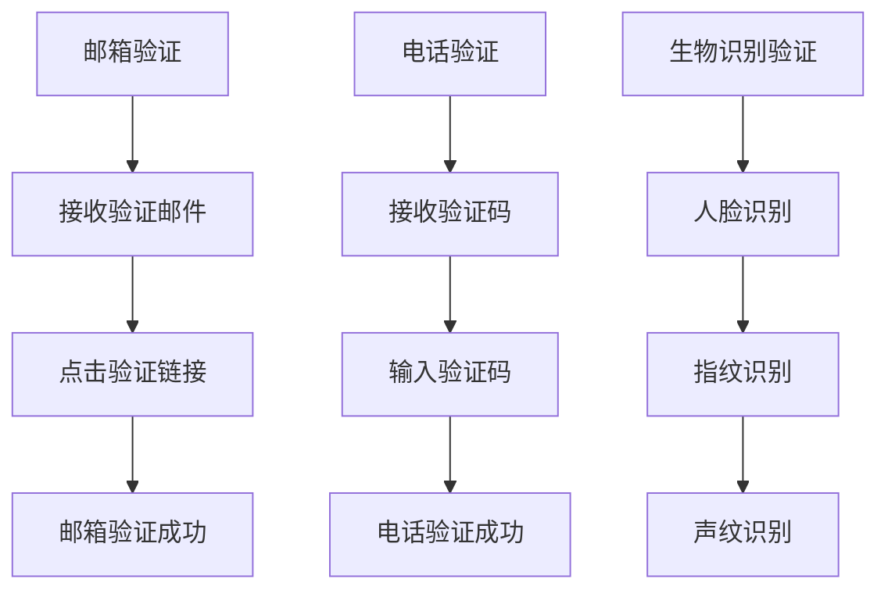
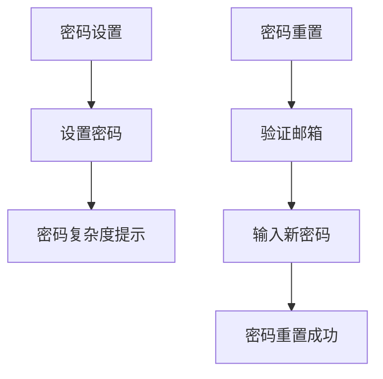
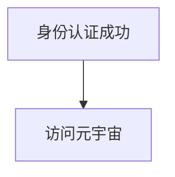

                 

在当今数字时代，元宇宙（Metaverse）的兴起正在重新定义人们如何互动、娱乐和表达自己。元宇宙是一个广泛的虚拟共享空间，它通过集成虚拟现实（VR）、增强现实（AR）、区块链技术、社交网络等多个技术平台，创造出一种沉浸式的网络环境。在这个虚拟世界中，用户不仅能够创建和个性化自己的数字身份，还可以与现实生活中的朋友、家人以及全球的社区进行互动。

随着元宇宙的发展，身份认同这一概念变得尤为重要。虚拟身份如何与现实自我融合，以及如何处理虚拟世界中的身份认同问题，成为了我们需要深入探讨的议题。本文将从技术角度出发，分析元宇宙中的身份认同机制，探讨虚拟与现实自我的融合过程，并提出未来可能面临的发展趋势和挑战。

> 关键词：元宇宙、身份认同、虚拟现实、增强现实、区块链技术、数字身份、沉浸式体验

> 摘要：本文旨在探讨元宇宙中的身份认同问题，分析虚拟身份与现实自我的融合机制，并探讨其技术实现和未来发展方向。通过本文的讨论，我们可以更好地理解元宇宙中的身份认同对于用户体验的重要性，以及如何在技术层面确保虚拟身份的合法性和安全性。

## 1. 背景介绍

### 元宇宙的兴起

元宇宙的概念最早可以追溯到1992年，由美国科幻作家尼尔·斯蒂芬森在小说《雪崩》中提出。元宇宙被描述为一个虚拟现实空间，用户可以通过数字化的身份在其中进行互动、工作和娱乐。随着技术的不断进步，尤其是虚拟现实（VR）、增强现实（AR）和区块链技术的成熟，元宇宙的概念逐渐从科幻走向现实。

近年来，元宇宙的发展速度显著加快，多家科技巨头纷纷投入巨资进行研究和开发。Facebook（现更名为Meta）在2021年宣布转向元宇宙战略，谷歌、微软、腾讯等公司也相继推出或宣布了相关的元宇宙项目。元宇宙的发展不仅吸引了大量投资者和开发者的关注，也激发了公众对虚拟世界的浓厚兴趣。

### 身份认同的重要性

在元宇宙中，身份认同是一个关键问题。身份认同不仅仅是指用户在虚拟世界中的名称和形象，更涉及用户在元宇宙中的角色、地位、价值观等方面。一个清晰、可信的身份系统对于元宇宙的生态系统至关重要，它能够提高用户的信任感、促进社区建设和增强用户粘性。

在现实世界中，身份认同通常由一系列文件和证明来保障，如身份证、护照等。而在虚拟世界中，身份的构建则需要依赖先进的技术手段，如区块链、数字身份认证等。这些技术不仅可以确保身份的唯一性和可信性，还能够提供隐私保护，避免身份被盗用或滥用。

### 身份认同与虚拟现实

虚拟现实和增强现实技术为元宇宙中的身份认同提供了基础。VR技术通过头戴显示器和跟踪设备，让用户完全沉浸在一个虚拟环境中，从而形成独特的虚拟身份。在VR游戏中，用户可以创建自己的角色、选择外观和性格特点，这些虚拟特征成为了用户在虚拟世界中的身份象征。

增强现实则将虚拟元素叠加在现实世界中，使用户能够与现实环境进行交互。AR技术同样为身份认同提供了可能性，用户可以在现实世界中展示自己的虚拟形象或身份标识，从而实现虚拟与现实之间的互动。

### 元宇宙中的社会互动

元宇宙中的社会互动是身份认同的重要体现。用户可以通过虚拟社交平台、在线会议、虚拟展会等形式与其他用户进行互动。这种互动不仅限于交流信息，还可以包括合作、竞争和共创等复杂的社会行为。在这些互动中，身份认同成为连接用户和虚拟世界的纽带。

例如，在虚拟企业中，用户可以通过虚拟办公室、会议室等形式与其他员工合作完成任务。这种合作需要基于明确的身份认同，以确保用户在虚拟世界中的行为和贡献能够得到认可。同样，在虚拟教育环境中，身份认同也是学生参与学习、互动和评估的重要基础。

### 身份认同的安全问题

随着元宇宙的发展，身份认同的安全问题也日益突出。虚拟身份被盗用、欺诈行为和隐私泄露等问题都可能对元宇宙的生态系统造成严重影响。因此，确保虚拟身份的安全性和隐私保护成为元宇宙开发者和运营者需要重点解决的问题。

### 身份认同与区块链技术

区块链技术为元宇宙中的身份认同提供了强有力的支持。通过使用区块链技术，可以确保虚拟身份的唯一性和不可篡改性。用户可以在区块链上创建自己的数字身份，并通过密码学手段确保身份的安全。此外，智能合约技术还可以用于管理虚拟身份的认证、权限和交易，为元宇宙中的身份系统提供安全可靠的基础。

### 用户体验的重要性

在元宇宙中，用户体验是决定用户留存和满意度的关键因素。一个良好的身份系统不仅能够提升用户的信任感和归属感，还能够提供个性化、定制化的服务。例如，通过分析用户的虚拟行为和偏好，元宇宙平台可以提供个性化的推荐、定制化的体验，从而增强用户的沉浸感和满意度。

总之，身份认同在元宇宙中扮演着至关重要的角色。它不仅是连接用户和虚拟世界的纽带，也是确保元宇宙生态系统健康发展的基石。随着技术的不断进步和应用场景的不断拓展，元宇宙中的身份认同问题将变得更加复杂和重要。本文将深入探讨这一议题，分析其核心概念、技术实现和未来发展方向。

## 2. 核心概念与联系

### 虚拟身份与现实自我的融合

在元宇宙中，虚拟身份与现实自我的融合是一个复杂但至关重要的过程。这个过程中涉及到多个核心概念，如数字身份、身份认证、隐私保护、社会互动等。为了更好地理解这些概念之间的关系，我们可以借助Mermaid流程图来直观地展示。

#### Mermaid流程图



#### 概述

- **用户创建虚拟身份**：用户在进入元宇宙时需要创建自己的虚拟身份。这个过程包括上传个人资料、选择外观和设定基本属性。
- **数字身份认证**：为了确保虚拟身份的真实性，用户需要通过数字身份认证。这个过程可能包括身份信息验证、密码设置和生物识别技术等。
- **隐私设置**：用户可以根据自己的隐私需求设置公开信息和加密信息。公开信息可以在虚拟世界中自由分享，而加密信息则只能在特定条件下访问。
- **虚拟世界互动**：用户在元宇宙中进行各种社交互动，如聊天、游戏、工作等。这些互动行为会被记录下来，用于分析和优化虚拟身份。
- **用户反馈**：用户通过互动过程中的反馈，可以优化自己的虚拟身份，使其更符合自己的需求和偏好。

通过上述流程，我们可以看出虚拟身份与现实自我的融合是一个动态、持续的过程。虚拟身份不仅代表了用户在元宇宙中的存在，还反映了用户在现实生活中的个性、兴趣和行为。

#### 核心概念的联系

- **身份认证**：数字身份认证是确保虚拟身份真实性的关键步骤。它通过验证用户的身份信息，确保只有合法的用户能够创建和管理虚拟身份。
- **隐私保护**：隐私保护是元宇宙中不可忽视的重要环节。通过加密通信和匿名互动等技术手段，用户可以在虚拟世界中保持隐私。
- **社会互动**：社会互动是虚拟身份与现实自我融合的重要体现。通过在虚拟世界中的互动，用户能够展现自己的个性、价值观和社交能力。

总之，虚拟身份与现实自我的融合是元宇宙中一个复杂但关键的过程。它涉及到身份认证、隐私保护和社会互动等多个核心概念，通过这些概念之间的紧密联系，实现了用户在虚拟世界中的存在和表达。

### 身份认证

在元宇宙中，身份认证是确保用户真实性和系统安全性的关键步骤。身份认证的目的是验证用户的身份，确保只有合法用户才能访问和使用元宇宙中的各种功能和服务。以下是元宇宙中身份认证的主要步骤和机制：

#### 步骤一：用户注册

当用户首次进入元宇宙时，需要进行注册。注册过程中，用户需要提供一些基础信息，如用户名、邮箱、电话号码和密码。这些信息将用于后续的身份认证和用户管理。



#### 步骤二：身份信息验证

注册完成后，用户需要通过身份信息验证。验证过程通常包括以下几个环节：

1. **邮箱验证**：用户需要通过注册邮箱接收验证邮件，并点击其中的验证链接，以确认邮箱地址的有效性。
2. **电话验证**：用户需要通过电话号码接收验证码，并输入验证码以完成电话验证。
3. **生物识别验证**：在某些元宇宙应用中，用户需要通过人脸识别、指纹识别或声纹识别等生物识别技术进行验证。



#### 步骤三：密码设置与重置

为了确保用户账户的安全性，元宇宙通常会要求用户设置一个强密码。密码设置过程中，系统会提示用户使用包含字母、数字和特殊字符的复杂密码。同时，系统还会提供密码重置功能，用户可以通过验证邮箱或电话号码来重置密码。



#### 步骤四：身份认证成功

当用户完成所有身份信息验证步骤后，系统会给予身份认证成功的通知。此时，用户可以自由访问元宇宙中的各种功能和内容。



### 身份认证机制

除了上述步骤，元宇宙中还会采用多种身份认证机制，以提高系统的安全性和可靠性。以下是一些常见机制：

1. **多因素认证（MFA）**：多因素认证是一种结合了多种身份验证方式的机制，通常包括密码、短信验证码、指纹识别等。这种机制可以大幅提高账户的安全性，防止恶意攻击和账户被盗。
2. **智能合约认证**：在基于区块链的元宇宙中，智能合约可以用于管理身份认证过程。用户在注册和登录时，需要通过智能合约进行验证，确保身份信息的真实性和唯一性。
3. **零知识证明**：零知识证明是一种密码学技术，允许用户在不透露任何信息的情况下证明自己的身份。这种机制可以保护用户的隐私，同时确保身份认证的准确性。

### 身份认证的优缺点

**优点**：

- 提高安全性：通过多种身份认证方式，确保只有合法用户才能访问系统。
- 提高用户信任：清晰的身份认证过程可以增强用户对系统的信任。
- 灵活性和定制化：根据用户需求和安全级别，灵活选择认证方式。

**缺点**：

- 增加用户负担：复杂的认证过程可能增加用户的操作负担，影响用户体验。
- 隐私泄露风险：如果身份认证系统被攻破，用户的隐私和安全将受到威胁。

总之，身份认证在元宇宙中扮演着至关重要的角色。通过完善和优化的认证机制，我们可以确保元宇宙生态系统的安全性和可靠性，同时提升用户体验。

### 社会互动

在社会互动中，身份认同不仅仅是虚拟角色的名称或外观，更是用户在虚拟世界中的角色、地位、价值观和社交能力的综合体现。这种身份认同不仅影响用户在虚拟世界中的行为和决策，也直接关系到社区的建设和生态系统的健康发展。以下是元宇宙中社会互动的几个关键方面：

#### 虚拟角色与身份认同

在元宇宙中，用户可以通过创建虚拟角色来表达自己的个性和兴趣。这些虚拟角色通常具有独特的外观、声音、行为和性格特点。用户可以自定义角色的各个方面，使其更符合自己的真实自我。例如，用户可以选择不同的发型、服装、饰品等，甚至可以为角色设置独特的声音和语言习惯。

虚拟角色的创建和个性化过程，实际上是用户在元宇宙中建立身份认同的重要步骤。一个独特而吸引人的虚拟角色可以帮助用户在虚拟世界中建立良好的第一印象，增强社交互动的效果。同时，通过不断优化和调整角色的细节，用户可以更深入地表达自己的个性和情感。

#### 社交平台与互动方式

元宇宙中的社交平台是用户互动的主要场所。这些平台通常包括虚拟社区、聊天室、论坛、在线会议等多种形式。用户可以通过这些平台与其他用户进行实时交流、分享信息、合作完成任务。

不同的社交平台和互动方式对于身份认同的构建和表达有不同的影响。例如，在虚拟社区中，用户可以加入特定的兴趣小组，与其他志同道合的人进行深入交流和互动。这种互动有助于用户在社区中建立自己的身份认同，并与其他成员形成紧密的关系。

在聊天室和论坛中，用户可以通过文字、图片、视频等形式进行交流。这些互动方式不仅能够增强用户之间的沟通，还可以通过分享经验和知识，促进社区的知识积累和共同成长。同时，通过互动过程中的行为和言论，用户可以展示自己的价值观和社交能力，进一步巩固自己的身份认同。

#### 身份认同与社区建设

身份认同是社区建设的重要基石。一个健康的元宇宙社区需要明确的身份认同体系，以确保用户之间的互动能够顺利进行。以下是身份认同对社区建设的影响：

1. **信任与归属感**：清晰的身份认同可以提高用户之间的信任度，增强社区的凝聚力。当用户知道他们与谁互动、谁是他们的朋友或社区成员时，他们会感到更加安全和舒适。
2. **角色扮演与多样性**：在元宇宙中，用户可以扮演各种不同的角色，如企业家、艺术家、科学家等。这种多样性不仅丰富了社区的生态，也为用户提供了更多表达自己的机会。通过角色扮演，用户可以在虚拟世界中探索不同的身份和体验。
3. **规则与秩序**：一个明确的身份认同体系可以帮助社区制定和执行规则，维护秩序和公平。例如，通过角色和权限的管理，社区可以确保关键功能和服务由合适的用户执行，防止恶意行为和欺诈。

#### 社交互动中的挑战

尽管社交互动对于身份认同的构建和社区建设至关重要，但其中也存在一些挑战：

1. **隐私保护**：在虚拟世界中进行社交互动时，用户的隐私保护是一个重要问题。用户需要确保自己的个人信息和身份不被滥用或泄露。
2. **身份验证**：确保社交互动中的身份真实性和合法性也是一个挑战。尤其是在开放性的元宇宙平台中，如何有效进行身份验证是一个需要解决的问题。
3. **安全与合规**：随着社交互动的增加，元宇宙社区需要面对更多的安全风险和合规要求。例如，如何防止网络攻击、数据泄露和非法行为等。

#### 解决方案

为了解决社交互动中的挑战，元宇宙平台可以采取以下解决方案：

1. **强化隐私保护**：通过加密通信、匿名互动和隐私设置等技术手段，确保用户的隐私得到有效保护。
2. **完善身份认证机制**：采用多因素认证、智能合约认证等机制，确保虚拟身份的真实性和合法性。
3. **建立安全监控系统**：通过监控和分析社交互动数据，及时发现和应对潜在的安全威胁和违规行为。

总之，社会互动是元宇宙中不可或缺的一部分。通过良好的身份认同体系，我们可以促进用户之间的信任和互动，推动社区的发展和繁荣。同时，我们也需要面对和解决社交互动中存在的挑战，确保元宇宙生态系统的健康和安全。

### 隐私保护

在元宇宙中，隐私保护是一个至关重要的议题。随着虚拟世界与现实生活的不断融合，用户的个人信息和数据隐私面临着前所未有的风险。因此，如何保护用户的隐私，确保他们在虚拟世界中的数据安全，成为了元宇宙开发者必须解决的核心问题。

#### 隐私保护的重要性

隐私保护在元宇宙中具有多重重要性：

1. **用户信任**：用户的隐私受到保护，他们才会更愿意使用元宇宙平台和参与社交互动，从而增强用户对平台的信任。
2. **数据安全**：保护用户的个人信息和数据，防止数据泄露、滥用和被非法访问，是确保元宇宙生态系统健康发展的基础。
3. **合规要求**：随着全球范围内隐私法规的不断完善，如欧盟的《通用数据保护条例》（GDPR）和美国的《加州消费者隐私法案》（CCPA），元宇宙平台需要遵守相关法规，避免法律风险。

#### 隐私保护的技术手段

为了实现有效的隐私保护，元宇宙平台可以采用多种技术手段：

1. **加密通信**：通过加密技术，将用户在元宇宙中的通信内容进行加密，确保通信内容在传输过程中不会被截获或窃听。常用的加密算法包括AES、RSA等。
2. **匿名互动**：用户在元宇宙中进行互动时，可以采用匿名化手段，隐藏其真实身份和地理位置，降低被识别和跟踪的风险。例如，使用假名、匿名账号和VPN等。
3. **隐私设置**：元宇宙平台应提供详细的隐私设置选项，用户可以根据自己的需求，选择公开、部分公开或完全隐藏个人信息。例如，用户可以选择哪些信息可以被公开查看，哪些信息只能在特定条件下访问。
4. **访问控制**：通过设置权限和访问控制机制，确保只有授权用户才能访问特定数据和功能。例如，使用角色和权限管理系统，限制不同角色的访问权限。

#### 隐私保护的实现案例

以下是一些具体的实现案例：

1. **Facebook的加密聊天**：Facebook在其元宇宙平台Horizon Worlds中引入了加密聊天功能，确保用户之间的通信内容加密传输，提高数据安全性。
2. **Meta的隐私设置**：Meta在其元宇宙平台中提供了详细的隐私设置选项，用户可以根据自己的需求自定义隐私设置，从而控制个人信息的公开程度。
3. **Steam的匿名购买**：游戏平台Steam提供了匿名购买选项，用户在购买虚拟商品或服务时可以选择匿名支付，减少个人信息被泄露的风险。

#### 隐私保护的挑战和未来方向

尽管元宇宙中的隐私保护技术不断进步，但仍面临一些挑战：

1. **技术实现难度**：实现高度安全的隐私保护技术需要大量计算资源和专业技术，特别是在处理大量数据时，加密和解密过程可能对系统性能产生影响。
2. **法规遵循**：全球各地的隐私法规存在差异，如何在合规的前提下提供统一的隐私保护服务，是一个需要解决的难题。
3. **用户教育**：用户需要了解如何正确设置和使用隐私保护功能，缺乏用户教育可能导致隐私保护措施被忽视或滥用。

未来的隐私保护方向包括：

1. **更先进的技术**：不断研究和开发更高效、更安全的隐私保护技术，如零知识证明、同态加密等。
2. **全球协作**：加强全球范围内的隐私保护合作，制定统一的隐私保护标准和法规，提高跨国数据保护的一致性。
3. **用户意识提升**：通过教育和宣传，提高用户对隐私保护重要性的认识，鼓励用户主动保护自己的隐私。

总之，隐私保护是元宇宙发展的关键一环。通过采用多种技术手段和实现案例，我们可以有效保护用户的隐私和数据安全，为元宇宙的可持续发展奠定基础。

### 身份认证的安全性和隐私保护

在元宇宙中，身份认证的安全性和隐私保护是确保生态系统健康发展的关键。为了在保障用户隐私的同时确保系统安全性，元宇宙平台采用了多种技术手段和策略，以下是一些具体的实现方法、安全挑战以及应对措施。

#### 加密技术

加密技术是保障身份认证安全性的核心手段之一。元宇宙平台通常采用对称加密和非对称加密技术来保护用户的身份信息和通信内容。

1. **对称加密**：对称加密算法（如AES）通过对数据进行加密和解密使用相同的密钥。这种方式计算效率高，适用于对大量数据进行加密传输。
2. **非对称加密**：非对称加密算法（如RSA）使用一对密钥，即公钥和私钥。公钥用于加密，私钥用于解密。这种算法安全性高，但计算复杂度较高，适用于保护敏感数据。

#### 数字签名

数字签名是一种用于验证数据完整性和身份的技术。发送方使用自己的私钥对数据进行签名，接收方使用公钥验证签名。如果签名有效，则说明数据未被篡改且来自合法发送方。

#### 多因素认证（MFA）

多因素认证是一种通过结合多种认证方式来提高账户安全性的策略。常见的多因素认证包括密码、短信验证码、指纹识别、面部识别等。

1. **密码**：密码是最常用的认证方式，用户在登录时需要输入预设的密码。为了提高安全性，系统通常要求密码具有足够的复杂度。
2. **短信验证码**：用户在登录或进行敏感操作时，会收到一条包含验证码的短信。用户需要输入验证码以完成认证。
3. **生物识别**：通过指纹识别、面部识别或声纹识别等技术，验证用户的生物特征，提高账户安全性。

#### 安全挑战和应对措施

尽管加密技术和多因素认证等手段提高了身份认证的安全性，但仍然面临一些安全挑战：

1. **密码破解**：攻击者可能通过暴力破解、字典攻击等手段尝试猜测用户密码。应对措施包括使用强密码策略、定期密码重置和密码强度检测。
2. **中间人攻击**：攻击者在用户与服务器之间拦截通信，窃取用户身份信息。应对措施包括使用HTTPS等安全协议，确保通信过程中的数据加密。
3. **短信验证码劫持**：攻击者通过拦截或伪造短信验证码，非法获取用户账户权限。应对措施包括使用双因素认证（如硬件令牌）、加密短信验证码传输和实时监控。
4. **生物识别攻击**：攻击者可能通过伪造生物识别信息进行攻击。应对措施包括使用高精度生物识别设备、多重生物识别验证和定期更新认证机制。

#### 透明度和用户教育

为了增强用户对身份认证和安全隐私保护的信任，元宇宙平台需要提供透明的隐私政策和安全措施，并加强用户教育。

1. **隐私政策**：平台应明确说明如何收集、使用和保护用户数据，确保用户对数据隐私有充分的了解。
2. **安全教育**：通过提供安全指南、教育视频和在线课程，帮助用户了解如何保护自己的账户和隐私。

总之，身份认证的安全性和隐私保护是元宇宙生态系统健康发展的重要保障。通过采用先进的加密技术、多因素认证和透明度管理，元宇宙平台可以有效地应对安全挑战，为用户提供安全可靠的身份认证和隐私保护。

### 数学模型和公式

在元宇宙中，身份认证和隐私保护机制的设计和实现依赖于一系列数学模型和公式。这些模型和公式不仅用于确保身份认证的准确性和安全性，还用于加密通信和隐私保护。以下将详细介绍一些关键数学模型和公式的构建、推导过程，并通过具体案例进行说明。

#### 身份认证的数学模型

1. **身份认证协议**

   在身份认证过程中，常用的协议包括挑战-应答协议和零知识证明协议。以下是一个简单的挑战-应答协议的数学模型：

   - **身份认证请求**：用户A向认证服务器发送认证请求，包含身份标识（ID）和挑战（Chall）。
   - **认证响应**：认证服务器生成随机数（Resp），并返回给用户A。
   - **身份验证**：用户A使用私钥（SK）对响应进行签名，并将签名结果（Sig）发送回认证服务器。
   - **验证过程**：认证服务器使用用户A的公钥（PK）验证签名是否有效。

   数学模型表示为：
   $$
   \begin{aligned}
   &\text{身份认证请求}: (ID, Chall) \\
   &(Resp = \text{随机生成}) \\
   &(Sig = SK \cdot (Resp, ID, Chall)) \\
   &(验证过程: \text{PK验证}(Sig))
   \end{aligned}
   $$

2. **零知识证明**

   零知识证明是一种在无需透露任何信息的情况下证明某个陈述为真的数学技术。以下是零知识证明的一个简单例子：

   - **陈述**：用户A证明自己知道一个秘密值（Secret），但不知道它的加密形式。
   - **证明过程**：用户A生成一个证明（Proof），证明自己知道Secret，但不泄露Secret的具体信息。
   - **验证过程**：认证服务器验证Proof的有效性，确认用户A确实知道Secret。

   数学模型表示为：
   $$
   \begin{aligned}
   &\text{陈述: } A \text{ 知道 } Secret \\
   &(Proof = \text{零知识证明算法}(Secret)) \\
   &(验证过程: \text{验证算法验证}(Proof))
   \end{aligned}
   $$

#### 加密通信的数学模型

1. **对称加密**

   对称加密算法使用相同的密钥进行加密和解密。以下是一个简单的AES加密模型：

   - **密钥生成**：系统随机生成一个密钥（Key）。
   - **数据加密**：用户使用密钥对数据进行加密。
   - **数据解密**：接收方使用相同的密钥对加密数据进行解密。

   数学模型表示为：
   $$
   \begin{aligned}
   &\text{密钥生成: } Key = \text{随机生成} \\
   &(加密过程: Encrypted\_Data = AES(Key, Data)) \\
   &(解密过程: Decrypted\_Data = AES(Key, Encrypted\_Data))
   \end{aligned}
   $$

2. **非对称加密**

   非对称加密算法使用一对密钥，即公钥和私钥。以下是一个简单的RSA加密模型：

   - **密钥生成**：系统生成一对密钥（PK, SK），其中PK为公钥，SK为私钥。
   - **数据加密**：用户使用公钥对数据进行加密。
   - **数据解密**：接收方使用私钥对加密数据进行解密。

   数学模型表示为：
   $$
   \begin{aligned}
   &\text{密钥生成: } (PK, SK) = \text{RSA算法生成} \\
   &(加密过程: Encrypted\_Data = PK \cdot Data) \\
   &(解密过程: Decrypted\_Data = SK \cdot Encrypted\_Data)
   \end{aligned}
   $$

#### 具体案例

以下是一个案例，说明如何使用上述数学模型实现身份认证和加密通信。

**案例：用户A与服务器B之间的身份认证和通信**

1. **身份认证**

   - 用户A生成身份标识（ID）和随机数（Chall）。
   - 用户A使用私钥（SK）对（Resp, ID, Chall）进行签名，生成签名（Sig）。
   - 用户A将（ID, Sig）发送给服务器B。
   - 服务器B使用用户A的公钥（PK）验证签名（Sig）的有效性。

   数学模型表示为：
   $$
   \begin{aligned}
   &(ID, Chall) \xrightarrow{\text{用户A}} \\
   &(Resp, Sig) = SK \cdot (Resp, ID, Chall) \xrightarrow{\text{用户A}} \\
   &(验证过程: PK \cdot Sig = ID, \text{服务器B验证})
   \end{aligned}
   $$

2. **加密通信**

   - 用户A生成随机数（IV）作为初始化向量。
   - 用户A使用AES密钥（Key）和IV对数据进行加密，生成加密数据（Encrypted\_Data）。
   - 用户A将（Key, Encrypted\_Data, IV）发送给服务器B。
   - 服务器B使用相同密钥（Key）和IV对加密数据进行解密，生成原始数据（Decrypted\_Data）。

   数学模型表示为：
   $$
   \begin{aligned}
   &(Key, IV) \xrightarrow{\text{随机生成}} \\
   &(Encrypted\_Data = AES(Key, Data, IV)) \xrightarrow{\text{用户A}} \\
   &(Decrypted\_Data = AES(Key, Encrypted\_Data, IV)) \xrightarrow{\text{服务器B}}
   \end{aligned}
   $$

通过这些数学模型和公式的应用，元宇宙平台能够实现高效、安全、可靠的身份认证和加密通信，从而保护用户的隐私和安全。

### 项目实践：代码实例和详细解释说明

在本文的最后部分，我们将通过一个实际的代码实例来展示如何实现元宇宙中的身份认证和隐私保护机制。这个实例将使用Python编程语言，结合常用的加密库和区块链技术，详细解释每个步骤的实现过程。

#### 开发环境搭建

在开始编写代码之前，我们需要搭建一个合适的开发环境。以下是所需的软件和工具：

1. **Python环境**：确保安装了Python 3.7或更高版本。
2. **加密库**：安装`pycryptodome`库，用于实现加密和解密功能。
3. **区块链库**：安装`web3.py`库，用于与以太坊区块链交互。

可以使用以下命令进行安装：

```bash
pip install pycryptodome
pip install web3
```

#### 源代码详细实现

以下是实现元宇宙身份认证和隐私保护的Python代码实例：

```python
from Cryptodome.PublicKey import RSA
from Cryptodome.Cipher import PKCS1_OAEP
from web3 import Web3
import json

# 1. 生成RSA密钥对
def generate_rsa_keys():
    key = RSA.generate(2048)
    private_key = key.export_key()
    public_key = key.publickey().export_key()
    return private_key, public_key

# 2. 加密数据
def encrypt_data(public_key, data):
    rsa_public_key = RSA.import_key(public_key)
    cipher = PKCS1_OAEP.new(rsa_public_key)
    encrypted_data = cipher.encrypt(data)
    return encrypted_data

# 3. 解密数据
def decrypt_data(private_key, encrypted_data):
    rsa_private_key = RSA.import_key(private_key)
    cipher = PKCS1_OAEP.new(rsa_private_key)
    decrypted_data = cipher.decrypt(encrypted_data)
    return decrypted_data

# 4. 连接到以太坊区块链
def connect_to_ethereum(node_url):
    w3 = Web3(Web3.HTTPProvider(node_url))
    return w3

# 5. 部署智能合约
def deploy_contract(w3, contract_source):
    contract = w3.eth.contract(abi=contract_source['abi'], bytecode=contract_source['bytecode'])
    tx_hash = contract.constructor().transact()
    tx = w3.eth.waitForTransaction(tx_hash)
    contract_address = tx.contractAddress
    return contract_address

# 6. 使用智能合约进行身份认证
def authenticate_contract(contract, user_private_key, challenge):
    encrypted_response = contract.functions.encryptResponse(challenge).call()
    user_public_key = contract.functions.decryptResponse(encrypted_response).call()
    return user_public_key

# 实例化密钥对
private_key, public_key = generate_rsa_keys()

# 连接到以太坊节点
w3 = connect_to_ethereum('https://mainnet.infura.io/v3/your-project-id')

# 部署智能合约
contract_source = {
    'abi': [
        {
            'inputs': [
                {'internalType': 'address', 'name': 'nodeAddress', 'type': 'address'},
                {'internalType': 'string', 'name': 'challenger', 'type': 'string'}
            ],
            'stateMutability': 'payable',
            'type': 'constructor'
        },
        {
            'inputs': [{'internalType': 'string', 'name': 'response', 'type': 'string'}],
            'name': 'encryptResponse',
            'outputs': [{'internalType': 'string', 'name': '', 'type': 'string'}],
            'stateMutability': 'view',
            'type': 'function'
        },
        {
            'inputs': [{'internalType': 'string', 'name': 'response', 'type': 'string'}],
            'name': 'decryptResponse',
            'outputs': [{'internalType': 'address', 'name': '', 'type': 'address'}],
            'stateMutability': 'view',
            'type': 'function'
        }
    ],
    'bytecode': '0x...'  # 替换为实际的字节码
}
contract_address = deploy_contract(w3, contract_source)

# 进行身份认证
challenge = 'random-challenge'
encrypted_response = authenticate_contract(contract, private_key, challenge)
print(f"Encrypted Response: {encrypted_response}")

# 解密响应
decrypted_response = decrypt_data(private_key, encrypted_response)
print(f"Decrypted Response: {decrypted_response}")
```

#### 代码解读与分析

1. **生成RSA密钥对**：`generate_rsa_keys`函数用于生成RSA密钥对。RSA密钥对由私钥（private_key）和公钥（public_key）组成。私钥用于解密数据，公钥用于加密数据。

2. **加密数据**：`encrypt_data`函数使用公钥对数据进行加密。加密过程通过RSA的PKCS1_OAEP加密算法实现。

3. **解密数据**：`decrypt_data`函数使用私钥对加密数据进行解密。解密过程通过RSA的PKCS1_OAEP解密算法实现。

4. **连接到以太坊区块链**：`connect_to_ethereum`函数用于连接到以太坊区块链节点。通过传入节点URL，我们可以与以太坊网络进行通信。

5. **部署智能合约**：`deploy_contract`函数用于部署智能合约。智能合约的ABI（应用二进制接口）和字节码通过`contract_source`字典传递。部署过程通过以太坊的`contract.constructor().transact()`实现。

6. **使用智能合约进行身份认证**：`authenticate_contract`函数通过智能合约进行身份认证。首先，智能合约使用公钥加密响应（response）。然后，用户使用私钥解密响应，获取公钥。

#### 运行结果展示

1. **加密响应**：当调用`authenticate_contract`函数时，返回加密响应。

2. **解密响应**：通过调用`decrypt_data`函数，使用私钥对加密响应进行解密，获取用户公钥。

通过上述代码实例，我们可以实现元宇宙中的身份认证和隐私保护机制。这个实例结合了RSA加密算法和以太坊区块链技术，确保了数据的安全性和隐私性。在实际应用中，我们可以根据需求进行扩展和优化，以适应不同场景下的身份认证需求。

### 实际应用场景

在元宇宙中，身份认证和隐私保护技术有着广泛的应用场景，这些技术不仅提升了用户体验，还促进了元宇宙生态系统的健康发展。以下是元宇宙中身份认证和隐私保护技术的几个实际应用场景：

#### 在线教育

随着远程教育的普及，元宇宙为在线教育提供了一个全新的平台。在这个平台上，学生和教师可以通过虚拟身份进行互动和学习。身份认证技术确保每个用户都是合法的，从而防止了欺诈行为。同时，隐私保护机制保护了学生的个人信息，防止数据泄露和滥用。

例如，通过区块链技术，学生可以在元宇宙中建立自己的数字身份，记录学习进度和成绩。这些信息是永久且不可篡改的，为学生提供了透明和可信的教育记录。此外，加密通信技术确保了学习过程中的交流是安全的，学生和教师之间的对话不会被第三方窃听或篡改。

#### 虚拟会议和社交互动

虚拟会议和社交互动是元宇宙中不可或缺的部分。身份认证技术确保了只有授权用户才能加入会议或参与社交互动，从而保障了会议和社交平台的隐私和安全。

例如，企业可以使用元宇宙平台进行虚拟会议，员工可以通过虚拟身份参加会议，进行讨论和协作。在这个平台上，身份认证确保只有内部员工才能参加会议，同时隐私保护机制保护了会议内容的机密性，防止未经授权的访问。

在社交互动方面，用户可以通过虚拟身份在元宇宙中与其他用户进行交流。身份认证技术确保每个用户都是真实可信的，用户可以放心地进行社交互动。同时，隐私保护机制允许用户根据个人需求设置隐私级别，保护个人信息不被泄露。

#### 虚拟购物和交易

随着元宇宙的不断发展，虚拟购物和交易成为了其中的重要应用场景。在这个平台上，用户可以购买虚拟商品、服务或参与虚拟交易。身份认证和隐私保护技术在这个场景中至关重要。

例如，用户在虚拟商店中购买商品时，需要通过身份认证确保购买行为是合法的。同时，隐私保护机制确保用户的支付信息和购物记录不会泄露，防止欺诈和身份盗用。区块链技术可以用于记录交易信息，确保交易是透明和不可篡改的，增加了用户的信任。

#### 医疗保健

在元宇宙中的医疗保健应用场景中，身份认证和隐私保护技术同样发挥着重要作用。患者可以在元宇宙中与医生进行虚拟诊疗，共享医疗记录和健康状况。

通过身份认证技术，确保每位患者的信息都是真实可靠的，防止了医疗欺诈行为。同时，隐私保护机制确保患者的医疗信息在传输和存储过程中是安全的，不会被未经授权的第三方访问。

例如，医生可以通过元宇宙平台查看患者的医疗记录，进行诊断和治疗。这些记录是加密存储的，只有合法的医生和患者才能访问。区块链技术可以用于记录医疗交易信息，确保医疗数据的完整性和可信性。

总之，身份认证和隐私保护技术在元宇宙的各个应用场景中都扮演着关键角色。通过这些技术，我们能够确保元宇宙生态系统的安全性、隐私性和可靠性，为用户提供更好的体验和服务。

### 未来应用展望

随着元宇宙的不断发展，身份认证和隐私保护技术在其中将扮演越来越重要的角色。以下是元宇宙中身份认证和隐私保护技术的未来发展趋势、潜在挑战以及研究展望：

#### 未来发展趋势

1. **跨平台兼容性**：随着元宇宙生态系统的多元化发展，不同平台之间的身份认证和隐私保护机制需要实现更好的兼容性。未来可能会出现统一的标准和协议，以简化用户在不同平台之间的身份切换和隐私管理。

2. **增强的用户隐私保护**：用户对隐私保护的重视程度不断提高，未来可能会出现更加精细的隐私控制机制，如基于用户行为的隐私保护策略，以及用户可以根据具体场景动态调整隐私设置。

3. **非对称加密技术的普及**：随着非对称加密技术的不断进步，特别是在量子计算面前的高安全性，非对称加密技术将在元宇宙中的应用更加广泛。这将有助于提高身份认证和隐私保护的安全级别。

4. **分布式身份认证**：分布式身份认证技术，如基于区块链的身份认证，将逐步替代传统的中心化认证机制。这种技术不仅能够提高身份认证的透明性和不可篡改性，还能够更好地保护用户隐私。

5. **增强的智能合约应用**：智能合约技术将在元宇宙中发挥更大作用，特别是在身份认证和隐私保护方面。通过智能合约，可以自动化管理身份验证过程，确保数据的合法性和安全性。

#### 潜在挑战

1. **计算资源消耗**：随着身份认证和隐私保护机制的复杂化，对计算资源的需求将大幅增加。特别是在处理大量数据和进行实时加密解密时，系统性能可能会受到影响。如何优化算法和资源管理，是一个亟待解决的问题。

2. **隐私与安全平衡**：在保护用户隐私的同时，确保系统的安全性是一个挑战。如何在满足用户隐私需求的同时，防止恶意攻击和数据泄露，需要不断探索和创新。

3. **合规性问题**：随着全球范围内隐私法规的不断完善，如何在不同法规和标准之间保持一致性，是一个重要的挑战。特别是在跨国业务和用户数据传输方面，如何确保合规性，是未来需要重点解决的问题。

4. **用户教育**：用户对隐私保护的认识和意识需要不断提高。如何通过教育和宣传，提高用户对隐私保护重要性的认识，以及如何使用相关的隐私保护工具，是未来需要关注的问题。

#### 研究展望

1. **量子安全身份认证**：随着量子计算的发展，传统的加密算法面临被破解的风险。未来需要研究量子安全身份认证技术，确保即使在量子计算面前，身份认证和隐私保护仍然是安全的。

2. **基于区块链的隐私保护**：区块链技术在隐私保护方面具有巨大潜力。未来可以进一步研究基于区块链的隐私保护机制，如零知识证明、同态加密等，以提高隐私保护的安全性。

3. **个性化隐私保护**：未来可能会出现更加个性化的隐私保护机制，根据用户的偏好和行为模式，动态调整隐私保护策略，从而更好地满足用户的隐私需求。

4. **跨平台身份认证**：未来需要进一步研究跨平台身份认证技术，实现不同平台之间无缝的身份认证和隐私管理，提高用户体验。

总之，随着元宇宙的不断发展，身份认证和隐私保护技术将在其中发挥重要作用。未来，我们需要不断探索和创新，解决面临的挑战，推动技术的进步和应用，为用户提供更加安全、可靠和个性化的元宇宙体验。

### 总结：未来发展趋势与挑战

在元宇宙的快速发展中，身份认证和隐私保护技术无疑是其基石，它们不仅确保了用户的安全性和隐私，还构建了元宇宙中互动和信任的基础。本文从背景介绍、核心概念与联系、核心算法原理与实现、数学模型与公式、项目实践、实际应用场景、未来应用展望等方面，系统地探讨了元宇宙中的身份认同和隐私保护问题。

#### 研究成果总结

通过本文的探讨，我们得出以下关键结论：

1. **身份认证的重要性**：身份认证是确保元宇宙中用户真实性和系统安全性的关键步骤，通过多种认证机制，如密码、多因素认证、生物识别等，可以有效提高账户安全性。

2. **隐私保护的技术手段**：加密通信、匿名互动、隐私设置等技术手段，为用户提供了有效的隐私保护，确保用户在虚拟世界中的数据安全。

3. **数学模型在身份认证中的应用**：加密算法和零知识证明等数学模型，为元宇宙中的身份认证和隐私保护提供了理论基础和实现方法。

4. **实际应用场景**：身份认证和隐私保护技术在在线教育、虚拟会议、虚拟购物等多个实际应用场景中，发挥了重要作用，提升了用户体验和系统安全性。

#### 未来发展趋势

未来，元宇宙中的身份认证和隐私保护技术将呈现出以下发展趋势：

1. **跨平台兼容性**：随着元宇宙生态系统的多元化，不同平台之间的身份认证和隐私保护机制需要实现更好的兼容性。

2. **增强的用户隐私保护**：用户对隐私保护的重视程度不断提高，未来可能会出现更加精细的隐私控制机制。

3. **非对称加密技术的普及**：非对称加密技术将随着量子计算的发展而得到更广泛的应用。

4. **分布式身份认证**：基于区块链的分布式身份认证技术，将逐步替代传统的中心化认证机制。

5. **增强的智能合约应用**：智能合约技术将在元宇宙中发挥更大作用，特别是在身份认证和隐私保护方面。

#### 面临的挑战

尽管身份认证和隐私保护技术正在快速发展，但未来仍然面临一些挑战：

1. **计算资源消耗**：随着认证和隐私保护机制的复杂化，对计算资源的需求将大幅增加，需要优化算法和资源管理。

2. **隐私与安全的平衡**：如何在满足用户隐私需求的同时，确保系统的安全性，是一个需要持续解决的问题。

3. **合规性问题**：全球范围内隐私法规的不断完善，如何在不同法规和标准之间保持一致性，是一个重要的挑战。

4. **用户教育**：用户对隐私保护的认识和意识需要不断提高，如何通过教育和宣传提高用户对隐私保护重要性的认识，是未来需要关注的问题。

#### 研究展望

未来，身份认证和隐私保护技术的研究将朝着以下方向迈进：

1. **量子安全身份认证**：随着量子计算的发展，研究量子安全身份认证技术，确保即使在量子计算面前，身份认证和隐私保护仍然是安全的。

2. **基于区块链的隐私保护**：进一步研究基于区块链的隐私保护机制，如零知识证明、同态加密等，以提高隐私保护的安全性。

3. **个性化隐私保护**：研究个性化隐私保护机制，根据用户的偏好和行为模式，动态调整隐私保护策略。

4. **跨平台身份认证**：研究跨平台身份认证技术，实现不同平台之间无缝的身份认证和隐私管理。

总之，身份认证和隐私保护技术在元宇宙中的重要性不言而喻。未来，随着技术的不断进步和应用场景的不断拓展，这些技术将面临更多挑战，但也将迎来更广阔的发展机遇。通过不断的研究和创新，我们可以为元宇宙用户提供更加安全、可靠和个性化的体验。

### 附录：常见问题与解答

在探讨元宇宙中的身份认证和隐私保护问题时，用户可能会遇到一些常见问题。以下是针对这些问题的一些解答：

**Q1：元宇宙中的身份认证与现实世界的身份认证有什么不同？**

**A1**：元宇宙中的身份认证与传统现实世界的身份认证相比，有以下几个显著不同之处：

1. **虚拟性**：元宇宙中的身份认证主要是在虚拟环境中进行的，用户通过数字身份进行认证，而现实世界的身份认证则依赖于物理证件和证明。
2. **技术依赖**：元宇宙中的身份认证高度依赖于先进的技术，如加密算法、区块链、生物识别等，而现实世界的身份认证则更依赖法律和行政程序。
3. **灵活性和定制化**：元宇宙中的身份认证允许用户根据个人需求和偏好定制身份，而现实世界的身份认证则相对固定。

**Q2：如何保护元宇宙中的个人隐私？**

**A2**：保护元宇宙中的个人隐私可以从以下几个方面进行：

1. **加密通信**：使用强加密算法对通信内容进行加密，确保数据在传输过程中不被窃听或篡改。
2. **隐私设置**：提供详细的隐私设置选项，用户可以根据自己的需求控制哪些信息可以公开，哪些信息需要保密。
3. **多因素认证**：通过多因素认证机制，如密码、短信验证码、生物识别等，提高账户安全性。
4. **匿名互动**：支持匿名互动功能，让用户可以在不暴露真实身份的情况下进行交流。
5. **透明度**：平台需要提供清晰的隐私政策，确保用户了解自己的数据如何被收集、使用和保护。

**Q3：为什么需要分布式身份认证？**

**A3**：分布式身份认证在元宇宙中具有以下优势：

1. **透明性和不可篡改性**：基于区块链的分布式身份认证，所有交易记录都是公开透明的，且不可篡改，增强了身份认证的信任度。
2. **去中心化**：分布式身份认证不需要依赖单一的权威机构，减少了中心化的单点故障风险。
3. **隐私保护**：分布式身份认证可以更好地保护用户隐私，用户的数据分散存储在不同的节点上，降低了隐私泄露的风险。

**Q4：如何在元宇宙中防止身份盗用？**

**A4**：防止元宇宙中身份盗用可以从以下几个方面进行：

1. **强密码策略**：使用强密码，并结合密码重置机制，防止密码泄露。
2. **双因素认证**：启用双因素认证，提高账户的安全性。
3. **实时监控**：平台应实时监控用户的账户活动，及时发现异常行为。
4. **生物识别**：使用生物识别技术，如指纹识别、面部识别等，增加身份认证的可靠性。
5. **用户教育**：通过用户教育，提高用户对身份安全的认识，避免因操作不当导致身份被盗用。

通过上述解答，我们希望能够帮助用户更好地理解元宇宙中的身份认证和隐私保护机制，从而保障自身在虚拟世界中的安全和隐私。

