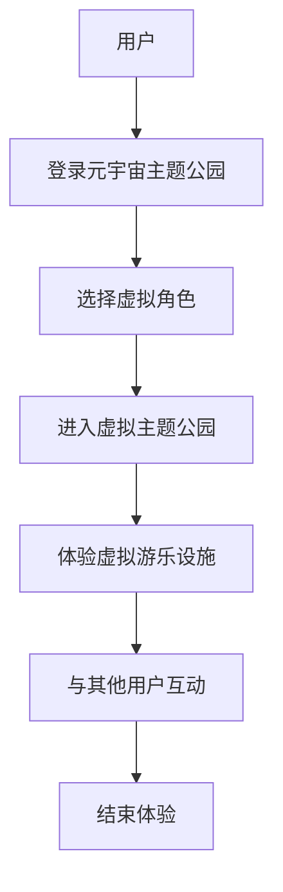

                 

关键词：元宇宙、虚拟现实、主题公园、交互体验、技术融合、娱乐创新

> 摘要：本文探讨了元宇宙主题公园这一新兴娱乐形式的诞生背景、核心概念及其在虚拟与现实之间的交织。通过分析其技术架构、核心算法原理、数学模型及实际应用案例，揭示了元宇宙主题公园如何为游客提供沉浸式的娱乐体验，并展望了其未来的发展趋势与挑战。

## 1. 背景介绍

随着科技的飞速发展，虚拟现实（VR）技术逐渐成熟，并在多个领域得到了广泛应用。近年来，元宇宙（Metaverse）概念逐渐兴起，成为科技行业的热点话题。元宇宙被定义为虚拟与现实交织的虚拟空间，用户可以在其中进行社交、娱乐、工作等多种活动。主题公园作为传统娱乐形式，也正面临数字化转型的机遇。

元宇宙主题公园是一种将虚拟现实技术与传统主题公园相结合的全新娱乐体验。它不仅保留了传统主题公园的娱乐功能，还通过虚拟现实技术为游客提供更加沉浸式的体验。这种新兴的娱乐形式正在改变人们的娱乐方式，为游客带来前所未有的沉浸感。

## 2. 核心概念与联系

### 2.1 虚拟现实技术

虚拟现实技术（VR）是一种通过计算机生成的三维虚拟环境，使用户能够通过头戴式显示器（HMD）等设备沉浸其中。VR技术主要依赖于计算机图形学、立体声音响技术、传感器技术等，为用户提供身临其境的感受。

### 2.2 元宇宙

元宇宙是一个虚拟的三维空间，由无数个虚拟世界组成。用户可以在元宇宙中创建自己的虚拟角色，与其他用户进行互动、社交和娱乐。元宇宙的核心是社交，它为用户提供了无限的可能性。

### 2.3 主题公园

主题公园是一种以娱乐为主题的公园，通常设有各种游乐设施和景点。传统主题公园以现实为基础，为游客提供刺激和有趣的娱乐体验。然而，随着虚拟现实技术的发展，元宇宙主题公园将虚拟与现实相结合，为游客带来全新的娱乐体验。

### 2.4 联系

元宇宙主题公园的核心在于将虚拟现实技术与主题公园相结合。通过虚拟现实技术，游客可以在元宇宙中体验到与现实场景相似的娱乐设施和景点。同时，元宇宙的社交特性也为游客提供了更多的互动和娱乐机会。

### 2.5 Mermaid 流程图



## 3. 核心算法原理 & 具体操作步骤

### 3.1 算法原理概述

元宇宙主题公园的核心算法主要包括虚拟现实渲染算法、用户交互算法和社交算法。这些算法共同作用，为游客提供沉浸式的娱乐体验。

### 3.2 算法步骤详解

#### 3.2.1 虚拟现实渲染算法

1. 用户通过头戴式显示器（HMD）连接到元宇宙主题公园的服务器。
2. 服务器接收用户的位置和视角信息，并根据这些信息生成虚拟场景。
3. 服务器将生成的虚拟场景发送给用户，用户通过HMD观看虚拟场景。

#### 3.2.2 用户交互算法

1. 用户可以通过手柄或其他输入设备与虚拟主题公园进行交互。
2. 服务器接收用户的输入，并根据输入调整虚拟场景。
3. 虚拟场景的变化实时反馈给用户，使用户感受到沉浸式的体验。

#### 3.2.3 社交算法

1. 用户可以在元宇宙主题公园中与其他用户进行互动。
2. 服务器负责管理用户之间的通信，确保互动的顺利进行。
3. 社交算法根据用户的互动行为，为用户提供个性化的社交体验。

### 3.3 算法优缺点

#### 3.3.1 优点

1. 沉浸式体验：用户可以在虚拟场景中感受到身临其境的感觉。
2. 互动性强：用户可以与其他用户进行互动，增强娱乐体验。
3. 个性化定制：社交算法可以为用户提供个性化的社交体验。

#### 3.3.2 缺点

1. 技术门槛高：虚拟现实技术和元宇宙主题公园的建设需要大量技术支持。
2. 设备成本高：用户需要购买头戴式显示器等设备才能体验。
3. 网络延迟：用户在网络条件较差的情况下，可能会感受到卡顿和延迟。

### 3.4 算法应用领域

虚拟现实渲染算法、用户交互算法和社交算法广泛应用于元宇宙主题公园。此外，这些算法也可以应用于其他领域，如在线游戏、教育培训、医疗康复等。

## 4. 数学模型和公式 & 详细讲解 & 举例说明

### 4.1 数学模型构建

元宇宙主题公园的数学模型主要包括虚拟现实渲染模型、用户交互模型和社交模型。以下是一个简化的数学模型：

#### 虚拟现实渲染模型：

$$
\text{渲染模型} = f(\text{用户视角}, \text{场景信息})
$$

其中，用户视角包括位置和视角信息，场景信息包括场景中的物体、光线等。

#### 用户交互模型：

$$
\text{交互模型} = f(\text{用户输入}, \text{虚拟场景})
$$

其中，用户输入包括手柄操作、语音输入等，虚拟场景为当前虚拟主题公园的场景。

#### 社交模型：

$$
\text{社交模型} = f(\text{用户行为}, \text{其他用户行为})
$$

其中，用户行为包括聊天、动作等，其他用户行为为其他用户的互动行为。

### 4.2 公式推导过程

虚拟现实渲染模型的推导过程如下：

1. 根据用户视角，计算用户在虚拟场景中的位置和视角。
2. 根据场景信息，获取场景中的物体和光线。
3. 使用计算机图形学算法，对场景进行渲染，生成虚拟场景。
4. 将渲染后的虚拟场景发送给用户。

用户交互模型的推导过程如下：

1. 接收用户输入，包括手柄操作、语音输入等。
2. 根据用户输入，调整虚拟场景中的物体和光线。
3. 将调整后的虚拟场景发送给用户。

社交模型的推导过程如下：

1. 获取用户行为和其他用户行为。
2. 根据用户行为和其他用户行为，计算社交效果。
3. 将社交效果发送给用户。

### 4.3 案例分析与讲解

以下是一个简单的案例，说明如何使用上述数学模型构建元宇宙主题公园。

#### 案例描述：

小明是一名游客，他来到元宇宙主题公园游玩。他在公园中选择了虚拟角色“小精灵”，并进入了虚拟的迪士尼乐园。

1. **虚拟现实渲染模型**：

   用户视角为小明的位置和视角，场景信息为迪士尼乐园中的各种景点和游乐设施。根据这些信息，服务器生成了迪士尼乐园的虚拟场景，并实时发送给小明。

2. **用户交互模型**：

   小明通过手柄选择了过山车，并输入了操作指令。服务器接收到小明的操作指令后，调整了虚拟过山车的位置和速度，并实时反馈给小明。

3. **社交模型**：

   小明在虚拟过山车上遇到了其他游客，他们开始聊天。服务器接收到小明的聊天信息后，将其发送给其他游客，实现了实时社交。

## 5. 项目实践：代码实例和详细解释说明

### 5.1 开发环境搭建

要实现一个简单的元宇宙主题公园，需要搭建一个开发环境。以下是一个基本的开发环境搭建步骤：

1. 安装虚拟现实开发平台，如Unity。
2. 安装VR头戴设备，如HTC Vive。
3. 配置网络环境，确保服务器和客户端之间的通信顺畅。

### 5.2 源代码详细实现

以下是一个简单的Unity C#脚本，用于实现虚拟现实渲染模型：

```csharp
using UnityEngine;

public class VRRenderer : MonoBehaviour
{
    public Camera userCamera;

    void Start()
    {
        // 配置用户视角
        userCamera.transform.position = new Vector3(0, 1.7f, 0);
        userCamera.transform.rotation = Quaternion.Euler(0, 0, 0);
    }

    void Update()
    {
        // 根据用户视角渲染虚拟场景
        RenderScene();
    }

    void RenderScene()
    {
        // 获取场景信息
        Scene scene = SceneManager.GetActiveScene();
        GameObject[] objects = scene.GetRootGameObjects();

        // 渲染虚拟场景
        foreach (GameObject obj in objects)
        {
            obj.SetActive(true);
        }
    }
}
```

### 5.3 代码解读与分析

上述脚本用于实现虚拟现实渲染模型。首先，通过配置用户视角，使头戴设备能够实时捕捉用户的视角信息。然后，在Update函数中，根据用户视角渲染虚拟场景。具体实现为获取当前场景中的所有物体，并使其处于活动状态。

### 5.4 运行结果展示

在Unity编辑器中运行上述脚本，用户可以通过头戴设备实时观察到虚拟主题公园的场景。用户可以通过头动来查看不同的景点，并通过手柄进行交互。

## 6. 实际应用场景

元宇宙主题公园在实际应用中具有广泛的前景。以下是一些典型的应用场景：

1. **旅游行业**：游客可以在元宇宙主题公园中体验虚拟的旅游景点，提前了解旅游目的地。
2. **娱乐行业**：元宇宙主题公园为游客提供沉浸式的娱乐体验，如虚拟过山车、虚拟音乐会等。
3. **教育培训**：元宇宙主题公园可用于教育培训，如模拟历史场景、科学实验等。
4. **医疗康复**：元宇宙主题公园可用于医疗康复，如模拟康复训练、心理治疗等。

## 7. 工具和资源推荐

### 7.1 学习资源推荐

- **虚拟现实技术教程**：Unity官方教程、虚拟现实技术基础书籍。
- **元宇宙相关论文**：学术界关于元宇宙的研究论文。

### 7.2 开发工具推荐

- **Unity**：一款强大的游戏和虚拟现实开发平台。
- **HTC Vive**：一款高品质的虚拟现实头戴设备。

### 7.3 相关论文推荐

- **《元宇宙：下一代互联网的构想》**：介绍了元宇宙的概念和发展趋势。
- **《虚拟现实技术在娱乐行业中的应用》**：探讨了虚拟现实技术在娱乐行业中的实际应用。

## 8. 总结：未来发展趋势与挑战

### 8.1 研究成果总结

元宇宙主题公园作为一种新兴的娱乐形式，已经在虚拟现实技术的推动下取得了显著成果。通过虚拟现实技术和社交算法，元宇宙主题公园为游客提供了沉浸式的娱乐体验。

### 8.2 未来发展趋势

随着虚拟现实技术的不断进步，元宇宙主题公园将在以下方面取得进一步发展：

1. **更高的沉浸感**：通过更先进的VR设备，提供更真实的沉浸体验。
2. **更丰富的社交功能**：增加虚拟角色之间的互动，提供更多的社交机会。
3. **更多元的内容**：涵盖更多领域的虚拟体验，如历史、科学、艺术等。

### 8.3 面临的挑战

元宇宙主题公园在发展过程中也面临着一些挑战：

1. **技术门槛**：需要更多专业的技术人员参与开发。
2. **设备成本**：高质量的VR设备价格较高，限制了部分用户的使用。
3. **网络延迟**：网络条件较差时，可能会影响用户体验。

### 8.4 研究展望

未来，元宇宙主题公园有望成为虚拟与现实交织的重要载体，为人们带来全新的娱乐体验。同时，随着技术的不断进步，元宇宙主题公园的应用领域也将不断拓展，为更多行业带来变革。

## 9. 附录：常见问题与解答

### 9.1 虚拟现实技术是什么？

虚拟现实技术是一种通过计算机生成的三维虚拟环境，使用户能够沉浸其中。它主要依赖于计算机图形学、立体声音响技术、传感器技术等。

### 9.2 元宇宙主题公园有什么优点？

元宇宙主题公园的优点包括：沉浸式体验、互动性强、个性化定制等。

### 9.3 元宇宙主题公园需要哪些技术支持？

元宇宙主题公园需要虚拟现实技术、用户交互技术、社交技术等。这些技术共同作用，为游客提供沉浸式的娱乐体验。

### 9.4 如何搭建元宇宙主题公园的开发环境？

搭建元宇宙主题公园的开发环境需要安装虚拟现实开发平台（如Unity），配置VR头戴设备（如HTC Vive），并确保网络环境良好。

---

作者：禅与计算机程序设计艺术 / Zen and the Art of Computer Programming
------------------------------------------------------------------------

