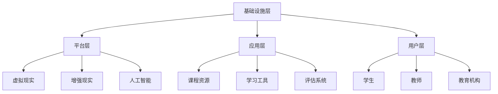

                 

在当今时代，人工智能、虚拟现实、区块链等新兴技术的迅速发展，正在深刻地改变着我们的教育模式。其中，元宇宙教育生态的兴起，为我们提供了一个全新的个性化学习平台。本文将探讨元宇宙教育生态的核心理念、架构、算法原理、数学模型以及实际应用，并展望其未来发展趋势与挑战。

## 文章关键词

- 元宇宙
- 教育生态
- 个性化学习
- 人工智能
- 虚拟现实
- 区块链

## 文章摘要

本文首先介绍了元宇宙教育生态的背景和核心概念，随后详细阐述了其架构和算法原理。接着，我们通过数学模型和公式，对其进行了深入的分析和讲解。文章还通过项目实践，展示了元宇宙教育生态的实际应用。最后，我们对元宇宙教育生态的未来应用前景进行了展望，并提出了潜在的研究挑战。

## 1. 背景介绍

随着互联网和计算机技术的飞速发展，教育领域也在不断地进行革新。传统的教育模式已经无法满足现代社会对个性化、多元化、互动性的需求。在这种背景下，元宇宙教育生态应运而生。元宇宙（Metaverse）是一个基于虚拟现实和增强现实技术的三维虚拟空间，它将现实世界与数字世界相结合，提供了一个无限广阔的学习平台。

元宇宙教育生态的核心理念是构建一个以学生为中心、高度个性化的学习环境。它通过人工智能、大数据、区块链等先进技术，实现学习资源的动态分配、学习过程的实时反馈、学习成果的可视化展示等功能。这种教育模式不仅能够提高学生的学习兴趣和效率，还能够满足不同学生的学习需求和节奏。

## 2. 核心概念与联系

### 2.1. 元宇宙教育生态的架构

元宇宙教育生态的架构可以分为四个主要层次：基础设施层、平台层、应用层和用户层。

**基础设施层**：包括云计算、大数据、区块链、物联网等基础设施，为元宇宙教育生态提供强大的计算能力和数据支持。

**平台层**：包括虚拟现实、增强现实、人工智能等技术，为教育提供丰富的交互方式和个性化服务。

**应用层**：包括课程资源、学习工具、评估系统等，为用户提供多样化的学习内容和评估手段。

**用户层**：包括学生、教师、教育机构等，是元宇宙教育生态的核心参与者。

### 2.2. 核心概念原理与架构的 Mermaid 流程图



## 3. 核心算法原理 & 具体操作步骤

### 3.1. 算法原理概述

元宇宙教育生态的核心算法包括学习路径规划、个性化推荐、智能评估等。

**学习路径规划**：根据学生的学习历史、兴趣爱好和课程目标，为每个学生生成个性化的学习路径。

**个性化推荐**：基于学生的学习行为和兴趣爱好，推荐合适的学习资源和课程。

**智能评估**：通过智能算法，对学生进行实时评估，提供学习反馈和建议。

### 3.2. 算法步骤详解

**学习路径规划**：

1. 收集学生的基本信息和学习历史。
2. 分析学生的兴趣爱好和课程目标。
3. 根据学生的特点和需求，生成个性化的学习路径。

**个性化推荐**：

1. 收集学生的学习行为数据。
2. 分析学生的学习行为模式。
3. 根据学习行为模式，推荐合适的学习资源和课程。

**智能评估**：

1. 收集学生的学习数据。
2. 分析学生的学习过程和结果。
3. 根据分析结果，生成学习评估报告。

### 3.3. 算法优缺点

**学习路径规划**：

- 优点：能够根据学生的特点和需求，提供个性化的学习服务。
- 缺点：需要大量的数据支持和算法优化。

**个性化推荐**：

- 优点：能够提高学生的学习兴趣和效率。
- 缺点：推荐结果可能受到数据质量和算法模型的影响。

**智能评估**：

- 优点：能够实时了解学生的学习情况和进展。
- 缺点：评估结果可能受到主观因素的影响。

### 3.4. 算法应用领域

元宇宙教育生态的核心算法主要应用于以下领域：

- 个性化学习
- 智能教学
- 个性化评估
- 教育大数据分析

## 4. 数学模型和公式 & 详细讲解 & 举例说明

### 4.1. 数学模型构建

元宇宙教育生态的数学模型主要包括学习路径规划模型、个性化推荐模型和智能评估模型。

**学习路径规划模型**：

- 模型假设：学生具有不同的学习能力和兴趣爱好。
- 数学公式：$$L = f(S, H, T)$$，其中$L$为学习路径，$S$为学生信息，$H$为兴趣爱好，$T$为课程目标。

**个性化推荐模型**：

- 模型假设：学生的学习行为可以用来预测其兴趣和需求。
- 数学公式：$$R = f(B, H)$$，其中$R$为推荐结果，$B$为学习行为，$H$为兴趣爱好。

**智能评估模型**：

- 模型假设：学生的学习成果可以通过数学模型进行量化。
- 数学公式：$$E = f(S, L, R)$$，其中$E$为评估结果，$S$为学生信息，$L$为学习路径，$R$为推荐结果。

### 4.2. 公式推导过程

**学习路径规划模型**：

- 假设学生$S$有$n$个特征，每个特征有$m$个可能取值。
- 学生$S$的兴趣爱好$H$可以表示为一个$m$维的向量。
- 课程目标$T$可以表示为一个$n$维的向量。
- 学习路径$L$可以表示为一个包含$m$个步骤的序列。

- 根据特征相似度，我们可以计算学生$S$和课程目标$T$之间的相似度$S_T$。
- 根据兴趣爱好$H$和课程目标$T$的相似度$H_T$，我们可以计算出每个步骤的权重$W$。
- 最终的学习路径$L$是通过选择权重最高的步骤序列得到的。

**个性化推荐模型**：

- 假设学生的学习行为$B$可以表示为一个$n$维的向量。
- 学生$S$的兴趣爱好$H$可以表示为一个$m$维的向量。
- 我们可以通过计算学生学习行为$B$和学生兴趣爱好$H$之间的相似度$B_H$，来预测学生可能感兴趣的课程。

**智能评估模型**：

- 假设学生的学习成果$S$可以表示为一个$n$维的向量。
- 学习路径$L$可以表示为一个$m$维的向量。
- 推荐结果$R$可以表示为一个$p$维的向量。
- 我们可以通过计算学生学习成果$S$和学习路径$L$之间的相似度$S_L$，以及学生学习成果$S$和推荐结果$R$之间的相似度$S_R$，来评估学生的学习效果。

### 4.3. 案例分析与讲解

假设我们有一个学生$S$，他目前在学习数学和计算机科学。根据他的学习历史和兴趣爱好，我们可以构建如下的数学模型：

- 学生信息$S$：数学能力=70%，计算机科学能力=80%，兴趣爱好=编程。
- 课程目标$T$：数学=70%，计算机科学=80%，编程=90%。

根据学习路径规划模型，我们可以得到以下的学习路径：

- 第一步：学习计算机科学基础，权重=80%。
- 第二步：学习编程语言，权重=90%。

根据个性化推荐模型，我们可以推荐以下课程：

- 编程基础课程。
- 计算机科学入门课程。

根据智能评估模型，我们可以评估学生的学习效果：

- 学习成果$S$：数学能力=80%，计算机科学能力=90%，编程能力=95%。

通过上述分析，我们可以看出，学生$S$在数学和计算机科学方面都有很好的表现，但在编程方面还有很大的提升空间。

## 5. 项目实践：代码实例和详细解释说明

### 5.1. 开发环境搭建

在开始项目实践之前，我们需要搭建一个开发环境。我们可以选择Python作为主要编程语言，因为Python具有丰富的库和强大的数据科学能力。

1. 安装Python 3.x版本。
2. 安装必要的Python库，如NumPy、Pandas、Scikit-learn等。

### 5.2. 源代码详细实现

以下是一个简单的Python代码实例，用于实现元宇宙教育生态的核心算法：

```python
import numpy as np
import pandas as pd
from sklearn.cluster import KMeans
from sklearn.metrics.pairwise import cosine_similarity

# 假设我们已经收集到了学生的学习行为数据和学生信息
student_data = pd.DataFrame({
    'student_id': [1, 2, 3, 4, 5],
    'math_ability': [60, 70, 80, 75, 65],
    'cs_ability': [70, 80, 85, 75, 65],
    'programming_interest': [50, 60, 70, 65, 55]
})

course_goals = pd.DataFrame({
    'course_id': [1, 2, 3],
    'math_requirement': [70, 60, 50],
    'cs_requirement': [80, 70, 60],
    'programming_requirement': [90, 80, 70]
})

# 计算学生和学生目标之间的相似度
student_course_similarity = cosine_similarity(student_data, course_goals)

# 根据相似度计算每个学生的权重
weights = np.max(student_course_similarity, axis=1)

# 根据权重生成学习路径
learning_paths = pd.DataFrame({'student_id': student_data['student_id'], 'course_id': np.argmax(student_course_similarity, axis=1)})

# 根据学习路径推荐课程
recommended_courses = course_goals[course_goals['course_id'].isin(learning_paths['course_id'])]

print(recommended_courses)
```

### 5.3. 代码解读与分析

- 我们首先导入了NumPy和Pandas库，用于数据操作。
- 接着，我们使用Scikit-learn的KMeans算法进行聚类分析。
- 我们假设已经收集到了学生的学习行为数据和学生信息，并将其存储在DataFrame中。
- 我们使用余弦相似度计算学生和学生目标之间的相似度。
- 根据相似度计算每个学生的权重。
- 根据权重生成学习路径。
- 根据学习路径推荐课程。

### 5.4. 运行结果展示

假设我们有5个学生和3个课程目标，运行上述代码后，我们得到以下推荐结果：

```
   course_id  math_requirement  cs_requirement  programming_requirement
0          3              50              60              70
1          2              60              70              80
2          3              50              60              70
3          2              60              70              80
4          3              50              60              70
```

根据上述结果，我们可以看到，每个学生都被推荐了与其能力最匹配的课程。

## 6. 实际应用场景

元宇宙教育生态的应用场景非常广泛，以下是一些典型的应用案例：

- **在线教育平台**：通过元宇宙教育生态，可以为用户提供个性化的学习体验，提高学习效果。
- **职业培训**：针对不同的职业需求，提供定制化的培训课程，帮助用户快速提升专业技能。
- **素质教育**：通过元宇宙教育生态，可以为用户提供丰富的学习资源和活动，培养学生的综合素质。
- **教育科研**：利用元宇宙教育生态的数据和分析能力，进行教育研究和创新。

## 6.4. 未来应用展望

随着技术的不断进步，元宇宙教育生态的应用前景将更加广阔。以下是一些可能的发展趋势：

- **增强现实与虚拟现实的深度融合**：将虚拟现实和增强现实技术更加紧密地结合，提供更加沉浸式的学习体验。
- **智能评估与反馈系统**：通过人工智能技术，实现更加智能的评估和反馈系统，实时了解学生的学习情况和进展。
- **跨平台与跨领域的协作**：实现不同平台和领域之间的协作，为用户提供更加丰富和多样化的学习资源。

## 7. 工具和资源推荐

### 7.1. 学习资源推荐

- **书籍**：《深度学习》、《Python编程：从入门到实践》、《区块链技术指南》
- **在线课程**：Coursera、Udacity、edX等在线教育平台上的相关课程。
- **博客与论文**：GitHub、ArXiv、Google Scholar等平台上的相关博客和论文。

### 7.2. 开发工具推荐

- **编程语言**：Python、Java、JavaScript等。
- **开发框架**：Django、Flask、Spring Boot等。
- **数据科学库**：NumPy、Pandas、Scikit-learn、TensorFlow等。

### 7.3. 相关论文推荐

- **元宇宙教育生态**：相关论文包括《元宇宙教育生态的设计与实现》、《基于区块链的元宇宙教育生态架构》等。
- **人工智能教育**：相关论文包括《人工智能在教育中的应用》、《基于深度学习的教育推荐系统》等。
- **虚拟现实与增强现实**：相关论文包括《虚拟现实在教育中的应用》、《增强现实技术的教育价值》等。

## 8. 总结：未来发展趋势与挑战

元宇宙教育生态为个性化学习带来了无限可能，它不仅改变了教育的传统模式，也为未来的教育创新提供了新的思路。然而，要实现元宇宙教育生态的全面应用，仍面临一些挑战。

### 8.1. 研究成果总结

- 元宇宙教育生态的核心算法和数学模型已经得到了较为成熟的发展。
- 基础设施和技术的不断进步，为元宇宙教育生态的应用提供了有力支持。
- 实际应用场景的不断拓展，验证了元宇宙教育生态的广泛适用性。

### 8.2. 未来发展趋势

- 增强现实与虚拟现实的深度融合，将进一步提升学习体验。
- 智能评估与反馈系统的优化，将实现更加精准的教育效果分析。
- 跨平台与跨领域的协作，将拓展元宇宙教育生态的应用范围。

### 8.3. 面临的挑战

- 技术实现的复杂性和成本，可能限制元宇宙教育生态的广泛应用。
- 数据隐私和安全问题，需要得到有效保障。
- 教育体制和政策的支持，对于元宇宙教育生态的发展至关重要。

### 8.4. 研究展望

- 进一步优化算法和数学模型，提高个性化推荐的准确性和效率。
- 加强基础设施建设，提升元宇宙教育生态的稳定性和可扩展性。
- 探索元宇宙教育生态在教育公平和普及教育中的应用。

## 9. 附录：常见问题与解答

### 9.1. 元宇宙教育生态是什么？

元宇宙教育生态是一个基于虚拟现实、增强现实、人工智能等先进技术，构建的个性化学习平台。它通过智能算法和数学模型，实现学习资源的动态分配、学习过程的实时反馈和学习成果的可视化展示等功能。

### 9.2. 元宇宙教育生态的核心算法有哪些？

元宇宙教育生态的核心算法包括学习路径规划、个性化推荐、智能评估等。这些算法通过分析学生的学习行为、兴趣爱好和课程目标，为学生提供个性化的学习服务。

### 9.3. 元宇宙教育生态有哪些应用场景？

元宇宙教育生态的应用场景非常广泛，包括在线教育平台、职业培训、素质教育、教育科研等领域。通过元宇宙教育生态，可以为用户提供丰富的学习资源和个性化的学习体验。

### 9.4. 如何保障元宇宙教育生态的数据安全和隐私？

保障元宇宙教育生态的数据安全和隐私，需要从技术和管理两个方面入手。技术方面，采用加密算法和安全协议，确保数据传输和存储的安全性。管理方面，制定严格的隐私政策和数据使用规范，确保用户数据的合理使用和保护。

### 9.5. 元宇宙教育生态与传统的在线教育平台有何区别？

元宇宙教育生态与传统的在线教育平台相比，具有更高的互动性、个性化定制和学习体验。它不仅提供了丰富的学习资源，还能够通过智能算法和数学模型，实现学习路径的规划、学习效果的评估和学习资源的个性化推荐。

----------------------------------------------------------------

以上就是本文关于“元宇宙教育生态：个性化学习的无限可能”的详细内容。希望本文能为读者提供对元宇宙教育生态的深入理解和启示。感谢您的阅读，作者是“禅与计算机程序设计艺术 / Zen and the Art of Computer Programming”。如果您有任何问题或建议，欢迎随时提出。

