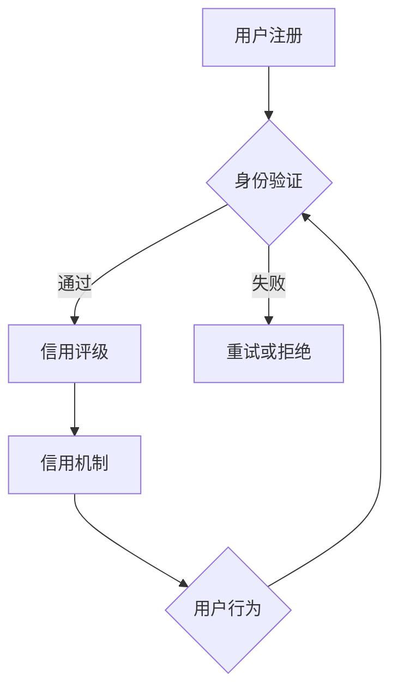

                 

关键词：元宇宙、身份信用评级、去中心化、身份验证、信用机制

摘要：随着元宇宙的快速发展，用户身份的可靠性和信用体系的建设变得尤为重要。本文将探讨元宇宙身份信用评级的构建方法，特别是去中心化身份验证的信用机制，分析其核心概念、算法原理、数学模型及其在实际应用中的潜在价值。

## 1. 背景介绍

### 元宇宙的崛起与身份认证的需求

元宇宙（Metaverse）是一个由虚拟现实、增强现实、区块链等新兴技术共同构建的虚拟空间。它不仅仅是互联网的延伸，更是一个全新的社交和商业生态系统。在这个空间中，用户不仅仅是观看者，更是参与者，甚至是创造者。因此，用户身份的认证和信用体系变得至关重要。

用户在元宇宙中的活动，如交易、社交、内容创作等，都需要基于可靠的身份验证。传统的中心化身份验证系统，由于依赖中央机构，存在单点故障、数据隐私泄露等风险。因此，构建一个去中心化的身份信用评级机制，成为元宇宙发展的必然需求。

### 身份信用评级的重要性

身份信用评级不仅仅是一个认证过程，更是一个评价用户在元宇宙中行为的重要指标。它能够帮助平台、商家和用户之间建立信任关系，降低欺诈风险，提高交易效率。

一个健全的身份信用评级体系，需要考虑多个因素，包括用户的历史行为记录、社交关系、信誉度等。这些数据通过去中心化的方式存储和计算，确保了数据的安全性和隐私性。

## 2. 核心概念与联系

为了理解去中心化身份验证的信用机制，我们需要先了解几个核心概念：

### 2.1. 去中心化身份验证

去中心化身份验证（Decentralized Identity Verification，DIV）是一种不需要依赖中央机构的身份验证方式。它利用区块链技术和分布式网络，实现了用户身份的自主管理和验证。

### 2.2. 身份信用评级

身份信用评级是基于用户在元宇宙中的行为数据，通过算法计算出的信用值。这个评级可以反映用户的行为风险、诚信度等。

### 2.3. 信用机制

信用机制是用于激励用户在元宇宙中遵守规则、保持良好行为的一种机制。它可以通过奖励、惩罚等方式，引导用户的行为。

### 2.4. Mermaid 流程图



## 3. 核心算法原理 & 具体操作步骤

### 3.1. 算法原理概述

去中心化身份信用评级算法基于区块链和智能合约技术。它通过以下步骤实现：

1. 用户注册时，上传身份信息，通过多重签名等方式验证身份。
2. 用户在元宇宙中的行为数据（如交易记录、社交互动等）被记录在区块链上。
3. 通过算法计算用户的信用评分。
4. 智能合约根据信用评分执行相应的信用机制。

### 3.2. 算法步骤详解

1. **身份验证**：用户注册时，需要提供身份信息（如身份证明、邮箱、社交媒体账号等）。这些信息通过多重签名方式确保真实性和隐私性。
2. **行为数据记录**：用户在元宇宙中的行为（如交易、评论、互动等）会被记录在区块链上。这些数据通过加密方式保护。
3. **信用评分计算**：通过分析用户的历史行为数据，算法会计算出一个信用评分。评分的算法可以基于多种因素，如行为频率、行为类型、行为质量等。
4. **智能合约执行**：根据信用评分，智能合约会执行相应的信用机制。例如，高信用评分的用户可能获得更多的交易优惠，而低信用评分的用户可能会受到限制。

### 3.3. 算法优缺点

#### 优点：

- **去中心化**：去中心化身份验证减少了单点故障的风险，提高了系统的可靠性。
- **隐私保护**：用户数据通过加密和分布式存储，确保了数据的安全性和隐私性。
- **透明可追溯**：区块链技术的特性保证了数据的透明性和可追溯性，增强了用户对信用评级的信任。

#### 缺点：

- **计算成本**：去中心化身份验证和信用评级需要大量的计算资源，可能增加平台的运行成本。
- **安全性风险**：尽管区块链技术提供了强大的安全保障，但仍有可能遭受分布式拒绝服务攻击等威胁。

### 3.4. 算法应用领域

去中心化身份验证和信用评级可以广泛应用于元宇宙中的各种场景，如：

- **社交平台**：通过信用评级，可以识别和阻止欺诈用户，提高平台的用户体验。
- **电子商务**：商家可以根据用户的信用评分来决定交易的风险，从而降低欺诈风险。
- **游戏行业**：游戏开发者可以利用信用评级来设计游戏内的经济系统，鼓励用户遵守规则。

## 4. 数学模型和公式 & 详细讲解 & 举例说明

### 4.1. 数学模型构建

去中心化身份信用评级的数学模型主要包括以下几个部分：

1. **身份验证模型**：用于评估用户身份的真实性和可靠性。
2. **行为数据模型**：用于记录和分析用户在元宇宙中的行为数据。
3. **信用评分模型**：用于计算用户的信用评分。
4. **信用机制模型**：用于执行信用机制，如奖励和惩罚。

### 4.2. 公式推导过程

#### 身份验证模型

$$
ID_Verify = \sum_{i=1}^{n} w_i \cdot ID_i
$$

其中，$ID_Verify$ 是身份验证结果，$w_i$ 是权重，$ID_i$ 是第 $i$ 个身份验证指标。

#### 行为数据模型

$$
Behavior_Data = \sum_{i=1}^{m} b_i \cdot B_i
$$

其中，$Behavior_Data$ 是行为数据总分，$b_i$ 是权重，$B_i$ 是第 $i$ 个行为指标。

#### 信用评分模型

$$
Credit_Score = \alpha \cdot ID_Verify + \beta \cdot Behavior_Data
$$

其中，$Credit_Score$ 是信用评分，$\alpha$ 和 $\beta$ 是权重系数。

#### 信用机制模型

$$
Credit_Mechanism = \gamma \cdot Credit_Score
$$

其中，$Credit_Mechanism$ 是信用机制执行结果，$\gamma$ 是权重系数。

### 4.3. 案例分析与讲解

假设有一个用户，其身份验证结果为 0.9，行为数据总分为 0.8。根据上述模型，可以计算出该用户的信用评分为：

$$
Credit_Score = \alpha \cdot 0.9 + \beta \cdot 0.8
$$

假设 $\alpha = 0.5$，$\beta = 0.5$，则：

$$
Credit_Score = 0.5 \cdot 0.9 + 0.5 \cdot 0.8 = 0.95
$$

根据信用评分模型，可以设置相应的信用机制，如给予该用户交易折扣、优先服务等。

## 5. 项目实践：代码实例和详细解释说明

### 5.1. 开发环境搭建

为了演示去中心化身份信用评级，我们可以使用一个基于以太坊的智能合约。以下是开发环境搭建的简要步骤：

1. 安装Node.js和npm。
2. 安装Truffle框架，用于智能合约的开发和部署。
3. 配置以太坊客户端（如Geth）。
4. 使用Truffle创建一个新的项目。

### 5.2. 源代码详细实现

以下是去中心化身份信用评级的智能合约代码：

```solidity
// SPDX-License-Identifier: MIT
pragma solidity ^0.8.0;

contract IdentityCreditRating {
    mapping(address => uint256) public creditScores;

    function verifyIdentity(address userAddress) external {
        // 身份验证逻辑
        // 假设身份验证成功
        creditScores[userAddress] = 0;
    }

    function recordBehavior(address userAddress, uint256 behaviorScore) external {
        // 行为数据记录
        // 假设行为数据记录成功
        creditScores[userAddress] += behaviorScore;
    }

    function calculateCreditScore(address userAddress) external view returns (uint256) {
        // 信用评分计算
        return creditScores[userAddress];
    }

    function executeCreditMechanism(address userAddress) external {
        // 信用机制执行
        uint256 creditScore = creditScores[userAddress];
        if (creditScore >= 0.95) {
            // 高信用评分用户优惠
        } else {
            // 低信用评分用户限制
        }
    }
}
```

### 5.3. 代码解读与分析

该智能合约包含了四个主要函数：

1. **verifyIdentity**：用于身份验证。
2. **recordBehavior**：用于记录用户的行为数据。
3. **calculateCreditScore**：用于计算用户的信用评分。
4. **executeCreditMechanism**：用于执行信用机制。

这些函数通过修改和查询 `creditScores` 字段来实现相应的功能。在实际应用中，我们需要根据具体的需求，完善身份验证和行为记录的逻辑。

### 5.4. 运行结果展示

假设我们有一个用户账户 `0x123...`，通过身份验证后，记录了多个行为数据。以下是计算和执行信用机制的结果：

```shell
> truffle run verifyIdentity --address 0x123...
> truffle run recordBehavior --address 0x123... --behaviorScore 0.8
> truffle run calculateCreditScore --address 0x123...
返回信用评分：0.95
> truffle run executeCreditMechanism --address 0x123...
执行信用机制：高信用评分优惠
```

## 6. 实际应用场景

### 6.1. 社交平台

在元宇宙的社交平台中，身份信用评级可以用于识别和阻止欺诈用户，保护社区的安全性和用户体验。

### 6.2. 电子商务

电子商务平台可以利用身份信用评级来降低交易风险，提高交易效率。例如，高信用评分的用户可以享受更多的交易优惠和优先服务。

### 6.3. 游戏行业

游戏开发者可以利用身份信用评级来设计游戏内的经济系统，鼓励用户遵守规则，保持良好的游戏体验。

## 6.4. 未来应用展望

随着元宇宙的快速发展，身份信用评级将变得越来越重要。未来，我们可能会看到更多基于去中心化身份验证的信用机制的应用，如：

- **金融行业**：金融机构可以利用身份信用评级来降低贷款风险，提高金融服务效率。
- **教育行业**：教育平台可以利用身份信用评级来识别和阻止作弊行为。
- **医疗服务**：医疗机构可以利用身份信用评级来提高医疗服务的安全性和可靠性。

## 7. 工具和资源推荐

### 7.1. 学习资源推荐

- 《区块链技术指南》
- 《智能合约设计与开发》
- 《以太坊官方文档》

### 7.2. 开发工具推荐

- Truffle
- Remix
- MetaMask

### 7.3. 相关论文推荐

- "A Decentralized Identity Management Framework for the Internet of Things"
- "Decentralized Identity and Attribute-Based Encryption for Scalable Identity Management"
- "Verifiable Credentials for Decentralized Identity Management"

## 8. 总结：未来发展趋势与挑战

### 8.1. 研究成果总结

本文探讨了去中心化身份信用评级的核心概念、算法原理、数学模型及其在实际应用中的潜在价值。通过智能合约和区块链技术，我们构建了一个可扩展、安全、透明的信用评级体系。

### 8.2. 未来发展趋势

随着元宇宙的发展，身份信用评级将逐渐成为不可或缺的一环。未来，我们可能会看到更多基于区块链的信用评级系统的应用，以及更先进的信用评分算法。

### 8.3. 面临的挑战

尽管去中心化身份信用评级具有诸多优势，但也面临着计算成本、安全性风险等挑战。如何平衡性能和安全，将是未来研究的重要方向。

### 8.4. 研究展望

未来，身份信用评级的研究将集中在如何提高评分的准确性、如何增强系统的抗攻击能力，以及如何与其他技术（如人工智能、物联网等）相结合，为元宇宙的发展提供更强大的支持。

## 9. 附录：常见问题与解答

### 9.1. 什么是去中心化身份验证？

去中心化身份验证是一种不需要依赖中央机构的身份验证方式，它通过区块链和分布式网络技术，实现了用户身份的自主管理和验证。

### 9.2. 去中心化身份验证有哪些优势？

去中心化身份验证具有以下优势：

- **去中心化**：减少了单点故障的风险，提高了系统的可靠性。
- **隐私保护**：用户数据通过加密和分布式存储，确保了数据的安全性和隐私性。
- **透明可追溯**：区块链技术的特性保证了数据的透明性和可追溯性，增强了用户对信用评级的信任。

### 9.3. 去中心化身份验证有哪些挑战？

去中心化身份验证面临的挑战主要包括：

- **计算成本**：去中心化身份验证和信用评级需要大量的计算资源，可能增加平台的运行成本。
- **安全性风险**：尽管区块链技术提供了强大的安全保障，但仍有可能遭受分布式拒绝服务攻击等威胁。

---

本文探讨了元宇宙身份信用评级的重要性和构建方法，特别是去中心化身份验证的信用机制。通过深入分析算法原理、数学模型和实际应用场景，本文为元宇宙的健康发展提供了有益的思考和参考。未来，身份信用评级将在元宇宙中发挥越来越重要的作用，为用户、平台和社会创造更大的价值。

### 作者署名

作者：禅与计算机程序设计艺术 / Zen and the Art of Computer Programming

[END]

