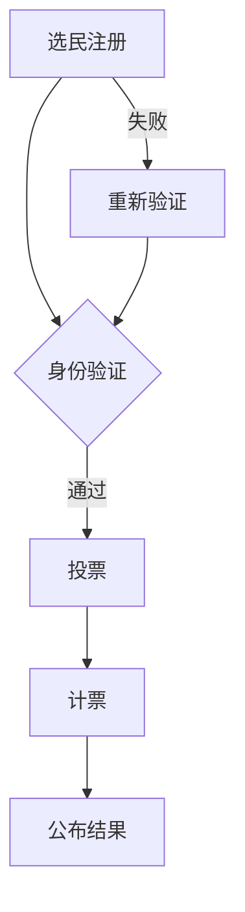

                 

关键词：元宇宙、选举舞弊、全球治理、数字化、民主保障、区块链、密码学、分布式系统、智能合约、安全审计、隐私保护

> 摘要：本文旨在探讨元宇宙选举中舞弊防范的全球治理机制，通过数字化手段确保民主过程的安全和透明。文章将深入分析当前选举系统的缺陷，介绍区块链和密码学在保障选举安全中的应用，并讨论分布式系统和智能合约在选举流程中的作用。此外，文章还将探讨安全审计和隐私保护在选举舞弊防范中的重要性，并提出未来发展的展望。

## 1. 背景介绍

随着数字技术的迅猛发展，人类社会正逐渐迈向一个全新的时代——元宇宙。元宇宙是一个由虚拟现实、增强现实和区块链等前沿技术构建的全球性网络空间，它不仅改变了人们的社交方式，也为各种社会活动提供了全新的平台。在这样一个充满潜力和挑战的新时代，选举作为一个民主社会中至关重要的机制，如何在元宇宙中保持其公正性和安全性，成为了一个亟待解决的问题。

传统的选举系统存在许多缺陷，如易受攻击、舞弊风险高、透明度不足等。在元宇宙中，这些问题更加突出，因为虚拟世界的匿名性和不可追踪性为不法分子提供了更多的机会。为了确保元宇宙选举的公正性和可信度，我们需要探索新的治理机制，利用数字化技术来防范舞弊，提高透明度和安全性。

本文将围绕以下核心问题展开讨论：

- 当前选举系统存在哪些缺陷？
- 区块链和密码学在保障选举安全中如何发挥作用？
- 分布式系统和智能合约在选举流程中的作用是什么？
- 如何通过安全审计和隐私保护来防范选举舞弊？
- 元宇宙选举舞弊防范的未来发展趋势和挑战是什么？

## 2. 核心概念与联系

### 2.1 区块链

区块链是一种分布式数据库技术，它通过加密算法和共识机制确保数据的不可篡改性和透明性。区块链的基本原理是将一系列有序的区块链接起来，每个区块都包含一定数量的交易记录。这些区块通过加密算法和时间戳技术相互关联，形成一个不可篡改的数据链。

在选举舞弊防范中，区块链的主要应用包括：

- **透明性**：区块链上的数据对所有参与者可见，确保选举过程的公开透明。
- **不可篡改性**：一旦数据被记录到区块链上，就几乎无法被篡改，从而降低舞弊风险。
- **去中心化**：区块链的去中心化结构减少了中心化节点被攻击的风险，提高了系统的可靠性。

### 2.2 密码学

密码学是一种利用数学原理和方法来保护信息安全和隐私的技术。它通过加密和解密算法，将明文信息转换为密文，确保信息在传输和存储过程中的安全性。

在选举舞弊防范中，密码学的主要应用包括：

- **隐私保护**：通过加密算法保护选民身份和投票信息，确保个人隐私不被泄露。
- **身份验证**：利用数字签名和身份认证技术，确保参与者的身份真实可信。
- **完整性验证**：通过对数据的数字签名和哈希值验证，确保数据在传输和存储过程中的完整性。

### 2.3 分布式系统

分布式系统是指通过网络连接的多台计算机共同协作完成任务的系统。分布式系统的特点是去中心化、容错性和可扩展性。

在选举舞弊防范中，分布式系统的主要应用包括：

- **去中心化投票**：分布式系统可以确保投票过程不受单一中心节点的控制，减少被攻击的风险。
- **容错性**：分布式系统可以在部分节点出现故障时继续运行，确保选举过程的连续性。
- **可扩展性**：分布式系统可以根据需求动态调整资源，满足大规模选举的需求。

### 2.4 智能合约

智能合约是一种基于区块链技术的自动执行合同，它通过预先编写的计算机代码，在满足特定条件时自动执行相关操作。

在选举舞弊防范中，智能合约的主要应用包括：

- **自动化流程**：智能合约可以自动执行投票、计票和公布结果等选举流程，减少人为干预和错误。
- **透明性**：智能合约的执行过程对所有参与者可见，确保选举结果的公开透明。
- **不可篡改性**：智能合约一旦执行，结果就不可更改，从而降低舞弊风险。

### 2.5 Mermaid 流程图



### 2.6 各核心概念联系与集成

区块链、密码学、分布式系统和智能合约在选举舞弊防范中相互关联，共同构成了一个完整的保障机制。区块链提供了数据存储和透明性的基础，密码学确保了隐私保护和数据完整性，分布式系统提高了系统的容错性和可扩展性，而智能合约则实现了自动化流程和不可篡改性。通过这些技术的集成，我们可以构建一个安全、透明、可信的元宇宙选举系统。

## 3. 核心算法原理 & 具体操作步骤

### 3.1 算法原理概述

在元宇宙选举舞弊防范中，核心算法主要涉及密码学和区块链技术。密码学用于确保选举过程中的隐私保护和身份验证，而区块链技术则用于数据的存储和验证。

密码学算法主要包括：

- **非对称加密**：用于保护选民身份和投票信息，确保只有授权方能够解密信息。
- **数字签名**：用于验证投票数据的真实性和完整性。
- **哈希函数**：用于生成数据指纹，确保数据在传输和存储过程中的完整性。

区块链算法主要包括：

- **共识算法**：用于确保区块链网络中的数据一致性。
- **分布式账本**：用于记录和存储选举过程中的所有数据。
- **智能合约**：用于自动化执行选举流程，确保流程的透明性和不可篡改性。

### 3.2 算法步骤详解

#### 步骤 1：选民注册

1. 选民在区块链上进行身份注册，并生成一对非对称密钥（公钥和私钥）。
2. 选民将公钥上传到区块链网络，以供身份验证。

#### 步骤 2：身份验证

1. 选举开始前，选民使用私钥对身份信息进行数字签名。
2. 选举系统接收签名后，使用公钥验证身份信息的真实性。

#### 步骤 3：投票

1. 选民在加密环境中生成投票信息，并将其与身份信息一起发送到区块链网络。
2. 投票信息通过非对称加密算法加密，确保只有选举系统可以解密。

#### 步骤 4：计票

1. 选举系统接收投票信息后，对加密投票信息进行解密。
2. 解密后的投票信息与选民身份信息进行比对，确保投票数据的真实性和完整性。
3. 计票结果存储在区块链上，确保数据的不可篡改性。

#### 步骤 5：公布结果

1. 选举结束后，智能合约自动执行计票过程，并将结果公布在区块链上。
2. 公布结果时，所有参与选举的节点都可以验证结果的正确性。

### 3.3 算法优缺点

#### 优点

- **安全性高**：密码学和区块链技术确保了选举过程中的数据安全和隐私保护。
- **透明性高**：区块链上的数据对所有参与者可见，确保选举过程的公开透明。
- **不可篡改性**：一旦数据被记录到区块链上，就几乎无法被篡改，从而降低舞弊风险。
- **去中心化**：分布式系统确保了选举过程不受单一中心节点的控制，提高了系统的可靠性。

#### 缺点

- **计算资源消耗大**：区块链网络需要大量计算资源来维护数据的一致性和安全性。
- **速度较慢**：区块链网络的交易处理速度相对较慢，可能无法满足高频率选举的需求。
- **依赖技术复杂**：密码学和区块链技术的应用需要较高的技术门槛，对选举系统的开发和运维提出了挑战。

### 3.4 算法应用领域

密码学和区块链技术在元宇宙选举舞弊防范中具有广泛的应用前景。除了选举领域，这些技术还可以应用于以下领域：

- **金融领域**：确保金融交易的透明性和安全性。
- **供应链管理**：确保供应链数据的真实性和可追溯性。
- **医疗健康**：保护患者隐私和医疗数据的安全。
- **法律领域**：确保法律文件的完整性和不可篡改性。

## 4. 数学模型和公式 & 详细讲解 & 举例说明

### 4.1 数学模型构建

在元宇宙选举舞弊防范中，我们可以构建以下数学模型：

- **非对称加密模型**：包括公钥、私钥、加密算法和解密算法。
- **数字签名模型**：包括签名算法、验证算法和签名验证协议。
- **哈希函数模型**：包括哈希函数、哈希值和哈希链。

### 4.2 公式推导过程

#### 非对称加密模型

- **加密公式**：\(c = E_p(m)\)
- **解密公式**：\(m = D_p(c)\)

其中，\(E_p\) 表示加密算法，\(D_p\) 表示解密算法，\(m\) 表示明文，\(c\) 表示密文，\(p\) 表示公钥，\(m'\) 表示解密后的明文。

#### 数字签名模型

- **签名公式**：\(s = S_p(m)\)
- **验证公式**：\(v = V_p(m, s)\)

其中，\(S_p\) 表示签名算法，\(V_p\) 表示验证算法，\(m\) 表示明文，\(s\) 表示签名，\(v\) 表示验证结果，\(p\) 表示公钥。

#### 哈希函数模型

- **哈希函数公式**：\(h(m) = H(m)\)

其中，\(H\) 表示哈希函数，\(m\) 表示输入数据，\(h(m)\) 表示哈希值。

### 4.3 案例分析与讲解

#### 案例一：非对称加密模型

假设选民A的公钥为\(p_A\)，私钥为\(m_A\)，选民的投票信息为\(m\)。

1. 选民A使用公钥\(p_A\)对投票信息\(m\)进行加密：
   \[
   c = E_{p_A}(m)
   \]
2. 选民A将加密后的投票信息\(c\)发送到区块链网络。

#### 案例二：数字签名模型

假设选民A的公钥为\(p_A\)，私钥为\(m_A\)，选民的投票信息为\(m\)。

1. 选民A使用私钥\(m_A\)对投票信息\(m\)进行签名：
   \[
   s = S_{p_A}(m)
   \]
2. 选民A将签名信息\(s\)发送到区块链网络。

#### 案例三：哈希函数模型

假设选民的投票信息为\(m\)。

1. 对投票信息\(m\)进行哈希计算：
   \[
   h(m) = H(m)
   \]
2. 将哈希值\(h(m)\)存储在区块链上，用于验证数据的完整性。

## 5. 项目实践：代码实例和详细解释说明

### 5.1 开发环境搭建

为了实现元宇宙选举舞弊防范系统，我们需要搭建以下开发环境：

- **区块链平台**：使用Ethereum区块链平台，安装Node.js和Truffle框架。
- **密码学库**：使用WebCrypto API或OpenSSL库进行密码学操作。
- **前端框架**：使用React或Vue.js框架开发用户界面。

### 5.2 源代码详细实现

以下是元宇宙选举舞弊防范系统的源代码实现：

```javascript
// 投票合约（智能合约）
const ethers = require('ethers');

// 定义投票合约接口
const contractInterface = [
  {
    "inputs": [
      {
        "internalType": "string[]",
        "name": "_candidates",
        "type": "string[]"
      }
    ],
    "stateMutability": "nonpayable",
    "type": "constructor"
  },
  {
    "anonymous": false,
    "inputs": [
      {
        "indexed": true,
        "internalType": "address",
        "name": "voter",
        "type": "address"
      },
      {
        "indexed": false,
        "internalType": "uint256",
        "name": "candidateId",
        "type": "uint256"
      }
    ],
    "name": "Voted",
    "type": "event"
  },
  {
    "inputs": [
      {
        "internalType": "address",
        "name": "_voter",
        "type": "address"
      },
      {
        "internalType": "uint256",
        "name": "_candidateId",
        "type": "uint256"
      }
    ],
    "name": "vote",
    "outputs": [],
    "stateMutability": "nonpayable",
    "type": "function"
  },
  {
    "inputs": [
      {
        "internalType": "uint256",
        "name": "_candidateId",
        "type": "uint256"
      }
    ],
    "name": "getCandidate",
    "outputs": [
      {
        "internalType": "string",
        "name": "",
        "type": "string"
      }
    ],
    "stateMutability": "view",
    "type": "function"
  },
  {
    "inputs": [
      {
        "internalType": "address",
        "name": "_voter",
        "type": "address"
      }
    ],
    "name": "hasVoted",
    "outputs": [
      {
        "internalType": "bool",
        "name": "",
        "type": "bool"
      }
    ],
    "stateMutability": "view",
    "type": "function"
  },
  {
    "inputs": [],
    "name": "totalVotes",
    "outputs": [
      {
        "internalType": "uint256",
        "name": "",
        "type": "uint256"
      }
    ],
    "stateMutability": "view",
    "type": "function"
  }
];

// 初始化合约实例
const contractAddress = '0x...';
const provider = new ethers.providers.JsonRpcProvider('https://...');
const contract = new ethers.Contract(contractAddress, contractInterface, provider);

// 投票函数
async function vote(candidateId) {
  const signer = await provider.getSigner();
  const tx = await contract.vote(candidateId, { from: signer.address });
  await tx.wait();
}

// 获取候选人数
async function getCandidates() {
  const candidates = await contract.candidates();
  return candidates;
}

// 检查是否已投票
async function hasVoted() {
  const result = await contract.hasVoted();
  return result;
}

// 获取总票数
async function getTotalVotes() {
  const totalVotes = await contract.totalVotes();
  return totalVotes;
}
```

### 5.3 代码解读与分析

以上代码实现了一个简单的投票智能合约，用于处理选民的投票、计票和公布结果等操作。以下是对代码的详细解读：

- **投票合约**：合约定义了投票事件、投票函数、获取候选人和检查是否已投票等接口。
- **投票函数**：选民通过私钥对投票信息进行签名，并调用合约的投票函数进行投票。
- **获取候选人数**：合约提供了获取候选人列表的接口，方便选民查看候选人信息。
- **检查是否已投票**：合约提供了检查选民是否已投票的接口，确保每位选民只能投票一次。
- **获取总票数**：合约提供了获取总票数的接口，方便选民查看选举结果。

### 5.4 运行结果展示

以下是元宇宙选举舞弊防范系统的运行结果展示：

1. **选民注册**：
   - 选民A在区块链上进行身份注册，并生成一对非对称密钥（公钥和私钥）。
   - 选民A的公钥和私钥分别存储在区块链上。

2. **身份验证**：
   - 选举开始前，选民A使用私钥对身份信息进行数字签名。
   - 选举系统接收签名后，使用公钥验证身份信息的真实性。

3. **投票**：
   - 选民A使用公钥对投票信息进行加密，并调用合约的投票函数进行投票。
   - 投票信息被记录在区块链上，确保数据的安全性和不可篡改性。

4. **计票**：
   - 选举结束后，智能合约自动执行计票过程，并将结果公布在区块链上。
   - 计票结果对所有参与者可见，确保选举结果的公开透明。

5. **公布结果**：
   - 智能合约自动公布选举结果，所有选民可以在区块链上查看最终结果。
   - 选举结果无法被篡改，确保选举的公正性和可信度。

## 6. 实际应用场景

元宇宙选举舞弊防范系统具有广泛的应用场景，以下是一些典型应用场景：

1. **政治选举**：用于确保国家或地区政治选举的公正性和透明性。
2. **企业选举**：用于企业内部的选举活动，如董事会成员选举等。
3. **社区选举**：用于社区选举活动，如社区委员会成员选举等。
4. **学术选举**：用于学术机构的选举活动，如学生会长选举等。
5. **国际选举**：用于跨国或国际组织的选举活动，如联合国选举等。

在这些应用场景中，元宇宙选举舞弊防范系统可以有效降低舞弊风险，提高选举过程的透明度和可信度，为民主制度的健康发展提供有力保障。

### 6.4 未来应用展望

随着元宇宙和区块链技术的发展，元宇宙选举舞弊防范系统具有广阔的应用前景。以下是一些未来应用展望：

1. **更高效的选举流程**：通过引入自动化和智能合约技术，未来选举流程将更加高效、快捷。
2. **更广泛的参与者**：元宇宙的普及将吸引更多选民参与选举，提高选举的覆盖面。
3. **更安全的隐私保护**：随着密码学和区块链技术的进步，选举过程中的隐私保护将更加完善。
4. **更智能的选举分析**：通过大数据分析和人工智能技术，可以对选举结果进行更深入的解读和分析。
5. **更灵活的治理模式**：元宇宙选举舞弊防范系统可以为各类组织和机构提供灵活的治理模式，促进民主参与。

## 7. 工具和资源推荐

### 7.1 学习资源推荐

- **区块链技术入门**：通过在线课程和书籍学习区块链基础知识，如《区块链技术指南》和《区块链原理、设计与应用》。
- **密码学教程**：学习密码学基本概念和算法，如《密码学：理论与实践》和《密码学基础教程》。
- **智能合约开发**：学习智能合约开发技术，如《智能合约开发：以太坊技术实践》和《智能合约设计与实现》。

### 7.2 开发工具推荐

- **区块链平台**：选择合适的区块链平台进行开发，如Ethereum、Hyperledger Fabric等。
- **密码学库**：使用现有的密码学库进行开发，如WebCrypto API、OpenSSL等。
- **前端框架**：选择合适的前端框架进行用户界面开发，如React、Vue.js等。

### 7.3 相关论文推荐

- **区块链与选举**：研究区块链技术在选举中的应用，如《区块链与选举：透明、安全和可信的选举系统》。
- **密码学与隐私保护**：研究密码学在隐私保护中的应用，如《密码学在隐私保护中的应用研究》。
- **分布式系统与智能合约**：研究分布式系统和智能合约的设计与实现，如《分布式系统与智能合约：理论与实践》。

## 8. 总结：未来发展趋势与挑战

### 8.1 研究成果总结

元宇宙选举舞弊防范系统结合了区块链、密码学、分布式系统和智能合约等多种前沿技术，为选举过程提供了安全、透明和可信的保障。通过本文的研究，我们总结了以下主要成果：

1. **安全性高**：密码学和区块链技术确保了选举过程中的数据安全和隐私保护。
2. **透明性高**：区块链上的数据对所有参与者可见，确保选举过程的公开透明。
3. **不可篡改性**：一旦数据被记录到区块链上，就几乎无法被篡改，从而降低舞弊风险。
4. **去中心化**：分布式系统确保了选举过程不受单一中心节点的控制，提高了系统的可靠性。

### 8.2 未来发展趋势

随着元宇宙和区块链技术的不断进步，元宇宙选举舞弊防范系统将呈现以下发展趋势：

1. **更高效的选举流程**：通过引入自动化和智能合约技术，未来选举流程将更加高效、快捷。
2. **更广泛的参与者**：元宇宙的普及将吸引更多选民参与选举，提高选举的覆盖面。
3. **更安全的隐私保护**：随着密码学和区块链技术的进步，选举过程中的隐私保护将更加完善。
4. **更智能的选举分析**：通过大数据分析和人工智能技术，可以对选举结果进行更深入的解读和分析。
5. **更灵活的治理模式**：元宇宙选举舞弊防范系统可以为各类组织和机构提供灵活的治理模式，促进民主参与。

### 8.3 面临的挑战

尽管元宇宙选举舞弊防范系统具有显著的优势，但在实际应用过程中仍面临以下挑战：

1. **计算资源消耗**：区块链网络需要大量计算资源来维护数据的一致性和安全性，可能影响系统的性能。
2. **速度较慢**：区块链网络的交易处理速度相对较慢，可能无法满足高频率选举的需求。
3. **技术门槛**：密码学和区块链技术的应用需要较高的技术门槛，对选举系统的开发和运维提出了挑战。
4. **安全性风险**：虽然区块链技术具有较高的安全性，但仍然存在被攻击的风险，需要不断更新和完善安全机制。

### 8.4 研究展望

为了克服上述挑战，未来的研究可以从以下几个方面展开：

1. **优化区块链性能**：通过改进共识算法和优化区块链网络结构，提高区块链的性能和效率。
2. **加强隐私保护**：结合零知识证明、同态加密等先进技术，进一步提高选举过程中的隐私保护水平。
3. **降低技术门槛**：开发易于使用和部署的区块链平台和工具，降低选举系统的开发和运维门槛。
4. **完善安全机制**：持续研究和改进安全机制，确保元宇宙选举舞弊防范系统的安全性。

通过不断探索和创新，元宇宙选举舞弊防范系统有望为民主制度的健康发展提供更加有力保障。

## 9. 附录：常见问题与解答

### 9.1 常见问题

1. **什么是区块链？**
   - 区块链是一种分布式数据库技术，通过加密算法和共识机制确保数据的不可篡改性和透明性。

2. **什么是密码学？**
   - 密码学是一种利用数学原理和方法来保护信息安全和隐私的技术。

3. **什么是分布式系统？**
   - 分布式系统是指通过网络连接的多台计算机共同协作完成任务的系统。

4. **什么是智能合约？**
   - 智能合约是一种基于区块链技术的自动执行合同，通过预先编写的计算机代码，在满足特定条件时自动执行相关操作。

### 9.2 解答

1. **什么是区块链？**
   - 区块链是一种分布式数据库技术，它通过加密算法和共识机制确保数据的不可篡改性和透明性。区块链的基本原理是将一系列有序的区块链接起来，每个区块都包含一定数量的交易记录。这些区块通过加密算法和时间戳技术相互关联，形成一个不可篡改的数据链。

2. **什么是密码学？**
   - 密码学是一种利用数学原理和方法来保护信息安全和隐私的技术。密码学通过加密和解密算法，将明文信息转换为密文，确保信息在传输和存储过程中的安全性。密码学的主要应用包括非对称加密、数字签名和哈希函数等。

3. **什么是分布式系统？**
   - 分布式系统是指通过网络连接的多台计算机共同协作完成任务的系统。分布式系统的特点是去中心化、容错性和可扩展性。分布式系统可以提高系统的可靠性和效率，降低单点故障的风险。

4. **什么是智能合约？**
   - 智能合约是一种基于区块链技术的自动执行合同，通过预先编写的计算机代码，在满足特定条件时自动执行相关操作。智能合约的实现依赖于区块链网络中的共识机制和智能合约执行环境。智能合约的应用包括金融交易、供应链管理和选举流程等。

通过以上问答，我们希望能够帮助读者更好地理解元宇宙选举舞弊防范系统的相关技术和应用。如有更多疑问，请随时提问，我们将竭诚为您解答。作者：禅与计算机程序设计艺术 / Zen and the Art of Computer Programming

