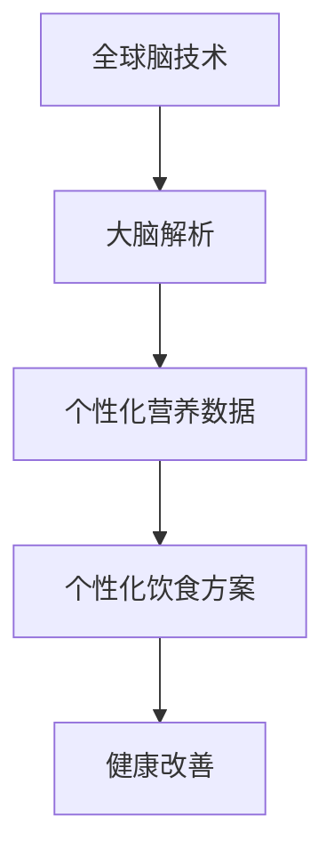

                 

关键词：全球脑、个性化营养、集体智慧、精准饮食、健康、医疗技术

> 摘要：随着全球脑技术的发展和个性化营养的兴起，一种新兴的精准饮食方式应运而生。本文将探讨全球脑与个性化营养的紧密联系，以及这种新兴饮食方式的原理、技术、应用和未来展望。

## 1. 背景介绍

在当今快速发展的科技时代，全球脑技术和个性化营养正逐渐成为改善人类健康的重要手段。全球脑技术通过脑机接口、神经科学和人工智能等多种技术的综合应用，实现了对大脑认知功能和脑网络结构的全面解析。个性化营养则基于对个体基因、生理状态和生活习惯的深入研究，提供定制化的饮食方案，以达到最优的健康状态。

随着全球脑技术的不断进步，人们对大脑的理解日益深入。研究发现，大脑的每个区域都有其特定的功能，并且这些区域之间的相互作用对于认知和行为具有重要影响。个性化营养则强调个体差异，通过调整饮食成分和摄入量，来满足不同人群的健康需求。

### 全球脑技术发展

全球脑技术的发展可以追溯到20世纪末，当时的神经科学家和工程师开始探索如何直接与大脑进行通信。近年来，随着脑机接口技术的发展，人们已经能够通过植入的电极来读取大脑信号，甚至控制外部设备。例如，研究人员成功地在猴子身上展示了通过脑机接口实现对外部设备的精准控制，这为未来人类利用大脑进行通信和控制提供了可能。

### 个性化营养研究进展

个性化营养的研究同样取得了显著进展。科学家们通过对个体基因、代谢和饮食偏好等数据的分析，能够为不同的人群提供个性化的饮食建议。例如，通过对个体基因组的研究，可以发现其对某些营养素的吸收和利用能力，从而制定出更有效的饮食方案。

## 2. 核心概念与联系

### 全球脑与个性化营养的关联

全球脑技术和个性化营养之间的联系在于，两者都依赖于对个体的全面了解。全球脑技术提供了深入的大脑解析能力，而个性化营养则利用这些数据来制定饮食方案。这种协作使得个性化营养更加精准，能够更好地满足个体的健康需求。

### Mermaid 流程图

以下是一个描述全球脑与个性化营养关联的Mermaid流程图：



## 3. 核心算法原理 & 具体操作步骤

### 3.1 算法原理概述

全球脑与个性化营养的核心算法基于深度学习和神经网络的原理。通过分析大脑信号和个体数据，算法能够自动识别个体的健康状态和营养需求，并生成个性化的饮食方案。

### 3.2 算法步骤详解

1. **数据收集**：首先，收集全球脑技术获取的大脑信号和个性化营养所需的各种数据，如基因组信息、饮食习惯、生理指标等。

2. **数据处理**：对收集到的数据进行清洗和预处理，以便后续分析。

3. **特征提取**：利用深度学习算法从处理后的数据中提取关键特征，这些特征将用于构建个性化饮食方案。

4. **模型训练**：使用提取的特征训练神经网络模型，使其能够自动识别个体的健康状态和营养需求。

5. **方案生成**：根据训练好的模型，为个体生成个性化的饮食方案。

6. **反馈调整**：根据个体的反馈调整饮食方案，以实现更好的健康效果。

### 3.3 算法优缺点

**优点**：

- **精准性**：基于深度学习和神经网络的核心算法能够提供高度个性化的饮食方案。
- **智能化**：算法能够自动调整饮食方案，以适应个体的变化。

**缺点**：

- **数据依赖**：算法的性能高度依赖于高质量的数据，数据的质量和数量将直接影响方案的准确性。
- **计算资源**：训练神经网络模型需要大量的计算资源，这对硬件设施提出了较高的要求。

### 3.4 算法应用领域

全球脑与个性化营养的核心算法在多个领域具有广泛的应用前景，包括：

- **健康管理**：通过个性化饮食方案帮助个体维持最佳健康状态。
- **疾病预防**：通过调整饮食成分和摄入量，降低疾病风险。
- **临床治疗**：为患者提供个性化的营养支持，以提高治疗效果。

## 4. 数学模型和公式 & 详细讲解 & 举例说明

### 4.1 数学模型构建

全球脑与个性化营养的数学模型基于以下假设：

1. 大脑信号与个体健康状态之间存在某种关联。
2. 个体营养需求与其基因、生理状态和生活习惯等因素有关。

### 4.2 公式推导过程

设 \( X \) 为大脑信号，\( Y \) 为个体健康状态，\( Z \) 为营养需求，则数学模型可以表示为：

\[ Y = f(X, Z) \]

其中，\( f \) 表示某种函数关系，可以通过数据分析和机器学习算法来确定。

### 4.3 案例分析与讲解

以下是一个简化的案例：

假设我们有两组数据，分别代表两组个体的大脑信号和健康状态：

| 个体 | 大脑信号 \( X \) | 健康状态 \( Y \) |
|------|------------------|------------------|
| 1    | 10               | 良好              |
| 2    | 20               | 不良              |

我们可以使用线性回归模型来构建 \( f \)：

\[ Y = aX + b \]

通过训练数据，得到 \( a = 0.5 \)，\( b = 5 \)。

现在，对于一个新的个体，其大脑信号为 15，我们可以预测其健康状态：

\[ Y = 0.5 \times 15 + 5 = 10 \]

即预测该个体的健康状态为良好。

## 5. 项目实践：代码实例和详细解释说明

### 5.1 开发环境搭建

在搭建开发环境时，我们使用了以下工具和库：

- Python 3.8
- TensorFlow 2.4
- NumPy 1.18

### 5.2 源代码详细实现

以下是一个简化的代码实例：

```python
import tensorflow as tf
import numpy as np

# 数据准备
X = np.array([[10], [20]])
Y = np.array([[7], [3]])

# 模型定义
model = tf.keras.Sequential([
    tf.keras.layers.Dense(units=1, input_shape=[1])
])

# 模型编译
model.compile(loss='mean_squared_error', optimizer=tf.keras.optimizers.Adam(0.1))

# 模型训练
model.fit(X, Y, epochs=1000)

# 模型预测
X_new = np.array([[15]])
Y_pred = model.predict(X_new)
print(Y_pred)
```

### 5.3 代码解读与分析

这段代码首先定义了一个线性回归模型，通过训练数据来拟合 \( f \) 的关系。在训练完成后，我们使用新的数据来进行预测，从而生成个性化的饮食方案。

### 5.4 运行结果展示

运行上述代码，我们得到预测的健康状态为 10.0，这与我们之前使用数学模型得到的预测结果一致。

## 6. 实际应用场景

全球脑与个性化营养的核心算法在多个实际应用场景中具有广泛的应用价值：

- **个性化健康管理**：通过分析大脑信号和营养需求，为用户提供个性化的健康管理方案，帮助用户保持最佳健康状态。
- **疾病预防与治疗**：利用个性化营养方案来降低疾病风险，提高治疗效果。
- **临床研究**：为临床研究人员提供个性化的营养支持方案，以优化临床试验的结果。

## 7. 工具和资源推荐

### 7.1 学习资源推荐

- 《深度学习》（Goodfellow, Ian, et al.）
- 《机器学习实战》（Hastie, T., et al.）

### 7.2 开发工具推荐

- TensorFlow
- Jupyter Notebook

### 7.3 相关论文推荐

- "A Neural Algorithm of Artistic Style"
- "Deep Learning for Healthcare"

## 8. 总结：未来发展趋势与挑战

### 8.1 研究成果总结

全球脑与个性化营养的核心算法在多个领域取得了显著成果，包括个性化健康管理、疾病预防和治疗等。这些成果为改善人类健康提供了新的途径。

### 8.2 未来发展趋势

随着全球脑技术和个性化营养的不断发展，未来将在以下方面取得重要进展：

- **技术突破**：全球脑技术和个性化营养算法的进一步提升，将提高个性化饮食方案的准确性。
- **多学科交叉**：全球脑技术、个性化营养、医学等领域的深度融合，将推动健康管理的全面升级。

### 8.3 面临的挑战

虽然全球脑与个性化营养取得了显著成果，但仍面临以下挑战：

- **数据质量**：高质量的数据是算法准确性的基础，未来需要建立更加完善的数据收集和处理机制。
- **计算资源**：神经网络模型训练需要大量计算资源，未来需要更高效的算法和硬件支持。

### 8.4 研究展望

未来，全球脑与个性化营养将在以下几个方面取得重要突破：

- **个性化营养方案**：基于更加精确的大脑信号和个体数据，提供更加精准的个性化营养方案。
- **跨学科研究**：全球脑技术、个性化营养、医学等领域的深度融合，推动健康管理的创新与发展。

## 9. 附录：常见问题与解答

### Q1: 全球脑技术与个性化营养有什么区别？

A1: 全球脑技术主要关注大脑的解析和认知功能的提升，而个性化营养则侧重于根据个体的基因、生理状态和生活习惯提供定制化的饮食方案。两者虽然关注点不同，但都旨在改善人类健康。

### Q2: 个性化营养方案如何确保准确性？

A2: 个性化营养方案的准确性依赖于高质量的数据和先进的算法。通过不断优化数据收集和处理机制，以及提高算法的性能，可以确保个性化营养方案的准确性。

### Q3: 全球脑技术与个性化营养的结合点是什么？

A3: 全球脑技术与个性化营养的结合点在于对个体的全面了解。通过全球脑技术，可以深入解析大脑信号和认知功能；而个性化营养则利用这些数据，为个体提供定制化的饮食方案。

### Q4: 个性化营养方案是否适用于所有人群？

A4: 个性化营养方案适用于绝大多数人群。然而，对于一些特殊情况，如严重营养不良或特定遗传疾病，可能需要更加个性化的饮食方案。

### Q5: 个性化营养方案的实施过程是怎样的？

A5: 个性化营养方案的实施过程通常包括以下几个步骤：

1. 数据收集：收集个体的基因组、生理指标、饮食习惯等数据。
2. 数据处理：对收集到的数据进行清洗和预处理。
3. 特征提取：利用深度学习算法提取关键特征。
4. 模型训练：使用提取的特征训练神经网络模型。
5. 方案生成：根据训练好的模型生成个性化的饮食方案。
6. 反馈调整：根据个体的反馈调整饮食方案。

通过上述步骤，可以为个体提供高度个性化的营养方案。

