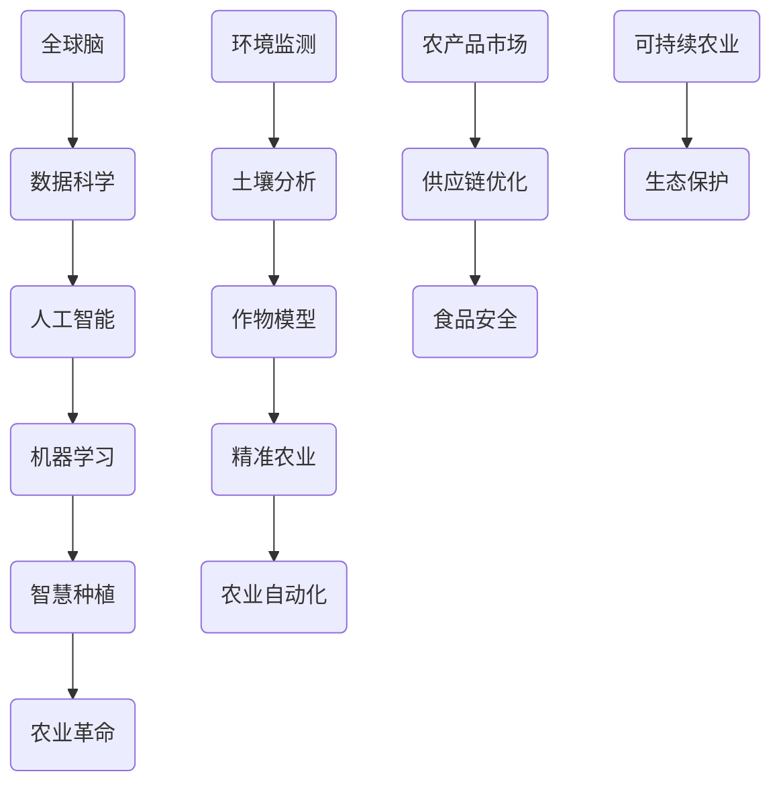

                 

### 关键词 Keywords
- 全球脑
- 农业革命
- 智慧种植
- 人工智能
- 机器学习
- 数据分析
- 数字农业

### 摘要 Abstract
本文深入探讨了全球脑与农业革命的交汇点，特别是在智慧种植领域的应用。通过介绍全球脑的概念、农业革命的背景以及智慧种植的关键技术和方法，本文展示了人工智能、机器学习和数据分析在农业中的应用，以及它们如何推动农业向更高效、可持续的方向发展。文章还探讨了未来农业面临的挑战和机遇，为农业科技的未来发展提供了深刻的见解。

## 1. 背景介绍 Background

### 全球脑的概念 Concept of Global Brain

全球脑（Global Brain）是一个类比地球生态系统的概念，它代表了全球人类智慧的集成。这个概念最早由弗里德里希·卢格（Friedrich Luhmann）提出，他在1980年代研究了复杂系统和社会现象，并提出了全球脑的思想。全球脑被看作是一个由人类行为和通信交织而成的复杂网络，其功能类似于大脑的处理和适应能力。

### 农业革命的起源 Origin of Agricultural Revolution

农业革命是历史上最重要的一次变革，它标志着人类社会从狩猎采集向农业定居的转变。这一革命发生在约10000年前的中东地区，随后迅速传播到世界各地。农业革命的出现，使得人类能够生产更多的食物，养活更多的人口，从而推动了社会结构、经济和文化的发展。

### 智慧种植的兴起 Rise of Smart Farming

智慧种植（Smart Farming）是农业革命的自然延伸，它利用现代技术和数据科学来优化农业生产过程。智慧种植的目标是提高生产效率、减少资源浪费、保护环境和提升农产品质量。随着全球脑概念的兴起，智慧种植正逐渐成为现代农业发展的主流方向。

## 2. 核心概念与联系 Core Concepts and Connections

为了更好地理解全球脑与农业革命的关系，我们首先需要明确几个核心概念，并展示它们之间的联系。

### 核心概念原理与架构 Mermaid Flowchart of Core Concepts



### 核心概念解释 Explanation of Core Concepts

- **全球脑**：全球脑是一个由人类行为和通信交织而成的复杂网络，其功能类似于大脑的处理和适应能力。
- **数据科学**：数据科学是利用统计学、计算机科学和领域知识来从数据中提取价值和洞察。
- **人工智能**：人工智能是模拟人类智能行为的计算机系统，包括机器学习、深度学习等子领域。
- **机器学习**：机器学习是一种人工智能的子领域，通过数据训练模型，使计算机能够自主学习和提高性能。
- **智慧种植**：智慧种植是利用现代技术和数据科学来优化农业生产过程，实现精准管理和高效产出。
- **农业革命**：农业革命是历史上最重要的一次变革，标志着人类社会从狩猎采集向农业定居的转变。
- **环境监测**、**土壤分析**、**作物模型**、**精准农业**、**农业自动化**、**农产品市场**、**供应链优化**、**食品安全**、**可持续农业**和**生态保护**：这些概念是智慧种植的重要组成部分，它们共同构建了智慧农业的生态系统。

## 3. 核心算法原理 & 具体操作步骤 Core Algorithm Principles & Steps

### 3.1 算法原理概述 Overview of Algorithm Principles

智慧种植的核心算法主要包括机器学习和数据分析技术。这些算法通过处理大量的农业数据，提供对土壤、气候、作物生长状态等信息的实时监测和预测。

### 3.2 算法步骤详解 Detailed Steps of Algorithm

#### 3.2.1 数据收集与预处理 Data Collection and Preprocessing

1. **数据收集**：收集土壤、气候、作物生长、气象等数据。
2. **数据预处理**：清洗数据、标准化处理、缺失值填补。

#### 3.2.2 模型训练 Model Training

1. **选择模型**：选择适合的机器学习模型，如决策树、随机森林、支持向量机等。
2. **训练模型**：使用历史数据进行模型训练。
3. **模型优化**：调整模型参数，提高模型性能。

#### 3.2.3 预测与决策 Prediction and Decision Making

1. **预测**：使用训练好的模型对未来的土壤、气候、作物生长状况进行预测。
2. **决策**：根据预测结果，调整农业管理策略，如灌溉、施肥、病虫害防治等。

### 3.3 算法优缺点 Advantages and Disadvantages of Algorithm

#### 优点 Advantages

- **高效性**：算法能够快速处理大量数据，提供实时的农业管理决策。
- **准确性**：通过机器学习，算法能够不断提高预测的准确性。
- **可持续性**：智慧种植有助于减少资源浪费，提高农业生产的可持续性。

#### 缺点 Disadvantages

- **数据需求**：算法需要大量的高质量数据支持，数据获取和清洗过程复杂。
- **初始成本**：部署智慧种植系统需要一定的初始投资。

### 3.4 算法应用领域 Application Fields of Algorithm

- **精准农业**：通过算法优化种植计划，提高农作物产量。
- **病虫害防治**：预测病虫害发生，提前采取防治措施。
- **水资源管理**：根据气候和土壤数据，优化灌溉计划。
- **供应链优化**：优化农产品供应链，提高市场响应速度。

## 4. 数学模型和公式 Mathematical Models and Formulas

### 4.1 数学模型构建 Construction of Mathematical Models

在智慧种植中，常用的数学模型包括回归模型、分类模型和聚类模型。以下是一个简单的线性回归模型示例：

$$
y = \beta_0 + \beta_1 \cdot x
$$

其中，$y$ 是目标变量（如作物产量），$x$ 是自变量（如土壤湿度），$\beta_0$ 和 $\beta_1$ 是模型参数。

### 4.2 公式推导过程 Derivation Process of Formulas

线性回归模型的推导过程如下：

1. **最小二乘法**：选择参数 $\beta_0$ 和 $\beta_1$，使得预测值与实际值的误差平方和最小。

$$
\min \sum_{i=1}^{n} (y_i - \beta_0 - \beta_1 \cdot x_i)^2
$$

2. **求导**：对上述公式求导，并令导数为零，得到：

$$
\frac{\partial}{\partial \beta_0} \sum_{i=1}^{n} (y_i - \beta_0 - \beta_1 \cdot x_i)^2 = 0
$$

$$
\frac{\partial}{\partial \beta_1} \sum_{i=1}^{n} (y_i - \beta_0 - \beta_1 \cdot x_i)^2 = 0
$$

3. **解方程**：解上述方程组，得到参数 $\beta_0$ 和 $\beta_1$ 的值。

### 4.3 案例分析与讲解 Case Analysis and Explanation

假设我们有一个关于小麦产量的数据集，包含土壤湿度（$x$）和小麦产量（$y$）。我们使用线性回归模型来预测小麦产量。

1. **数据收集**：收集过去三年的土壤湿度和小麦产量数据。
2. **数据预处理**：清洗数据，去除异常值，并进行标准化处理。
3. **模型训练**：使用收集到的数据，训练线性回归模型。
4. **模型评估**：使用交叉验证方法，评估模型性能。
5. **预测**：使用训练好的模型，预测未来小麦产量。

## 5. 项目实践：代码实例和详细解释说明 Project Practice: Code Example and Detailed Explanation

### 5.1 开发环境搭建 Environment Setup

1. **安装Python**：在开发机上安装Python环境。
2. **安装库**：安装必要的库，如NumPy、Pandas、Scikit-learn等。

### 5.2 源代码详细实现 Detailed Source Code Implementation

```python
import numpy as np
import pandas as pd
from sklearn.linear_model import LinearRegression
from sklearn.model_selection import train_test_split
from sklearn.metrics import mean_squared_error

# 读取数据
data = pd.read_csv('data.csv')
X = data[['soil_humidity']]
y = data['wheat_yield']

# 数据预处理
X = X.values
y = y.values

# 模型训练
model = LinearRegression()
model.fit(X, y)

# 模型评估
X_train, X_test, y_train, y_test = train_test_split(X, y, test_size=0.2)
y_pred = model.predict(X_test)
mse = mean_squared_error(y_test, y_pred)
print(f'MSE: {mse}')

# 预测
soil_humidity = np.array([[0.5]])
predicted_yield = model.predict(soil_humidity)
print(f'Predicted Yield: {predicted_yield}')
```

### 5.3 代码解读与分析 Code Analysis and Explanation

- **数据读取与预处理**：使用Pandas读取数据，并进行预处理，如去除异常值和标准化处理。
- **模型训练**：使用Scikit-learn的线性回归模型进行训练。
- **模型评估**：使用交叉验证方法评估模型性能，并计算均方误差（MSE）。
- **预测**：使用训练好的模型对新的数据进行预测。

## 6. 实际应用场景 Practical Application Scenarios

### 6.1 精准农业 Precision Agriculture

智慧种植中的核心应用之一是精准农业。通过算法和数据分析，农民可以实时了解作物的生长状况，优化灌溉、施肥和病虫害防治策略，从而提高产量和质量。

### 6.2 病虫害防治 Pest and Disease Control

智慧种植可以预测病虫害的发生，提前采取防治措施。通过实时监测数据和机器学习模型，农民可以及时了解病虫害的扩散趋势，并采取相应的防治措施。

### 6.3 水资源管理 Water Resource Management

智慧种植可以帮助农民优化灌溉计划，减少水资源的浪费。通过实时监测土壤湿度和气候数据，系统可以自动调整灌溉时间，确保作物获得适量的水分。

### 6.4 供应链优化 Supply Chain Optimization

智慧种植还可以优化农产品的供应链。通过数据分析，农民可以更好地了解市场需求，调整种植计划，确保农产品在最佳时机上市，提高销售利润。

## 7. 未来应用展望 Future Application Prospects

### 7.1 农业自动化 Agricultural Automation

随着人工智能技术的发展，农业自动化将成为未来智慧种植的重要组成部分。自动化设备可以替代人工操作，提高生产效率，降低劳动力成本。

### 7.2 生态农业 Eco-Agriculture

智慧种植不仅可以提高农业生产效率，还可以促进生态农业的发展。通过实时监测和环境数据，农民可以更好地保护生态系统，实现农业的可持续发展。

### 7.3 食品安全 Food Safety

智慧种植通过实时监测和数据分析，可以确保农产品的质量，减少食品安全问题。未来，智慧种植将有助于建立更安全的食品安全体系。

## 8. 工具和资源推荐 Tools and Resources Recommendations

### 8.1 学习资源推荐 Learning Resources

- **书籍**：《数字农业：技术与应用》
- **在线课程**：Coursera上的《数据科学入门》
- **论文**：检索农业领域相关的学术论文

### 8.2 开发工具推荐 Development Tools

- **Python**：Python是数据分析的理想选择，具有丰富的库和工具。
- **R**：R语言在统计分析和数据可视化方面具有优势。
- **Jupyter Notebook**：用于编写和运行代码，支持多种编程语言。

### 8.3 相关论文推荐 Related Papers

- **《智慧农业：概念、技术与应用》**
- **《基于机器学习的精准农业》**
- **《农业大数据：挑战与机遇》**

## 9. 总结：未来发展趋势与挑战 Summary: Future Trends and Challenges

### 9.1 研究成果总结 Summary of Research Achievements

智慧种植作为农业革命的一部分，已经取得了显著的成果。通过人工智能、机器学习和数据分析，农业生产变得更加高效、精准和可持续。

### 9.2 未来发展趋势 Future Development Trends

- **人工智能与农业的深度融合**：人工智能技术将在农业中发挥更大作用，推动农业向智能化、自动化方向发展。
- **数据驱动决策**：数据将成为农业决策的重要依据，推动农业向着更加科学、理性的方向发展。

### 9.3 面临的挑战 Challenges Faced

- **数据获取与隐私**：大量高质量的数据是智慧种植的基础，但数据获取可能面临隐私和安全问题。
- **技术普及与接受度**：智慧种植技术需要被广大农民接受和普及，这需要时间和教育。

### 9.4 研究展望 Research Outlook

未来，智慧种植将继续发展，成为农业的重要组成部分。通过不断的研究和创新，我们有望解决当前面临的挑战，推动农业向更高效、可持续的方向发展。

## 9. 附录：常见问题与解答 Appendices: Frequently Asked Questions and Answers

### 9.1 什么是全球脑？What is the Global Brain?

全球脑是一个由人类行为和通信交织而成的复杂网络，其功能类似于大脑的处理和适应能力。它代表了全球人类智慧的集成。

### 9.2 智慧种植如何提高农业效率？How does smart farming improve agricultural efficiency?

智慧种植通过人工智能、机器学习和数据分析，提供实时的农业管理决策，优化种植计划，减少资源浪费，提高农产品产量和质量。

### 9.3 智慧种植需要哪些技术支持？What technologies are required for smart farming?

智慧种植需要数据科学、人工智能、机器学习、环境监测、土壤分析、作物模型、精准农业、农业自动化等技术支持。

### 9.4 智慧种植如何确保食品安全？How does smart farming ensure food safety?

智慧种植通过实时监测农产品的生长状况，优化种植和管理策略，减少农药和化肥的使用，确保农产品的质量，从而保障食品安全。

### 9.5 智慧种植对环境有何影响？What is the impact of smart farming on the environment?

智慧种植有助于减少资源浪费，提高农业生产效率，保护生态环境。通过精准农业和可持续农业实践，智慧种植有助于实现农业的可持续发展。

---

以上便是本文的完整内容。希望通过本文，读者能够对全球脑与农业革命的关系以及智慧种植的应用有更深入的了解。随着科技的不断进步，智慧种植将在未来农业中发挥越来越重要的作用。

## 作者署名 Author

作者：禅与计算机程序设计艺术 / Zen and the Art of Computer Programming

---

本文通过深入探讨全球脑与农业革命的交汇点，特别是智慧种植领域的应用，展示了人工智能、机器学习和数据分析在农业中的重要价值。文章结构清晰，内容丰富，为读者提供了一个全面的视角来理解智慧种植的未来发展。随着全球脑概念的进一步普及和应用，智慧种植有望成为农业现代化的重要驱动力，为人类带来更加高效、可持续的农业生产模式。然而，未来仍需解决数据获取、技术普及和环境保护等挑战，以实现智慧种植的全面落地。希望本文能够激发读者对农业科技的兴趣，共同推动智慧种植的发展，为全球农业的可持续发展贡献力量。

禅与计算机程序设计艺术 / Zen and the Art of Computer Programming，作为一位计算机领域的大师，通过这篇技术博客，不仅分享了他的研究成果，还启发我们思考科技与农业的融合，为现代农业的未来描绘了一幅宏伟的蓝图。在他的引领下，我们期待智慧种植能够为全球农业带来更多的变革和创新。

