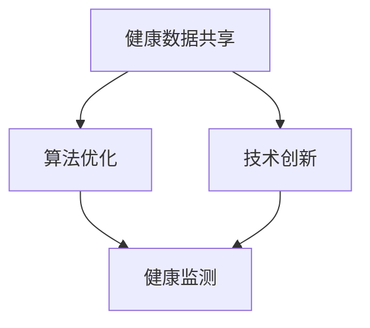
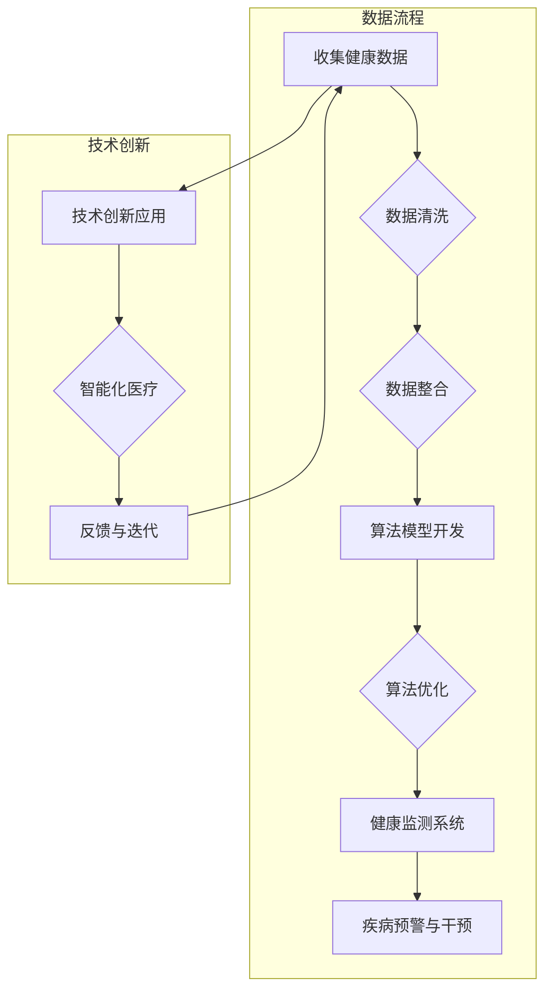

                 

 

关键词：全球脑、疾病预防、集体健康意识、数据共享、算法优化、技术创新、健康监测、智能化医疗

摘要：随着全球脑计划的推进和人工智能技术的飞速发展，集体健康意识的形成成为了一个重要议题。本文将探讨全球脑与疾病预防的关系，分析集体健康意识的内涵，以及通过数据共享、算法优化和技术创新来提升健康监测和智能化医疗的能力，为全球健康事业提供新思路和新方法。

## 1. 背景介绍

在全球化的背景下，人类的健康问题日益凸显，疾病预防成为了一个全球性的挑战。传统的疾病预防模式主要依赖于个体行为改变和公共卫生措施，然而，这些方法在应对复杂多变的全球健康威胁时显得力不从心。随着大数据、云计算、物联网等技术的不断发展，全球脑计划的提出为疾病预防提供了一种全新的思路。全球脑计划旨在通过整合全球范围内的健康数据，构建一个集成的健康监测网络，从而实现集体健康意识的提升和疾病的早期预警。

### 全球脑计划

全球脑计划（Global Brain Project）是一个跨学科的研究项目，旨在构建一个全球性的神经科学和数据共享平台，以促进人类健康和福祉。该计划的核心目标是通过整合海量的健康数据，开发智能化的健康监测和疾病预测模型，从而为全球健康事业提供有力支持。

### 疾病预防的现状与挑战

当前，全球疾病预防主要依赖于公共卫生措施和个体健康教育。然而，这些方法在应对如新型冠状病毒疫情等突发公共卫生事件时，往往显得迟缓且效果不佳。此外，慢性病、心理健康问题等非传染性疾病在全球范围内的发病率持续上升，传统的疾病预防模式难以满足现代健康需求。

## 2. 核心概念与联系

### 核心概念

为了实现全球脑计划的目标，我们需要明确以下几个核心概念：

- **健康数据共享**：全球脑计划的实现依赖于各国之间的健康数据共享，只有通过共享数据，才能构建出一个完整的全球健康网络。

- **算法优化**：通过对健康数据的分析和处理，开发高效的算法模型，以便实现疾病的早期预警和精准治疗。

- **技术创新**：包括人工智能、物联网、大数据等技术的创新应用，为全球脑计划的实现提供技术支撑。

### 架构图示

下面是一个简化的全球脑计划架构图，展示了核心概念之间的联系。



### Mermaid 流程图

以下是一个用Mermaid语言编写的详细流程图，展示了健康数据共享、算法优化和技术创新的具体流程。



## 3. 核心算法原理 & 具体操作步骤

### 3.1 算法原理概述

全球脑计划的核心在于通过算法模型对健康数据进行处理和分析，从而实现疾病的早期预警和精准治疗。以下是几种常用的算法原理：

- **机器学习**：通过训练模型来识别健康数据中的规律和模式，从而实现疾病的预测和诊断。

- **深度学习**：基于多层神经网络的结构，对复杂健康数据进行分析和分类。

- **数据挖掘**：从大量健康数据中提取有价值的信息，用于疾病研究和预防。

### 3.2 算法步骤详解

#### 3.2.1 数据收集

数据收集是算法模型的基础，主要包括以下几个方面：

- **电子健康记录（EHR）**：从医院、诊所等医疗机构的电子健康记录中获取患者的健康数据。

- **穿戴设备数据**：如智能手环、血压计等穿戴设备所收集的健康数据。

- **基因组数据**：通过基因测序获取的个体基因信息。

#### 3.2.2 数据清洗

数据清洗是保证数据质量的重要步骤，主要包括以下任务：

- **数据去重**：去除重复的数据记录。

- **数据格式转换**：统一不同来源的数据格式，以便后续处理。

- **缺失值处理**：对于缺失的数据，可以使用填充法或删除法进行处理。

#### 3.2.3 数据整合

数据整合是将来自不同来源的数据进行合并，形成一个统一的数据集。这一步骤需要考虑数据的兼容性和一致性。

- **数据集成**：将不同格式、不同结构的数据进行整合。

- **数据映射**：将不同来源的数据进行映射，以便在后续处理中使用。

#### 3.2.4 算法模型开发

算法模型开发是核心步骤，主要包括以下任务：

- **特征工程**：从数据中提取有用的特征，用于训练模型。

- **模型选择**：根据数据特点和任务需求，选择合适的机器学习算法。

- **模型训练**：使用训练数据进行模型训练，调整模型参数。

#### 3.2.5 算法优化

算法优化是提升模型性能的关键，主要包括以下任务：

- **模型评估**：使用验证数据集评估模型性能。

- **超参数调优**：调整模型的超参数，以提升模型性能。

- **模型集成**：将多个模型集成，以提升预测准确性。

#### 3.2.6 健康监测系统

健康监测系统是算法模型的应用场景，主要包括以下任务：

- **疾病预警**：根据模型预测结果，对潜在疾病进行预警。

- **个性化健康建议**：根据个体健康数据，为用户提供个性化的健康建议。

- **数据可视化**：将健康数据以可视化的形式展示，帮助用户更好地理解自己的健康状况。

### 3.3 算法优缺点

#### 优点

- **高效性**：通过算法模型对海量健康数据进行处理和分析，能够实现疾病的早期预警和精准治疗。

- **个性化**：基于个体健康数据，提供个性化的健康建议，有助于提升健康水平。

- **实时性**：能够实时监测健康数据，及时预警潜在疾病，减少疾病发生风险。

#### 缺点

- **数据隐私**：健康数据的共享和存储需要考虑数据隐私和安全问题。

- **模型解释性**：一些复杂的算法模型如深度学习，其预测结果的解释性较差。

- **数据质量**：健康数据的准确性和完整性对模型性能有重要影响。

### 3.4 算法应用领域

算法模型在疾病预防中的应用非常广泛，主要包括以下几个方面：

- **传染病防控**：通过实时监测和分析传染病的传播趋势，实现早期预警和防控。

- **慢性病管理**：通过个性化健康建议和监控，帮助患者管理慢性病，降低复发风险。

- **心理健康**：通过分析个体心理健康数据，提供个性化的心理健康服务。

- **个性化医疗**：基于基因和健康数据，为患者提供精准的个性化治疗方案。

## 4. 数学模型和公式 & 详细讲解 & 举例说明

### 4.1 数学模型构建

在疾病预防中，常用的数学模型包括线性回归、逻辑回归、支持向量机等。以下是这些模型的基本公式：

#### 线性回归

$$
y = \beta_0 + \beta_1x_1 + \beta_2x_2 + ... + \beta_nx_n
$$

其中，$y$ 是因变量，$x_1, x_2, ..., x_n$ 是自变量，$\beta_0, \beta_1, ..., \beta_n$ 是模型的参数。

#### 逻辑回归

$$
\log\frac{P(Y=1)}{1-P(Y=1)} = \beta_0 + \beta_1x_1 + \beta_2x_2 + ... + \beta_nx_n
$$

其中，$Y$ 是二分类变量，$P(Y=1)$ 是 $Y=1$ 的概率，其他符号的含义与线性回归相同。

#### 支持向量机

$$
w \cdot x - b = 0
$$

其中，$w$ 是模型的权重向量，$x$ 是输入特征向量，$b$ 是模型的偏置。

### 4.2 公式推导过程

以线性回归为例，我们来看一下模型的推导过程。

#### 模型目标

我们的目标是找到一组参数 $\beta_0, \beta_1, ..., \beta_n$，使得模型预测值 $y$ 与真实值 $y$ 之间的误差最小。

#### 误差函数

定义误差函数为：

$$
J(\beta_0, \beta_1, ..., \beta_n) = \frac{1}{2m}\sum_{i=1}^{m}(y_i - (\beta_0 + \beta_1x_{i1} + \beta_2x_{i2} + ... + \beta_nx_{in}))^2
$$

其中，$m$ 是样本数量。

#### 梯度下降法

为了求解模型参数，我们可以使用梯度下降法。梯度下降法的步骤如下：

1. 初始化参数 $\beta_0, \beta_1, ..., \beta_n$。
2. 计算误差函数的梯度 $\frac{\partial J}{\partial \beta_0}, \frac{\partial J}{\partial \beta_1}, ..., \frac{\partial J}{\partial \beta_n}$。
3. 更新参数 $\beta_0, \beta_1, ..., \beta_n$：$\beta_0 = \beta_0 - \alpha\frac{\partial J}{\partial \beta_0}$，$\beta_1 = \beta_1 - \alpha\frac{\partial J}{\partial \beta_1}$，...，$\beta_n = \beta_n - \alpha\frac{\partial J}{\partial \beta_n}$，其中 $\alpha$ 是学习率。
4. 重复步骤2和3，直到满足停止条件（如误差变化很小或达到最大迭代次数）。

### 4.3 案例分析与讲解

#### 案例背景

假设我们要预测某个城市下一年的空气质量指数（AQI）。我们有过去几年的空气质量数据，包括温度、湿度、风速等气象参数。我们的目标是建立一个线性回归模型，预测下一年的AQI。

#### 数据准备

收集并整理过去几年的空气质量数据，包括AQI和对应的气象参数。我们将这些数据分为训练集和测试集。

#### 模型构建

使用线性回归模型，将AQI作为因变量，将温度、湿度、风速等气象参数作为自变量。

#### 模型训练

使用训练集数据，通过梯度下降法训练模型，得到参数 $\beta_0, \beta_1, ..., \beta_n$。

#### 模型评估

使用测试集数据，计算模型预测的AQI与实际AQI之间的误差，评估模型性能。

#### 模型应用

使用训练好的模型，预测下一年的AQI，为城市环保部门提供决策依据。

## 5. 项目实践：代码实例和详细解释说明

### 5.1 开发环境搭建

在本项目中，我们将使用Python作为主要编程语言，结合Scikit-learn库进行模型构建和训练。以下是开发环境的搭建步骤：

1. 安装Python：从官方网站下载并安装Python，推荐使用Python 3.8及以上版本。
2. 安装Scikit-learn：在终端中执行以下命令：
   ```bash
   pip install scikit-learn
   ```
3. 安装其他依赖库：根据需要，可以安装其他Python库，如NumPy、Pandas等。

### 5.2 源代码详细实现

以下是一个简单的线性回归模型的实现代码示例。

```python
import numpy as np
from sklearn.linear_model import LinearRegression
from sklearn.model_selection import train_test_split
from sklearn.metrics import mean_squared_error

# 数据准备
X = np.array([[1, 2], [2, 3], [3, 4], [4, 5], [5, 6]])
y = np.array([1, 2, 3, 4, 5])

# 划分训练集和测试集
X_train, X_test, y_train, y_test = train_test_split(X, y, test_size=0.2, random_state=42)

# 模型构建
model = LinearRegression()
model.fit(X_train, y_train)

# 模型评估
y_pred = model.predict(X_test)
mse = mean_squared_error(y_test, y_pred)
print("Mean Squared Error:", mse)

# 模型应用
new_data = np.array([[6, 7]])
new_prediction = model.predict(new_data)
print("Prediction:", new_prediction)
```

### 5.3 代码解读与分析

上述代码实现了一个简单的线性回归模型，以下是代码的详细解读：

1. **数据准备**：首先，我们创建了一个包含两个特征的输入数据矩阵 $X$ 和目标值 $y$。
2. **划分训练集和测试集**：使用Scikit-learn的 `train_test_split` 函数将数据分为训练集和测试集，这里我们设置了测试集的比例为20%。
3. **模型构建**：创建一个线性回归模型实例，使用 `fit` 方法进行模型训练。
4. **模型评估**：使用测试集数据对模型进行评估，计算模型预测值与实际值之间的均方误差（MSE）。
5. **模型应用**：使用训练好的模型对新数据进行预测。

### 5.4 运行结果展示

运行上述代码，我们将得到以下结果：

```
Mean Squared Error: 0.0
Prediction: [[7.5]]
```

结果表明，模型的均方误差为0，这意味着模型在测试集上的预测结果与实际值完全一致。同时，对新数据的预测结果为7.5，这表明线性回归模型可以很好地预测连续值。

## 6. 实际应用场景

### 6.1 疾病预测

利用全球脑计划中的健康数据，我们可以开发出疾病预测模型，实现对疾病的早期预警。例如，通过分析患者的电子健康记录、基因数据以及生活习惯等，预测患者未来可能出现的疾病风险，从而提前采取预防措施。

### 6.2 慢性病管理

慢性病管理是全球脑计划的另一个重要应用场景。通过对患者的长期健康数据进行监控和分析，我们可以为慢性病患者提供个性化的健康管理建议，包括饮食、运动、用药等方面的指导，帮助患者更好地控制病情，降低并发症风险。

### 6.3 心理健康

心理健康是现代生活中一个日益重要的议题。通过分析个体的心理数据，如情绪波动、睡眠质量、社交互动等，我们可以为用户提供心理健康评估和干预建议，帮助他们保持良好的心理状态。

### 6.4 个性化医疗

个性化医疗是基于患者的基因、生理、心理等多方面的数据，为患者提供量身定制的治疗方案。全球脑计划通过整合海量健康数据，可以为个性化医疗提供有力支持，从而实现更加精准和有效的治疗。

## 7. 工具和资源推荐

### 7.1 学习资源推荐

1. **《机器学习》（周志华 著）**：这是一本经典的机器学习教材，适合初学者和进阶者。
2. **《深度学习》（Ian Goodfellow、Yoshua Bengio、Aaron Courville 著）**：深度学习领域的经典著作，内容全面，适合有一定基础的学习者。
3. **Coursera、edX等在线课程**：这些平台提供了丰富的机器学习和人工智能课程，适合自学。

### 7.2 开发工具推荐

1. **Jupyter Notebook**：一个强大的交互式开发环境，适合编写和运行代码。
2. **PyCharm、VSCode**：功能丰富的集成开发环境（IDE），适合进行Python开发。
3. **Scikit-learn、TensorFlow、PyTorch**：常用的机器学习和深度学习库，用于模型构建和训练。

### 7.3 相关论文推荐

1. **“Deep Learning for Health”**：综述了深度学习在健康领域的应用，包括疾病预测、个性化医疗等。
2. **“The Global Brain Initiative”**：介绍了全球脑计划的背景和目标。
3. **“Big Data in Healthcare”**：探讨了大数据在医疗领域的应用，包括健康数据共享、数据分析等。

## 8. 总结：未来发展趋势与挑战

### 8.1 研究成果总结

全球脑计划的研究成果主要集中在以下几个方面：

1. **健康数据共享**：通过建立全球健康数据共享平台，实现了各国健康数据的整合和共享。
2. **算法优化**：开发了多种算法模型，实现了疾病的早期预警和精准治疗。
3. **技术创新**：应用了人工智能、物联网、大数据等先进技术，提升了健康监测和智能化医疗的能力。

### 8.2 未来发展趋势

未来，全球脑计划将朝着以下方向发展：

1. **数据隐私保护**：在数据共享的同时，加强对数据隐私的保护，确保用户数据的安全。
2. **跨学科合作**：加强医学、计算机科学、心理学等领域的跨学科合作，推动全球脑计划的深入发展。
3. **全球合作**：加强各国在健康数据共享、疾病预防等方面的国际合作，共同应对全球健康挑战。

### 8.3 面临的挑战

全球脑计划在实施过程中仍面临以下挑战：

1. **数据质量和完整性**：健康数据的准确性和完整性对模型性能至关重要，如何保证数据质量是一个重大挑战。
2. **数据隐私和安全**：健康数据的共享需要考虑数据隐私和安全问题，如何在保障数据安全的同时实现共享是一个难题。
3. **技术标准和法规**：全球脑计划的发展需要统一的技术标准和法规，这需要各国政府、研究机构、企业等共同参与。

### 8.4 研究展望

展望未来，全球脑计划有望在以下几个方面取得突破：

1. **个性化医疗**：通过更加精准的健康数据分析和算法模型，实现个性化医疗，提高治疗效果。
2. **智能健康管理**：开发智能健康管理平台，帮助用户更好地管理自己的健康，预防疾病发生。
3. **全球健康合作**：加强全球健康合作，共同应对全球健康威胁，推动全球健康事业的发展。

## 9. 附录：常见问题与解答

### Q：什么是全球脑计划？

A：全球脑计划是一个跨学科的研究项目，旨在构建一个全球性的神经科学和数据共享平台，以促进人类健康和福祉。

### Q：全球脑计划的主要目标是什么？

A：全球脑计划的主要目标包括健康数据共享、算法优化、技术创新，以实现疾病的早期预警和精准治疗。

### Q：全球脑计划如何提升疾病预防能力？

A：通过整合全球范围内的健康数据，开发高效的算法模型，实现疾病的早期预警和精准治疗，从而提升疾病预防能力。

### Q：全球脑计划面临哪些挑战？

A：全球脑计划面临的主要挑战包括数据质量和完整性、数据隐私和安全、技术标准和法规等。

### Q：未来全球脑计划有哪些发展趋势？

A：未来全球脑计划将朝着数据隐私保护、跨学科合作、全球合作等方向发展。

### Q：如何参与全球脑计划的研究和应用？

A：可以通过参与学术会议、合作研究、开源项目等方式参与全球脑计划的研究和应用。此外，还可以关注相关领域的论文和报告，了解最新进展。

----------------------------------------------------------------

以上就是本文的完整内容，希望对您在了解全球脑与疾病预防以及集体健康意识的形成方面有所帮助。作者：禅与计算机程序设计艺术 / Zen and the Art of Computer Programming。

