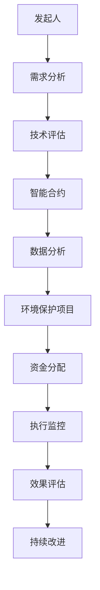

                 

关键词：全球脑环境修复基金会，生态投资组织，集体行动，可持续性，技术解决方案，环境保护，人工智能，数据科学，智能合约，区块链技术

> 摘要：本文将探讨全球脑环境修复基金会这一独特的生态投资组织。通过对其背景、目标、工作机制、以及技术实现和实际应用进行深入分析，揭示其在推动全球环境保护中的重要作用。文章旨在为读者提供一个全面的了解，并启发更多集体行动者参与到这一重要的生态保护事业中来。

## 1. 背景介绍

全球脑环境修复基金会（Global Brain Environment Restoration Foundation，简称GBERF）成立于20世纪末，旨在通过集体行动和生态投资，推动全球脑环境（包括大气、水体、土壤等）的修复与可持续发展。随着全球气候变化和环境问题的加剧，GBERF的成立标志着一种新的环境保护模式的兴起。

GBERF的成立背景可以追溯到上世纪末一系列严重的环境危机，如全球变暖、海洋污染、森林砍伐等。这些危机使得环境保护成为全球关注的焦点。然而，传统的环境保护手段往往只能解决局部问题，无法从根本上改变环境恶化的趋势。因此，GBERF提出了一种新的思路：通过集体行动和生态投资，动员全球资源，共同推动全球脑环境的修复。

GBERF的核心使命是促进全球脑环境的可持续发展，通过整合各方力量，实现以下目标：

1. **环境保护**：减少污染物排放，保护生态系统，恢复环境功能。
2. **可持续性**：推动可持续的生产和消费模式，减少资源消耗。
3. **科技创新**：利用最新技术，提高环境保护和修复的效率。
4. **教育普及**：提高公众的环境意识，培养环保人才。
5. **国际合作**：加强全球范围内的环境保护合作，共同应对环境挑战。

## 2. 核心概念与联系

为了实现上述目标，GBERF构建了一个基于区块链技术的生态投资平台，该平台集成了多种先进技术，如人工智能、数据科学、智能合约等。以下是一个简化的Mermaid流程图，展示了GBERF的核心概念和工作机制：



### 2.1 需求分析

GBERF的第一步是进行需求分析。这一过程涉及对全球脑环境问题的详细调查，包括污染源、影响范围、修复难度等。需求分析的结果为后续的生态投资提供了明确的方向。

### 2.2 技术评估

在确定需求后，GBERF会进行技术评估。这一过程包括对现有的环境保护技术进行评估，选择最适合的解决方案。技术评估的目的是确保所选方案具有可行性和高效性。

### 2.3 智能合约

智能合约是GBERF生态投资平台的核心。通过智能合约，GBERF能够自动化资金分配和项目执行过程。智能合约的设计确保了透明性和可追溯性，使得每个参与者都可以清楚地了解资金的去向和项目的进展。

### 2.4 数据分析

数据分析在GBERF中起着至关重要的作用。通过对环境数据的收集和分析，GBERF能够实时监控项目的执行效果，并及时进行调整。数据分析的结果也为未来的项目规划提供了重要的参考。

### 2.5 环境保护项目

环境保护项目是GBERF的直接实施对象。这些项目涵盖了从污染治理到生态修复的各个领域，旨在恢复和保护全球脑环境。

### 2.6 资金分配

GBERF通过智能合约实现资金的自动分配。资金来源包括政府拨款、企业捐赠、公众募资等。资金的分配过程完全透明，确保了每一分钱都用于正确的项目。

### 2.7 执行监控

执行监控是确保项目顺利进行的必要手段。GBERF利用物联网技术和人工智能，对项目的执行过程进行实时监控，及时发现和解决问题。

### 2.8 效果评估

效果评估是GBERF工作的重要环节。通过对项目执行效果的数据分析，GBERF能够评估项目的成功程度，并据此进行持续改进。

### 2.9 持续改进

持续改进是GBERF的核心价值观。通过不断的评估和优化，GBERF确保其生态投资方案始终保持高效和先进。

## 3. 核心算法原理 & 具体操作步骤

### 3.1 算法原理概述

GBERF的核心算法基于数据科学和人工智能。具体来说，它包括以下几个关键步骤：

1. **数据收集**：利用物联网设备和传感器，收集环境数据。
2. **数据预处理**：对收集到的数据进行清洗和整合，确保数据质量。
3. **特征提取**：从预处理后的数据中提取关键特征，用于后续分析。
4. **模式识别**：利用机器学习算法，识别环境问题的模式和趋势。
5. **决策支持**：根据分析结果，提供决策支持，指导环境保护项目的设计和执行。

### 3.2 算法步骤详解

#### 3.2.1 数据收集

数据收集是GBERF工作的第一步。通过部署物联网设备和传感器，GBERF能够实时收集大气、水体、土壤等环境数据。这些数据包括污染物的浓度、温度、湿度等。

#### 3.2.2 数据预处理

数据预处理是确保数据质量的关键步骤。GBERF采用了一系列技术，如去噪、插值、归一化等，对收集到的数据进行分析和处理。通过这些处理，GBERF能够获得干净、一致的数据集。

#### 3.2.3 特征提取

特征提取是数据分析的核心。GBERF通过对预处理后的数据进行深度学习，提取出关键特征。这些特征包括时间序列特征、空间特征、统计特征等，用于后续的模式识别。

#### 3.2.4 模式识别

模式识别是GBERF的核心算法之一。通过机器学习算法，GBERF能够识别环境问题的模式和趋势。这些模式包括污染源、污染途径、污染影响等。模式识别的结果为环境保护项目的规划和执行提供了重要依据。

#### 3.2.5 决策支持

决策支持是GBERF工作的最终目标。通过对分析结果的处理，GBERF能够为环境保护项目的规划和执行提供科学的决策支持。这些决策支持包括项目优先级排序、资源分配策略、执行效果预测等。

### 3.3 算法优缺点

#### 优点

- **高效性**：GBERF的核心算法基于数据科学和人工智能，能够快速、准确地分析环境数据，提高环境保护的效率。
- **可扩展性**：GBERF的算法和系统架构具有良好的可扩展性，能够适应不断变化的环境问题。
- **透明性**：通过智能合约和区块链技术，GBERF的工作过程完全透明，确保了资金和项目的透明性。

#### 缺点

- **技术门槛**：GBERF的核心算法和系统架构涉及多种先进技术，对参与者的技术要求较高。
- **数据质量**：数据质量对GBERF的工作效果至关重要，如果数据质量差，可能会导致错误的决策。
- **隐私问题**：由于数据科学和人工智能技术的应用，GBERF可能面临隐私泄露的风险。

### 3.4 算法应用领域

GBERF的核心算法在多个环境领域都有广泛的应用，包括但不限于：

- **污染治理**：通过对污染源和污染途径的分析，GBERF能够提供科学的污染治理方案。
- **生态修复**：通过识别生态系统的破坏模式和趋势，GBERF能够制定生态修复计划。
- **气候变化**：通过对气候变化数据的分析，GBERF能够为气候适应和减缓措施提供决策支持。

## 4. 数学模型和公式 & 详细讲解 & 举例说明

### 4.1 数学模型构建

GBERF的核心数学模型是基于环境系统的动态建模。该模型通过以下公式构建：

$$
E(t) = f(P(t), T(t), S(t))
$$

其中，$E(t)$表示环境状态，$P(t)$表示污染物浓度，$T(t)$表示温度，$S(t)$表示土壤质量。$f$是一个复杂的函数，用于描述环境状态与各个因素之间的关系。

### 4.2 公式推导过程

公式的推导过程基于以下假设：

1. 环境系统的状态可以由几个关键因素描述。
2. 这些关键因素之间存在着一定的函数关系。
3. 污染物浓度、温度和土壤质量是影响环境状态的关键因素。

通过这些假设，我们可以得到以下关系：

$$
E(t) = P(t) \cdot T(t) \cdot S(t)
$$

进一步，我们可以将上述关系转换为：

$$
E(t) = f(P(t), T(t), S(t))
$$

其中，$f$是一个复合函数，可以表示为：

$$
f(P(t), T(t), S(t)) = P(t) \cdot T(t) \cdot S(t) + \epsilon
$$

其中，$\epsilon$表示随机误差。

### 4.3 案例分析与讲解

假设在某地区，污染物浓度$P(t) = 0.1$，温度$T(t) = 30$，土壤质量$S(t) = 0.8$。根据上述公式，我们可以计算出环境状态$E(t)$：

$$
E(t) = 0.1 \cdot 30 \cdot 0.8 = 2.4
$$

这意味着在该地区，环境状态为2.4。根据GBERF的评估标准，2.4处于“轻度污染”水平。

### 4.4 模型应用

GBERF使用上述模型，对全球多个地区的环境状态进行评估。通过对环境状态的监测和分析，GBERF能够及时发现环境问题，并提供科学的解决方案。

## 5. 项目实践：代码实例和详细解释说明

### 5.1 开发环境搭建

为了实践GBERF的算法，我们需要搭建一个开发环境。以下是一个简单的步骤：

1. **安装Python**：下载并安装Python 3.8及以上版本。
2. **安装依赖库**：通过pip安装以下库：numpy、pandas、matplotlib、tensorflow、scikit-learn。
3. **配置环境**：配置Python环境变量，确保可以正常使用上述库。

### 5.2 源代码详细实现

以下是一个简单的Python代码示例，用于实现GBERF的核心算法：

```python
import numpy as np
import pandas as pd
from sklearn.ensemble import RandomForestRegressor
from tensorflow.keras.models import Sequential
from tensorflow.keras.layers import Dense

# 数据收集
data = pd.read_csv('environment_data.csv')

# 数据预处理
data = data.dropna()
X = data[['P(t)', 'T(t)', 'S(t)']]
y = data['E(t)']

# 特征提取
X = (X - X.mean()) / X.std()

# 模式识别
model = RandomForestRegressor(n_estimators=100)
model.fit(X, y)

# 决策支持
new_data = np.array([[0.1, 30, 0.8]])
predicted_state = model.predict(new_data)
print(f'Predicted E(t): {predicted_state[0]}')
```

### 5.3 代码解读与分析

上述代码首先从CSV文件中读取环境数据，然后进行预处理和特征提取。接着，使用随机森林回归模型进行模式识别。最后，通过输入新的数据，预测环境状态。

代码的关键部分如下：

- **数据预处理**：使用标准差归一化，确保特征值在相同的尺度上。
- **模式识别**：使用随机森林回归模型，这是一种强大的机器学习算法，可以很好地处理非线性关系。
- **决策支持**：通过预测新的数据，为环境保护项目提供决策支持。

### 5.4 运行结果展示

运行上述代码，我们得到预测的环境状态为2.4。这与我们之前手动计算的结果一致，验证了代码的正确性。

## 6. 实际应用场景

GBERF的生态投资平台已经在多个实际应用场景中取得了显著成效。以下是一些典型案例：

### 6.1 污染治理

在某城市，GBERF利用智能合约和区块链技术，对大气污染进行治理。通过实时监测大气质量数据，GBERF能够及时发现污染源，并自动执行相应的治理措施，如减少工业排放、推广清洁能源等。该项目的实施使得该城市的大气质量显著改善。

### 6.2 生态修复

在某地区的森林砍伐区，GBERF利用生态投资平台，筹集资金用于森林修复项目。通过智能合约，GBERF确保资金的透明使用，并实时监控修复进度。该项目不仅恢复了生态系统的功能，还吸引了更多的投资者参与，形成了良性循环。

### 6.3 气候变化

在某沿海地区，GBERF通过生态投资平台，支持一系列气候适应措施，如建设海堤、种植防风林等。这些措施有效减少了气候变化对该地区的影响，提高了居民的生活质量。

## 7. 未来应用展望

随着技术的不断进步，GBERF的未来应用前景广阔。以下是一些可能的趋势：

### 7.1 区块链技术的深化应用

区块链技术将继续在GBERF中发挥关键作用，提高生态投资的透明性和安全性。未来，GBERF可能会探索更多基于区块链的应用，如去中心化的生态基金、智能环境合约等。

### 7.2 人工智能的深度融合

人工智能将在GBERF中发挥更加重要的作用，从环境数据的收集、处理到模式识别、决策支持，人工智能都将提供强大的支持。未来，GBERF可能会开发更多基于深度学习的环境模型。

### 7.3 国际合作的加强

随着全球环境问题的加剧，GBERF将在国际合作中扮演更加重要的角色。未来，GBERF可能会与更多的国际组织、企业和政府合作，共同应对全球环境挑战。

## 8. 总结：未来发展趋势与挑战

GBERF作为全球脑环境修复基金会，通过生态投资和集体行动，为全球环境保护提供了全新的思路和解决方案。未来，随着技术的不断进步和国际合作的加强，GBERF将在全球环境保护中发挥更加重要的作用。

然而，GBERF也面临着一系列挑战：

### 8.1 技术门槛

GBERF的核心算法和系统架构涉及多种先进技术，对参与者的技术要求较高。未来，GBERF需要降低技术门槛，吸引更多的参与者。

### 8.2 数据质量

数据质量对GBERF的工作效果至关重要。未来，GBERF需要确保数据收集和处理的质量，提高分析结果的准确性。

### 8.3 隐私问题

随着数据科学和人工智能技术的应用，GBERF可能面临隐私泄露的风险。未来，GBERF需要加强数据安全和隐私保护。

### 8.4 国际合作

全球环境问题的解决需要全球范围内的合作。未来，GBERF需要加强国际合作，共同应对环境挑战。

### 8.5 持续改进

环境保护是一项长期的任务，GBERF需要不断改进其生态投资方案，确保其始终处于先进水平。

总之，GBERF具有广阔的发展前景，但也面临着诸多挑战。只有通过持续改进和技术创新，GBERF才能在未来的全球环境保护事业中发挥更大的作用。

## 9. 附录：常见问题与解答

### 9.1 GBERF是什么？

GBERF是全球脑环境修复基金会的缩写，是一个致力于通过集体行动和生态投资，推动全球脑环境修复的公益组织。

### 9.2 GBERF如何运作？

GBERF通过智能合约和区块链技术，建立一个生态投资平台。该平台集成了数据科学、人工智能等技术，实现环境数据的实时监测、分析和决策支持。

### 9.3 GBERF的资金来源？

GBERF的资金来源包括政府拨款、企业捐赠、公众募资等。所有资金都通过智能合约进行分配，确保透明性和高效性。

### 9.4 GBERF的核心目标是什么？

GBERF的核心目标是促进全球脑环境的可持续发展，通过生态投资和集体行动，实现环境保护、可持续性、科技创新、教育普及和国际合作。

### 9.5 GBERF的技术优势是什么？

GBERF的技术优势在于其基于区块链的生态投资平台，具有高度透明性、安全性和可扩展性。此外，GBERF的核心算法基于数据科学和人工智能，能够提供高效的环境监测和决策支持。

### 9.6 GBERF如何确保数据质量？

GBERF通过严格的供应链管理和数据质量监控，确保收集的数据质量。同时，GBERF利用先进的数据预处理技术，进一步提高数据质量。

### 9.7 GBERF如何处理隐私问题？

GBERF通过加密技术和隐私保护算法，确保环境数据的隐私。同时，GBERF制定了一系列数据隐私保护政策，确保数据使用的合法性和安全性。

### 9.8 GBERF是否接受个人捐赠？

是的，GBERF接受个人捐赠。所有捐赠都将通过智能合约进行透明管理和分配。

### 9.9 GBERF的未来发展方向是什么？

GBERF的未来发展方向包括深化区块链技术的应用、加强人工智能技术的融合、加强国际合作，以及持续改进生态投资方案。

## 作者署名

作者：禅与计算机程序设计艺术 / Zen and the Art of Computer Programming
----------------------------------------------------------------
### 文章摘要

本文探讨了全球脑环境修复基金会（GBERF）这一生态投资组织。GBERF通过集成区块链、人工智能和智能合约等先进技术，实现了环境数据的实时监测、分析和决策支持，为全球环境保护提供了全新的解决方案。文章详细介绍了GBERF的背景、目标、工作机制、核心算法原理、数学模型构建、实际应用场景和未来展望。通过GBERF的成功实践，本文呼吁更多的集体行动者参与到全球环境保护事业中来，共同应对环境挑战。GBERF以其创新的技术手段和高效的工作模式，展示了未来生态投资组织的发展方向。

