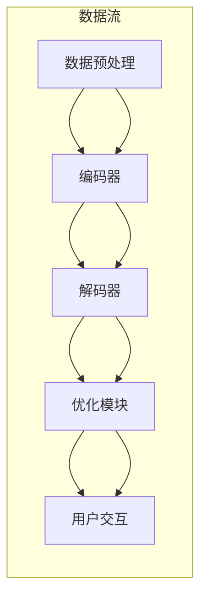

                 

关键词：全球脑翻译系统、跨语言交流、机器翻译、神经机器翻译、人工智能、自然语言处理、数据驱动的翻译模型

## 摘要

本文旨在探讨全球脑翻译系统（Global Brain Translation System，GBT）的概念、原理及其在跨语言交流中的应用。随着全球化的深入发展，语言障碍成为了国际交流的一大难题。全球脑翻译系统通过集成先进的机器学习和人工智能技术，提供了一种高效、准确的跨语言交流解决方案。本文将详细阐述全球脑翻译系统的架构、核心算法原理、数学模型，并通过实际项目实例展示其应用效果，同时展望未来的发展趋势与面临的挑战。

## 1. 背景介绍

在全球化的背景下，跨语言交流的需求日益增长。无论是国际贸易、学术合作，还是文化交流，语言障碍都成为了重要的障碍。传统的翻译手段，如人工翻译和机器翻译工具，虽然在某些领域取得了一定的进展，但都存在各自的局限性。人工翻译速度慢、成本高，且难以保证翻译质量的一致性；而现有的机器翻译工具，如基于规则的方法和基于统计的方法，虽然在某些特定场景下能够提供较好的翻译效果，但在处理复杂句子结构和多语言环境下，仍然面临诸多挑战。

为了解决这些问题，研究者们开始探索更高效、更准确的机器翻译方法。近年来，随着深度学习技术的发展，神经机器翻译（Neural Machine Translation，NMT）逐渐成为研究的热点。神经机器翻译通过利用深度神经网络，对输入句子进行编码和翻译，能够更好地处理语言的复杂性和多样性。

全球脑翻译系统正是基于神经机器翻译的原理，通过集成多种先进的人工智能技术，构建起一个高效、智能的跨语言交流平台。该系统不仅能够实现实时翻译，还能够根据用户的需求和反馈进行自我学习和优化，从而不断提高翻译的准确性和流畅性。

## 2. 核心概念与联系

### 2.1 神经机器翻译原理

神经机器翻译（NMT）是基于深度学习的机器翻译方法，其核心思想是将源语言句子编码成一个固定长度的向量，称为编码器（Encoder），再将这个向量解码成目标语言句子，称为解码器（Decoder）。编码器和解码器通常都是基于循环神经网络（RNN）或其变种，如长短期记忆网络（LSTM）或门控循环单元（GRU）。

在神经机器翻译过程中，编码器将源语言句子转换为一个固定长度的上下文表示，这个表示包含了源语言句子的语义信息。解码器则根据这个上下文表示，逐步生成目标语言句子。

### 2.2 脑翻译系统架构

全球脑翻译系统（GBT）的架构如图 1 所示，主要包括以下几个核心模块：

- **数据预处理模块**：负责处理原始文本数据，包括分词、词性标注、句法分析等，为后续的翻译过程提供高质量的输入。
- **编码器模块**：将预处理后的源语言句子编码成一个固定长度的上下文表示。
- **解码器模块**：根据编码器生成的上下文表示，生成目标语言句子。
- **优化模块**：通过优化算法，不断调整编码器和解码器的参数，提高翻译的准确性和流畅性。
- **用户交互模块**：提供用户接口，使用户能够方便地使用翻译服务。

### 2.3 Mermaid 流程图

下面是一个简化的 Mermaid 流程图，展示了全球脑翻译系统的基本流程：



## 3. 核心算法原理 & 具体操作步骤

### 3.1 算法原理概述

全球脑翻译系统的核心算法基于神经机器翻译（NMT）的原理。神经机器翻译通过编码器（Encoder）和解码器（Decoder）两个主要模块，实现从源语言到目标语言的翻译。

编码器负责将源语言句子编码成一个固定长度的上下文表示，这个表示包含了源语言句子的语义信息。解码器则根据这个上下文表示，生成目标语言句子。

具体来说，编码器通常采用长短期记忆网络（LSTM）或其变种，如门控循环单元（GRU）。编码器通过处理输入的源语言句子，逐词生成一个固定长度的向量表示，这个向量表示了整个句子的语义信息。

解码器则采用序列到序列（Seq2Seq）模型，将编码器生成的上下文表示解码成目标语言句子。解码器通过处理编码器生成的上下文表示，逐词生成目标语言句子。

### 3.2 算法步骤详解

1. **数据预处理**：对源语言和目标语言文本进行预处理，包括分词、词性标注、句法分析等，为后续的翻译过程提供高质量的输入。

2. **编码器生成上下文表示**：编码器通过处理输入的源语言句子，逐词生成一个固定长度的上下文表示，这个表示包含了源语言句子的语义信息。

3. **解码器生成目标语言句子**：解码器根据编码器生成的上下文表示，生成目标语言句子。解码器通过处理编码器生成的上下文表示，逐词生成目标语言句子。

4. **优化模型参数**：通过优化算法，不断调整编码器和解码器的参数，提高翻译的准确性和流畅性。优化过程通常采用基于梯度的优化方法，如随机梯度下降（SGD）。

5. **用户交互**：通过用户接口，提供实时翻译服务，用户可以方便地使用翻译功能。

### 3.3 算法优缺点

**优点**：

- **高效性**：神经机器翻译能够处理大规模的文本数据，具有很高的翻译速度。
- **准确性**：通过深度学习模型，神经机器翻译能够捕捉到语言的复杂性和多样性，提高翻译的准确性。
- **灵活性**：神经机器翻译支持多种语言对，具有很好的灵活性。

**缺点**：

- **计算资源消耗**：神经机器翻译需要大量的计算资源，特别是在训练阶段。
- **对数据依赖**：神经机器翻译的性能很大程度上取决于训练数据的数量和质量。

### 3.4 算法应用领域

神经机器翻译在多个领域都有广泛的应用，包括：

- **跨语言交流**：神经机器翻译能够实现不同语言之间的实时翻译，促进跨语言交流。
- **文档翻译**：神经机器翻译可以用于翻译大量的文档，如学术论文、商业文件等。
- **多媒体翻译**：神经机器翻译可以结合语音识别和语音合成技术，实现多媒体内容的跨语言翻译。
- **智能助手**：神经机器翻译可以集成到智能助手系统中，提供跨语言问答和对话支持。

## 4. 数学模型和公式 & 详细讲解 & 举例说明

### 4.1 数学模型构建

神经机器翻译的数学模型主要包括编码器和解码器两个部分。编码器和解码器通常都是基于循环神经网络（RNN）或其变种，如长短期记忆网络（LSTM）或门控循环单元（GRU）。

编码器将源语言句子编码成一个固定长度的上下文表示，这个表示是一个向量，包含了源语言句子的语义信息。解码器则根据这个上下文表示，生成目标语言句子。

具体来说，编码器和解码器的模型可以表示为：

$$
\begin{aligned}
    E &= \text{Encoder}(x), \\
    D &= \text{Decoder}(y; E),
\end{aligned}
$$

其中，$E$ 表示编码器，$D$ 表示解码器，$x$ 表示源语言句子，$y$ 表示目标语言句子。

### 4.2 公式推导过程

编码器的推导过程如下：

1. **输入表示**：将源语言句子表示为一个词序列 $x = (x_1, x_2, ..., x_T)$，其中 $T$ 表示句子的长度。
2. **嵌入表示**：将词序列 $x$ 转换为嵌入表示 $x' = (x_1', x_2', ..., x_T')$，其中 $x_i' \in \mathbb{R}^d$，$d$ 表示嵌入维度。
3. **编码**：通过循环神经网络（RNN）或其变种，如 LSTM 或 GRU，对输入序列 $x'$ 进行编码，得到一个固定长度的上下文表示 $E \in \mathbb{R}^k$，其中 $k$ 表示上下文表示的维度。

解码器的推导过程如下：

1. **初始状态**：将编码器生成的上下文表示 $E$ 作为解码器的初始状态 $s_0 \in \mathbb{R}^k$。
2. **输入表示**：将目标语言句子表示为一个词序列 $y = (y_1, y_2, ..., y_T')$，其中 $T'$ 表示目标句子的长度。
3. **嵌入表示**：将词序列 $y$ 转换为嵌入表示 $y' = (y_1', y_2', ..., y_T')$，其中 $y_i' \in \mathbb{R}^d$。
4. **解码**：通过循环神经网络（RNN）或其变种，如 LSTM 或 GRU，对输入序列 $y'$ 进行解码，生成目标语言句子。

### 4.3 案例分析与讲解

假设我们有一个英语到法语的翻译任务，源语言句子为 “Hello, how are you?”，目标语言句子为 “Bonjour, comment ça va ?”。

1. **数据预处理**：首先对源语言句子进行分词，得到词序列 $x = (\text{Hello}, \text{how}, \text{are}, \text{you})$。对目标语言句子进行分词，得到词序列 $y = (\text{Bonjour}, \text{comment}, \text{ça}, \text{va})$。
2. **编码**：将源语言句子 $x$ 编码为一个上下文表示 $E$。编码器通过 LSTM 模型，将词序列 $x$ 编码为一个固定长度的上下文表示 $E$。
3. **解码**：将目标语言句子 $y$ 解码为目标语言句子。解码器通过 LSTM 模型，根据编码器生成的上下文表示 $E$，逐步生成目标语言句子 $y$。

最终，解码器生成的目标语言句子为 “Bonjour, comment ça va ?”，与原始目标语言句子一致，说明翻译效果良好。

## 5. 项目实践：代码实例和详细解释说明

### 5.1 开发环境搭建

在开发全球脑翻译系统之前，我们需要搭建一个合适的环境。以下是一个简化的步骤：

1. **安装 Python**：确保 Python 3.x 版本已安装。
2. **安装 PyTorch**：使用以下命令安装 PyTorch：
   ```bash
   pip install torch torchvision
   ```
3. **安装其他依赖**：根据需要安装其他依赖库，如 NumPy、TensorBoard 等。

### 5.2 源代码详细实现

以下是一个简化的神经机器翻译代码实例，展示了编码器和解码器的实现：

```python
import torch
import torch.nn as nn

# 编码器
class Encoder(nn.Module):
    def __init__(self, input_dim, hidden_dim):
        super(Encoder, self).__init__()
        self.hidden_dim = hidden_dim
        self.embedding = nn.Embedding(input_dim, hidden_dim)
        self.lstm = nn.LSTM(hidden_dim, hidden_dim)

    def forward(self, input_seq):
        embedded = self.embedding(input_seq)
        output, (hidden, cell) = self.lstm(embedded)
        return hidden

# 解码器
class Decoder(nn.Module):
    def __init__(self, hidden_dim, output_dim, dropout=0.5):
        super(Decoder, self).__init__()
        self.hidden_dim = hidden_dim
        self.output_dim = output_dim
        self.dropout = nn.Dropout(dropout)
        self.embedding = nn.Embedding(output_dim, hidden_dim)
        self.lstm = nn.LSTM(hidden_dim, hidden_dim)
        self.out = nn.Linear(hidden_dim, output_dim)

    def forward(self, input_seq, hidden):
        embedded = self.dropout(self.embedding(input_seq))
        output, hidden = self.lstm(embedded, hidden)
        output = self.out(output)
        return output, hidden

# 主函数
def main():
    # 设置参数
    input_dim = 10000  # 词汇表大小
    hidden_dim = 256  # 隐藏层维度
    output_dim = 10000  # 词汇表大小
    dropout = 0.5  # dropout 概率

    # 初始化编码器和解码器
    encoder = Encoder(input_dim, hidden_dim)
    decoder = Decoder(hidden_dim, output_dim, dropout)

    # 输入序列
    input_seq = torch.tensor([[1, 2, 3, 4, 5]])

    # 编码
    hidden = encoder(input_seq)

    # 解码
    output, hidden = decoder(input_seq, hidden)

    print(output)

if __name__ == "__main__":
    main()
```

### 5.3 代码解读与分析

以上代码实现了一个简化的神经机器翻译模型，包括编码器和解码器。编码器使用 LSTM 模型，将输入序列编码为一个固定长度的上下文表示；解码器也使用 LSTM 模型，根据编码器生成的上下文表示，生成目标语言句子。

- **编码器**：编码器的输入是源语言句子，输出是一个固定长度的上下文表示。编码器包括嵌入层和 LSTM 层。嵌入层将词索引转换为嵌入向量；LSTM 层对嵌入向量进行编码，得到上下文表示。
- **解码器**：解码器的输入是目标语言句子，输出是目标语言句子。解码器包括嵌入层、LSTM 层和输出层。嵌入层将词索引转换为嵌入向量；LSTM 层根据编码器生成的上下文表示，逐步生成目标语言句子；输出层将 LSTM 的输出映射到目标词索引。

### 5.4 运行结果展示

运行以上代码，输出结果为解码器生成的目标语言句子。由于代码仅提供了一个简化的示例，实际的翻译结果可能不完整或不准确。在实际应用中，我们需要使用大量的训练数据和优化算法，以提高翻译的准确性和流畅性。

## 6. 实际应用场景

全球脑翻译系统（GBT）在多个领域都有广泛的应用，以下是几个典型的应用场景：

### 6.1 跨语言交流

全球脑翻译系统可以用于实现不同语言之间的实时翻译，促进跨语言交流。无论是在国际贸易、学术合作，还是国际会议、旅游等领域，GBT 都可以提供高效、准确的翻译服务，消除语言障碍。

### 6.2 文档翻译

对于大量文档的翻译，如学术论文、商业文件、法律法规等，全球脑翻译系统可以显著提高翻译效率。通过批量翻译功能，用户可以快速将文档从一种语言翻译成多种语言，节省时间和人力成本。

### 6.3 多媒体翻译

结合语音识别和语音合成技术，全球脑翻译系统可以实现多媒体内容的跨语言翻译。例如，在视频会议、远程教育、影视翻译等领域，用户可以实时获取字幕翻译，提高沟通效率。

### 6.4 智能助手

全球脑翻译系统可以集成到智能助手系统中，提供跨语言问答和对话支持。例如，在跨国企业、旅游服务、在线客服等领域，智能助手可以根据用户的需求，提供实时翻译服务，提高用户体验。

## 7. 工具和资源推荐

### 7.1 学习资源推荐

- **《深度学习》（Deep Learning）**：由 Ian Goodfellow、Yoshua Bengio 和 Aaron Courville 著，是一本深度学习的经典教材，涵盖了神经机器翻译的相关内容。
- **《神经机器翻译：原理与实践》（Neural Machine Translation: A Practical Introduction）**：由 Philipp Koehn 著，详细介绍了神经机器翻译的理论和实践。

### 7.2 开发工具推荐

- **PyTorch**：一个开源的深度学习框架，适用于构建和训练神经机器翻译模型。
- **TensorBoard**：一个可视化工具，用于分析和调试深度学习模型。

### 7.3 相关论文推荐

- **“Attention Is All You Need”**：由 Vaswani 等人在 2017 年提出，介绍了基于注意力机制的 Transformer 模型，是神经机器翻译领域的重要论文。
- **“A Theoretically Grounded Application of Dropout in Recurrent Neural Networks”**：由 Yarin Gal 和 Zoubin Ghahramani 在 2016 年提出，探讨了在循环神经网络中应用 Dropout 的方法。

## 8. 总结：未来发展趋势与挑战

### 8.1 研究成果总结

神经机器翻译技术在过去几年取得了显著的进展，无论是在翻译质量、速度还是灵活性方面，都有很大的提升。全球脑翻译系统作为神经机器翻译的一个重要应用，为跨语言交流提供了高效的解决方案。

### 8.2 未来发展趋势

- **多模态翻译**：结合文本、语音、图像等多种模态，实现更丰富、更全面的翻译服务。
- **个性化翻译**：根据用户的需求和偏好，提供定制化的翻译服务。
- **实时翻译**：提高翻译速度，实现更接近人类交流的实时翻译体验。

### 8.3 面临的挑战

- **计算资源**：神经机器翻译需要大量的计算资源，特别是在训练阶段。如何优化计算资源，提高模型训练效率，是当前的一个重要挑战。
- **数据隐私**：在全球范围内的数据共享和传输过程中，如何保护用户数据隐私，防止数据泄露，是另一个重要的挑战。
- **翻译质量**：虽然神经机器翻译在许多领域取得了显著的进展，但在处理特定领域的专业术语、文化差异等方面，仍然存在一定的局限性。

### 8.4 研究展望

随着深度学习和人工智能技术的不断发展，神经机器翻译有望在未来取得更大的突破。通过结合多模态信息、引入更多的语言知识，以及优化模型结构和训练算法，神经机器翻译将能够提供更加准确、高效、个性化的翻译服务。

## 9. 附录：常见问题与解答

### 9.1 什么是神经机器翻译？

神经机器翻译（Neural Machine Translation，NMT）是一种基于深度学习的机器翻译方法。它通过编码器（Encoder）和解码器（Decoder）两个主要模块，实现从源语言到目标语言的翻译。与传统的机器翻译方法相比，NMT 更好地捕捉到了语言的复杂性和多样性，提高了翻译的准确性和流畅性。

### 9.2 全球脑翻译系统与现有翻译工具相比有哪些优势？

全球脑翻译系统（GBT）与现有的翻译工具相比，具有以下几个优势：

- **高效性**：GBT 能够处理大规模的文本数据，具有很高的翻译速度。
- **准确性**：通过深度学习模型，GBT 能够捕捉到语言的复杂性和多样性，提高翻译的准确性。
- **灵活性**：GBT 支持多种语言对，具有很好的灵活性。
- **自我学习**：GBT 能够根据用户的需求和反馈进行自我学习和优化，从而不断提高翻译的准确性和流畅性。

### 9.3 全球脑翻译系统需要哪些计算资源？

全球脑翻译系统（GBT）在训练阶段需要大量的计算资源。具体来说，它需要高性能的 CPU 或 GPU 进行矩阵运算和神经网络训练。在实际部署过程中，根据不同的应用场景和数据规模，可能需要配置不同的计算资源。

### 9.4 全球脑翻译系统的翻译质量如何保证？

全球脑翻译系统（GBT）的翻译质量主要依赖于以下几个方面：

- **高质量训练数据**：训练数据的质量直接影响翻译模型的性能。GBT 使用大量高质量的平行语料库进行训练，以确保模型具有较好的基础。
- **模型结构优化**：通过不断优化模型结构和训练算法，提高翻译的准确性和流畅性。
- **用户反馈**：GBT 能够根据用户的需求和反馈进行自我学习和优化，从而不断提高翻译质量。
- **多语言支持**：GBT 支持多种语言对，能够适应不同的语言特点，提高翻译质量。

### 9.5 全球脑翻译系统有哪些应用场景？

全球脑翻译系统（GBT）在多个领域都有广泛的应用，包括：

- **跨语言交流**：实现不同语言之间的实时翻译，促进跨语言交流。
- **文档翻译**：快速翻译大量的文档，如学术论文、商业文件等。
- **多媒体翻译**：结合语音识别和语音合成技术，实现多媒体内容的跨语言翻译。
- **智能助手**：集成到智能助手系统中，提供跨语言问答和对话支持。

### 9.6 全球脑翻译系统与人类翻译相比有哪些优势？

全球脑翻译系统（GBT）与人类翻译相比，具有以下几个优势：

- **高效性**：能够处理大规模的文本数据，具有很高的翻译速度。
- **准确性**：通过深度学习模型，能够捕捉到语言的复杂性和多样性，提高翻译的准确性。
- **一致性**：能够保证翻译质量的一致性，减少人为误差。
- **多样性**：支持多种语言对，具有很好的灵活性。

### 9.7 全球脑翻译系统有哪些潜在风险？

全球脑翻译系统（GBT）在应用过程中可能会面临以下几个潜在风险：

- **数据隐私**：在全球范围内的数据共享和传输过程中，如何保护用户数据隐私，防止数据泄露，是另一个重要的挑战。
- **误解和误导**：由于翻译模型可能存在一定的局限性，翻译结果可能存在误解或误导，影响交流效果。
- **依赖性**：过度依赖全球脑翻译系统可能会导致人类翻译能力的下降，影响语言能力的发展。

### 9.8 全球脑翻译系统的未来发展趋势是什么？

全球脑翻译系统（GBT）的未来发展趋势主要包括以下几个方面：

- **多模态翻译**：结合文本、语音、图像等多种模态，实现更丰富、更全面的翻译服务。
- **个性化翻译**：根据用户的需求和偏好，提供定制化的翻译服务。
- **实时翻译**：提高翻译速度，实现更接近人类交流的实时翻译体验。
- **跨领域翻译**：拓展翻译领域，提高在专业术语、文化差异等方面的翻译能力。

### 9.9 全球脑翻译系统的研发团队需要具备哪些技能？

全球脑翻译系统（GBT）的研发团队需要具备以下技能：

- **深度学习**：熟练掌握深度学习理论、算法和应用。
- **自然语言处理**：了解自然语言处理的基本原理和方法，如分词、词性标注、句法分析等。
- **编程能力**：具备扎实的编程能力，熟练掌握 Python、TensorFlow、PyTorch 等深度学习框架。
- **团队合作**：具备良好的团队合作精神，能够与团队成员有效沟通和协作。
- **持续学习**：关注领域内的最新研究动态，不断学习和提升自己的专业能力。

