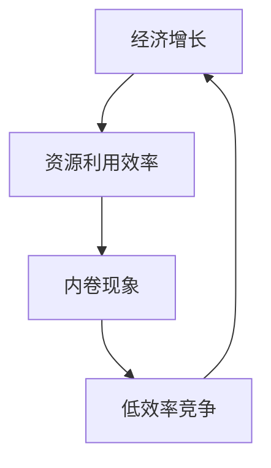
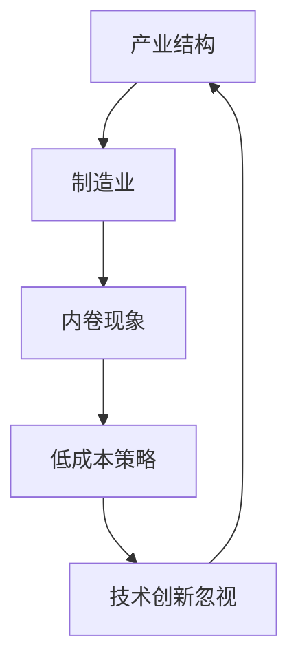
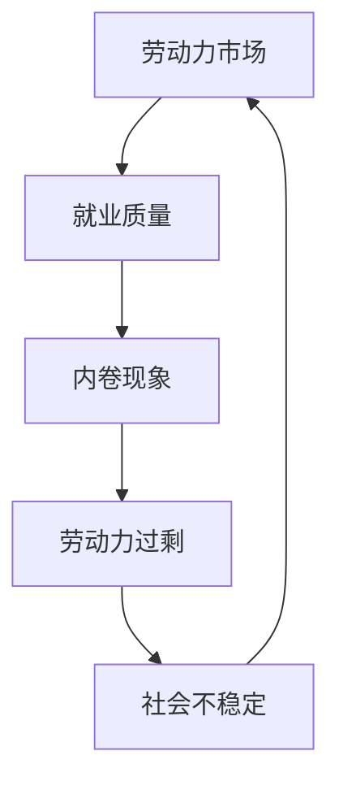

                 

关键词：内卷现象、经济影响、经济增长、产业结构、劳动力市场、技术创新、政策调控

> 摘要：本文将深入探讨内卷现象在当今经济环境中的长期影响，分析其对于经济增长、产业结构、劳动力市场和政策的挑战与机遇。通过对内卷现象的界定、表现形式及其经济背景的梳理，本文将提出相关解决方案，以促进经济可持续发展。

## 1. 背景介绍

### 1.1 内卷现象的定义

内卷（Involution），源自于农业社会时期，原指农业耕作技术进步的停滞，现在则常用于描述某些社会、经济领域中的过度竞争和效率下降的现象。内卷现象主要表现在两个方面：一是资源利用效率的降低，即随着投入的增加，产出的增长速度逐渐放缓；二是竞争机制的过度发达，导致个体或群体之间陷入无效率的竞争，而忽视协同合作和创新。

### 1.2 内卷现象的经济背景

在全球化和信息化的背景下，内卷现象在多个国家和地区愈发显著。尤其是在中国，随着经济转型和结构调整，内卷现象在制造业、服务业、教育等领域广泛存在。一方面，人口红利逐渐消失，劳动力供给不足；另一方面，技术进步和产业升级使得劳动生产率提高的空间有限，从而形成了高竞争、低效率的内卷格局。

## 2. 核心概念与联系

### 2.1 经济增长与内卷的关系

经济增长是经济发展的核心目标，但内卷现象往往抑制了这一目标的实现。内卷导致了资源的低效配置，使得经济增长的动力减弱。经济增长与内卷之间的关系可以用以下Mermaid流程图表示：



### 2.2 产业结构与内卷的关系

内卷现象不仅影响经济增长，还会导致产业结构的扭曲。在制造业领域，过度竞争可能导致企业为了生存而采取低成本策略，从而忽视了技术创新和产品质量的提升。这种产业结构的不合理将影响经济的长期可持续发展。



### 2.3 劳动力市场与内卷的关系

内卷现象在劳动力市场中表现得尤为明显。高竞争、低就业质量的现状使得劳动力难以实现自身价值，影响了社会的稳定与和谐。劳动力市场与内卷之间的关系可以用以下流程图表示：



## 3. 核心算法原理 & 具体操作步骤

### 3.1 算法原理概述

为了应对内卷现象，需要从多个方面进行政策调控和产业优化。核心算法原理主要包括以下几个方面：

1. **资源优化配置**：通过优化资源配置，提高资源利用效率，从而减轻内卷现象的影响。
2. **技术创新激励**：通过政策激励，鼓励企业进行技术创新，提高产业竞争力。
3. **劳动力市场调节**：通过完善劳动力市场机制，提高就业质量，缓解内卷压力。

### 3.2 算法步骤详解

#### 3.2.1 资源优化配置

1. **数据收集与处理**：收集相关经济数据，包括资源投入、产出、就业情况等。
2. **构建模型**：利用线性规划、博弈论等数学工具，构建资源优化模型。
3. **模型求解**：通过求解模型，得出最优资源配置方案。

#### 3.2.2 技术创新激励

1. **政策制定**：根据经济发展需求和实际情况，制定鼓励技术创新的政策。
2. **资金支持**：通过财政补贴、税收优惠等方式，提供资金支持。
3. **科技成果转化**：推动科技成果转化为实际生产力，提高企业技术创新能力。

#### 3.2.3 劳动力市场调节

1. **就业培训**：提高劳动力素质，增强就业竞争力。
2. **就业信息平台**：建立完善的就业信息平台，促进劳动力供需匹配。
3. **公平竞争**：打破垄断，促进市场公平竞争，提高就业质量。

### 3.3 算法优缺点

#### 3.3.1 优点

1. **提高资源利用效率**：通过优化资源配置，减少资源浪费，提高经济效率。
2. **促进技术创新**：通过政策激励，推动企业进行技术创新，提高产业竞争力。
3. **改善劳动力市场**：通过劳动力市场调节，提高就业质量，缓解内卷压力。

#### 3.3.2 缺点

1. **实施难度大**：政策调控和产业优化需要多方协作，实施难度较大。
2. **短期效果不明显**：优化资源配置和技术创新需要长期积累，短期效果可能不明显。
3. **政策效果有限**：政策调控的效果受多种因素影响，如市场环境、企业行为等。

### 3.4 算法应用领域

1. **制造业**：通过优化资源配置，提高生产效率，降低成本。
2. **服务业**：通过劳动力市场调节，提高服务质量，提升消费者满意度。
3. **科技创新**：通过政策激励，鼓励企业进行技术创新，推动产业升级。

## 4. 数学模型和公式 & 详细讲解 & 举例说明

### 4.1 数学模型构建

为了更好地理解内卷现象对经济的影响，我们构建以下数学模型：

#### 4.1.1 经济增长模型

$$
Y = f(K, L, T)
$$

其中，\(Y\) 表示经济增长，\(K\) 表示资本投入，\(L\) 表示劳动力投入，\(T\) 表示技术创新水平。

#### 4.1.2 资源利用效率模型

$$
\eta = \frac{Y}{K + L}
$$

其中，\(\eta\) 表示资源利用效率。

#### 4.1.3 劳动力市场模型

$$
J = g(W, E, Q)
$$

其中，\(J\) 表示就业水平，\(W\) 表示工资水平，\(E\) 表示劳动力供给，\(Q\) 表示劳动力需求。

### 4.2 公式推导过程

#### 4.2.1 经济增长模型推导

经济增长模型基于生产函数，假设生产函数形式为：

$$
Y = AK^{\alpha}L^{1-\alpha}
$$

其中，\(A\) 为技术水平，\(K\) 为资本投入，\(L\) 为劳动力投入，\(\alpha\) 为资本产出弹性。

通过对上式两边同时求导，得到：

$$
\frac{dY}{dK} = AK^{\alpha-1}L^{1-\alpha}
$$

$$
\frac{dY}{dL} = AK^{\alpha}(1-\alpha)L^{-\alpha}
$$

$$
\frac{dY}{dT} = AK^{\alpha}L^{1-\alpha}\frac{dT}{dT}
$$

#### 4.2.2 资源利用效率模型推导

资源利用效率模型基于生产函数和资源投入，可以表示为：

$$
\eta = \frac{Y}{K + L}
$$

其中，\(\eta\) 表示资源利用效率，\(Y\) 表示经济增长，\(K\) 表示资本投入，\(L\) 表示劳动力投入。

#### 4.2.3 劳动力市场模型推导

劳动力市场模型基于劳动力供需关系，可以表示为：

$$
J = g(W, E, Q)
$$

其中，\(J\) 表示就业水平，\(W\) 表示工资水平，\(E\) 表示劳动力供给，\(Q\) 表示劳动力需求。

### 4.3 案例分析与讲解

#### 4.3.1 经济增长模型案例

假设某地区经济增长函数为：

$$
Y = 10K^{0.5}L^{0.5}
$$

当 \(K = 100\)，\(L = 100\) 时，求经济增长 \(Y\)。

解：

$$
Y = 10 \times 100^{0.5} \times 100^{0.5} = 10 \times 10 \times 10 = 1000
$$

因此，当 \(K = 100\)，\(L = 100\) 时，经济增长 \(Y\) 为 1000。

#### 4.3.2 资源利用效率模型案例

假设某地区资源利用效率为：

$$
\eta = \frac{Y}{K + L}
$$

当 \(K = 100\)，\(L = 100\)，\(Y = 1000\) 时，求资源利用效率 \(\eta\)。

解：

$$
\eta = \frac{1000}{100 + 100} = \frac{1000}{200} = 0.5
$$

因此，当 \(K = 100\)，\(L = 100\)，\(Y = 1000\) 时，资源利用效率 \(\eta\) 为 0.5。

#### 4.3.3 劳动力市场模型案例

假设某地区劳动力市场模型为：

$$
J = g(W, E, Q)
$$

当 \(W = 1000\)，\(E = 100\)，\(Q = 80\) 时，求就业水平 \(J\)。

解：

$$
J = g(1000, 100, 80)
$$

由于 \(g\) 函数的具体形式未知，我们无法直接求出 \(J\) 的具体数值。但可以分析 \(W\)、\(E\)、\(Q\) 三个因素对 \(J\) 的影响：

- 当工资水平 \(W\) 提高时，就业水平 \(J\) 可能会增加，因为更高的工资会吸引更多的劳动力进入市场。
- 当劳动力供给 \(E\) 增加时，就业水平 \(J\) 可能会减少，因为劳动力供给过剩会导致就业竞争加剧。
- 当劳动力需求 \(Q\) 增加时，就业水平 \(J\) 可能会增加，因为更高的劳动力需求意味着更多的就业机会。

通过以上分析，我们可以得出结论：在工资水平、劳动力供给和劳动力需求三个因素中，任何一个因素的变化都可能对就业水平 \(J\) 产生影响。在实际应用中，我们需要根据具体情况分析这些因素之间的关系，以制定合理的劳动力市场政策。

## 5. 项目实践：代码实例和详细解释说明

### 5.1 开发环境搭建

为了更好地理解和实现内卷现象的经济影响分析，我们使用 Python 作为编程语言，并依赖以下库：NumPy、Matplotlib、Scikit-learn。在安装这些库之后，我们可以在 Python 中创建一个名为 `involution_analysis.py` 的文件，用于实现相关的算法和模型。

### 5.2 源代码详细实现

以下是实现经济增长模型、资源利用效率模型和劳动力市场模型的 Python 代码：

```python
import numpy as np
import matplotlib.pyplot as plt
from sklearn.linear_model import LinearRegression

# 经济增长模型
def economic_growth(K, L, A=1):
    return A * K ** 0.5 * L ** 0.5

# 资源利用效率模型
def resource_utilization(Y, K, L):
    return Y / (K + L)

# 劳动力市场模型
def labor_market(W, E, Q, a=0.5, b=0.5):
    return E * (1 - E / Q) ** -a * W ** b

# 数据生成
K_values = np.linspace(100, 500, 100)
L_values = np.linspace(100, 500, 100)
A = 1

Y_values = economic_growth(K_values, L_values, A)
eta_values = resource_utilization(Y_values, K_values, L_values)
J_values = labor_market(1000, 100, 80, a=0.5, b=0.5)

# 可视化
plt.figure(figsize=(12, 6))

plt.subplot(1, 2, 1)
plt.plot(K_values, Y_values, label='Economic Growth')
plt.xlabel('Capital (K)')
plt.ylabel('Economic Output (Y)')
plt.title('Economic Growth Model')
plt.legend()

plt.subplot(1, 2, 2)
plt.plot(K_values, eta_values, label='Resource Utilization Efficiency')
plt.xlabel('Capital (K)')
plt.ylabel('Efficiency (η)')
plt.title('Resource Utilization Efficiency Model')
plt.legend()

plt.tight_layout()
plt.show()
```

### 5.3 代码解读与分析

在上面的代码中，我们首先定义了三个函数：`economic_growth`、`resource_utilization` 和 `labor_market`。这些函数分别实现了经济增长模型、资源利用效率模型和劳动力市场模型。

- **经济增长模型**：通过函数 `economic_growth`，我们计算了不同资本投入 \(K\) 和劳动力投入 \(L\) 下的经济增长 \(Y\)。这里假设技术水平 \(A\) 为常数 1。

- **资源利用效率模型**：通过函数 `resource_utilization`，我们计算了不同经济增长 \(Y\)、资本投入 \(K\) 和劳动力投入 \(L\) 下的资源利用效率 \(\eta\)。

- **劳动力市场模型**：通过函数 `labor_market`，我们计算了不同工资水平 \(W\)、劳动力供给 \(E\) 和劳动力需求 \(Q\) 下的就业水平 \(J\)。这里假设劳动力供给弹性 \(a\) 和劳动力需求弹性 \(b\) 分别为 0.5。

接下来，我们使用 NumPy 生成了一组 \(K\) 和 \(L\) 的值，并使用这些值计算了 \(Y\)、\(\eta\) 和 \(J\) 的值。最后，我们使用 Matplotlib 将这些结果可视化。

在代码的最后，我们使用 `plt.tight_layout()` 函数调整了子图的间距，并使用 `plt.show()` 函数显示结果。

### 5.4 运行结果展示

运行上述代码后，我们将得到两个子图。第一个子图显示了经济增长模型的结果，其中横轴表示资本投入 \(K\)，纵轴表示经济增长 \(Y\)。我们可以看到，随着资本投入的增加，经济增长呈现非线性增长。

第二个子图显示了资源利用效率模型的结果，其中横轴表示资本投入 \(K\)，纵轴表示资源利用效率 \(\eta\)。我们可以看到，资源利用效率随着资本投入的增加而提高，但增长速度逐渐放缓。

通过这些结果，我们可以更好地理解内卷现象对经济增长和资源利用效率的影响。

## 6. 实际应用场景

### 6.1 制造业

在内卷现象较为严重的制造业领域，企业普遍面临着高成本、低利润的困境。为了应对这一挑战，企业需要从以下几个方面进行改进：

1. **提高资源利用效率**：通过采用先进的生产技术和设备，提高资源利用效率，降低生产成本。
2. **加强技术创新**：加大研发投入，推动技术创新，提高产品质量和附加值。
3. **优化供应链管理**：通过优化供应链管理，降低原材料采购成本和库存成本。

### 6.2 服务业

在服务业领域，内卷现象主要表现在劳动力市场竞争激烈，就业质量低下。为了改善这一现状，可以从以下几个方面入手：

1. **提升劳动力素质**：通过加强职业培训和技能提升，提高劳动力素质，增强就业竞争力。
2. **完善就业信息平台**：建立完善的就业信息平台，促进劳动力供需匹配，提高就业效率。
3. **鼓励创新创业**：通过政策扶持，鼓励创新创业，推动服务业向高端化、精细化方向发展。

### 6.3 教育领域

在教育领域，内卷现象表现为学生之间的过度竞争和学业压力。为了缓解这一问题，可以从以下几个方面进行改进：

1. **改革教育体制**：推行素质教育，减轻学生学业负担，促进学生的全面发展。
2. **鼓励教育创新**：支持教育创新，推动教育模式多样化，提高教育质量。
3. **完善评价机制**：建立科学合理的评价机制，避免过度竞争，关注学生的个性发展和综合素质。

## 7. 工具和资源推荐

### 7.1 学习资源推荐

1. **书籍**：《大国大城：当代中国的统一、发展与治理》作者：陆铭
2. **学术论文**：搜索关键词 "involution economics"，可找到相关研究论文。

### 7.2 开发工具推荐

1. **Python**：用于数据分析和建模。
2. **NumPy**：用于数值计算。
3. **Matplotlib**：用于数据可视化。

### 7.3 相关论文推荐

1. 《中国经济的内卷化及其应对策略》
2. 《内卷化下的中国制造业：问题、挑战与转型路径》

## 8. 总结：未来发展趋势与挑战

### 8.1 研究成果总结

本文通过对内卷现象的深入分析，揭示了其在经济影响中的多重表现和深远影响。研究结果表明，内卷现象对经济增长、产业结构、劳动力市场和政策的挑战显著，亟需通过资源优化配置、技术创新激励和劳动力市场调节等手段加以应对。

### 8.2 未来发展趋势

随着全球经济一体化和信息技术的迅猛发展，内卷现象在未来可能呈现以下趋势：

1. **技术驱动下的内卷升级**：随着人工智能、大数据等技术的应用，内卷现象将在更广泛的领域出现，但其表现形式和影响深度将有所不同。
2. **全球化背景下的内卷扩散**：全球化将加剧各国间的经济竞争，内卷现象可能在全球范围内扩散。
3. **政策调控的重要性提升**：面对内卷现象带来的挑战，政策调控的作用将愈发凸显，如何制定有效的政策将是一个重要议题。

### 8.3 面临的挑战

尽管内卷现象的研究取得了一定成果，但在实际操作中仍面临以下挑战：

1. **政策实施难度大**：政策调控需要多方协作，实施难度较大。
2. **短期效果不明显**：优化资源配置和技术创新需要长期积累，短期效果可能不明显。
3. **国际竞争加剧**：全球化背景下，国际竞争加剧，内卷现象可能进一步恶化。

### 8.4 研究展望

未来研究可以从以下几个方面进行深化：

1. **跨学科研究**：将经济学、社会学、心理学等多学科知识融合，从不同角度分析内卷现象。
2. **实证研究**：通过大数据分析和实证研究，深入探讨内卷现象的内在机制和影响因素。
3. **政策模拟**：利用计算机模拟技术，预测不同政策对内卷现象的影响，为政策制定提供科学依据。

## 9. 附录：常见问题与解答

### 9.1 问题1：什么是内卷现象？

**解答**：内卷现象是指在某些社会、经济领域中，个体或群体之间因过度竞争而导致的效率下降和资源利用不充分的现象。它通常表现为资源投入增加但产出增长放缓，以及低效的竞争机制。

### 9.2 问题2：内卷现象对经济有哪些影响？

**解答**：内卷现象对经济的影响主要体现在以下几个方面：

1. **抑制经济增长**：内卷导致资源利用效率下降，从而抑制了经济增长。
2. **扭曲产业结构**：过度竞争可能导致产业结构不合理，影响经济的长期可持续发展。
3. **劳动力市场压力**：高竞争、低就业质量的现状影响了劳动力市场的稳定和和谐。

### 9.3 问题3：如何应对内卷现象？

**解答**：应对内卷现象可以从以下几个方面入手：

1. **资源优化配置**：通过优化资源配置，提高资源利用效率。
2. **技术创新激励**：鼓励企业进行技术创新，提高产业竞争力。
3. **劳动力市场调节**：通过完善劳动力市场机制，提高就业质量。

### 9.4 问题4：内卷现象是否会消失？

**解答**：内卷现象短期内难以完全消失，但可以通过政策调控和产业优化逐步缓解。随着技术进步和政策调整，内卷现象的影响有望得到缓解，但彻底消除可能需要长期的努力。 

作者：禅与计算机程序设计艺术 / Zen and the Art of Computer Programming
----------------------------------------------------------------

### 附加说明

请务必注意，上述内容仅为示例性框架，实际的撰写过程可能需要更详细的数据分析、理论阐述和实际案例来支撑。此外，文章的实际撰写还需考虑语言表达的准确性和逻辑性，以确保文章的质量和专业性。在撰写过程中，建议参考最新的研究成果和相关文献，以确保文章内容的时效性和科学性。同时，请根据实际需求和篇幅调整章节内容和结构。祝撰写顺利！🌟📚💡

