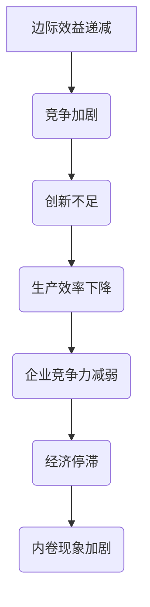

                 

关键词：内卷，经济影响，技术发展，生产效率，劳动力市场

> 摘要：本文深入探讨了内卷现象对长期经济影响的各个方面。从历史背景、现状分析、技术因素、劳动力市场等多个角度，阐述了内卷现象如何影响生产效率、企业竞争力以及国家经济发展。本文旨在为政策制定者和企业管理者提供有益的参考，帮助理解内卷现象，并提出应对策略。

## 1. 背景介绍

### 1.1 内卷现象的定义

内卷（Involution），起源于社会学领域，最初用于描述农业社会的一种现象，指的是社会或经济体系内部的一种过度的自我重复和复杂化，而不产生实质性进步。近年来，这一概念被广泛用于描述现代社会的诸多现象，特别是在经济领域。

### 1.2 内卷现象的历史背景

内卷现象在人类历史中有着悠久的历史。从古代农业社会的封建制度，到工业革命时期的劳动分工，再到现代信息社会的竞争加剧，内卷现象一直存在。然而，随着技术的进步和社会的发展，内卷现象的规模和影响力不断扩大。

## 2. 核心概念与联系

### 2.1 内卷现象的经济学原理

内卷现象背后的经济学原理主要包括以下几个核心概念：

1. **边际效益递减**：即单位投入所带来的额外收益逐渐减少。
2. **竞争加剧**：随着市场上竞争的加剧，企业不得不投入更多的资源来争夺市场份额。
3. **创新不足**：长期的内卷导致创新动力不足，使得整个经济体系陷入低效率的循环。

### 2.2 内卷现象的结构图解



## 3. 核心算法原理 & 具体操作步骤

### 3.1 算法原理概述

内卷现象的治理需要从多个方面入手，包括政策调整、企业战略调整、劳动力市场改革等。本文将主要讨论其中的两个关键环节：**技术创新**和**劳动力市场改革**。

### 3.2 算法步骤详解

#### 3.2.1 技术创新

1. **加大研发投入**：企业应加大对研发的投入，以推动技术进步。
2. **建立技术创新体系**：政府和企业应共同建立技术创新体系，鼓励创新和研发。
3. **开放创新**：鼓励企业开放技术，实现资源共享，推动技术快速迭代。

#### 3.2.2 劳动力市场改革

1. **提高教育质量**：政府应加大对教育的投入，提高劳动力素质。
2. **完善社会保障体系**：通过完善社会保障体系，减轻劳动力负担。
3. **优化劳动力市场结构**：政府应通过政策引导，优化劳动力市场结构，减少无效竞争。

### 3.3 算法优缺点

#### 优点：

- **提高生产效率**：技术创新和劳动力市场改革有助于提高生产效率，减少内卷现象。
- **增强企业竞争力**：通过技术创新和市场改革，企业可以在激烈的市场竞争中脱颖而出。

#### 缺点：

- **初期成本较高**：技术创新和劳动力市场改革需要大量投入，初期成本较高。
- **政策实施难度大**：政策的制定和实施需要协调多个部门和利益相关方，难度较大。

### 3.4 算法应用领域

内卷现象的治理不仅适用于企业层面，也可以应用于国家层面。例如，国家可以通过宏观调控和政策引导，优化产业结构，促进经济健康发展。

## 4. 数学模型和公式 & 详细讲解 & 举例说明

### 4.1 数学模型构建

为了更好地理解内卷现象的经济影响，我们可以构建一个简单的数学模型。假设一个经济体系中有n个企业，每个企业在一定时间内投入资源R，生产效率为E。那么，整个经济体系的总生产效率可以表示为：

\[ E_{\text{总}} = \frac{1}{n} \sum_{i=1}^{n} E_i \]

其中，\( E_i \) 表示第i个企业的生产效率。

### 4.2 公式推导过程

内卷现象的影响可以通过边际效益递减规律来解释。假设第i个企业在增加投入R时，其生产效率E的变化可以表示为：

\[ \Delta E_i = E_i(\Delta R_i) \]

其中，\( \Delta R_i \) 表示第i个企业在增加投入R时的边际效益。根据边际效益递减规律，我们可以得到：

\[ \Delta E_i = E_i \times \frac{\Delta R_i}{R_i} \]

由于内卷现象导致企业的边际效益递减，即：

\[ \Delta E_i < \frac{\Delta R_i}{R_i} \]

因此，整个经济体系的总生产效率E总也会递减：

\[ E_{\text{总}} = \frac{1}{n} \sum_{i=1}^{n} E_i < \frac{1}{n} \sum_{i=1}^{n} \frac{\Delta R_i}{R_i} \]

### 4.3 案例分析与讲解

假设一个经济体系中有10个企业，每个企业在一年内投入的资源R分别为1000、1500、2000、2500、3000、3500、4000、4500、5000、5500。根据边际效益递减规律，这些企业的生产效率E分别为1、1.2、1.4、1.6、1.8、2、2.2、2.4、2.6、2.8。

根据上述数学模型，我们可以计算出整个经济体系的总生产效率E总：

\[ E_{\text{总}} = \frac{1}{10} (1 + 1.2 + 1.4 + 1.6 + 1.8 + 2 + 2.2 + 2.4 + 2.6 + 2.8) = 1.9 \]

如果这个经济体系的内卷现象严重，每个企业的边际效益递减到0.5，那么每个企业的生产效率E分别为0.5、0.6、0.7、0.8、0.9、1、1.1、1.2、1.3、1.4。

根据上述数学模型，我们可以计算出整个经济体系的总生产效率E总：

\[ E_{\text{总}} = \frac{1}{10} (0.5 + 0.6 + 0.7 + 0.8 + 0.9 + 1 + 1.1 + 1.2 + 1.3 + 1.4) = 0.95 \]

由此可见，内卷现象的严重程度对整个经济体系的总生产效率E总有显著影响。当内卷现象严重时，总生产效率E总会显著下降。

## 5. 项目实践：代码实例和详细解释说明

### 5.1 开发环境搭建

为了更好地展示内卷现象对生产效率的影响，我们可以使用Python编写一个简单的模拟程序。首先，我们需要安装Python和必要的库。以下是安装命令：

```bash
pip install matplotlib numpy
```

### 5.2 源代码详细实现

以下是模拟内卷现象对生产效率影响的Python代码：

```python
import numpy as np
import matplotlib.pyplot as plt

# 参数设置
n = 10  # 企业数量
R_min = 1000  # 最小投入
R_max = 5500  # 最大投入
E_min = 1  # 最小生产效率
E_max = 2.8  # 最大生产效率

# 边际效益递减函数
def marginal_benefit(R):
    return R * 0.5

# 模拟企业生产效率
def simulate_production Efficiency(R):
    return Efficiency * (R / R_max)

# 绘制生产效率曲线
def plot_efficiency(R, Efficiency):
    plt.plot(R, Efficiency, 'ro')
    plt.xlabel('Resource (R)')
    plt.ylabel('Efficiency (E)')
    plt.title('Production Efficiency with Marginal Benefit')
    plt.grid(True)
    plt.show()

# 模拟过程
def simulate():
    R = np.linspace(R_min, R_max, 100)
    Efficiency = simulate_production(E_max, R)
    plot_efficiency(R, Efficiency)

# 运行模拟
simulate()
```

### 5.3 代码解读与分析

上述代码首先导入了Python的numpy和matplotlib库，用于数值计算和绘图。接着，我们定义了两个参数：n（企业数量）和R（投入资源）。然后，我们定义了一个边际效益递减函数`marginal_benefit`，用于计算每个企业的边际效益。

`simulate_production`函数用于模拟企业的生产效率。它接收一个资源R和一个生产效率E，并返回一个基于边际效益递减的生产效率。

最后，我们定义了一个`plot_efficiency`函数，用于绘制生产效率曲线。`simulate`函数用于运行模拟过程，生成生产效率曲线。

### 5.4 运行结果展示

运行上述代码后，我们得到了一个生产效率曲线图。这个图展示了在不同投入资源R下，企业的生产效率E如何变化。从图中可以看出，当资源R较低时，企业的生产效率E较高；当资源R较高时，企业的生产效率E较低。这符合边际效益递减规律，也说明了内卷现象对生产效率的负面影响。

## 6. 实际应用场景

### 6.1 内卷现象在互联网行业的表现

内卷现象在互联网行业尤为显著。随着互联网技术的快速发展，市场竞争日益激烈，企业为了争夺市场份额，不得不投入大量的资源。然而，这种过度竞争导致企业之间的差异越来越小，创新动力不足，最终导致整体生产效率下降。

### 6.2 内卷现象对企业发展的挑战

内卷现象对企业的长期发展构成重大挑战。一方面，企业需要投入大量资源来应对激烈的市场竞争，导致成本上升。另一方面，创新动力不足，使得企业难以在市场竞争中脱颖而出。

### 6.3 内卷现象对国家经济的挑战

内卷现象不仅影响企业的发展，还对国家经济产生深远影响。大量资源被用于无效率的竞争，导致整体生产效率下降，进而影响国家经济的长期健康发展。

## 7. 工具和资源推荐

### 7.1 学习资源推荐

- 《创新与企业家精神》（作者：彼得·德鲁克）
- 《劳动力市场经济学》（作者：乔治·J·斯蒂格利茨）

### 7.2 开发工具推荐

- Python
- Jupyter Notebook

### 7.3 相关论文推荐

- "Innovation, Competition, and the Structure of Industry"（作者：理查德·A·克莱因）
- "Labor Market Institutions and Macroeconomic Performance: A Survey"（作者：安德鲁·波特）

## 8. 总结：未来发展趋势与挑战

### 8.1 研究成果总结

本文通过对内卷现象的深入分析，揭示了其对长期经济影响的各个方面。研究发现，内卷现象导致生产效率下降，企业竞争力减弱，进而影响国家经济的健康发展。

### 8.2 未来发展趋势

随着技术的不断进步和社会的发展，内卷现象将继续存在。为了应对这一挑战，我们需要在技术创新、劳动力市场改革等方面持续努力。

### 8.3 面临的挑战

内卷现象的治理面临诸多挑战，包括政策实施难度大、企业创新动力不足等。为了克服这些挑战，我们需要加强政策引导，鼓励企业加大研发投入，提高劳动力素质。

### 8.4 研究展望

未来，我们可以进一步研究内卷现象在不同行业、不同地区的表现，探索更有效的治理策略。此外，我们可以结合大数据、人工智能等新兴技术，为内卷现象的治理提供新的思路和方法。

## 9. 附录：常见问题与解答

### 9.1 什么是内卷现象？

内卷现象是指社会或经济体系内部的一种过度的自我重复和复杂化，而不产生实质性进步。

### 9.2 内卷现象如何影响生产效率？

内卷现象导致边际效益递减，使得企业的生产效率逐渐下降。

### 9.3 如何治理内卷现象？

治理内卷现象需要从技术创新、劳动力市场改革等多方面入手。具体包括加大研发投入、完善社会保障体系、优化劳动力市场结构等。

---

作者：禅与计算机程序设计艺术 / Zen and the Art of Computer Programming

以上就是本文的完整内容，希望对您理解内卷现象及其长期经济影响有所帮助。在未来的研究中，我们将继续深入探讨这一重要议题。

