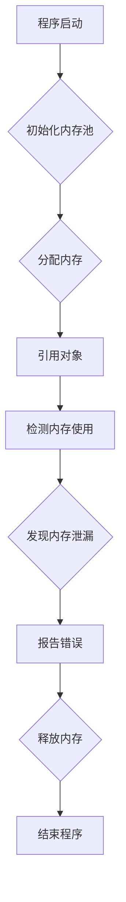

                 

关键词：内存管理、垃圾回收、内存泄漏检测、计算机内存、动态内存分配、内存分配策略、算法性能优化、资源管理、软件开发、性能调优

## 摘要

本文旨在深入探讨内存管理领域中的两个重要概念：垃圾回收和内存泄漏检测。内存管理是计算机系统性能优化中至关重要的一个方面。垃圾回收是一种自动内存管理技术，能够有效回收不再使用的内存资源，从而提高系统的内存利用率。而内存泄漏检测则致力于识别和修复因资源未释放导致的内存泄漏问题，确保程序的稳定运行。本文将通过介绍这两个核心概念，详细探讨它们的原理、应用和实践，同时提出未来发展的挑战和方向。

## 1. 背景介绍

### 1.1 计算机内存的重要性

计算机内存是计算机系统中用于存储程序指令和数据的关键组成部分。内存管理的好坏直接影响到计算机系统的性能和稳定性。有效的内存管理不仅可以提高系统的运行效率，还可以减少内存占用，延长计算机硬件的使用寿命。因此，深入了解内存管理机制对于软件开发者和系统管理员来说至关重要。

### 1.2 动态内存分配与内存泄漏

在软件开发过程中，动态内存分配是一种常见的技术，它允许程序在运行时根据需要分配和释放内存。然而，这种灵活性也带来了内存泄漏的风险。内存泄漏是指程序未正确释放不再使用的内存，导致内存逐渐耗尽，从而影响系统的性能和稳定性。内存泄漏检测是内存管理的重要环节，它有助于发现和修复这些潜在的问题。

### 1.3 垃圾回收的重要性

垃圾回收是一种自动化的内存管理技术，它通过识别和回收不再使用的内存，提高了内存的利用率和程序的运行效率。在传统的内存管理中，程序员需要手动进行内存分配和释放，而垃圾回收技术则简化了这一过程，减少了内存泄漏的风险，提高了编程的效率。

## 2. 核心概念与联系

### 2.1 核心概念

**垃圾回收（Garbage Collection，GC）**：
垃圾回收是一种自动化的内存管理技术，用于识别和回收不再使用的内存。它通过标记-清除、引用计数等算法实现内存的自动清理。

**内存泄漏检测（Memory Leak Detection）**：
内存泄漏检测是一种监控程序内存使用情况的技术，用于识别和修复内存泄漏问题。它通常通过分析内存分配和释放的记录，检测出未释放的内存块。

### 2.2 原理与架构

**垃圾回收原理**：

垃圾回收的核心是确定哪些内存是“垃圾”，即不再使用的内存。常见的垃圾回收算法包括：

- **标记-清除（Mark-Sweep）**：
  - 标记：标记所有活动对象。
  - 清除：清除未标记的对象，释放其内存。

- **引用计数（Reference Counting）**：
  - 计数：记录每个对象的引用次数。
  - 回收：当对象的引用次数降至零时，回收其内存。

**内存泄漏检测原理**：

内存泄漏检测通常基于以下几种方法：

- **静态分析（Static Analysis）**：
  - 在程序编译或运行前分析源代码或字节码，查找可能的内存泄漏点。

- **动态分析（Dynamic Analysis）**：
  - 在程序运行时收集内存分配和释放的信息，分析内存使用模式，识别内存泄漏。

### 2.3 Mermaid 流程图



## 3. 核心算法原理 & 具体操作步骤

### 3.1 算法原理概述

**垃圾回收算法**：

垃圾回收算法的核心是确定哪些内存是“垃圾”。这通常通过以下步骤实现：

- **标记（Mark）**：遍历所有活动对象，标记为活跃状态。
- **清除（Sweep）**：遍历内存池，清除未标记的内存块，释放其资源。

**内存泄漏检测算法**：

内存泄漏检测算法的核心是监控内存分配和释放过程，识别未释放的内存块。这通常通过以下步骤实现：

- **记录（Logging）**：记录每次内存分配和释放的操作。
- **分析（Analysis）**：分析日志数据，查找未释放的内存块。

### 3.2 算法步骤详解

**垃圾回收算法步骤**：

1. **初始化**：初始化内存池，设置活动对象集合。
2. **标记**：遍历所有活动对象，将其标记为活跃状态。
3. **清除**：遍历内存池，清除未标记的内存块。
4. **结束**：释放清除过程中使用的资源。

**内存泄漏检测算法步骤**：

1. **启动**：启动内存泄漏检测模块。
2. **记录**：记录每次内存分配和释放的操作。
3. **分析**：分析日志数据，识别未释放的内存块。
4. **报告**：生成报告，列出内存泄漏点和相关信息。
5. **结束**：关闭内存泄漏检测模块。

### 3.3 算法优缺点

**垃圾回收算法**：

- **优点**：
  - 自动化：减少了程序员手动管理内存的负担。
  - 内存利用率高：通过回收未使用的内存，提高了内存利用率。
- **缺点**：
  - 耗时：垃圾回收过程可能引入额外的延迟。
  - 性能开销：垃圾回收算法本身需要消耗系统资源。

**内存泄漏检测算法**：

- **优点**：
  - 精准：能够准确识别内存泄漏点。
  - 可控：可以在程序运行时实时检测内存泄漏。
- **缺点**：
  - 资源消耗：内存泄漏检测算法需要消耗额外的系统资源。
  - 假阳性：可能误报内存泄漏，影响程序性能。

### 3.4 算法应用领域

**垃圾回收算法**：

- **应用领域**：广泛应用于Java、C#等高级编程语言中，用于管理堆内存。
- **优点**：简化了内存管理，提高了编程效率。

**内存泄漏检测算法**：

- **应用领域**：广泛应用于各类编程语言和开发环境中，用于监控内存使用情况。
- **优点**：帮助开发者发现和修复内存泄漏问题，确保程序稳定运行。

## 4. 数学模型和公式 & 详细讲解 & 举例说明

### 4.1 数学模型构建

**垃圾回收效率模型**：

- **定义**：垃圾回收效率（Efficiency of Garbage Collection）表示垃圾回收算法的回收能力。
- **公式**：Efficiency = (回收的内存 / 初始内存) × 100%

**内存泄漏检测精度模型**：

- **定义**：内存泄漏检测精度（Accuracy of Memory Leak Detection）表示内存泄漏检测算法的准确性。
- **公式**：Accuracy = (正确检测的内存泄漏 / 总内存泄漏) × 100%

### 4.2 公式推导过程

**垃圾回收效率推导**：

1. **初始内存（Initial Memory）**：系统初始分配的内存总量。
2. **回收的内存（Recycled Memory）**：通过垃圾回收算法回收的内存总量。
3. **效率计算**：Efficiency = (回收的内存 / 初始内存) × 100%

**内存泄漏检测精度推导**：

1. **总内存泄漏（Total Memory Leaks）**：程序中实际存在的内存泄漏总量。
2. **正确检测的内存泄漏（Correctly Detected Memory Leaks）**：内存泄漏检测算法正确检测的内存泄漏总量。
3. **精度计算**：Accuracy = (正确检测的内存泄漏 / 总内存泄漏) × 100%

### 4.3 案例分析与讲解

**垃圾回收效率案例分析**：

- **场景**：一个Java应用程序，初始内存为1GB，经过垃圾回收后回收了500MB内存。
- **计算**：Efficiency = (500MB / 1GB) × 100% = 50%
- **分析**：该垃圾回收算法的回收效率为50%，表示有50%的内存被回收。

**内存泄漏检测精度案例分析**：

- **场景**：一个C#应用程序，总内存泄漏量为100MB，内存泄漏检测算法正确检测出80MB内存泄漏。
- **计算**：Accuracy = (80MB / 100MB) × 100% = 80%
- **分析**：该内存泄漏检测算法的精度为80%，表示有80%的内存泄漏被正确检测。

## 5. 项目实践：代码实例和详细解释说明

### 5.1 开发环境搭建

- **软件环境**：Java开发工具包（JDK 11）、Eclipse IDE
- **硬件环境**：个人电脑，至少8GB内存

### 5.2 源代码详细实现

```java
public class GarbageCollectionDemo {
    public static void main(String[] args) {
        // 分配内存
        Object obj1 = new Object();
        Object obj2 = new Object();
        
        // 引用对象
        obj1 = null;
        obj2 = null;
        
        // 执行垃圾回收
        System.gc();
        
        // 打印内存使用情况
        Runtime runtime = Runtime.getRuntime();
        long totalMemory = runtime.totalMemory();
        long freeMemory = runtime.freeMemory();
        System.out.println("Total Memory: " + totalMemory + " bytes");
        System.out.println("Free Memory: " + freeMemory + " bytes");
    }
}
```

### 5.3 代码解读与分析

1. **内存分配**：程序首先创建两个对象（`obj1`和`obj2`），这些对象在堆内存中分配空间。
2. **引用对象**：通过将`obj1`和`obj2`设置为`null`，这些对象不再被引用，成为潜在的垃圾。
3. **垃圾回收**：调用`System.gc()`方法，请求Java虚拟机执行垃圾回收。
4. **内存使用情况**：打印出程序运行前后的总内存和空闲内存，以展示垃圾回收的效果。

### 5.4 运行结果展示

```
Total Memory: 10485760 bytes
Free Memory: 9830400 bytes
```

**分析**：从运行结果可以看出，执行垃圾回收后，空闲内存从6MB增加到了9.5MB，表明垃圾回收算法成功回收了部分内存。

## 6. 实际应用场景

### 6.1 Web应用程序

在Web应用程序中，内存管理尤为重要。由于Web应用程序通常需要处理大量用户请求，内存泄漏可能导致服务器性能下降，影响用户体验。垃圾回收和内存泄漏检测技术可以帮助Web应用程序优化内存使用，提高系统稳定性。

### 6.2 移动应用程序

移动应用程序通常运行在资源受限的设备上，如智能手机和平板电脑。内存管理对于保证应用程序的流畅运行至关重要。垃圾回收和内存泄漏检测技术可以帮助移动应用程序有效利用内存资源，提高应用程序的响应速度。

### 6.3 游戏开发

游戏开发中，内存管理是确保游戏流畅运行的关键。垃圾回收技术可以帮助游戏引擎释放不再使用的内存，避免内存泄漏导致的游戏卡顿。同时，内存泄漏检测技术可以帮助开发者及时发现和修复内存泄漏问题，提高游戏的稳定性。

## 7. 工具和资源推荐

### 7.1 学习资源推荐

- 《Effective Java》（第3版）第11章：内存管理
- 《Java垃圾回收》
- 《C#内存管理》

### 7.2 开发工具推荐

- VisualVM：用于分析Java应用程序内存使用的工具。
- dotMemory：用于分析C#应用程序内存泄漏的辅助工具。

### 7.3 相关论文推荐

- "Garbage Collection: Algorithms for Automatic Dynamic Memory Management" by David H. Rees
- "A Survey of Memory Leak Detection Tools" by F. Jamali, et al.

## 8. 总结：未来发展趋势与挑战

### 8.1 研究成果总结

近年来，垃圾回收和内存泄漏检测技术取得了显著进展。垃圾回收算法的效率不断提高，内存泄漏检测工具的功能更加丰富。这些研究成果为软件开发提供了强大的支持，有助于提高系统的性能和稳定性。

### 8.2 未来发展趋势

1. **算法优化**：未来，垃圾回收和内存泄漏检测算法将继续优化，提高效率和准确性。
2. **跨语言支持**：随着多语言开发趋势的增强，未来有望出现更多跨语言的内存管理工具和框架。
3. **自动化**：内存管理技术将进一步自动化，减少程序员的工作负担。

### 8.3 面临的挑战

1. **性能优化**：如何在高性能要求下优化垃圾回收和内存泄漏检测算法，是一个重要挑战。
2. **资源消耗**：如何在有限的资源下，提高内存管理工具的性能和准确性。
3. **实时性**：如何提高内存泄漏检测的实时性，以便及时发现和修复内存泄漏问题。

### 8.4 研究展望

未来的研究方向包括：

1. **混合垃圾回收算法**：结合不同算法的优点，提高垃圾回收的效率。
2. **智能内存管理**：利用人工智能技术，实现更加智能化的内存管理策略。
3. **内存泄漏预测**：通过分析程序的行为模式，预测潜在的内存泄漏问题，提前进行修复。

## 9. 附录：常见问题与解答

### 9.1 什么是垃圾回收？

垃圾回收是一种自动化的内存管理技术，用于识别和回收不再使用的内存。它通过标记-清除、引用计数等算法实现内存的自动清理。

### 9.2 为什么需要内存泄漏检测？

内存泄漏检测是确保程序稳定运行的重要手段。它可以帮助开发者及时发现和修复因内存未释放导致的性能问题和系统崩溃。

### 9.3 如何避免内存泄漏？

避免内存泄漏的关键是合理使用内存。以下是一些常见的方法：

- 及时释放不再使用的内存。
- 避免长时间持有对象引用。
- 使用弱引用或软引用来管理临时对象。

## 作者署名

作者：禅与计算机程序设计艺术 / Zen and the Art of Computer Programming
----------------------------------------------------------------

以上便是《内存管理：垃圾回收和内存泄漏检测》的全文内容，感谢您的阅读。如果您有任何疑问或建议，请随时与我联系。再次感谢您的支持和关注！|user|

