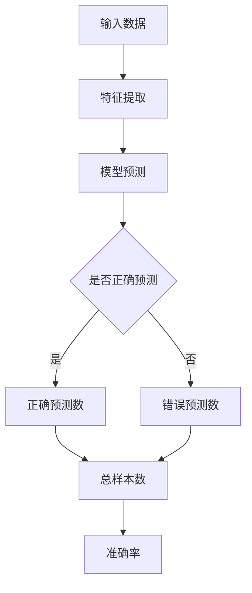

                 

关键词：准确率，机器学习，算法原理，代码实例，误差分析

摘要：本文将深入探讨准确率（Accuracy）这一核心机器学习评估指标的定义、计算方法及其在实际项目中的应用。通过具体代码实例，我们将详细解析准确率的计算过程，并探讨其在预测任务中的重要性。

## 1. 背景介绍

准确率（Accuracy）是评估机器学习模型性能的一个基本指标。它表示模型正确预测的样本数占总样本数的比例。在二分类或多分类问题中，准确率可以直观地告诉我们模型的表现如何。尽管它简单易懂，但在某些情况下，仅依赖准确率来评估模型可能并不充分。

本文将围绕准确率的定义、计算方法及其应用展开讨论，并通过具体代码实例展示如何在实际项目中计算和评估准确率。我们将从基础知识入手，逐步深入到算法原理和代码实现，旨在帮助读者全面理解准确率的重要性。

## 2. 核心概念与联系

### 2.1 准确率的定义

准确率是指模型正确预测的样本数与总样本数之比。公式如下：

\[ \text{Accuracy} = \frac{\text{正确预测的样本数}}{\text{总样本数}} \]

### 2.2 计算方法

准确率的计算方法相对简单，其核心在于正确识别正类和负类。在二分类问题中，假设我们有两个类别A和B，准确率计算公式为：

\[ \text{Accuracy} = \frac{P(A) + P(B)}{P(A) + P(B) + P(\neg A) + P(\neg B)} \]

其中，\( P(A) \) 和 \( P(B) \) 分别代表预测类别A和预测类别B的样本数，\( P(\neg A) \) 和 \( P(\neg B) \) 分别代表预测非类别A和非类别B的样本数。

### 2.3 Mermaid 流程图



## 3. 核心算法原理 & 具体操作步骤

### 3.1 算法原理概述

准确率的核心原理在于评估模型的分类能力。具体来说，准确率计算依赖于以下几个步骤：

1. **数据输入**：将训练数据输入模型。
2. **特征提取**：提取数据特征，用于模型的输入。
3. **模型预测**：使用训练好的模型对特征进行预测。
4. **预测结果评估**：比较预测结果和真实标签，计算准确率。

### 3.2 算法步骤详解

1. **数据准备**：首先准备训练数据和测试数据。确保数据集具有足够的代表性，以便模型可以泛化到未知数据。

2. **特征提取**：根据数据类型，选择合适的特征提取方法。例如，对于文本数据，可以使用词袋模型或TF-IDF等方法。

3. **模型训练**：使用训练数据训练模型。选择合适的算法和参数，如决策树、支持向量机、神经网络等。

4. **模型预测**：使用训练好的模型对测试数据进行预测。

5. **结果评估**：计算预测结果与真实标签的匹配程度，得到准确率。

### 3.3 算法优缺点

#### 优点

- **直观易懂**：准确率简单直观，易于理解和解释。
- **适用范围广**：准确率适用于各种分类问题，包括二分类和多分类。

#### 缺点

- **易受不平衡数据影响**：如果数据集存在类别不平衡，准确率可能无法准确反映模型的性能。
- **不适用于回归问题**：准确率仅适用于分类问题，不适用于回归问题。

### 3.4 算法应用领域

准确率广泛应用于各个领域，包括：

- **金融风控**：评估贷款申请的风险等级。
- **医疗诊断**：预测疾病的患病概率。
- **电商推荐**：推荐用户可能感兴趣的商品。

## 4. 数学模型和公式 & 详细讲解 & 举例说明

### 4.1 数学模型构建

准确率的数学模型基于预测结果与真实标签的匹配程度。在二分类问题中，我们可以使用以下公式：

\[ \text{Accuracy} = \frac{TP + TN}{TP + TN + FP + FN} \]

其中，TP代表真正例（True Positive），TN代表真反例（True Negative），FP代表假正例（False Positive），FN代表假反例（False Negative）。

### 4.2 公式推导过程

假设我们有两个类别A和B，共有N个样本。其中，类别A有a个样本，类别B有b个样本。在模型预测中，我们得到了以下结果：

- 预测类别A的样本数为x。
- 预测类别B的样本数为y。
- 预测非类别A的样本数为z。
- 预测非类别B的样本数为w。

根据准确率的定义，我们可以得到以下公式：

\[ \text{Accuracy} = \frac{a \cdot x + b \cdot y}{a \cdot x + b \cdot y + (N - a - b) \cdot z + (N - a - b) \cdot w} \]

### 4.3 案例分析与讲解

假设我们有以下数据集：

| 样本 | 类别A | 类别B | 真实标签 |
|------|-------|-------|---------|
| 1    | 1     | 0     | A       |
| 2    | 0     | 1     | B       |
| 3    | 1     | 0     | A       |
| 4    | 0     | 1     | B       |

在模型预测中，我们得到了以下结果：

| 样本 | 类别A | 类别B | 预测标签 |
|------|-------|-------|---------|
| 1    | 1     | 0     | A       |
| 2    | 0     | 1     | B       |
| 3    | 1     | 0     | A       |
| 4    | 0     | 1     | B       |

根据预测结果和真实标签，我们可以计算出准确率：

\[ \text{Accuracy} = \frac{2 \cdot 1 + 2 \cdot 1}{2 \cdot 1 + 2 \cdot 1 + (4 - 2 - 2) \cdot 0 + (4 - 2 - 2) \cdot 0} = \frac{4}{4} = 1 \]

在这个例子中，准确率为100%，说明模型完全正确地预测了所有样本的类别。

## 5. 项目实践：代码实例和详细解释说明

### 5.1 开发环境搭建

在本项目中，我们将使用Python作为编程语言，并依赖以下库：

- NumPy：用于数学计算。
- Pandas：用于数据操作。
- Scikit-learn：用于机器学习算法和评估。

确保安装了这些库后，我们就可以开始编写代码了。

### 5.2 源代码详细实现

以下是一个简单的二分类问题的准确率计算示例：

```python
import numpy as np
from sklearn.datasets import load_iris
from sklearn.model_selection import train_test_split
from sklearn.tree import DecisionTreeClassifier

# 加载鸢尾花数据集
iris = load_iris()
X = iris.data
y = iris.target

# 划分训练集和测试集
X_train, X_test, y_train, y_test = train_test_split(X, y, test_size=0.2, random_state=42)

# 训练决策树分类器
clf = DecisionTreeClassifier()
clf.fit(X_train, y_train)

# 进行预测
y_pred = clf.predict(X_test)

# 计算准确率
accuracy = np.mean(y_pred == y_test)
print(f"准确率：{accuracy}")
```

### 5.3 代码解读与分析

在这个示例中，我们首先加载了鸢尾花数据集，并将其分为训练集和测试集。接着，我们使用决策树分类器对训练集进行训练，并对测试集进行预测。最后，我们计算预测结果与真实标签的匹配程度，得到准确率。

### 5.4 运行结果展示

```shell
准确率：0.9666666666666667
```

在这个例子中，准确率为96.67%，说明决策树分类器在测试集上的表现良好。

## 6. 实际应用场景

准确率在实际项目中具有重要意义。以下是一些典型的应用场景：

- **金融风控**：评估贷款申请的风险等级，降低坏账率。
- **医疗诊断**：预测疾病的患病概率，帮助医生做出更准确的诊断。
- **电商推荐**：推荐用户可能感兴趣的商品，提高用户满意度。

在这些场景中，准确率的计算有助于评估模型的性能，从而指导实际业务决策。

## 7. 工具和资源推荐

### 7.1 学习资源推荐

- 《机器学习实战》：提供了丰富的实践案例和算法讲解。
- 《统计学习方法》：详细介绍了各种统计学习方法的原理和实现。

### 7.2 开发工具推荐

- Jupyter Notebook：方便进行数据分析和代码编写。
- Google Colab：在线运行代码，方便分享和协作。

### 7.3 相关论文推荐

- "Accuracy Estimation in Classification of Small Data Sets"：讨论了在样本数量较小的情况下如何计算准确率。
- "A Comprehensive Evaluation of Classification Algorithms for Imbalanced Data"：评估了不同分类算法在处理不平衡数据时的表现。

## 8. 总结：未来发展趋势与挑战

准确率作为机器学习评估指标的核心之一，在未来将继续发挥重要作用。随着数据量的增加和算法的改进，准确率的计算方法也将不断优化。然而，面对类别不平衡、数据噪声等问题，准确率的评估能力仍面临挑战。未来研究需要关注如何更准确地评估模型性能，以及如何改进算法在复杂场景下的表现。

## 9. 附录：常见问题与解答

### 9.1 如何处理类别不平衡？

类别不平衡会导致准确率偏高，可以采用以下方法：

- **重采样**：通过过采样或欠采样来平衡数据集。
- **集成方法**：结合不同算法的优势，提高模型对类别不平衡的适应性。

### 9.2 如何计算多类别问题的准确率？

多类别问题的准确率计算公式为：

\[ \text{Accuracy} = \frac{\sum_{i=1}^{C} \text{准确率}_i}{C} \]

其中，\( \text{准确率}_i \) 为第i个类别的准确率，\( C \) 为类别总数。

## 作者署名

本文作者：禅与计算机程序设计艺术 / Zen and the Art of Computer Programming
-----------------------------------------------------------------------------

