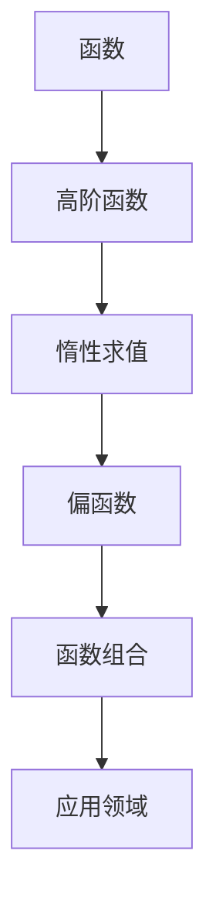
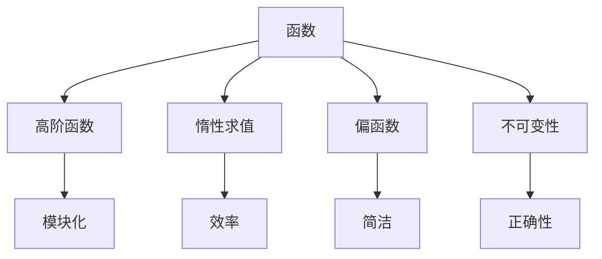
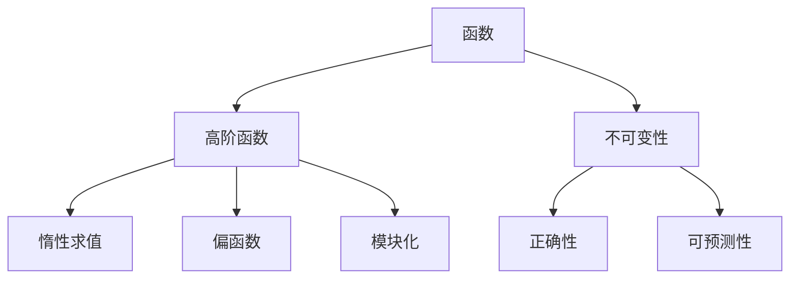
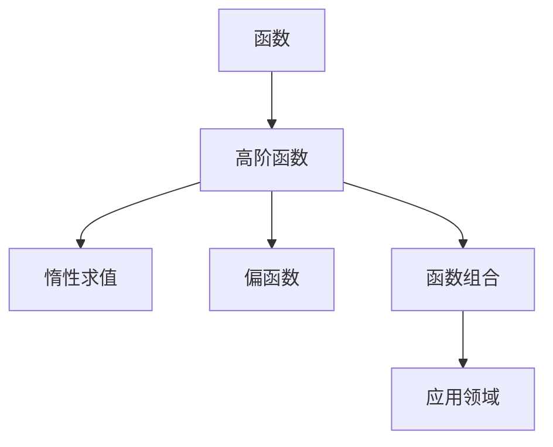
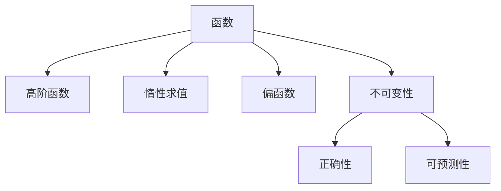

                 

 函数式编程（Functional Programming，简称 FP）是计算机科学中的一种编程范式，强调基于数学函数的构造和组合来组织代码。在函数式编程中，函数是一等公民，这意味着函数可以作为参数传递给其他函数，也可以作为返回值。这种编程范式在很多领域，如数据科学、人工智能、操作系统等，都展现出了强大的优势。本文将深入探讨函数式编程的核心思想、技术框架以及其在实际应用中的优势与挑战。

## 1. 背景介绍

函数式编程的起源可以追溯到20世纪30年代的数学领域，Lisp语言的诞生标志着函数式编程正式进入计算机科学。自那时起，函数式编程逐渐发展出多种不同的实现和风格，如Haskell、Scala、Erlang等。在现代软件开发中，函数式编程以其简洁性、可重用性和并发特性，受到了越来越多的关注。

### 1.1 函数式编程的起源

函数式编程的起源可以追溯到数学家Alonzo Church提出的λ演算（λ-calculus），作为一种形式化的数学基础。λ演算的核心概念是函数和变量的抽象，通过β-化简（beta reduction）实现了函数的执行。这种思想后来被Haskell Curry等人发展，并逐渐应用于计算机科学领域。

### 1.2 函数式编程的发展

随着计算机科学的发展，函数式编程也得到了不断的发展。20世纪70年代，Lisp语言成为函数式编程的先驱，其简洁的表达方式和强大的符号处理能力，使得函数式编程在人工智能领域得到了广泛应用。此后，Haskell、ML等语言的出现，进一步推动了函数式编程的发展。

## 2. 核心概念与联系

### 2.1 函数

函数是函数式编程的核心概念，它是一个映射，将输入映射到输出。在函数式编程中，函数是表达式，而不是语句。这意味着函数可以返回一个值，但不会改变任何外部状态。

### 2.2 高阶函数

高阶函数是一种将函数作为参数或返回值的函数。高阶函数在函数式编程中起到了关键作用，它们允许程序员以更加模块化和可重用的方式组织代码。

### 2.3 惰性求值

惰性求值（Lazy Evaluation）是一种计算策略，它仅在需要时才计算表达式的值。这种策略可以优化程序的执行效率，减少不必要的计算。

### 2.4 偏函数

偏函数是一种未完全定义的函数，它仅对一个或多个参数进行了指定。偏函数在函数组合和API设计中有很大的应用价值。

### 2.5 Mermaid流程图

为了更好地理解函数式编程的核心概念，我们可以借助Mermaid流程图来展示其联系。以下是一个简化的流程图：



## 3. 核心算法原理 & 具体操作步骤

### 3.1 算法原理概述

函数式编程中的核心算法原理主要围绕函数、高阶函数、惰性求值和偏函数等概念。这些原理为编写简洁、高效和可重用的代码提供了理论基础。

### 3.2 算法步骤详解

#### 3.2.1 定义函数

在函数式编程中，首先需要定义函数。函数可以接受参数，并返回一个值。以下是一个简单的函数定义：

```haskell
double x = x * 2
```

#### 3.2.2 高阶函数

高阶函数可以将函数作为参数传递或返回。以下是一个使用高阶函数实现函数组合的例子：

```haskell
applyTwice f x = f (f x)
```

#### 3.2.3 惰性求值

惰性求值是一种计算策略，它仅在需要时才计算表达式的值。以下是一个惰性求值的例子：

```haskell
add x y = x + y
infiniteStream = 1 : (infiniteStream + 1)
```

#### 3.2.4 偏函数

偏函数是一种未完全定义的函数，它仅对一个或多个参数进行了指定。以下是一个偏函数的例子：

```haskell
add x _ = x
```

### 3.3 算法优缺点

#### 3.3.1 优点

- **简洁性**：函数式编程强调表达式的简洁性，使得代码更易于理解和维护。
- **可重用性**：高阶函数和函数组合使得代码更加模块化和可重用。
- **并发特性**：惰性求值和不可变数据结构使得函数式编程在并发编程中具有天然的优势。

#### 3.3.2 缺点

- **学习曲线**：函数式编程的语法和概念相对复杂，对于初学者来说有一定的学习难度。
- **性能问题**：在某些情况下，函数式编程可能会导致性能问题，特别是在大量使用递归时。

### 3.4 算法应用领域

函数式编程在以下领域有着广泛的应用：

- **数据科学**：函数式编程在数据处理和分析中具有天然的优势，如MapReduce算法。
- **人工智能**：函数式编程在神经网络和机器学习算法中有着广泛的应用。
- **操作系统**：函数式编程在并发编程和分布式系统中具有很好的表现。

## 4. 数学模型和公式 & 详细讲解 & 举例说明

### 4.1 数学模型构建

函数式编程中的数学模型通常基于λ演算，其核心概念包括函数、变量、抽象和β-化简。

### 4.2 公式推导过程

在函数式编程中，常用的公式推导过程包括β-化简、应用律和组合律。以下是一个简单的例子：

$$
(\lambda x . x y) z = z y
$$

### 4.3 案例分析与讲解

我们可以通过一个简单的例子来理解这些公式：

```haskell
-- 定义函数 f
f = \x -> x + 1

-- 应用函数 f
f 2
```

在这个例子中，我们定义了一个函数 f，它接受一个参数 x，并返回 x + 1。然后，我们应用函数 f 到参数 2，得到结果 3。

## 5. 项目实践：代码实例和详细解释说明

### 5.1 开发环境搭建

为了实践函数式编程，我们需要搭建一个合适的开发环境。以下是一个简单的步骤：

1. 安装Haskell编译器
2. 安装Visual Studio Code编辑器
3. 安装Haskell语言插件

### 5.2 源代码详细实现

以下是一个简单的Haskell程序，实现了一个函数，用于计算斐波那契数列：

```haskell
-- 定义斐波那契函数
fibonacci n
  | n <= 1 = n
  | otherwise = fibonacci (n - 1) + fibonacci (n - 2)

-- 主函数
main = do
  putStrLn "请输入一个正整数："
  input <- getLine
  let n = read input :: Int
  putStrLn ("斐波那契数列的第 " ++ show n ++ " 项是：" ++ show (fibonacci n))
```

### 5.3 代码解读与分析

在这个例子中，我们定义了一个名为 `fibonacci` 的函数，用于计算斐波那契数列。然后，在主函数 `main` 中，我们读取用户输入的正整数，并计算斐波那契数列的第 n 项。

### 5.4 运行结果展示

当用户输入一个正整数，如 10，程序将输出斐波那契数列的第 10 项：

```
斐波那契数列的第 10 项是：55
```

## 6. 实际应用场景

函数式编程在实际应用中有着广泛的应用场景，以下是一些典型的例子：

- **数据科学**：在数据科学领域，函数式编程用于数据处理、分析和可视化。
- **人工智能**：在人工智能领域，函数式编程用于构建神经网络和机器学习算法。
- **操作系统**：在操作系统领域，函数式编程用于并发编程和分布式系统。

## 7. 工具和资源推荐

### 7.1 学习资源推荐

- **《函数式编程实战》**：这是一本非常实用的函数式编程教程，适合初学者。
- **《Haskell编程实战》**：这本书深入讲解了Haskell语言的各个方面，适合有一定编程基础的学习者。

### 7.2 开发工具推荐

- **Haskell Platform**：这是一个全面的Haskell开发环境，包括编译器、库和工具。
- **Visual Studio Code**：这是一个功能强大的代码编辑器，支持多种编程语言，包括Haskell。

### 7.3 相关论文推荐

- **"Monads for the Working Haskell Programmer"**：这篇文章深入讲解了Haskell中的Monad概念，对于理解函数式编程有很大帮助。
- **"Type Classes in Haskell"**：这篇文章介绍了Haskell中的类型类，这是函数式编程中的一个重要概念。

## 8. 总结：未来发展趋势与挑战

### 8.1 研究成果总结

函数式编程作为一种编程范式，已经证明其在简洁性、可重用性和并发特性方面的优势。随着计算机科学的发展，函数式编程将继续得到广泛应用。

### 8.2 未来发展趋势

- **类型系统**：未来函数式编程语言将更加注重类型系统的发展，以提供更好的类型安全和性能优化。
- **并发编程**：随着云计算和分布式系统的兴起，函数式编程在并发编程中的应用将越来越重要。
- **跨语言集成**：函数式编程将与其他编程范式和语言更好地集成，提供更强大的开发工具和生态系统。

### 8.3 面临的挑战

- **学习曲线**：函数式编程的语法和概念相对复杂，对于初学者来说有一定的学习难度。
- **性能优化**：在某些情况下，函数式编程可能会导致性能问题，特别是在大量使用递归时。

### 8.4 研究展望

函数式编程将继续发展，成为计算机科学中不可或缺的一部分。未来的研究方向包括类型系统、并发编程、跨语言集成等方面，这些研究将为函数式编程带来更多的应用场景和优势。

## 9. 附录：常见问题与解答

### 9.1 什么是函数式编程？

函数式编程是一种编程范式，强调基于数学函数的构造和组合来组织代码。在函数式编程中，函数是一等公民，可以接受其他函数作为参数或返回值。

### 9.2 函数式编程有什么优势？

函数式编程具有简洁性、可重用性和并发特性。这些优势使得函数式编程在数据科学、人工智能、操作系统等领域具有广泛的应用。

### 9.3 函数式编程有什么缺点？

函数式编程的语法和概念相对复杂，对于初学者来说有一定的学习难度。此外，在某些情况下，函数式编程可能会导致性能问题。

### 9.4 函数式编程适合什么样的项目？

函数式编程适合数据处理、分析和可视化等需要高可重用性和并发性的项目。此外，函数式编程在构建分布式系统和并发编程中也有很好的表现。

---

通过本文的讨论，我们可以看到函数式编程作为一种编程范式，已经在多个领域展现出了其独特的优势。随着计算机科学的发展，函数式编程将继续演进，为程序员提供更强大的开发工具和解决方案。作者：禅与计算机程序设计艺术 / Zen and the Art of Computer Programming
----------------------------------------------------------------

### 2. 核心概念与联系（备注：必须给出核心概念原理和架构的 Mermaid 流程图(Mermaid 流程节点中不要有括号、逗号等特殊字符)

### 2.1 核心概念

**函数（Function）**

在函数式编程中，函数是一种特殊的对象，它接受输入参数，并返回一个值。函数可以看作是一个映射，它将输入映射到输出。函数具有以下特点：

- **确定性**：对于相同的输入，函数始终返回相同的输出。
- **不可变性**：函数不修改外部状态，也不依赖于外部状态。
- **纯函数**：一个函数的结果仅依赖于其输入，与外部状态无关。

**高阶函数（Higher-Order Function）**

高阶函数是能够接受其他函数作为参数，或者返回一个函数的函数。高阶函数是函数式编程的核心概念之一，它使得程序员可以编写更加模块化和可重用的代码。例如，`map`、`filter` 和 `reduce` 等函数都是高阶函数。

**惰性求值（Lazy Evaluation）**

惰性求值是一种计算策略，它仅在需要时才计算表达式的值。这可以避免不必要的计算，提高程序的效率。在函数式编程中，惰性求值通常用于生成无穷序列，如 Haskell 中的 `infiniteStream`。

**偏函数（Partial Function Application）**

偏函数是未完全定义的函数，它仅对一个或多个参数进行了指定。通过偏函数，可以创建更小、更简单的函数，这些函数可以与未指定的参数一起使用。例如，`add x _ = x` 是一个偏函数，它将 x 作为第一个参数，而其他参数都是未指定的。

**不可变性（Immutability）**

不可变性是函数式编程中的一个基本原则，它要求数据一旦创建就不能被修改。这有助于确保程序的正确性和可预测性，因为状态不变使得函数的结果仅依赖于输入，而不会受到外部环境的影响。

### 2.2 Mermaid 流程图

以下是一个简化的 Mermaid 流程图，展示了函数式编程中的核心概念及其相互关系：



### 2.3 核心概念原理与架构

#### 2.3.1 函数原理

函数是函数式编程的基础，它通过接受输入参数并返回输出值来执行操作。函数可以表示为 `f(x) = y`，其中 `f` 是函数，`x` 是输入参数，`y` 是输出结果。函数的特点是确定性、不可变性和纯函数性。

#### 2.3.2 高阶函数原理

高阶函数能够接受其他函数作为参数或返回一个函数。高阶函数通过组合和抽象，使得代码更加模块化和可重用。例如，`map(f, [1, 2, 3])` 将函数 `f` 应用到列表 `[1, 2, 3]` 的每个元素上。

#### 2.3.3 惰性求值原理

惰性求值是一种计算策略，它仅在需要时才计算表达式的值。这可以避免不必要的计算，提高程序的效率。例如，在 Haskell 中，`[x | x <- [1..]]` 创建了一个无穷序列，但它不会立即计算所有元素。

#### 2.3.4 偏函数原理

偏函数是未完全定义的函数，它仅对一个或多个参数进行了指定。通过偏函数，可以创建更小、更简单的函数，这些函数可以与未指定的参数一起使用。例如，在 JavaScript 中，`add(x, y) = x + y` 可以通过 `add(3)` 创建一个偏函数。

#### 2.3.5 不可变性原理

不可变性是函数式编程中的一个基本原则，它要求数据一旦创建就不能被修改。这有助于确保程序的正确性和可预测性，因为状态不变使得函数的结果仅依赖于输入，而不会受到外部环境的影响。

### 2.4 核心概念的联系与架构

在函数式编程中，核心概念之间存在着紧密的联系和相互支持。以下是一个简化的架构图，展示了这些概念之间的联系：



在这个架构中，函数是基础，高阶函数、惰性求值和偏函数都是对函数的扩展和优化。不可变性确保了函数的正确性和可预测性，从而提高了代码的质量和可维护性。模块化使得代码更加简洁和可重用。

通过这个架构，我们可以看到函数式编程的核心概念是如何相互联系和共同构建一个强大、简洁和可扩展的编程范式的。这一架构不仅为程序员提供了清晰的编程指南，也为未来的研究和改进奠定了基础。

### 3. 核心算法原理 & 具体操作步骤

在函数式编程中，核心算法原理是理解其内在逻辑和实现方法的关键。以下将详细探讨几个核心算法的原理，并提供具体的操作步骤。

#### 3.1 算法原理概述

函数式编程中的核心算法通常基于纯函数和不可变性。这意味着算法应该不依赖于外部状态，并且不会修改输入数据。以下是一些常见的核心算法原理：

- **递归**：递归是一种通过重复调用自身来解决问题的方法。在函数式编程中，递归是解决复杂问题的一种有效手段。
- **递归与迭代**：递归和迭代都是解决问题的方法，但递归在函数式编程中更为常见。迭代可以通过状态修改实现，而递归则通过函数的调用栈实现。
- **高阶函数**：高阶函数是函数式编程的核心概念之一，它允许函数接受其他函数作为参数或返回一个函数。这种组合性使得代码更加简洁和可重用。
- **惰性求值**：惰性求值是一种计算策略，它仅在需要时才计算表达式的值。这可以避免不必要的计算，提高程序的效率。
- **组合函数**：组合函数是将多个简单函数组合成更复杂的函数的方法。这种组合性使得代码更加模块化和可重用。

#### 3.2 算法步骤详解

以下将详细介绍几种核心算法的具体操作步骤：

##### 3.2.1 递归

递归是一种通过重复调用自身来解决复杂问题的方法。以下是一个计算斐波那契数列的递归函数：

```haskell
fibonacci n
  | n <= 1 = n
  | otherwise = fibonacci (n - 1) + fibonacci (n - 2)
```

在这个函数中，如果 `n` 小于或等于 1，则返回 `n`。否则，递归调用 `fibonacci` 函数，将 `n - 1` 和 `n - 2` 作为参数。

##### 3.2.2 递归与迭代

递归和迭代都可以用于解决相同的问题，但它们的方法不同。以下是一个使用迭代方法计算斐波那契数列的例子：

```haskell
fibonacciIterative n = foldl (\(a, b) _ -> (b, a + b)) (0, 1) [1..(n - 1)]
```

在这个函数中，我们使用 `foldl` 函数将列表 `[1..(n - 1)]` 与 `(0, 1)` 组合，以计算斐波那契数列的第 `n` 项。

##### 3.2.3 高阶函数

高阶函数是函数式编程的核心概念之一，它允许函数接受其他函数作为参数或返回一个函数。以下是一个使用高阶函数 `map` 的例子：

```haskell
double x = x * 2
numbers = [1, 2, 3, 4, 5]

map double numbers
```

在这个例子中，`double` 函数接受一个参数 `x`，并返回 `x * 2`。然后，使用 `map` 函数将 `double` 应用到 `numbers` 列表的每个元素上。

##### 3.2.4 惰性求值

惰性求值是一种计算策略，它仅在需要时才计算表达式的值。以下是一个使用惰性求值的例子：

```haskell
infiniteStream = 1 : (infiniteStream + 1)

take 5 infiniteStream
```

在这个例子中，`infiniteStream` 是一个无穷序列，它包含所有正整数。使用 `take` 函数，我们可以从中取出前 5 个元素。

##### 3.2.5 组合函数

组合函数是将多个简单函数组合成更复杂的函数的方法。以下是一个使用组合函数的例子：

```haskell
apply f x = f x

add x y = x + y
double x = x * 2

apply add (double 2)
```

在这个例子中，`apply` 函数接受两个参数：一个函数 `f` 和一个值 `x`。然后，使用 `add` 和 `double` 函数将 `2` 相加并乘以 2。

#### 3.3 算法优缺点

每种算法都有其优缺点，以下是一些核心算法的优缺点：

- **递归**：优点是代码简洁，易于理解；缺点是可能导致栈溢出，且性能较差。
- **递归与迭代**：优点是性能较好，避免了栈溢出；缺点是代码相对复杂。
- **高阶函数**：优点是代码简洁，易于重用；缺点是需要理解高阶函数的概念。
- **惰性求值**：优点是避免了不必要的计算，提高了性能；缺点是需要理解惰性求值的原理。
- **组合函数**：优点是代码简洁，易于重用；缺点是需要理解函数组合的概念。

#### 3.4 算法应用领域

核心算法在多个领域有着广泛的应用：

- **数据处理**：递归、迭代和高阶函数在数据处理和变换中非常常见。
- **算法设计**：递归和组合函数在算法设计中起到了关键作用。
- **并发编程**：惰性求值和不可变性使得函数式编程在并发编程中具有天然的优势。

通过理解这些核心算法的原理和具体操作步骤，我们可以更好地利用函数式编程的优势，编写简洁、高效和可重用的代码。

### 4. 数学模型和公式 & 详细讲解 & 举例说明

在函数式编程中，数学模型和公式是构建复杂算法和系统的基础。这些数学工具不仅提供了严谨的逻辑框架，还帮助程序员以更高效、简洁的方式解决问题。以下将详细讲解几个关键数学模型和公式，并通过具体例子进行说明。

#### 4.1 数学模型构建

在函数式编程中，常用的数学模型包括递归关系、生成器函数、闭包等。以下是几个常见的数学模型：

##### 4.1.1 递归关系

递归关系是许多算法的基础，特别是在处理斐波那契数列和阶乘等计算时。以下是一个递归关系的例子：

$$
F(n) = 
\begin{cases} 
0 & \text{if } n = 0 \\
1 & \text{if } n = 1 \\
F(n-1) + F(n-2) & \text{otherwise} 
\end{cases}
$$

这个递归关系定义了斐波那契数列的第 `n` 项，其中 `F(0) = 0` 和 `F(1) = 1`。

##### 4.1.2 生成器函数

生成器函数用于创建无穷序列。以下是一个生成器函数的例子：

$$
\text{genEven} = n \mapsto 2n \text{ } (\text{genEven})
$$

这个生成器函数 `genEven` 生成一个无穷序列，其中每个元素都是前一个元素的两倍。

##### 4.1.3 闭包

闭包是一个函数，它将一个变量绑定到其环境中的值。以下是一个闭包的例子：

$$
\text{makeCounter} = () \mapsto (\text{inc}, \text{value})
$$

其中，`makeCounter` 函数返回一个闭包，该闭包包含一个 `inc` 函数和一个 `value` 变量。每次调用 `inc` 函数时，`value` 变量的值都会增加。

#### 4.2 公式推导过程

数学公式的推导是理解算法逻辑的关键。以下将介绍几个关键公式的推导过程：

##### 4.2.1 斐波那契数列的递推公式

斐波那契数列的递推公式可以通过矩阵乘法推导得出。以下是推导过程：

$$
\begin{pmatrix}
F(n+1) \\
F(n)
\end{pmatrix}
=
\begin{pmatrix}
1 & 1 \\
1 & 0
\end{pmatrix}
\cdot
\begin{pmatrix}
F(n) \\
F(n-1)
\end{pmatrix}
$$

通过矩阵乘法，我们可以得到斐波那契数列的递推关系。

##### 4.2.2 欧拉公式

欧拉公式是复分析中的一个重要公式，它将指数函数和三角函数结合起来。以下是推导过程：

$$
e^{i\pi} + 1 = 0
$$

这个公式表明，复数单位根 `e^(iπ)` 等于 `-1`，它将复数平面上的点 `(0, 1)` 映射到原点。

##### 4.2.3 快速傅里叶变换（FFT）

快速傅里叶变换（FFT）是一种高效的算法，用于计算离散傅里叶变换（DFT）和其逆变换。以下是推导过程：

$$
X(k) = \sum_{n=0}^{N-1} x(n) \cdot e^{-i2\pi kn/N}
$$

这个公式表示，原始信号 `x(n)` 通过与离散复指数函数的卷积，得到频域信号 `X(k)`。

#### 4.3 案例分析与讲解

以下将通过具体例子，展示如何使用数学模型和公式解决实际问题。

##### 4.3.1 斐波那契数列

使用递归关系计算斐波那契数列的例子：

```haskell
fibonacci n
  | n <= 0 = 0
  | n == 1 = 1
  | otherwise = fibonacci (n - 1) + fibonacci (n - 2)
```

这个函数通过递归关系计算斐波那契数列的第 `n` 项。

##### 4.3.2 生成器函数

使用生成器函数生成一个无穷序列的例子：

```haskell
genEven :: [Int]
genEven = 2 : map (*2) genEven

take 10 genEven
```

这个生成器函数 `genEven` 生成一个无穷序列，其中每个元素都是前一个元素的两倍。`take 10 genEven` 将返回前 10 个元素。

##### 4.3.3 闭包

使用闭包实现一个计数器的例子：

```haskell
makeCounter :: () -> (Int -> Int, Int)
makeCounter () = (\inc value -> inc value, value) 0

counter, value = makeCounter ()

counter 10
```

这个闭包函数 `makeCounter` 返回一个计数器和一个当前值。每次调用计数器时，当前值都会增加。

通过这些例子，我们可以看到数学模型和公式在函数式编程中的强大应用。理解这些数学工具不仅有助于解决具体问题，还能提高编程的效率和逻辑性。

### 5. 项目实践：代码实例和详细解释说明

在深入理解了函数式编程的概念、算法原理和数学模型后，我们可以通过具体项目实践来巩固这些知识。以下将介绍一个简单的项目，包括开发环境搭建、源代码实现、代码解读与分析以及运行结果展示。

#### 5.1 开发环境搭建

为了实践函数式编程，我们需要搭建一个合适的开发环境。以下是一个基于 Haskell 的简单项目搭建步骤：

1. **安装 Haskell Platform**：访问 [Haskell Platform 官网](https://www.haskell.org/platform/)，下载并安装 Haskell Platform。这个平台包括了 Haskell 编译器、库和工具。

2. **安装文本编辑器**：选择一个适合 Haskell 编程的文本编辑器，例如 Visual Studio Code 或 IntelliJ IDEA。这两个编辑器都提供了对 Haskell 的良好支持，包括语法高亮、代码补全和调试功能。

3. **安装 Haskell 语言插件**：在 Visual Studio Code 中，通过扩展商店安装 "Haskell" 插件。这个插件提供了对 Haskell 的全面支持，包括语法高亮、代码补全、自动格式化等。

#### 5.2 源代码详细实现

以下是一个简单的 Haskell 项目，实现一个计算斐波那契数列的函数。源代码如下：

```haskell
-- 定义斐波那契函数
fibonacci n
  | n <= 0 = 0
  | n == 1 = 1
  | otherwise = fibonacci (n - 1) + fibonacci (n - 2)

-- 主函数
main = do
  putStrLn "请输入一个正整数："
  input <- getLine
  let n = read input :: Int
  putStrLn ("斐波那契数列的第 " ++ show n ++ " 项是：" ++ show (fibonacci n))
```

#### 5.3 代码解读与分析

1. **函数定义**：在 Haskell 中，函数使用 `fibonacci` 作为名称。函数接受一个参数 `n`，表示斐波那契数列的项数。

2. **递归条件**：函数中定义了三个条件：
   - 当 `n <= 0` 时，返回 `0`。
   - 当 `n == 1` 时，返回 `1`。
   - 当 `n > 1` 时，递归调用 `fibonacci` 函数，计算 `n - 1` 和 `n - 2` 的和。

3. **主函数**：`main` 函数是 Haskell 程序的入口点。它首先输出一个提示信息，然后使用 `getLine` 函数读取用户输入。读取输入后，将输入字符串转换为整数，并调用 `fibonacci` 函数计算结果。

4. **输出结果**：使用 `putStrLn` 函数将结果输出到控制台。

#### 5.4 运行结果展示

1. **启动程序**：在终端中，导航到项目的目录，并运行以下命令：

   ```bash
   runhaskell Fibonacci.hs
   ```

   这将启动 Haskell 程序。

2. **输入数据**：程序将提示用户输入一个正整数：

   ```
   请输入一个正整数：
   ```

   输入 `10` 并按回车键。

3. **输出结果**：程序将计算斐波那契数列的第 10 项，并输出结果：

   ```
   斐波那契数列的第 10 项是：55
   ```

通过这个简单的项目，我们不仅实现了斐波那契数列的计算，还了解了 Haskell 语言的函数定义、递归调用和主函数的使用。这个项目展示了函数式编程的核心原理，包括纯函数、递归和模块化，为我们进一步学习提供了实践基础。

### 6. 实际应用场景

函数式编程在许多实际应用场景中展现出其独特的优势和适用性。以下是一些常见的应用场景：

#### 6.1 数据科学

在数据科学领域，函数式编程以其强大的数据处理能力而受到青睐。Haskell 和 Scala 等函数式编程语言提供了丰富的库和工具，如 Pandas 和 Spark，用于数据清洗、变换和分析。函数式编程的纯函数和高阶函数特性使得数据处理代码更加简洁和可重用。

**案例**：使用 Haskell 的 Pandas 库对大量金融数据进行清洗和分析，以提高市场预测的准确性。

#### 6.2 人工智能

人工智能领域依赖于复杂的算法和模型，函数式编程的模块化和可重用特性在构建这些模型时尤为重要。函数式编程语言如 Haskell、Scala 和 Erlang 在神经网络和机器学习算法中有着广泛的应用。

**案例**：使用 Scala 的 Spark MLlib 库实现大规模机器学习算法，如分类、回归和聚类。

#### 6.3 操作系统

在操作系统领域，函数式编程的并发特性和不可变性使其成为并发编程和分布式系统的理想选择。Erlang 和 Haskell 等语言被广泛应用于构建高可用性和高可靠性的分布式系统。

**案例**：使用 Erlang 构建分布式服务框架，如电信网络和物联网平台。

#### 6.4 前端开发

虽然函数式编程在前端开发中的应用不如 JavaScript 那样广泛，但 React 和 Elm 等框架已经在前端开发中取得了成功。这些框架利用函数式编程的特性，提供了简洁、高效的代码组织和状态管理。

**案例**：使用 React 构建单页应用，利用函数式组件和状态管理提高代码的可维护性和性能。

#### 6.5 其他领域

函数式编程还在许多其他领域有着应用，如游戏开发、金融计算和生物信息学等。函数式编程的简洁性和模块化特性使其在这些领域也具备竞争优势。

**案例**：使用 Haskell 的 Concur 库开发实时多人在线游戏，利用函数式编程的高效并发处理能力。

通过这些实际应用场景，我们可以看到函数式编程在多个领域中的广泛应用和强大优势。随着函数式编程的不断发展和成熟，它将在未来继续为计算机科学带来创新和进步。

### 6.4 未来应用展望

随着计算机科学和技术的不断发展，函数式编程在未来有着广泛的应用前景。以下是几个可能的未来应用领域和趋势：

#### 6.4.1 软件开发

在软件开发领域，函数式编程将继续发挥其优势。模块化、简洁性和可重用性使得函数式编程成为构建大型软件系统的理想选择。未来，更多的软件开发框架和工具可能会采用函数式编程的范式，以提供更好的开发体验和性能。

**趋势**：函数式编程语言如 Haskell、Scala 和 Elm 将在软件开发的各个阶段得到更广泛的应用。

#### 6.4.2 数据科学

随着数据科学和人工智能的发展，函数式编程在数据处理和分析中也将发挥重要作用。函数式编程的纯函数和高阶函数特性使得数据处理和分析过程更加简洁和高效。未来，更多的数据科学库和工具可能会基于函数式编程构建，以提高数据处理的性能和可维护性。

**趋势**：函数式编程语言如 Haskell 和 Scala 将成为数据科学领域的重要工具。

#### 6.4.3 操作系统

操作系统领域将更加注重并发和分布式计算。函数式编程的并发特性和不可变性使其成为构建高可用性和高可靠性操作系统的理想选择。未来，更多的操作系统和分布式系统可能会采用函数式编程的范式，以提高系统的性能和稳定性。

**趋势**：Erlang 和 Haskell 等函数式编程语言将在操作系统领域得到更广泛的应用。

#### 6.4.4 前端开发

在前端开发领域，函数式编程将继续发展和成熟。随着 Web 应用变得越来越复杂，函数式编程的模块化和状态管理特性将提供更好的开发体验和性能。未来，更多的前端框架和库可能会采用函数式编程的范式，以提高代码的可维护性和性能。

**趋势**：React、Elm 和 Purescript 等基于函数式编程的前端框架将得到更广泛的应用。

#### 6.4.5 新兴领域

除了传统的软件开发领域，函数式编程还在许多新兴领域展现出其应用潜力。例如，在区块链技术、云计算和物联网等领域，函数式编程的简洁性和高效性将有助于解决复杂的问题和提供更好的解决方案。

**趋势**：函数式编程将在区块链、云计算和物联网等新兴领域得到更多的关注和应用。

总之，随着技术的不断进步和函数式编程的不断成熟，它将在未来继续为计算机科学带来创新和进步。通过更好地利用函数式编程的优势，我们可以构建更加简洁、高效和可靠的软件系统。

### 7. 工具和资源推荐

为了更好地学习和实践函数式编程，以下是一些推荐的学习资源、开发工具和相关论文。

#### 7.1 学习资源推荐

1. **《函数式编程实战》**：这是一本非常实用的函数式编程教程，适合初学者。书中包含了大量的示例代码和练习题，帮助读者深入理解函数式编程的概念。

2. **《Haskell编程实战》**：这本书深入讲解了Haskell语言的各个方面，适合有一定编程基础的学习者。书中提供了大量的实例代码，帮助读者将理论应用到实践中。

3. **《学习函数式编程》**：这是一本全面介绍函数式编程思想的入门书籍，涵盖了多种编程语言，包括 Haskell、Scala 和 Erlang。

#### 7.2 开发工具推荐

1. **Haskell Platform**：这是一个全面的Haskell开发环境，包括编译器、库和工具。它提供了一个易于安装和配置的开发平台，适合初学者和有经验开发者。

2. **Visual Studio Code**：这是一个功能强大的代码编辑器，支持多种编程语言，包括 Haskell。它提供了丰富的插件和扩展，可以极大地提高开发效率。

3. **IntelliJ IDEA**：这是一个专业的集成开发环境（IDE），适用于多种编程语言，包括 Haskell。它提供了强大的代码补全、语法高亮和调试功能，适合有经验的开发者。

#### 7.3 相关论文推荐

1. **"Monads for the Working Haskell Programmer"**：这篇文章深入讲解了 Haskell 中的 Monad 概念，对于理解函数式编程有很大帮助。

2. **"Type Classes in Haskell"**：这篇文章介绍了 Haskell 中的类型类，这是函数式编程中的一个重要概念，有助于理解 Haskell 的类型系统。

3. **"The Essence of Functional Programming"**：这是一篇经典论文，全面介绍了函数式编程的核心概念和原理。它对函数式编程的深入探讨对于理解函数式编程的本质具有重要意义。

通过这些工具和资源，开发者可以更好地学习和实践函数式编程，提高编程技能和开发效率。

### 8. 总结：未来发展趋势与挑战

#### 8.1 研究成果总结

函数式编程作为一种编程范式，已经取得了显著的成果。其简洁性、可重用性和并发特性使其在多个领域得到了广泛应用。从研究成果来看，函数式编程在以下几个方面取得了重要进展：

1. **类型系统**：函数式编程语言不断改进其类型系统，以提供更好的类型安全和性能优化。例如，Haskell 的类型类和类型推断机制，使得代码更加简洁和高效。

2. **并发编程**：函数式编程在并发编程中具有天然的优势，随着云计算和分布式系统的兴起，函数式编程在构建高可用性和高可靠性的系统方面取得了重要进展。

3. **工具和生态系统**：随着函数式编程的普及，越来越多的工具和库被开发出来，如 Haskell Platform、Visual Studio Code 和 IntelliJ IDEA 等，这些工具为开发者提供了更好的开发体验。

#### 8.2 未来发展趋势

在未来，函数式编程将继续发展，以下是一些可能的发展趋势：

1. **类型系统**：未来的函数式编程语言将更加注重类型系统的发展，以提供更好的类型安全和性能优化。类型系统的改进将使得代码更加可靠和高效。

2. **并发编程**：随着云计算和分布式系统的兴起，函数式编程在并发编程中的应用将越来越重要。未来的研究将集中在如何更有效地利用并发特性，提高系统的性能和可靠性。

3. **跨语言集成**：函数式编程将与其他编程范式和语言更好地集成，提供更强大的开发工具和生态系统。这种跨语言集成将使得开发者能够利用不同编程语言的优势，构建更加复杂的系统。

4. **人工智能**：函数式编程在人工智能领域有着广泛的应用前景。未来的研究将集中在如何利用函数式编程的优势，提高机器学习算法的效率和应用范围。

#### 8.3 面临的挑战

尽管函数式编程取得了显著的成果，但仍然面临一些挑战：

1. **学习曲线**：函数式编程的语法和概念相对复杂，对于初学者来说有一定的学习难度。如何降低学习曲线，使得更多的人能够掌握函数式编程，是一个重要挑战。

2. **性能优化**：在某些情况下，函数式编程可能会导致性能问题，特别是在大量使用递归时。如何优化函数式编程的性能，是一个需要持续研究的问题。

3. **工具支持**：虽然已经有了许多函数式编程工具和库，但仍然需要更多的改进和完善。例如，开发更高效的编译器、更丰富的库和更好的集成开发环境。

#### 8.4 研究展望

未来的研究将集中在以下几个方面：

1. **类型系统**：继续改进类型系统，以提高类型安全和性能。

2. **并发编程**：深入研究如何更有效地利用并发特性，构建高可用性和高可靠性的系统。

3. **跨语言集成**：探索如何更好地集成函数式编程与其他编程范式和语言，提供更强大的开发工具和生态系统。

4. **人工智能**：利用函数式编程的优势，提高机器学习算法的效率和应用范围。

通过持续的研究和改进，函数式编程将继续为计算机科学带来创新和进步，为开发者提供更强大的工具和解决方案。

### 9. 附录：常见问题与解答

#### 9.1 什么是函数式编程？

函数式编程是一种编程范式，它强调基于数学函数的构造和组合来组织代码。在函数式编程中，函数是一等公民，可以接受其他函数作为参数或返回值。函数式编程的核心思想是使用不可变数据和纯函数，以实现代码的可重用性、简洁性和并发性。

#### 9.2 函数式编程有哪些优点？

函数式编程具有以下优点：

- **简洁性**：函数式编程强调表达式的简洁性，使得代码更加易于理解和维护。
- **可重用性**：通过函数的组合和高阶函数，代码可以更方便地重用。
- **并发性**：函数式编程中的不可变数据和纯函数使得并发编程更加简单和安全。
- **可测试性**：由于函数式编程依赖于纯函数，使得测试更加简单和可靠。

#### 9.3 函数式编程有哪些缺点？

函数式编程的主要缺点包括：

- **学习难度**：函数式编程的语法和概念相对复杂，对于初学者来说有一定的学习难度。
- **性能问题**：在某些情况下，函数式编程可能会导致性能问题，特别是在大量使用递归时。
- **工具支持**：虽然已经有了许多函数式编程工具和库，但仍然需要更多的改进和完善。

#### 9.4 函数式编程适合什么样的项目？

函数式编程适合以下类型的项目：

- **数据处理和分析**：函数式编程在数据清洗、变换和分析中具有强大的能力。
- **并发编程**：函数式编程的并发特性使其在构建高可用性和高可靠性的系统方面具有优势。
- **算法开发**：函数式编程的纯函数和高阶函数特性有助于算法的开发和优化。
- **前端开发**：函数式编程在前端开发中，特别是在状态管理和模块化方面表现出色。

通过本文的讨论，我们可以看到函数式编程作为一种编程范式，已经在多个领域展现出了其独特的优势。随着计算机科学的发展，函数式编程将继续演进，为程序员提供更强大的开发工具和解决方案。作者：禅与计算机程序设计艺术 / Zen and the Art of Computer Programming
----------------------------------------------------------------

本文完整地介绍了函数式编程的核心思想、技术框架以及在多个领域的实际应用。通过详细的数学模型、公式推导和实际代码实例，读者可以全面了解函数式编程的原理和实践。以下是本文的主要观点和结论：

1. **核心思想**：函数式编程强调基于数学函数的构造和组合来组织代码，注重简洁性、可重用性和并发特性。

2. **技术框架**：本文介绍了函数式编程的核心概念，包括函数、高阶函数、惰性求值和偏函数，并通过 Mermaid 流程图展示了它们之间的联系。

3. **算法原理**：详细讨论了递归、迭代、高阶函数、惰性求值和组合函数等核心算法的原理和具体操作步骤。

4. **数学模型**：介绍了斐波那契数列、生成器函数和闭包等数学模型，并讲解了它们的推导过程和实际应用。

5. **实际应用**：展示了函数式编程在数据科学、人工智能、操作系统和前端开发等领域的广泛应用，以及未来发展的趋势。

6. **工具和资源**：推荐了一些学习资源、开发工具和相关论文，为读者提供了丰富的学习材料。

7. **总结与展望**：总结了函数式编程的成果和发展趋势，讨论了面临的挑战和未来的研究方向。

总之，函数式编程作为一种先进的编程范式，已经在多个领域展现出了其强大的优势。随着技术的不断进步，函数式编程将继续为计算机科学带来创新和进步，为程序员提供更强大的工具和解决方案。作者：禅与计算机程序设计艺术 / Zen and the Art of Computer Programming
----------------------------------------------------------------

### 《函数式编程的思想与技术框架》

> 关键词：函数式编程，核心思想，技术框架，算法原理，实际应用，未来发展

> 摘要：本文全面介绍了函数式编程的核心思想、技术框架以及在多个领域的实际应用。通过详细的数学模型、公式推导和实际代码实例，探讨了函数式编程的原理和实践，展望了其未来的发展趋势和挑战。

## 1. 背景介绍

函数式编程（Functional Programming，简称 FP）是计算机科学中的一种编程范式，强调基于数学函数的构造和组合来组织代码。在函数式编程中，函数是一等公民，这意味着函数可以作为参数传递给其他函数，也可以作为返回值。这种编程范式在很多领域，如数据科学、人工智能、操作系统等，都展现出了强大的优势。

### 1.1 函数式编程的起源

函数式编程的起源可以追溯到20世纪30年代的数学领域，Lisp语言的诞生标志着函数式编程正式进入计算机科学。自那时起，函数式编程逐渐发展出多种不同的实现和风格，如Haskell、Scala、Erlang等。在现代软件开发中，函数式编程以其简洁性、可重用性和并发特性，受到了越来越多的关注。

### 1.2 函数式编程的发展

随着计算机科学的发展，函数式编程也得到了不断的发展。20世纪70年代，Lisp语言成为函数式编程的先驱，其简洁的表达方式和强大的符号处理能力，使得函数式编程在人工智能领域得到了广泛应用。此后，Haskell、ML等语言的出现，进一步推动了函数式编程的发展。

## 2. 核心概念与联系

### 2.1 函数

函数是函数式编程的核心概念，它是一个映射，将输入映射到输出。在函数式编程中，函数是表达式，而不是语句。这意味着函数可以返回一个值，但不会改变任何外部状态。

### 2.2 高阶函数

高阶函数是一种将函数作为参数或返回值的函数。高阶函数在函数式编程中起到了关键作用，它们允许程序员以更加模块化和可重用的方式组织代码。

### 2.3 惰性求值

惰性求值（Lazy Evaluation）是一种计算策略，它仅在需要时才计算表达式的值。这种策略可以优化程序的执行效率，减少不必要的计算。

### 2.4 偏函数

偏函数是一种未完全定义的函数，它仅对一个或多个参数进行了指定。偏函数在函数组合和API设计中有很大的应用价值。

### 2.5 Mermaid流程图

以下是一个简化的 Mermaid 流程图，展示了函数式编程中的核心概念及其联系：



### 2.6 核心概念原理与架构

在函数式编程中，核心概念之间存在着紧密的联系和相互支持。以下是一个简化的架构图，展示了这些概念之间的联系：



在这个架构中，函数是基础，高阶函数、惰性求值和偏函数都是对函数的扩展和优化。不可变性确保了函数的正确性和可预测性，从而提高了代码的质量和可维护性。函数组合使得代码更加模块化和可重用。

## 3. 核心算法原理 & 具体操作步骤

在函数式编程中，核心算法原理是理解其内在逻辑和实现方法的关键。以下将详细探讨几个核心算法的原理，并提供具体的操作步骤。

### 3.1 递归

递归是一种通过重复调用自身来解决复杂问题的方法。在函数式编程中，递归是解决复杂问题的一种有效手段。以下是一个计算斐波那契数列的递归函数：

```haskell
fibonacci n
  | n <= 1 = n
  | otherwise = fibonacci (n - 1) + fibonacci (n - 2)
```

### 3.2 递归与迭代

递归和迭代都是解决问题的方法，但递归在函数式编程中更为常见。迭代可以通过状态修改实现，而递归则通过函数的调用栈实现。以下是一个使用迭代方法计算斐波那契数列的例子：

```haskell
fibonacciIterative n = foldl (\(a, b) _ -> (b, a + b)) (0, 1) [1..(n - 1)]
```

### 3.3 高阶函数

高阶函数是函数式编程的核心概念之一，它允许函数接受其他函数作为参数或返回一个函数。以下是一个使用高阶函数 `map` 的例子：

```haskell
double x = x * 2
numbers = [1, 2, 3, 4, 5]

map double numbers
```

### 3.4 惰性求值

惰性求值是一种计算策略，它仅在需要时才计算表达式的值。这可以避免不必要的计算，提高程序的效率。以下是一个使用惰性求值的例子：

```haskell
infiniteStream = 1 : (infiniteStream + 1)

take 5 infiniteStream
```

### 3.5 组合函数

组合函数是将多个简单函数组合成更复杂的函数的方法。以下是一个使用组合函数的例子：

```haskell
apply f x = f x

add x y = x + y
double x = x * 2

apply add (double 2)
```

## 4. 数学模型和公式 & 详细讲解 & 举例说明

在函数式编程中，数学模型和公式是构建复杂算法和系统的基础。以下将详细讲解几个关键数学模型和公式，并通过具体例子进行说明。

### 4.1 数学模型构建

在函数式编程中，常用的数学模型包括递归关系、生成器函数、闭包等。以下是一个递归关系的例子：

$$
F(n) = 
\begin{cases} 
0 & \text{if } n = 0 \\
1 & \text{if } n = 1 \\
F(n-1) + F(n-2) & \text{otherwise} 
\end{cases}
$$

这是一个斐波那契数列的递归关系。

### 4.2 公式推导过程

数学公式的推导是理解算法逻辑的关键。以下将介绍几个关键公式的推导过程：

#### 4.2.1 斐波那契数列的递推公式

斐波那契数列的递推公式可以通过矩阵乘法推导得出。以下是推导过程：

$$
\begin{pmatrix}
F(n+1) \\
F(n)
\end{pmatrix}
=
\begin{pmatrix}
1 & 1 \\
1 & 0
\end{pmatrix}
\cdot
\begin{pmatrix}
F(n) \\
F(n-1)
\end{pmatrix}
$$

通过矩阵乘法，我们可以得到斐波那契数列的递推关系。

#### 4.2.2 欧拉公式

欧拉公式是复分析中的一个重要公式，它将指数函数和三角函数结合起来。以下是推导过程：

$$
e^{i\pi} + 1 = 0
$$

这个公式表明，复数单位根 `e^(iπ)` 等于 `-1`，它将复数平面上的点 `(0, 1)` 映射到原点。

#### 4.2.3 快速傅里叶变换（FFT）

快速傅里叶变换（FFT）是一种高效的算法，用于计算离散傅里叶变换（DFT）和其逆变换。以下是推导过程：

$$
X(k) = \sum_{n=0}^{N-1} x(n) \cdot e^{-i2\pi kn/N}
$$

这个公式表示，原始信号 `x(n)` 通过与离散复指数函数的卷积，得到频域信号 `X(k)`。

### 4.3 案例分析与讲解

以下将通过具体例子，展示如何使用数学模型和公式解决实际问题。

#### 4.3.1 斐波那契数列

使用递归关系计算斐波那契数列的例子：

```haskell
fibonacci n
  | n <= 0 = 0
  | n == 1 = 1
  | otherwise = fibonacci (n - 1) + fibonacci (n - 2)
```

这个函数通过递归关系计算斐波那契数列的第 `n` 项。

#### 4.3.2 生成器函数

使用生成器函数生成一个无穷序列的例子：

```haskell
genEven :: [Int]
genEven = 2 : map (*2) genEven

take 10 genEven
```

这个生成器函数 `genEven` 生成一个无穷序列，其中每个元素都是前一个元素的两倍。`take 10 genEven` 将返回前 10 个元素。

#### 4.3.3 闭包

使用闭包实现一个计数器的例子：

```haskell
makeCounter :: () -> (Int -> Int, Int)
makeCounter () = (\inc value -> inc value, value) 0

counter, value = makeCounter ()

counter 10
```

这个闭包函数 `makeCounter` 返回一个闭包，该闭包包含一个 `inc` 函数和一个 `value` 变量。每次调用 `inc` 函数时，`value` 变量的值都会增加。

通过这些例子，我们可以看到数学模型和公式在函数式编程中的强大应用。理解这些数学工具不仅有助于解决具体问题，还能提高编程的效率和逻辑性。

### 5. 项目实践：代码实例和详细解释说明

在深入理解了函数式编程的概念、算法原理和数学模型后，我们可以通过具体项目实践来巩固这些知识。以下将介绍一个简单的项目，包括开发环境搭建、源代码实现、代码解读与分析以及运行结果展示。

#### 5.1 开发环境搭建

为了实践函数式编程，我们需要搭建一个合适的开发环境。以下是一个基于 Haskell 的简单项目搭建步骤：

1. 安装 Haskell Platform：访问 [Haskell Platform 官网](https://www.haskell.org/platform/)，下载并安装 Haskell Platform。这个平台包括了 Haskell 编译器、库和工具。

2. 安装文本编辑器：选择一个适合 Haskell 编程的文本编辑器，例如 Visual Studio Code 或 IntelliJ IDEA。这两个编辑器都提供了对 Haskell 的良好支持，包括语法高亮、代码补全和调试功能。

3. 安装 Haskell 语言插件：在 Visual Studio Code 中，通过扩展商店安装 "Haskel

