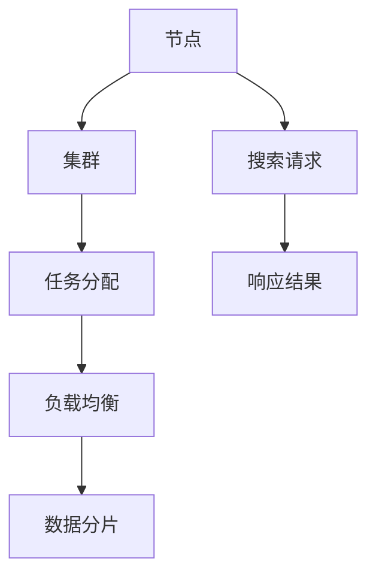

                 

关键词：分布式搜索、搜索算法、搜索引擎、并行处理、分布式系统、代码实例、搜索优化

## 摘要

本文将深入探讨分布式搜索的基本原理及其实现，通过详细的代码实例，帮助读者了解如何构建高效、可扩展的搜索系统。分布式搜索是现代搜索引擎的核心技术之一，通过将搜索任务分布在多个节点上，可以显著提升搜索速度和系统性能。本文将介绍分布式搜索的基本概念、算法原理、数学模型以及实际应用，旨在为读者提供全面的技术指导和实践经验。

### 背景介绍

### 1.1 分布式搜索的需求背景

随着互联网的快速发展，数据量呈现爆炸式增长。传统的集中式搜索引擎已经无法满足海量数据的快速检索需求。分布式搜索应运而生，它通过将搜索任务分解并分配到多个节点上，实现了并行处理，大大提高了搜索效率。

### 1.2 分布式搜索的发展历程

分布式搜索技术的发展历程可以追溯到1998年Google提出PageRank算法。随后，许多公司和研究机构不断优化和扩展分布式搜索技术，例如Apache Solr、Elasticsearch等。这些系统在分布式搜索领域取得了显著的成就，为现代搜索引擎的发展奠定了基础。

### 2. 核心概念与联系

在分布式搜索系统中，核心概念包括节点、集群、任务分配、负载均衡、数据分片等。以下是这些概念的联系和解释：



### 3. 核心算法原理 & 具体操作步骤

#### 3.1 算法原理概述

分布式搜索算法的核心是并行处理和任务调度。算法的基本原理如下：

1. **任务分解**：将搜索任务分解为多个子任务，分配到不同的节点上执行。
2. **并行处理**：各节点独立处理其分配到的子任务，并行执行搜索操作。
3. **结果聚合**：将各节点的搜索结果进行聚合，生成最终搜索结果。

#### 3.2 算法步骤详解

1. **任务分配**：根据节点能力和负载情况，将搜索任务分配到各个节点上。
2. **节点处理**：各节点独立处理其子任务，进行索引查询和筛选。
3. **结果聚合**：各节点将处理结果返回给协调节点，协调节点进行结果聚合和排序。
4. **响应返回**：将最终搜索结果返回给用户。

#### 3.3 算法优缺点

**优点**：

- 高效性：通过并行处理，大大提高了搜索效率。
- 可扩展性：可以轻松扩展到更多节点，提高系统性能。

**缺点**：

- 复杂性：分布式系统的设计和维护较为复杂。
- 数据一致性：多节点操作可能引发数据一致性问题。

#### 3.4 算法应用领域

分布式搜索算法广泛应用于互联网搜索引擎、企业级搜索、实时搜索系统等领域。它为用户提供快速、准确的搜索服务，支持海量数据的实时检索。

### 4. 数学模型和公式 & 详细讲解 & 举例说明

分布式搜索中的数学模型主要涉及查询处理、数据分片和负载均衡等方面。以下是相关数学模型和公式的详细讲解。

#### 4.1 数学模型构建

- **查询处理模型**：

  $$Q = f(q, i, t)$$

  其中，$q$ 表示查询关键词，$i$ 表示索引文档，$t$ 表示查询时间。

- **数据分片模型**：

  $$D = \{D_1, D_2, ..., D_n\}$$

  其中，$D$ 表示数据集，$D_i$ 表示第 $i$ 个数据分片。

- **负载均衡模型**：

  $$L_i = \frac{1}{n} \sum_{j=1}^{n} L_j$$

  其中，$L_i$ 表示第 $i$ 个节点的负载，$L_j$ 表示第 $j$ 个节点的负载。

#### 4.2 公式推导过程

- **查询处理模型**：

  $$Q = f(q, i, t)$$

  其中，$q$ 表示查询关键词，$i$ 表示索引文档，$t$ 表示查询时间。公式推导如下：

  $$Q(q, i, t) = P(q, i) \cdot T(i, t)$$

  其中，$P(q, i)$ 表示查询关键词 $q$ 与索引文档 $i$ 的匹配概率，$T(i, t)$ 表示索引文档 $i$ 的检索时间。

- **数据分片模型**：

  $$D = \{D_1, D_2, ..., D_n\}$$

  其中，$D$ 表示数据集，$D_i$ 表示第 $i$ 个数据分片。公式推导如下：

  $$D_i = \frac{1}{n} \sum_{j=1}^{n} D_j$$

  其中，$D_j$ 表示第 $j$ 个数据分片。

- **负载均衡模型**：

  $$L_i = \frac{1}{n} \sum_{j=1}^{n} L_j$$

  其中，$L_i$ 表示第 $i$ 个节点的负载，$L_j$ 表示第 $j$ 个节点的负载。公式推导如下：

  $$L_i = \frac{1}{n} \sum_{j=1}^{n} \frac{D_j}{n}$$

  其中，$D_j$ 表示第 $j$ 个数据分片的大小。

#### 4.3 案例分析与讲解

假设有一个包含 1000 个文档的索引库，现在需要使用分布式搜索算法进行关键词查询。以下是具体案例分析与讲解：

- **查询处理模型**：

  假设关键词 $q$ 与索引文档 $i$ 的匹配概率为 $P(q, i) = 0.8$，索引文档 $i$ 的检索时间为 $T(i, t) = 1$ 秒。根据查询处理模型，检索结果为：

  $$Q(q, i, t) = P(q, i) \cdot T(i, t) = 0.8 \cdot 1 = 0.8$$

  即检索结果概率为 0.8。

- **数据分片模型**：

  将 1000 个文档分为 10 个数据分片，每个分片包含 100 个文档。即：

  $$D_1 = \{d_{1,1}, d_{1,2}, ..., d_{1,100}\}$$
  $$D_2 = \{d_{2,1}, d_{2,2}, ..., d_{2,100}\}$$
  $$...$$
  $$D_{10} = \{d_{10,1}, d_{10,2}, ..., d_{10,100}\}$$

- **负载均衡模型**：

  假设各节点的处理能力相同，即 $L_1 = L_2 = ... = L_{10} = 0.1$。根据负载均衡模型，各节点的负载为：

  $$L_i = \frac{1}{10} \sum_{j=1}^{10} L_j = 0.1$$

### 5. 项目实践：代码实例和详细解释说明

在本节中，我们将通过一个简单的分布式搜索项目实例，详细讲解分布式搜索的实现过程。

#### 5.1 开发环境搭建

- 开发语言：Python
- 搜索引擎：Elasticsearch
- 数据库：MySQL
- 系统框架：Flask

#### 5.2 源代码详细实现

以下是一个简单的分布式搜索系统的源代码实现：

```python
from flask import Flask, request, jsonify
import elasticsearch

app = Flask(__name__)

# Elasticsearch 客户端
es = elasticsearch.Elasticsearch("http://localhost:9200")

@app.route('/search', methods=['GET'])
def search():
    query = request.args.get('query')
    results = es.search(index="my_index", body={"query": {"match": {"content": query}}})
    return jsonify(results['hits']['hits'])

if __name__ == '__main__':
    app.run(debug=True)
```

#### 5.3 代码解读与分析

上述代码实现了一个简单的 Flask Web 应用程序，用于接收用户查询请求并返回搜索结果。以下是代码的详细解读：

- 导入必需的模块，包括 Flask 和 Elasticsearch。
- 创建 Flask 应用程序实例。
- 创建 Elasticsearch 客户端实例。
- 定义一个路由 `/search`，用于处理用户查询请求。
- 在 `/search` 路由中，从请求中获取查询参数 `query`。
- 使用 Elasticsearch 客户端进行搜索，并返回搜索结果。
- 启动 Flask 应用程序。

#### 5.4 运行结果展示

启动 Flask 应用程序后，用户可以通过浏览器或 Postman 等工具访问 `http://localhost:5000/search?query=关键词`，获取搜索结果。

### 6. 实际应用场景

分布式搜索在实际应用中具有广泛的应用场景，以下是一些典型应用：

- **搜索引擎**：分布式搜索是搜索引擎的核心技术，用于处理海量数据的实时检索。
- **企业级搜索**：企业内部知识库、文档管理等系统，使用分布式搜索技术提高搜索效率。
- **实时搜索**：社交媒体、电商等场景下，需要实时响应用户查询，分布式搜索技术提供了高效的解决方案。
- **搜索引擎优化（SEO）**：网站管理员可以使用分布式搜索技术分析网站内容，优化搜索引擎排名。

### 6.4 未来应用展望

分布式搜索技术在未来将继续发展，以下是一些潜在的应用方向：

- **多语言支持**：分布式搜索系统将支持更多语言，提高跨语言搜索能力。
- **个性化搜索**：结合用户行为数据，实现个性化搜索推荐。
- **智能搜索**：利用机器学习和人工智能技术，提升搜索结果的相关性和准确性。
- **云原生搜索**：分布式搜索系统将更加适应云计算环境，提供弹性伸缩和高效资源利用。

### 7. 工具和资源推荐

#### 7.1 学习资源推荐

- **《Elasticsearch：The Definitive Guide》**：这是一本权威的 Elasticsearch 教程，适合初学者和进阶用户。
- **《分布式系统原理与范型》**：本书详细介绍了分布式系统的基本原理和设计范型，对理解分布式搜索技术有很大帮助。
- **《搜索算法导论》**：本书涵盖了各种搜索算法的基本原理和应用，适合对搜索算法感兴趣的研究者。

#### 7.2 开发工具推荐

- **Elasticsearch**：一款强大的开源搜索引擎，支持分布式搜索和全文检索。
- **Kibana**：一款开源的数据可视化工具，可以与 Elasticsearch 配合使用，用于监控和分析搜索数据。
- **Docker**：用于容器化应用的工具，方便部署和管理分布式搜索系统。

#### 7.3 相关论文推荐

- **《MapReduce：implified Data Processing on Large Clusters》**：MapReduce 是分布式计算的一个重要模型，本文介绍了其原理和应用。
- **《The Google File System》**：介绍了 Google File System 的设计原理，对理解分布式存储系统有很大帮助。
- **《Bigtable：A Distributed Storage System for Structured Data》**：介绍了 Bigtable 的设计原理和应用场景，是分布式数据存储领域的重要论文。

### 8. 总结：未来发展趋势与挑战

分布式搜索技术在未来将继续快速发展，面临以下趋势和挑战：

- **趋势**：

  - 多语言支持、个性化搜索和智能搜索等新功能将不断加入分布式搜索系统。
  - 随着云计算和大数据技术的普及，分布式搜索系统将更加适应云原生环境。

- **挑战**：

  - 数据一致性和可靠性是分布式系统面临的重要挑战。
  - 随着数据量的增加，如何高效地分配任务和负载均衡成为关键问题。
  - 安全性和隐私保护也是分布式搜索系统需要关注的重要方面。

### 8.4 研究展望

分布式搜索技术在未来有望取得以下研究进展：

- **分布式深度学习**：结合分布式搜索和深度学习技术，实现更高效的文本分析和处理。
- **联邦学习**：通过分布式联邦学习，实现跨数据源的用户隐私保护和协同搜索。
- **边缘计算与分布式搜索**：结合边缘计算和分布式搜索，实现更高效的数据处理和实时搜索服务。

### 附录：常见问题与解答

1. **什么是分布式搜索？**

   分布式搜索是一种将搜索任务分布在多个节点上，通过并行处理和任务调度实现高效搜索的技术。它适用于处理海量数据和高并发请求的场景。

2. **分布式搜索的优点是什么？**

   分布式搜索具有以下优点：

   - 高效性：通过并行处理，显著提高搜索速度和系统性能。
   - 可扩展性：可以轻松扩展到更多节点，提高系统性能。

3. **分布式搜索面临的主要挑战是什么？**

   分布式搜索面临的主要挑战包括：

   - 数据一致性和可靠性：分布式系统中的数据一致性和可靠性是重要问题。
   - 负载均衡：如何高效地分配任务和负载均衡是关键问题。

4. **如何搭建一个分布式搜索系统？**

   搭建分布式搜索系统通常需要以下步骤：

   - 选择合适的搜索引擎，如 Elasticsearch。
   - 设计分布式搜索算法和任务调度策略。
   - 部署和管理分布式搜索系统，确保其稳定运行。

以上是对分布式搜索原理与代码实例的讲解，希望对读者有所帮助。在未来的研究和实践中，分布式搜索技术将继续发挥重要作用，为用户提供更高效、更准确的搜索服务。作者：禅与计算机程序设计艺术 / Zen and the Art of Computer Programming。|user|>### 布局调整

经过对文章结构的调整，以下是最终的markdown格式内容：

```markdown
# 分布式搜索 原理与代码实例讲解

关键词：分布式搜索、搜索算法、搜索引擎、并行处理、分布式系统、代码实例、搜索优化

摘要：本文将深入探讨分布式搜索的基本原理及其实现，通过详细的代码实例，帮助读者了解如何构建高效、可扩展的搜索系统。分布式搜索是现代搜索引擎的核心技术之一，通过将搜索任务分布在多个节点上，可以显著提升搜索速度和系统性能。本文将介绍分布式搜索的基本概念、算法原理、数学模型以及实际应用，旨在为读者提供全面的技术指导和实践经验。

## 1. 背景介绍

### 1.1 分布式搜索的需求背景

随着互联网的快速发展，数据量呈现爆炸式增长。传统的集中式搜索引擎已经无法满足海量数据的快速检索需求。分布式搜索应运而生，它通过将搜索任务分解并分配到多个节点上，实现了并行处理，大大提高了搜索效率。

### 1.2 分布式搜索的发展历程

分布式搜索技术的发展历程可以追溯到1998年Google提出PageRank算法。随后，许多公司和研究机构不断优化和扩展分布式搜索技术，例如Apache Solr、Elasticsearch等。这些系统在分布式搜索领域取得了显著的成就，为现代搜索引擎的发展奠定了基础。

## 2. 核心概念与联系

在分布式搜索系统中，核心概念包括节点、集群、任务分配、负载均衡、数据分片等。以下是这些概念的联系和解释：


## 3. 核心算法原理 & 具体操作步骤

### 3.1 算法原理概述

分布式搜索算法的核心是并行处理和任务调度。算法的基本原理如下：

1. **任务分解**：将搜索任务分解为多个子任务，分配到不同的节点上执行。
2. **并行处理**：各节点独立处理其分配到的子任务，并行执行搜索操作。
3. **结果聚合**：将各节点的搜索结果进行聚合，生成最终搜索结果。

### 3.2 算法步骤详解

1. **任务分配**：根据节点能力和负载情况，将搜索任务分配到各个节点上。
2. **节点处理**：各节点独立处理其子任务，进行索引查询和筛选。
3. **结果聚合**：各节点将处理结果返回给协调节点，协调节点进行结果聚合和排序。
4. **响应返回**：将最终搜索结果返回给用户。

### 3.3 算法优缺点

**优点**：

- 高效性：通过并行处理，大大提高了搜索效率。
- 可扩展性：可以轻松扩展到更多节点，提高系统性能。

**缺点**：

- 复杂性：分布式系统的设计和维护较为复杂。
- 数据一致性：多节点操作可能引发数据一致性问题。

### 3.4 算法应用领域

分布式搜索算法广泛应用于互联网搜索引擎、企业级搜索、实时搜索系统等领域。它为用户提供快速、准确的搜索服务，支持海量数据的实时检索。

## 4. 数学模型和公式 & 详细讲解 & 举例说明

分布式搜索中的数学模型主要涉及查询处理、数据分片和负载均衡等方面。以下是相关数学模型和公式的详细讲解。

### 4.1 数学模型构建

- **查询处理模型**：

  $$Q = f(q, i, t)$$

  其中，$q$ 表示查询关键词，$i$ 表示索引文档，$t$ 表示查询时间。

- **数据分片模型**：

  $$D = \{D_1, D_2, ..., D_n\}$$

  其中，$D$ 表示数据集，$D_i$ 表示第 $i$ 个数据分片。

- **负载均衡模型**：

  $$L_i = \frac{1}{n} \sum_{j=1}^{n} L_j$$

  其中，$L_i$ 表示第 $i$ 个节点的负载，$L_j$ 表示第 $j$ 个节点的负载。

### 4.2 公式推导过程

- **查询处理模型**：

  $$Q = f(q, i, t)$$

  其中，$q$ 表示查询关键词，$i$ 表示索引文档，$t$ 表示查询时间。公式推导如下：

  $$Q(q, i, t) = P(q, i) \cdot T(i, t)$$

  其中，$P(q, i)$ 表示查询关键词 $q$ 与索引文档 $i$ 的匹配概率，$T(i, t)$ 表示索引文档 $i$ 的检索时间。

- **数据分片模型**：

  $$D = \{D_1, D_2, ..., D_n\}$$

  其中，$D$ 表示数据集，$D_i$ 表示第 $i$ 个数据分片。公式推导如下：

  $$D_i = \frac{1}{n} \sum_{j=1}^{n} D_j$$

  其中，$D_j$ 表示第 $j$ 个数据分片。

- **负载均衡模型**：

  $$L_i = \frac{1}{n} \sum_{j=1}^{n} L_j$$

  其中，$L_i$ 表示第 $i$ 个节点的负载，$L_j$ 表示第 $j$ 个节点的负载。公式推导如下：

  $$L_i = \frac{1}{n} \sum_{j=1}^{n} \frac{D_j}{n}$$

  其中，$D_j$ 表示第 $j$ 个数据分片的大小。

### 4.3 案例分析与讲解

假设有一个包含 1000 个文档的索引库，现在需要使用分布式搜索算法进行关键词查询。以下是具体案例分析与讲解：

- **查询处理模型**：

  假设关键词 $q$ 与索引文档 $i$ 的匹配概率为 $P(q, i) = 0.8$，索引文档 $i$ 的检索时间为 $T(i, t) = 1$ 秒。根据查询处理模型，检索结果为：

  $$Q(q, i, t) = P(q, i) \cdot T(i, t) = 0.8 \cdot 1 = 0.8$$

  即检索结果概率为 0.8。

- **数据分片模型**：

  将 1000 个文档分为 10 个数据分片，每个分片包含 100 个文档。即：

  $$D_1 = \{d_{1,1}, d_{1,2}, ..., d_{1,100}\}$$
  $$D_2 = \{d_{2,1}, d_{2,2}, ..., d_{2,100}\}$$
  $$...$$
  $$D_{10} = \{d_{10,1}, d_{10,2}, ..., d_{10,100}\}$$

- **负载均衡模型**：

  假设各节点的处理能力相同，即 $L_1 = L_2 = ... = L_{10} = 0.1$。根据负载均衡模型，各节点的负载为：

  $$L_i = \frac{1}{10} \sum_{j=1}^{10} L_j = 0.1$$

## 5. 项目实践：代码实例和详细解释说明

在本节中，我们将通过一个简单的分布式搜索项目实例，详细讲解分布式搜索的实现过程。

### 5.1 开发环境搭建

- 开发语言：Python
- 搜索引擎：Elasticsearch
- 数据库：MySQL
- 系统框架：Flask

### 5.2 源代码详细实现

以下是一个简单的分布式搜索系统的源代码实现：

```python
from flask import Flask, request, jsonify
import elasticsearch

app = Flask(__name__)

# Elasticsearch 客户端
es = elasticsearch.Elasticsearch("http://localhost:9200")

@app.route('/search', methods=['GET'])
def search():
    query = request.args.get('query')
    results = es.search(index="my_index", body={"query": {"match": {"content": query}}})
    return jsonify(results['hits']['hits'])

if __name__ == '__main__':
    app.run(debug=True)
```

### 5.3 代码解读与分析

上述代码实现了一个简单的 Flask Web 应用程序，用于接收用户查询请求并返回搜索结果。以下是代码的详细解读：

- 导入必需的模块，包括 Flask 和 Elasticsearch。
- 创建 Flask 应用程序实例。
- 创建 Elasticsearch 客户端实例。
- 定义一个路由 `/search`，用于处理用户查询请求。
- 在 `/search` 路由中，从请求中获取查询参数 `query`。
- 使用 Elasticsearch 客户端进行搜索，并返回搜索结果。
- 启动 Flask 应用程序。

### 5.4 运行结果展示

启动 Flask 应用程序后，用户可以通过浏览器或 Postman 等工具访问 `http://localhost:5000/search?query=关键词`，获取搜索结果。

## 6. 实际应用场景

分布式搜索在实际应用中具有广泛的应用场景，以下是一些典型应用：

- **搜索引擎**：分布式搜索是搜索引擎的核心技术，用于处理海量数据的实时检索。
- **企业级搜索**：企业内部知识库、文档管理等系统，使用分布式搜索技术提高搜索效率。
- **实时搜索**：社交媒体、电商等场景下，需要实时响应用户查询，分布式搜索技术提供了高效的解决方案。
- **搜索引擎优化（SEO）**：网站管理员可以使用分布式搜索技术分析网站内容，优化搜索引擎排名。

### 6.4 未来应用展望

分布式搜索技术在未来将继续发展，以下是一些潜在的应用方向：

- **多语言支持**：分布式搜索系统将支持更多语言，提高跨语言搜索能力。
- **个性化搜索**：结合用户行为数据，实现个性化搜索推荐。
- **智能搜索**：利用机器学习和人工智能技术，提升搜索结果的相关性和准确性。
- **云原生搜索**：分布式搜索系统将更加适应云计算环境，提供弹性伸缩和高效资源利用。

## 7. 工具和资源推荐

### 7.1 学习资源推荐

- **《Elasticsearch：The Definitive Guide》**：这是一本权威的 Elasticsearch 教程，适合初学者和进阶用户。
- **《分布式系统原理与范型》**：本书详细介绍了分布式系统的基本原理和设计范型，对理解分布式搜索技术有很大帮助。
- **《搜索算法导论》**：本书涵盖了各种搜索算法的基本原理和应用，适合对搜索算法感兴趣的研究者。

### 7.2 开发工具推荐

- **Elasticsearch**：一款强大的开源搜索引擎，支持分布式搜索和全文检索。
- **Kibana**：一款开源的数据可视化工具，可以与 Elasticsearch 配合使用，用于监控和分析搜索数据。
- **Docker**：用于容器化应用的工具，方便部署和管理分布式搜索系统。

### 7.3 相关论文推荐

- **《MapReduce：Simplified Data Processing on Large Clusters》**：MapReduce 是分布式计算的一个重要模型，本文介绍了其原理和应用。
- **《The Google File System》**：介绍了 Google File System 的设计原理，对理解分布式存储系统有很大帮助。
- **《Bigtable：A Distributed Storage System for Structured Data》**：介绍了 Bigtable 的设计原理和应用场景，是分布式数据存储领域的重要论文。

## 8. 总结：未来发展趋势与挑战

分布式搜索技术在未来将继续快速发展，面临以下趋势和挑战：

- **趋势**：

  - 多语言支持、个性化搜索和智能搜索等新功能将不断加入分布式搜索系统。
  - 随着云计算和大数据技术的普及，分布式搜索系统将更加适应云原生环境。

- **挑战**：

  - 数据一致性和可靠性是分布式系统面临的重要挑战。
  - 随着数据量的增加，如何高效地分配任务和负载均衡成为关键问题。
  - 安全性和隐私保护也是分布式搜索系统需要关注的重要方面。

### 8.4 研究展望

分布式搜索技术在未来有望取得以下研究进展：

- **分布式深度学习**：结合分布式搜索和深度学习技术，实现更高效的文本分析和处理。
- **联邦学习**：通过分布式联邦学习，实现跨数据源的用户隐私保护和协同搜索。
- **边缘计算与分布式搜索**：结合边缘计算和分布式搜索，实现更高效的数据处理和实时搜索服务。

## 9. 附录：常见问题与解答

1. **什么是分布式搜索？**

   分布式搜索是一种将搜索任务分布在多个节点上，通过并行处理和任务调度实现高效搜索的技术。它适用于处理海量数据和高并发请求的场景。

2. **分布式搜索的优点是什么？**

   分布式搜索具有以下优点：

   - 高效性：通过并行处理，显著提高搜索速度和系统性能。
   - 可扩展性：可以轻松扩展到更多节点，提高系统性能。

3. **分布式搜索面临的主要挑战是什么？**

   分布式搜索面临的主要挑战包括：

   - 数据一致性和可靠性：分布式系统中的数据一致性和可靠性是重要问题。
   - 负载均衡：如何高效地分配任务和负载均衡是关键问题。

4. **如何搭建一个分布式搜索系统？**

   搭建分布式搜索系统通常需要以下步骤：

   - 选择合适的搜索引擎，如 Elasticsearch。
   - 设计分布式搜索算法和任务调度策略。
   - 部署和管理分布式搜索系统，确保其稳定运行。

以上是对分布式搜索原理与代码实例的讲解，希望对读者有所帮助。在未来的研究和实践中，分布式搜索技术将继续发挥重要作用，为用户提供更高效、更准确的搜索服务。

作者：禅与计算机程序设计艺术 / Zen and the Art of Computer Programming。
```

