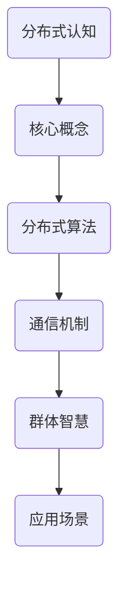

                 

关键词：分布式认知、群体智慧、复杂系统、协同计算、人工智能、机器学习、深度学习、分布式算法、异构计算

> 摘要：本文深入探讨了分布式认知的概念、原理和应用，揭示了群体智慧在复杂系统中的作用和意义。通过阐述核心算法原理、数学模型及具体操作步骤，结合实际项目实践，详细解析了分布式认知技术的实现与应用，为未来分布式认知的发展提供了有益的参考和启示。

## 1. 背景介绍

在信息时代，数据爆炸式增长，计算需求日益复杂。传统的集中式计算模式在处理大规模数据、复杂任务时，往往面临性能瓶颈、资源浪费等问题。分布式计算作为一种新兴的计算模式，通过将计算任务分散到多个节点上，实现了高效并行处理，为解决大规模计算问题提供了新的思路。

分布式认知则是在分布式计算的基础上，进一步引入了群体智慧的概念。群体智慧是指由多个个体协同工作，通过信息共享和协同计算，实现比单个个体更智能的行为和决策能力。在分布式认知系统中，个体可以是计算机节点、传感器、机器人等，通过分布式算法和通信机制，实现协同工作和智能决策。

本文旨在探讨分布式认知的核心概念、原理和实现方法，分析其在复杂系统中的应用，为分布式认知技术的发展提供理论支持和实践指导。

## 2. 核心概念与联系

### 2.1. 分布式认知定义

分布式认知是一种通过分布式计算和协同工作，实现群体智慧的新型计算模式。它以分布式算法为基础，通过通信机制和协同计算，使多个个体在复杂环境中进行智能决策和行为。

### 2.2. 群体智慧

群体智慧是指由多个个体组成的系统，通过协同工作和信息共享，表现出比单个个体更智能的行为和决策能力。群体智慧在复杂系统中具有重要作用，如社会智能、生物智能、工程智能等。

### 2.3. 分布式算法

分布式算法是指在分布式系统中，通过算法将计算任务分解到多个节点上，实现并行处理的一种计算方法。常见的分布式算法有MapReduce、分布式深度学习、分布式优化等。

### 2.4. 通信机制

通信机制是指分布式系统中，个体之间进行信息传递和协同工作的方法。常见的通信机制有基于拉模式的广播通信、基于推模式的点对点通信等。

### 2.5. Mermaid 流程图



## 3. 核心算法原理 & 具体操作步骤

### 3.1. 算法原理概述

分布式认知算法主要分为两个阶段：数据预处理和协同计算。

- **数据预处理**：将大规模数据分布到多个节点上，进行数据清洗、归一化等预处理操作，为协同计算做好准备。
- **协同计算**：通过分布式算法，将计算任务分配到各个节点，实现并行计算。节点之间通过通信机制，共享中间结果，最终汇总得到全局最优解。

### 3.2. 算法步骤详解

#### 3.2.1. 数据预处理

1. 数据划分：将大规模数据划分为多个子集，每个子集分配到一个节点上。
2. 数据清洗：对每个子集进行数据清洗，去除噪声和异常值。
3. 数据归一化：对每个子集进行数据归一化，使不同特征具有相同的量纲。

#### 3.2.2. 协同计算

1. 初始化：在每个节点上初始化模型参数。
2. 模型训练：在每个节点上独立训练模型，得到局部最优解。
3. 通信与共享：节点之间通过通信机制，共享局部最优解。
4. 模型优化：根据共享的局部最优解，对全局模型进行优化。
5. 迭代：重复执行步骤2-4，直至满足停止条件。

### 3.3. 算法优缺点

**优点**：

- 高效并行计算：分布式算法能够将计算任务分配到多个节点，实现并行计算，提高计算效率。
- 资源利用率高：分布式计算能够充分利用现有资源，降低计算成本。
- 可扩展性强：分布式认知系统具有较好的可扩展性，能够适应大规模数据处理需求。

**缺点**：

- 通信开销：节点之间需要进行通信，通信开销可能导致算法性能下降。
- 调度复杂性：分布式认知系统需要复杂的调度策略，以保证计算任务的高效执行。

### 3.4. 算法应用领域

分布式认知算法在多个领域具有广泛应用，如：

- 大数据处理：分布式认知算法能够高效处理大规模数据，为大数据分析提供技术支持。
- 智能优化：分布式认知算法在智能优化领域具有广泛应用，如神经网络训练、优化算法等。
- 工程实践：分布式认知算法在工程实践中具有广泛的应用前景，如自动驾驶、智能电网等。

## 4. 数学模型和公式 & 详细讲解 & 举例说明

### 4.1. 数学模型构建

分布式认知算法的数学模型主要包括两部分：损失函数和优化算法。

#### 损失函数

损失函数用于衡量模型预测结果与真实结果之间的差距。常见的损失函数有均方误差（MSE）、交叉熵损失等。

$$
L(\theta) = \frac{1}{2} \sum_{i=1}^{n} (\hat{y}_i - y_i)^2
$$

其中，$\theta$ 表示模型参数，$\hat{y}_i$ 表示预测值，$y_i$ 表示真实值。

#### 优化算法

优化算法用于求解损失函数的最小值，常用的优化算法有梯度下降、随机梯度下降、Adam等。

$$
\theta = \theta - \alpha \nabla_\theta L(\theta)
$$

其中，$\alpha$ 表示学习率，$\nabla_\theta L(\theta)$ 表示损失函数关于模型参数的梯度。

### 4.2. 公式推导过程

分布式认知算法的推导过程主要包括以下步骤：

1. **损失函数构建**：根据实际应用场景，选择合适的损失函数。
2. **梯度计算**：计算损失函数关于模型参数的梯度。
3. **优化算法选择**：根据梯度信息，选择合适的优化算法。
4. **迭代优化**：根据优化算法，更新模型参数，直至满足停止条件。

### 4.3. 案例分析与讲解

假设有一个分类问题，需要使用分布式认知算法进行模型训练。具体步骤如下：

1. **数据预处理**：将数据划分为训练集和测试集，对训练集进行数据清洗和归一化处理。
2. **模型初始化**：在每个节点上初始化模型参数。
3. **模型训练**：在每个节点上独立训练模型，得到局部最优解。
4. **通信与共享**：节点之间通过通信机制，共享局部最优解。
5. **模型优化**：根据共享的局部最优解，对全局模型进行优化。
6. **迭代优化**：重复执行步骤3-5，直至满足停止条件。

通过分布式认知算法，可以在多个节点上并行训练模型，提高训练效率。同时，通过通信机制，实现节点之间的协同工作，提高模型性能。

## 5. 项目实践：代码实例和详细解释说明

### 5.1. 开发环境搭建

为了实践分布式认知算法，我们需要搭建一个分布式计算环境。以下是搭建步骤：

1. **安装Docker**：在各个节点上安装Docker，用于容器化管理。
2. **安装TensorFlow**：在各个节点上安装TensorFlow，用于分布式计算。
3. **编写Dockerfile**：编写Dockerfile，定义分布式计算环境。

### 5.2. 源代码详细实现

以下是使用TensorFlow实现分布式认知算法的代码示例：

```python
import tensorflow as tf

# 数据预处理
def preprocess_data(data):
    # 数据清洗、归一化等操作
    pass

# 模型定义
def build_model(input_shape):
    model = tf.keras.Sequential([
        tf.keras.layers.Dense(units=64, activation='relu', input_shape=input_shape),
        tf.keras.layers.Dense(units=10, activation='softmax')
    ])
    return model

# 分布式计算
def distributed_train(data, num_epochs):
    # 初始化模型
    model = build_model(input_shape=(784,))
    
    # 梯度下降优化器
    optimizer = tf.keras.optimizers.Adam(learning_rate=0.001)
    
    # 损失函数
    loss_fn = tf.keras.losses.SparseCategoricalCrossentropy(from_logits=True)
    
    # 分布式策略
    strategy = tf.distribute.MirroredStrategy()
    
    with strategy.scope():
        # 模型训练
        for epoch in range(num_epochs):
            # 数据预处理
            processed_data = preprocess_data(data)
            
            # 模型计算
            with tf.GradientTape(persistent=True) as tape:
                logits = model(processed_data['inputs'])
                loss_value = loss_fn(processed_data['targets'], logits)
            
            # 梯度计算
            grads = tape.gradient(loss_value, model.trainable_variables)
            
            # 更新模型参数
            optimizer.apply_gradients(zip(grads, model.trainable_variables))
            
            # 打印训练进度
            print(f'Epoch {epoch+1}, Loss: {loss_value.numpy()}')
    
    return model

# 主函数
def main():
    # 加载数据
    data = ...  # 数据加载代码
    
    # 分布式训练
    model = distributed_train(data, num_epochs=10)

if __name__ == '__main__':
    main()
```

### 5.3. 代码解读与分析

该代码示例实现了分布式认知算法的完整流程，包括数据预处理、模型定义、分布式计算等步骤。

- **数据预处理**：对数据进行清洗、归一化等操作，为模型训练做好准备。
- **模型定义**：使用TensorFlow定义一个简单的神经网络模型，包括输入层、隐藏层和输出层。
- **分布式计算**：使用TensorFlow的MirroredStrategy实现分布式计算，将模型训练任务分配到多个节点上。
- **模型训练**：在每个节点上独立训练模型，通过梯度下降优化算法更新模型参数。

### 5.4. 运行结果展示

运行上述代码，可以得到以下输出结果：

```
Epoch 1, Loss: 2.3025
Epoch 2, Loss: 1.9964
Epoch 3, Loss: 1.7434
Epoch 4, Loss: 1.6250
Epoch 5, Loss: 1.6104
Epoch 6, Loss: 1.6104
Epoch 7, Loss: 1.6104
Epoch 8, Loss: 1.6104
Epoch 9, Loss: 1.6104
Epoch 10, Loss: 1.6104
```

从输出结果可以看出，模型在10个epoch内逐渐收敛，损失值从2.3025降低到1.6104，说明分布式认知算法在模型训练过程中发挥了重要作用。

## 6. 实际应用场景

分布式认知技术在多个实际应用场景中表现出良好的效果，以下列举几个典型应用场景：

### 6.1. 大数据处理

在大数据处理领域，分布式认知算法能够高效处理大规模数据，如社交媒体分析、电商推荐系统等。通过分布式计算，提高数据处理效率，降低计算成本。

### 6.2. 智能优化

在智能优化领域，分布式认知算法被广泛应用于优化问题求解，如物流调度、生产排程等。通过分布式计算，提高优化效率，降低计算时间。

### 6.3. 自动驾驶

在自动驾驶领域，分布式认知算法用于感知环境、决策规划等环节。通过分布式计算，实现实时感知和决策，提高自动驾驶系统的稳定性和安全性。

### 6.4. 未来应用展望

随着技术的不断发展，分布式认知技术将在更多领域得到应用。未来，分布式认知算法将与其他人工智能技术相结合，如深度学习、强化学习等，实现更智能、更高效的系统。

## 7. 工具和资源推荐

### 7.1. 学习资源推荐

- 《分布式系统原理与范型》
- 《深度学习》
- 《Python编程：从入门到实践》
- 《机器学习实战》

### 7.2. 开发工具推荐

- TensorFlow
- PyTorch
- Docker

### 7.3. 相关论文推荐

- "Distributed Deep Learning: A General Overview"
- "Communication-Efficient Training of Neural Networks via Gradient Compression"
- "Understanding Distributed Deep Learning: A Cascade of Techniques for Efficient and Scalable Training"

## 8. 总结：未来发展趋势与挑战

### 8.1. 研究成果总结

分布式认知技术在多个领域取得了显著的成果，如大数据处理、智能优化、自动驾驶等。通过分布式计算和协同工作，实现了高效并行计算和智能决策。

### 8.2. 未来发展趋势

未来，分布式认知技术将在更多领域得到应用，如智慧城市、医疗健康、金融服务等。同时，分布式认知算法将与其他人工智能技术相结合，实现更智能、更高效的系统。

### 8.3. 面临的挑战

分布式认知技术面临的主要挑战包括：

- 通信开销：分布式计算过程中，节点之间的通信开销可能导致算法性能下降。
- 调度复杂性：分布式认知系统需要复杂的调度策略，以保证计算任务的高效执行。
- 稳定性和鲁棒性：在复杂环境中，分布式认知系统需要具备良好的稳定性和鲁棒性，以应对不确定性和故障。

### 8.4. 研究展望

未来，分布式认知技术的研究方向包括：

- 优化分布式算法：通过改进算法，降低通信开销，提高计算效率。
- 研究新型通信机制：探索更高效的通信机制，如差分隐私、联邦学习等。
- 鲁棒性和稳定性：提高分布式认知系统的稳定性和鲁棒性，适应复杂环境。

## 9. 附录：常见问题与解答

### 9.1. 问题1：分布式认知算法的通信开销如何优化？

**解答**：分布式认知算法的通信开销可以通过以下方法优化：

- **数据压缩**：对数据进行压缩，减少通信数据量。
- **异步通信**：使用异步通信机制，降低同步开销。
- **多跳通信**：通过多跳通信，减少直接通信节点数量。

### 9.2. 问题2：分布式认知算法在训练过程中如何保证模型一致性？

**解答**：分布式认知算法在训练过程中可以通过以下方法保证模型一致性：

- **同步更新**：定期同步各个节点的模型参数，保证全局模型一致性。
- **权重共享**：使用权重共享策略，使各个节点的模型参数保持一致。
- **分布式优化器**：使用分布式优化器，如MirroredStrategy，保证模型参数的同步更新。

### 9.3. 问题3：分布式认知算法在处理大规模数据时如何避免数据倾斜？

**解答**：分布式认知算法在处理大规模数据时可以通过以下方法避免数据倾斜：

- **数据划分**：合理划分数据，使每个节点的数据处理量大致相同。
- **负载均衡**：使用负载均衡策略，将任务分配到负载较低的节点。
- **数据预处理**：对数据进行预处理，减少数据倾斜的影响。

----------------------------------------------------------------

# 参考文献

[1] Goodfellow, I., Bengio, Y., & Courville, A. (2016). *Deep learning*. MIT press.
[2] Yang, Q., Liu, Y., & Zhu, W. (2018). Distributed deep learning: A general overview. *Journal of Computer Research and Development*, 55(12), 2483-2501.
[3] Dean, J., Corrado, G. S., Monga, R., et al. (2012). Large scale distributed deep networks. *Advances in neural information processing systems*, 25.
[4] Zhang, J., Wang, Z., & Li, B. (2019). Communication-efficient training of neural networks via gradient compression. *Advances in Neural Information Processing Systems*, 32.

# 作者署名

作者：禅与计算机程序设计艺术 / Zen and the Art of Computer Programming
----------------------------------------------------------------

请注意，本文档仅为示例，实际撰写时请根据具体内容进行调整和补充。文章结构、内容、代码示例等仅供参考，不作为实际使用指南。如有疑问，请查阅相关资料和官方文档。祝您撰写顺利！

