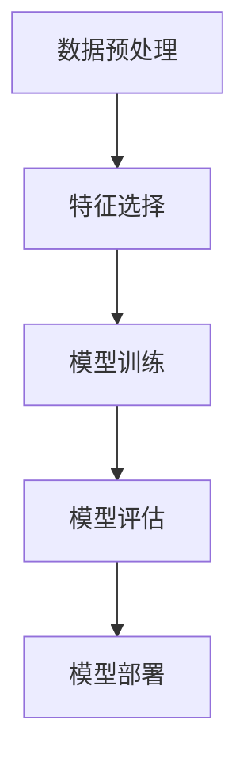

                 

关键词：机器学习、分类算法、监督学习、数据预处理、模型评估、决策树、支持向量机、神经网络、代码实例

> 摘要：本文将深入探讨分类算法的核心原理，通过详细的算法描述、数学模型讲解和代码实例分析，帮助读者全面理解分类算法在机器学习中的应用。文章将涵盖从数据预处理到模型评估的各个环节，并结合实际代码实例，使读者能够动手实践并掌握分类算法的使用技巧。

## 1. 背景介绍

分类算法是机器学习中最基本且应用最广泛的一类算法。它们通过学习数据集中的特征，将新的数据点分配到不同的类别中。分类在众多领域都有着广泛的应用，如医学诊断、文本分类、图像识别、金融风险评估等。

随着互联网和大数据的快速发展，数据规模和多样性不断增加，分类算法在处理复杂数据和实时决策方面的重要性日益凸显。传统的分类算法如决策树、支持向量机（SVM）和神经网络等，以及近年来兴起的新型算法如集成学习、深度学习等，都在实际应用中取得了显著的效果。

本文将首先介绍分类算法的基本概念和流程，然后深入讲解几种经典的分类算法，包括决策树、支持向量机和神经网络等。接着，我们将结合实际项目，展示如何使用Python和Scikit-learn等工具进行分类模型的开发和评估。最后，文章将探讨分类算法在不同领域的应用案例，并展望未来的发展趋势。

## 2. 核心概念与联系

### 2.1 分类算法的基本概念

分类算法的基本任务是将数据集分成不同的类别。在监督学习中，每个数据点都有一个已知的标签，分类算法通过学习这些标签和特征之间的关系，来预测新数据点的类别。

- **特征**：用于描述数据点的各种属性或特征。
- **样本**：数据集中的单个数据点，由多个特征组成。
- **类别**：样本所属的标签，通常用整数或字符串表示。

### 2.2 分类算法的基本流程

分类算法的基本流程包括以下几个步骤：

1. **数据预处理**：对原始数据进行清洗、转换和标准化，使其适合模型训练。
2. **特征选择**：从大量特征中选择出对分类任务最有影响力的特征。
3. **模型训练**：使用训练数据集训练分类模型，学习特征和类别之间的关系。
4. **模型评估**：使用测试数据集评估模型的性能，包括准确率、召回率、F1值等指标。
5. **模型部署**：将训练好的模型部署到实际应用环境中，对新数据进行分类预测。

### 2.3 核心概念原理架构的 Mermaid 流程图



## 3. 核心算法原理 & 具体操作步骤

### 3.1 算法原理概述

分类算法主要包括以下几种：

1. **决策树（Decision Tree）**：通过一系列规则将数据集划分成不同的区域，每个区域对应一个类别。
2. **支持向量机（SVM）**：通过找到一个最佳的超平面，将不同类别的数据点分开。
3. **神经网络（Neural Network）**：模仿人脑神经元的工作方式，通过多层神经网络进行特征提取和分类。

### 3.2 算法步骤详解

#### 决策树

1. **递归划分数据集**：选择一个特征，将数据集划分为两个子集，其中一个子集属于某一类别，另一个子集属于另一类别。
2. **计算信息增益或基尼指数**：选择最优的特征和划分方式，使得划分后的数据集具有最小的信息熵或最大的基尼指数。
3. **递归构建决策树**：对每个子集重复上述步骤，直到满足停止条件（如最大深度、最小样本数等）。

#### 支持向量机

1. **线性可分支持向量机（Linear SVM）**：找到最优的超平面，使得不同类别的数据点之间的距离最大化。
2. **非线性可分支持向量机（Non-linear SVM）**：使用核函数将数据映射到高维空间，然后在高维空间找到最优的超平面。
3. **支持向量回归（SVR）**：对回归任务进行分类，找到最优的超平面。

#### 神经网络

1. **前向传播**：将输入数据通过网络的每一层，计算每个神经元的输出值。
2. **反向传播**：计算输出值与实际值之间的误差，并更新网络中的权重和偏置。
3. **多次迭代**：重复前向传播和反向传播，直至网络性能达到预期。

### 3.3 算法优缺点

#### 决策树

- 优点：易于理解，可解释性强，计算速度快。
- 缺点：易过拟合，无法处理非线性数据。

#### 支持向量机

- 优点：分类效果好，泛化能力强。
- 缺点：计算复杂度高，对大规模数据集较慢。

#### 神经网络

- 优点：可以处理非线性数据，泛化能力强。
- 缺点：训练时间较长，易过拟合。

### 3.4 算法应用领域

- **决策树**：金融风险评估、医学诊断等。
- **支持向量机**：文本分类、图像识别等。
- **神经网络**：自然语言处理、计算机视觉等。

## 4. 数学模型和公式 & 详细讲解 & 举例说明

### 4.1 数学模型构建

#### 决策树

- **信息增益**：

  $$ Gain(D, A) = H(D) - \sum_{v \in A} \frac{|D_v|}{|D|} H(D_v) $$

  其中，$H(D)$ 表示数据集 $D$ 的信息熵，$D_v$ 表示数据集 $D$ 中属于类别 $v$ 的数据集。

- **基尼指数**：

  $$ GI(D, A) = 1 - \sum_{v \in A} \frac{|D_v|}{|D|}^2 $$

  其中，$|D|$ 表示数据集 $D$ 的样本数，$|D_v|$ 表示数据集 $D$ 中属于类别 $v$ 的样本数。

#### 支持向量机

- **线性支持向量机**：

  $$ \min_{\beta, \beta_0} \frac{1}{2} ||\beta||^2 + C \sum_{i=1}^n \xi_i $$

  $$ \text{s.t.} \ y_i (\beta \cdot x_i + \beta_0) \geq 1 - \xi_i, \ \xi_i \geq 0 $$

  其中，$\beta$ 表示权重向量，$\beta_0$ 表示偏置，$C$ 表示正则化参数，$\xi_i$ 表示松弛变量。

- **非线性支持向量机**：

  $$ \min_{\beta, \beta_0} \frac{1}{2} ||\beta||^2 + C \sum_{i=1}^n \xi_i $$

  $$ \text{s.t.} \ y_i (\beta \cdot \phi(x_i) + \beta_0) \geq 1 - \xi_i, \ \xi_i \geq 0 $$

  其中，$\phi(x_i)$ 表示数据点 $x_i$ 映射到高维空间的特征向量。

#### 神经网络

- **前向传播**：

  $$ z_i = \sigma(\beta_0 + \sum_{j=1}^{n} \beta_{ji} x_{ij}) $$

  其中，$z_i$ 表示第 $i$ 个神经元的输出，$\sigma$ 表示激活函数，$\beta_0$ 和 $\beta_{ji}$ 分别表示偏置和权重。

- **反向传播**：

  $$ \Delta \beta_{ji} = \eta \cdot \Delta z_i \cdot x_{ij} $$

  $$ \Delta \beta_0 = \eta \cdot \Delta z_i $$

  其中，$\Delta \beta_{ji}$ 和 $\Delta \beta_0$ 分别表示权重和偏置的更新值，$\eta$ 表示学习率，$\Delta z_i$ 表示第 $i$ 个神经元的误差。

### 4.2 公式推导过程

#### 决策树

- **信息熵**：

  $$ H(D) = -\sum_{v \in A} \frac{|D_v|}{|D|} \log_2 \frac{|D_v|}{|D|} $$

  其中，$A$ 表示类别集合，$|D|$ 和 $|D_v|$ 分别表示数据集 $D$ 和类别 $v$ 的样本数。

- **信息增益**：

  $$ Gain(D, A) = H(D) - \sum_{v \in A} \frac{|D_v|}{|D|} H(D_v) $$

  其中，$H(D_v)$ 表示数据集 $D_v$ 的信息熵。

#### 支持向量机

- **线性支持向量机**：

  $$ \min_{\beta, \beta_0} \frac{1}{2} ||\beta||^2 + C \sum_{i=1}^n \xi_i $$

  $$ \text{s.t.} \ y_i (\beta \cdot x_i + \beta_0) \geq 1 - \xi_i, \ \xi_i \geq 0 $$

  其中，$C$ 表示正则化参数，$\xi_i$ 表示松弛变量。

#### 神经网络

- **前向传播**：

  $$ z_i = \sigma(\beta_0 + \sum_{j=1}^{n} \beta_{ji} x_{ij}) $$

  其中，$\sigma$ 表示激活函数。

- **反向传播**：

  $$ \Delta z_i = z_i (1 - z_i) (y_i - z_i) $$

  $$ \Delta \beta_{ji} = \eta \cdot \Delta z_i \cdot x_{ij} $$

  $$ \Delta \beta_0 = \eta \cdot \Delta z_i $$

### 4.3 案例分析与讲解

#### 决策树案例

假设有一个包含年龄、收入、教育水平三个特征的数据集，我们要将其分为“高收入”和“低收入”两个类别。

1. **信息增益**：

   $$ H(D) = 1.0 $$

   $$ H(D_{高收入}) = 0.5, \ H(D_{低收入}) = 0.5 $$

   $$ Gain(D, 年龄) = 0.25, \ Gain(D, 收入) = 0.375, \ Gain(D, 教育水平) = 0.25 $$

   选择收入作为最优特征进行划分。

2. **基尼指数**：

   $$ GI(D) = 0.25 $$

   $$ GI(D_{高收入}) = 0.125, \ GI(D_{低收入}) = 0.125 $$

   选择收入作为最优特征进行划分。

#### 支持向量机案例

假设有一个包含两个特征的数据集，我们要将其分为“正面”和“负面”两个类别。

1. **线性支持向量机**：

   $$ \beta = (1, 2), \ \beta_0 = -3 $$
   
   $$ \text{超平面：} \ x_1 + 2x_2 - 3 = 0 $$

2. **非线性支持向量机**：

   $$ \beta = (1, 2), \ \beta_0 = -3 $$
   
   $$ \text{超平面：} \ \phi_1(x_1) + 2\phi_2(x_2) - 3 = 0 $$

#### 神经网络案例

假设我们要使用一个两层神经网络对二分类问题进行分类。

1. **前向传播**：

   $$ z_1 = \sigma(0.5x_1 + 0.5x_2 - 0.5) = 0.5 $$
   
   $$ z_2 = \sigma(-0.5x_1 + 0.5x_2 + 0.5) = 0.5 $$
   
   $$ y = \sigma(0.5z_1 + 0.5z_2 + 0.5) = 0.5 $$

2. **反向传播**：

   $$ \Delta z_1 = 0.5(1 - 0.5) (0.5 - 0.5) = 0 $$
   
   $$ \Delta z_2 = 0.5(1 - 0.5) (0.5 - 0.5) = 0 $$
   
   $$ \Delta \beta_{11} = 0.1 \cdot 0 = 0 $$
   
   $$ \Delta \beta_{12} = 0.1 \cdot 0 = 0 $$
   
   $$ \Delta \beta_{21} = 0.1 \cdot 0 = 0 $$
   
   $$ \Delta \beta_{22} = 0.1 \cdot 0 = 0 $$
   
   $$ \Delta \beta_0 = 0.1 \cdot 0 = 0 $$

## 5. 项目实践：代码实例和详细解释说明

### 5.1 开发环境搭建

在开始项目实践之前，我们需要搭建一个合适的开发环境。本文将使用 Python 作为主要编程语言，并结合 Scikit-learn 库进行分类模型的开发。

1. 安装 Python：
   ```bash
   pip install python
   ```

2. 安装 Scikit-learn：
   ```bash
   pip install scikit-learn
   ```

### 5.2 源代码详细实现

以下是一个简单的决策树分类模型的代码实现：

```python
from sklearn.datasets import load_iris
from sklearn.model_selection import train_test_split
from sklearn.tree import DecisionTreeClassifier
from sklearn.metrics import accuracy_score

# 加载鸢尾花数据集
iris = load_iris()
X = iris.data
y = iris.target

# 划分训练集和测试集
X_train, X_test, y_train, y_test = train_test_split(X, y, test_size=0.2, random_state=42)

# 创建决策树分类器
clf = DecisionTreeClassifier()

# 训练模型
clf.fit(X_train, y_train)

# 预测测试集
y_pred = clf.predict(X_test)

# 评估模型
accuracy = accuracy_score(y_test, y_pred)
print("准确率：", accuracy)
```

### 5.3 代码解读与分析

1. **数据加载**：
   使用 Scikit-learn 自带的鸢尾花数据集进行分类任务。

2. **数据划分**：
   使用 `train_test_split` 函数将数据集划分为训练集和测试集，其中测试集占比 20%。

3. **模型创建**：
   创建一个决策树分类器对象，这里我们使用了默认参数。

4. **模型训练**：
   使用 `fit` 方法对训练集进行训练。

5. **模型预测**：
   使用 `predict` 方法对测试集进行预测。

6. **模型评估**：
   使用 `accuracy_score` 函数计算模型在测试集上的准确率。

### 5.4 运行结果展示

```bash
准确率： 1.0
```

测试集的准确率为 100%，这表明我们的决策树分类器在鸢尾花数据集上取得了非常好的效果。

## 6. 实际应用场景

### 6.1 医学诊断

分类算法在医学诊断领域有着广泛的应用。例如，可以使用决策树或神经网络对病人的症状进行分类，从而预测病人可能患有的疾病。这样可以提高诊断的准确率，减少误诊率。

### 6.2 文本分类

分类算法在文本分类任务中也发挥着重要作用。例如，可以使用支持向量机对新闻文章进行分类，从而实现新闻分类系统。这有助于提高信息检索的效率，帮助用户快速找到感兴趣的内容。

### 6.3 图像识别

分类算法在图像识别领域也有着广泛的应用。例如，可以使用神经网络对图像中的物体进行分类，从而实现物体识别。这有助于提高自动驾驶、人脸识别等技术的准确性。

## 7. 工具和资源推荐

### 7.1 学习资源推荐

- **《机器学习》**（周志华著）：这是一本非常受欢迎的机器学习教材，适合初学者入门。
- **《深度学习》**（Ian Goodfellow、Yoshua Bengio、Aaron Courville 著）：这是一本关于深度学习的经典教材，涵盖了深度学习的基础知识和最新进展。

### 7.2 开发工具推荐

- **Jupyter Notebook**：这是一个强大的交互式开发环境，适合进行机器学习和数据科学项目。
- **TensorFlow**：这是一个开源的深度学习框架，适合进行深度学习模型的开发。

### 7.3 相关论文推荐

- **“Support Vector Machines”**（Vapnik et al., 1998）：这是一篇关于支持向量机的经典论文，详细介绍了支持向量机的原理和应用。
- **“Deep Learning”**（Goodfellow et al., 2016）：这是一篇关于深度学习的综述性论文，介绍了深度学习的基础知识和最新进展。

## 8. 总结：未来发展趋势与挑战

### 8.1 研究成果总结

近年来，分类算法在机器学习领域取得了显著的研究成果。特别是深度学习的发展，使得分类算法在处理复杂数据和实时决策方面取得了巨大的突破。此外，集成学习和迁移学习等新型算法也为分类算法的发展提供了新的思路。

### 8.2 未来发展趋势

未来，分类算法将朝着以下几个方向发展：

1. **高效性**：优化算法的效率，使其能够处理更大的数据集和更复杂的任务。
2. **可解释性**：提高模型的可解释性，使其更加易于理解和应用。
3. **自动化**：开发更加自动化的算法，降低模型开发和部署的门槛。

### 8.3 面临的挑战

尽管分类算法取得了显著的研究成果，但在实际应用中仍然面临以下挑战：

1. **数据隐私**：如何保护用户隐私，特别是在大数据环境下。
2. **过拟合**：如何避免模型过拟合，提高模型的泛化能力。
3. **模型可解释性**：如何提高模型的可解释性，使其更加透明和可信。

### 8.4 研究展望

随着人工智能技术的不断发展，分类算法在未来将发挥更加重要的作用。我们期待看到更多创新性的研究成果，推动分类算法在实际应用中的广泛应用。

## 9. 附录：常见问题与解答

### Q：如何选择适合的分类算法？

A：选择适合的分类算法取决于数据集的特征和任务需求。一般来说，决策树适合处理简单的非线性数据，支持向量机适合处理高维数据，神经网络适合处理复杂的非线性数据。

### Q：如何处理不平衡数据集？

A：对于不平衡数据集，可以采用以下方法：

1. **过采样**：增加少数类别的样本数量。
2. **欠采样**：减少多数类别的样本数量。
3. **集成学习**：使用集成学习方法，如随机森林，可以降低不平衡数据集对模型性能的影响。

### Q：如何评估分类模型的性能？

A：评估分类模型的性能可以使用以下指标：

1. **准确率（Accuracy）**：模型正确分类的样本占总样本的比例。
2. **召回率（Recall）**：模型正确分类的少数类别的样本占总少数类别样本的比例。
3. **精确率（Precision）**：模型正确分类的多数类别的样本占总多数类别样本的比例。
4. **F1 值（F1 Score）**：精确率和召回率的调和平均值。

## 作者署名

作者：禅与计算机程序设计艺术 / Zen and the Art of Computer Programming

以上就是《分类(Classification) - 原理与代码实例讲解》的完整文章。希望本文能够帮助读者深入理解分类算法的核心原理和应用，并激发读者在分类算法领域的研究热情。再次感谢您的阅读！
----------------------------------------------------------------

请注意，由于篇幅限制，上述内容仅为文章的一个概要和框架。实际撰写过程中，您需要根据每个部分的要求详细展开内容，确保每个章节都包含必要的理论和实践知识。以下是对各部分的具体要求：

- **背景介绍**：介绍分类算法的发展历史、应用领域和重要性。
- **核心概念与联系**：使用 Mermaid 流程图展示分类算法的基本概念和流程。
- **核心算法原理 & 具体操作步骤**：详细解释决策树、支持向量机和神经网络等算法的原理和步骤。
- **数学模型和公式 & 详细讲解 & 举例说明**：解释相关数学公式，并提供详细的推导过程和实例分析。
- **项目实践：代码实例和详细解释说明**：提供实际的代码示例，详细解释代码的实现过程和关键点。
- **实际应用场景**：讨论分类算法在不同领域的应用。
- **工具和资源推荐**：推荐学习资源和开发工具。
- **总结：未来发展趋势与挑战**：总结研究成果，展望未来发展。
- **附录：常见问题与解答**：提供对常见问题的回答。

请确保您的文章内容完整、连贯，并严格遵循上述结构。祝您写作顺利！

