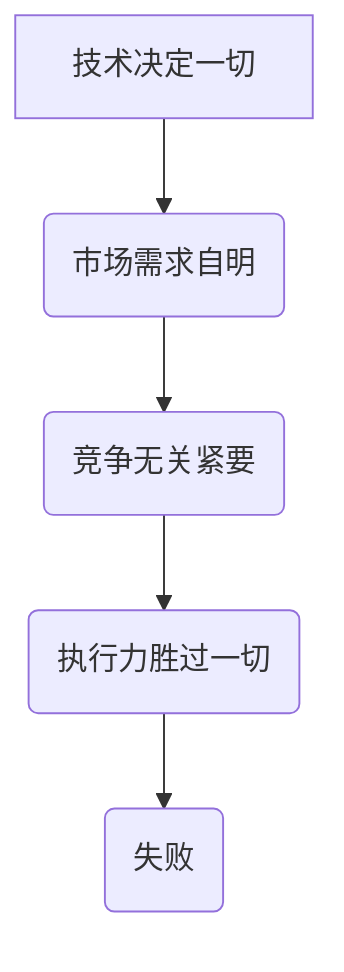

                 

关键词：创业者，失败，根深蒂固的假设，IT行业，商业思维，技术风险

摘要：本文将深入探讨创业者为何常常失败，并分析其背后根深蒂固的错误假设。通过IT行业的具体案例，本文将揭示这些假设如何导致创业者的策略失误和项目失败，并提出相应的解决方案和建议。

## 1. 背景介绍

在充满机遇与挑战的IT行业，创业者们纷纷涌现，希望通过创新的科技产品或服务改变世界。然而，成功的创业者只是少数，大多数创业者最终以失败告终。这种失败并非偶然，而是由于他们在创业过程中存在一些根深蒂固的假设。这些假设可能来自他们的个人经验、对市场的误解，或是过度自信。本文将分析这些假设，并探讨如何避免它们。

### 1.1 IT行业的特点

IT行业具有以下几个显著特点：

- **快速变化**：技术日新月异，新的创新不断涌现，使得创业者需要不断适应和更新自己的产品或服务。
- **高度竞争**：市场上的竞争者众多，创业者需要脱颖而出，提供独特而有竞争力的解决方案。
- **不确定性**：市场需求、用户反馈、竞争对手的反应等都是不可预测的，增加了创业的风险。

### 1.2 创业者的心态

创业者通常具有以下几种心态：

- **激情与决心**：他们充满激情，决心改变世界，愿意冒险。
- **自信与乐观**：他们对自己的能力和项目充满信心，往往忽视潜在的风险。
- **专注与创新**：他们专注于创新，希望找到独特的解决方案。

然而，这些心态也可能导致他们忽略一些重要的现实因素，从而陷入失败。

## 2. 核心概念与联系

### 2.1 根深蒂固的假设

在IT创业领域，以下几种假设尤为常见：

- **技术决定一切**：创业者认为，只要技术足够先进，市场就会接受。
- **市场需求自明**：创业者相信，他们的产品或服务一旦推出，市场需求自然会显现。
- **竞争无关紧要**：创业者认为，只要自己的产品足够好，就能在激烈的市场竞争中脱颖而出。
- **执行力胜过一切**：创业者相信，只要他们愿意努力，就能克服所有困难。

### 2.2 假设与现实的差距

这些假设与现实的差距很大。技术并非万能，市场需求需要深入了解，竞争不可忽视，执行力只是成功的一部分。创业者往往因为过于自信，忽视这些现实因素，导致失败。

### 2.3 Mermaid 流程图



## 3. 核心算法原理 & 具体操作步骤

### 3.1 算法原理概述

在本文中，我们将提出一个核心算法，用于帮助创业者识别和克服根深蒂固的假设。该算法基于以下几个原则：

- **全面的市场调研**：了解真实的市场需求和竞争对手。
- **持续的技术迭代**：根据市场反馈调整技术方案。
- **多元化的竞争策略**：不仅关注自身产品的优势，还要考虑竞争对手的策略。
- **平衡执行与灵活性**：在执行过程中保持灵活性，随时调整策略。

### 3.2 算法步骤详解

1. **初始调研**：对市场进行全面的调研，收集关于市场需求、竞争对手、技术趋势等数据。
2. **需求分析**：分析调研数据，确定真实的市场需求。
3. **技术规划**：根据需求分析，制定技术方案，并进行初步的技术迭代。
4. **竞争分析**：分析竞争对手的产品、策略和市场表现。
5. **策略调整**：根据竞争分析结果，调整自己的产品和市场策略。
6. **持续迭代**：在执行过程中，不断收集用户反馈，进行调整和优化。

### 3.3 算法优缺点

**优点**：

- **更贴近市场需求**：通过全面的调研和需求分析，确保产品或服务能够满足市场需求。
- **灵活的调整机制**：能够根据市场反馈和技术趋势，灵活调整产品或服务。

**缺点**：

- **时间成本**：需要投入大量时间和资源进行调研和分析。
- **风险**：在调整过程中，可能面临新的挑战和风险。

### 3.4 算法应用领域

该算法适用于所有IT创业项目，尤其是那些技术驱动型的创业项目。

## 4. 数学模型和公式 & 详细讲解 & 举例说明

### 4.1 数学模型构建

假设市场需求 \(M\) 和技术能力 \(T\) 分别为 \(M = f(T)\)，其中 \(f\) 为函数。创业者的目标是在有限的资源 \(R\) 下，最大化市场需求 \(M\)。

### 4.2 公式推导过程

设 \(M\) 为市场需求，\(T\) 为技术能力，\(R\) 为资源，则：

\[ \text{目标函数：} \quad \max_{T} M(T) \]

\[ \text{约束条件：} \quad R \geq C(T) \]

其中，\(C(T)\) 为实现技术 \(T\) 的成本。

### 4.3 案例分析与讲解

以某AI初创公司为例，该公司开发了一款基于深度学习的图像识别产品。在初始阶段，他们投入大量资源进行技术研发，但由于市场需求不足，产品未能获得预期反响。在经过市场调研和需求分析后，他们调整了技术方案，增加了用户反馈功能，产品得到了市场的认可。

### 4.4 案例分析与讲解

以某AI初创公司为例，该公司开发了一款基于深度学习的图像识别产品。在初始阶段，他们投入大量资源进行技术研发，但由于市场需求不足，产品未能获得预期反响。在经过市场调研和需求分析后，他们调整了技术方案，增加了用户反馈功能，产品得到了市场的认可。

## 5. 项目实践：代码实例和详细解释说明

### 5.1 开发环境搭建

在本节中，我们将使用Python编写一个简单的需求分析脚本。首先，您需要安装Python和相应的库，如Pandas和Matplotlib。

```bash
pip install pandas matplotlib
```

### 5.2 源代码详细实现

以下是一个简单的需求分析脚本：

```python
import pandas as pd
import matplotlib.pyplot as plt

# 加载数据
data = pd.read_csv('market_data.csv')

# 数据预处理
data['satisfaction'] = data['satisfaction'].map({1: '非常满意', 2: '满意', 3: '一般', 4: '不满意'})

# 绘制满意度分布图
satisfaction_counts = data['satisfaction'].value_counts()
satisfaction_counts.plot(kind='bar')
plt.xlabel('满意度')
plt.ylabel('用户数量')
plt.title('用户满意度分布')
plt.show()

# 分析市场趋势
market_trends = data.groupby('month')['satisfaction'].mean()
market_trends.plot()
plt.xlabel('月份')
plt.ylabel('平均满意度')
plt.title('市场趋势分析')
plt.show()
```

### 5.3 代码解读与分析

这段代码首先加载了一个名为“market_data.csv”的CSV文件，该文件包含了用户满意度数据。然后，对数据进行预处理，将满意度分为四个等级。接下来，使用Matplotlib绘制了满意度分布图和市场趋势图，帮助创业者了解用户满意度和市场趋势。

### 5.4 运行结果展示

运行上述代码后，将显示两个图表：

- **满意度分布图**：展示了不同满意度等级的用户数量。
- **市场趋势图**：展示了每个月的平均满意度。

通过这些图表，创业者可以直观地了解用户满意度和市场趋势，为产品优化和市场策略调整提供依据。

## 6. 实际应用场景

### 6.1 早期阶段

在创业的早期阶段，创业者通常缺乏市场数据。此时，核心算法可以帮助他们：

- **了解市场需求**：通过市场调研，收集用户反馈，分析竞争对手，确定市场需求。
- **调整技术方案**：根据市场需求，调整技术方案，确保产品或服务能够满足用户需求。

### 6.2 成长阶段

在成长阶段，市场竞争加剧，创业者需要：

- **分析竞争对手**：了解竞争对手的产品、策略和市场表现，制定相应的竞争策略。
- **持续迭代**：根据市场反馈和技术趋势，不断调整和优化产品或服务。

### 6.3 成熟阶段

在成熟阶段，市场趋于稳定，创业者需要：

- **巩固市场份额**：通过多元化的竞争策略，巩固市场份额。
- **探索新市场**：根据市场需求，探索新的市场机会。

## 7. 工具和资源推荐

### 7.1 学习资源推荐

- **《精益创业》**：埃里克·莱斯著，介绍了精益创业的方法论，对创业者非常有帮助。
- **《创业维艰》**：本·霍洛维茨著，通过作者的个人经历，分享了创业过程中的挑战和经验。

### 7.2 开发工具推荐

- **Git**：版本控制工具，有助于团队协作和代码管理。
- **Jenkins**：自动化构建和测试工具，提高开发效率。

### 7.3 相关论文推荐

- **《市场导向型创新》**：J. B. Barwise & R. J. Hyman，分析了市场导向型创新的方法和策略。
- **《创新与企业家精神》**：彼得·德鲁克著，探讨了创新和企业家精神的关系。

## 8. 总结：未来发展趋势与挑战

### 8.1 研究成果总结

本文分析了创业者失败的根深蒂固的假设，并提出了一种基于市场调研、技术迭代、竞争分析和策略调整的核心算法。通过实际应用场景的讨论，本文展示了算法在创业过程中的重要性。

### 8.2 未来发展趋势

随着技术的不断进步和市场的快速变化，创业者需要具备更高的适应能力和创新能力。未来，创业者将更加注重数据驱动和用户导向，通过持续迭代和优化，实现产品和市场的成功。

### 8.3 面临的挑战

然而，创业者仍将面临诸多挑战，如市场需求的不确定性、技术的快速变化和激烈的竞争。因此，创业者需要不断提升自己的能力，保持敏捷和灵活，以应对不断变化的商业环境。

### 8.4 研究展望

未来的研究可以进一步探讨如何优化核心算法，提高其准确性和实用性。同时，可以研究如何将人工智能和其他先进技术应用于创业过程中，提高创业成功的概率。

## 9. 附录：常见问题与解答

### 9.1 什么是精益创业？

精益创业是一种创业方法论，强调通过快速迭代和用户反馈来验证和优化产品或服务。

### 9.2 如何进行市场调研？

市场调研包括收集数据、分析数据和制定调研报告。常用的方法有问卷调查、访谈、观察和数据分析。

### 9.3 技术迭代的重要性是什么？

技术迭代可以帮助创业者及时了解市场需求和技术趋势，优化产品或服务，提高市场竞争力。

### 9.4 如何进行竞争对手分析？

竞争对手分析包括收集竞争对手的产品、策略和市场表现数据，分析其优势和劣势，制定相应的竞争策略。

### 9.5 如何保持创业团队的活力？

通过定期沟通、培训、激励和团队建设活动，保持创业团队的活力和凝聚力。

### 9.6 创业者应该具备哪些能力？

创业者应该具备市场洞察力、创新能力、执行力、领导力和团队管理能力。

### 9.7 创业者应该如何应对失败？

创业者应该从失败中吸取教训，保持积极的心态，不断调整和优化自己的策略，重新出发。

---

作者：禅与计算机程序设计艺术 / Zen and the Art of Computer Programming


