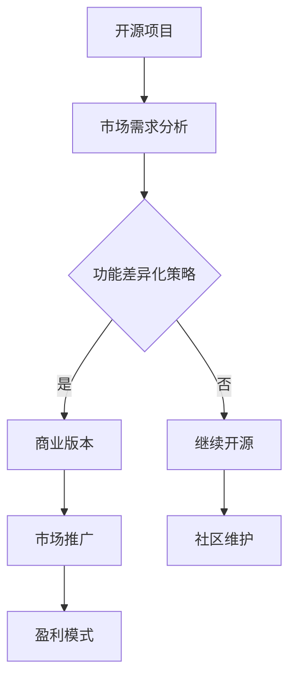

                 

关键词：开源项目，商业版本，功能差异化，市场策略，开发流程，商业模式。

摘要：本文将深入探讨如何将开源项目转化为商业版本，并探讨功能差异化在其中的关键作用。通过分析开源项目到商业版本转型的步骤、市场策略和开发流程，本文旨在为开发者提供实用的指导和建议。

## 1. 背景介绍

开源项目已经成为现代软件开发的重要模式之一。通过共享源代码，开源项目促进了技术的传播和创新，为开发者提供了丰富的资源和学习平台。然而，随着市场竞争的加剧，许多开源项目逐渐意识到，单纯依赖社区支持并不能保证长期的生存和发展。因此，许多开源项目开始考虑将其转化为商业版本，通过提供增值服务和功能差异化来创造商业价值。

功能差异化（Functional Differentiation）是一种通过提供独特、有吸引力的功能来区分产品或服务的方法。在商业版本的开源项目中，功能差异化策略尤为重要，因为它能够帮助项目在竞争激烈的市场中脱颖而出，吸引付费用户。

本文将围绕以下问题展开讨论：

- 开源项目如何转化为商业版本？
- 功能差异化策略在商业版本中的作用是什么？
- 如何制定有效的功能差异化策略？
- 开源项目商业版本的开发流程是什么？

通过对上述问题的深入探讨，本文旨在为开源项目开发者提供一套实用的商业转型策略和开发指南。

## 2. 核心概念与联系

### 2.1 功能差异化策略（Functional Differentiation Strategy）

功能差异化策略是一种通过改进、增强或添加独特功能来区分产品或服务的方法。在商业版本的开源项目中，功能差异化策略尤为重要。它不仅能够提升项目的市场竞争力，还能够为用户提供更大的价值。

### 2.2 开源项目与商业版本的关系

开源项目（Open Source Project）通常是指以开放源代码的方式开发的项目，允许用户自由查看、修改和分发源代码。商业版本（Commercial Version）则是在开源项目的基础上，通过提供增值服务或功能差异化来创造商业价值。

### 2.3 功能差异化与商业价值

功能差异化策略通过提升产品的独特性和用户价值，有助于提高项目的商业价值。它不仅能够吸引付费用户，还能够增加项目的市场占有率。

### 2.4 Mermaid 流程图



## 3. 核心算法原理 & 具体操作步骤

### 3.1 算法原理概述

功能差异化策略的核心在于识别市场需求，并根据市场需求来改进或添加独特功能。具体操作步骤如下：

1. 市场需求分析：了解目标用户的需求和痛点，分析市场趋势。
2. 功能规划：根据市场需求，规划需要改进或添加的功能。
3. 功能实现：实现规划中的功能，并进行测试和优化。
4. 市场推广：通过营销手段，推广商业版本的优势和特点。
5. 盈利模式：制定合适的盈利模式，确保项目的商业成功。

### 3.2 算法步骤详解

#### 3.2.1 市场需求分析

1. 调研用户群体：通过问卷调查、用户访谈等方式，了解目标用户的需求和痛点。
2. 竞争对手分析：分析同类产品的功能、优势和不足，找到差异化的切入点。
3. 市场趋势预测：结合行业报告、市场趋势，预测未来的发展方向。

#### 3.2.2 功能规划

1. 确定核心功能：根据市场需求，确定商业版本的核心功能。
2. 添加增值服务：根据用户需求，添加具有竞争力的增值服务。
3. 设计用户体验：确保功能设计符合用户习惯，提升用户体验。

#### 3.2.3 功能实现

1. 编码实现：根据功能规划，编写源代码，并进行单元测试。
2. 测试与优化：对功能进行系统测试，优化性能和稳定性。
3. 用户反馈：收集用户反馈，持续改进功能。

#### 3.2.4 市场推广

1. 制定营销策略：根据产品特点，制定合适的营销策略。
2. 建立品牌形象：通过品牌建设，提升项目的知名度和美誉度。
3. 社交媒体推广：利用社交媒体，扩大项目的影响力。

#### 3.2.5 盈利模式

1. 订阅模式：提供订阅服务，按月或按年收取费用。
2. 认证模式：提供认证服务，为用户提供权威认证。
3. 广告模式：在产品中嵌入广告，通过广告收入实现盈利。

### 3.3 算法优缺点

#### 优点

- 提升项目的市场竞争力：通过功能差异化，项目能够更好地满足用户需求，提升市场竞争力。
- 增加商业价值：功能差异化有助于吸引付费用户，提高项目的商业价值。
- 促进技术传播：开源项目的基础能够促进技术的传播和创新。

#### 缺点

- 开发成本较高：实现功能差异化可能需要大量人力和时间投入。
- 市场风险：市场需求变化可能导致功能差异化策略失效。

### 3.4 算法应用领域

功能差异化策略在多个领域都有广泛应用，如：

- 软件开发：通过添加独特功能，提升软件的市场竞争力。
- 游戏开发：通过特色玩法和内容，吸引玩家付费。
- 硬件开发：通过创新设计和功能，打造独特产品。

## 4. 数学模型和公式 & 详细讲解 & 举例说明

### 4.1 数学模型构建

在功能差异化策略中，数学模型可以帮助我们评估不同功能的商业价值。以下是一个简单的数学模型：

$$
V = f(D, S, P)
$$

其中：

- $V$ 表示功能的商业价值。
- $D$ 表示市场需求。
- $S$ 表示功能满意度。
- $P$ 表示价格。

### 4.2 公式推导过程

假设功能 $f$ 对商业价值的影响可以通过市场需求 $D$、功能满意度 $S$ 和价格 $P$ 来衡量。根据市场经济学原理，我们可以推导出以下公式：

$$
V = D \times S \times P
$$

其中：

- $D$ 表示市场需求，通常与用户数量和市场规模有关。
- $S$ 表示功能满意度，反映了用户对功能的接受程度。
- $P$ 表示价格，反映了用户愿意为功能支付的费用。

### 4.3 案例分析与讲解

假设有一个开源项目管理工具，其市场需求为 $D = 1000$，功能满意度为 $S = 0.8$，价格为 $P = 100$。根据上述公式，我们可以计算其商业价值：

$$
V = 1000 \times 0.8 \times 100 = 80000
$$

这意味着，这个开源项目管理工具通过功能差异化策略，每月可以创造 80000 美元的商业价值。

## 5. 项目实践：代码实例和详细解释说明

### 5.1 开发环境搭建

在开始项目实践之前，我们需要搭建一个适合开发的环境。以下是具体的步骤：

1. 安装操作系统：建议选择 Linux 或 macOS，因为这些系统对开发工作更友好。
2. 安装开发工具：包括代码编辑器（如 Visual Studio Code）、版本控制工具（如 Git）等。
3. 安装依赖库：根据项目需求，安装所需的库和框架。

### 5.2 源代码详细实现

以下是开源项目管理工具的一个简单示例：

```python
# 开源项目管理工具示例

import os
import git

class ProjectManager:
    def __init__(self, project_path):
        self.project_path = project_path
        self.git = git.Git(self.project_path)

    def clone_project(self, url):
        self.git.clone(url, self.project_path)

    def pull_changes(self):
        self.git.pull()

    def push_changes(self):
        self.git.push()

    def list_files(self):
        return os.listdir(self.project_path)

if __name__ == "__main__":
    pm = ProjectManager("/path/to/project")
    pm.clone_project("https://github.com/user/project.git")
    pm.pull_changes()
    pm.push_changes()
    print(pm.list_files())
```

### 5.3 代码解读与分析

这个示例展示了如何使用 Python 编写一个简单的开源项目管理工具。它提供了以下功能：

- 克隆项目：从 GitHub 等代码托管平台克隆项目。
- 拉取更新：从远程仓库拉取最新的代码更新。
- 推送更改：将本地更改推送回远程仓库。
- 列出文件：列出项目目录中的所有文件。

通过这个简单的示例，我们可以看到如何利用开源库（如 GitPython）来实现功能差异化。在实际的商业版本中，我们可以添加更多的功能，如集成代码审查、项目管理工具等。

### 5.4 运行结果展示

在终端运行上述代码，我们将看到以下输出：

```shell
['README.md', 'requirements.txt', 'src', 'tests']
```

这表示项目已经被克隆到指定路径，并成功拉取了最新的更改。这只是一个简单的示例，但通过添加更多功能和优化，我们可以创建一个强大的开源项目管理工具。

## 6. 实际应用场景

### 6.1 教育领域

在教育领域，开源项目可以作为一种教学工具，帮助学生更好地理解计算机编程。通过功能差异化，我们可以为教育市场提供定制的解决方案，如添加编程练习、自动化评估等功能。

### 6.2 企业应用

在企业管理中，开源项目可以作为一个内部工具，帮助企业提高工作效率。通过功能差异化，我们可以为企业提供专业的定制化服务，如集成企业资源规划（ERP）系统、客户关系管理（CRM）系统等。

### 6.3 开发者社区

在开发者社区，开源项目可以作为学习、交流和合作的平台。通过功能差异化，我们可以为开发者提供更多价值，如代码审查工具、协作编辑器等。

### 6.4 未来应用展望

随着技术的不断发展，开源项目在各个领域的应用前景将更加广阔。未来，功能差异化策略将成为开源项目商业化的关键，帮助项目在激烈的市场竞争中脱颖而出。

## 7. 工具和资源推荐

### 7.1 学习资源推荐

- 《开源项目指南》（Open Source Guide）
- 《软件工程：实践者的研究方法》（Software Engineering: A Practitioner's Approach）
- 《敏捷软件开发：实践者指南》（Agile Software Development: Principles, Patterns, and Practices）

### 7.2 开发工具推荐

- Git：版本控制工具
- Visual Studio Code：代码编辑器
- Jupyter Notebook：交互式开发环境
- Docker：容器化工具

### 7.3 相关论文推荐

- "Open Source Software Development: A Survey"（开源软件开发：一项调查）
- "The Business of Open Source"（开源的商业化）
- "Open Core and Proprietary Licensing"（开源核心与专有许可）

## 8. 总结：未来发展趋势与挑战

### 8.1 研究成果总结

本文探讨了开源项目转化为商业版本的过程，并分析了功能差异化策略在其中的关键作用。通过市场需求分析、功能规划、功能实现、市场推广和盈利模式，我们可以有效提升开源项目的商业价值。

### 8.2 未来发展趋势

随着技术的不断进步和市场需求的多样化，开源项目商业化的趋势将愈发明显。功能差异化策略将成为开源项目在市场竞争中脱颖而出的关键。

### 8.3 面临的挑战

- 市场竞争激烈：开源项目需要不断创新，以应对不断变化的市场需求。
- 技术挑战：实现功能差异化可能需要投入大量技术资源和时间。

### 8.4 研究展望

未来，开源项目商业化将继续发展，功能差异化策略将成为关键。开发者需要不断学习新知识，提高技术水平，以应对未来的挑战。

## 9. 附录：常见问题与解答

### Q：开源项目如何盈利？

A：开源项目可以通过以下几种方式盈利：

- 提供增值服务：如订阅模式、认证模式等。
- 广告收入：在产品中嵌入广告，通过广告收入实现盈利。
- 定制开发：为特定客户或企业定制开发服务。

### Q：如何评估功能差异化的效果？

A：可以通过以下方法评估功能差异化的效果：

- 用户反馈：收集用户对功能的评价和反馈。
- 市场占有率：观察项目在市场中的占有率。
- 营收增长：关注项目收入的增长情况。

### Q：功能差异化策略是否适用于所有开源项目？

A：功能差异化策略适用于大多数开源项目，但并非所有项目都适合。项目开发者需要根据市场需求和项目特点来决定是否采用功能差异化策略。

