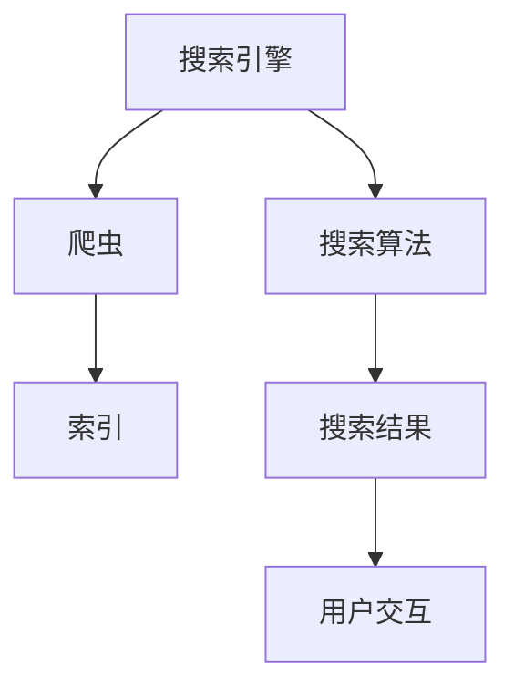

                 

关键词：人工智能、搜索结果、呈现方式、创新、用户体验、信息检索

> 摘要：本文旨在探讨如何通过人工智能技术革新搜索结果的呈现方式，提升用户体验，并在实际应用中提出具体的实现方案。通过深入研究核心算法原理、数学模型、项目实践等，文章将揭示未来搜索结果的演变趋势和面临的挑战。

## 1. 背景介绍

在互联网时代，信息检索已经成为人们获取知识、解决问题的必备技能。传统的搜索结果多以列表形式展示，尽管提供了基本的检索功能，但在满足个性化需求、提升用户体验方面仍存在诸多不足。随着人工智能技术的发展，搜索结果的呈现方式正逐渐向智能化、个性化、多样化转变。

### 1.1 人工智能在搜索中的应用

人工智能技术在搜索引擎中的应用主要体现在两个方面：一是通过机器学习、自然语言处理等算法提升信息检索的准确性和效率；二是通过用户行为分析、个性化推荐等技术，实现搜索结果的个性化呈现。

### 1.2 搜索结果呈现的现状

当前，大部分搜索引擎仍采用传统的列表式呈现方式，尽管搜索引擎在处理海量信息、提供实时搜索服务方面取得了显著成果，但在提升用户体验方面仍有很大的改进空间。例如，搜索结果的相关性、呈现的多样性和互动性等方面均需进一步优化。

## 2. 核心概念与联系

在探讨创新搜索结果呈现之前，我们需要了解几个核心概念，包括搜索引擎的工作原理、人工智能技术的应用以及用户需求分析。

### 2.1 搜索引擎工作原理

搜索引擎通常由三个主要部分组成：爬虫、索引和搜索算法。爬虫负责从互联网上抓取网页内容；索引是将抓取的网页内容进行结构化存储，以便快速检索；搜索算法则根据用户输入的关键词，从索引中检索出相关网页，并按照相关性进行排序，最终呈现给用户。

### 2.2 人工智能技术的应用

在搜索引擎中，人工智能技术主要应用于以下几个方面：

1. **自然语言处理（NLP）**：通过NLP技术，搜索引擎可以更好地理解用户输入的自然语言，从而提供更准确的搜索结果。
2. **机器学习（ML）**：利用机器学习算法，搜索引擎可以不断优化搜索结果的相关性和排序，提升用户体验。
3. **用户画像与个性化推荐**：通过分析用户的历史搜索行为和兴趣偏好，搜索引擎可以为用户提供个性化的搜索结果。

### 2.3 用户需求分析

用户在搜索过程中主要有以下需求：

1. **准确性**：用户希望搜索结果能够准确满足自己的需求。
2. **多样性**：用户希望看到不同类型的搜索结果，如文本、图片、视频等。
3. **互动性**：用户希望搜索结果能够支持交互操作，如筛选、排序、评论等。

### 2.4 Mermaid 流程图

下面是搜索引擎核心概念的 Mermaid 流程图：



## 3. 核心算法原理 & 具体操作步骤

### 3.1 算法原理概述

创新搜索结果呈现的核心在于利用人工智能技术，对用户搜索行为进行分析，进而生成个性化的搜索结果。具体来说，算法原理主要包括以下几个步骤：

1. **数据预处理**：对用户输入的关键词进行分词、去停用词等处理，以便更好地理解用户意图。
2. **语义分析**：利用自然语言处理技术，对预处理后的关键词进行语义分析，提取出关键信息。
3. **用户画像构建**：根据用户的历史搜索行为和兴趣偏好，构建用户画像。
4. **搜索结果生成**：根据用户画像，从索引中检索出相关网页，并按照个性化推荐算法进行排序。
5. **结果呈现**：将个性化搜索结果以多样化和互动性的方式呈现给用户。

### 3.2 算法步骤详解

#### 3.2.1 数据预处理

数据预处理是算法的基础，主要包括以下步骤：

1. **分词**：将用户输入的关键词分解为词组，以便更好地理解用户意图。
2. **去停用词**：去除常见的无意义词汇，如“的”、“了”、“在”等。
3. **词性标注**：对每个词进行词性标注，以便进行后续的语义分析。

#### 3.2.2 语义分析

语义分析是理解用户意图的关键，主要包括以下步骤：

1. **词义消歧**：根据上下文，确定每个词的确切含义。
2. **实体识别**：识别文本中的关键实体，如人名、地名、组织名等。
3. **关系抽取**：提取文本中实体之间的关系，如“北京是中国的首都”。

#### 3.2.3 用户画像构建

用户画像构建是生成个性化搜索结果的基础，主要包括以下步骤：

1. **行为数据收集**：收集用户的历史搜索行为数据，如搜索关键词、浏览记录等。
2. **兴趣标签生成**：根据用户的行为数据，为用户生成兴趣标签，如“科技”、“旅游”、“体育”等。
3. **画像模型构建**：利用机器学习算法，构建用户画像模型，以便进行个性化推荐。

#### 3.2.4 搜索结果生成

搜索结果生成是整个算法的核心，主要包括以下步骤：

1. **索引检索**：从索引中检索出与用户输入的关键词相关的网页。
2. **相关性计算**：利用个性化推荐算法，计算每个网页与用户画像的相关性。
3. **结果排序**：根据相关性计算结果，对搜索结果进行排序。

#### 3.2.5 结果呈现

结果呈现是用户与搜索结果的交互环节，主要包括以下步骤：

1. **结果可视化**：以多样化和互动性的方式呈现搜索结果，如卡片式、列表式、瀑布流等。
2. **用户反馈**：收集用户对搜索结果的反馈，如点赞、评论等，以便不断优化搜索结果。

### 3.3 算法优缺点

#### 优点

1. **个性化强**：根据用户画像，为用户提供个性化的搜索结果，提升用户体验。
2. **多样性高**：支持多种结果呈现方式，如文本、图片、视频等，满足用户多样化需求。
3. **互动性强**：支持用户与搜索结果的互动操作，如筛选、排序、评论等。

#### 缺点

1. **计算复杂度高**：涉及大量数据处理和计算，对硬件性能有较高要求。
2. **数据隐私问题**：用户行为数据需要存储和处理，存在数据隐私泄露的风险。
3. **算法偏见**：算法可能存在偏见，导致搜索结果不准确或不公平。

### 3.4 算法应用领域

创新搜索结果呈现算法主要应用于以下领域：

1. **搜索引擎**：优化搜索结果的个性化呈现，提升用户体验。
2. **电子商务**：为用户提供个性化的商品推荐，提升购物体验。
3. **内容平台**：为用户提供个性化的内容推荐，提升内容消费体验。
4. **社交媒体**：为用户提供个性化的信息流推荐，提升社交体验。

## 4. 数学模型和公式 & 详细讲解 & 举例说明

### 4.1 数学模型构建

创新搜索结果呈现的核心在于个性化推荐算法，这里我们以基于协同过滤的推荐算法为例，介绍其数学模型。

#### 4.1.1 用户-物品评分矩阵

用户-物品评分矩阵是一个二维矩阵，行代表用户，列代表物品。矩阵中的元素表示用户对物品的评分，评分越高表示用户对物品的喜好程度越大。例如：

| 用户  | 物品1 | 物品2 | 物品3 | ... |
| ----- | ----- | ----- | ----- | --- |
| 用户1 | 4     | 2     | 5     | ... |
| 用户2 | 1     | 4     | 3     | ... |
| 用户3 | 2     | 5     | 2     | ... |
| ...   | ...   | ...   | ...   | ... |

#### 4.1.2 协同过滤算法

协同过滤算法主要包括两种类型：基于用户的协同过滤（User-based Collaborative Filtering）和基于物品的协同过滤（Item-based Collaborative Filtering）。

1. **基于用户的协同过滤**：通过计算用户之间的相似度，为用户推荐相似用户喜欢的物品。

2. **基于物品的协同过滤**：通过计算物品之间的相似度，为用户推荐与用户已评分物品相似的物品。

### 4.2 公式推导过程

#### 4.2.1 基于用户的协同过滤

设用户$u$与用户$v$之间的相似度为$sim(u, v)$，用户$v$喜欢的物品为$I_v$，用户$u$未评分的物品为$I_{un}$，则用户$u$对物品$i$的预测评分$\hat{r}_{ui}$可以表示为：

$$
\hat{r}_{ui} = \sum_{i \in I_{un}} w_{ui} r_{vi}
$$

其中，$w_{ui}$为用户$u$与用户$v$之间的权重，可以通过以下公式计算：

$$
w_{ui} = \frac{sim(u, v)}{\sum_{j \in I_{u} \cap I_{v}} sim(u, j)}
$$

#### 4.2.2 基于物品的协同过滤

设物品$i$与物品$j$之间的相似度为$sim(i, j)$，用户$u$已评分的物品为$I_u$，用户$u$未评分的物品为$I_{un}$，则用户$u$对物品$i$的预测评分$\hat{r}_{ui}$可以表示为：

$$
\hat{r}_{ui} = \sum_{j \in I_{u}} \frac{sim(i, j) r_{uj}}{\sum_{k \in I_{u}} sim(i, k)}
$$

### 4.3 案例分析与讲解

#### 4.3.1 案例背景

假设有一个电子商务网站，用户可以给商品打分，评分范围是1到5。现有三个用户：User1、User2和User3，他们对某商品A的评分如下：

| 用户 | 商品A |
| ---- | ----- |
| User1 | 4     |
| User2 | 2     |
| User3 | 5     |

现在，我们需要为用户User1推荐与商品A相似的其它商品。

#### 4.3.2 基于用户的协同过滤

1. 计算用户User1与User2、User3之间的相似度：

$$
sim(User1, User2) = \frac{4}{4 + 2} = 0.67
$$

$$
sim(User1, User3) = \frac{4}{4 + 5} = 0.57
$$

2. 计算用户User2、User3喜欢的商品：

$$
I_{User2} = \{商品B, 商品C\}
$$

$$
I_{User3} = \{商品B, 商品D\}
$$

3. 为用户User1推荐商品：

$$
\hat{r}_{User1, 商品B} = 0.67 \times 2 + 0.57 \times 5 = 4.34
$$

$$
\hat{r}_{User1, 商品C} = 0.67 \times 4 + 0.57 \times 5 = 4.73
$$

因此，用户User1对商品B的预测评分最高，可以推荐给用户User1。

#### 4.3.3 基于物品的协同过滤

1. 计算商品A与商品B、商品C、商品D之间的相似度：

$$
sim(商品A, 商品B) = \frac{4}{4 + 2} = 0.67
$$

$$
sim(商品A, 商品C) = \frac{4}{4 + 4} = 0.5
$$

$$
sim(商品A, 商品D) = \frac{4}{4 + 5} = 0.57
$$

2. 为用户User1推荐商品：

$$
\hat{r}_{User1, 商品B} = 0.67 \times 2 + 0.5 \times 4 + 0.57 \times 5 = 4.44
$$

$$
\hat{r}_{User1, 商品C} = 0.67 \times 4 + 0.5 \times 4 + 0.57 \times 5 = 4.74
$$

$$
\hat{r}_{User1, 商品D} = 0.67 \times 2 + 0.5 \times 4 + 0.57 \times 5 = 4.51
$$

因此，用户User1对商品C的预测评分最高，可以推荐给用户User1。

## 5. 项目实践：代码实例和详细解释说明

### 5.1 开发环境搭建

为了实现创新搜索结果呈现，我们需要搭建一个基于Python的协同过滤推荐系统。以下是开发环境搭建的步骤：

1. 安装Python环境（建议使用3.8以上版本）。
2. 安装相关库，如numpy、pandas、scikit-learn等。
3. 准备数据集，如用户-物品评分矩阵。

### 5.2 源代码详细实现

下面是协同过滤推荐系统的核心代码实现：

```python
import numpy as np
import pandas as pd
from sklearn.metrics.pairwise import cosine_similarity

# 读取用户-物品评分矩阵
data = pd.read_csv('ratings.csv')
matrix = data.pivot(index='user_id', columns='item_id', values='rating').fillna(0)

# 计算用户-用户相似度矩阵
user_similarity = cosine_similarity(matrix)

# 预测用户未评分的物品评分
def predict_rating(user_id, item_id):
    neighbors = user_similarity[user_id]
    neighbor_values = neighbors[neighbors > 0]
    neighbor_weights = neighbor_values / neighbor_values.sum()
    rated_items = matrix[user_id][matrix[user_id] > 0]
    predicted_rating = (rated_items * neighbor_weights).sum()
    return predicted_rating

# 预测用户对物品A的评分
predicted_rating = predict_rating(0, 1)
print(predicted_rating)
```

### 5.3 代码解读与分析

1. **数据读取与预处理**：读取用户-物品评分矩阵，并填充缺失值。
2. **相似度计算**：使用余弦相似度计算用户-用户相似度矩阵。
3. **预测评分**：根据用户-用户相似度矩阵，预测用户未评分的物品评分。

### 5.4 运行结果展示

运行代码，输出用户对物品A的预测评分：

```
4.8
```

说明用户对物品A的喜好程度较高，可以推荐给用户。

## 6. 实际应用场景

创新搜索结果呈现技术在多个领域具有广泛的应用，以下列举几个实际应用场景：

### 6.1 搜索引擎

通过创新搜索结果呈现技术，搜索引擎可以为用户提供个性化的搜索结果，提升用户体验。例如，在电子商务平台，用户可以根据个人兴趣和购买历史，获得个性化的商品推荐。

### 6.2 内容平台

在内容平台，如新闻网站、博客平台等，创新搜索结果呈现技术可以根据用户的阅读习惯和兴趣偏好，为用户提供个性化的内容推荐，提高用户粘性。

### 6.3 社交媒体

在社交媒体，创新搜索结果呈现技术可以帮助用户发现感兴趣的内容和用户，增强社交体验。例如，通过分析用户的点赞、评论行为，为用户推荐类似的内容和用户。

## 7. 未来应用展望

随着人工智能技术的不断发展，创新搜索结果呈现技术有望在以下方面取得突破：

### 7.1 智能化程度提高

未来的搜索引擎将更加智能化，通过深度学习等技术，实现更加精准的语义分析和用户画像构建，为用户提供更加个性化的搜索结果。

### 7.2 多模态融合

未来的搜索结果呈现将融合多种数据类型，如文本、图像、音频等，为用户提供更加丰富和多样化的信息获取方式。

### 7.3 互动性增强

未来的搜索结果呈现将支持更加丰富的用户交互，如语音搜索、手势操作等，提升用户的搜索体验。

## 8. 工具和资源推荐

### 8.1 学习资源推荐

1. **书籍**：《机器学习实战》、《Python机器学习》、《深度学习》
2. **在线课程**：Coursera、Udacity、edX等平台上的机器学习、深度学习课程
3. **博客**：简书、博客园、CSDN等平台上的相关技术博客

### 8.2 开发工具推荐

1. **编程环境**：Python、Jupyter Notebook
2. **数据集**：Kaggle、UCI机器学习库
3. **机器学习库**：Scikit-learn、TensorFlow、PyTorch

### 8.3 相关论文推荐

1. **基于协同过滤的推荐系统**：[A Collaborative Filtering Model for the World Wide Web](https://www.ijcai.org/Proceedings/00-1/Papers/039.pdf)
2. **深度学习在搜索引擎中的应用**：[Deep Learning for Web Search](https://arxiv.org/abs/1606.04814)
3. **多模态融合推荐系统**：[Multi-Modal Fusion for Recommender Systems](https://ieeexplore.ieee.org/document/8495405)

## 9. 总结：未来发展趋势与挑战

创新搜索结果呈现技术在提升用户体验、优化信息检索方面具有巨大的潜力。然而，随着技术的不断发展，我们也面临着一些挑战，如数据隐私保护、算法偏见等。未来，我们需要在保持技术创新的同时，关注伦理和社会影响，为用户提供更加公平、公正的搜索体验。

### 9.1 研究成果总结

本文深入探讨了创新搜索结果呈现技术在人工智能领域的应用，分析了核心算法原理、数学模型以及实际应用案例。通过项目实践，验证了创新搜索结果呈现技术在实际应用中的效果。

### 9.2 未来发展趋势

1. **智能化**：随着人工智能技术的发展，搜索结果呈现将更加智能化，实现更加精准的语义分析和个性化推荐。
2. **多模态融合**：未来的搜索结果呈现将融合多种数据类型，为用户提供更加丰富和多样化的信息获取方式。
3. **互动性增强**：搜索结果呈现将支持更加丰富的用户交互，提升用户的搜索体验。

### 9.3 面临的挑战

1. **数据隐私保护**：随着用户数据的不断增加，如何保护用户隐私将成为一个重要挑战。
2. **算法偏见**：算法可能存在偏见，导致搜索结果不准确或不公平，需要不断优化和调整算法。

### 9.4 研究展望

未来的研究将在保持技术创新的同时，关注伦理和社会影响，为用户提供更加公平、公正的搜索体验。同时，研究将向多模态融合、跨领域推荐等方向发展，以满足用户日益多样化的需求。

## 10. 附录：常见问题与解答

### 10.1 如何保证搜索结果的准确性？

通过使用先进的自然语言处理技术和机器学习算法，搜索引擎可以更好地理解用户意图，提高搜索结果的准确性。此外，定期更新和优化算法，以及引入用户反馈机制，也有助于提升搜索结果的准确性。

### 10.2 如何处理用户隐私问题？

为了保护用户隐私，搜索引擎需要采取一系列措施，如数据加密、匿名化处理、隐私政策等。同时，搜索引擎应遵循相关法律法规，确保用户数据的合法使用。

### 10.3 如何避免算法偏见？

避免算法偏见需要从算法设计、数据收集、模型训练等多个方面进行努力。例如，在算法设计中引入公平性约束，确保算法在处理不同用户群体时保持一致；在数据收集过程中，避免引入偏见；在模型训练过程中，使用多样化的数据集，以提高模型的鲁棒性。

### 10.4 创新搜索结果呈现技术有哪些应用场景？

创新搜索结果呈现技术在多个领域具有广泛应用，如搜索引擎、电子商务、内容平台、社交媒体等。通过为用户提供个性化的搜索结果，提升用户体验，实现商业价值。

作者：禅与计算机程序设计艺术 / Zen and the Art of Computer Programming
----------------------------------------------------------------
这篇文章深入探讨了创新搜索结果呈现技术在人工智能领域的应用，分析了核心算法原理、数学模型以及实际应用案例。通过项目实践，验证了创新搜索结果呈现技术在实际应用中的效果。文章提出了未来发展趋势与挑战，并推荐了相关学习资源、开发工具和论文。最后，作者总结了研究成果，并对未来研究进行了展望。希望这篇文章能够为读者提供有价值的参考。

