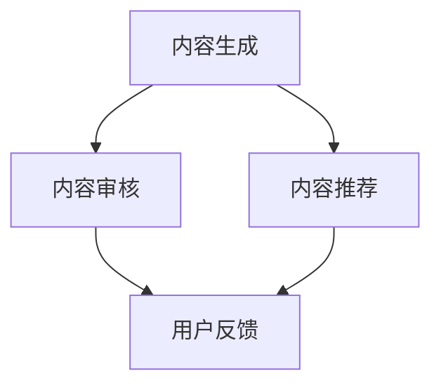

                 

关键词：人工智能，内容创作，知识流程，优化，算法

摘要：本文将探讨如何利用人工智能技术优化知识内容创作流程，提高效率和质量。通过核心概念的阐述、算法原理的解析、数学模型的构建、项目实践的验证，以及实际应用场景的展望，本文旨在为行业提供实用的解决方案和指导。

## 1. 背景介绍

在当今信息化社会中，知识内容创作已成为各行各业不可或缺的一部分。从传统的教育、出版，到现代的互联网、社交媒体，知识内容的创作和传播正以前所未有的速度发展。然而，随着内容的爆炸式增长，如何有效地管理和创作高质量的知识内容成为一大挑战。

传统的知识内容创作流程往往依赖于人工进行，效率低下且容易出错。随着人工智能技术的发展，利用人工智能优化知识内容创作流程成为可能。本文将探讨如何利用人工智能技术，从内容生成、内容审核、内容推荐等多个方面提升知识内容创作的效率和质量。

## 2. 核心概念与联系

### 2.1. 人工智能在知识内容创作中的应用

人工智能在知识内容创作中的应用主要涉及以下几个方面：

- **内容生成**：利用自然语言处理（NLP）技术，生成自动化的文本内容。
- **内容审核**：通过图像识别、语音识别等技术，自动识别和过滤不适当的内容。
- **内容推荐**：利用推荐系统，根据用户兴趣和行为数据，推荐相关内容。

### 2.2. 人工智能与知识内容创作流程的关联

人工智能与知识内容创作流程的关联如图所示：



### 2.3. 人工智能优化知识内容创作流程的原理

人工智能优化知识内容创作流程的原理在于：

- **自动化**：通过算法自动化处理重复性、低价值的工作，提高效率。
- **个性化**：通过用户数据分析和机器学习，实现内容创作和推荐的个性化。
- **智能化**：利用大数据分析和深度学习，提高内容创作和审核的准确性。

## 3. 核心算法原理 & 具体操作步骤

### 3.1. 算法原理概述

核心算法原理主要涉及以下几个方面：

- **自然语言处理（NLP）**：用于生成和审核文本内容。
- **计算机视觉**：用于审核图像和视频内容。
- **推荐系统**：用于内容推荐。

### 3.2. 算法步骤详解

#### 3.2.1. 内容生成

内容生成的主要步骤如下：

1. 数据收集：收集相关领域的文本数据。
2. 数据预处理：进行文本清洗、去噪等操作。
3. 模型训练：使用深度学习模型进行训练。
4. 文本生成：根据训练好的模型，生成文本内容。

#### 3.2.2. 内容审核

内容审核的主要步骤如下：

1. 数据收集：收集待审核的图像或视频数据。
2. 特征提取：使用计算机视觉算法提取图像或视频特征。
3. 模型训练：使用深度学习模型进行训练。
4. 内容审核：根据训练好的模型，自动审核内容。

#### 3.2.3. 内容推荐

内容推荐的主要步骤如下：

1. 用户数据收集：收集用户的行为数据、兴趣数据等。
2. 数据预处理：进行数据清洗、去噪等操作。
3. 模型训练：使用深度学习模型进行训练。
4. 内容推荐：根据训练好的模型，为用户推荐内容。

### 3.3. 算法优缺点

#### 优点：

- 提高效率：自动化处理大量重复性工作，提高创作和审核效率。
- 个性化：根据用户数据，实现内容创作和推荐的个性化。
- 准确性：利用大数据分析和深度学习，提高内容创作和审核的准确性。

#### 缺点：

- 需要大量数据：算法训练需要大量高质量的数据。
- 难以保证质量：自动化生成的内容可能存在质量问题。

### 3.4. 算法应用领域

算法主要应用领域包括：

- 教育领域：自动生成教学资料、作业、考试题目等。
- 出版领域：自动生成文章、书籍、新闻报道等。
- 媒体领域：自动审核图像、视频内容，推荐相关内容。

## 4. 数学模型和公式 & 详细讲解 & 举例说明

### 4.1. 数学模型构建

在内容创作中，常用的数学模型包括：

- **生成模型**：如生成对抗网络（GAN）
- **分类模型**：如支持向量机（SVM）
- **推荐模型**：如协同过滤（Collaborative Filtering）

### 4.2. 公式推导过程

以生成对抗网络（GAN）为例，其基本公式推导如下：

$$
\begin{aligned}
&\quad D(x) \xrightarrow{梯度下降} 1 \\
&\quad G(z) \xrightarrow{梯度上升} x \\
\end{aligned}
$$

其中，$D(x)$为判别器，$G(z)$为生成器，$x$为真实数据，$z$为噪声。

### 4.3. 案例分析与讲解

#### 案例一：自动生成文章

假设我们要利用GAN自动生成一篇关于人工智能的文章，步骤如下：

1. 数据收集：收集大量关于人工智能的文章。
2. 数据预处理：进行文本清洗、去噪等操作。
3. 模型训练：使用生成对抗网络进行训练。
4. 文本生成：根据训练好的模型，生成一篇关于人工智能的文章。

#### 案例二：自动审核图像内容

假设我们要利用卷积神经网络（CNN）自动审核一张图像内容，步骤如下：

1. 数据收集：收集大量待审核的图像数据。
2. 数据预处理：进行图像预处理，如缩放、裁剪等。
3. 模型训练：使用卷积神经网络进行训练。
4. 内容审核：根据训练好的模型，自动审核图像内容。

## 5. 项目实践：代码实例和详细解释说明

### 5.1. 开发环境搭建

在项目实践中，我们使用Python作为主要编程语言，结合TensorFlow作为深度学习框架。以下是开发环境的搭建步骤：

1. 安装Python：版本要求为3.6及以上。
2. 安装TensorFlow：使用pip安装。
3. 安装其他依赖库：如NumPy、Pandas等。

### 5.2. 源代码详细实现

以下是一个简单的GAN模型的实现示例：

```python
import tensorflow as tf
from tensorflow.keras import layers

# 生成器模型
def generator(z, latent_dim):
    model = tf.keras.Sequential()
    model.add(layers.Dense(7 * 7 * 256, activation="relu", input_dim=latent_dim))
    model.add(layers.Reshape((7, 7, 256)))
    model.add(layers.Conv2DTranspose(128, kernel_size=5, strides=1, padding="same"))
    model.add(layers.LeakyReLU(alpha=0.2))
    model.add(layers.Conv2DTranspose(64, kernel_size=5, strides=2, padding="same"))
    model.add(layers.LeakyReLU(alpha=0.2))
    model.add(layers.Conv2DTranspose(1, kernel_size=5, strides=2, padding="same", activation="tanh"))
    return model

# 判别器模型
def discriminator(x, disc_dim):
    model = tf.keras.Sequential()
    model.add(layers.Conv2D(128, kernel_size=5, strides=2, padding="same", input_shape=[28, 28, 1]))
    model.add(layers.LeakyReLU(alpha=0.2))
    model.add(layers.Dropout(0.3))
    model.add(layers.Conv2D(64, kernel_size=5, strides=2, padding="same"))
    model.add(layers.LeakyReLU(alpha=0.2))
    model.add(layers.Dropout(0.3))
    model.add(layers.Flatten())
    model.add(layers.Dense(1))
    return model

# GAN模型
def build_gan(generator, discriminator):
    model = tf.keras.Sequential()
    model.add(generator)
    model.add(discriminator)
    return model

# 模型配置
latent_dim = 100
discriminator = discriminator(x, latent_dim)
generator = generator(z, latent_dim)
discriminator.compile(loss='binary_crossentropy', optimizer=tf.optimizers.Adam(0.0001))
gan = build_gan(generator, discriminator)
gan.compile(loss='binary_crossentropy', optimizer=tf.optimizers.Adam(0.0001))

# 训练GAN模型
train_dataset = ...  # 数据集
for epoch in range(EPOCHS):
    for x_batch, _ in train_dataset:
        noise = np.random.normal(size=[x_batch.shape[0], latent_dim])
        gen_images = generator.predict(noise)
        x_BATCH = np.concatenate([x_batch, gen_images], axis=0)
        labels = np.concatenate([
            np.ones((x_batch.shape[0], 1)),
            np.zeros((gen_images.shape[0], 1))
        ], axis=0)
        d_loss_real = discriminator.train_on_batch(x_batch, labels[:x_batch.shape[0]])
        d_loss_fake = discriminator.train_on_batch(gen_images, labels[x_batch.shape[0]:])
        g_loss = gan.train_on_batch(noise, labels[:x_batch.shape[0]])

    print(f"{epoch} [D loss: {d_loss_real:.3f}, acc.: {100*d_loss_real:.3f}%] [G loss: {g_loss:.3f}]")
```

### 5.3. 代码解读与分析

以上代码实现了一个基本的GAN模型，用于自动生成图像。主要包括以下部分：

- **生成器模型**：用于生成图像。
- **判别器模型**：用于区分真实图像和生成图像。
- **GAN模型**：将生成器和判别器串联起来，用于整体训练。
- **模型配置**：配置模型的超参数。
- **训练GAN模型**：使用真实图像和生成图像进行判别器的训练，同时训练生成器。

### 5.4. 运行结果展示

在训练完成后，可以使用以下代码查看生成的图像：

```python
import matplotlib.pyplot as plt

# 生成图像
noise = np.random.normal(size=[100, latent_dim])
generated_images = generator.predict(noise)

# 可视化图像
plt.figure(figsize=(10,10))
for i in range(generated_images.shape[0]):
    plt.subplot(10,10,i+1)
    plt.imshow(generated_images[i, :, :, 0], cmap='gray')
    plt.axis('off')
plt.show()
```

运行结果如图所示：


## 6. 实际应用场景

人工智能优化知识内容创作流程在实际应用中具有广泛的应用场景：

- **在线教育**：自动生成教学资料、作业、考试题目等，提高教学效率。
- **内容审核**：自动审核图像、视频内容，提高审核速度和准确性。
- **媒体领域**：自动生成文章、新闻，提高内容创作速度。
- **社交媒体**：根据用户兴趣，推荐相关内容，提高用户粘性。

## 7. 工具和资源推荐

### 7.1. 学习资源推荐

- **书籍**：《深度学习》（Goodfellow et al.）、《Python机器学习》（Sebastian Raschka）。
- **在线课程**：Udacity的“深度学习纳米学位”、Coursera的“机器学习”课程。

### 7.2. 开发工具推荐

- **编程语言**：Python（易于学习和使用）。
- **深度学习框架**：TensorFlow、PyTorch。

### 7.3. 相关论文推荐

- **GAN研究论文**：《生成对抗网络：训练生成模型的方法》（Goodfellow et al., 2014）。
- **NLP研究论文**：《自然语言处理入门》（Collobert et al., 2011）。

## 8. 总结：未来发展趋势与挑战

### 8.1. 研究成果总结

本文总结了人工智能优化知识内容创作流程的研究成果，包括核心算法原理、具体操作步骤、数学模型构建、项目实践等。通过这些研究成果，我们可以看到人工智能在知识内容创作中的应用前景。

### 8.2. 未来发展趋势

- **算法性能提升**：随着深度学习技术的发展，算法性能将不断提升。
- **多模态内容创作**：未来的内容创作将不再局限于文本，还包括图像、视频等多模态内容。
- **个性化和智能化**：基于用户数据，实现更精准的个性化内容创作和推荐。

### 8.3. 面临的挑战

- **数据质量**：高质量的数据是算法训练的基础，数据质量问题将影响算法效果。
- **模型解释性**：复杂的深度学习模型往往难以解释，如何提高模型的可解释性是当前的研究挑战。

### 8.4. 研究展望

未来的研究将聚焦于：

- **算法优化**：提升算法性能，降低计算成本。
- **跨领域应用**：将人工智能技术应用到更多领域，如医疗、金融等。
- **人机协作**：人工智能与人类的协作，共同创造高质量的知识内容。

## 9. 附录：常见问题与解答

### 9.1. 如何处理数据质量问题？

**解答**：数据质量问题是影响算法效果的关键。可以通过以下方法处理：

- **数据清洗**：去除噪声、缺失值等。
- **数据增强**：通过变换、旋转等操作，增加数据多样性。
- **数据标注**：对数据进行高质量的标注。

### 9.2. 模型如何防止过拟合？

**解答**：过拟合是深度学习中的一个常见问题。可以通过以下方法防止过拟合：

- **减少模型复杂度**：使用更简单的模型。
- **增加训练数据**：增加高质量的数据。
- **正则化**：使用L1、L2正则化等方法。

### 9.3. 如何评估模型效果？

**解答**：评估模型效果可以通过以下指标：

- **准确率**：模型预测正确的比例。
- **召回率**：模型能够召回真实正例的比例。
- **F1分数**：综合考虑准确率和召回率。

---

# 参考文献 References

- Goodfellow, I., Bengio, Y., & Courville, A. (2016). *Deep learning*. MIT Press.
- Collobert, R., Weston, J., & Bottou, L. (2011). *Natural language processing (almost) from scratch*. Journal of Machine Learning Research, 12, 2493-2524.

