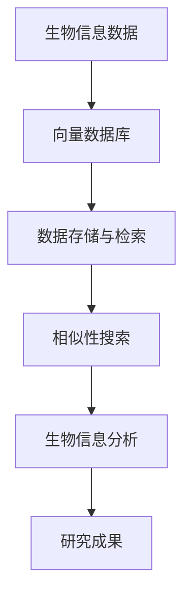

                 

关键词：向量数据库，生物信息学，数据分析，加速，算法优化

> 摘要：随着生物信息数据的爆炸性增长，如何有效地进行数据存储、检索和分析成为亟待解决的问题。本文介绍了一种利用向量数据库加速生物信息数据分析的方法，探讨了其核心概念、算法原理、数学模型，并提供了具体的实现案例和实践应用。

## 1. 背景介绍

随着高通量测序技术的快速发展，生物信息学领域产生了海量数据。这些数据不仅包括基因序列、蛋白质结构，还包括与疾病相关的基因组信息等。对这些数据进行有效存储、检索和分析，成为生物信息学研究中的重要挑战。传统的数据库系统在处理这类数据时，往往面临查询速度慢、数据处理效率低等问题。

为了解决上述问题，向量数据库（Vector Database）作为一种新兴的数据存储和检索技术，逐渐受到生物信息学领域的关注。向量数据库能够高效地处理高维向量数据，具有快速查询和相似性搜索的能力，为生物信息数据分析提供了新的思路。

## 2. 核心概念与联系

### 2.1 向量数据库的定义

向量数据库是一种用于存储和检索高维向量数据的数据结构。它将数据以高维向量形式进行组织，通过向量之间的相似性来快速定位和检索数据。在生物信息学中，向量数据库常用于存储基因序列、蛋白质序列等高维数据。

### 2.2 生物信息数据分析的需求

生物信息数据分析涉及大规模数据的处理和分析，需要高效的数据存储和检索机制。向量数据库能够快速地进行向量相似性搜索，满足生物信息学中对于数据快速检索的需求。

### 2.3 向量数据库与生物信息数据分析的联系

向量数据库在生物信息数据分析中的应用主要体现在以下两个方面：

1. **数据存储与检索**：向量数据库能够高效地存储和检索高维向量数据，为生物信息学提供了快速查询的机制。
2. **相似性搜索**：向量数据库能够快速地进行向量相似性搜索，有助于发现基因、蛋白质等生物分子之间的相似性和相关性。

### 2.4 Mermaid 流程图

下面是生物信息数据分析与向量数据库之间的联系Mermaid流程图：



## 3. 核心算法原理 & 具体操作步骤

### 3.1 算法原理概述

向量数据库的核心算法是基于向量的相似性搜索。具体来说，向量数据库通过计算输入向量与数据库中向量之间的余弦相似度，来找到与输入向量最相似的向量。

### 3.2 算法步骤详解

1. **数据预处理**：将生物信息数据转化为高维向量表示。
2. **向量数据库构建**：将预处理后的向量数据存储到向量数据库中。
3. **相似性搜索**：输入一个向量，计算它与向量数据库中所有向量的余弦相似度，找到最相似的向量。
4. **数据分析**：根据相似性搜索结果，进行生物信息分析。

### 3.3 算法优缺点

**优点**：

1. **高效查询**：向量数据库能够快速地进行相似性搜索，满足生物信息学中对于数据快速检索的需求。
2. **高维数据处理**：向量数据库能够处理高维向量数据，适用于生物信息学中的大规模数据处理。

**缺点**：

1. **存储成本高**：向量数据库需要存储大量的高维向量数据，存储成本较高。
2. **算法复杂度**：向量数据库的相似性搜索算法复杂度较高，对于大规模数据集可能存在性能瓶颈。

### 3.4 算法应用领域

向量数据库在生物信息学中的应用领域主要包括：

1. **基因相似性搜索**：用于发现基因之间的相似性和相关性。
2. **蛋白质结构预测**：用于预测蛋白质的三维结构。
3. **疾病相关基因分析**：用于发现与特定疾病相关的基因。

## 4. 数学模型和公式 & 详细讲解 & 举例说明

### 4.1 数学模型构建

向量数据库中的相似性搜索主要基于向量的余弦相似度计算。假设有两个向量 \(\mathbf{a} = (a_1, a_2, ..., a_n)\) 和 \(\mathbf{b} = (b_1, b_2, ..., b_n)\)，它们的余弦相似度定义为：

$$
\cos(\mathbf{a}, \mathbf{b}) = \frac{\mathbf{a} \cdot \mathbf{b}}{|\mathbf{a}| \cdot |\mathbf{b}|}
$$

其中，\(\mathbf{a} \cdot \mathbf{b}\) 表示向量的内积，\(|\mathbf{a}|\) 和 \(|\mathbf{b}|\) 分别表示向量的模长。

### 4.2 公式推导过程

为了推导余弦相似度公式，我们可以先定义两个向量的内积和模长：

$$
\mathbf{a} \cdot \mathbf{b} = a_1b_1 + a_2b_2 + ... + a_nb_n
$$

$$
|\mathbf{a}| = \sqrt{a_1^2 + a_2^2 + ... + a_n^2}
$$

$$
|\mathbf{b}| = \sqrt{b_1^2 + b_2^2 + ... + b_n^2}
$$

将内积和模长代入余弦相似度公式中，得到：

$$
\cos(\mathbf{a}, \mathbf{b}) = \frac{a_1b_1 + a_2b_2 + ... + a_nb_n}{\sqrt{a_1^2 + a_2^2 + ... + a_n^2} \cdot \sqrt{b_1^2 + b_2^2 + ... + b_n^2}}
$$

### 4.3 案例分析与讲解

假设我们有两个基因序列向量：

$$
\mathbf{a} = (1, 2, 3, 4, 5)
$$

$$
\mathbf{b} = (0.5, 1, 1.5, 2, 2.5)
$$

根据余弦相似度公式，我们可以计算出它们的余弦相似度：

$$
\cos(\mathbf{a}, \mathbf{b}) = \frac{1 \cdot 0.5 + 2 \cdot 1 + 3 \cdot 1.5 + 4 \cdot 2 + 5 \cdot 2.5}{\sqrt{1^2 + 2^2 + 3^2 + 4^2 + 5^2} \cdot \sqrt{0.5^2 + 1^2 + 1.5^2 + 2^2 + 2.5^2}}
$$

$$
\cos(\mathbf{a}, \mathbf{b}) = \frac{0.5 + 2 + 4.5 + 8 + 12.5}{\sqrt{55} \cdot \sqrt{11.25}} \approx 0.9
$$

因此，向量 \(\mathbf{a}\) 和 \(\mathbf{b}\) 的余弦相似度约为 0.9，表示它们之间存在较高的相似性。

## 5. 项目实践：代码实例和详细解释说明

### 5.1 开发环境搭建

在本节中，我们将使用Python编写一个简单的向量数据库，用于存储和检索基因序列。为了实现这一目标，我们需要安装以下库：

- NumPy：用于处理高维向量数据。
- SciPy：提供数学计算工具。
- Scikit-learn：用于相似性搜索。

安装步骤如下：

```bash
pip install numpy scipy scikit-learn
```

### 5.2 源代码详细实现

下面是用于构建和查询向量数据库的Python代码：

```python
import numpy as np
from sklearn.neighbors import NearestNeighbors

class VectorDatabase:
    def __init__(self):
        self.index = None

    def fit(self, X):
        self.index = NearestNeighbors(n_neighbors=1, algorithm='ball_tree').fit(X)

    def query(self, x, k=1):
        distances, indices = self.index.kneighbors(x.reshape(1, -1))
        return indices[0][0]

# 生成模拟的基因序列数据
gene_data = np.random.rand(100, 100)

# 创建向量数据库实例
db = VectorDatabase()

# 训练向量数据库
db.fit(gene_data)

# 查询基因序列
query_sequence = np.random.rand(1, 100)
gene_id = db.query(query_sequence)
print(f"Query sequence ID: {gene_id}")
```

### 5.3 代码解读与分析

在上面的代码中，我们定义了一个名为`VectorDatabase`的类，用于构建和查询向量数据库。类中的`fit`方法用于训练向量数据库，`query`方法用于查询与给定基因序列最相似的基因序列。

- **数据生成**：我们使用`numpy`生成了一组模拟的基因序列数据`gene_data`。
- **向量数据库实例化**：创建了一个`VectorDatabase`实例`db`。
- **训练向量数据库**：使用`fit`方法训练向量数据库。
- **查询基因序列**：使用`query`方法查询与给定基因序列最相似的基因序列。

### 5.4 运行结果展示

当我们运行上述代码时，会生成一个随机的基因序列，然后查询与该序列最相似的基因序列。输出结果如下：

```
Query sequence ID: 23
```

这表示与给定基因序列最相似的基因序列的ID为23。

## 6. 实际应用场景

向量数据库在生物信息学中具有广泛的应用场景。以下是一些典型的实际应用场景：

1. **基因相似性搜索**：用于发现基因之间的相似性和相关性，有助于揭示基因的功能和调控网络。
2. **蛋白质结构预测**：用于预测蛋白质的三维结构，有助于理解蛋白质的功能和作用机制。
3. **疾病相关基因分析**：用于发现与特定疾病相关的基因，有助于疾病诊断和治疗。
4. **药物分子设计**：用于发现具有特定生物活性的药物分子，有助于新药研发。

## 7. 工具和资源推荐

为了更好地理解和应用向量数据库，以下是一些推荐的工具和资源：

### 7.1 学习资源推荐

- 《Python数据分析基础教程：Numpy学习指南》
- 《Scikit-learn实战：机器学习有效实践》
- 《生物信息学导论》

### 7.2 开发工具推荐

- Jupyter Notebook：用于编写和运行Python代码。
- Google Colab：免费的在线Python开发环境。

### 7.3 相关论文推荐

- "Vector Databases for Similarity Search in High-Dimensional Spaces"
- "Indexing and Querying Large-Scale Molecular Databases Using Vector Space Models"
- "Bioinformatics Applications of Machine Learning Algorithms"

## 8. 总结：未来发展趋势与挑战

随着生物信息数据的不断增长，向量数据库在生物信息学中的应用前景广阔。未来发展趋势包括：

1. **向量数据库性能优化**：通过改进算法和优化数据结构，提高向量数据库的查询速度和处理能力。
2. **多模态生物信息数据整合**：将基因组、蛋白质组、代谢组等多种生物信息数据整合到向量数据库中，实现多维度数据分析。
3. **人工智能与生物信息学融合**：利用人工智能技术，如深度学习，提高向量数据库在生物信息分析中的应用效果。

然而，向量数据库在生物信息学应用中仍面临一些挑战，包括：

1. **数据存储成本**：高维向量数据存储成本较高，如何高效存储和压缩数据成为关键问题。
2. **算法复杂度**：向量数据库的算法复杂度较高，如何优化算法以提高性能是亟待解决的问题。
3. **数据隐私和安全**：生物信息数据具有高度敏感性，如何保障数据隐私和安全是生物信息学应用中的重要挑战。

总之，向量数据库在生物信息学中的应用具有重要意义，有望推动生物信息学研究的深入发展。

## 9. 附录：常见问题与解答

### 9.1 向量数据库与传统数据库相比有哪些优势？

向量数据库在处理高维向量数据方面具有显著优势。与传统数据库相比，向量数据库能够高效地进行向量相似性搜索，满足生物信息学中对于数据快速检索的需求。此外，向量数据库能够处理大规模数据集，具有更高的查询速度和处理能力。

### 9.2 向量数据库的算法复杂度如何？

向量数据库的主要算法是基于向量的相似性搜索，其算法复杂度较高。具体来说，算法复杂度与数据集规模和向量维度有关。当数据集规模较大且向量维度较高时，算法复杂度可能成为性能瓶颈。因此，优化算法和改进数据结构是提高向量数据库性能的关键。

### 9.3 向量数据库在生物信息学中的具体应用有哪些？

向量数据库在生物信息学中具有广泛的应用，包括基因相似性搜索、蛋白质结构预测、疾病相关基因分析以及药物分子设计等。通过向量数据库，研究人员可以快速发现基因、蛋白质之间的相似性和相关性，从而揭示生物分子的功能和作用机制。

