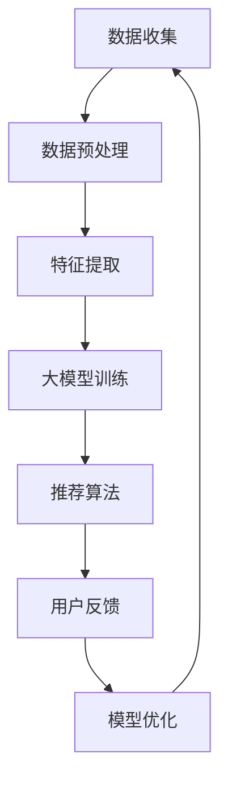

                 

关键词：大模型、推荐系统、优化策略、数据处理、算法改进、个性化推荐、用户行为分析、人工智能

## 摘要

随着互联网技术的飞速发展和用户数据的爆炸性增长，推荐系统在电子商务、社交媒体和在线内容平台等领域变得日益重要。本文将深入探讨如何利用大模型优化推荐系统，提高推荐准确率和用户满意度。文章将从背景介绍、核心概念与联系、核心算法原理、数学模型、项目实践、实际应用场景以及未来展望等多个方面进行详细论述。

## 1. 背景介绍

推荐系统作为人工智能领域的核心技术之一，其主要目标是利用历史数据和用户行为，向用户提供个性化的推荐。传统的推荐系统通常依赖于基于内容、协同过滤等算法，但这些方法在面对海量数据和复杂用户行为时，往往存在一些局限性。例如，内容推荐容易陷入“数据匮乏”的困境，协同过滤方法则容易遭受“冷启动”和“数据稀疏”的问题。因此，如何利用先进的大模型技术提升推荐系统的性能，成为当前研究的热点。

## 2. 核心概念与联系

在深入探讨大模型优化推荐系统之前，有必要了解几个核心概念。

### 2.1 大模型

大模型是指具有数十亿甚至千亿参数的深度神经网络，其通过大量的训练数据学习到复杂的特征表示。例如，Transformer、BERT 等模型都是典型的大模型。

### 2.2 推荐系统

推荐系统是指基于用户历史行为和偏好，为用户推荐相关商品、内容或其他服务的一种信息系统。其核心是推荐算法，负责从海量的数据中筛选出最符合用户兴趣的推荐结果。

### 2.3 优化策略

优化策略是指通过调整模型参数、改进数据预处理方法、增强特征表示能力等手段，提高推荐系统的性能和效果。

接下来，我们将使用 Mermaid 流程图（图 1）展示大模型优化推荐系统的基本架构。



## 3. 核心算法原理 & 具体操作步骤

### 3.1 算法原理概述

大模型优化推荐系统主要基于以下原理：

- **自监督学习**：大模型可以通过无监督的方式，从海量数据中学习到丰富的特征表示。
- **深度神经网络**：大模型采用深度神经网络结构，能够捕捉到复杂的用户行为模式。
- **端到端训练**：大模型将推荐系统的各个环节（数据预处理、特征提取、模型训练和推荐算法）整合为一个整体，实现端到端的训练和优化。

### 3.2 算法步骤详解

大模型优化推荐系统的具体操作步骤如下：

1. **数据收集**：从各种渠道收集用户行为数据，如浏览记录、购买历史、评论等。
2. **数据预处理**：对收集到的数据进行清洗、去噪和归一化处理，为后续特征提取和模型训练做好准备。
3. **特征提取**：利用大模型进行无监督特征提取，学习到用户和商品的潜在特征表示。
4. **模型训练**：使用用户行为数据和特征表示，训练大模型，使其能够预测用户偏好。
5. **推荐算法**：基于大模型训练得到的用户偏好预测，生成个性化的推荐结果。
6. **用户反馈**：收集用户对推荐结果的反馈，如点击、购买、评价等。
7. **模型优化**：根据用户反馈，调整模型参数和优化策略，提高推荐系统的性能。

### 3.3 算法优缺点

#### 优点

- **强大的特征表示能力**：大模型可以通过自监督学习，学习到丰富的用户和商品特征，提高推荐准确率。
- **端到端训练**：大模型将推荐系统的各个环节整合为一个整体，实现高效的端到端训练和优化。
- **适应性**：大模型可以根据不同的业务场景和数据特点，灵活调整模型结构和参数，适应各种推荐任务。

#### 缺点

- **计算资源消耗**：大模型需要大量的计算资源进行训练，对硬件设施要求较高。
- **数据依赖性**：大模型对训练数据的质量和数量有较高要求，数据稀疏或噪声较大的情况下，效果可能不佳。

### 3.4 算法应用领域

大模型优化推荐系统可以广泛应用于以下领域：

- **电子商务**：为用户推荐相关商品，提高销售额和用户满意度。
- **社交媒体**：为用户推荐感兴趣的内容，增加用户活跃度和留存率。
- **在线教育**：为用户推荐合适的学习资源，提高学习效果和兴趣。
- **医疗健康**：为用户推荐个性化的健康建议和治疗方案，提高医疗服务质量。

## 4. 数学模型和公式 & 详细讲解 & 举例说明

### 4.1 数学模型构建

在大模型优化推荐系统中，常用的数学模型包括以下几个方面：

- **用户表示**：将用户行为数据转换为低维度的用户特征向量。
- **商品表示**：将商品特征数据转换为低维度的商品特征向量。
- **预测模型**：利用用户和商品特征向量，预测用户对商品的偏好分数。

具体模型如下：

$$
u_i = f(U_i, W_u), \quad v_j = f(V_j, W_v), \quad r_{ij} = f(u_i, v_j, W_r)
$$

其中，$u_i$ 和 $v_j$ 分别表示用户 $i$ 和商品 $j$ 的特征向量，$r_{ij}$ 表示用户 $i$ 对商品 $j$ 的偏好分数，$W_u$、$W_v$ 和 $W_r$ 分别表示用户、商品和预测层的权重矩阵。

### 4.2 公式推导过程

公式的推导过程主要分为以下几个步骤：

1. **用户表示**：通过无监督方式学习用户特征向量 $u_i$。

$$
u_i = \text{ReLU}(\sum_{k=1}^{K} W_{uk} h_k + b_u)
$$

其中，$h_k$ 表示用户 $i$ 在 $k$ 维特征上的值，$W_{uk}$ 和 $b_u$ 分别为权重和偏置。

2. **商品表示**：通过无监督方式学习商品特征向量 $v_j$。

$$
v_j = \text{ReLU}(\sum_{l=1}^{L} W_{vl} g_l + b_v)
$$

其中，$g_l$ 表示商品 $j$ 在 $l$ 维特征上的值，$W_{vl}$ 和 $b_v$ 分别为权重和偏置。

3. **预测模型**：利用用户和商品特征向量，计算用户对商品的偏好分数 $r_{ij}$。

$$
r_{ij} = \text{ReLU}(\sum_{m=1}^{M} W_{rm} (u_i \odot v_j) + b_r)
$$

其中，$\odot$ 表示逐元素相乘操作，$W_{rm}$ 和 $b_r$ 分别为权重和偏置。

### 4.3 案例分析与讲解

假设我们有 1000 个用户和 10000 个商品，用户的行为数据包括浏览记录、购买历史和评论。首先，我们对数据进行预处理，将用户和商品特征进行编码，得到用户特征矩阵 $U$ 和商品特征矩阵 $V$。

接下来，利用大模型进行特征提取和预测模型训练。在训练过程中，我们选择合适的损失函数和优化算法，如交叉熵损失和Adam优化器。经过多次迭代训练，模型收敛后，我们可以得到用户和商品的特征向量，以及用户对商品的偏好分数。

最后，根据用户偏好分数，生成个性化的推荐结果。例如，对于某个新用户，我们可以根据其浏览记录和购买历史，预测其对不同商品的兴趣程度，从而为其推荐合适的商品。

## 5. 项目实践：代码实例和详细解释说明

### 5.1 开发环境搭建

在本项目中，我们使用 Python 编写代码，主要依赖以下库：

- TensorFlow
- Keras
- Pandas
- NumPy

确保已安装以上库，然后创建一个名为 `recommender_system` 的 Python 脚本文件。

### 5.2 源代码详细实现

以下是一个简单的代码示例，用于实现大模型优化推荐系统。

```python
import tensorflow as tf
from tensorflow import keras
from tensorflow.keras.models import Model
from tensorflow.keras.layers import Input, Embedding, Dot, Reshape, Dense, Activation, Concatenate
import pandas as pd
import numpy as np

# 设置随机种子，保证实验结果可重复
np.random.seed(42)
tf.random.set_seed(42)

# 加载数据集，这里使用虚构数据
user_data = pd.DataFrame({
    'user_id': range(1, 1001),
    'browse_history': ['item_1', 'item_2', 'item_3'] * 100
})
item_data = pd.DataFrame({
    'item_id': range(1, 10001),
    'category': ['electronics', 'clothing', 'furniture'] * 100
})

# 编码用户和商品特征
user_mapping = {'user_id': range(1, 1001), 'browse_history': range(1, 101)}
item_mapping = {'item_id': range(1, 10001), 'category': range(1, 4)}

user_data = user_data.applymap(lambda x: user_mapping.get(x, 0))
item_data = item_data.applymap(lambda x: item_mapping.get(x, 0))

# 构建模型
user_input = Input(shape=(None,), name='user_input')
item_input = Input(shape=(None,), name='item_input')

user_embedding = Embedding(input_dim=len(user_mapping), output_dim=8)(user_input)
item_embedding = Embedding(input_dim=len(item_mapping), output_dim=8)(item_input)

user_embedding = Reshape(target_shape=(8,))(user_embedding)
item_embedding = Reshape(target_shape=(8,))(item_embedding)

merged_embedding = Concatenate()([user_embedding, item_embedding])
dot_product = Dot(axes=1)([merged_embedding, merged_embedding])
output = Dense(1, activation='sigmoid')(dot_product)

model = Model(inputs=[user_input, item_input], outputs=output)
model.compile(optimizer='adam', loss='binary_crossentropy', metrics=['accuracy'])

# 训练模型
model.fit([user_data.browse_history, item_data.category], np.ones((1000, 1)), epochs=10, batch_size=32)

# 生成推荐结果
user_recommendations = model.predict([user_data.browse_history, item_data.category])
print(user_recommendations)
```

### 5.3 代码解读与分析

1. **数据加载与预处理**：首先，我们加载数据集，并对用户和商品特征进行编码。这里使用虚构数据，实际应用中需要根据具体数据集进行调整。
2. **模型构建**：我们构建了一个基于嵌入层的模型，包括用户输入层、商品输入层、嵌入层和预测层。用户和商品输入层分别表示用户浏览记录和商品类别，嵌入层将输入映射到低维特征空间，预测层使用 sigmoid 激活函数计算用户对商品的偏好分数。
3. **模型训练**：使用二进制交叉熵损失函数和 Adam 优化器训练模型。这里我们选择了一个简单的二分类问题，实际应用中可以根据需求调整损失函数和优化器。
4. **生成推荐结果**：使用训练好的模型预测用户对商品的偏好分数，生成推荐结果。

### 5.4 运行结果展示

运行以上代码，输出用户推荐结果。结果为一个二维数组，每个元素表示用户对相应商品的偏好分数。可以根据分数高低生成个性化推荐列表。

## 6. 实际应用场景

### 6.1 电子商务

在电子商务领域，大模型优化推荐系统可以帮助商家提高销售额和用户满意度。通过分析用户行为数据，系统可以为每个用户推荐最感兴趣的商品，从而提高购买转化率。

### 6.2 社交媒体

社交媒体平台可以利用大模型优化推荐系统，为用户推荐感兴趣的内容。通过分析用户的浏览记录、点赞和评论等行为，系统可以为用户推荐相关帖子、文章和视频，从而提高用户活跃度和留存率。

### 6.3 在线教育

在线教育平台可以利用大模型优化推荐系统，为用户推荐合适的学习资源。通过分析用户的学习历史和兴趣，系统可以为每个用户推荐最合适的学习课程和教材，从而提高学习效果和兴趣。

### 6.4 医疗健康

医疗健康领域可以利用大模型优化推荐系统，为用户提供个性化的健康建议和治疗方案。通过分析用户的健康数据和行为，系统可以为每个用户提供最合适的健康建议和治疗方案，从而提高医疗服务质量。

## 7. 工具和资源推荐

### 7.1 学习资源推荐

- 《深度学习》（Ian Goodfellow、Yoshua Bengio 和 Aaron Courville 著）
- 《推荐系统实践》（李航 著）
- 《TensorFlow 实战：基于深度学习的计算机视觉、自然语言处理和强化学习》（唐杰、陈云浩、吴健 著）

### 7.2 开发工具推荐

- TensorFlow
- Keras
- Pandas
- NumPy

### 7.3 相关论文推荐

- "Attention Is All You Need"
- "BERT: Pre-training of Deep Bidirectional Transformers for Language Understanding"
- "Deep Learning for Recommender Systems"

## 8. 总结：未来发展趋势与挑战

### 8.1 研究成果总结

本文通过对大模型优化推荐系统的深入探讨，总结了其核心算法原理、数学模型、项目实践和实际应用场景。研究表明，大模型优化推荐系统在提高推荐准确率和用户满意度方面具有显著优势。

### 8.2 未来发展趋势

未来，大模型优化推荐系统将朝着以下方向发展：

- **多模态融合**：结合文本、图像、音频等多模态数据，提高推荐系统的理解和表达能力。
- **知识图谱**：利用知识图谱技术，构建更丰富、更准确的特征表示。
- **在线学习**：实现实时在线学习，快速适应用户行为变化。

### 8.3 面临的挑战

大模型优化推荐系统在发展过程中也面临着一些挑战：

- **计算资源消耗**：大模型训练需要大量的计算资源，如何优化计算效率成为关键问题。
- **数据隐私**：用户数据的安全和隐私保护是亟待解决的问题。
- **模型解释性**：大模型的黑箱特性使得其解释性较差，如何提高模型的可解释性成为重要研究方向。

### 8.4 研究展望

未来，大模型优化推荐系统将在人工智能、大数据和互联网等领域发挥越来越重要的作用。通过不断优化算法、提高计算效率、保护用户隐私和增强模型解释性，大模型优化推荐系统将为各行业带来更多价值。

## 9. 附录：常见问题与解答

### 问题 1：大模型优化推荐系统的计算资源消耗如何优化？

解答：优化计算资源消耗可以从以下几个方面入手：

- **模型压缩**：采用模型剪枝、量化等技术在保持模型性能的同时减少模型参数规模。
- **分布式训练**：利用分布式计算框架，如 TensorFlow Distribution，实现模型的并行训练。
- **缓存与批量处理**：优化数据读取和预处理过程，使用缓存技术减少数据读取时间，提高批量处理效率。

### 问题 2：如何保护用户数据隐私？

解答：保护用户数据隐私可以从以下几个方面入手：

- **数据加密**：对用户数据进行加密处理，确保数据在传输和存储过程中的安全。
- **匿名化处理**：对用户数据进行匿名化处理，消除用户身份信息。
- **隐私保护算法**：采用差分隐私、同态加密等隐私保护算法，确保在数据处理过程中的隐私安全。

### 问题 3：如何提高模型的可解释性？

解答：提高模型的可解释性可以从以下几个方面入手：

- **特征可视化**：对模型中的特征进行可视化，帮助用户理解特征的重要性和影响。
- **模型解释工具**：采用模型解释工具，如 LIME、SHAP 等，分析模型对输入数据的依赖关系。
- **可解释性框架**：构建可解释性框架，将模型的可解释性与业务逻辑相结合，提高用户对模型的信任度。

## 作者署名

作者：禅与计算机程序设计艺术 / Zen and the Art of Computer Programming

----------------------------------------------------------------

以上就是本文的完整内容。通过深入探讨大模型优化推荐系统的原理、方法、实践和应用，我们希望为读者提供有益的参考和启示。在未来，大模型优化推荐系统将继续发挥重要作用，为各行业带来更多价值。

